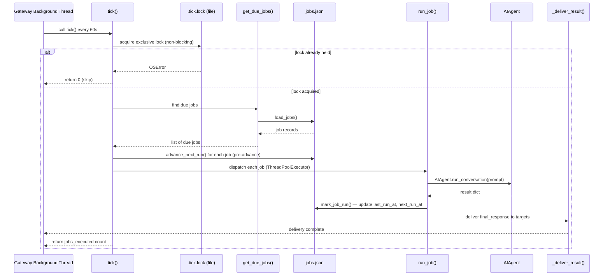

**TL;DR** — Hermes's cron scheduler lets an agent do recurring work entirely on its own: a gateway background thread calls `tick()` every 60 seconds, which finds due jobs, runs an `AIAgent` (or a plain script), and delivers the result to a chat or file. This chapter walks through how `tick()` works, the three schedule kinds, what happens when the gateway was down for a while, the `no_agent` script-only mode, `context_from` job chaining, and the 600-second inactivity timeout that guards hung jobs.

# The Cron Scheduler — tick(), Job Kinds, and Inactivity Timeout

## Why you need a scheduler at all

An agent that only acts when you send it a message is useful, but it cannot do anything on its own timeline. Suppose you want a nightly summary of GitHub issues, or an hourly check of a service endpoint, or a Monday-morning digest of the previous week's news. None of those can be driven by a user message — they need to fire at a predetermined time whether you are at the keyboard or not.

Hermes has three autonomous-trigger mechanisms: the cron scheduler (time-based), webhook subscriptions (event-based), and the kanban dispatcher (work-queue-based). This chapter covers the cron scheduler specifically. It is *not* a "heartbeat" — it does not pulse the agent to keep it alive; it fires jobs on a schedule you define.

> **Prerequisite — the AIAgent:** The cron scheduler ultimately runs an `AIAgent` to execute each job. `AIAgent` is the core runtime that manages the conversation loop, tool execution, and model communication. For a full introduction, see [The AIAgent and Conversation Loop](../core-runtime/aiagent-and-conversation-loop.md). We will recap just enough here to follow the scheduler's behavior.

> **Prerequisite — the home directory:** All cron state lives under `~/.hermes/cron/`. The `~/.hermes/` directory layout and the concept of profiles are introduced in [Home Directory and Profiles](../persistence/home-directory-and-profiles.md).

---

## Where jobs are stored

Before we look at `tick()`, we need to know where the scheduler reads its work from. All jobs are stored in a single JSON file:

```
~/.hermes/cron/jobs.json
```

Output from each run is written to:

```
~/.hermes/cron/output/<job_id>/<timestamp>.md
```

The `jobs.json` file is a dict with a `"jobs"` array. Each entry in the array is a *job record* — a Python dict that describes the schedule, prompt, delivery target, and run history for one job. `load_jobs()` and `save_jobs()` in `cron/jobs.py` manage the file with atomic writes (write to a temp file, then rename), so a crash mid-write cannot corrupt the database.

The `CRON_DIR` and `OUTPUT_DIR` are created on first use with `0700` permissions so only the owning user can read job definitions and output.

---

## tick() — the heartbeat of the scheduler

The gateway runs a background thread that calls `tick()` every 60 seconds. `tick()` is defined in `cron/scheduler.py` (line 2016) and is the single entry point for all cron execution. Its job is simple in principle: find every job whose scheduled time has passed, and run it.

Let's look at what `tick()` actually does, step by step.

### Acquiring the file lock

The first thing `tick()` does is try to acquire a *file-based lock* at:

```
~/.hermes/cron/.tick.lock
```

On Unix this is an `fcntl.LOCK_EX | LOCK_NB` exclusive non-blocking lock. On Windows it uses `msvcrt.locking`. If another `tick()` is already running (say, a manual `hermes cron tick` overlapping with the background ticker), the new call returns immediately with `0` rather than racing.

```python
# Simplified view of tick()'s lock section — cron/scheduler.py
lock_fd = open(lock_file, "w")
try:
    fcntl.flock(lock_fd, fcntl.LOCK_EX | fcntl.LOCK_NB)  # non-blocking
except OSError:
    lock_fd.close()
    return 0  # another tick holds the lock — skip
```

This design means you can safely run `hermes cron tick` from a shell without worrying about conflicts with the live gateway ticker.

### Finding due jobs

Once the lock is held, `tick()` calls `get_due_jobs()` from `cron/jobs.py`. This function loads all jobs, filters to those that are enabled, and for each job compares `next_run_at` against the current time. We will look at the stale-run fast-forward logic in the [Edge Cases](#edge-cases--failure-modes) section.

### Advancing next_run_at before execution

Here is something subtle: before any job starts running, `tick()` calls `advance_next_run(job["id"])` for every due job. This writes the *next* scheduled time into `jobs.json` under the lock, *before* the agent runs.

Why? If the process crashes mid-job, the scheduler would otherwise re-fire the same run on the next gateway restart (at-least-once semantics). By advancing `next_run_at` up front, the system becomes at-most-once — missing a run is far less harmful than firing the same job dozens of times in a crash loop. When the job completes normally, `mark_job_run()` overwrites `next_run_at` with the freshly-computed next occurrence.

### Running jobs in parallel

After the pre-advance, `tick()` dispatches jobs to a persistent `ThreadPoolExecutor`. There are actually two pools:

- A **parallel pool** for ordinary jobs. The size is controlled by `HERMES_CRON_MAX_PARALLEL` (env var) or `cron.max_parallel_jobs` in `config.yaml`. If neither is set, the pool is unbounded.
- A **sequential pool** (single worker) for jobs that have a `workdir` or `profile` set — these temporarily mutate process-global state (`os.environ`, the Hermes home override) and cannot safely run in parallel with each other.

Jobs already running from a previous tick (tracked in `_running_job_ids`) are skipped — no duplicate parallel runs of the same job.

### The tick sequence as a diagram



---

## The three schedule kinds

Every job has a `schedule` field that `parse_schedule()` in `cron/jobs.py` normalizes into one of three kinds. These are the only valid kinds; anything else raises a `ValueError` at create time.

| Kind | Example input | Stored as | Fires |
|------|--------------|-----------|-------|
| `once` | `"30m"`, `"2026-06-15T09:00"` | `{"kind": "once", "run_at": "<iso>"}` | Once at the specified time, then the job is disabled |
| `interval` | `"every 2h"`, `"every 30m"` | `{"kind": "interval", "minutes": 120}` | Repeatedly, offset from the last run |
| `cron` | `"0 9 * * *"`, `"0 2 * * 1-5"` | `{"kind": "cron", "expr": "0 9 * * *"}` | On any schedule expressible in cron syntax |

Let's look at each.

### `once` — run at a specific time, then stop

A `once` job fires at the `run_at` timestamp and is automatically disabled after it runs. If you pass a bare duration like `"30m"` or `"1h"`, `parse_schedule()` treats it as a one-shot scheduled 30 minutes or 1 hour from now.

```python
# parse_schedule("2h") → one-shot 2 hours from now
{"kind": "once", "run_at": "2026-06-10T18:35:00+00:00", "display": "once in 2h"}

# parse_schedule("2026-06-15T09:00") → one-shot at that timestamp
{"kind": "once", "run_at": "2026-06-15T09:00:00+10:00", "display": "once at 2026-06-15 09:00"}
```

`once` jobs get a small grace window of `ONESHOT_GRACE_SECONDS = 120` seconds. If the job was scheduled for 09:00 but the gateway started at 09:01, the job still fires within the next tick.

### `interval` — recurring every N minutes

An `interval` job uses `"every <duration>"` syntax. After each run, `compute_next_run()` calculates `last_run_at + interval` for the next firing time. This means the interval is anchored to actual run times — if a run takes 10 minutes, the next fires 2 hours after the run finished, not 2 hours after it started.

```bash
# Create an interval job that fires every hour
hermes cron create "every 1h" \
  "Check the status page and report any degraded services." \
  --name "Status check" \
  --deliver telegram
```

### `cron` — 5-field cron expressions

A 5-field cron expression gives you full calendar-based scheduling. The fields are: `minute hour day-of-month month day-of-week`.

```
0 9 * * *       → 09:00 every day
0 2 * * 1-5     → 02:00 Monday through Friday
0 8 * * 1       → 08:00 every Monday
*/30 * * * *    → every 30 minutes
```

Hermes uses the `croniter` Python package to parse and compute next occurrences. If `croniter` is not installed, `cron` jobs cannot compute their next run time and will be marked `state=error` (they are never silently disabled — a missing runtime dependency that quietly kills a recurring job is too dangerous). The `cron` kind requires `croniter` to be present in the runtime environment.

> **A note on 5-field vs 6-field:** `parse_schedule()` detects a cron expression by checking for 5 or more space-separated fields where each contains only digits, `*`, `-`, `,`, or `/`. A 6-field expression (which adds a year field) is also accepted. Standard 5-field expressions are the most portable.

---

## Walking through a full cron job definition

Let's create a real job and look at what gets stored. We want a weekly digest delivered to Telegram every Monday at 09:00:

```bash
hermes cron create "0 9 * * 1" \
  "Generate a weekly AI news digest. Search the web for major announcements, trending repos, and notable papers from the past 7 days. Keep it under 500 words with links." \
  --name "Weekly digest" \
  --deliver telegram
```

The stored job record in `~/.hermes/cron/jobs.json` looks like this (simplified):

```json
{
  "id": "3a8f1c9e2b04",
  "name": "Weekly digest",
  "prompt": "Generate a weekly AI news digest ...",
  "schedule": {"kind": "cron", "expr": "0 9 * * 1", "display": "0 9 * * 1"},
  "schedule_display": "0 9 * * 1",
  "deliver": "telegram",
  "enabled": true,
  "state": "scheduled",
  "repeat": {"times": null, "completed": 0},
  "next_run_at": "2026-06-15T09:00:00+10:00",
  "last_run_at": null,
  "last_status": null
}
```

A few things to notice:

- `"repeat": {"times": null}` — `null` means forever. `once` jobs auto-set `repeat.times = 1`.
- `next_run_at` is computed at create time by `compute_next_run()`.
- `"id"` is a 12-character hex UUID, used as the filesystem path component for output files — the scheduler validates it to prevent path traversal attacks.

---

## Delivery targets

When a job finishes, `_deliver_result()` in `cron/scheduler.py` routes the agent's final response to the configured `deliver` target. The built-in delivery targets are:

| Value | Meaning |
|-------|---------|
| `"local"` | Save output to `~/.hermes/cron/output/<id>/<timestamp>.md`, no notification |
| `"origin"` | Deliver to the chat where the job was created (falls back to the platform's home channel if the origin is missing) |
| `"telegram"` | The configured `TELEGRAM_HOME_CHANNEL` |
| `"discord"` | The configured `DISCORD_HOME_CHANNEL` |
| `"slack"` | The configured `SLACK_HOME_CHANNEL` |
| `"signal"` | The configured `SIGNAL_HOME_CHANNEL` |
| `"sms"` | The configured `SMS_HOME_CHANNEL` |
| `"email"` | The configured `EMAIL_HOME_ADDRESS` |
| `"matrix"` | The configured `MATRIX_HOME_ROOM` |
| `"mattermost"` | The configured `MATTERMOST_HOME_CHANNEL` |
| `"<platform>:<chat_id>"` | A specific room, e.g. `telegram:-1001234567890` or `telegram:-1001234567890:42` (with topic thread) |
| `"all"` | Expand to every platform that has a configured home channel |

The full set of known built-in delivery platform names is: `telegram`, `discord`, `slack`, `whatsapp`, `signal`, `matrix`, `mattermost`, `homeassistant`, `dingtalk`, `feishu`, `wecom`, `wecom_callback`, `weixin`, `sms`, `email`, `webhook`, `bluebubbles`, `qqbot`, `yuanbao`. Plugin platforms that register a `cron_deliver_env_var` on their `PlatformEntry` are also automatically included.

Multiple targets can be combined with commas: `--deliver "telegram,discord"` or `--deliver "origin,all"`.

By default, the delivered message is wrapped with a header:

```
Cronjob Response: Weekly digest
(job_id: 3a8f1c9e2b04)
-------------

<agent output>

To stop or manage this job, send me a new message (e.g. "stop reminder Weekly digest").
```

Set `cron.wrap_response: false` in `config.yaml` to suppress the wrapper and receive the raw output.

**The `[SILENT]` signal:** If the agent has nothing to report, it can respond with exactly `[SILENT]` (nothing else). The scheduler detects this and skips delivery while still saving output locally. This is useful for monitoring jobs: "check if the price changed; if not, say `[SILENT]`." You only receive a notification when something actually happens.

---

## `no_agent` mode — script-only jobs

Sometimes you do not need LLM reasoning. A classic watchdog pattern is: run a bash script every hour, and if it prints something, send that text as a notification. The `no_agent=True` flag enables this:

```bash
hermes cron create "every 1h" "" \
  --script ~/.hermes/scripts/memory-watchdog.sh \
  --no-agent \
  --name "Memory watchdog" \
  --deliver telegram
```

With `no_agent=True`, the scheduler skips `AIAgent` construction entirely — no model call, no tool loop, no token spend. The `script` field is required when `no_agent=True` (the scheduler raises a `ValueError` at create time otherwise, since there is nothing to run).

The semantics:

| Script outcome | Scheduler behavior |
|---------------|--------------------|
| Exits 0, non-empty stdout | Deliver stdout verbatim |
| Exits 0, empty stdout | Silent run — no delivery |
| `{"wakeAgent": false}` as last stdout line | Silent run (the `wakeAgent` gate — treated like empty stdout for `no_agent` jobs) |
| Exits non-zero or times out | Deliver an error alert: `"⚠ Cron watchdog 'name' script failed"` |

The script timeout for `no_agent` (and for data-collection scripts on regular jobs) is controlled by `HERMES_CRON_SCRIPT_TIMEOUT` (env var) or `cron.script_timeout_seconds` in `config.yaml`. The default is **120 seconds**. Scripts must reside under `~/.hermes/scripts/`; the scheduler validates the path to prevent traversal attacks.

Scripts with a `.sh` or `.bash` extension are run with `/bin/bash`. Anything else runs with the current Python interpreter.

---

## `context_from` — chaining job output into the next job's prompt

Sometimes you want a two-stage pipeline: one job collects data, and a second job reasons about it. `context_from` feeds the most recent output of one job directly into another job's prompt:

```bash
# Job A — collect the data
hermes cron create "every 6h" "" \
  --script ~/.hermes/scripts/fetch-metrics.py \
  --no-agent \
  --name "Metrics collector"

# Job B — analyse the data using Job A's output
hermes cron create "every 6h" \
  "Analyse the metrics from the collector job. Flag any anomalies and summarize trends." \
  --context-from <job-A-id> \
  --name "Metrics analyser" \
  --deliver telegram
```

When Job B runs, `_build_job_prompt()` in `cron/scheduler.py` finds the most recently written `.md` file under `~/.hermes/cron/output/<job-A-id>/`, reads it, and prepends it to the prompt:

```
## Output from job '<job-A-id>'
The following is the most recent output from a preceding cron job. Use it as context for your analysis.

```
<job A's last output, up to 8000 characters>
```

Analyse the metrics ...
```

`context_from` accepts either a single job ID string or a list of job IDs. The context is truncated at 8,000 characters to avoid prompt bloat. If no output file exists yet (the referenced job has never run), the section is silently skipped.

---

## The 600-second inactivity timeout

Now we get to a behavior that is easy to misunderstand, so we will be precise.

When `run_job()` hands a prompt to `AIAgent.run_conversation()`, the agent runs in a worker thread. The scheduler monitors it with a polling loop (interval: 5 seconds) and checks the agent's own *activity tracker* — a counter that the agent updates on every tool call, every API call, and every received stream delta. The relevant question is: **when was the agent last active?**

If the agent has been idle for more than the inactivity limit, it is interrupted. The default inactivity limit is **600 seconds (10 minutes)**. This is controlled by the `HERMES_CRON_TIMEOUT` environment variable:

```python
# cron/scheduler.py lines 1813-1824
_raw_cron_timeout = os.getenv("HERMES_CRON_TIMEOUT", "").strip()
if _raw_cron_timeout:
    try:
        _cron_timeout = float(_raw_cron_timeout)
    except (ValueError, TypeError):
        # Invalid value — fall back to default
        _cron_timeout = 600.0
else:
    _cron_timeout = 600.0

_cron_inactivity_limit = _cron_timeout if _cron_timeout > 0 else None
```

Setting `HERMES_CRON_TIMEOUT=0` disables the timeout entirely (`_cron_inactivity_limit = None`), allowing the job to run indefinitely.

**Critically: this is an inactivity timeout, not a wall-clock time limit.** A job that runs for two hours, calling tools and receiving responses throughout, will never trip it. Only a job that goes *silent* — no tool calls, no stream deltas, nothing — for 600 continuous seconds will be interrupted. This distinction matters for long-running data processing or research jobs.

When the inactivity timeout fires, the scheduler:

1. Calls `agent.interrupt("Cron job timed out (inactivity)")` to signal the agent.
2. Raises a `TimeoutError` with a diagnostic message showing `last_activity`, `seconds_since_activity`, `api_call_count`, and `current_tool`.
3. The error propagates to `mark_job_run()` which records `last_status = "error"`.
4. If a `deliver` target is configured, the error alert is delivered: `"⚠️ Cron job 'name' failed: ..."`.

---

## Edge cases & failure modes

### Stale-run fast-forward

What happens if the gateway was down for two days and then restarts? Without protection, every recurring job whose `next_run_at` is in the past would fire immediately — a burst of dozens of stale runs. The scheduler avoids this with *stale-run fast-forward*.

Inside `_get_due_jobs_locked()` (in `cron/jobs.py`), for every job whose `next_run_at <= now`, the scheduler computes the *grace period* via `_compute_grace_seconds()`:

```python
# cron/jobs.py — _compute_grace_seconds()
MIN_GRACE = 120     # 2 minutes
MAX_GRACE = 7200    # 2 hours

# For interval jobs:
grace = (minutes * 60) // 2        # half the schedule period
grace = max(120, min(grace, 7200))  # clamped to [2 min, 2 hr]

# For cron jobs:
# compute period as (next - next_next), divide by 2, apply same clamp
```

If the scheduled time is more than `grace` seconds in the past, the job is considered stale — the scheduler advances `next_run_at` to the next future occurrence and skips the run. If it is within the grace window, the job fires normally.

Examples:

| Job schedule | Period | Grace (half period, clamped) | Gap before stale? |
|-------------|--------|------------------------------|-------------------|
| Every 5 minutes | 300s | 150s (> MIN_GRACE=120) → 150s | >150s late |
| Every 2 hours | 7200s | 3600s → 3600s (60 min) | >60 min late |
| Daily at midnight | 86400s | 43200s → 7200s (MAX_GRACE) | >2 hours late |
| Weekly | 604800s | 302400s → 7200s (MAX_GRACE) | >2 hours late |

So: a daily job that fires more than 2 hours after its scheduled time is fast-forwarded to tomorrow. A 5-minute interval job that is more than 150 seconds late is fast-forwarded to the next 5-minute slot. This prevents restart bursts while still allowing legitimate catch-up within the grace window.

### The 600s inactivity timeout killing a hung job

If a job's API call hangs (the model provider stops responding mid-stream), the agent will show no activity. After 600 seconds of silence, the scheduler polls `agent.get_activity_summary()`, sees `seconds_since_activity >= 600`, and triggers the interrupt. The job is marked as failed and an alert is delivered.

To tune: set `HERMES_CRON_TIMEOUT=1800` (30 minutes) for jobs that make expensive tool calls with long quiet periods, or `HERMES_CRON_TIMEOUT=0` to disable entirely for unbounded research jobs. Be aware that `0` means a completely hung job will hold a worker thread indefinitely.

### `no_agent` job with empty stdout

If a `no_agent` script exits successfully but prints nothing, the scheduler treats it as a silent run and skips delivery. This is intentional: the script had nothing to report. An error alert is only sent when the script exits non-zero or times out.

### Recurring job that cannot compute next_run_at

If `croniter` is not installed and a `cron` kind job completes, `mark_job_run()` will find that `compute_next_run()` returns `None`. For `interval` and `cron` jobs, this is treated as an error — the job is left enabled but its `state` is set to `"error"` with a message indicating the missing dependency. This prevents the job from being silently disabled and never running again.

### Injection scanning at assembled-prompt time

Cron jobs run non-interactively — tool calls are auto-approved without a human in the loop. To protect against a malicious skill that carries an injection payload, `_build_job_prompt()` passes the fully assembled prompt (including loaded skill content) through an injection scanner before handing it to the agent. If the scanner fires, a `CronPromptInjectionBlocked` exception is raised, the job is marked as failed, and an alert is delivered without the agent ever running.

---

## Worked example: an hourly pricing monitor with script context

Let's build a realistic interval job. We want to monitor a pricing page for changes and get a Telegram notification only when something actually changes — no notification on quiet hours.

The script (`~/.hermes/scripts/watch-pricing.py`) does the mechanical work: fetches the page, compares it to the last seen version, and either outputs the diff or outputs nothing.

```bash
hermes cron create "every 1h" \
  "If CHANGE DETECTED, summarize what changed and why it might matter. If NO_CHANGE, respond with [SILENT]." \
  --script ~/.hermes/scripts/watch-pricing.py \
  --name "Pricing monitor" \
  --deliver telegram
```

When `tick()` fires on the next hour:

1. `get_due_jobs()` returns this job.
2. `advance_next_run()` writes `next_run_at = now + 60 min` to `jobs.json` before the run starts.
3. `run_job()` calls `_build_job_prompt()`:
   - Executes `watch-pricing.py` via `_run_job_script()`.
   - If the script prints "CHANGE DETECTED: ...", that is prepended to the prompt as `## Script Output`.
   - If the script prints nothing, `_build_job_prompt()` returns `None` and the job exits silently.
4. If there is a prompt, an `AIAgent` is constructed and `run_conversation()` is called.
5. The agent produces either a summary or `[SILENT]`.
6. `_deliver_result()` sends to Telegram unless the response is `[SILENT]`.
7. `mark_job_run()` records `last_run_at` and computes `next_run_at = last_run_at + 1h`.

To verify the job was created correctly:

```bash
hermes cron list
```

```
  3a8f1c9e2b04 [active]
    Name:      Pricing monitor
    Schedule:  every 60m
    Repeat:    forever
    Next run:  2026-06-10 16:00:00+10:00
    Deliver:   telegram
    Script:    /Users/you/.hermes/scripts/watch-pricing.py
```

To run it immediately for testing (bypassing the 60-second ticker):

```bash
hermes cron tick
```

---

## Summary of key environment variables

| Variable | Default | Purpose |
|----------|---------|---------|
| `HERMES_CRON_TIMEOUT` | `600` | Inactivity timeout in seconds for LLM agent jobs; `0` = unlimited |
| `HERMES_CRON_SCRIPT_TIMEOUT` | `120` | Wall-clock timeout in seconds for pre-run scripts and `no_agent` scripts |
| `HERMES_CRON_MAX_PARALLEL` | (unbounded) | Maximum number of jobs that can run in parallel in a single tick |

All three can also be set in `config.yaml`:

```yaml
cron:
  # script_timeout_seconds: 120
  # max_parallel_jobs: 4
  # wrap_response: true   # set to false for clean output without the "Cronjob Response:" header
```

---

← Previous: [Compression Chains, Session Splitting, and WAL Fallback](../persistence/compression-chains-and-wal-fallback.md) · Next: [Webhook Triggers and the Kanban Dispatcher Tick](./webhooks-and-dispatcher-tick.md) →
