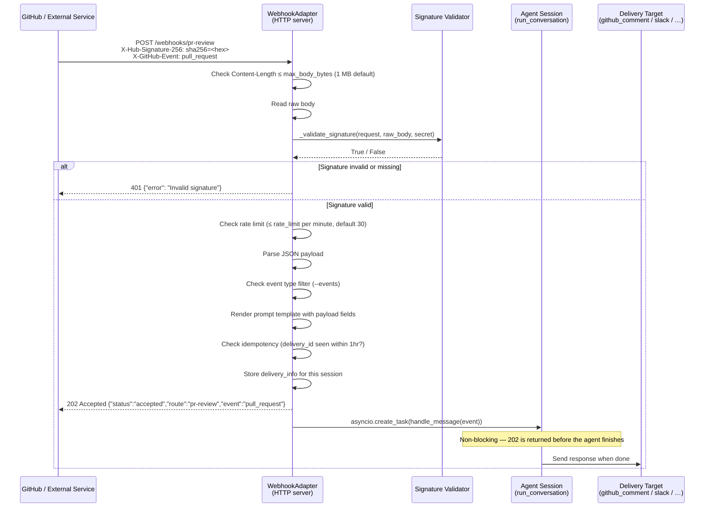
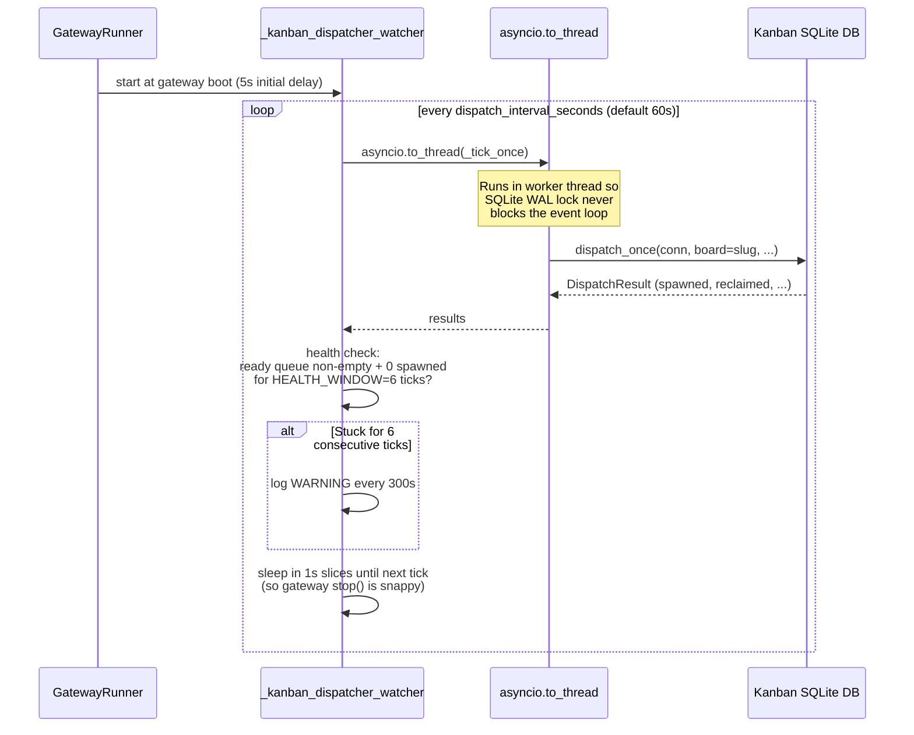

**TL;DR** — Beyond time-based cron jobs, Hermes offers two more ways to trigger work without you being present: **webhook triggers** (Hermes listens for HTTP POST events from services like GitHub and runs an agent session when one arrives) and the **kanban dispatcher tick** (a background loop that periodically claims and starts queued board tasks). By the end of this chapter you'll know how to subscribe to GitHub PR events, understand what happens when a signed POST arrives, and see how the dispatcher tick coexists with the cron scheduler to keep board work moving.

# Webhook Triggers and the Kanban Dispatcher Tick

In the [previous chapter](./cron-scheduler.md) we set up recurring cron jobs — Hermes wakes on a schedule and does something. That handles time-based work, but two important scenarios remain:

1. **External events you do not control the timing of.** A pull request opens, a CI check fails, a monitoring alert fires. You want Hermes to act *right then*, not at the next cron tick.
2. **Queued work on a board.** A task has been placed on the kanban board (perhaps by a sub-agent or a user), its dependencies are met, and it is ready to run. Something must notice that and spawn a worker.

This chapter covers those two trigger types. We will work through webhooks first — they are the more self-contained story — and then look at the dispatcher tick, which is the gateway's embedded loop for keeping board work moving.

---

## Part 1: Webhook Triggers

### Why webhooks exist

Imagine you want Hermes to review every pull request the moment it is opened. A cron job that polls GitHub every five minutes is wasteful and slow. What you really want is for GitHub to call *you* the instant the event happens.

That is what a **webhook** is: an HTTP POST that an external service sends to a URL you control whenever something happens on their end. GitHub, GitLab, Stripe, Supabase, and almost every developer platform support webhooks. Hermes runs an HTTP server — the `WebhookAdapter` — that receives those POSTs and turns them into agent sessions.

### What HMAC authentication is

Before we see how to configure a route, we need to understand one security concept: **HMAC authentication**.

When GitHub POSTs to your webhook URL, anyone on the internet could potentially send fake POSTs to that same URL and trick Hermes into running agent sessions. To prevent this, you share a **secret** with GitHub when you register the webhook. Every time GitHub sends a POST, it computes a keyed signature of the request body using that secret (using HMAC-SHA256, a well-established algorithm for exactly this purpose) and includes the result in the `X-Hub-Signature-256` header. Hermes recomputes the expected signature from the secret it knows and the raw body it received, then compares the two. If they match, the request is genuine. If they do not, Hermes returns `401` and ignores it.

**HMAC** stands for Hash-based Message Authentication Code. Think of it as a tamper-evident seal: the sender and receiver share a secret, and only someone who knows that secret can produce a valid seal for a given message.

### Subscribing to a GitHub event

The `hermes webhook subscribe` command creates a route definition and registers it with the running gateway. Here is a real example — subscribing to PR events and posting a review comment when one opens:

```bash
hermes webhook subscribe pr-review \
  --events "pull_request" \
  --prompt "Review PR #{pull_request.number}: {pull_request.title} by {pull_request.user.login}. Check for logic errors, missing tests, and style issues." \
  --skills "github-code-review" \
  --deliver github_comment
```

Let's walk through each option:

| Option | What it does |
|---|---|
| `pr-review` | The route name. Hermes will listen at `/webhooks/pr-review`. |
| `--events "pull_request"` | Only handle POSTs where the `X-GitHub-Event` header matches this value. Other event types are silently ignored (HTTP 200 with `{"status": "ignored"}`). |
| `--prompt "..."` | A template string. `{pull_request.number}`, `{pull_request.title}`, and similar tokens are filled in from the webhook payload using dot-notation access into the JSON body. |
| `--skills "github-code-review"` | Load this skill into the agent session that runs for this event. |
| `--deliver github_comment` | Send the agent's response as a GitHub PR comment rather than to a chat platform. |

The route definition is written to `~/.hermes/webhook_subscriptions.json`. The running gateway reloads this file on every incoming POST (using an mtime check, so there is no overhead when nothing has changed).

You also need to register this URL in GitHub's webhook settings for your repository. The webhook URL will be:

```
https://your-hermes-host/webhooks/pr-review
```

In the GitHub UI, set the content type to `application/json`, paste your secret, and select the events you care about.

### An API POST trigger (no GitHub required)

Webhooks are not just for GitHub. The same mechanism handles any HMAC-authenticated POST from any system. Here is an alert triage subscription — a monitoring system POSTs an alert payload, Hermes triages it and delivers a summary to Slack:

```bash
hermes webhook subscribe alert-triage \
  --prompt "Alert: {alert.name} — Severity: {alert.severity}. Find the owning service, investigate the likely cause, and post a triage summary with proposed first steps." \
  --deliver slack
```

The payload from your monitoring system can be any JSON. As long as it carries the correct HMAC signature in a recognised header (`X-Hub-Signature-256`, `X-Webhook-Signature`, or Svix-style headers), Hermes will accept and process it.

### What happens when a POST arrives

Let's trace the full path, step by step. When a POST arrives at `/webhooks/pr-review`:



A few things worth noticing:

**The response is `202 Accepted`, not `200 OK`.** Hermes returns the 202 immediately after queuing the agent task — it does not wait for the agent to finish. This is important for GitHub (and most webhook providers), which have a short timeout before they consider the delivery failed and retry. The agent can take minutes; the HTTP handshake takes milliseconds.

**Idempotency prevents double-runs.** Webhook providers retry on network failures. Hermes caches delivery IDs (from the `X-GitHub-Delivery`, `svix-id`, or `X-Request-ID` header) for one hour. If the same delivery ID arrives twice, the second request is acknowledged with `{"status":"duplicate"}` and no agent session starts.

**Signature validation happens before payload parsing.** This matters for security: if the signature check fails, Hermes never deserialises the body. An attacker cannot exploit a JSON parsing vulnerability by sending a malformed body, because the check happens first.

### Signature validation details

The validator recognises four signature schemes, tried in order:

| Scheme | Header(s) | Format |
|---|---|---|
| GitHub | `X-Hub-Signature-256` | `sha256=<hex-digest>` |
| GitLab | `X-Gitlab-Token` | Plain shared secret (constant-time compare) |
| Svix / AgentMail | `svix-id`, `svix-timestamp`, `svix-signature` | `v1,<base64-hmac>` |
| Generic HMAC | `X-Webhook-Signature` | Raw hex HMAC-SHA256 |

If none of these headers are present but the route has a secret configured, the request is rejected. Hermes requires at least one recognised signature header — it does not have an unsigned fallback for production routes.

### Edge case: bad or missing HMAC signature

If a POST arrives with an incorrect or absent signature, `_validate_signature` returns `False`. The handler returns:

```
HTTP 401
{"error": "Invalid signature"}
```

No agent session starts. The gateway logs a warning at the `WARNING` level:

```
[webhook] Invalid signature for route pr-review
```

The caller (GitHub, your monitoring system, or an attacker) sees only the 401. There is no body that leaks route configuration or secret identity.

The special string `INSECURE_NO_AUTH` disables signature checking — but only when the gateway is bound to a loopback address (`127.0.0.1`, `localhost`, `::1`). If you set `INSECURE_NO_AUTH` on a public-facing host, the gateway refuses to start entirely. This is a startup-time guard, not a runtime one: you cannot accidentally expose an unauthenticated webhook route by misconfiguring a deployed server.

### Direct delivery mode (`deliver_only`)

Sometimes you want a webhook to push a plain notification without running an LLM at all — for example, a monitoring system that should ping you on Telegram with the raw alert text. Add `deliver_only: true` to the route config. The rendered prompt template is delivered directly to the target. HMAC auth, rate limiting, and idempotency still apply; only the agent step is skipped.

---

## Part 2: The Kanban Dispatcher Tick

### The problem: who watches the board?

Let's say a sub-agent has placed a task on the kanban board (the kanban board is Hermes's internal task queue backed by a SQLite database — the full mechanics are covered in [the Kanban Dispatch deep-dive](../multi-agent/kanban-dispatch.md)). The task is in `ready` status, meaning its dependencies are met and it is waiting to be claimed. Nothing will happen unless something periodically *checks* the board and spawns a worker.

That "something" is the `_kanban_dispatcher_watcher` — a background async loop embedded in the gateway.

### How `dispatch_once()` works

The core function is `dispatch_once()` in `hermes_cli/kanban_db.py`. One call runs a single **dispatcher tick**:

```python
# Simplified view of dispatch_once() — the real function is in kanban_db.py
def dispatch_once(
    conn: sqlite3.Connection,
    *,
    spawn_fn=None,
    max_spawn: Optional[int] = None,
    max_in_progress: Optional[int] = None,
    failure_limit: int = DEFAULT_SPAWN_FAILURE_LIMIT,
    stale_timeout_seconds: int = 0,
    board: Optional[str] = None,
    default_assignee: Optional[str] = None,
    max_in_progress_per_profile: Optional[int] = None,
) -> DispatchResult:
    ...
```

Each tick performs these steps in order:

1. **Reclaim stale running tasks.** Tasks that have been in `running` status past their `claim_expires` TTL (indicating the worker crashed or was killed) are reclaimed — their status is reset so the dispatcher can try again.
2. **Detect crashed workers.** Tasks whose worker PID is no longer alive on this host are also reclaimed.
3. **Enforce max runtime.** Tasks that have been running longer than the configured ceiling are timed out.
4. **Promote `todo` → `ready`.** Tasks whose parent tasks are all `done` are promoted to `ready` status via `recompute_ready()`.
5. **Claim and spawn.** For each `ready` task that has an assignee, the dispatcher atomically claims it and calls `spawn_fn` to start a worker process.

Spawn failures are counted per-task. After `failure_limit` consecutive failures the task is automatically blocked with the last error as its reason — preventing the dispatcher from thrashing on a task that can never start.

`max_spawn` is a **live concurrency cap**, not a per-tick budget. It counts tasks already in `running` status plus this tick's spawns. So `max_spawn=4` means "at most 4 workers running at any time across the whole board."

### The `_kanban_dispatcher_watcher` loop

`_kanban_dispatcher_watcher` is a method on the `GatewayKanbanWatchersMixin` that `GatewayRunner` inherits. It runs as an asyncio coroutine inside the gateway's event loop. Here is what the loop does:



The 5-second initial delay at startup lets the gateway finish wiring its platform adapters before the dispatcher tries to spawn workers — those workers may reach back to the gateway's notification subscriptions.

All SQLite work runs inside `asyncio.to_thread()`, which moves the call to a thread pool worker. This ensures the WAL (Write-Ahead Log) lock on the SQLite file never blocks the gateway's async event loop, which must stay responsive for incoming messages and webhook POSTs.

### Configuration

Control the dispatcher via `config.yaml` under the `kanban` key:

```yaml
kanban:
  dispatch_in_gateway: true          # enable the embedded dispatcher (default: true)
  dispatch_interval_seconds: 60      # seconds between ticks (default: 60, min: 1)
  max_spawn: 4                       # max concurrent running tasks (optional)
  max_in_progress: 4                 # identical effect — cap on 'running' tasks
  max_in_progress_per_profile: 2     # per-profile concurrency cap
  failure_limit: 3                   # auto-block after N consecutive spawn failures
  dispatch_stale_timeout_seconds: 0  # 0 = stale detection disabled
  default_assignee: ""               # fallback profile for unassigned ready tasks
```

You can also disable the dispatcher without editing YAML:

```bash
export HERMES_KANBAN_DISPATCH_IN_GATEWAY=false
```

A falsy value (`0`, `false`, `no`, `off`) stops the watcher loop immediately at boot. An external `hermes kanban daemon` process is then expected to drive dispatch.

### The single-dispatcher posture

There is one rule you must not break: **only one gateway should own dispatch for a given board.** The `kanban.dispatch_in_gateway` flag (default `true`) is what establishes that ownership. If two gateways both set `dispatch_in_gateway: true` on the same board, they will race to claim and spawn tasks, leading to duplicate workers and SQLite WAL contention.

In a multi-gateway setup, pick one gateway as the dispatcher owner and set `kanban.dispatch_in_gateway: false` on all the others. The deep-dive on multi-gateway coordination is in [Kanban Dispatch and Multi-Agent Coordination](../multi-agent/kanban-dispatch.md).

### The board selector: `HERMES_KANBAN_BOARD`

The dispatcher iterates all non-archived boards it finds on disk per tick — you do not need to restart when a new board is created. When targeting a specific board for a single tick (internally, for testing or a manual run), the `board` parameter to `dispatch_once()` pins the call via the `HERMES_KANBAN_BOARD` environment variable. For day-to-day operation the watcher handles this automatically.

### How the dispatcher tick coexists with the cron scheduler

You might wonder whether these two background loops interfere with each other. They do not, because they drive separate concerns:

| Concern | Driven by |
|---|---|
| Time-based recurring agent sessions | Cron scheduler `tick()` (covered in [the previous chapter](./cron-scheduler.md)) |
| Queued board tasks claimed by workers | Kanban dispatcher `_kanban_dispatcher_watcher` |

The cron scheduler uses a file lock (`fcntl`/`msvcrt`) so that only one cron tick runs at a time even if the gateway and a standalone daemon overlap. The kanban dispatcher uses SQLite's WAL and `asyncio.to_thread` for isolation. They touch different state and do not share a lock.

Both loops apply an inactivity-based termination to the agent sessions they start: cron jobs use a 600-second inactivity timeout (configurable via `HERMES_CRON_TIMEOUT`); kanban workers are governed by the task's `claim_expires` TTL and the `dispatch_stale_timeout_seconds` setting.

### Edge case: stuck dispatcher

The watcher tracks a health window of six consecutive ticks. If the ready queue is non-empty but zero workers were spawned in any of those six ticks, it logs a `WARNING`:

```
kanban dispatcher stuck: ready queue non-empty for 6 consecutive ticks
but 0 workers spawned. Check profile health (venv, PATH, credentials)
and `hermes kanban list --status ready`.
```

This warning repeats at most once every 300 seconds. Common causes are a broken `PATH` so the spawned worker subprocess cannot find `hermes`, a missing virtualenv, or a credential failure that prevents the worker from connecting. Run `hermes kanban list --status ready` to see which tasks are waiting, then inspect the profile the tasks are assigned to.

---

## Putting it together: two trigger paths, one agent

Here is how webhooks and the dispatcher tick compare as autonomous triggers:

| Trigger | What initiates it | Timing | Suitable for |
|---|---|---|---|
| Cron schedule | Time-based | Fixed intervals or expressions | Recurring jobs (digests, checks, reports) |
| Webhook POST | External HTTP event | Immediately on event | GitHub events, alerts, inter-service notifications |
| Dispatcher tick | Ready tasks on a board | Every `dispatch_interval_seconds` | Queued multi-agent work, fan-out sub-tasks |

All three trigger the same thing: a `run_conversation()` agent session with a configured prompt, skills, and delivery target. The three mechanisms are the surface; the agent loop is what runs underneath.

From here, the natural next chapter is [The Tools Registry, Approval Gate, and File-Write Safety](../tools/tools-registry-and-approval-gate.md), which covers how the agent session that starts from any of these triggers decides which tools it is allowed to run and how file writes are constrained.

<!-- GAP: The exact format of the `hermes webhook subscribe` CLI command options (flags like --events, --deliver, --skills) — the source S87 shows example invocations but does not document the full flag set; the webhook.py source documents the route config fields but not the CLI flag names mapping to them. The examples in S87 are used as-is. -->

<!-- GAP: The default value for `dispatch_stale_timeout_seconds` in the kanban dispatcher — S51 shows the config key and that 0 disables stale detection, but no explicit default is documented beyond 0; documented as 0 (disabled by default). -->

---

← Previous: [The Cron Scheduler — tick(), Job Kinds, and Inactivity Timeout](./cron-scheduler.md) · Next: [The Tools Registry, Approval Gate, and File-Write Safety](../tools/tools-registry-and-approval-gate.md) →
