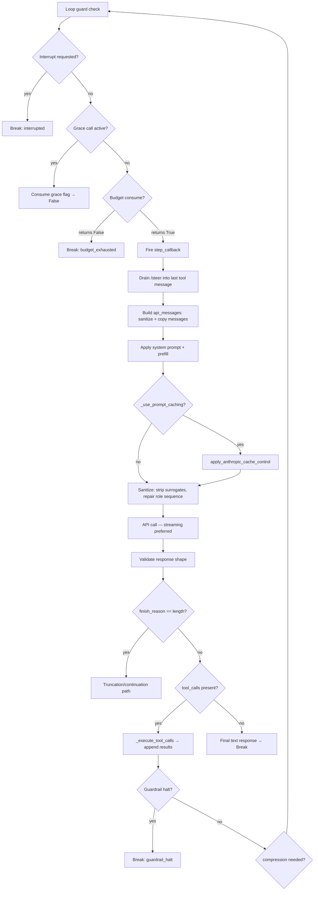
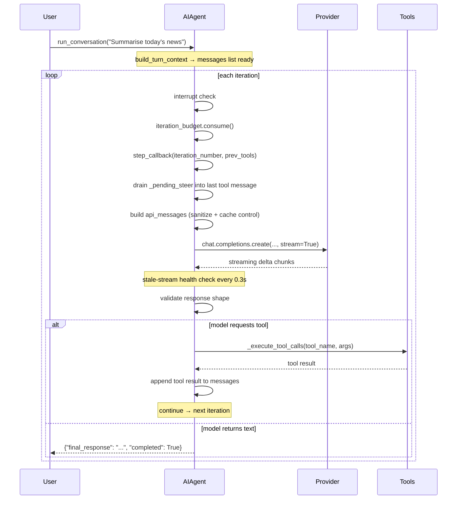

**TL;DR** — A chat model answers once and stops. An agent must decide, call tools, observe results, and decide again — until the task is complete. That cycle lives in `run_conversation()` on the `AIAgent` class. This chapter walks every step of one iteration in exact order, using the real class and method names from the source, and covers three critical edge cases: budget exhaustion with a one-turn grace call, the stale-stream health check, and `content_policy_blocked` as a deterministic no-retry condition.

# The AIAgent Class and the run_conversation() Loop

## The problem a bare chat call can't solve

When you send a message to a chat model, you get one response. That response might say "I'll need to look that up" — but without a loop, nothing ever looks it up. An *agent* is the system that closes the gap: it calls the model, inspects the response, runs whatever tools the model requested, feeds the results back, and calls the model again. It keeps doing that until the model produces a plain text answer (no more tool requests) or a stopping condition fires.

Hermes is a self-improving AI agent built by Nous Research. Its central capability — a closed learning loop in which it creates and refines skills from experience — depends entirely on this iteration being reliable and observable. If you understand the loop, you understand the whole runtime.

> **Prerequisites — two concepts you will lean on:**
>
> - *Agent loop* — the repeated cycle of model call → tool execution → model call. Introduced in full at [What Is Hermes](../getting-started/what-is-hermes.md).
> - *Iteration budget, toolsets, session* — quick-reference definitions at [Glossary](../reference/glossary.md). We will introduce each term again here as we need it.

---

## AIAgent: what it holds

`AIAgent` is defined in `run_agent.py` (line 320). It is the single object that owns everything needed to drive one conversation:

| Attribute | What it is |
|---|---|
| `model` | The model name string passed to the provider API |
| `max_iterations` | Hard cap on API calls per turn (default **90**) |
| `iteration_budget` | An `IterationBudget` instance — the thread-safe counter (see below) |
| `tools` | The list of tool schemas currently available to the model |
| `session_id` | UUID identifying the current conversation session in the database |
| `_session_db` | A `SessionDB` handle — persists messages and session metadata to SQLite |
| `_cached_system_prompt` | The system prompt, built once per session and replayed verbatim on every turn to keep the prompt cache stable |
| `_use_prompt_caching` | Whether to inject Anthropic cache-control breakpoints |
| `step_callback` | Optional callable the gateway registers; fires once per iteration |
| `_budget_grace_call` | Boolean flag — allows one extra iteration after the budget runs out |

`AIAgent.__init__` is a thin forwarder: it delegates everything to `agent.agent_init.init_agent`, which is where the actual setup code lives. This split keeps the class file navigable.

---

## IterationBudget: the thread-safe counter

Before we can understand the loop's exit conditions, we need `IterationBudget` (`agent/iteration_budget.py`, line 17). It is a simple but important object: a counter protected by a `threading.Lock` so that concurrent tool workers cannot race on it.

```python
# Simplified view of IterationBudget (agent/iteration_budget.py)
class IterationBudget:
    def __init__(self, max_total: int):
        self.max_total = max_total
        self._used = 0
        self._lock = threading.Lock()

    def consume(self) -> bool:
        """Try to spend one iteration. Returns True if allowed."""
        with self._lock:
            if self._used >= self.max_total:
                return False
            self._used += 1
            return True

    def refund(self) -> None:
        """Give back one iteration (e.g. for execute_code turns)."""
        with self._lock:
            if self._used > 0:
                self._used -= 1
```

Each `AIAgent` — parent or subagent — holds its own `IterationBudget`. The parent's cap comes from `max_iterations` (default 90). Each subagent receives an independent budget capped at `delegation.max_iterations` (default 50). The `refund()` method exists specifically for `execute_code` tool calls: these are cheap, RPC-style calls that should not eat into the iteration count.

The full details of the budget, toolsets, and how they combine live in the next chapter: [Iteration Budget, Toolsets, and the Tools Registry](./iteration-budget-and-toolsets.md). Here we only need to know what `consume()` returns, because the loop guard reads it directly.

---

## run_conversation(): the method signature

`AIAgent.run_conversation()` is defined at line 5092 of `run_agent.py`. The method itself is a one-line forwarder into `agent.conversation_loop.run_conversation`, which holds the real ~3,900-line implementation:

```python
# run_agent.py, line 5092 (simplified)
def run_conversation(
    self,
    user_message: str,
    system_message: str = None,
    conversation_history: list = None,
    task_id: str = None,
    stream_callback: callable = None,
    persist_user_message: str = None,
) -> dict:
    """Forwarder — see agent.conversation_loop.run_conversation."""
    from agent.conversation_loop import run_conversation
    return run_conversation(
        self, user_message, system_message,
        conversation_history, task_id, stream_callback, persist_user_message,
    )
```

The return value is a dict:

| Key | Type | Meaning |
|---|---|---|
| `final_response` | `str \| None` | The model's final plain-text answer |
| `messages` | `list` | Full message history for this turn |
| `api_calls` | `int` | Number of API calls made |
| `completed` | `bool` | `True` when a text response was reached without error |
| `failed` | `bool` | `True` on unrecoverable errors |
| `interrupted` | `bool` | `True` when the user interrupted the turn |

---

## The prologue: build_turn_context

Before the main loop starts, `run_conversation` calls `build_turn_context(agent, ...)`. This single helper does all once-per-turn setup: guarding stdio, resetting retry counters, sanitizing the user message, restoring or building the system prompt, preflight context compression, firing the `pre_llm_call` plugin hook, and prefetching external memory. It mutates `agent` and returns a context object (`_ctx`) whose fields the loop consumes.

Think of `build_turn_context` as clearing the workbench before starting: everything the loop needs is in place before the first iteration begins.

---

## The main loop: structure at a glance

The loop guard in `agent/conversation_loop.py` (line 461) reads:

```python
while (
    api_call_count < agent.max_iterations
    and agent.iteration_budget.remaining > 0
) or agent._budget_grace_call:
    ...
```

Two conditions keep the loop alive: the `api_call_count` must be below `max_iterations` **and** the `IterationBudget` must still have remaining capacity. The `_budget_grace_call` flag provides a one-shot escape hatch we will cover in the edge cases section.

Here is the step sequence inside each iteration, in order:



The sequence diagram below shows one clean iteration — user message arrives, model calls a tool, tool result feeds back:



Let's walk each step.

---

## Step 1: Interrupt check

The very first thing each iteration does, before touching the budget, is check `agent._interrupt_requested`:

```python
if agent._interrupt_requested:
    interrupted = True
    _turn_exit_reason = "interrupted_by_user"
    break
```

This flag is set from outside the loop — for example, when a gateway receives a new message from the user while the agent is mid-iteration. Checking it here means the agent can be stopped cleanly after any completed API call, without leaving orphaned tool results in the message history.

---

## Step 2: Budget consume (or grace call)

After the interrupt check, the loop decides whether this iteration is permitted:

```python
if agent._budget_grace_call:
    # One-shot grace iteration — consume the flag so the loop ends after this.
    agent._budget_grace_call = False
elif not agent.iteration_budget.consume():
    _turn_exit_reason = "budget_exhausted"
    break
```

`IterationBudget.consume()` atomically increments the counter and returns `True` if the budget allows it, `False` if not. When it returns `False`, the loop breaks immediately. We cover what happens next — the grace call — in the [edge cases section](#edge-case-budget-exhaustion-and-the-grace-call).

---

## Step 3: Fire step_callback

The `step_callback` is an optional callable the gateway registers on the `AIAgent` to receive an `agent:step` event. The loop fires it once per iteration, passing the iteration number and the previous iteration's tool results (extracted from the message history). This is how the TUI and Telegram gateway know the agent is progressing.

---

## Step 4: Drain /steer

`/steer` is a gateway slash command — users can send a steering instruction while the model is thinking. The pending text is buffered in `agent._pending_steer`. Before building the API request, the loop drains it:

```python
_pre_api_steer = agent._drain_pending_steer()
if _pre_api_steer:
    # Inject into the most recent tool-role message in the history,
    # so the model sees the instruction on this iteration.
    for _si in range(len(messages) - 1, -1, -1):
        if messages[_si].get("role") == "tool":
            messages[_si]["content"] += format_steer_marker(_pre_api_steer)
            break
```

The steer is appended to the last `role="tool"` message because injecting it into a `role="user"` message would break OpenAI-compatible role alternation rules. If no tool message exists yet (first iteration), the steer is put back and will land on the next tool round.

---

## Step 5: Build api_messages

At this point, `messages` is the internal message history (including internal metadata fields). The API cannot receive all of it directly: some fields (`reasoning`, `finish_reason`, `_thinking_prefill`) are Hermes-internal and would be rejected by strict providers like Mistral. The loop builds a clean copy called `api_messages`:

```python
api_messages = []
for idx, msg in enumerate(messages):
    api_msg = msg.copy()
    # Copy reasoning content for providers that need it (e.g. DeepSeek)
    agent._copy_reasoning_content_for_api(msg, api_msg)
    # Strip internal-only fields
    api_msg.pop("reasoning", None)
    api_msg.pop("finish_reason", None)
    api_msg.pop("_thinking_prefill", None)
    # Inject external memory prefetch into the current user message
    if idx == current_turn_user_idx and msg.get("role") == "user":
        if _ext_prefetch_cache:
            api_msg["content"] += "\n\n" + build_memory_context_block(_ext_prefetch_cache)
    api_messages.append(api_msg)
```

The current turn's user message is also where the `MemoryManager` prefetch injects its context block — the retrieved memories from past sessions. This is kept out of the system prompt deliberately: mutations to the system prompt would invalidate the prompt cache.

---

## Step 6: Apply the system prompt and prefill messages

The effective system prompt is assembled from `_cached_system_prompt` (the stable, session-long prompt) and any `ephemeral_system_prompt` (a per-turn addition). The stable portion is built once and replayed byte-for-byte every turn so that provider-side KV caches can reuse it.

```python
effective_system = active_system_prompt or ""
if agent.ephemeral_system_prompt:
    effective_system = (effective_system + "\n\n" + agent.ephemeral_system_prompt).strip()
if effective_system:
    api_messages = [{"role": "system", "content": effective_system}] + api_messages
```

`prefill_messages` — pre-canned conversation turns used in some configurations — are inserted right after the system message.

---

## Step 7: Apply Anthropic prompt caching

For Claude models on the Anthropic API, OpenRouter, or any `api_mode == "anthropic_messages"` gateway, the loop applies `apply_anthropic_cache_control` from `agent/prompt_caching.py`:

```python
if agent._use_prompt_caching:
    api_messages = apply_anthropic_cache_control(
        api_messages,
        cache_ttl=agent._cache_ttl,          # "5m" (default) or "1h"
        native_anthropic=agent._use_native_cache_layout,
    )
```

The strategy is called `system_and_3`: it places up to **four** `cache_control` breakpoints — one on the system message, and one on each of the last three non-system messages. The result is that the stable system prompt and recent context are cached at the provider, reducing input token costs by roughly 75% on multi-turn conversations.

The TTL is configurable in `config.yaml` under `prompt_caching.cache_ttl`: `"5m"` (the default) or `"1h"`. The 1-hour tier writes at 2× cost but pays off for sessions with pauses longer than five minutes.

---

## Step 8: Sanitize before sending

Before the API call, two more passes clean up the message list:

1. **Surrogate characters** — models like Kimi K2.5 and GLM-5 running on Ollama can emit lone Unicode surrogate codepoints (U+D800–U+DFFF) that crash `json.dumps()`. `_sanitize_messages_surrogates(api_messages)` strips them.
2. **Role alternation** — `_repair_message_sequence(messages)` catches broken `tool → user` or `user → user` tails left by edge cases. Most providers return empty content on malformed sequences, which would otherwise trigger the empty-response retry loop indefinitely.

---

## Step 9: The API call — streaming always preferred

The comment in the source is explicit (lines ~958–968):

> "Always prefer the streaming path — even without stream consumers. Streaming gives us fine-grained health checking (90s stale-stream detection, 60s read timeout) that the non-streaming path lacks."

<!-- GAP: the in-code comment says "90s stale-stream detection" but the actual stale timeout default in chat_completion_helpers.py line 2421 is float(os.getenv("HERMES_STREAM_STALE_TIMEOUT", 180.0)) — 180 seconds, not 90. The comment in the source appears to be outdated; the configurable env var default is 180s. Document the actual code value. -->

The stale-stream default timeout is **180 seconds** (from `HERMES_STREAM_STALE_TIMEOUT` environment variable, default `180.0` in `agent/chat_completion_helpers.py` line 2421). See the [stale-stream edge case](#edge-case-the-stale-stream-health-check) below for what happens when this fires.

The call is routed through `run_llm_execution_middleware`, which gives the `llm_execution` plugin hook a chance to wrap or observe it. Streaming is disabled only when:

- `agent._disable_streaming` was set by a prior "stream not supported" error.
- The provider uses ACP/subprocess transport (e.g. `copilot-acp`), which returns a `SimpleNamespace`, not a stream iterator.
- The client is a `unittest.mock.Mock` (test environments).

---

## Step 10: Validate response shape

After the call returns, the loop checks whether the response is valid before processing it. What "valid" means depends on the `api_mode`:

| `api_mode` | Validity check |
|---|---|
| `chat_completions` (default) | `response.choices` exists and is non-empty |
| `anthropic_messages` | `response.content` is a non-empty list |
| `bedrock_converse` | Bedrock-specific output shape check |
| `codex_responses` | `response.output` is non-empty, or `output_text` can recover it |

An invalid response triggers the retry path with jittered exponential backoff (5-second base, 120-second cap). An eager fallback fires first: if a fallback provider is configured, the agent switches to it immediately rather than retrying the same provider.

---

## Step 11: Dispatch tool calls

When the response is valid and `assistant_message.tool_calls` is non-empty, the loop dispatches them:

```python
# Simplified view — conversation_loop.py line 3707
agent._execute_tool_calls(assistant_message, messages, effective_task_id, api_call_count)
```

`_execute_tool_calls` is a thin forwarder to `agent.tool_executor`. The `_MAX_TOOL_WORKERS = 8` constant (in `run_agent.py` line 203) is the thread-pool cap for concurrent tool execution — the details of tool dispatch, the guardrail controller, and the full toolset system are covered in [Iteration Budget, Toolsets, and the Tools Registry](./iteration-budget-and-toolsets.md).

After tool execution, the loop checks `agent._tool_guardrail_halt_decision`. If a guardrail triggered a halt, the loop breaks and surfaces a controlled message to the user. Otherwise, it checks whether context compression is needed, then `continue`s to the next iteration.

---

## Step 12: Final text response

When the response has no `tool_calls`, the model has produced its answer. The loop exits:

```python
else:
    final_response = assistant_message.content or ""
    final_response = agent._strip_think_blocks(final_response).strip()
    messages.append(final_msg)
    _turn_exit_reason = f"text_response(finish_reason={finish_reason})"
    break
```

Think-block content (reasoning traces enclosed in `<think>` tags) is stripped from the final response before it is delivered to the user. The raw reasoning is retained in the message history for trajectory storage.

---

## Post-loop finalization

After the loop breaks for any reason, `run_conversation` delegates to `agent.turn_finalizer.finalize_turn`. This handles:

- Budget-exhaustion summary (see below).
- Trajectory save (if `save_trajectories` is enabled).
- Session persistence (`_persist_session`).
- Post-turn hooks: the `memory` and `skill_manage` background review nudge, the `post_llm_call` plugin hook.
- Assembly of the return dict.

---

## Edge case: budget exhaustion and the grace call

When `iteration_budget.consume()` returns `False`, the loop breaks before making any API call. But the agent may be mid-task — it has been calling tools and has not yet delivered a response. Stopping silently would leave the user with nothing.

The `agent_init.py` comment explains the design (lines 512–518):

> "The LLM is only notified when it actually exhausts the iteration budget. At that point we inject ONE message, allow one final API call, and if the model doesn't produce a text response, force a user-message asking it to summarise. No intermediate pressure warnings — they caused models to give up prematurely on complex tasks."

In `turn_finalizer.finalize_turn`, when `final_response is None` and the budget is exhausted, the agent calls `_handle_max_iterations(messages, api_call_count)`:

```python
# turn_finalizer.py (simplified)
if final_response is None and (
    api_call_count >= agent.max_iterations
    or agent.iteration_budget.remaining <= 0
):
    final_response = agent._handle_max_iterations(messages, api_call_count)
```

`handle_max_iterations` (in `agent/chat_completion_helpers.py`, line 1293) injects a system user message:

```
"You've reached the maximum number of tool-calling iterations allowed.
Please provide a final response summarising what you've found and
accomplished so far, without calling any more tools."
```

It then makes one final, **toolless** API call — the model cannot use tools, so this iteration will always return a text response. The result becomes the `final_response` delivered to the user.

The `_budget_grace_call` flag on `AIAgent` is initialized to `False` in `agent_init.py` (line 519) and consumed back to `False` inside the loop (line 481). It is the mechanism that allows this one-extra-iteration path to run within the existing loop structure.

> **What to do:** if users frequently hit the budget limit mid-task, increase `max_iterations` in `config.yaml` or narrow the task scope. The default of 90 is intentionally generous; subagents default to 50 to prevent delegation chains from consuming unbounded resources.

---

## Edge case: the stale-stream health check

Cloud providers sometimes keep an HTTP SSE connection alive with periodic pings but stop delivering actual response tokens. Without detection, the agent would hang indefinitely.

The streaming call runs the actual provider request in a background thread (`_call`). The main thread joins with a 0.3-second timeout per pass:

```python
# Simplified view — agent/chat_completion_helpers.py
_stream_stale_timeout = float(os.getenv("HERMES_STREAM_STALE_TIMEOUT", 180.0))
# For large contexts (>100K tokens), the threshold scales up to 300s.

t = threading.Thread(target=_call, daemon=True)
t.start()
while t.is_alive():
    t.join(timeout=0.3)

    _stale_elapsed = time.time() - last_chunk_time["t"]
    if _stale_elapsed > _stream_stale_timeout:
        # Kill the connection. The main retry loop will start a fresh one.
        _close_request_client_once("stale_stream_kill")
        agent._replace_primary_openai_client(reason="stale_stream_pool_cleanup")
        last_chunk_time["t"] = time.time()   # Reset the timer
```

Three timeout tiers apply:

| Context size | Effective stale timeout |
|---|---|
| ≤ 50K tokens | 180s (default) |
| 50K – 100K tokens | 240s |
| > 100K tokens | 300s |

Local providers (Ollama, llama.cpp, oMLX) are exempt: they can take 300+ seconds for prefill on large contexts, so the stale detector is disabled for them unless you explicitly set `HERMES_STREAM_STALE_TIMEOUT`.

When a stale stream is detected, the client is forcibly closed and the primary connection pool is rebuilt. The main retry loop then opens a fresh connection and retries the same request.

> **What to do:** if you are seeing frequent stale-stream timeouts with a specific provider, set `HERMES_STREAM_STALE_TIMEOUT` to a higher value. For local inference servers, leave the env var unset.

---

## Edge case: content_policy_blocked — deterministic, no retry

The error classifier (`agent/error_classifier.py`) assigns `FailoverReason.content_policy_blocked` when the provider's safety filter rejects a specific prompt (typically an HTTP 400 or 403 with a policy-related body). This is not a transient error — retrying the same prompt against the same provider will get the same rejection.

The handling in `conversation_loop.py` (around line 3052) reflects this:

```python
if classified.reason == FailoverReason.content_policy_blocked:
    # Attempt a fallback provider first — a different model may accept the prompt.
    if agent._try_activate_fallback():
        retry_count = 0
        continue

    # No fallback available — return a user-facing explanation immediately.
    _policy_response = (
        "⚠️ The model provider's safety filter blocked this request "
        "(not a Hermes/gateway failure).\n\n"
        "Provider message: {summary}\n\n"
        "Try rephrasing the request, narrowing the context, or "
        "adding a fallback provider with `hermes fallback add`."
    )
    return {
        "final_response": _policy_response,
        "completed": False,
        "failed": True,
        "error": f"content_policy_blocked: {summary}",
    }
```

No retry loop runs. The agent either switches to the next provider in the fallback chain, or surfaces a clear explanation to the user.

> **What to do:** configure a fallback provider with `hermes fallback add` (an interactive picker). For tasks that are occasionally blocked, rephrase requests to reduce context that might trigger filters, or route to a provider with different safety thresholds.

---

## Putting it all together: one iteration as code

Here is a labeled, simplified view of a single iteration body, preserving the real structure from `agent/conversation_loop.py`:

```python
# Simplified view of one iteration — agent/conversation_loop.py
# (labels added; real code is ~800 lines for this region)

while (api_call_count < agent.max_iterations and agent.iteration_budget.remaining > 0) \
        or agent._budget_grace_call:

    # 1. Interrupt check
    if agent._interrupt_requested:
        interrupted = True; break

    api_call_count += 1

    # 2. Budget consume (or consume grace flag)
    if agent._budget_grace_call:
        agent._budget_grace_call = False           # Grace flag consumed — loop ends after this
    elif not agent.iteration_budget.consume():
        _turn_exit_reason = "budget_exhausted"; break

    # 3. Step callback (gateway hook)
    if agent.step_callback:
        agent.step_callback(api_call_count, prev_tools)

    # 4. Drain /steer into last tool message
    _pre_api_steer = agent._drain_pending_steer()
    if _pre_api_steer:
        # inject into messages[-last-tool-message]
        ...

    # 5–8. Build and sanitize api_messages
    api_messages = [clean copy of messages, minus internal fields]
    api_messages = [system_msg] + api_messages           # prepend system prompt
    if agent._use_prompt_caching:
        api_messages = apply_anthropic_cache_control(    # 4 cache breakpoints
            api_messages, cache_ttl=agent._cache_ttl
        )
    api_messages = agent._sanitize_api_messages(api_messages)

    # 9. API call — streaming always preferred
    response = run_llm_execution_middleware(api_kwargs, _perform_api_call, ...)
    # _perform_api_call uses agent._interruptible_streaming_api_call()

    # 10. Validate response
    if response_invalid:
        retry_with_backoff(); continue

    # 11. Dispatch tool calls
    if assistant_message.tool_calls:
        agent._execute_tool_calls(assistant_message, messages, effective_task_id, ...)
        if agent._tool_guardrail_halt_decision:
            break                                        # guardrail halt
        continue                                         # next iteration

    # 12. Final text response
    else:
        final_response = assistant_message.content
        break

# Post-loop: turn_finalizer.finalize_turn(...)
```

---

## Summary: what each part is responsible for

| Component | File | Responsibility |
|---|---|---|
| `AIAgent` | `run_agent.py:320` | Owns session, tools, model config, budget |
| `run_conversation()` | `agent/conversation_loop.py:371` | The iteration loop |
| `build_turn_context()` | `agent/turn_context.py` | Once-per-turn setup |
| `IterationBudget` | `agent/iteration_budget.py:17` | Thread-safe iteration counter |
| `apply_anthropic_cache_control` | `agent/prompt_caching.py` | 4-breakpoint prompt cache injection |
| `_execute_tool_calls()` | `agent/tool_executor.py` | Tool dispatch (up to 8 concurrent workers) |
| `handle_max_iterations()` | `agent/chat_completion_helpers.py:1293` | Budget-exhaustion summary call |
| `finalize_turn()` | `agent/turn_finalizer.py` | Post-loop: persist, hooks, return dict |

The next chapter — [Iteration Budget, Toolsets, and the Tools Registry](./iteration-budget-and-toolsets.md) — goes inside `_execute_tool_calls`, the guardrail system, and how toolsets are assembled.

---

← Previous: [What This Guide Covers](../getting-started/scope-and-coverage.md) · Next: [Iteration Budget, Toolsets, and the Tools Registry](./iteration-budget-and-toolsets.md) →
