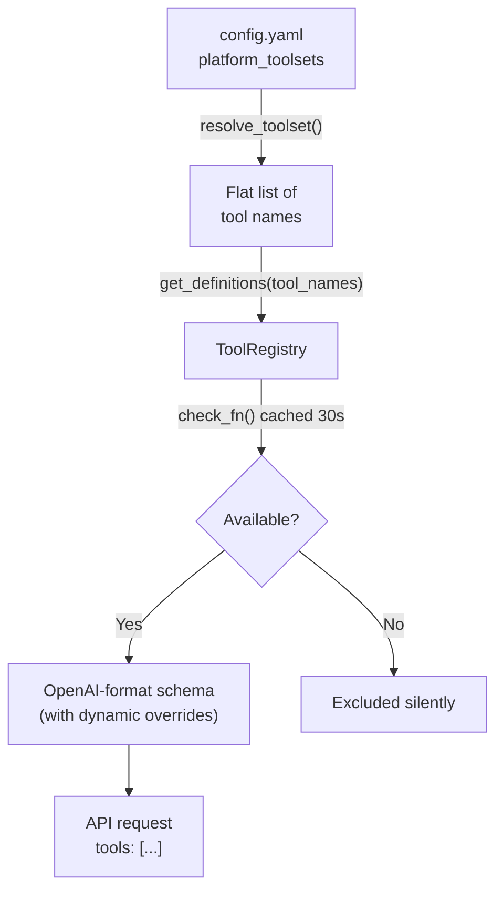
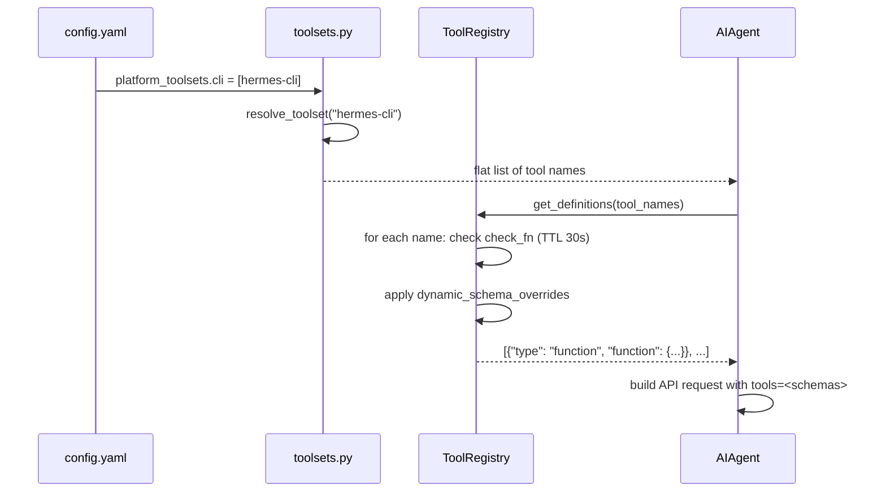

**TL;DR** — Every Hermes agent runs inside an iteration budget that caps how many LLM calls it can make per turn; once the budget hits zero the agent gets one final grace call to produce a summary. Tools are organised into named groups called *toolsets*, defined in `TOOLSETS` and backed by the `ToolRegistry`; you enable or disable groups per-platform in `config.yaml` or interactively with `hermes tools`.

# Iteration Budget, Toolsets, and the Tools Registry

## The problem: runaway agent loops

Picture Hermes working on an ambiguous request — maybe it is searching the web, refining queries, calling follow-up tools, and iterating. Without a ceiling, this loop can run forever, burning API credits and blocking the user. We need a simple, thread-safe way to say "after N LLM calls, stop and summarise."

That is the job of `IterationBudget`.

---

## Part 1 — The Iteration Budget

### What `IterationBudget` is

`IterationBudget` (defined in `agent/iteration_budget.py`) is a thread-safe counter that lives on each `AIAgent` instance. It tracks how many LLM API calls the agent has made in the current turn and refuses to allow more once the cap is reached.

Each agent — the parent *and* every subagent — gets **its own independent budget**:

| Agent type | Default cap | Config key |
|---|---|---|
| Parent agent | 90 | `agent.max_turns` in `config.yaml` |
| Each subagent | 50 | `delegation.max_iterations` in `config.yaml` |

> **Note on naming:** the Python default on the `AIAgent` constructor is `max_iterations=90`; the user-facing config key is `agent.max_turns`. Both refer to the same limit. You will see both names in logs and code.

Because each subagent has its own budget, total iterations across parent and children can exceed the parent's cap. That is intentional — a parent that spawns three subagents to work in parallel should not have its own cap divided among them.

### The `IterationBudget` class (simplified view)

```python
# agent/iteration_budget.py — simplified view
import threading

class IterationBudget:
    def __init__(self, max_total: int):
        self.max_total = max_total  # e.g. 90 for parent, 50 for subagents
        self._used = 0
        self._lock = threading.Lock()

    def consume(self) -> bool:
        """Try to use one iteration. Returns True if allowed, False if over budget."""
        with self._lock:
            if self._used >= self.max_total:
                return False
            self._used += 1
            return True

    def refund(self) -> None:
        """Give back one iteration (used for execute_code turns, which are refunded)."""
        with self._lock:
            if self._used > 0:
                self._used -= 1

    @property
    def remaining(self) -> int:
        with self._lock:
            return max(0, self.max_total - self._used)
```

Notice that `consume()` is atomic: the `threading.Lock` ensures two threads cannot both see `_used < max_total` at the same moment. This matters because Hermes can run multiple tool workers concurrently (up to `_MAX_TOOL_WORKERS = 8` threads in `agent/tool_executor.py`), and the budget must stay accurate.

The `refund()` method deserves attention: when the agent calls `execute_code` (a tool that runs Python scripts to call other tools programmatically), those iterations are refunded so they do not eat into the user's effective budget.

### How the loop uses the budget

The core `run_conversation()` loop in `agent/conversation_loop.py` guards every iteration with a `consume()` call:

```python
# agent/conversation_loop.py — simplified view of the loop guard
while (
    api_call_count < agent.max_iterations
    and agent.iteration_budget.remaining > 0
) or agent._budget_grace_call:

    if agent._interrupt_requested:
        break  # User sent a new message or /stop

    # Grace call: budget is zero but we gave the model one final turn.
    # Consume the flag so the loop exits after this iteration.
    if agent._budget_grace_call:
        agent._budget_grace_call = False
    elif not agent.iteration_budget.consume():
        # Budget exhausted — exit the loop normally
        break

    api_call_count += 1
    # ... make the LLM API call, handle tool results ...
```

After the loop exits, the `finalize_turn()` function (`agent/turn_finalizer.py`) checks whether the loop ended because of budget exhaustion. If it did, it calls `agent._handle_max_iterations()` — which injects a user message requesting a final summary and makes **one more API call with all tools stripped**. This is what we mean by the *grace call*: the model gets a single extra chance to wrap up cleanly.

### The grace call in detail

The `_budget_grace_call` flag (`bool`, initialised to `False` in `agent/agent_init.py`) is the on/off switch for the grace-call branch of the loop. Here is the sequence:

```mermaid
sequenceDiagram
    participant Loop as run_conversation()
    participant Budget as IterationBudget
    participant Finalizer as finalize_turn()
    participant LLM as LLM API

    Loop->>Budget: consume() — returns False (budget at max)
    Budget-->>Loop: False
    Loop->>Loop: _turn_exit_reason = "budget_exhausted", break

    Loop->>Finalizer: finalize_turn(api_call_count >= max_iterations)
    Finalizer->>LLM: _handle_max_iterations() — injects summary request, tools stripped
    LLM-->>Finalizer: final summary text
    Finalizer-->>Loop: result dict with final_response
```

The summary request injected by `_handle_max_iterations()` reads:

> *"You've reached the maximum number of tool-calling iterations allowed. Please provide a final response summarising what you've found and accomplished so far, without calling any more tools."*

This means the agent always produces a coherent answer even if it runs out of budget, rather than stopping mid-sentence.

### Edge case: budget exhaustion in a kanban worker

When Hermes is running as a kanban multi-agent worker (the `HERMES_KANBAN_TASK` environment variable is set), budget exhaustion is treated as a task failure, not a normal exit. The `finalize_turn()` function calls `_record_task_failure(outcome="timed_out")` on the kanban database so the dispatcher's failure counter increments and circuit-breaker logic can kick in. See [Sequential vs Concurrent Tool Dispatch and the Guardrail Controller](./tool-dispatch-and-guardrails.md) for more on the guardrail side of that.

### Setting the budget in `config.yaml`

```yaml
# config.yaml — iteration budget
agent:
  max_turns: 60  # Parent agent cap (default: 90)
                 # Higher = room for complex tasks, more API cost
                 # 20–30 for focused tasks; 50–100 for open exploration

delegation:
  max_iterations: 50  # Per-subagent cap (default: 50)
```

The `agent.max_turns` key maps directly to `max_iterations` on the `AIAgent` constructor. The `delegation.max_iterations` key sets the cap for every child spawned by `delegate_task`. You can tune them independently.

---

## Part 2 — Toolsets: named groups of tools

### The problem: too many tools is a problem

Hermes ships with dozens of tools — web search, file operations, browser automation, Home Assistant control, Discord management, cron scheduling, and more. Giving the model all of them at once has real costs:

- **Accuracy**: more tools in the schema means more choices; the model occasionally picks the wrong one.
- **Latency and cost**: tool schemas consume tokens in every API request.
- **Security**: a webhook handler probably should not have access to `terminal` or `write_file`.

We want named groups that can be switched on or off per platform. That is what *toolsets* are.

### The `TOOLSETS` dictionary

All built-in toolsets are defined in `toolsets.py` as a module-level `TOOLSETS` dict. Each entry has the shape:

```python
{
    "description": str,   # Human-readable label
    "tools": [str, ...],  # Direct tool names in this group
    "includes": [str, ...],  # Other toolsets this one composes from
}
```

The `includes` field enables *composition*: the `debugging` toolset includes `web` and `file` rather than listing their tools again. `resolve_toolset()` handles this recursively with cycle detection.

### The `_HERMES_CORE_TOOLS` list

Before looking at individual toolsets, let's understand `_HERMES_CORE_TOOLS`. It is a Python list defined at the top of `toolsets.py` containing the standard tool names available across the CLI and all messaging platforms:

```
web_search, web_extract, terminal, process,
read_file, write_file, patch, search_files,
vision_analyze, image_generate,
skills_list, skill_view, skill_manage,
browser_navigate, browser_snapshot, browser_click, browser_type,
browser_scroll, browser_back, browser_press, browser_get_images,
browser_vision, browser_console, browser_cdp, browser_dialog,
text_to_speech, todo, memory, session_search, clarify,
execute_code, delegate_task, cronjob, send_message,
ha_list_entities, ha_get_state, ha_list_services, ha_call_service,
kanban_show, kanban_list, kanban_complete, kanban_block,
kanban_heartbeat, kanban_comment, kanban_create, kanban_link,
kanban_unblock, computer_use
```

This list is the single source of truth for what the CLI and platform toolsets contain. Multiple platform toolsets (e.g. `hermes-cli`, `hermes-telegram`, `hermes-slack`) reference `_HERMES_CORE_TOOLS` directly, so editing it once updates all of them simultaneously.

### Representative named toolsets

Here is a selection from the `TOOLSETS` dict. The `tools` column shows the direct tools; composite toolsets list what they include:

| Toolset name | Type | Direct tools / includes |
|---|---|---|
| `web` | leaf | `web_search`, `web_extract` |
| `search` | leaf | `web_search` |
| `terminal` | leaf | `terminal`, `process` |
| `file` | leaf | `read_file`, `write_file`, `patch`, `search_files` |
| `browser` | leaf | `browser_navigate`, `browser_snapshot`, `browser_click`, `browser_type`, `browser_scroll`, `browser_back`, `browser_press`, `browser_get_images`, `browser_vision`, `browser_console`, `browser_cdp`, `browser_dialog`, `web_search` |
| `vision` | leaf | `vision_analyze` |
| `image_gen` | leaf | `image_generate` |
| `skills` | leaf | `skills_list`, `skill_view`, `skill_manage` |
| `todo` | leaf | `todo` |
| `memory` | leaf | `memory` |
| `session_search` | leaf | `session_search` |
| `tts` | leaf | `text_to_speech` |
| `cronjob` | leaf | `cronjob` |
| `code_execution` | leaf | `execute_code` |
| `delegation` | leaf | `delegate_task` |
| `messaging` | leaf | `send_message` |
| `moa` | leaf | `mixture_of_agents` |
| `kanban` | leaf | `kanban_show`, `kanban_list`, `kanban_complete`, `kanban_block`, `kanban_heartbeat`, `kanban_comment`, `kanban_create`, `kanban_link`, `kanban_unblock` |
| `homeassistant` | leaf | `ha_list_entities`, `ha_get_state`, `ha_list_services`, `ha_call_service` |
| `computer_use` | leaf | `computer_use` |
| `discord` | leaf | `discord` |
| `discord_admin` | leaf | `discord_admin` |
| `x_search` | leaf | `x_search` |
| `video` | leaf | `video_analyze` |
| `video_gen` | leaf | `video_generate` |
| `debugging` | composite | includes `web`, `file`; adds `terminal`, `process` |
| `safe` | composite | includes `web`, `vision`, `image_gen`; no terminal |
| `hermes-cli` | platform preset | all `_HERMES_CORE_TOOLS` |
| `hermes-telegram` | platform preset | all `_HERMES_CORE_TOOLS` |
| `hermes-discord` | platform preset | `_HERMES_CORE_TOOLS` + `discord`, `discord_admin` |
| `hermes-webhook` | restricted preset | `web_search`, `web_extract`, `vision_analyze`, `clarify` only |
| `hermes-acp` | editor preset | coding-focused subset; no `clarify`, `send_message`, or audio |

Notice `hermes-webhook` is intentionally constrained. Webhook events can originate from untrusted third-party content (for example, a public pull-request title). Giving the webhook agent `terminal` or `write_file` access would allow a prompt-injection attack in PR titles to execute commands. The restricted list is the safe default.

### `context_engine` toolset

One toolset stands out: `context_engine`. It has an empty `tools` list by default. Tools are injected into it at runtime by the active context engine rather than being declared statically. You will typically not add tools to it manually.

### How toolsets compose: `resolve_toolset()`

When the agent starts up, `resolve_toolset(name)` in `toolsets.py` recursively expands a toolset name into a flat, deduplicated list of tool names. It handles:

- Diamond dependencies (a toolset included by two parents is only resolved once).
- Cycle detection (silently returns `[]` for already-visited names).
- Plugin toolsets registered in the `ToolRegistry` at load time (via `_get_plugin_toolset_names()`).

```python
# toolsets.py — simplified view of resolve_toolset
def resolve_toolset(name: str, visited: set = None) -> list[str]:
    if visited is None:
        visited = set()
    if name in visited:
        return []  # Cycle or diamond — safe to skip
    visited.add(name)

    toolset = get_toolset(name)
    if not toolset:
        return []

    tools = set(toolset.get("tools", []))
    for included in toolset.get("includes", []):
        tools.update(resolve_toolset(included, visited))

    return sorted(tools)
```

The `"all"` or `"*"` special aliases resolve every toolset, deduplicated. They exist so future toolsets are automatically included without any code change.

---

## Part 3 — The Tools Registry

### The problem with a flat list

We could keep all tool handlers in a single file. In practice that file would need thousands of lines, and every tool would have to know about every other tool to avoid imports or name collisions. Instead, Hermes uses a central *registry* that each tool module writes into at import time, and the agent reads from at startup.

### `ToolRegistry` and `ToolEntry`

`tools/registry.py` defines two classes:

- **`ToolEntry`** — metadata for a single tool: `name`, `toolset`, `schema` (the OpenAI-format JSON schema), `handler` (the callable), `check_fn` (optional availability gating), `requires_env` (list of env vars needed), `is_async`, `description`, `emoji`, and optionally `max_result_size_chars` and `dynamic_schema_overrides`.
- **`ToolRegistry`** — a singleton (`registry = ToolRegistry()` at module level) that stores `ToolEntry` objects in a thread-safe dict protected by an `RLock`.

Every change to the registry (register, deregister, alias registration) increments a `_generation` counter. Callers that cache the tool definitions can key their cache on `generation` to know when to invalidate.

### How tools register themselves

Each tool file calls `registry.register()` at module level — outside any function, so it fires when the module is imported:

```python
# tools/some_tool.py — typical registration pattern
from tools.registry import registry

registry.register(
    name="some_tool",
    toolset="some",
    schema={
        "name": "some_tool",
        "description": "What this tool does",
        "parameters": { ... },  # JSON Schema
    },
    handler=_handle_some_tool,
    check_fn=_is_some_tool_available,   # Optional: gates visibility
    requires_env=["SOME_API_KEY"],       # Optional: env var list
    is_async=False,
)
```

The `check_fn` argument is particularly important. It is a zero-argument callable that returns `True` when the tool should appear in the model's schema. For example:
- The `computer_use` tool's `check_fn` probes whether the `cua-driver` package is installed.
- The `ha_*` tools gate on `HASS_TOKEN` being present.
- The `send_message` tool gates on whether a messaging gateway is running.

`check_fn` results are TTL-cached for 30 seconds (`_CHECK_FN_TTL_SECONDS = 30.0`) so the agent does not probe Docker, Modal, or the playwright binary on every API call. After you toggle a tool with `hermes tools`, the cache is explicitly invalidated via `invalidate_check_fn_cache()`.

### How tools are discovered at startup

Rather than maintaining a manual import list, `discover_builtin_tools()` in `tools/registry.py` scans the `tools/` directory for Python files that contain a top-level `registry.register(...)` call (checked via AST inspection, not execution):

```python
# tools/registry.py — simplified view of discover_builtin_tools
def discover_builtin_tools(tools_dir=None) -> list[str]:
    tools_path = Path(tools_dir or __file__).parent
    module_names = [
        f"tools.{path.stem}"
        for path in sorted(tools_path.glob("*.py"))
        if path.name not in {"__init__.py", "registry.py", "mcp_tool.py"}
        and _module_registers_tools(path)  # AST check: top-level registry.register call
    ]
    for mod_name in module_names:
        importlib.import_module(mod_name)  # Triggers the registry.register() call
    return imported
```

This means adding a new tool file is as simple as dropping it in `tools/` with a top-level `registry.register()` call — no other file needs to change.

### How the agent retrieves tool schemas

When building an API request, the agent calls `registry.get_definitions(tool_names)`, passing the set of names for the active toolsets. The registry:

1. Looks up each name in `_tools`.
2. Runs its `check_fn` (TTL-cached). If the check fails, the tool is silently excluded.
3. Applies any `dynamic_schema_overrides` (for example, `delegate_task`'s description encodes the current `delegation.max_concurrent_children` limit so the model isn't told the wrong value).
4. Returns a list of `{"type": "function", "function": {...}}` dicts in OpenAI format.



### MCP toolsets

Hermes also supports Model Context Protocol (MCP) servers. When an MCP server connects, its tools are registered into the `ToolRegistry` under a toolset named `mcp-<server-name>`. Toolset aliases map the MCP-internal name to a display name. When a server sends `notifications/tools/list_changed`, the registry nuke-and-repaves the affected entries and bumps the generation counter. All of this happens transparently — from the agent's perspective, MCP tools look identical to built-in tools.

---

## Part 4 — Configuring toolsets in `config.yaml`

### The `platform_toolsets` key

The primary way to control which tools the agent sees is the `platform_toolsets` key in `config.yaml`. Each platform can be given a preset, a list of individual toolsets, or both:

```yaml
# config.yaml — platform toolset configuration

platform_toolsets:
  # Use the built-in preset (all _HERMES_CORE_TOOLS):
  cli: [hermes-cli]
  telegram: [hermes-telegram]

  # Give Discord the full preset plus Discord-specific tools:
  discord: [hermes-discord]  # hermes-discord = _HERMES_CORE_TOOLS + discord + discord_admin

  # Telegram restricted to safe tools only (no terminal, no file writes):
  # telegram: [web, vision, skills, todo]

  # CLI without browser or image generation:
  # cli: [web, terminal, file, skills, todo, tts, cronjob]

  # Webhook stays on the constrained set (already the default):
  # webhook: [hermes-webhook]  # web_search, web_extract, vision_analyze, clarify only
```

> **Note:** the top-level `toolsets` key (if you have it from an older config) is deprecated and ignored. Use `platform_toolsets`.

### A worked example: a focused research assistant on Telegram

Let's say we want a Telegram bot that can search the web and analyse images, but must not be able to run commands, write files, or spawn scheduled tasks. We want memory so it learns our preferences, and session search so it can recall past conversations.

```yaml
# config.yaml — focused research assistant

platform_toolsets:
  telegram: [web, vision, memory, session_search, clarify]
```

That gives Telegram access to: `web_search`, `web_extract`, `vision_analyze`, `memory`, `session_search`, and `clarify`. Nothing else appears in the model's schema.

The CLI can remain on its full preset for hands-on work:

```yaml
platform_toolsets:
  cli: [hermes-cli]       # full toolset for interactive use
  telegram: [web, vision, memory, session_search, clarify]
```

Now when we run `hermes chat` locally we get everything, but the Telegram bot stays focused.

### Applying changes with `hermes tools`

Rather than editing `config.yaml` by hand, you can use the interactive tool manager:

```bash
hermes tools
```

This opens a menu where you can toggle toolsets on or off per platform. Changes write back to `platform_toolsets` in `config.yaml` and call `invalidate_check_fn_cache()` so the new configuration takes effect in the next conversation turn without restarting the agent.

You can also query what is available from the command line:

```bash
hermes chat --list-toolsets   # Show all toolsets and their tools
hermes chat --list-tools      # Show every individual tool with descriptions
```

### How the registry and toolsets interact

Here is the full picture of how a configured toolset becomes the tool list the agent sees:



---

## Part 5 — Putting it together: a complete walkthrough

Let's walk through configuring a fresh `config.yaml` with a conservative budget and a focused toolset, then verify it works.

### Step 1 — Set the iteration budget

Open `~/.hermes/config.yaml` and find (or add) the `agent` section:

```yaml
agent:
  max_turns: 40   # Conservative for a focused task assistant
                  # The default is 90

delegation:
  max_iterations: 30   # Subagents get slightly fewer turns than default
```

With `max_turns: 40`, the parent agent makes at most 40 LLM calls per user turn. When it reaches 40, `finalize_turn()` calls `_handle_max_iterations()` and the model produces a summary on the 41st (grace) call. The user always gets a coherent answer.

### Step 2 — Choose your toolsets

For a developer workflow on the CLI with no audio or image generation:

```yaml
platform_toolsets:
  cli: [web, terminal, file, browser, skills, todo, code_execution, delegation]
```

For a Telegram bot that should stay safe and read-only:

```yaml
platform_toolsets:
  telegram: [web, vision, skills, todo, clarify, session_search, memory]
```

### Step 3 — Verify with `hermes chat --list-toolsets`

```bash
hermes chat --list-toolsets
```

You will see a table of active toolsets for your platform, each with its tool count and description. If a tool is missing (e.g. `computer_use` is listed but its `check_fn` fails because `cua-driver` is not installed), it will be absent from the active schema even if the toolset is enabled.

### Step 4 — Check the budget in the banner

Start `hermes chat` and look at the welcome banner. It displays the active model, toolset summary, and iteration cap:

```
Max turns: 40
```

If you later want more room for a complex task, bump the value:

```bash
hermes chat --max-turns 80   # One-off override without changing config.yaml
```

---

## Edge cases and failure modes

### Budget exhaustion mid-task

The agent makes exactly one grace call when budget hits zero. That call has all tools stripped — the model can only produce text. If the model's summary call itself fails (network error, provider timeout), `final_response` is `None` and the agent returns an error result. No retry loop fires for the grace call.

For long-running autonomous sessions, set a generous `agent.max_turns` (e.g. 150–200) or use the cron scheduler to break work into smaller turns. See [The AIAgent Class and the run_conversation() Loop](./aiagent-and-conversation-loop.md) for more on how the loop exits.

### `check_fn` failure silently removes a tool

If a tool's `check_fn` raises an exception, the registry catches it and marks the tool unavailable (`False`). No log line appears at user level. If you expect a tool and it is missing, run:

```bash
hermes chat --list-tools
```

and look for tools that are absent despite their toolset being enabled. Then check the environment variable listed in `requires_env` for that toolset.

### Shadow registration rejection

If a plugin tries to register a tool whose name is already taken by a different toolset, the registry rejects it:

```
Tool registration REJECTED: 'web_search' (toolset 'my_plugin') would
shadow existing tool from toolset 'web'. Pass override=True to register()
if the replacement is intentional.
```

This prevents plugins from silently overriding built-in tools. To replace a built-in tool intentionally, call `registry.register(..., override=True)`.

### The `hermes-webhook` preset and prompt injection

As noted above, `hermes-webhook` deliberately limits the tool list to `web_search`, `web_extract`, `vision_analyze`, and `clarify`. If you expand the webhook toolset to include `terminal` or `write_file` and your webhook receives untrusted content (public GitHub events, Stripe webhooks, etc.), a crafted payload could inject instructions to run commands. Keep webhook toolsets minimal and apply server-side filtering on the payload before it reaches the agent.

---

← Previous: [The AIAgent Class and the run_conversation() Loop](./aiagent-and-conversation-loop.md) · Next: [Sequential vs Concurrent Tool Dispatch and the Guardrail Controller](./tool-dispatch-and-guardrails.md) →
