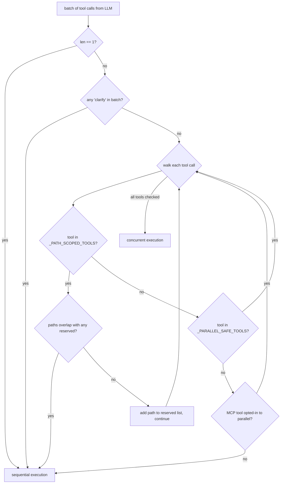
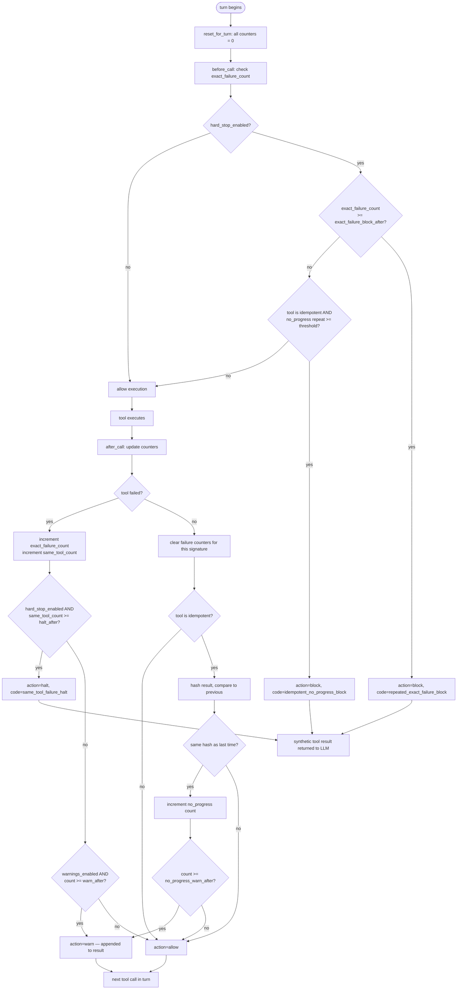

**TL;DR** — When the model requests multiple tools at once, Hermes decides in a single pass whether to run them in parallel (up to 8 concurrent worker threads) or one-by-one. It uses `IDEMPOTENT_TOOL_NAMES` and `MUTATING_TOOL_NAMES` as the key signal for that decision. Separately, `ToolCallGuardrailController` watches for repeated failures and — when configured — halts the loop before it burns the whole iteration budget on a stuck tool. This chapter explains both mechanisms and how they work together to keep the agent loop moving safely.

# Sequential vs Concurrent Tool Dispatch and the Guardrail Controller

## The problem: the model can ask for many tools at once

After each LLM response, the agent may receive not one tool call but several. A typical coding turn might include a `read_file` for the module, a `web_search` for an error message, and a `search_files` sweep — three separate calls. If we execute them one-by-one, we wait for each to finish before starting the next. For slow tools like web searches that can mean several extra seconds per turn.

But we cannot run everything in parallel without care. If the model asks to `read_file` *and* `write_file` the same path, running them at the same time risks a race condition — the read might see a half-written file. And tools like `terminal` or `execute_code` can do anything: they might create files, delete them, change directories. Running two of those at once is asking for unpredictable interactions.

Hermes resolves this with a **single gating function** that inspects the whole batch before a single thread is started.

---

## How the dispatch decision works

The entry point is `AIAgent._execute_tool_calls()` in `run_agent.py`. Every time the conversation loop hands it a list of tool calls, it calls `_should_parallelize_tool_batch()` (defined in `agent/tool_dispatch_helpers.py`) and branches on the result:

```python
# Simplified view of _execute_tool_calls() — run_agent.py
def _execute_tool_calls(self, assistant_message, messages, effective_task_id, api_call_count=0):
    tool_calls = assistant_message.tool_calls
    if not _should_parallelize_tool_batch(tool_calls):
        return self._execute_tool_calls_sequential(
            assistant_message, messages, effective_task_id, api_call_count
        )
    return self._execute_tool_calls_concurrent(
        assistant_message, messages, effective_task_id, api_call_count
    )
```

The gating function is the heart of the decision:

```python
# Simplified view of _should_parallelize_tool_batch() — agent/tool_dispatch_helpers.py

# Tools that must NEVER run in parallel (interactive / user-facing)
_NEVER_PARALLEL_TOOLS = frozenset({"clarify"})

# Read-only tools with no shared mutable session state
_PARALLEL_SAFE_TOOLS = frozenset({
    "ha_get_state", "ha_list_entities", "ha_list_services",
    "read_file", "search_files", "session_search",
    "skill_view", "skills_list",
    "vision_analyze", "web_extract", "web_search",
})

# File tools that can run concurrently when their target paths don't overlap
_PATH_SCOPED_TOOLS = frozenset({"read_file", "write_file", "patch"})

def _should_parallelize_tool_batch(tool_calls) -> bool:
    if len(tool_calls) <= 1:
        return False  # Nothing to parallelize

    tool_names = [tc.function.name for tc in tool_calls]
    if any(name in _NEVER_PARALLEL_TOOLS for name in tool_names):
        return False  # clarify must be sequential

    reserved_paths = []
    for tool_call in tool_calls:
        tool_name = tool_call.function.name
        function_args = json.loads(tool_call.function.arguments)

        if tool_name in _PATH_SCOPED_TOOLS:
            scoped_path = _extract_parallel_scope_path(tool_name, function_args)
            if scoped_path is None:
                return False
            if any(_paths_overlap(scoped_path, existing) for existing in reserved_paths):
                return False  # Two tools target overlapping paths
            reserved_paths.append(scoped_path)
            continue

        if tool_name not in _PARALLEL_SAFE_TOOLS:
            # Not known-safe and not MCP-opted-in: fall back to sequential
            if not _is_mcp_tool_parallel_safe(tool_name):
                return False

    return True
```

Notice that `terminal`, `execute_code`, `write_file` (targeting different paths from each other is the exception), `delegate_task`, and `send_message` are **not** in `_PARALLEL_SAFE_TOOLS`. Any batch that includes one of them falls through to the sequential path unless it is a path-scoped write/patch with non-overlapping targets.

The flowchart below captures the decision:



---

## The two execution paths

### Sequential path

`execute_tool_calls_sequential()` (in `agent/tool_executor.py`) runs each call in order on the main agent thread. It checks for user interrupts *between* each tool, so a `/stop` command during a long sequence takes effect at the next tool boundary rather than waiting for the whole batch to finish.

Use cases: any batch containing `terminal`, `execute_code`, `delegate_task`, `memory`, `todo`, `skill_manage`, `send_message`, and any two tools that touch overlapping file paths.

### Concurrent path

`execute_tool_calls_concurrent()` (also in `agent/tool_executor.py`) uses Python's `concurrent.futures.ThreadPoolExecutor`. The worker count is capped:

```python
# agent/tool_executor.py — line 52
_MAX_TOOL_WORKERS = 8
```

When launching the batch, the executor is sized to the smaller of the batch length and this cap:

```python
# Simplified from execute_tool_calls_concurrent() — agent/tool_executor.py
max_workers = min(len(runnable_calls), _MAX_TOOL_WORKERS)
with concurrent.futures.ThreadPoolExecutor(max_workers=max_workers) as executor:
    for i, tc, name, args in runnable_calls:
        f = executor.submit(propagate_context_to_thread(_run_tool), i, tc, name, args, ...)
        futures.append(f)
    # Wait in 5-second polling intervals, firing heartbeats every ~30s
    # and honouring interrupt signals between polls.
```

The `propagate_context_to_thread()` wrapper copies Python `ContextVar` values (including the session approval key and tool callbacks) into each worker thread so they see the same per-turn context as the main thread.

Results are stored by index into a pre-allocated `results` list, so they are always appended to `messages` in the **original tool-call order** regardless of which worker finished first. The API expects results in the same order as the calls.

> **Important:** the guardrail check runs before any worker is launched. We'll see that next.

---

## The role of IDEMPOTENT_TOOL_NAMES and MUTATING_TOOL_NAMES

The guardrail system (covered below) needs to know whether a tool is *safe to call identically again* or *likely to change something*. That knowledge lives in two frozensets defined in `agent/tool_guardrails.py`:

```python
# agent/tool_guardrails.py — lines 20–60

IDEMPOTENT_TOOL_NAMES = frozenset({
    "read_file",
    "search_files",
    "web_search",
    "web_extract",
    "session_search",
    "browser_snapshot",
    "browser_console",
    "browser_get_images",
    "mcp_filesystem_read_file",
    "mcp_filesystem_read_text_file",
    "mcp_filesystem_read_multiple_files",
    "mcp_filesystem_list_directory",
    "mcp_filesystem_list_directory_with_sizes",
    "mcp_filesystem_directory_tree",
    "mcp_filesystem_get_file_info",
    "mcp_filesystem_search_files",
})

MUTATING_TOOL_NAMES = frozenset({
    "terminal",
    "execute_code",
    "write_file",
    "patch",
    "todo",
    "memory",
    "skill_manage",
    "browser_click",
    "browser_type",
    "browser_press",
    "browser_scroll",
    "browser_navigate",
    "send_message",
    "cronjob",
    "delegate_task",
    "process",
})
```

These two sets are also the `idempotent_tools` and `mutating_tools` fields on `ToolCallGuardrailConfig`, which the controller consults at runtime. A tool not in either set is treated as "unknown" for guardrail purposes — the controller's `_is_idempotent()` method returns `False` for anything not in the idempotent set (unless it is in the mutating set, where it also returns `False`).

---

## The second problem: getting stuck in a failure loop

Now we have a problem that parallelism alone can't solve. Imagine the model calls `terminal` to run a script. The script fails. The model reads the error, tweaks nothing, calls `terminal` again. Same failure. Tweaks nothing, calls again. This can repeat until the iteration budget is exhausted (see [Iteration Budget, Toolsets, and the Tools Registry](./iteration-budget-and-toolsets.md), which covers how `IterationBudget` limits total loop turns). The agent has burned its entire budget re-running a broken command.

This is the problem `ToolCallGuardrailController` solves.

> **What it is not:** The guardrail controller is a **loop-integrity mechanism**, not a security boundary. It does not sandbox tools, limit file access, or prevent the model from calling dangerous commands. Those concerns belong to the approval gate and denied-paths list. The guardrail controller's sole job is to notice "the model is repeating a failing pattern" and either warn it or stop it.

---

## How ToolCallGuardrailController works

The controller lives in `agent/tool_guardrails.py` and is instantiated once per agent (at `AIAgent` init). It holds three counters per turn, all reset at the start of each new turn:

| Counter | What it tracks |
|---|---|
| `_exact_failure_counts` | Number of failures for a specific (tool name + identical args) combination |
| `_same_tool_failure_counts` | Number of failures for a tool name, regardless of args |
| `_no_progress` | Number of times an idempotent tool returned the exact same result with identical args |

The controller exposes two hooks the executor calls around each tool call:

- **`before_call(tool_name, args)`** — called before execution. If `hard_stop_enabled` is `True` and a threshold is already exceeded, returns a `ToolGuardrailDecision` with `action="block"`, preventing execution. If `hard_stop_enabled` is `False` (the default), always returns `action="allow"`.
- **`after_call(tool_name, args, result, failed=...)`** — called after execution. Updates the counters. Returns a decision with `action="warn"`, `"halt"`, or `"allow"` depending on thresholds and config.

`ToolGuardrailDecision` has a simple allows-or-not property:

```python
@property
def allows_execution(self) -> bool:
    return self.action in {"allow", "warn"}

@property
def should_halt(self) -> bool:
    return self.action in {"block", "halt"}
```

---

## Configuration: the four thresholds

`ToolCallGuardrailController` is configured by a `ToolCallGuardrailConfig` dataclass. All defaults are defined in `agent/tool_guardrails.py`:

```python
@dataclass(frozen=True)
class ToolCallGuardrailConfig:
    warnings_enabled: bool = True
    hard_stop_enabled: bool = False        # opt-in — False by default
    exact_failure_warn_after: int = 2
    exact_failure_block_after: int = 5
    same_tool_failure_warn_after: int = 3
    same_tool_failure_halt_after: int = 8
    no_progress_warn_after: int = 2
    no_progress_block_after: int = 5
    idempotent_tools: frozenset = IDEMPOTENT_TOOL_NAMES
    mutating_tools: frozenset = MUTATING_TOOL_NAMES
```

A few things to notice:

- `hard_stop_enabled` defaults to `False`. In default interactive CLI or TUI sessions, the guardrail generates **warnings** (text appended to the tool result the model sees) but never blocks or halts. The model is nudged, not stopped.
- `hard_stop_enabled: true` must be set explicitly in `config.yaml` to activate the circuit-breaker behaviour. Once enabled, blocking and halting kicks in when counters exceed the `_block_after` / `_halt_after` thresholds.

The thresholds map to three distinct failure patterns:

| Threshold | Pattern detected | Default value |
|---|---|---|
| `exact_failure_block_after` | Same tool name **and** identical args failed this many times | 5 |
| `same_tool_failure_halt_after` | Same tool name failed this many times (any args) | 8 |
| `no_progress_block_after` | Idempotent tool returned identical result this many times | 5 |

To enable hard stops in `~/.hermes/config.yaml`:

```yaml
tool_loop_guardrails:
  hard_stop_enabled: true
  hard_stop_after:
    exact_failure: 5          # block on 5th identical failure
    same_tool_failure: 8      # halt on 8th failure of same tool
    idempotent_no_progress: 5 # block on 5th identical read result
  warn_after:
    exact_failure: 2
    same_tool_failure: 3
    idempotent_no_progress: 2
```

---

## The guardrail state machine

Here is how the controller transitions between states for a single tool across a turn. The exact-failure path (same tool + same args) is the most common to encounter:



Notice the difference between `block` and `halt`:

- **`block`** fires in `before_call`. The tool never executes. A synthetic error result is returned to the LLM with a message explaining the block.
- **`halt`** fires in `after_call`, after the tool has already run and failed. The failure was recorded. The model is told to stop the current failing strategy.

---

## Worked example: 3 reads + 1 write in one turn

Let's trace a realistic turn. The model is asked to inspect three source files and then patch one of them. It emits four tool calls:

1. `read_file(path="src/auth.py")`
2. `read_file(path="src/models.py")`
3. `web_search(query="sqlalchemy session thread safety")`
4. `write_file(path="src/auth.py", ...)`

**Step 1 — `_should_parallelize_tool_batch()` runs.**

- `len(tool_calls) == 4` — not a single call, continue.
- None of the names are in `_NEVER_PARALLEL_TOOLS`.
- Walk each call:
  - `read_file("src/auth.py")`: in `_PATH_SCOPED_TOOLS`. Extract path → `abs/src/auth.py`. No reserved paths yet. Add it. Continue.
  - `read_file("src/models.py")`: in `_PATH_SCOPED_TOOLS`. Extract path → `abs/src/models.py`. No overlap with `auth.py`. Add it. Continue.
  - `web_search(...)`: not in `_PATH_SCOPED_TOOLS`. Check `_PARALLEL_SAFE_TOOLS` — `web_search` is in the set. Continue.
  - `write_file("src/auth.py", ...)`: in `_PATH_SCOPED_TOOLS`. Extract path → `abs/src/auth.py`. Check reserved paths — overlap with the first `read_file`. **Return `False`.**

The batch falls through to `execute_tool_calls_sequential`. All four tools run one-by-one.

Now imagine the write is to a *different* file — `write_file(path="src/auth_v2.py")`. The path does not overlap with either reserved path. All tools are either in `_PARALLEL_SAFE_TOOLS` or path-scoped with non-overlapping targets. `_should_parallelize_tool_batch()` returns `True`. The three reads and the write all run concurrently in up to 4 worker threads (min(4, 8) = 4).

---

## Edge case: guardrail halting the loop after repeated failures

Let's say `hard_stop_enabled: true` is set in `config.yaml` and the model is stuck calling:

```
terminal(command="python migrate.py --env prod")
```

...and the script fails every time with the same exit code because the database is unreachable.

**Turn start:** `reset_for_turn()` zeroes all counters.

**Calls 1–4:** Each call goes through `before_call` → no threshold exceeded → tool runs → `after_call` → `failed=True` → `exact_failure_count["terminal::<hash>"]` increments; `same_tool_failure_counts["terminal"]` increments. Warnings start appearing in the tool result text after the 2nd exact failure and after the 3rd same-tool failure, but execution is not blocked.

**Call 5 — `before_call`:** `exact_failure_count` for this signature is now 4, which is less than `exact_failure_block_after=5`. Still allowed.

**Call 5 — `after_call`:** `exact_failure_count` rises to 5 (equal to `exact_failure_block_after`). `same_tool_failure_counts["terminal"]` is now 5.

**Call 6 — `before_call`:** `exact_failure_count == 5 >= exact_failure_block_after`. The controller returns `action="block"`. The executor sees `allows_execution == False`. It synthesises a tool result:

```json
{
  "error": "Blocked terminal: the same tool call failed 5 times with identical arguments. Stop retrying it unchanged; change strategy or explain the blocker.",
  "guardrail": {
    "action": "block",
    "code": "repeated_exact_failure_block",
    "tool_name": "terminal",
    "count": 5
  }
}
```

This JSON lands in the conversation as the tool's result. The LLM receives it on the next iteration and is expected to change strategy — perhaps calling `web_search` to look up the error, or calling `clarify` to ask the operator what to do.

**What the operator sees:** In non-quiet mode, a log line like `Tool terminal returned error (0.00s): {"error": "Blocked terminal: ..."}` appears in the agent's output. The same result is visible in any observer hooks or Langfuse traces attached to the session. The guardrail decision metadata (`code`, `count`, `tool_name`) is included in the JSON so operator tooling can distinguish a guardrail block from a genuine runtime failure.

If `same_tool_failure_halt_after` (default 8) is reached first — meaning the tool failed 8 times in the same turn, possibly with varying arguments — the `after_call` returns `action="halt"` instead. The agent loop in `agent/conversation_loop.py` checks `halt_decision` and ends the turn with a descriptive error rather than continuing to the next LLM call.

> **Note:** All threshold defaults are `hard_stop_enabled: False`. An agent running interactively will receive warning text appended to tool results but will never be hard-stopped unless the operator explicitly opts in via `config.yaml`.

---

## Quick reference: guardrail thresholds

| Field | Config YAML key | Default | Effect |
|---|---|---|---|
| `warnings_enabled` | `warnings_enabled` | `true` | Append warning text to tool results at warn thresholds |
| `hard_stop_enabled` | `hard_stop_enabled` | `false` | Enable `block`/`halt` actions; warnings only if `false` |
| `exact_failure_warn_after` | `warn_after.exact_failure` | 2 | Warn after N identical-arg failures |
| `exact_failure_block_after` | `hard_stop_after.exact_failure` | 5 | Block tool before execution after N identical-arg failures |
| `same_tool_failure_warn_after` | `warn_after.same_tool_failure` | 3 | Warn after N same-tool failures (any args) |
| `same_tool_failure_halt_after` | `hard_stop_after.same_tool_failure` | 8 | Halt loop after N same-tool failures |
| `no_progress_warn_after` | `warn_after.idempotent_no_progress` | 2 | Warn after idempotent tool returns same result N times |
| `no_progress_block_after` | `hard_stop_after.idempotent_no_progress` | 5 | Block idempotent tool returning same result N times |

---

## Putting it together

Here is how the two systems interact in the executor. For each tool call (concurrent or sequential):

1. **Guardrail pre-check** (`before_call`) runs first, before any checkpoint, before any worker thread is started.
2. If `allows_execution` is `False`, a synthetic blocked result is placed directly in the results list. No thread is started for that call.
3. If `allows_execution` is `True`, the tool runs (in a worker thread for the concurrent path, inline for sequential).
4. After the tool completes, **`after_call`** records the outcome and returns a decision.
5. If the decision is `warn` or `halt`, `append_toolguard_guidance()` appends the guidance text to the tool's result string so the model sees it in the conversation.
6. If the decision is `halt`, the agent loop detects it via `controller.halt_decision` and terminates the current turn.

The concurrent path evaluates all calls in the pre-flight phase before any worker launches, ensuring that a guardrail block on one call does not race with the execution of another.

---

← Previous: [Iteration Budget, Toolsets, and the Tools Registry](./iteration-budget-and-toolsets.md) · Next: [The Five Memory Layers](../memory/five-memory-layers.md) →
