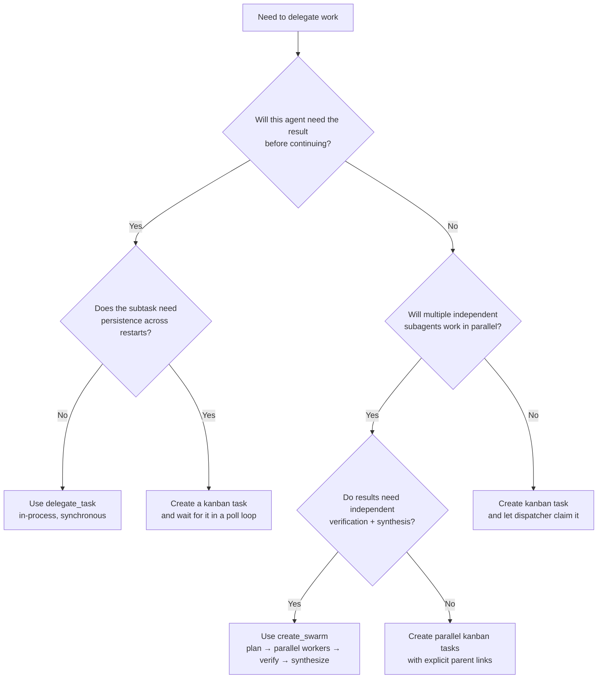

**TL;DR** — This is the capstone chapter. Now that we understand how every Hermes mechanism works, we can reason about *how to use them well*. Here we work through nine concrete decisions — from choosing between `delegate_task`, kanban, and swarms, to authoring skills the Curator will keep — each grounded in the real behaviour we explored in the chapters before this one.

# Best Practices — Delegation, Budgets, Credentials, Memory, and Skill Authoring

Every mechanism we have covered throughout this guide was introduced in the context of a specific problem. Now we step back and ask: given that we understand the mechanisms, what does *good* look like in practice? This chapter collects opinionated, Hermes-specific guidance for nine recurring decisions. Each section opens with the decision, names the mechanism it involves, and explains why the recommendation follows from the real behaviour rather than from general agent-framework advice.

A few pointers before we begin. Several of the topics here build directly on earlier chapters:

- **In-process delegation** (`delegate_task`) is covered in [In-Process Delegation](../multi-agent/in-process-delegation.md).
- **Kanban dispatch** is covered in [Kanban Dispatch](../multi-agent/kanban-dispatch.md).
- **Swarm topologies** (`create_swarm`) are covered in [Swarm Topologies](../multi-agent/swarm-topologies.md).
- **Credential pools** are covered in [Credential Pool and Failover](../providers/credential-pool-and-failover.md).
- **The Curator and the learning loop** are covered in [Curator and the Learning Loop](../skills/curator-and-the-learning-loop.md).
- **Security boundaries** are covered in [OS Boundary and Isolation Postures](../security/os-boundary-and-isolation-postures.md).
- **Observer hooks** are covered in [Logs, Hooks, and Plugins](../observability/logs-hooks-and-plugins.md).

---

## 1. When to use `delegate_task` vs. a kanban task vs. a swarm

The most common source of confusion when building multi-agent workflows is choosing the wrong concurrency mechanism and then wondering why it doesn't behave the way you expected. Let's be precise.

**The three mechanisms are genuinely different things.** They share the word "agent" but they differ in where work runs, how state is stored, and what happens when the job is done:

- `delegate_task` spawns a child `AIAgent` instance *inside the current process*. It is synchronous from the parent's perspective: the parent blocks until the child returns a summary. The child inherits the parent's model credentials and runs with a restricted toolset. There is a depth cap: by default, `MAX_DEPTH = 1`, meaning a parent can create one level of children (configurable via `delegation.max_spawn_depth`). An `orchestrator`-role child can spawn grandchildren when depth ≥ 2. This is ephemeral: nothing persists to a board.
- A **kanban task** is a row in a SQLite database (`~/.hermes/kanban/boards/<slug>/kanban.db`). It has a nine-status lifecycle (`triage → todo → scheduled → ready → running → blocked → review → done → archived`). Workers claim tasks via an atomic CAS lock (`claim_task()`) with a 15-minute TTL (overridable via `HERMES_KANBAN_CLAIM_TTL_SECONDS`). Tasks survive restarts; the dispatcher tick (`dispatch_once()`) reclaims crashed workers. This is persistent and asynchronous.
- A **swarm** (via `create_swarm()`) is a structured Kanban task graph: a planning root (immediately marked `done` with topology metadata), parallel `SwarmWorkerSpec` workers (each a kanban task, immediately `ready`), a verifier (waits for all workers), and a synthesizer (waits for the verifier). The shared coordination surface is the `[swarm:blackboard]` comment on the root task. A swarm *is* kanban — it is a topology written into the kanban kernel, not a separate scheduler.

Here is a decision flowchart to use when designing a workflow:



And the same information as a lookup table:

| Situation | Recommended mechanism | Why |
|---|---|---|
| Quick subtask, result needed immediately, no restart risk | `delegate_task` | Synchronous; no board overhead; result flows back as text summary |
| Long-running task, survives restarts, assigned to a specific profile | Kanban task | Persistent SQLite row; dispatcher reclaims crashed workers; 15-min claim TTL |
| One goal that fans out to parallel specialists + needs verification | `create_swarm()` | Writes a full task graph in one call; blackboard coordinates workers; verifier + synthesizer already wired |
| Work that may block on human input or an external gate | Kanban task with `blocked` status | `kanban_block` tool pauses the card; human or orchestrator calls `kanban_unblock` |
| Orchestrator that needs to spawn sub-orchestrators | `delegate_task` with `role='orchestrator'` and `max_spawn_depth ≥ 2` | Flat by default; depth cap prevents runaway nesting |
| Recurring analysis that runs on a schedule and delivers output | Cron job (not delegation) | Cron has `context_from`, delivery targets, and the stale-run grace system — delegation has none of these |

**A concrete example.** Imagine we want to refactor a large codebase. We need three things: (1) a static analysis pass, (2) the actual refactoring, and (3) a review to check that tests still pass. These are sequential, each needs persistence, and the analysis and refactoring can fail and be retried. The right shape is a swarm with `create_swarm()`: the planning root records the overall goal on the blackboard, two workers run analysis and refactoring in parallel (if the dependency structure allows), the verifier checks the output, and the synthesizer writes the summary. If we had used `delegate_task`, a crash mid-refactor would discard all progress with no way to resume.

---

## 2. Sizing iteration budgets (`max_iterations`)

Every `AIAgent` instance holds an `IterationBudget`. Each call to the model counts as one iteration. The parent budget defaults to 90 (`max_iterations`); a subagent's budget defaults to 50 (`delegation.max_iterations`). When the budget runs out, the agent gets *one* additional API call — the `_budget_grace_call` — to wrap up and produce a summary. After the grace call, the loop terminates.

The grace call exists because the code comment in `agent_init.py` explains it well: "No intermediate pressure warnings — they caused models to 'give up' prematurely on complex tasks." The agent is not told it is running out of budget until the very last moment.

**Why does this matter for sizing?** If you set `max_iterations` too low, the agent will exhaust its budget mid-task, trigger the grace call, and return an incomplete result. If you set it too high, you pay for unnecessary model calls on short tasks and lose the natural forcing function that stops runaway loops.

Here are sizing guidelines derived from the task types we have seen throughout this guide:

| Task type | Recommended `max_iterations` | Notes |
|---|---|---|
| Short Q&A, single-tool lookup | 5–15 | One or two model calls plus a tool call |
| Multi-step file/code task with testing | 30–60 | File reads, patches, test runs, iteration |
| Open-ended research with web + synthesis | 50–90 (default) | Several tool calls per step; benefits from the full budget |
| Kanban worker on a well-scoped card | 20–40 via `delegation.max_iterations` | Scoped cards need less; wide-open cards need more |
| Swarm worker (single specialisation) | 20–30 | Workers are narrower than orchestrators |

In `config.yaml`, the parent budget is set at the top level:

```yaml
# config.yaml
max_iterations: 50
delegation:
  max_iterations: 30
```

**The grace call is your safety net, not your plan.** Design tasks so the agent finishes within its budget under normal conditions. If you find the grace call triggering regularly, the task is either under-budgeted or under-scoped — split the work or raise the limit.

**One edge case to remember.** `execute_code` tool calls refund their iteration via `budget.refund()`. This means programmatic code execution does not eat into the budget the way model calls do. Factor this in when analysing logs: a session with many `execute_code` calls will show fewer iterations consumed than the number of tool calls suggests.

---

## 3. Credential pool configuration for redundancy and cost control

The `CredentialPool` is Hermes's key-rotation and failover layer. We introduced it in [Credential Pool and Failover](../providers/credential-pool-and-failover.md). Here we focus on the decisions that matter for production deployments.

**Rotation strategy.** The pool supports four strategies (defined in `agent/credential_pool.py`):

| Strategy | Behaviour | Best for |
|---|---|---|
| `fill_first` | Use the first available key until it exhausts, then move on | Cost control: burn through one key's quota before touching the next |
| `round_robin` | Cycle keys in order | Spreading load evenly across multiple accounts |
| `random` | Pick randomly from available keys | Reducing hotspots when many keys are present |
| `least_used` | Pick the key with the fewest invocations so far | Even long-term wear when keys have distinct quotas |

For most deployments with two or three keys across providers, `round_robin` is the right default. `fill_first` makes sense when you have a primary key with a large quota and a backup key you only want used if the primary is exhausted.

**Multiple keys.** Add redundancy in `config.yaml` by listing keys per provider. When one key cools down after a 401 (5-minute cooldown, `EXHAUSTED_TTL_401_SECONDS = 5 * 60`) or a 429/402 (1-hour cooldown, `EXHAUSTED_TTL_429_SECONDS = 60 * 60`), the pool automatically moves to the next available key. A key that receives a permanent OAuth error (`token_invalidated`, `token_revoked`, `invalid_grant`, etc.) is permanently set to `STATUS_DEAD` and excluded from rotation unconditionally — it will never recover without a fresh re-auth.

```yaml
# config.yaml — example: two Anthropic keys with round-robin
model:
  provider: anthropic
  model: claude-opus-4-5

credential_pool:
  strategy: round_robin
  providers:
    anthropic:
      - key: sk-ant-...first...
        label: primary
      - key: sk-ant-...second...
        label: backup
```

**Cost control through cooldown awareness.** The 429/402 cooldown of one hour is intentional: it prevents hammering a rate-limited API. If you are hitting 429s regularly, you have a rate-limit problem, not a Hermes configuration problem. Raise your API tier or add more keys. The `STATUS_DEAD` mechanism protects you from silent billing failures: a permanently invalid credential will never be tried again until you explicitly re-authenticate (`hermes auth add`).

**Auxiliary client.** Hermes uses a separate auxiliary client for compression, vision, and `SessionDB` search. This client resolves through the same `CredentialPool`. If you are restricting providers, confirm the auxiliary client can reach a model that supports the features you rely on.

---

## 4. Memory provider selection

`MemoryManager` — introduced in [the memory layers chapter](../memory/five-memory-layers.md) — connects Hermes to exactly one external memory provider at a time, alongside the built-in `SessionDB`. Here we choose which one.

The external providers available as plugins under `plugins/memory/` are:

| Provider | What it does | Best for |
|---|---|---|
| **Built-in only** (`SessionDB`) | SQLite FTS5 + trigram full-text search over past sessions. Profile-scoped to `~/.hermes/`. No external service needed. | Offline/air-gapped deployments; users who want zero external dependencies; search over raw conversation history |
| **Honcho** | AI-native cross-session user modelling: peer cards, dialectic Q&A, semantic search, persistent conclusions. Config: `$HERMES_HOME/honcho.json`. | Deep user modelling; multi-session personality tracking; "who is this user?" use cases |
| **Hindsight** | Knowledge graph with entity resolution, multi-strategy retrieval. Cloud or local mode. Config: `HINDSIGHT_API_KEY` / `$HERMES_HOME/hindsight/config.json`. | Structured knowledge recall; code + doc knowledge banks; teams that already use Hindsight |
| **Mem0** | Server-side LLM fact extraction, semantic search with reranking, automatic deduplication. Config: `MEM0_API_KEY` / `$HERMES_HOME/mem0.json`. Has a built-in circuit breaker: pauses calls for 120 seconds after 5 consecutive failures. | Durable factual memory across many sessions; "what did we decide about X?" recall |

**Decision guidance:**

- If you are running on a $5 VPS with no cloud dependencies, start with the built-in `SessionDB`. Hermes's FTS5 + trigram search is already useful for finding past conversations.
- If you care most about *who the user is* (preferences, style, persona), add Honcho. Its peer-card model is purpose-built for that.
- If you care most about *structured facts and knowledge* (code patterns, project decisions, domain knowledge), Hindsight's knowledge graph gives better structured retrieval than a flat fact store.
- If you want durable, deduplicated facts with minimal setup and a managed API, Mem0 is the easiest to wire in.

In `config.yaml`, select the provider:

```yaml
# config.yaml
memory:
  provider: honcho    # or: hindsight, mem0, builtin
```

Each provider has its own config file or env vars (see the plugin's `__init__.py` for the complete list). The `MemoryManager` calls `prefetch_all()` before each turn (injecting recall into `<memory-context>` tags) and `sync_all()` after each turn on a background thread. This pattern is the same regardless of which external provider you choose.

---

## 5. Observer hook design

Observer hooks — covered in detail in [Logs, Hooks, and Plugins](../observability/logs-hooks-and-plugins.md) — are the primary way to add telemetry, tracing, or audit export to a Hermes deployment. Here we focus on three design decisions that determine whether a plugin is a pleasure or a liability to operate.

### Fail-open is a contract, not a fallback

Every hook callback is fail-open. Hermes catches exceptions from hook callbacks, logs a warning, and keeps the agent loop running. This is documented behaviour in `docs/observability/README.md`. You should treat this as a contract, not as a forgiving fallback:

- **Never** write plugin code that depends on hook callbacks succeeding for correctness. If your plugin needs to do something critical, it belongs in middleware (which has explicit return semantics), not in an observer hook.
- **Always** write your hooks to be fast. The observer README notes: "Keep hook callbacks fast and fail-open. Offload network export or batch writes when practical." A slow hook delays the agent loop; a very slow hook may cause the agent to appear unresponsive.
- Log hook failures in your plugin, but handle them gracefully.

### Pin the schema version

Every hook payload includes:

```python
telemetry_schema_version = "hermes.observer.v1"
```

This field is injected by `hermes_cli/middleware.py` (`OBSERVER_SCHEMA_VERSION = "hermes.observer.v1"`). Your plugin should check this version on startup. As Hermes evolves, new fields will be added (additive) and the schema version will increment for breaking changes. A plugin that ignores the version will silently process mismatched payloads.

```python
# Minimal version-aware observer plugin
def register(ctx):
    ctx.register_hook("pre_api_request", on_pre_api_request)
    ctx.register_hook("post_api_request", on_post_api_request)
    ctx.register_hook("pre_tool_call", on_pre_tool_call)
    ctx.register_hook("post_tool_call", on_post_tool_call)


def on_pre_api_request(**kwargs):
    schema = kwargs.get("telemetry_schema_version")
    if schema != "hermes.observer.v1":
        return  # unknown schema; skip safely
    start_span(
        request_id=kwargs.get("api_request_id"),
        model=kwargs.get("model"),
        request=kwargs.get("request"),   # sanitized payload
    )
```

### Use correlation IDs, not callback order

The observer system provides stable IDs specifically so plugins do not need to depend on callback invocation order:

| ID | What it links |
|---|---|
| `session_id` | All events within one conversation session |
| `turn_id` | All API calls and tool calls within one user turn |
| `api_request_id` | One provider API attempt (use this for LLM span correlation) |
| `tool_call_id` | One tool call (use this to match `pre_tool_call` → `post_tool_call`) |
| `parent_session_id` / `child_session_id` | Delegation — links parent and subagent sessions |

Use `api_request_id` to open and close LLM spans, and `tool_call_id` to open and close tool spans. Do not rely on the fact that `pre_api_request` always arrives before `post_api_request` within a wall-clock window — if your plugin offloads to a queue or background thread, the order guarantee can break. The IDs make ordering explicit.

**The `has_hook` gate.** The observer README notes that expensive payload construction (sanitizing full request/response bodies) is gated behind `has_hook(...)`. Hermes only builds those payloads if a plugin registered the relevant hook. Register only the hooks your plugin actually consumes. A plugin that registers every hook speculatively imposes payload construction cost on every agent call, even when you are not using the data.

---

## 6. Cron job design

Cron jobs — covered in [Cron Scheduler and Autonomy](../autonomy/cron-scheduler.md) — are how we give Hermes recurring autonomous work. Three design decisions determine whether a cron job is reliable in production.

### Understand the stale-run grace window

If a recurring job's `next_run_at` is in the past by more than the grace window (half the schedule period, clamped between 120 seconds and 7200 seconds), the job is skipped and advanced to the next future occurrence. This protects against the scenario where Hermes was offline for a week and a daily job would otherwise try to run seven times in rapid succession on restart.

**Practical implication:** for jobs with wide schedules (e.g., `every 7d`), the grace window is clamped at 7200 seconds (2 hours). If Hermes was offline for 3 days and restarts, the job fires once (for the missed window within the grace period) and then waits for the next scheduled occurrence. For jobs with narrow schedules (e.g., `every 5m`), the grace window is 150 seconds (half of 5 minutes). A brief outage will cause a single skipped run, not a cascade.

Design jobs to be idempotent: running a job twice should produce the same outcome as running it once. This is the safest assumption given the grace-window behaviour.

### Use `no_agent=True` for pure-script jobs

Cron jobs that do not require LLM reasoning — cleanup scripts, file archiving, metric exports, health checks — should use the `no_agent` flag. When `no_agent=True`, the job runs the script directly and delivers its stdout to the configured delivery target. No `AIAgent` is spawned, no model call is made, no iteration budget is consumed.

```yaml
# config.yaml — script-only cron job
cron:
  jobs:
    - name: nightly-cleanup
      schedule: "0 2 * * *"    # 02:00 every night
      script: ~/.hermes/scripts/cleanup.sh
      no_agent: true
      deliver: telegram://me
```

This is especially important for jobs that run frequently (e.g., every 5 minutes). Running an LLM for a simple file rotation wastes tokens and adds latency. Reserve agent-mode cron jobs for tasks that genuinely require reasoning.

**The inactivity timeout.** Agent-mode cron jobs are subject to a 600-second inactivity timeout (the real default from `cron/scheduler.py:1808-1824`, overridable via `HERMES_CRON_TIMEOUT`; set to `0` for unlimited). This timeout fires if the agent stops making API calls or tool calls for 600 consecutive seconds — it is an *inactivity* timeout, not a hard wall-clock interrupt. A job that is actively working (calling tools, receiving stream tokens) can run for hours. A hung job is killed at 600 seconds of silence.

Script-only jobs use the separate `HERMES_CRON_SCRIPT_TIMEOUT` env variable.

### Chain context with `context_from`

When a sequence of cron jobs builds on each other's output, use `context_from` to pass the previous job's result into the next one as context. This avoids re-reading files or re-fetching data that the previous run already processed. It is the cron equivalent of the parent-task context injection that `build_worker_context()` provides in the kanban system.

---

## 7. Security deployment checklist

The security architecture is covered fully in [OS Boundary and Isolation Postures](../security/os-boundary-and-isolation-postures.md). Here we distil it into a checklist for production deployments. Start from Hermes's own SECURITY.md statement:

> **"The only security boundary against an adversarial LLM is the operating system. Nothing inside the agent process constitutes containment — not the approval gate, not output redaction, not any pattern scanner, not any tool allowlist."**

Every decision below flows from this framing.

| Decision | Recommendation | Grounded in |
|---|---|---|
| **Terminal backend for untrusted workloads** | Use a non-default backend: Docker, SSH, Singularity, Modal, or Daytona. The local backend runs commands directly on the host. | `SECURITY.md §2.2` — terminal-backend isolation confines LLM-emitted shell and file operations |
| **Untrusted input surfaces (open web, inbound email, multi-user channels)** | Use whole-process wrapping (Docker Compose or NVIDIA OpenShell). Terminal-backend isolation alone does not confine code-execution subprocesses, MCP subprocesses, or plugin loading. | `SECURITY.md §2.2` — whole-process wrapping is the supported posture for untrusted inputs |
| **Network egress for Docker deployments** | Use the two-network model from `docs/security/network-egress-isolation.md`: an `internal` bridge (no internet, where the agent and dashboard run) + an `egress` bridge (internet-capable, where the gateway runs). Add a Squid or Envoy egress proxy with an explicit allowlist to block arbitrary outbound connections from tool-emitted shell commands. | `docs/security/network-egress-isolation.md` |
| **Multi-user deployments** | Run a separate agent instance per user via profile isolation (`~/.hermes/profiles/<name>/`). Each profile has its own home directory, config, keys, memory, skills, and kanban boards. Do not share a single instance across users — Hermes is a single-tenant personal agent. | `SECURITY.md §2.6` — within the authorized set, all callers are equally trusted |
| **Network-exposed adapters** | Configure a caller allowlist for every enabled adapter. Adapters that fail open when no allowlist is configured are code bugs, not intended behaviour. | `SECURITY.md §2.6` |
| **Credentials** | Keep credentials in the `.env` file with owner-only permissions (`chmod 600`). Never in the main `config.yaml`. Never in version control. Credential scrubbing strips API keys from shell subprocesses and MCP subprocesses by default, but in-process components (plugins, hooks) can still read in-memory credentials. | `SECURITY.md §2.3` |
| **Third-party skills and plugins** | Review before install. For skills, this means reading the Python and scripts, not only `SKILL.md`. The Skills Guard is a review aid — it flags injection patterns in installable skill content, logs to `skills/.hub/audit.log`, and the user sees the flag — but it is not a hard block. | `SECURITY.md §2.4–2.5` |
| **Dashboard / API server** | Default binding is loopback-only. Exposing via `0.0.0.0` is a break-glass operator decision; if you do it, add VPN, Tailscale, or firewall protection. The docker-compose default binds the dashboard to `127.0.0.1`. | `docker-compose.yml`, `SECURITY.md §2.6` |
| **Run as non-root** | The supplied container image runs as a non-root user by default. For bare-metal deployments, create a dedicated user. | `SECURITY.md §4` |

**A note on the in-process heuristics.** The approval gate, the file-write denied-path list, and Skills Guard are useful — they catch accidental or cooperative-mode mistakes. But they are structurally incomplete against a motivated adversarial output. The approval gate's own documentation states: "Shell is Turing-complete; a denylist over shell strings is structurally incomplete." Treat them as helpful defaults, not as your security model.

---

## 8. Skill authoring for longevity

Hermes's defining capability is the closed learning loop: each conversation produces skills (via the background review agent in `agent/background_review.py`), the Curator periodically reviews those skills (inactivity-triggered, forking an `AIAgent` with a restricted toolset), and the result is a library that improves over time. We explored this in [Curator and the Learning Loop](../skills/curator-and-the-learning-loop.md).

The Curator's defaults are:

| Parameter | Default | Config key |
|---|---|---|
| Review interval | 7 days (`DEFAULT_INTERVAL_HOURS = 24 * 7`) | `curator.interval_hours` |
| Minimum idle before running | 2 hours (`DEFAULT_MIN_IDLE_HOURS = 2`) | `curator.min_idle_hours` |
| Mark skill stale after | 30 days unused (`DEFAULT_STALE_AFTER_DAYS = 30`) | `curator.stale_after_days` |
| Auto-archive after | 90 days unused (`DEFAULT_ARCHIVE_AFTER_DAYS = 90`) | `curator.archive_after_days` |

The Curator can: **pin** (preserve indefinitely, blocks archive/consolidation but not content updates), **archive** (remove from active rotation; recoverable), **consolidate** (merge overlapping skills into an umbrella), and **patch** (update a skill's content). It never auto-deletes.

**What makes the Curator pin a skill rather than archive it?**

Looking at the review prompts in `agent/background_review.py`, the signals that drive the Curator toward keeping and improving a skill are:

1. **Class-level scope, not session-specific.** A skill named after a class of task ("python-debugging", "git-workflows", "api-integration") is treated as an umbrella. A skill named after a specific incident or session artifact ("fix-import-error-2025-03-14") will be consolidated or archived quickly. Name skills at the class level.

2. **Correct structure.** A skill consists of `SKILL.md` (the procedure) plus optional support directories: `references/` (knowledge banks, session notes, API excerpts), `templates/` (boilerplate configs and starter files), `scripts/` (deterministic scripts the agent can invoke directly). The Curator prefers skills with a rich `references/` directory over a long flat `SKILL.md`.

3. **Activity and patch count.** The Curator's status display tracks `activity_count`, `use_count`, `view_count`, and `patch_count` per skill. A skill that is used, viewed, and patched frequently is clearly alive. A skill that has zero activity after 30 days is stale; after 90 days it is archived. Build skills you will actually use.

4. **Preference embedding.** When a user expresses a style, format, or workflow preference in conversation (e.g., "stop producing verbose output", "always use snake_case"), the background review agent embeds the preference into the relevant skill — not only into memory. Skills that carry user preferences are harder to archive because they are actively referenced in the context-building phase.

**What the Curator will not touch:**

- **Bundled skills** (shipped with Hermes, e.g., `hermes-agent`).
- **Hub-installed skills** (installed via `hermes skills install`).
- **Pinned skills** (`hermes curator pin <name>`). Pin a skill to prevent archive/consolidation. Pinning does not block content updates — the Curator and the background review agent can still patch a pinned skill.

**Practical authoring tip.** When you use `skill_manage` to create a skill, give it:
- A name at the class level.
- A `SKILL.md` with a clear description and procedure.
- A pointer in `SKILL.md` to any support files you have added.
- A rich set of triggers (the situations where the skill should be loaded).

A skill with one line in `SKILL.md` and no support files will be consolidated or archived at the first Curator run that finds it unused. A skill with a detailed procedure, worked examples in `references/`, and reusable templates is the kind of thing the Curator recognises as valuable.

To check the current state of your skills:

```bash
hermes curator status
```

To run the Curator immediately (without waiting for the idle trigger):

```bash
hermes curator run
```

To protect a skill from archive:

```bash
hermes curator pin <skill-name>
```

---

## 9. Board structure for large projects

Kanban boards in Hermes are isolated at the filesystem level: `~/.hermes/kanban/boards/<slug>/kanban.db`. Each board is a separate SQLite file. The `HERMES_KANBAN_BOARD` env variable pins a profile to a specific board.

**One board per project, not one global board.** A single global board for all work becomes unwieldy quickly. Each project board has its own task graph, its own `task_links` DAG (the parent/child dependency tree), and its own notification subscribers. Separating projects into boards means a runaway dispatcher on one project cannot claim tasks from another.

**One board per profile when profiles correspond to distinct roles.** If you are running multiple profiles (e.g., `default`, `writer`, `coder`, `researcher`), each profile can own its own board. A `coder` profile that only handles code tasks and a `researcher` profile that handles web research benefit from separate boards: their task priorities, failure limits, and notification targets differ.

**Multi-gateway board ownership.** When running multiple gateways — one per profile — only one gateway should have `kanban.dispatch_in_gateway: true`. This is documented in `docs/kanban/multi-gateway.md`: all other gateways set `kanban.dispatch_in_gateway: false`. The reason is concrete: a gateway with dispatch enabled opens per-board SQLite connections for both the dispatcher and the notifier watcher. Multiple gateways doing this multiplies open file descriptors on each `kanban.db` and amplifies WAL `-shm` reader contention. If two gateways both have `dispatch_in_gateway: true`, they will contend on the WAL and corrupt the CAS semantics of `claim_task()`.

```yaml
# ~/.hermes/profiles/writer/config.yaml — non-dispatch gateway
kanban:
  dispatch_in_gateway: false
```

**Board size and the circuit breaker.** The dispatcher includes a circuit breaker: after `DEFAULT_FAILURE_LIMIT` consecutive spawn failures on a single task, the task is auto-blocked with the last error. This prevents the dispatcher from thrashing on an unfixable task. On a large project board with many tasks, watch `hermes kanban status` for tasks stuck in repeated `blocked` state — these are usually caused by mis-configured assignees or environment problems on the worker profile.

---

## Tying it together: Hermes as a learning system

These nine decisions are not independent. They fit together into the identity thread we have carried through this entire guide:

> **Hermes is the self-improving AI agent built by Nous Research. Its defining capability is a closed learning loop: it creates skills from experience, improves them during use, nudges itself to persist knowledge, searches its own past conversations, and builds a deepening model of who the user is across sessions.**

When you size iteration budgets generously for complex tasks, you give the background review agent more conversation to learn from. When you choose the right memory provider for your use case, you deepen the model of who the user is. When you author class-level skills with rich support files, you give the Curator material worth preserving. When you deploy with proper OS-level isolation, you protect the learning loop from adversarial interference.

A well-operated Hermes deployment is not only a configuration exercise — it is an investment in a system that improves the more you use it.

For a full map of all the mechanisms these practices build on, see the [library index](../../index.md).

---

← Previous: [Architecture Decisions and Tradeoffs](./architecture-decisions-and-tradeoffs.md)
