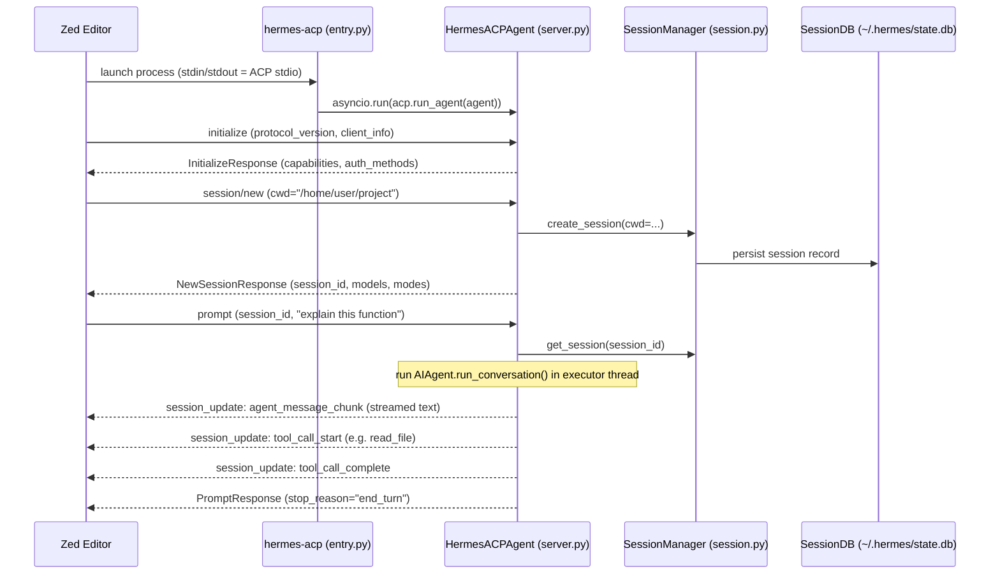
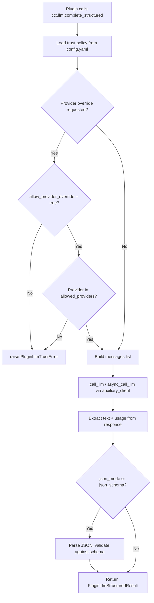
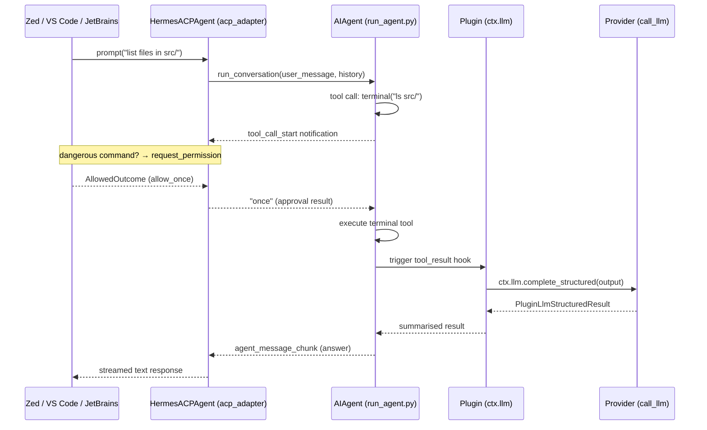

**TL;DR** — Hermes can run inside your IDE (VS Code, Zed, JetBrains) through an ACP adapter that speaks a JSON-RPC protocol called the Agent Client Protocol over stdio. Separately, plugins that need their own model calls use a `ctx.llm` facade that routes through Hermes's provider system and enforces a per-plugin trust gate. After reading this chapter you will be able to register Hermes with an ACP-compatible editor, understand what the editor gets (tools, permission prompts, session management), and write a plugin that calls `ctx.llm.complete()` or `ctx.llm.complete_structured()` — with a provider override if your config allows it.

# ACP Adapter, IDE Integration, and the Plugin LLM Facade

You have Hermes running from the terminal. It answers questions, uses tools, remembers things across sessions. But if you spend most of your day inside an editor — Zed, VS Code, JetBrains — you'd rather drive Hermes from there, not switch to a terminal window. And when you start writing plugins, some of them need to make their own model calls: a hook that rewrites a tool error before you see it, a slash command that summarises a paste, a scheduled job that scores yesterday's activity. Neither of those needs fits into the standard plugin surfaces (register_tool, register_platform, and so on).

This chapter covers both. First we'll look at the **ACP adapter** — the mechanism that lets editors speak to Hermes. Then we'll look at the **plugin LLM facade** — the mechanism that lets plugins speak to the LLM.

---

## Part A: The ACP Adapter

### What is ACP?

**ACP (Agent Client Protocol)** is a JSON-RPC 2.0 protocol for IDEs to drive AI agents. An editor that speaks ACP can open a session, send prompts, receive streamed responses, display tool-call progress, and present permission prompts to the user — all without knowing anything about the agent's internal implementation. Hermes's `acp_adapter/` package implements the server side of this protocol.

The transport is **stdio**: the editor launches the agent process and writes JSON-RPC frames to its stdin; the agent writes JSON-RPC frames back on stdout. Logging goes to stderr so it doesn't contaminate the protocol channel. This means the editor owns the process lifetime, and the connection doesn't need a port or network stack.

> **Note on protocol version.** The code calls `acp.run_agent(agent, use_unstable_protocol=True)` — the ACP spec is in active development. The exact ACP spec version number is not exposed in the source.
<!-- GAP: ACP spec version number — needed for "which version of ACP does Hermes implement"; source only references acp.PROTOCOL_VERSION at runtime -->

### The registry descriptor: `agent.json`

For an IDE to find Hermes, it looks up a **registry descriptor** — a small `agent.json` file that tells it the agent's identity and how to install it. Hermes's descriptor lives in `acp_registry/agent.json`:

```json
{
  "id": "hermes-agent",
  "name": "Hermes Agent",
  "version": "0.16.0",
  "description": "Self-improving open-source AI agent by Nous Research with ACP editor integration, persistent memory, skills, and rich tool support.",
  "repository": "https://github.com/NousResearch/hermes-agent",
  "authors": ["Nous Research"],
  "license": "MIT",
  "distribution": {
    "uvx": {
      "package": "hermes-agent[acp]==0.16.0",
      "args": ["hermes-acp"]
    }
  }
}
```

The fields that matter most for IDE integration:

| Field | Value | What it means |
|---|---|---|
| `id` | `hermes-agent` | The stable identifier editors use to look up the agent |
| `distribution.uvx.package` | `hermes-agent[acp]==0.16.0` | Install command — the `[acp]` extras group adds the ACP SDK |
| `distribution.uvx.args` | `["hermes-acp"]` | The entry-point the editor launches |

So when an editor installs the agent, it runs:

```bash
uvx hermes-agent[acp]==0.16.0 hermes-acp
```

And to connect, it just launches that process and communicates over its stdin/stdout.

### Registering Hermes in an IDE

Once you have Hermes installed (with the `[acp]` extras), the registration pattern is the same across VS Code, Zed, and JetBrains — you point the editor at the launch command. Here is the pattern:

**Command to launch:**
```bash
uvx hermes-agent[acp]==0.16.0 hermes-acp
```

The `hermes-acp` entry point (`acp_adapter/entry.py`) performs three setup tasks before handing off to the ACP server:

1. Loads `~/.hermes/.env` so provider API keys are available.
2. Routes all logging to stderr (so stdout stays clean for JSON-RPC).
3. Discovers MCP tools from `config.yaml` before the event loop starts.

Then it creates a `HermesACPAgent` instance and runs it with `acp.run_agent()`.

**First-run provider setup.** If you haven't yet configured a provider, run:

```bash
uvx hermes-agent[acp]==0.16.0 hermes-acp --setup
```

This drops into the interactive `hermes model` setup flow so you can pick a provider and enter credentials. You can also check that the adapter and its dependencies loaded cleanly:

```bash
uvx hermes-agent[acp]==0.16.0 hermes-acp --check
# Hermes ACP check OK
```

### What happens when an IDE connects

Let's follow an IDE (we'll use Zed as a concrete example) through a full connection:



Let's walk through each step.

**initialize** — The editor announces its name and protocol version. Hermes responds with its capabilities: it supports session forking, listing sessions, resuming sessions, and image inputs in prompts. It also advertises the available authentication methods so the editor knows how to prompt for provider credentials.

**session/new** — Zed sends its workspace path as `cwd`. `SessionManager.create_session()` builds a fresh `AIAgent` instance, assigns a UUID session id, and persists the session to `~/.hermes/state.db` (the shared `SessionDB`). This persistence means that if Hermes crashes or the editor restarts, `session/load` or `session/resume` can restore the full conversation history without re-asking the user.

**prompt** — Zed sends a user message. The server runs `AIAgent.run_conversation()` in a thread-pool executor (with up to 4 workers). As Hermes produces output, callback functions push `session_update` notifications back to Zed:
- Text deltas arrive as `agent_message_chunk`.
- Reasoning/thinking deltas arrive as `agent_thought_chunk` (for models that expose chain-of-thought).
- Tool calls arrive as `tool_call_start` and `tool_call_complete`.
- Hermes's `todo` tool output is translated to ACP's native `plan` update so Zed can show a task panel.

**Session modes and model selection.** Zed shows a mode selector and a model picker in its UI. The adapter maps Hermes's edit-approval policy to three ACP modes:

| ACP mode id | Name | Edit approval policy |
|---|---|---|
| `default` | Default | `ask` — prompt before every edit |
| `accept_edits` | Accept Edits | `workspace_session` — auto-approve workspace edits |
| `dont_ask` | Don't Ask | `session` — auto-approve all file edits for this session |

The model picker lists the curated models for the currently configured provider; switching models triggers `session/set_model`.

### Permission prompts over ACP

Here is where things get interesting. Hermes has a tool-approval system: when a tool wants to run a potentially dangerous command, it calls `prompt_dangerous_approval()` which asks the user to approve, deny, or remember the choice. In a terminal session this is a plain text prompt. In an ACP session, the adapter bridges this to `conn.request_permission()` — the editor shows its own approval UI.

The bridge is `make_approval_callback()` in `acp_adapter/permissions.py`. It translates between Hermes's four approval outcomes and ACP's permission option system:

| ACP option id | ACP kind | Hermes result |
|---|---|---|
| `allow_once` | `allow_once` | `"once"` |
| `allow_session` | `allow_always` | `"session"` |
| `allow_always` | `allow_always` | `"always"` |
| `deny` | `reject_once` | `"deny"` |
| `deny_always` | `reject_always` | `"deny"` |

The callback has a **60-second timeout** (`timeout: float = 60.0`). If the user does not respond within that window (or the future fails), the callback returns `"deny"` — the tool call is blocked. This is the safe default: a non-response is treated as a refusal.

**What you see in the editor.** The permission prompt arrives as a `ToolCallUpdate` with a `"pending"` status and a human-readable description of what the tool wants to do. For a terminal command, the prompt shows the command and description together, e.g.:

```
shell: Execute in terminal
$ git push origin main --force
```

The editor renders this with the approve/deny buttons Hermes advertised as options.

### Edge case: the user denies a permission prompt

When the user clicks "Deny" (or "Deny always"), `_map_outcome_to_hermes()` returns `"deny"`. The approval callback returns `"deny"` to the tool executor. The tool receives this result, raises an exception (or returns an error text), and Hermes records the failed tool call. The agent loop continues — it tells the LLM that the tool was denied, and the LLM decides what to do next (usually explain to the user that it couldn't proceed).

The agent does not stop running or crash when a permission is denied. The conversation continues; the next step is up to the model. If the user chose "Deny always", Hermes records the denial so the same tool on the same command won't prompt again this session.

### Slash commands in the editor

The `HermesACPAgent` intercepts a fixed set of slash commands before they reach the LLM, handling them locally:

| Command | Effect |
|---|---|
| `/help` | List available commands |
| `/model [name]` | Show or switch model |
| `/tools` | List available tools |
| `/context` | Show conversation message counts |
| `/reset` | Clear conversation history |
| `/compact` | Compress context |
| `/steer <text>` | Inject guidance into the active turn |
| `/queue <text>` | Queue a prompt for the next turn |
| `/version` | Show Hermes version |

`/steer` is worth highlighting: if the agent is currently running, it injects the guidance text into the in-flight tool call. If the agent is idle and a previous prompt was cancelled just before the steer arrived, the adapter salvages the interrupted prompt and attaches the steer text as a correction — so the interrupted work isn't lost.

---

## Part B: The Plugin LLM Facade

Recall that Hermes's plugin system (covered in [Plugin System and Observer Hooks](./plugin-system-and-observer-hooks.md)) gives plugins a `PluginContext` object — the single interface through which a plugin registers tools, hooks, memory providers, and so on. Every `PluginContext` now also carries a `ctx.llm` attribute — a `PluginLlm` instance that is the **only** supported way for a plugin to call the LLM directly.

Why a facade instead of letting plugins call the LLM however they want? Two reasons:

1. **Auth isolation.** The plugin never sees raw API keys or OAuth tokens. All provider auth, credential rotation, and fallback is handled inside Hermes's `call_llm` infrastructure.
2. **Trust gating.** A plugin should not be able to redirect calls to an arbitrary provider or model without explicit operator approval. The facade enforces a per-plugin policy read from `config.yaml` on every call.

### The four public methods

`PluginLlm` exposes two conceptual operations, each in sync and async forms:

```python
# Sync variants (for plugins running in regular Python threads)
ctx.llm.complete(messages, *, provider=None, model=None, ...)
ctx.llm.complete_structured(*, instructions, input, json_schema=None, ...)

# Async variants (for gateway adapters, hooks on asyncio loops)
await ctx.llm.acomplete(messages, *, provider=None, model=None, ...)
await ctx.llm.acomplete_structured(*, instructions, input, json_schema=None, ...)
```

**`complete(messages)`** — Takes an OpenAI-style messages list (`[{"role": "user", "content": "..."}]`) and returns a `PluginLlmCompleteResult`:

```python
@dataclass
class PluginLlmCompleteResult:
    text: str         # assistant's response text
    provider: str     # which provider actually handled the call
    model: str        # which model was used (post-resolution, from response)
    agent_id: str     # "default" unless overridden
    usage: PluginLlmUsage  # token counts + estimated cost
    audit: dict       # plugin_id, purpose, profile
```

**`complete_structured(instructions, input, json_schema=None)`** — A higher-level call designed for structured extraction. You pass:
- `instructions`: a string describing what you want (the task description).
- `input`: a list of `PluginLlmTextInput` or `PluginLlmImageInput` blocks (or plain dicts of the same shape).
- `json_schema` (optional): a JSON Schema dict. If provided, the response is parsed and validated; the parsed value appears in `result.parsed`.
- `json_mode=True` (optional alternative to `json_schema`): instructs the model to return a JSON object without enforcing a schema shape.

Returns a `PluginLlmStructuredResult`:

```python
@dataclass
class PluginLlmStructuredResult:
    text: str                  # raw response text
    provider: str
    model: str
    agent_id: str
    usage: PluginLlmUsage
    parsed: Optional[Any]      # set when json_mode or json_schema was used
    content_type: str          # "json" or "text"
    audit: dict
```

The async variants (`acomplete`, `acomplete_structured`) have the same signatures and return the same result types — they just use `async_call_llm` internally so gateway adapters and asyncio-based hooks can `await` them without blocking the event loop.

### The call flow

Here is what happens when a plugin calls `ctx.llm.complete_structured()`:



The trust policy is re-read from `config.yaml` on every call — not cached — so you can change `allow_provider_override` without restarting the agent.

The actual HTTP call goes through `agent.auxiliary_client.call_llm` (or `async_call_llm`), which is the same infrastructure Hermes's main loop uses. It handles provider fallback, credential rotation, timeout, and retry. The plugin sees none of that complexity.

### The per-plugin trust configuration

Every override (`provider`, `model`, `agent_id`, `profile`) is independently gated. A plugin that hasn't been explicitly granted an override gets the main agent's provider and model — the same one the user configured with `hermes model`. The `config.yaml` section for a plugin looks like this:

```yaml
# ~/.hermes/config.yaml
plugins:
  entries:
    my-summarizer-plugin:
      llm:
        allow_provider_override: true
        allow_model_override: true
        allowed_providers: [openrouter, anthropic]   # optional allowlist
        allowed_models: [openai/gpt-4o-mini]          # optional allowlist
        allow_agent_id_override: false
        allow_profile_override: false
```

| Config key | Default | What it controls |
|---|---|---|
| `allow_provider_override` | `false` | May the plugin pass a `provider=` argument? |
| `allowed_providers` | (no allowlist) | If set, the provider must be in this list |
| `allow_model_override` | `false` | May the plugin pass a `model=` argument? |
| `allowed_models` | (no allowlist) | If set, the model must be in this list |
| `allow_agent_id_override` | `false` | May the plugin target a non-default agent id? |
| `allow_profile_override` | `false` | May the plugin specify an auth profile? |

A missing `plugins.entries.<id>.llm` block is treated as fully restrictive — the plugin uses the main agent's defaults for everything and cannot override any of these settings.

If a plugin passes `provider="anthropic"` but its config has `allow_provider_override: false`, Hermes raises `PluginLlmTrustError` (a `PermissionError` subclass) immediately, before any network call is made.

### Worked example: a summarizer plugin

Let's write a plugin that summarises a terminal command's output before showing it to the user, using a cheaper model via a provider override.

First, grant the plugin its trust in `~/.hermes/config.yaml`:

```yaml
plugins:
  entries:
    output-summarizer:
      llm:
        allow_provider_override: true
        allow_model_override: true
        allowed_providers: [openrouter]
        allowed_models: [openai/gpt-4o-mini]
```

Now the plugin itself:

```python
# ~/.hermes/plugins/output_summarizer/__init__.py
from hermes_cli.plugins import PluginContext

PLUGIN_ID = "output-summarizer"


def register(ctx: PluginContext) -> None:
    """Summarise long terminal output to keep the context window lean."""

    # We register a tool_result hook — called after every tool finishes.
    # The hook receives the raw result text and can return a replacement.
    @ctx.hooks.on("tool_result")
    def summarise_long_output(event: dict) -> dict | None:
        tool_name = event.get("tool_name", "")
        result_text = event.get("result", "")

        # Only act on terminal output that is likely to be verbose.
        if tool_name != "terminal" or len(result_text) < 2000:
            return None  # None = leave the result unchanged

        try:
            response = ctx.llm.complete_structured(
                instructions="Summarise the following terminal output in 3–5 bullet points. "
                             "Preserve error messages and important paths verbatim.",
                input=[{"type": "text", "text": result_text[:8000]}],
                provider="openrouter",                # gated by trust config above
                model="openai/gpt-4o-mini",
                purpose="terminal-output-summary",    # appears in audit log
            )
            if response.content_type == "text" and response.text:
                return {"result": f"[Summary]\n{response.text}\n[Original truncated]"}
        except Exception as exc:
            # Never crash the agent — log and pass through the original.
            import logging
            logging.getLogger(__name__).warning("Summarizer failed: %s", exc)

        return None  # fall through to original result
```

Notice that the plugin calls `ctx.llm.complete_structured()` with the synchronous form because tool result hooks run in a regular thread, not an asyncio loop. A gateway adapter hook would use `await ctx.llm.acomplete_structured()` instead.

### Worked example: async call in a gateway hook

For contrast, here is how an async hook (say, a message pre-processor in a platform gateway) would use the facade:

```python
@ctx.hooks.on("message_before_send")
async def enrich_message(event: dict) -> dict | None:
    text = event.get("text", "")
    if not text:
        return None

    result = await ctx.llm.acomplete(
        messages=[
            {"role": "system", "content": "You are a helpful clarifier."},
            {"role": "user", "content": f"Make this message more precise: {text}"},
        ],
        # No provider/model override — uses the main agent's configured model.
        purpose="message-enrichment",
    )
    return {"text": result.text} if result.text else None
```

Because no override is requested, the call uses whatever provider and model the user configured — no changes to `config.yaml` needed.

### Edge case: the overridden provider is unavailable

You've set `provider="openrouter"` in your plugin call, but OpenRouter is returning 5xx errors or your API key has been rate-limited. What happens?

The call goes through `agent.auxiliary_client.call_llm`, which applies the same credential and error-handling logic Hermes uses for its main loop. If the provider is on cooldown (e.g. a 429 triggered a one-hour cooldown on the credential pool), `call_llm` will raise an exception rather than silently succeed on a different provider. The plugin receives this as an exception in the `complete_structured()` call.

The plugin is responsible for handling this exception. The worked example above wraps the call in a `try/except` and falls through to the original result — that is the recommended pattern: **never let a plugin LLM call crash the agent turn**. Log the failure, return `None` or the original data, and let Hermes continue.

If the provider is `STATUS_DEAD` (permanently excluded by the credential pool after too many errors), `call_llm` will also raise. Same handling applies.

---

## Putting it together

We now have two paths for IDE-and-plugin integration working alongside each other:



The ACP path handles the IDE ↔ Hermes transport. The plugin LLM facade operates inside the agent turn, invisible to the IDE. Both flows share the same `AIAgent` instance and the same provider infrastructure.

---

## See also

- [Plugin System and Observer Hooks](./plugin-system-and-observer-hooks.md) — the full plugin registration surface: tools, hooks, memory providers, and the `PluginContext` that carries `ctx.llm`.
- [Config-Driven Routing and API Modes](../providers/config-driven-routing-and-api-modes.md) — how Hermes routes model calls across providers, the four `api_mode` values, and how per-plugin provider overrides interact with the main routing logic.
- [MCP Client Integration and hermes mcp serve](./mcp-client-and-server.md) — the sibling extension surface: exposing Hermes's tools over MCP.

---

← Previous: [MCP Client Integration and hermes mcp serve](./mcp-client-and-server.md) · Next: [CLI, TUI, Web Dashboard, and Electron Desktop](../interfaces/cli-tui-and-web-dashboard.md) →
