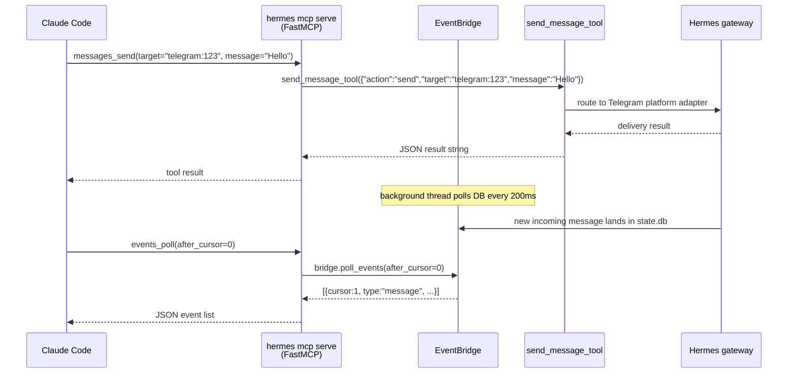

**TL;DR** — Hermes plays both sides of the MCP (Model Context Protocol) standard: as a **client** it connects to external tool servers you configure under `mcp_servers` in `config.yaml`; as a **server** it exposes 10 messaging tools via `hermes mcp serve` that Claude Code, Cursor, Codex, or any MCP-capable agent can call. This chapter walks through both roles, from first config entry to edge cases.

# MCP Client Integration and hermes mcp serve

## What MCP is, and why Hermes plays both roles

**MCP (Model Context Protocol)** is a standard way for an AI application to connect to external tool servers — and, equally, to *become* one. The protocol defines a small vocabulary: the client discovers what tools a server exposes, then calls them by name with structured arguments. Nothing about Hermes is hard-coded into the protocol; any compatible client can talk to any compatible server.

This matters for us because Hermes uses the protocol in two directions at once:

- **Hermes as MCP client**: your Hermes agent can reach external tool servers — a GitHub integration running as a local subprocess, a remote search API over HTTPS — and call their tools the same way it calls its own built-in tools.
- **Hermes as MCP server**: via `hermes mcp serve`, Hermes exposes its own messaging capabilities as a set of callable tools that external agents (Claude Code, Cursor, a custom script) can call.

The chapter covers these two directions in order, starting with the client side.

Before we start, a quick prerequisite: MCP in Hermes is built on top of the **plugin and observer hook system**, which defines how Hermes loads and routes extension capabilities at runtime. If you haven't read that chapter yet, here's the key idea: each major extension surface (observer hooks, middleware, MCP) is a separate layer that plugs into the running agent without touching core code. MCP is the third of those surfaces. For the full extension architecture see [Plugin System and Observer Hooks](./plugin-system-and-observer-hooks.md).

---

## Part A — Hermes as an MCP client

### The problem: your tool ecosystem lives outside Hermes

Hermes ships dozens of built-in tools, but some tools you need already exist as MCP servers — a filesystem server, a GitHub integration, a database connector. Writing a new Hermes-native tool for each one would be redundant. The MCP client side of Hermes solves this: configure an external server once, and its tools appear in Hermes's tool registry alongside built-in tools.

### Configuring an external MCP server

All MCP server entries live under the `mcp_servers` key in `~/.hermes/config.yaml`. Each entry is a named block that tells Hermes how to connect:

```yaml
# ~/.hermes/config.yaml

mcp_servers:
  filesystem:
    command: "npx"
    args: ["-y", "@modelcontextprotocol/server-filesystem", "/home/user/projects"]

  company_api:
    url: "https://mcp.internal.example.com/mcp"
    headers:
      Authorization: "Bearer sk-..."
    timeout: 180

  search:
    url: "http://localhost:8000/sse"
    transport: sse
    timeout: 180
    connect_timeout: 10
```

Hermes reads this at startup, connects to each server, discovers its tools, and registers them under the name `mcp_<server_name>_<tool_name>` — for example, `filesystem`'s `read_file` tool becomes `mcp_filesystem_read_file`.

### The three transports

How Hermes talks to an MCP server depends on one key distinction: is the server a local subprocess, or a remote endpoint?

| Transport | How to trigger | When to use |
|---|---|---|
| **stdio** | Set `command` (and optionally `args`, `env`) | Local subprocess; talks over stdin/stdout |
| **HTTP / StreamableHTTP** | Set `url` with an `http://` or `https://` scheme; no `transport:` key needed | Remote HTTP endpoint |
| **SSE** | Set `url` + `transport: sse` | Remote endpoint that uses Server-Sent Events instead of Streamable HTTP |

When both `url` and `command` appear in the same entry, Hermes uses the HTTP transport and logs a warning to remove `command`.

#### stdio — local subprocess

The stdio transport launches the server as a child process and communicates over its stdin/stdout streams. Hermes filters the subprocess's environment to prevent accidental secret leakage: only a safe baseline (`PATH`, `HOME`, `LANG`, etc.) plus any `env:` keys you explicitly list are passed through.

```yaml
mcp_servers:
  github:
    command: "npx"
    args: ["-y", "@modelcontextprotocol/server-github"]
    env:
      GITHUB_PERSONAL_ACCESS_TOKEN: "ghp_..."
```

#### HTTP / StreamableHTTP — remote endpoint

When you set a `url`, Hermes uses the MCP Streamable HTTP transport. Headers let you pass authentication:

```yaml
mcp_servers:
  remote_api:
    url: "https://my-mcp-server.example.com/mcp"
    headers:
      Authorization: "Bearer sk-..."
    timeout: 180
```

Hermes validates the URL at startup (must be `http://` or `https://` with a real hostname) and probes it with a lightweight HEAD request before the full MCP handshake — if the endpoint returns HTML rather than a JSON/SSE response, Hermes fails fast with an actionable message rather than waiting through the full connection timeout.

#### SSE — Server-Sent Events endpoint

Some MCP servers use the older SSE transport instead of Streamable HTTP. Opt in with `transport: sse`:

```yaml
mcp_servers:
  searxng:
    url: "http://localhost:8000/sse"
    transport: sse
    timeout: 180
    connect_timeout: 10
```

### The background event loop — one asyncio loop, one daemon thread

Here's a detail worth understanding: Hermes's main process is a mix of synchronous and asynchronous code. The MCP client uses the `asyncio`-based MCP SDK, which needs a running event loop. Rather than entangle that with the rest of the process, Hermes runs a **single dedicated event loop** (`_mcp_loop`) in a **daemon thread** (`mcp-event-loop`). All MCP server tasks — connecting, keeping connections alive, calling tools — run on this loop. Synchronous callers (the tool executor, CLI commands) hand work to the loop via `run_coroutine_threadsafe()` and block for the result.

The daemon-thread flag means the loop exits automatically when the main process exits; you don't need to shut it down manually.

```
Main process (sync)
        │
        │  run_coroutine_threadsafe(coro, _mcp_loop)
        ▼
daemon thread: _mcp_loop.run_forever()
        │
        ├── MCPServerTask for "github"   (stdio transport)
        ├── MCPServerTask for "company_api"  (HTTP transport)
        └── MCPServerTask for "search"   (SSE transport)
```

Each MCP server has its own long-lived `MCPServerTask` — an asyncio `Task` that opens the transport, initializes the session, discovers tools, and then sits in a wait loop until the connection drops or shutdown is requested.

### Automatic reconnect with exponential backoff

Network connections drop. The `MCPServerTask.run()` loop handles this with **exponential backoff up to 5 retries**:

- When a connection that was previously healthy drops unexpectedly, Hermes waits an initial `backoff` (starting at 1 second), attempts to reconnect, then doubles the wait on each failure.
- The backoff is capped at `_MAX_BACKOFF_SECONDS = 60` seconds.
- After **5 failed reconnection attempts** (`_MAX_RECONNECT_RETRIES = 5`), Hermes gives up and logs a warning. The server's tools remain unavailable until Hermes restarts or you run `/reload-mcp`.

```
Connection drops
      │
      ▼
retry 1 → wait 1s
retry 2 → wait 2s
retry 3 → wait 4s
retry 4 → wait 8s
retry 5 → wait 16s
      │
      ▼
Give up — log warning, server marked unavailable
```

For the very first connection attempt (before the server has ever been ready), Hermes uses a separate counter — `_MAX_INITIAL_CONNECT_RETRIES = 3` — so a transient DNS blip at startup doesn't permanently kill the server.

Keepalives run every 180 seconds during idle periods: Hermes calls `list_tools()` on the session; if that fails, it triggers an immediate reconnect rather than waiting for the next explicit use.

**What the operator should do when a server gives up:** check that the server is reachable (try running `command` manually, or curl the `url`), fix any config errors, then either restart Hermes or run `/reload-mcp` in the chat.

### MCP sampling — the server asks Hermes's model to complete something

The MCP protocol includes a mechanism called **sampling**: an MCP server can ask its *client* to run an LLM completion on its behalf. In Hermes's case, that means an external tool server can say "please call your language model with these messages and give me the result". This is useful when the MCP server needs inference but has no direct model access of its own.

Sampling is **enabled by default** for every `mcp_servers` entry. The `SamplingHandler` class in Hermes manages the callback:

- A sliding-window **rate limiter** (`max_rpm`, default 10 requests per minute) prevents a misbehaving server from flooding Hermes's model.
- A **per-request timeout** (`timeout`, default 30 seconds) prevents the callback from blocking the event loop indefinitely.
- A **tool-loop depth limit** (`max_tool_rounds`, default 5) stops infinite tool-calling loops inside a sampling response.
- An **allowed-models list** (`allowed_models`, default empty = any model) lets you lock sampling to specific models.

Configure sampling per server under the `sampling` key:

```yaml
mcp_servers:
  analysis_server:
    command: "npx"
    args: ["-y", "analysis-server"]
    sampling:
      enabled: true              # default: true
      model: "gemini-3-flash"    # override the model used for sampling
      max_tokens_cap: 4096       # cap on tokens per sampling response
      timeout: 30                # LLM call timeout in seconds
      max_rpm: 10                # max requests per minute
      allowed_models: []         # empty = any model allowed
      max_tool_rounds: 5         # max tool-use rounds in a sampling loop
      log_level: "info"          # audit verbosity: debug, info, warning
```

To disable sampling for a server you do not trust to make LLM calls on your behalf:

```yaml
mcp_servers:
  untrusted_server:
    url: "https://mcp.example.com"
    sampling:
      enabled: false
```

**Edge case — a sampling request arrives**: the `SamplingHandler.__call__` method is invoked asynchronously on the MCP event loop. It checks the rate limit, resolves the model (config override → server hint → Hermes default), converts the MCP messages to OpenAI-compatible format, and offloads the synchronous LLM call to a thread via `asyncio.to_thread()` so the event loop stays unblocked. If the call times out or returns empty choices, the handler returns an `ErrorData` result (per MCP spec) rather than raising — the server receives a structured error it can handle.

---

## Part B — Hermes as an MCP server

### The problem: external tools want to drive Hermes's messaging

You have Claude Code helping you code, and separately you have Hermes connected to Telegram, Discord, and Slack. Wouldn't it be useful if Claude Code could read your Telegram messages and send replies without you switching context? That's exactly what `hermes mcp serve` enables.

### Architecture overview

```mermaid
flowchart LR
    subgraph Hermes as client
        H[Hermes agent] -->|stdio| E1[external MCP server\ne.g. github-mcp]
        H -->|HTTP/StreamableHTTP| E2[remote MCP server\ne.g. company API]
        H -->|SSE| E3[SSE MCP server\ne.g. searxng]
    end

    subgraph Hermes as server
        CC[Claude Code] -->|stdio| HS["hermes mcp serve\n(FastMCP / stdio)"]
        CU[Cursor] -->|stdio| HS
        CX[Codex] -->|stdio| HS
        HS -->|reads sessions.json\n+ state.db| DB[(~/.hermes/\nsessions + SQLite)]
        HS -->|sends via| GW[Hermes gateway\n(platform adapters)]
    end
```

### How `hermes mcp serve` works

Running `hermes mcp serve` starts a **stdio MCP server** built with **FastMCP** — a Python library that wraps the lower-level MCP SDK and handles protocol framing. The server process communicates over its own stdin/stdout, which is exactly the channel the connecting MCP client (Claude Code, Cursor, etc.) manages.

Inside the server, an **`EventBridge`** — a background polling thread — watches Hermes's session store (`~/.hermes/sessions/sessions.json` and the SQLite `state.db`) for new messages. It maintains an in-memory event queue (up to 1 000 events) and notifies waiting callers when new events arrive. Polling runs every 200 milliseconds, with mtime checks on the files so that polling is essentially free when nothing has changed.

```
hermes mcp serve (stdio)
    │
    ├── FastMCP server (10 tools registered)
    │       │
    │       └── EventBridge background thread
    │               └── polls sessions.json + state.db every 200ms
    │                   └── enqueues QueueEvent objects
    │
    └── send operations → send_message_tool → gateway platform adapters
```

> **Note on the gateway**: read operations (listing conversations, reading history, polling events) work without the Hermes gateway running. Send operations (`messages_send`) require an active gateway because the platform adapters need live connections to Telegram, Discord, etc.

### The 10 tools

The MCP server registers exactly 10 tools. The first 9 match the OpenClaw channel bridge surface; `channels_list` is a Hermes-specific addition.

| Tool | What it does |
|---|---|
| `conversations_list` | List active messaging conversations across all connected platforms. Accepts optional `platform` filter and `search` text; returns up to 200 results (default 50). |
| `conversation_get` | Get detailed metadata for one conversation by its `session_key` (returned by `conversations_list`). |
| `messages_read` | Read recent messages for a conversation. Returns role, content, and timestamp for each message; up to 200 (default 50). |
| `attachments_fetch` | Extract non-text attachments (images, media files) from a specific message identified by `session_key` + `message_id`. |
| `events_poll` | Non-blocking: return events since a cursor position. Event types: `message`, `approval_requested`, `approval_resolved`. |
| `events_wait` | Blocking long-poll: wait for the next event up to `timeout_ms` (default 30 000 ms; max 300 000 ms). |
| `messages_send` | Send a message to a platform target in `"platform:identifier"` format, e.g. `"telegram:6308981865"` or `"discord:#general"`. |
| `permissions_list_open` | List pending approval requests observed since the bridge connected. |
| `permissions_respond` | Respond to a pending approval. `decision` must be one of `allow-once`, `allow-always`, or `deny`. |
| `channels_list` | List all available messaging targets across platforms. Returns target strings you can pass directly to `messages_send`. |

### Sequence: an IDE calling messages_send

Let's trace what happens when Claude Code calls `messages_send`:



### Starting the server

```bash
# Normal mode — minimal logging
hermes mcp serve

# Debug mode — logs to stderr (your MCP client captures this)
hermes mcp serve --verbose
```

The MCP client (not you) manages the process lifecycle. Hermes's server runs until the client closes its end of the stdio pipe.

### Connecting Claude Code

Claude Code reads MCP server configuration from `~/.claude/claude_desktop_config.json`. Add Hermes under `mcpServers`:

```json
{
  "mcpServers": {
    "hermes": {
      "command": "hermes",
      "args": ["mcp", "serve"]
    }
  }
}
```

If `hermes` is not on your PATH (for example, if you installed in a virtual environment), use the absolute path:

```json
{
  "mcpServers": {
    "hermes": {
      "command": "/home/user/.hermes/hermes-agent/venv/bin/hermes",
      "args": ["mcp", "serve"]
    }
  }
}
```

After saving and restarting Claude Code, it will spawn `hermes mcp serve` as a subprocess and the 10 tools will appear in its tool list.

<!-- GAP: Cursor-specific config file path (e.g. .cursor/mcp.json) — source (S62, mcp.md) names Cursor as a supported client but does not document the exact Cursor config file path or format; source silent -->

<!-- GAP: Codex-specific config file path and format for connecting to hermes mcp serve — source names Codex as a supported client but the config file location/format for Codex consuming hermes mcp serve is not documented in assigned sources; source silent -->

The JSON structure (`mcpServers`, `command`, `args`) is the standard MCP client configuration format that any MCP-compatible client accepts. For Cursor and Codex, use the same `command`/`args` shape in whichever configuration file those tools use for MCP servers — the values are identical to the Claude Code snippet above.

### A complete worked example — reading and replying to a Telegram message

Let's say Claude Code is helping you review a pull request, and you want to tell your teammate about it via Telegram. Here's the flow from the IDE side:

**Step 1 — find the conversation**

```json
// Claude Code calls:
conversations_list(platform="telegram", limit=10)

// Hermes returns:
{
  "count": 2,
  "conversations": [
    {
      "session_key": "telegram_6308981865",
      "platform": "telegram",
      "display_name": "Alex",
      "updated_at": "2026-06-10T09:30:00"
    },
    ...
  ]
}
```

**Step 2 — read recent messages**

```json
// Claude Code calls:
messages_read(session_key="telegram_6308981865", limit=5)

// Hermes returns:
{
  "session_key": "telegram_6308981865",
  "count": 5,
  "messages": [
    { "role": "user", "content": "When is the PR ready?", "timestamp": "..." },
    ...
  ]
}
```

**Step 3 — send a reply**

```json
// Claude Code calls:
messages_send(target="telegram:6308981865", message="PR is ready for review — just pushed the changes.")

// Hermes routes to the Telegram gateway adapter and returns a delivery result
```

**Step 4 — watch for the response** (optional, near-real-time)

```json
// Claude Code calls:
events_wait(after_cursor=0, timeout_ms=30000)

// Blocks up to 30 seconds; returns when Alex replies:
{
  "event": {
    "cursor": 1,
    "type": "message",
    "session_key": "telegram_6308981865",
    "role": "user",
    "content": "Great, I'll take a look!",
    "timestamp": "..."
  }
}
```

---

## Edge cases

### An MCP client server disconnects

When a server Hermes is connected to *as a client* drops the connection, the `MCPServerTask.run()` loop catches the exception. The retry sequence:

1. Hermes logs a warning: `"MCP server '<name>' connection lost (attempt N/5), reconnecting in Xs"`.
2. It waits `backoff` seconds (1 → 2 → 4 → 8 → 16, capped at 60), then attempts to reconnect.
3. After **5 failed attempts**, it logs `"giving up"` and returns. The server's tools become unavailable.
4. A circuit breaker (threshold: 3 consecutive errors, cooldown: 60 seconds) prevents the agent from burning through tool calls on a dead server — after the threshold, tool calls to that server short-circuit with a `"server unreachable"` message.

**What to do**: verify the server is running and reachable, then run `/reload-mcp` in Hermes chat to re-establish all configured MCP connections without restarting Hermes.

### A sampling request arrives from an external MCP server

The MCP server you're connected to sends a `sampling/createMessage` request — it wants Hermes's model to complete something.

1. `SamplingHandler.__call__` is invoked on the MCP event loop.
2. Rate limit check: if the server has exceeded `max_rpm` requests in the last 60 seconds, Hermes returns `ErrorData` immediately — the server receives a structured error.
3. Model resolution: config `model` override → server's hint → Hermes default.
4. If the resolved model is not in `allowed_models` (and `allowed_models` is non-empty), Hermes returns `ErrorData`.
5. The LLM call runs in a thread via `asyncio.to_thread()` with a `timeout`-second deadline.
6. If `tool_calls` come back, they count against `max_tool_rounds`. When the limit is hit, Hermes returns `ErrorData` rather than looping further.
7. Successful text responses are returned as `CreateMessageResult`; tool-use responses as `CreateMessageResultWithTools`.

Credential patterns (API keys, tokens) are scrubbed from error messages before they are returned to the MCP server.

### The `hermes mcp serve` server starts but `messages_send` fails

The most common cause: the Hermes **gateway** is not running. Send operations need active platform adapters. Start the gateway with `hermes gateway` (or your configured startup command) before calling `messages_send`. Read operations (`conversations_list`, `messages_read`, `events_poll`) work without the gateway.

---

## Reference: mcp_servers config keys

| Key | Type | Default | Meaning |
|---|---|---|---|
| `command` | string | — | Executable for a stdio server |
| `args` | list | `[]` | Arguments for the stdio server |
| `env` | mapping | `{}` | Additional env vars (merged with safe baseline) |
| `url` | string | — | HTTP/SSE endpoint URL (`http://` or `https://`) |
| `transport` | string | _(auto)_ | Set to `sse` to use the SSE transport instead of Streamable HTTP |
| `headers` | mapping | `{}` | HTTP headers for remote servers |
| `timeout` | number | `120` | Per-tool-call timeout in seconds |
| `connect_timeout` | number | `60` | Initial connection timeout in seconds |
| `enabled` | bool | `true` | Set `false` to skip entirely |
| `supports_parallel_tool_calls` | bool | `false` | Allow concurrent tool execution from this server |
| `sampling.enabled` | bool | `true` | Allow this server to request LLM completions |
| `sampling.model` | string | _(Hermes default)_ | Override model for sampling |
| `sampling.max_tokens_cap` | int | `4096` | Cap on tokens per sampling response |
| `sampling.timeout` | number | `30` | Sampling LLM call timeout in seconds |
| `sampling.max_rpm` | int | `10` | Max sampling requests per minute |
| `sampling.max_tool_rounds` | int | `5` | Max tool-use rounds in a sampling loop |
| `sampling.allowed_models` | list | `[]` (any) | Model allowlist; empty = any model permitted |
| `sampling.log_level` | string | `"info"` | Audit log level: `debug`, `info`, or `warning` |

---

← Previous: [Middleware — Rewriting Requests and Wrapping Execution (hermes.middleware.v1)](./middleware.md) · Next: [ACP Adapter, IDE Integration, and the Plugin LLM Facade](./acp-adapter-and-plugin-llm.md) →
