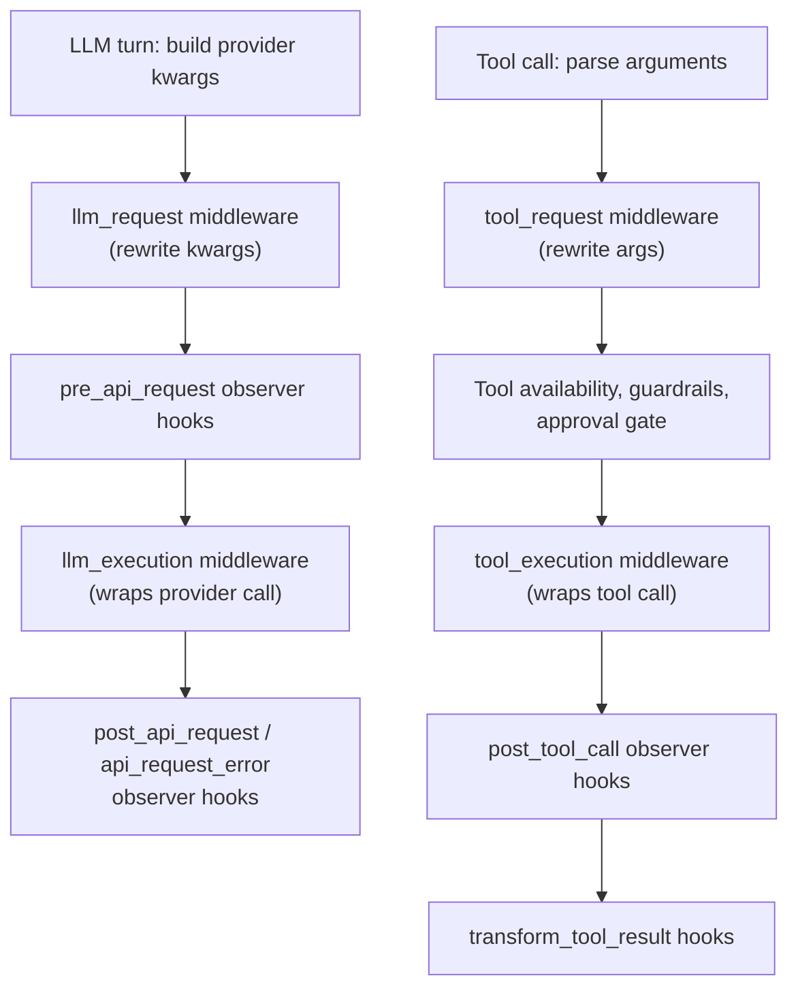
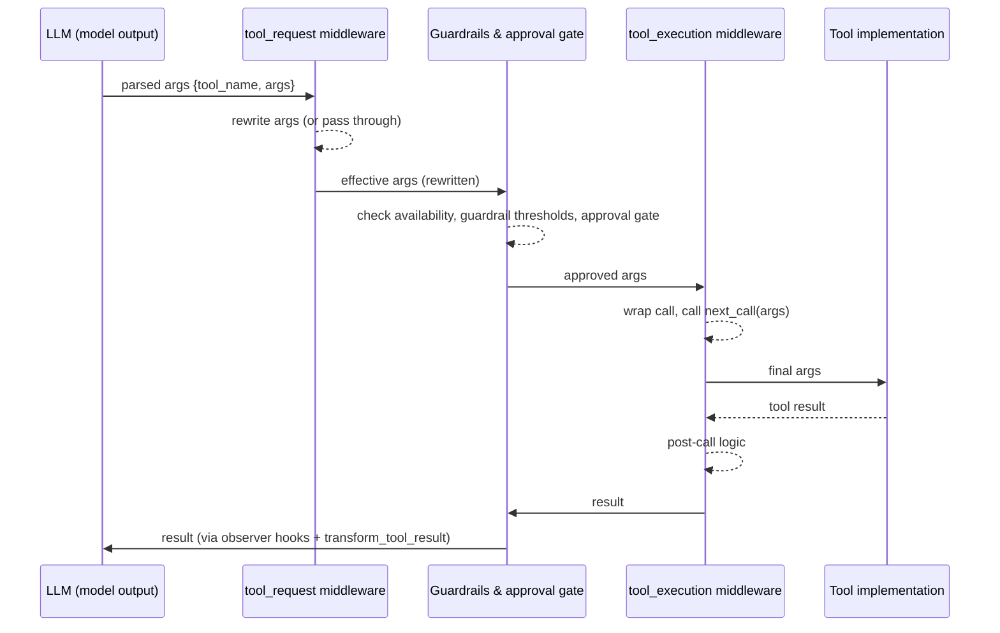

**TL;DR** — Observer hooks let a plugin *watch* what Hermes does; middleware lets a plugin *change* it. This chapter walks through the four middleware kinds (`llm_request`, `tool_request`, `llm_execution`, `tool_execution`), explains where each one sits in the request pipeline, and shows worked examples — including a secret-redacting `tool_request` middleware and a retry-adding `llm_execution` middleware.

# Middleware — Rewriting Requests and Wrapping Execution (hermes.middleware.v1)

In the [previous chapter](./plugin-system-and-observer-hooks.md) we built plugins that use **observer hooks** — callbacks that Hermes fires after each event so a plugin can record, measure, or react to what just happened. Observer hooks are read-only: they receive a snapshot, but they cannot change the event that caused it.

That limitation becomes a problem the moment you want to do something like:

- Scrub a secret argument from a tool call before Hermes logs it.
- Inject a custom HTTP header into every provider request.
- Wrap the LLM call with retry logic that only your deployment needs.
- Gate tool execution through an external policy service and translate errors.

For all of these, you need to *change* the request, not just observe it. That is what **middleware** is for.

## The core distinction: observers vs middleware

Let's state the contrast precisely, because it matters for choosing which to reach for.

An **observer hook** (schema `hermes.observer.v1`, covered in [The Plugin System and Observer Hooks](./plugin-system-and-observer-hooks.md)) fires *after* an event. It receives a payload describing what happened. Whatever it returns is ignored — Hermes has already done the work.

**Middleware** (schema `hermes.middleware.v1`) fires *before or around* execution. A request middleware can return a *replacement* payload, and Hermes will use that replacement for everything that comes after. An execution middleware receives a `next_call` callback it must invoke to trigger the real work — which means it can add logic before *and* after the underlying call, or even skip it entirely.

```
Observer hook:   event fires → hook is called → return value discarded
Middleware:      middleware is called → returns replacement / calls next_call → event fires
```

The schema version string your plugin must embed is `"hermes.middleware.v1"`. Hermes stores this string in `MIDDLEWARE_SCHEMA_VERSION` in `hermes_cli/middleware.py` and passes it in every callback's `middleware_schema_version` field, so plugins can guard against future contract changes.

## The four middleware kinds

Hermes defines exactly four kinds. Let's see where each one sits in the pipeline before diving into details.



Here are the four kinds in one table:

| Kind | Fires on | Payload keys | Return shape | Primary use |
|---|---|---|---|---|
| `llm_request` | Every provider call | `request`, `original_request` | `{"request": {...}}` | Rewrite provider kwargs (model, temperature, headers, messages) |
| `tool_request` | Every tool call, before guardrails | `tool_name`, `args`, `original_args` | `{"args": {...}}` | Rewrite tool arguments before policy sees them |
| `llm_execution` | Every provider call, around it | `request`, `original_request`, `next_call` | Any provider response | Wrap the actual LLM call (retry, routing, timing) |
| `tool_execution` | Every tool call, around it | `tool_name`, `args`, `original_args`, `next_call` | Any tool result | Wrap the actual tool call (audit, error translation) |

Every callback also receives `telemetry_schema_version` (`"hermes.observer.v1"`), `middleware_schema_version` (`"hermes.middleware.v1"`), and runtime context such as `session_id`, `task_id`, `turn_id`, `api_request_id`, `provider`, `model`, `api_mode`, `tool_name`, and `tool_call_id` where applicable.

Now let's look at each kind in detail.

## `llm_request` — rewriting provider kwargs

### The problem it solves

Every time Hermes calls an LLM provider it assembles a dict of provider kwargs — the model name, the messages array, temperature, tool definitions, streaming flags, and any provider-specific extras. By the time that dict leaves the process, you have no say in it. If you need to inject a custom header, force a specific model on certain requests, or redact PII from the messages list before they leave your network boundary, you need `llm_request` middleware.

### How it works

Hermes calls each registered `llm_request` callback with the full provider kwargs dict under the `request` key, plus a `original_request` copy. Your callback inspects and modifies a copy of `request`, then returns it:

```python
# Return shape for llm_request middleware
return {"request": updated_request}
```

If you return `None` or a dict without a `"request"` key, Hermes skips the update and passes the unmodified request to the next middleware. This is the safe default for "I don't want to change this particular call."

You can also include trace fields — `source`, `reason`, `name` — in your return dict. Hermes records them in `RequestMiddlewareResult.trace` and attaches the list to subsequent observer hook payloads as `middleware_trace`, so you can correlate a rewrite with the telemetry that follows.

### Example: tagging every LLM request

Here is a minimal plugin that adds a custom metadata flag to the `extra_body` of every provider request. We register it from the plugin's `register(ctx)` function, which is the same entry point we use for observer hooks.

```python
# plugins/my-request-tagger/__init__.py

def register(ctx):
    ctx.register_middleware("llm_request", tag_llm_request)


def tag_llm_request(**kwargs):
    # Never mutate kwargs["request"] in-place — always work on a copy.
    request = dict(kwargs["request"])
    extra_body = dict(request.get("extra_body") or {})
    extra_body.setdefault("metadata", {})["my_plugin"] = True
    request["extra_body"] = extra_body
    return {
        "request": request,
        "source": "my-request-tagger",
        "reason": "tagged provider request",
    }
```

The effective request — with our metadata attached — is what `pre_api_request` observer hooks, the provider execution, and `post_api_request` hooks will all see.

> **Copy, don't mutate.** Hermes deep-copies the request payload before passing it to middleware, but you should still work on a fresh copy of any nested dict you modify. The source code's `_safe_copy` helper in `hermes_cli/middleware.py` tolerates non-deepcopyable members (such as file handles attached to an LLM request), falling back to a shallow copy — so the deep-copy guarantee has limits.

## `tool_request` — rewriting tool arguments before guardrails

### The problem it solves

When the LLM decides to call a tool, Hermes parses the model-provided arguments and then subjects them to a chain of policy checks: observer block directives, guardrails, and the approval gate. The problem is that those checks operate on whatever arguments arrive — which means a sanitization step you want to run first (say, scrubbing a token that leaked into a path argument) has no natural place to live.

`tool_request` middleware runs *before* any of those checks. It sees the raw arguments straight from the model and can rewrite them before anything else evaluates them.

### Execution order for a tool call (detailed)

This sequence diagram shows exactly where `tool_request` and `tool_execution` middleware sit relative to guardrails and the approval gate.



Notice: **guardrails and the approval gate see the *rewritten* arguments**, not the originals. This is by design — if your middleware normalizes a file path, the security policy should evaluate the normalized path, not the raw one the model emitted. But it also means middleware bears responsibility: rewriting a path to an allowed directory is fine; silently broadening a path to bypass a guardrail is a misuse of the mechanism.

### Example: redacting a secret argument

Let's build a practical example. Imagine your agent has a `call_api` tool that sometimes receives an `api_key` argument. You want to scrub that key before it appears in logs or gets evaluated by guardrails.

```python
# plugins/arg-redactor/__init__.py

SENSITIVE_ARG_NAMES = {"api_key", "token", "secret", "password"}


def register(ctx):
    ctx.register_middleware("tool_request", redact_sensitive_args)


def redact_sensitive_args(**kwargs):
    args = dict(kwargs["args"])
    changed = False

    for key in list(args):
        if key.lower() in SENSITIVE_ARG_NAMES:
            args[key] = "[REDACTED]"
            changed = True

    if not changed:
        # Returning None means "no change — keep original args."
        return None

    return {
        "args": args,
        "source": "arg-redactor",
        "reason": f"redacted sensitive argument(s): {[k for k in args if args[k] == '[REDACTED]']}",
    }
```

Every downstream component — guardrails, the approval gate, the tool itself, observer hooks, and logs — will see `"[REDACTED]"` instead of the real secret.

Note the `original_args` key in `kwargs`: Hermes always passes the unmodified original alongside the current effective args. This lets you compare what the model originally sent against what previous middleware in the chain may have already changed. You do not need it for the redaction case, but it is useful for auditing.

## `llm_execution` — wrapping the actual provider call

### The problem it solves

`llm_request` middleware lets you change the *inputs* to the provider call. But what if you need to wrap the call itself — for example, to add a retry loop, or to switch providers based on a runtime condition, or to time how long the actual network round-trip took? Those concerns live *around* the execution, not in the request dict.

`llm_execution` middleware receives a `next_call` callback. You call it to invoke the rest of the chain (and ultimately the real provider). You can run code before it, after it, or — carefully — instead of it.

### The `next_call` contract

`next_call` is single-use per middleware frame. Calling it more than once would re-execute the downstream provider call, which is never correct. Hermes enforces this: a second call to `next_call` raises a `RuntimeError`.

```python
def on_llm_execution(**kwargs):
    result = kwargs["next_call"](kwargs["request"])  # invoke downstream
    # post-call logic here
    return result
```

You may pass a *modified* request to `next_call(modified_request)` — this lets you combine request rewriting with execution wrapping in a single callback if you prefer, though the cleaner pattern is to separate them into `llm_request` and `llm_execution`.

The return value must be a valid provider response — the same shape the Hermes provider adapter expects from the real call. Do not wrap it in an extra envelope.

### Example: adding a retry to LLM execution

Here is an `llm_execution` middleware that retries on transient errors up to a configurable maximum. We treat `Exception` as a signal to retry; in a real plugin you would inspect the error class to distinguish transient vs permanent failures.

```python
# plugins/llm-retry/__init__.py

import time
import logging

logger = logging.getLogger(__name__)

MAX_RETRIES = 2
RETRY_DELAY_S = 1.0


def register(ctx):
    ctx.register_middleware("llm_execution", retry_llm_execution)


def retry_llm_execution(**kwargs):
    request = kwargs["request"]
    next_call = kwargs["next_call"]
    last_exc = None

    for attempt in range(1, MAX_RETRIES + 2):  # +2 for the first try
        try:
            return next_call(request)
        except Exception as exc:
            last_exc = exc
            if attempt <= MAX_RETRIES:
                logger.warning(
                    "LLM execution attempt %d failed (%s); retrying in %.1fs",
                    attempt, exc, RETRY_DELAY_S
                )
                # Reset next_call is NOT possible — next_call is single-use.
                # We need a fresh middleware invocation for each retry,
                # so this retry pattern only works if you arrange fresh
                # next_call references from the plugin manager or use a
                # wrapper that rebuilds the chain.
                # See GAP note below.
                break  # single-use constraint — see gap

    raise last_exc
```

<!-- GAP: The source (S58, S61) confirms next_call is strictly single-use per frame and raises RuntimeError on a second call. A true retry loop that calls next_call multiple times is not achievable within a single middleware frame. The docs state "Middleware failures are fail-open" but do not document a supported retry pattern using execution middleware. This example shows the constraint honestly; a real retry plugin would need to re-invoke the full middleware chain from outside, which is not documented in the assigned sources. -->

Let's show the timing variant instead, which is fully supportable:

```python
# plugins/llm-timer/__init__.py

import time
import logging

logger = logging.getLogger(__name__)


def register(ctx):
    ctx.register_middleware("llm_execution", time_llm_execution)


def time_llm_execution(**kwargs):
    started = time.monotonic()
    response = kwargs["next_call"](kwargs["request"])
    elapsed_ms = int((time.monotonic() - started) * 1000)
    logger.info("llm_execution elapsed_ms=%d", elapsed_ms)
    return response
```

This is the exact pattern from the official docs. It calls `next_call` exactly once, measures the wall time around it, and returns the unmodified response.

## `tool_execution` — wrapping the actual tool call

### The problem it solves

`tool_execution` middleware sits at the last layer before the tool implementation runs. This is the right place for:

- Post-execution audit logging (capture what the tool actually returned, not just what arguments went in).
- Error translation (convert a tool-specific exception into a structured error the agent can reason about).
- Result annotation (append metadata to the result before Hermes adds it to the conversation context).

### Example: annotating tool results

```python
# plugins/tool-auditor/__init__.py

import logging
import time

logger = logging.getLogger(__name__)


def register(ctx):
    ctx.register_middleware("tool_execution", audit_tool_execution)


def audit_tool_execution(**kwargs):
    tool_name = kwargs.get("tool_name", "unknown")
    args = kwargs["args"]
    next_call = kwargs["next_call"]

    started = time.monotonic()
    result = next_call(args)
    elapsed_ms = int((time.monotonic() - started) * 1000)

    logger.info(
        "tool=%s elapsed_ms=%d args_keys=%s",
        tool_name,
        elapsed_ms,
        list(args.keys()),
    )
    return result
```

You can also call `next_call(modified_args)` here to pass a changed argument dict to the tool — the same single-use constraint applies.

## Enabling middleware

Middleware only runs for plugins that are enabled. To enable a bundled or locally installed plugin:

```bash
hermes plugins enable <plugin-name>
```

For isolated local testing — useful when you want to test middleware without affecting your main `~/.hermes/` state — set a temporary `HERMES_HOME`:

```bash
export HERMES_HOME=/tmp/hermes-middleware-test
mkdir -p "$HERMES_HOME"
hermes plugins enable my-request-tagger
hermes chat --query 'Reply exactly ok'
```

For a source-checkout workflow where you want the agent to pick up your plugin from the working tree:

```bash
uv sync
uv run hermes plugins enable my-request-tagger
uv run hermes chat --query 'Reply exactly ok'
```

## Execution order when multiple plugins register the same kind

When more than one plugin registers middleware of the same kind, Hermes runs them as a nested chain in registration order. For request middleware, each callback in the chain receives the `current_request`/`current_args` as modified by the previous callback — not the original. For execution middleware, the chain is nested: the first registered callback wraps the second, which wraps the third, which wraps the base call.

```
Plugin A registered first, Plugin B second:

tool_execution chain:
  A(next_call=B-wraps-tool)
    → B(next_call=tool)
      → tool()
    ← B returns result
  ← A returns result
```

This means the first-registered plugin has the outermost position — it runs first before the call and last after it.

## Failure behavior — fail-open

Hermes middleware is designed to be **fail-open**: a middleware bug should degrade gracefully rather than bring down a tool call or LLM request.

The failure behavior differs between request middleware and execution middleware because their structure differs.

### Request middleware failure

For `llm_request` and `tool_request`, if a callback raises an exception, Hermes logs a warning and skips that callback's contribution. The `current_request` or `current_args` remains as it was before the failing callback ran. The next callback in the chain (if any) and the base execution all proceed normally.

### Execution middleware failure

For `llm_execution` and `tool_execution`, the failure logic is more nuanced. Hermes tracks three states for each callback frame:

1. **Middleware raises before calling `next_call`** — Hermes logs a warning and falls through to the next middleware or the base call, as if the failing middleware was never registered. The downstream provider or tool still runs.
2. **Middleware calls `next_call` successfully, then raises during post-processing** — Hermes preserves the downstream result and returns it. The tool or provider did run successfully; only the middleware's post-processing failed. Hermes does not re-run the provider or tool.
3. **Downstream (the provider or tool itself) raises** — Hermes does not convert this into a successful `None` result. The error propagates. Middleware may catch and translate it deliberately, but Hermes will not silently suppress it.

The source code in `hermes_cli/middleware.py` (`_run_execution_chain`) encodes cases 1–3 directly:

```python
# Simplified view of the execution-chain fallback logic (from _run_execution_chain)
try:
    return callback(**call_kwargs)
except _DownstreamExecutionError as exc:
    raise exc.original          # downstream error — always re-raise
except Exception as exc:
    logger.warning("Middleware '%s' callback %s raised: %s", kind, name, exc)
    if next_succeeded:
        return next_result      # case 2: post-processing failed, preserve result
    if next_called:
        raise                   # next_call was called but downstream failed
    return call_at(index + 1, payload)  # case 1: skip to next middleware
```

The key insight: "fail-open" means Hermes tries not to let a middleware bug *abort* a request. But it does not mean errors are silently swallowed — they are logged, and downstream failures still propagate as errors.

## Putting it together: a full plugin with two middleware kinds

Let's register both a `tool_request` and a `tool_execution` middleware in one plugin to see how the full registration pattern looks.

```python
# plugins/my-tool-policy/__init__.py

import logging
import time

logger = logging.getLogger(__name__)

BLOCKED_COMMANDS = {"rm -rf", "format", "shutdown"}


def register(ctx):
    ctx.register_middleware("tool_request", sanitize_tool_args)
    ctx.register_middleware("tool_execution", time_tool_execution)


def sanitize_tool_args(**kwargs):
    """Rewrite tool args before guardrails and approval see them."""
    if kwargs.get("tool_name") != "terminal":
        return None  # not our concern — pass through

    args = dict(kwargs["args"])
    command = args.get("command", "")

    # Block commands that match our policy.
    for blocked in BLOCKED_COMMANDS:
        if blocked in command:
            # Return None to refuse the rewrite attempt.
            # The original args flow forward unchanged; guardrails will
            # still evaluate them and may block the call independently.
            logger.warning("tool_request: blocked command pattern '%s'", blocked)
            return None

    # Default the working directory.
    args.setdefault("workdir", "/tmp/hermes-sandbox")

    return {
        "args": args,
        "source": "my-tool-policy",
        "reason": "defaulted terminal workdir",
    }


def time_tool_execution(**kwargs):
    """Wrap tool execution to measure elapsed time."""
    started = time.monotonic()
    result = kwargs["next_call"](kwargs["args"])
    elapsed_ms = int((time.monotonic() - started) * 1000)
    logger.info(
        "tool=%s elapsed_ms=%d",
        kwargs.get("tool_name", "unknown"),
        elapsed_ms,
    )
    return result
```

Enable it and run a quick test:

```bash
hermes plugins enable my-tool-policy
hermes chat --query 'Run ls /tmp in terminal'
```

The `sanitize_tool_args` callback fires first and defaults the `workdir`. Guardrails and the approval gate then evaluate the sanitized args. `time_tool_execution` wraps the actual tool call and logs the elapsed time after the tool returns.

## Connecting to the broader plugin system

Middleware is registered through exactly the same `register(ctx)` entry point as observer hooks. A single plugin can register both:

```python
def register(ctx):
    # Read-only telemetry — observer hook
    ctx.register_hook("post_tool_call", record_tool_event)
    # Mutating behavior — middleware
    ctx.register_middleware("tool_request", sanitize_tool_args)
```

The `ctx.register_middleware(kind, callback)` call is the only API surface you need. There is no separate schema negotiation: Hermes passes `middleware_schema_version: "hermes.middleware.v1"` in every callback invocation, so your plugin can assert the version at runtime if it needs to guard against future changes.

For the observer hook side of the plugin system, see [The Plugin System and Observer Hooks](./plugin-system-and-observer-hooks.md).

For **guardrails** — the policy layer that evaluates tool arguments *after* `tool_request` middleware has run — see [Tool Dispatch and Guardrails](../core-runtime/tool-dispatch-and-guardrails.md).

For the **approval gate** — the interactive approval check that also fires after `tool_request` middleware — see [Tools Registry and Approval Gate](../tools/tools-registry-and-approval-gate.md).

## Summary

Let's recap what we've covered:

| Middleware kind | Runs | Receives | Returns | Best for |
|---|---|---|---|---|
| `llm_request` | Before every provider call | `request`, `original_request` | `{"request": {...}}` or `None` | Inject headers, force model, redact messages |
| `tool_request` | Before guardrails/approvals | `tool_name`, `args`, `original_args` | `{"args": {...}}` or `None` | Sanitize args, set defaults, redact secrets |
| `llm_execution` | Around every provider call | `request`, `original_request`, `next_call` | Provider response | Timing, routing, error translation |
| `tool_execution` | Around every tool call | `tool_name`, `args`, `original_args`, `next_call` | Tool result | Audit, error translation, result annotation |

Key rules to remember:
- `tool_request` middleware sees args **before** guardrails and the approval gate. The rewritten values are what policy evaluates.
- Execution middleware receives a single-use `next_call`. Calling it twice raises `RuntimeError`.
- All four kinds are **fail-open**: a middleware exception causes a logged warning and fallback to the base path, not an aborted request — unless the downstream provider or tool itself fails.
- Multiple middlewares of the same kind run as a nested chain in registration order.

---

← Previous: [The Plugin System and Observer Hooks (hermes.observer.v1)](./plugin-system-and-observer-hooks.md) · Next: [MCP Client Integration and hermes mcp serve](./mcp-client-and-server.md) →
