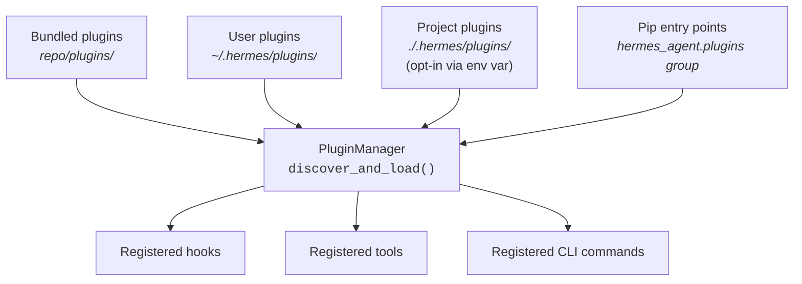
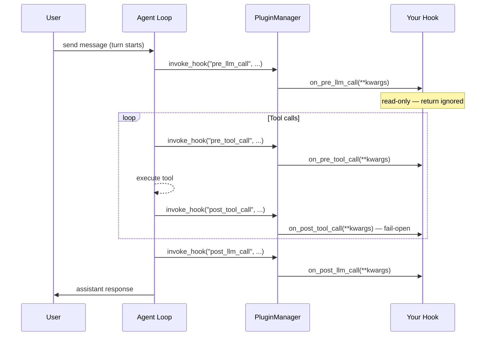

**TL;DR** — Hermes has four extension surfaces: the plugin system (this page), middleware (see [`./middleware.md`](./middleware.md)), MCP server integration, and ACP/plugin-LLM. Here we focus on the first two layers: how `PluginManager` finds your code and loads it, and how you register *observer hooks* — read-only telemetry callbacks that fire at every meaningful moment in the agent's life without altering its behavior. By the end of this chapter you will have written a working observer plugin, understand all six event families, and know how the bundled Langfuse and NeMo Relay consumers use the same contract.

# The Plugin System and Observer Hooks (hermes.observer.v1)

## The problem: adding telemetry without forking Hermes

Suppose you want to record every tool call Hermes makes, send LLM spans to your tracing backend, or build an audit log of approval decisions. You could do it by modifying `run_agent.py` — but that means maintaining a fork across every update. Hermes solves this with a **plugin system**: third-party code that Hermes discovers at startup, loads in isolation, and invokes at well-defined lifecycle points.

Hermes exposes four distinct extension surfaces:

| Surface | What it does | Where to learn more |
| --- | --- | --- |
| **Plugin system + observer hooks** | Discover plugins; fire read-only telemetry callbacks | This page |
| **Middleware** (`hermes.middleware.v1`) | Rewrite requests and wrap execution | [`./middleware.md`](./middleware.md) |
| **MCP server** | Expose Hermes tools over the Model Context Protocol | `../integrations/mcp-server.md` |
| **ACP + plugin-LLM** | Agent Communication Protocol + per-plugin LLM completion | `../integrations/acp-and-plugin-llm.md` |

This chapter covers the first surface in full. Let's start by understanding how Hermes finds your plugin at all.

---

## How PluginManager discovers plugins

`PluginManager` — defined in `hermes_cli/plugins.py` — is the **central manager that discovers, loads, and invokes plugins**. When Hermes starts it calls `discover_and_load()`, which scans four sources in order and merges the results.



### Source 1 — bundled plugins

Plugins that ship with Hermes live under `plugins/` in the repository. The observability plugins we'll use later (`langfuse`, `nemo_relay`) come from here.

### Source 2 — user plugins (`~/.hermes/plugins/`)

This is the main location for plugins you write yourself. Hermes looks for sub-directories each containing a `plugin.yaml` (or `plugin.yml`) manifest file. The directory `~/.hermes/` is Hermes's home directory — the persistent store for sessions, credentials, and configuration (see [Home Directory and Profiles](../persistence/home-directory-and-profiles.md) for the full layout).

```
~/.hermes/
└── plugins/
    └── my-telemetry/
        ├── plugin.yaml
        └── __init__.py
```

### Source 3 — project plugins (`./.hermes/plugins/`)

When you set the environment variable `HERMES_ENABLE_PROJECT_PLUGINS=1`, Hermes also scans a `.hermes/plugins/` directory next to your working directory. This lets you ship project-specific instrumentation alongside your code without touching the user-level `~/.hermes/` directory.

### Source 4 — pip entry points

A **pip entry point** is a standard Python packaging mechanism that lets an installed package advertise itself to a host application. Hermes reads the entry-point group **`hermes_agent.plugins`** via `importlib.metadata`. Any pip-installable package that declares this group will be discovered automatically when it is installed in the same environment:

```toml
# pyproject.toml of your pip-installable plugin
[project.entry-points."hermes_agent.plugins"]
my-telemetry = "my_telemetry_pkg"
```

### Priority and deduplication

Later sources override earlier ones when two plugins share the same key. A user plugin at `~/.hermes/plugins/my-telemetry/` therefore overrides a bundled plugin with the same name, and a project plugin at `./.hermes/plugins/my-telemetry/` overrides the user plugin.

### The plugin manifest (`plugin.yaml`)

Every directory-based plugin must contain a `plugin.yaml`. The minimum required field is `name`. A real manifest looks like this:

```yaml
# ~/.hermes/plugins/my-telemetry/plugin.yaml
name: my-telemetry
version: "1.0.0"
description: "Records every tool call to a local log file."
author: you
hooks:
  - pre_tool_call
  - post_tool_call
```

The `hooks` list is declarative metadata; Hermes uses it for introspection. The actual registration happens in code.

### The `register(ctx)` entry point

After loading the manifest, `PluginManager` imports your plugin's `__init__.py` and calls its **`register(ctx)`** function, passing a `PluginContext` object. `PluginContext` (`ctx`) is the only API surface your plugin should use — it provides `register_hook()`, `register_middleware()`, `register_skill()`, and other registration methods.

```python
# ~/.hermes/plugins/my-telemetry/__init__.py

def register(ctx):
    ctx.register_hook("pre_tool_call", on_pre_tool_call)
    ctx.register_hook("post_tool_call", on_post_tool_call)
```

A plugin without a `register()` function loads but registers nothing and logs a warning.

---

## Observer hooks: read-only telemetry callbacks

Now that Hermes knows about your plugin, you can listen to what the agent does. That is what **observer hooks** are for.

An observer hook is a **Python callable that Hermes fires at a named lifecycle event**. It receives keyword arguments describing what happened, and its return value is ignored (with a small set of backward-compatible exceptions noted later). The key property is *read-only*: an observer hook must not change what the agent does — it only records what happened.

All observer hook payloads carry this field:

```text
telemetry_schema_version = "hermes.observer.v1"
```

The constant `OBSERVER_SCHEMA_VERSION = "hermes.observer.v1"` lives in `hermes_cli/middleware.py`. Every call to `invoke_hook()` injects it automatically, so your callback can always verify the schema version it is speaking with.

### Why the schema version matters

The `hermes.observer.v1` string is a **compatibility contract**. If Hermes introduces a new major observer API in the future, it will bump the version string. Pinning your plugin to check this field means you will notice a mismatch immediately rather than silently processing a payload whose shape has changed:

```python
def on_post_tool_call(**kwargs):
    version = kwargs.get("telemetry_schema_version")
    if version != "hermes.observer.v1":
        # Log a warning and skip — do not guess at the new shape
        logger.warning("Unexpected observer schema: %s", version)
        return
    # Safe to proceed
    record_tool_call(kwargs)
```

### Registering a hook with `ctx.register_hook()`

`register_hook(hook_name, callback)` is defined on `PluginContext` at line 939 of `hermes_cli/plugins.py`. It stores your callback in the manager's internal hook registry keyed by `hook_name`.

If you register an **unknown** hook name, Hermes logs a warning but still stores the callback. This means a plugin written for a future Hermes version that adds a new hook name will not fail when run against an older version — the callback just never fires.

```python
def register(ctx):
    ctx.register_hook("post_tool_call", on_post_tool_call)

def on_post_tool_call(**kwargs):
    # Always accept **kwargs — additive fields stay backward-compatible
    print(kwargs.get("tool_name"), kwargs.get("status"))
```

> Always accept `**kwargs`. Hermes may add new fields to any hook payload in a future minor release. A callback that takes only named parameters will raise `TypeError` on new fields, causing a fail-open warning (described next).

### Fail-open: a hook that raises never breaks the agent

This is the most important safety property of the observer contract. When `PluginManager.invoke_hook()` calls your callback, it wraps each call in `try/except Exception`. If your callback raises — for any reason — Hermes logs a warning and **keeps the agent loop running**:

```python
# Simplified view of PluginManager.invoke_hook() in hermes_cli/plugins.py
def invoke_hook(self, hook_name: str, **kwargs):
    callbacks = self._hooks.get(hook_name, [])
    for cb in callbacks:
        try:
            ret = cb(**kwargs)
            ...
        except Exception as exc:
            logger.warning(
                "Hook '%s' callback %s raised: %s",
                hook_name,
                getattr(cb, "__name__", repr(cb)),
                exc,
            )
    return results
```

"Fail-open" means: when in doubt, continue. A telemetry plugin that crashes does not kill the conversation. Your hook failing is your plugin's problem, not the user's. This also means you should keep callbacks fast and avoid side effects that could cause cascading failures.

---

## The six event families

Observer hooks are grouped into six families, each tracking a different granularity of the agent's lifecycle. Let's look at each one, then see how they fit together.



### Summary table

| Family | Hooks | What fires |
| --- | --- | --- |
| **Session Lifecycle** | `on_session_start`, `on_session_end`, `on_session_finalize`, `on_session_reset` | Conversation boundaries and session identity changes |
| **Turn-Scoped LLM** | `pre_llm_call`, `post_llm_call` | Before the tool loop begins for a user turn; after final assistant output |
| **Request-Scoped API** | `pre_api_request`, `post_api_request`, `api_request_error` | Each individual provider API call inside the agent loop |
| **Tool Lifecycle** | `pre_tool_call`, `post_tool_call`, `transform_tool_result` | Before and after each tool dispatch; before the result enters model context |
| **Approval Lifecycle** | `pre_approval_request`, `post_approval_response` | When a dangerous-command approval prompt is shown or answered |
| **Subagent Lifecycle** | `subagent_start`, `subagent_stop` | When a delegated child agent starts or returns |

Let's look at each family in enough detail to know when to reach for it.

### Session Lifecycle

These hooks describe conversation boundaries. `on_session_start` fires once after the system prompt is built for a brand-new session. `on_session_end` fires when a `run_conversation()` call ends — including interrupted or incomplete turns — so it is turn/run scoped, not the final session boundary. For cleanup that should happen once per session identity, use `on_session_finalize` (called when the CLI or gateway tears down the session) and `on_session_reset` (called when the session moves to a new identity).

Common fields include `session_id`, `completed`, `interrupted`, `reason`, `old_session_id`, and `new_session_id`.

### Turn-Scoped LLM Hooks

`pre_llm_call` fires before the tool loop begins for a single user turn. `post_llm_call` fires after the final assistant response for that turn. Use these hooks for **turn-level summaries** — the total assistant response, conversation history, model used, and platform.

> The source documents note that `pre_llm_call` and `post_llm_call` are not appropriate for LLM span telemetry (where you want timing per provider API call). For span work, use the Request-Scoped API hooks instead.

### Request-Scoped API Hooks

These are the hooks to use for **LLM span telemetry**. Within a single turn, the agent loop may make several provider API calls — for example, one to get the initial response, a second after tool results are added, and so on. Each attempt fires `pre_api_request` before the call and `post_api_request` (or `api_request_error`) after.

`pre_api_request` carries detailed request context: identity fields, model/provider/base_url, token estimates, and the sanitized request payload. `post_api_request` adds duration, usage, finish reason, and the sanitized response.

### Tool Lifecycle

`pre_tool_call` fires before the tool is dispatched. `post_tool_call` fires for every outcome — normal completion, error, cancellation, and block. This means telemetry plugins can always close spans cleanly regardless of how a tool ended.

The `status` field in `post_tool_call` signals the outcome:

| `status` value | Meaning |
| --- | --- |
| `ok` | Tool completed normally |
| `error` | Tool ran and returned or raised an error outcome |
| `blocked` | A `pre_tool_call` hook blocked execution |
| `cancelled` | Execution was cancelled before normal completion |

Note that `pre_tool_call` has one **behavior-affecting** feature: a callback may return `{"action": "block", "message": "..."}` to block the tool before execution. Similarly, `transform_tool_result` (fired after `post_tool_call`) may return a replacement result string. Telemetry-only plugins should ignore these return paths — but be aware they exist for forward-compatibility.

### Approval Lifecycle

When Hermes asks the user to approve a potentially dangerous command, it fires `pre_approval_request` before the prompt appears and `post_approval_response` after the user responds (or the request times out). The `choice` field in `post_approval_response` takes one of: `once`, `session`, `always`, `deny`, `timeout`.

These hooks are observer-only — your return value is ignored. You cannot pre-answer or veto an approval from them. To block a tool before it reaches the approval gate, use `pre_tool_call` instead.

### Subagent Lifecycle

When Hermes delegates work to a child agent (via the `delegate_task` tool), it fires `subagent_start` with parent/child session and turn IDs, role, and goal. `subagent_stop` fires when the child returns, carrying role/status fields, a summary, and duration. These hooks let you model nested execution trees — for example, to build a trace hierarchy where a child agent's turns are nested under the parent turn that spawned them.

The agent lifecycle these hooks observe — `run_conversation()`, the tool loop, and how delegation creates child agents — is covered in the [AIAgent and Conversation Loop](../core-runtime/aiagent-and-conversation-loop.md) chapter. The short version: each user turn runs one loop that calls the LLM, dispatches tools, and repeats until the model stops requesting tools. Observer hooks are the window into that loop from outside.

---

## Correlation IDs: joining events across callbacks

Because hooks fire in separate callback invocations, you need a way to join events together — to say "this `post_tool_call` event belongs to the same API request as that `pre_api_request` event." Hermes provides a set of **correlation IDs** in every relevant hook payload:

| Field | What it ties together |
| --- | --- |
| `session_id` | All events in one conversation identity |
| `task_id` | Events in a single isolated execution unit — particularly useful for subagents |
| `turn_id` | All API calls and tool calls that belong to one user turn |
| `api_request_id` | Events for a single provider API attempt (opaque string — do not parse it) |
| `api_call_count` | Numeric API attempt count within the agent loop |
| `tool_call_id` | Provider-supplied ID for one tool call |
| `parent_session_id` / `child_session_id` | Links a parent session to a delegated subagent's session |
| `parent_subagent_id` / `child_subagent_id` | Links subagent records when available |
| `parent_turn_id` | Parent turn that spawned delegated work |

Use explicit fields rather than parsing compound IDs. `api_request_id` in particular is an opaque value — its internal format is not part of the public contract.

---

## Performance: `has_hook()` gating

Building sanitized API payloads (converting provider objects to JSON, redacting sensitive keys, bounding large strings) is not free. Hermes avoids doing this work when no plugin has registered for the relevant hook. The `PluginManager.has_hook(hook_name)` method returns `True` when at least one callback is registered:

```python
# Simplified pattern used inside the agent loop
if plugin_manager.has_hook("pre_api_request"):
    payload = build_sanitized_request_payload(messages, model, ...)
    plugin_manager.invoke_hook("pre_api_request", **payload)
```

The module-level `has_hook()` function in `hermes_cli/plugins.py` delegates to the singleton `PluginManager`. As a plugin author, you benefit from this automatically — the agent loop skips expensive payload construction when your plugin is not enabled.

To preserve this property, register only the hooks your plugin actually consumes. A plugin that registers every hook in `VALID_HOOKS` forces payload construction on every turn even if it only reads `tool_name`.

---

## A worked example: logging every tool call

Let's build a minimal observer plugin that writes a one-line log entry for each tool call. We will go step by step: create the manifest, implement the callback, register it, and enable it.

### Step 1 — create the plugin directory

```bash
mkdir -p ~/.hermes/plugins/tool-logger
```

### Step 2 — write the manifest

```yaml
# ~/.hermes/plugins/tool-logger/plugin.yaml
name: tool-logger
version: "1.0.0"
description: "Logs every tool call outcome to ~/.hermes/tool-calls.log"
author: you
hooks:
  - pre_tool_call
  - post_tool_call
```

### Step 3 — implement the plugin

```python
# ~/.hermes/plugins/tool-logger/__init__.py
import logging
import pathlib
import time

LOG_PATH = pathlib.Path.home() / ".hermes" / "tool-calls.log"

logger = logging.getLogger(__name__)


def on_pre_tool_call(**kwargs) -> None:
    """Fire before guardrail-approved tool dispatch."""
    # Always accept **kwargs for forward-compatibility
    tool_name = kwargs.get("tool_name", "unknown")
    turn_id = kwargs.get("turn_id", "")
    tool_call_id = kwargs.get("tool_call_id", "")
    _append(f"START  tool={tool_name} turn={turn_id} call_id={tool_call_id}")


def on_post_tool_call(**kwargs) -> None:
    """Fire after tool dispatch for all outcomes: ok, error, blocked, cancelled."""
    tool_name = kwargs.get("tool_name", "unknown")
    status = kwargs.get("status", "unknown")
    duration_ms = kwargs.get("duration_ms", 0)
    turn_id = kwargs.get("turn_id", "")
    tool_call_id = kwargs.get("tool_call_id", "")
    _append(
        f"END    tool={tool_name} status={status} "
        f"duration_ms={duration_ms} turn={turn_id} call_id={tool_call_id}"
    )


def _append(line: str) -> None:
    ts = time.strftime("%Y-%m-%dT%H:%M:%S")
    try:
        with LOG_PATH.open("a") as f:
            f.write(f"{ts}  {line}\n")
    except OSError as exc:
        # File I/O failed — log a warning and move on.
        # The agent loop is unaffected because invoke_hook() is fail-open,
        # but we want a record of our own failure.
        logger.warning("tool-logger: could not write to %s: %s", LOG_PATH, exc)


def register(ctx) -> None:
    ctx.register_hook("pre_tool_call", on_pre_tool_call)
    ctx.register_hook("post_tool_call", on_post_tool_call)
```

### Step 4 — enable the plugin

Standalone plugins are opt-in. Enable it once:

```bash
hermes plugins enable tool-logger
```

### Step 5 — run Hermes and inspect the log

```bash
hermes
# ask it to do something that calls a tool, then exit
cat ~/.hermes/tool-calls.log
```

You will see entries like:

```
2026-06-10T09:14:03  START  tool=read_file turn=t-abc123 call_id=call_xyz
2026-06-10T09:14:04  END    tool=read_file status=ok duration_ms=341 turn=t-abc123 call_id=call_xyz
```

Notice we use `turn_id` and `tool_call_id` to correlate the `START` and `END` entries. A consumer joining these on `tool_call_id` can compute latency per tool call.

---

## Edge cases

### A hook that raises (fail-open in practice)

Suppose `_append()` raises because the disk is full. The `OSError` is caught inside `_append`, so `on_post_tool_call` returns normally. But what if `on_post_tool_call` itself raised an unexpected `RuntimeError`? Hermes catches it in `invoke_hook()`, logs a warning at `WARNING` level, and continues to the next registered callback (if any) and then to the agent loop. The user never sees an error. That is the guarantee: **a hook that raises produces a log warning, not an agent crash.**

### Fail-open does not mean silent

If your hook is raising consistently, you will see repeated `WARNING` log lines in Hermes's logs (rotated under `~/.hermes/logs/`). Monitor these when troubleshooting your plugin during development.

### Pinning the schema version

We showed earlier how to check `telemetry_schema_version` at the top of a callback. During development this check adds a small overhead. A pragmatic approach: add it during integration testing, remove it for performance, or only check it once at `register()` time by reading the constant from `hermes_cli.middleware`:

```python
from hermes_cli.middleware import OBSERVER_SCHEMA_VERSION

def register(ctx) -> None:
    # Verify the running Hermes matches the schema we were written against.
    # This runs once at startup, not on every hook invocation.
    ctx.register_hook("post_tool_call", on_post_tool_call)
    # (You could compare OBSERVER_SCHEMA_VERSION to the expected string here
    # and refuse to register if they differ.)
```

The schema version is important because Hermes is under active development. A plugin written for `hermes.observer.v1` may encounter payload shape changes in a hypothetical future `hermes.observer.v2`. Checking the version string at registration time gives you a clear upgrade path.

---

## Bundled consumers: Langfuse and NeMo Relay

Hermes ships two observability plugins under `plugins/observability/`. Both demonstrate the full observer contract:

### Langfuse

The **Langfuse** plugin traces turns, LLM calls, and tool calls to a Langfuse backend. It registers six hooks: `pre_api_request`, `post_api_request`, `pre_llm_call`, `post_llm_call`, `pre_tool_call`, and `post_tool_call`. It requires two environment variables:

```bash
HERMES_LANGFUSE_PUBLIC_KEY=pk-lf-...
HERMES_LANGFUSE_SECRET_KEY=sk-lf-...
```

Enable it with:

```bash
hermes plugins enable observability/langfuse
```

The plugin validates that the keys match the expected `pk-lf-` / `sk-lf-` prefixes before constructing the Langfuse SDK client. If the keys are placeholders or missing, it enters a fail-open initialization path: hooks are registered but immediately return without emitting traces. You will see a single warning log line at startup rather than dropped traces later.

The optional `HERMES_LANGFUSE_BASE_URL` (default: `https://cloud.langfuse.com`), `HERMES_LANGFUSE_ENV`, `HERMES_LANGFUSE_RELEASE`, `HERMES_LANGFUSE_SAMPLE_RATE` (0.0–1.0, default 1.0), and `HERMES_LANGFUSE_MAX_CHARS` (default 12000) env vars let you tune the integration.

### NeMo Relay

The **NeMo Relay** plugin maps Hermes observer events to NVIDIA NeMo Relay scopes, LLM spans, tool spans, marks, ATOF streams, and ATIF trajectory exports. It is the most comprehensive of the two bundled consumers, registering the full set of hooks across all six families: all four session hooks, both LLM hooks, all three API hooks, both tool hooks, both approval hooks, and both subagent hooks.

Enable it with:

```bash
hermes plugins enable observability/nemo_relay
```

NeMo Relay exports are configured through `HERMES_NEMO_RELAY_*` environment variables after the plugin is enabled. The NeMo Relay plugin covers nested trajectory modeling through `subagent_start`/`subagent_stop`, which lets tools like trajectory replay and harness analysis reconstruct the full execution tree.

For the complete picture of Hermes observability — including rotating logs and how plugins complement the file-based log stream — see [Logs, Hooks, and Plugins](../observability/logs-hooks-and-plugins.md).

---

← Previous: [Security — The OS Boundary, Heuristics, and Isolation Postures](../security/os-boundary-and-isolation-postures.md) · Next: [Middleware — Rewriting Requests and Wrapping Execution (hermes.middleware.v1)](./middleware.md) →
