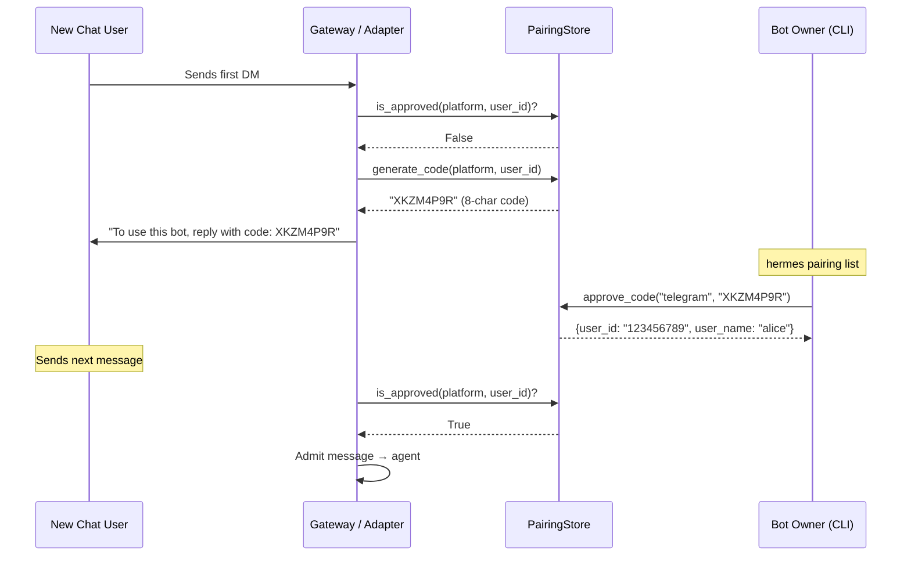
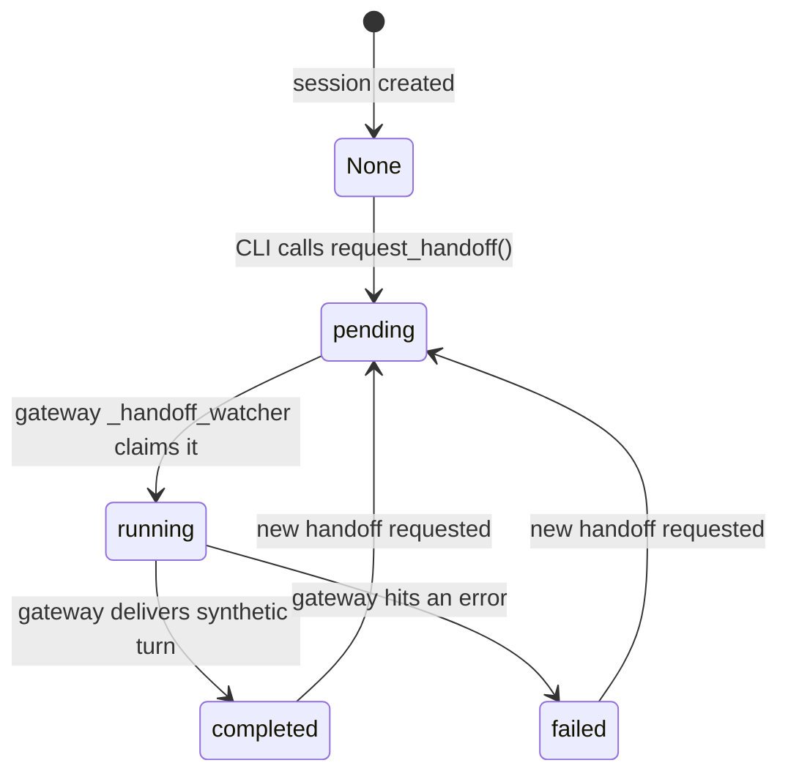

**TL;DR** — Every gateway adapter exposed to a public chat platform needs a way to decide *who* may talk to the agent, let *new* users request access safely, present *commands* consistently across CLI, Telegram, Slack, and every other surface, and track the lifecycle of a *session handoff* from the CLI to a messaging platform. This chapter walks through all four mechanisms: `GatewayAuthorizationMixin` (authorization policy), `PairingStore` (one-time code handshake), `COMMAND_REGISTRY` (single source of truth for slash commands), and the `handoff_state` state machine. By the end you will know how to configure access control, authorize a new user through pairing, understand how slash commands reach every platform from one definition, and trace a `handoff` from the CLI all the way to `completed` or `failed`.

# Gateway Authorization, DM Pairing, Slash Commands, and Handoff State

As we built in [Gateway Routing, Delivery Targets, and Stream Event Vocabulary](./routing-delivery-and-stream-events.md), the gateway receives inbound messages and routes agent output back to the right chat. That chapter covered the *routing* half of the problem — figuring out where a reply goes. Now we face the *authorization* half: just because a message arrived at our bot does not mean we should let it through to the agent. We also want to give newcomers a controlled on-ramp, keep slash commands consistent everywhere, and support handing a CLI session off to a messaging platform.

We will work through these four concerns one at a time, arriving at each solution by first feeling the problem it solves.

---

## The authorization problem

Imagine you have just deployed the gateway with your Telegram bot token. The bot is now reachable by anyone on Telegram who knows the bot handle. Without an explicit policy, every stranger who sends a message would get a full agent session — reading your files, running code on your machine, consuming your API quota. That is not what you want.

`GatewayAuthorizationMixin` (`gateway/authz_mixin.py`, line 31) is the mixin that `GatewayRunner` inherits to add this check. Every inbound message passes through `_is_user_authorized(source)` before the agent ever sees it. If that method returns `False`, the message is rejected (or quietly ignored, depending on configuration).

### The `dm_policy` values

For adapters that enforce their own access control (WeCom, Weixin, Yuanbao, QQBot, WhatsApp), the gateway exposes a `dm_policy` configuration key. The four valid values are:

| Value | Meaning |
|---|---|
| `open` | Any user who sends a DM is admitted. The adapter forwards all DMs to the gateway without pre-filtering. |
| `allowlist` | Only users whose IDs appear in the configured allowlist may send DMs; others are dropped at intake. |
| `pairing` | Unknown users receive a one-time pairing code; the gateway runs the pairing handshake. After approval they are added to the approved list. |
| `disabled` | DMs are not accepted at all on this platform. |

The `_adapter_dm_policy()` method reads the lowercased `dm_policy` from the live adapter's `_dm_policy` attribute, falling back to `config.extra` for runners built without a live adapter (S47, lines 58–88).

There is one important subtlety: when `dm_policy` is `pairing`, the adapter *forwards* the DM to the gateway rather than rejecting it at intake, because the gateway needs to issue a code and consult the pairing store. So "reached the gateway" does not mean "authorized" in that mode. The mixin explicitly carves out this case (S47, lines 237–251) to prevent `dm_policy: pairing` from being silently treated as open access.

### The per-user allowlist

For platforms that do not have a `dm_policy` of their own (Telegram, Discord, Slack, Signal, etc.), `_is_user_authorized` checks a series of environment variable allowlists. The order of checks is:

1. **Per-platform allow-all flag** — e.g. `TELEGRAM_ALLOW_ALL_USERS=true`. Admits every user on that platform.
2. **Pairing store** — checks whether the user's ID appears in `~/.hermes/platforms/pairing/<platform>-approved.json`, regardless of what allowlists are configured.
3. **Platform-specific allowlist** — e.g. `TELEGRAM_ALLOWED_USERS=123456,789012` (comma-separated user IDs).
4. **Global allowlist** — `GATEWAY_ALLOWED_USERS=<id>,<id>`.
5. **Default: deny** — if no allowlists are configured *and* no adapter-level policy passes, the result is `False`.

A special wildcard `*` in any allowlist admits everyone — this is a deliberate escape hatch for local or trusted-network deployments.

Special cases worth knowing:
- `Platform.HOMEASSISTANT` and `Platform.WEBHOOK` are always authorized. Home Assistant events are system-generated; webhooks are pre-authenticated via HMAC in the adapter.
- For **group/forum/channel** chat types, Telegram supports a separate `TELEGRAM_GROUP_ALLOWED_CHATS` variable that gates by *chat ID* rather than user ID — useful for bots deployed in a private group.

Here is a minimal Telegram setup that admits exactly two users and falls back to DM pairing for everyone else:

```yaml
# ~/.hermes/config.yaml (excerpt)
gateway:
  platforms:
    telegram:
      token: "${TELEGRAM_BOT_TOKEN}"
```

```bash
# .env (or shell export)
TELEGRAM_ALLOWED_USERS=123456789,987654321
```

If you want to use DM pairing instead of a static allowlist, set `dm_policy: pairing` (for platforms that support config-driven policy) or omit the `TELEGRAM_ALLOWED_USERS` env var — the gateway will then issue pairing codes to unknown callers by default.

### What happens to unauthorized messages

When `_is_user_authorized` returns `False`, the gateway consults `_get_unauthorized_dm_behavior`. The resolution order is (S47, lines 346–426):

1. Explicit per-platform `unauthorized_dm_behavior` in `config.yaml` — always wins.
2. Explicit global `unauthorized_dm_behavior` in config.
3. When any allowlist is configured, default to `"ignore"` — silently drop the message. (An allowlist signals deliberate restriction; replying with a pairing code to unknown strangers would be noisy and a potential information leak.)
4. `dm_policy: pairing` in config → return `"pair"`.
5. `dm_policy: allowlist` or `disabled` in config → return `"ignore"`.
6. No allowlist and no explicit config → return `"pair"` (open-gateway default: issue a code).

---

## Pairing new users safely

You have set `dm_policy: pairing` (or left the gateway open with no allowlist). A stranger messages your Telegram bot for the first time. The gateway cannot admit them yet, but it also should not just drop the message silently. Instead, it starts a pairing handshake.

**Pairing** is a one-time code handshake that links a new chat user to an authorized session. The user receives an 8-character code in the chat; the owner approves it from the CLI (`hermes pairing approve`); the user is added to the approved list and their messages are admitted from that point on. The pairing store persists approved users to `~/.hermes/platforms/pairing/` so they remain authorized across gateway restarts.

### How codes are generated

The `PairingStore` class (`gateway/pairing.py`) manages the full lifecycle. When `generate_code(platform, user_id, user_name)` is called (S48, lines 204–258):

1. Expired codes for the platform are cleaned up first.
2. If the platform is currently locked out (see lockout rules below), `None` is returned — no code is issued.
3. If the user has made a request in the last **10 minutes** (`RATE_LIMIT_SECONDS = 600`), `None` is returned — rate limited.
4. If there are already **3 or more pending codes** for this platform (`MAX_PENDING_PER_PLATFORM = 3`), `None` is returned.
5. A cryptographically random **8-character code** is generated from the unambiguous 32-character alphabet `ABCDEFGHJKLMNPQRSTUVWXYZ23456789` (the characters `0`, `O`, `1`, and `I` are excluded to prevent visual confusion).
6. The code is **hashed with a random 16-byte salt (SHA-256)** before being stored — the pending file never contains the plaintext code.
7. The entry is written atomically to `~/.hermes/platforms/pairing/<platform>-pending.json` with permissions `0600`.

Codes expire after **1 hour** (`CODE_TTL_SECONDS = 3600`).

Here is a summary of all the pairing limits in one place:

| Limit | Constant | Value |
|---|---|---|
| Code length | `CODE_LENGTH` | 8 characters |
| Code expiry | `CODE_TTL_SECONDS` | 3600 s (1 hour) |
| Rate limit per user | `RATE_LIMIT_SECONDS` | 600 s (10 minutes) |
| Max pending codes per platform | `MAX_PENDING_PER_PLATFORM` | 3 |
| Failed approvals before lockout | `MAX_FAILED_ATTEMPTS` | 5 |
| Lockout duration | `LOCKOUT_SECONDS` | 3600 s (1 hour) |

### Approving a code

On the CLI, the bot owner sees a notification (or checks with `hermes pairing list`) and approves the code:

```bash
hermes pairing list
# Output:
#   Pending Pairing Requests (1):
#   Platform     Code       User ID              Name
#   --------     ----       -------              ----
#   telegram     3a4f1b2c   123456789            alice
#   (code is shown as first 8 hex chars of the stored hash for identification)

hermes pairing approve telegram XKZM4P9R
# Output:
#   Approved! User alice (123456789) on telegram can now use the bot~
#   They'll be recognized automatically on their next message.
```

When `approve_code(platform, code)` is called (S48, lines 260–326):

1. The lockout state is checked first — if locked out, `None` is returned immediately regardless of whether the code is valid.
2. Each pending entry's stored hash is recomputed with its salt and compared to the provided code using a **constant-time comparison** (`secrets.compare_digest`) to prevent timing attacks.
3. On a match: the entry is removed from pending, the user is added to the approved file, and `{"user_id", "user_name"}` is returned.
4. On no match: `_record_failed_attempt(platform)` is called, which increments a failure counter. When the counter reaches `MAX_FAILED_ATTEMPTS` (5), the platform enters a **1-hour lockout** and the counter resets to 0.

### Revoking access

If you need to remove a user's access:

```bash
hermes pairing revoke telegram 123456789
```

This removes the user from `<platform>-approved.json`. The user's next message will again be unauthorized, and (depending on `unauthorized_dm_behavior`) they will either be silently dropped or offered a new pairing code.

### The pairing flow as a sequence



---

## Slash commands from a single source

We now have a running gateway that only admits authorized users. They want to do more than chat — they want to switch models, start a new session, check usage, manage tasks. We need slash commands. And we need them to work the same way whether someone is in the CLI, a Telegram DM, a Slack workspace, or a Discord server.

The problem with defining commands in multiple places is drift: the Telegram BotCommand menu gets out of sync with the CLI help text, which diverges from the Slack subcommand map. Autocomplete stops working. Users see different command names on different surfaces.

### `COMMAND_REGISTRY` — one definition, every surface

The solution is a single list. `COMMAND_REGISTRY` (defined in `hermes_cli/commands.py`, line 64) is a `list[CommandDef]` — the **sole source of truth** for all slash commands. Every downstream consumer derives from it automatically (S53 gateway references; `AGENTS.md` §Slash Command Registry):

| Consumer | How it uses `COMMAND_REGISTRY` |
|---|---|
| CLI help (`/help`) | `gateway_help_lines()` renders the list |
| Gateway dispatch | `GATEWAY_KNOWN_COMMANDS` frozenset for hook emission; `resolve_command()` for routing |
| Telegram BotCommand menu | `telegram_bot_commands()` generates the menu automatically |
| Slack subcommand routing | `slack_subcommand_map()` maps every command to a subcommand |
| Autocomplete (CLI + TUI) | `COMMANDS` flat dict feeds `SlashCommandCompleter` |
| CLI help by category | `COMMANDS_BY_CATEGORY` feeds `show_help()` |

Each entry is a frozen `CommandDef` dataclass (line 46):

```python
# Simplified view of a CommandDef entry
@dataclass(frozen=True)
class CommandDef:
    name: str                          # canonical name without slash: "model"
    description: str                   # shown in /help and menus
    category: str                      # "Session", "Configuration", "Tools & Skills", "Info", "Exit"
    aliases: tuple[str, ...] = ()      # e.g. ("reset",) for "new"
    args_hint: str = ""                # e.g. "[model] [--provider name] [--global]"
    subcommands: tuple[str, ...] = ()  # tab-completable values
    cli_only: bool = False             # excluded from gateway / Telegram / Slack
    gateway_only: bool = False         # excluded from CLI
    gateway_config_gate: str | None = None  # config dotpath: gateway gets command when truthy
```

A few real entries to make this concrete:

```python
# From COMMAND_REGISTRY (hermes_cli/commands.py, lines 64–225)
COMMAND_REGISTRY: list[CommandDef] = [
    CommandDef("new", "Start a new session (fresh session ID + history)", "Session",
               aliases=("reset",), args_hint="[name]"),
    CommandDef("model", "Switch model for this session", "Configuration",
               args_hint="[model] [--provider name] [--global] [--refresh]"),
    CommandDef("status", "Show session info", "Session"),
    CommandDef("kanban", "Multi-profile collaboration board (tasks, links, comments)",
               "Tools & Skills", args_hint="[subcommand]",
               subcommands=("init", "create", "list", "show", "assign", ...)),
    CommandDef("handoff", "Hand off this session to a messaging platform", "Session",
               args_hint="<platform>", cli_only=True),
    CommandDef("help", "Show available commands", "Info"),
    CommandDef("restart", "Gracefully restart the gateway after draining active runs", "Session",
               gateway_only=True),
]
```

Notice that `cli_only=True` commands (like `handoff` and the file browser) never appear in the Telegram menu or Slack map. Conversely, `gateway_only=True` commands (like `restart` and `approve`) are not available in the interactive CLI. Adding an alias requires changing only the `aliases` tuple on the existing entry — all consumers update automatically.

The handlers for these commands live in `GatewaySlashCommandsMixin` (`gateway/slash_commands.py`), which `GatewayRunner` inherits. Each `_handle_<command>_command(event)` method is dispatched by name after `resolve_command()` maps the incoming slash token (including aliases) to the canonical `CommandDef.name`.

---

## Handing off a session

The last piece of this chapter is the handoff. Here is the scenario: you have been working with the agent in the terminal CLI, you have set context, built a plan, and now you want to continue the conversation from your phone via Telegram — without losing the conversation history.

The `handoff` command (`cli_only=True`) marks the current CLI session for transfer to a messaging platform. The gateway then picks it up, re-binds the session to the platform's home channel, and fires a synthetic first message to kick the agent off. The original CLI process waits and reports the result.

### The `handoff_state` machine

The state is stored as a text column in the `sessions` table in `state.db` (`hermes_state.py`). The state machine is (S52, `hermes_state.py` lines 4504–4512):

```
None  →  pending  →  running  →  completed
                            ↘  failed
```



Each state has a precise meaning:

| State | Who sets it | Meaning |
|---|---|---|
| `None` | default | No handoff in flight for this session. |
| `pending` | CLI (`request_handoff`) | CLI has written the request; gateway has not picked it up yet. |
| `running` | Gateway watcher (`claim_handoff`) | Gateway claimed the row atomically (CAS on `pending`); processing the session switch and synthetic turn. |
| `completed` | Gateway watcher (`complete_handoff`) | Gateway successfully delivered the synthetic turn; session is live on the destination platform. |
| `failed` | Gateway watcher (`fail_handoff`) | Gateway hit an error; the reason is stored in the `handoff_error` column. |

The CLI writes `pending` then **poll-waits** for a terminal state (`completed` or `failed`) and prints the result to the terminal.

### What the gateway watcher does

`_handoff_watcher` (`gateway/run.py`, line 5010) is a background asyncio task started when the gateway comes online (after a 5-second initial delay, so the platform adapters are fully connected). It polls `state.db` every 2 seconds for rows in `handoff_state='pending'` and, for each one (S52, lines 5013–5026):

1. **Claims** the row atomically: `pending → running`. If another gateway tick or another gateway process already claimed it, `claim_handoff` returns `False` and we skip it — no double-processing.
2. Calls `_process_handoff(row)`, which:
   a. Resolves the destination `Platform` enum from `handoff_platform`.
   b. Confirms the adapter for that platform is live.
   c. Re-binds the gateway's session key for the platform's home channel to the CLI's existing `session_id` via `session_store.switch_session` — the full transcript carries over.
   d. Forges a synthetic `MessageEvent` (marked `internal=True`) with a handoff-notice text and dispatches it through the normal message pipeline so the agent runs and replies on the destination platform.
3. On success: marks `completed`.
4. On any exception: marks `failed` and records `str(exc)` in `handoff_error` (truncated to 500 characters).

### Worked example: CLI to Telegram handoff

We have been working in the terminal and want to continue on Telegram. The gateway must already be running with Telegram configured.

```bash
# In the CLI session
/handoff telegram
```

The CLI calls `request_handoff(session_id, "telegram")` in `state.db`. The SQL update only succeeds if `handoff_state` is `NULL`, `completed`, or `failed` — never if already `pending` or `running`, preventing duplicate handoffs. The CLI then polls `get_handoff_state(session_id)` until the state reaches a terminal value.

Meanwhile, the gateway's `_handoff_watcher` wakes up, finds the `pending` row, and claims it. Within seconds, a synthetic first message arrives in your Telegram home channel. The agent responds. The CLI prints something like:

```
✓ Handoff to telegram completed — continuing in your home channel.
```

---

## Edge cases and failure modes

### Pairing: the 5-failure lockout

After 5 consecutive failed approval attempts (wrong or expired codes submitted via `hermes pairing approve`), the platform enters a **1-hour lockout** (`LOCKOUT_SECONDS = 3600`). During lockout:
- `generate_code` returns `None` — no new codes are issued.
- `approve_code` returns `None` — valid codes that were already pending cannot be approved.

This prevents brute-forcing a code that has already been issued (S48, lines 280–283): the lockout must block `approve_code` too, not just `generate_code`, because a valid code may already be sitting in the pending file.

**Operator action:** Run `hermes pairing list` to confirm lockout. The lock is stored as `_lockout:<platform>` in `~/.hermes/platforms/pairing/_rate_limits.json`. To clear it before the hour is up, delete that key from the JSON file, or wait for it to expire.

```bash
# Check lockout status and pending codes
hermes pairing list

# See the lockout key directly
cat ~/.hermes/platforms/pairing/_rate_limits.json
# {"_lockout:telegram": 1718012345.0, "_failures:telegram": 0}

# To reset early: edit _rate_limits.json and remove the _lockout entry
```

### Pairing: an expired code

If a user waits more than 1 hour after receiving their code, the code expires. `_cleanup_expired` removes it from `pending` on the next `generate_code` or `approve_code` call. Submitting the code after expiry returns `None` from `approve_code` with the error message "Code not found or expired." The user must request a new code by messaging the bot again (subject to the 10-minute rate limit per user).

### Handoff that ends `failed`

If `_process_handoff` raises — for example, because the destination platform's adapter is not connected, or `handoff_platform` names an unknown platform — the watcher calls `fail_handoff(session_id, str(exc))`, writing `"failed"` and the error message into `state.db`. The CLI sees the terminal state and reports:

```
✗ Handoff to telegram failed: unknown platform 'telegram'
  (check that the gateway is running with telegram configured)
```

To retry, run `/handoff telegram` again in the CLI. The `request_handoff` call only succeeds when `handoff_state` is `NULL`, `completed`, or `failed`, so a `failed` row can be overwritten.

---

## Putting it all together

Here is how the four mechanisms interact in a real-world setup where you run the gateway with DM pairing enabled and a few allowlisted users:

```yaml
# ~/.hermes/config.yaml
gateway:
  platforms:
    telegram:
      token: "${TELEGRAM_BOT_TOKEN}"
      dm_policy: pairing       # unknown users get a code; no blanket allowlist
```

```bash
# .env
TELEGRAM_ALLOWED_USERS=123456789   # your own Telegram user ID; always admitted
```

1. You (ID `123456789`) message the bot — `_is_user_authorized` checks `TELEGRAM_ALLOWED_USERS`, finds a match, admits you.
2. A friend messages the bot for the first time — not in the allowlist, not in the approved store. The gateway issues an 8-char code via `generate_code`. Your friend sees: "To use this bot, reply with code: XKZM4P9R (expires in 1 hour)."
3. You run `hermes pairing approve telegram XKZM4P9R` from your terminal. The friend is added to `telegram-approved.json`. Their next message is admitted.
4. From the CLI (`/help`), you see the full command list generated from `COMMAND_REGISTRY`. Your friend in Telegram sees the same commands in the bot's BotCommand menu — same data, same descriptions, zero duplication.
5. You run `/handoff telegram` in the CLI. The session transfers to your Telegram home channel. The `handoff_state` moves `None → pending → running → completed`.

---

← Previous: [Gateway Routing, Delivery Targets, and Stream Event Vocabulary](./routing-delivery-and-stream-events.md) · Next: [Security — The OS Boundary, Heuristics, and Isolation Postures](../security/os-boundary-and-isolation-postures.md) →
