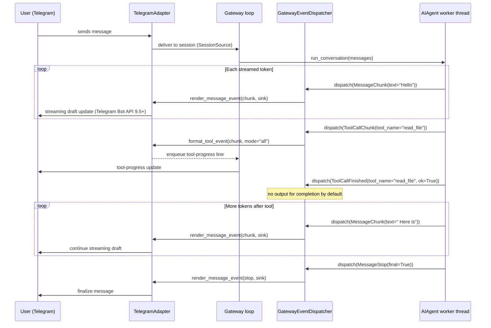

**TL;DR** — Hermes is reachable from Telegram while it works on a cloud VM, and it can deliver outputs back to 21 different chat platforms. This chapter teaches you how that routing works: the `Platform` enum and its adapter registry, how `DeliveryTarget.parse()` resolves a target string to a real chat, what the channel directory maps and when it refreshes, the seven typed stream events that carry the agent's live output, how `GatewayEventDispatcher` routes each event to the right platform adapter, and how `mirror_to_session` keeps cross-platform sends visible in the receiving session's transcript.

# Gateway Routing, Delivery Targets, and Stream Event Vocabulary

Let's start with the concrete problem this whole chapter is about.

You are chatting with Hermes on Telegram. In the background, Hermes is running a cron job that produces output — and that output needs to get routed back to you in Telegram, not lost to the void. Meanwhile, as the agent types its reply to your message, it emits tokens one at a time and you want to see them stream in rather than wait for the full answer.

Two distinct questions arise immediately:

1. **Routing:** How does Hermes know to send the cron output back to your Telegram chat and not to some other platform?
2. **Streaming:** How does the agent's partial output reach Telegram in real time, across the thread boundary between the agent's worker and the async gateway loop?

The gateway solves both. Let's build up to how, one layer at a time.

> **Prerequisite — the AIAgent and conversation loop.** The agent that produces the stream lives in `run_agent.py` as the `AIAgent` class; its `run_conversation()` method drives the turn loop. If you haven't read that chapter yet, a one-sentence summary: `AIAgent` calls the LLM, dispatches tool calls, and emits typed events while streaming. See [AIAgent and the Conversation Loop](../core-runtime/aiagent-and-conversation-loop.md) for the full walkthrough.
>
> **Prerequisite — the cron scheduler.** The gateway also hosts the cron tick that fires scheduled jobs. When those jobs need to deliver their output somewhere, they hand it to the same delivery infrastructure this chapter covers. See [Cron Scheduler](../autonomy/cron-scheduler.md) for how jobs are scheduled and triggered.

---

## The Platform enum: naming the 21 platforms

The first thing the gateway needs is a stable vocabulary for platform names. Every routing decision — "send this to telegram", "is that a discord chat ID?" — goes through the `Platform` enum defined in `gateway/config.py` (line 136).

Here are the built-in members:

```python
# gateway/config.py — Platform enum (built-in members)
class Platform(Enum):
    LOCAL          = "local"           # CLI / local files
    TELEGRAM       = "telegram"
    DISCORD        = "discord"
    WHATSAPP       = "whatsapp"
    SLACK          = "slack"
    SIGNAL         = "signal"
    MATTERMOST     = "mattermost"
    MATRIX         = "matrix"
    HOMEASSISTANT  = "homeassistant"
    EMAIL          = "email"
    SMS            = "sms"
    DINGTALK       = "dingtalk"
    API_SERVER     = "api_server"
    WEBHOOK        = "webhook"
    MSGRAPH_WEBHOOK = "msgraph_webhook"
    FEISHU         = "feishu"
    WECOM          = "wecom"
    WECOM_CALLBACK = "wecom_callback"
    WEIXIN         = "weixin"
    BLUEBUBBLES    = "bluebubbles"
    QQBOT          = "qqbot"
    YUANBAO        = "yuanbao"
```

That is 22 members — 21 messaging platforms plus `LOCAL` (local file output). The enum also has a `_missing_()` hook: if a value is not in the built-in list, it checks whether a plugin platform adapter has registered under that name. If it has, a dynamic pseudo-member is created and cached (so `Platform("irc") is Platform("irc")` is always `True`). Arbitrary strings that don't match any registered adapter are rejected.

The reason this matters: any time the gateway compares platforms or stores a routing decision, it uses `Platform` enum members — never raw strings. This prevents silent mismatches (e.g. `"Telegram"` vs `"telegram"`) and makes the comparison identity-stable.

---

## Platform adapters and the PlatformEntry registry

Knowing the platform name is not enough — the gateway also needs something that can actually talk to each platform's API. That is the job of a **platform adapter**: a per-platform translator that knows how to receive messages from that platform and how to send replies back.

Each platform has its own adapter in `gateway/platforms/` (telegram, discord, slack, signal, whatsapp, feishu, etc.). Each adapter subclasses `BasePlatformAdapter` from `gateway/platforms/base.py`. They are not all created at import time — they are created on demand when the gateway starts, based on which platforms are enabled in config.

How does the gateway know which adapter class to use for a given platform name? That is the job of `PlatformRegistry` in `gateway/platform_registry.py` and its `PlatformEntry` dataclass (line 39):

```python
# gateway/platform_registry.py — simplified view of PlatformEntry
@dataclass
class PlatformEntry:
    name: str               # identifier in config.yaml (e.g. "irc", "viber")
    label: str              # human-readable (e.g. "IRC", "Viber")
    adapter_factory: Callable[[Any], Any]  # receives PlatformConfig → adapter
    check_fn: Callable[[], bool]           # True when dependencies are installed
    validate_config: Optional[Callable[[Any], bool]] = None  # optional config check
    is_connected: Optional[Callable[[Any], bool]] = None
    required_env: list = field(default_factory=list)
    install_hint: str = ""
    source: str = "plugin"  # "builtin" or "plugin"
    # ... (additional metadata fields)
```

A `PlatformEntry` bundles together:

- An **adapter factory** — a callable that takes a `PlatformConfig` and returns an adapter instance. Using a factory rather than a bare class lets plugins do custom initialization (e.g. wrapping in a try/except, passing extra kwargs).
- A **check function** — called at startup to verify that the platform's Python dependencies are installed.
- Optional **validate_config** and **is_connected** hooks — so the gateway can tell you in `hermes gateway setup` whether a platform is ready.

Plugin platforms (installed via `hermes plugins install`) call `platform_registry.register(PlatformEntry(...))` from their `PluginContext`. The `PlatformRegistry` singleton holds all entries in a dict keyed by name. Built-in platforms use a legacy code path (`_create_adapter()`) for historical reasons, but plugin platforms go through the registry first.

The concrete adapters for the 21 built-in platforms live in `gateway/platforms/`: `telegram.py`, `discord.py`, `slack.py`, `whatsapp.py`, `signal.py`, `matrix.py`, `feishu.py`, `wecom.py`, `weixin.py`, `email.py`, `sms.py`, `dingtalk.py`, `msgraph_webhook.py`, `webhook.py`, `api_server.py`, `bluebubbles.py`, `qqbot/`, and `yuanbao.py`.

---

## SessionSource: tagging where a message came from

Before we talk about routing outbound messages, we need to understand how inbound messages are tagged. When any platform adapter receives a message, it wraps the origin information in a `SessionSource` dataclass (`gateway/session.py`, line 71):

```python
# gateway/session.py — SessionSource (simplified view)
@dataclass
class SessionSource:
    platform: Platform      # which platform the message arrived on
    chat_id: str            # the platform's chat/room identifier
    chat_name: Optional[str] = None
    chat_type: str = "dm"   # "dm", "group", "channel", "thread"
    user_id: Optional[str] = None
    user_name: Optional[str] = None
    thread_id: Optional[str] = None   # for forum topics, Discord threads
    guild_id: Optional[str] = None    # Discord guild / Slack workspace
    parent_chat_id: Optional[str] = None
    message_id: Optional[str] = None  # ID of the triggering message
    # ... (additional platform-specific fields)
```

`SessionSource` is the gateway's answer to "where did this conversation come from?". It gets embedded in the `SessionEntry` that the gateway stores, so later — when a cron job needs to route its output `"origin"` — the router can look up the entry and reconstruct the target from `entry.origin`.

The `description` property on `SessionSource` returns a human-readable string ("DM with Alice", "group: My Team") injected into the agent's system prompt so it knows its context.

---

## The channel directory: a refreshed map of reachable channels

Now here is a practical problem: when the agent wants to send a message to a channel by name (say `"discord:bot-home"` or `"slack:engineering"`), it needs to know whether that channel exists and what its numeric ID is. You cannot look up a Discord channel ID from a name without calling the platform API.

The **channel directory** (`gateway/channel_directory.py`) solves this. At startup, and then every 5 minutes, the gateway calls `build_channel_directory()`:

```python
# gateway/channel_directory.py — build_channel_directory (simplified)
async def build_channel_directory(adapters: Dict[Any, Any]) -> Dict[str, Any]:
    platforms: Dict[str, List[Dict[str, str]]] = {}

    # Discord: enumerate text channels and forum channels per guild
    # Slack: call users.conversations for joined channels per workspace
    # All others: pull known contacts/chats from sessions.json origin data

    directory = {
        "updated_at": datetime.now().isoformat(),
        "platforms": platforms,
    }
    atomic_json_write(DIRECTORY_PATH, directory)
    return directory
```

The result is saved atomically to `~/.hermes/channel_directory.json`. The `send_message` tool reads this file for `action="list"` and to resolve human-friendly channel names to IDs via `resolve_channel_name()`.

Three strategies are used per platform:

- **Discord and Slack**: the gateway queries the live platform API to enumerate channels the bot has joined.
- **All other platforms**: channels/contacts are discovered from `sessions.json` origin data — every chat the agent has participated in shows up here.

`resolve_channel_name()` does case-insensitive matching, prefix matching, and a guild-qualified `"GuildName/channel"` form for Discord.

### Edge case: stale directory before the 5-minute refresh

The channel directory is rebuilt every 5 minutes, not on every send. If a channel is created or renamed between refreshes, the directory will not reflect it yet. The consequence is that a `resolve_channel_name()` call may return `None` or the old ID. The send falls through to an unknown-target error or sends to the wrong place.

The operator action: run `hermes gateway status` (or restart the gateway) to force an immediate rebuild. In code, `build_channel_directory()` can be called directly to force a refresh.

---

## DeliveryTarget: parsing where to send

Let's now look at how the routing decision is made for an outbound message. The agent (or a cron job) specifies a delivery target as a string — `"origin"`, `"telegram"`, `"telegram:123456789"`, `"local"`. The gateway translates this string into a `DeliveryTarget` dataclass via `DeliveryTarget.parse()` in `gateway/delivery.py` (line 95):

```python
# gateway/delivery.py — DeliveryTarget and parse() (simplified)
@dataclass
class DeliveryTarget:
    platform: Platform
    chat_id: Optional[str] = None   # None means "use home channel"
    thread_id: Optional[str] = None
    is_origin: bool = False
    is_explicit: bool = False       # True if chat_id was explicitly in the string

    @classmethod
    def parse(cls, target: str, origin: Optional[SessionSource] = None) -> "DeliveryTarget":
        target_lower = target.strip().lower()

        if target_lower == "origin":
            if origin:
                return cls(platform=origin.platform, chat_id=origin.chat_id,
                           thread_id=origin.thread_id, is_origin=True)
            else:
                return cls(platform=Platform.LOCAL, is_origin=True)  # fallback

        if target_lower == "local":
            return cls(platform=Platform.LOCAL)

        # "platform:chat_id" or "platform:chat_id:thread_id"
        if ":" in target:
            parts = target.split(":", 2)
            platform = Platform(parts[0].lower())
            return cls(platform=platform, chat_id=parts[1],
                       thread_id=parts[2] if len(parts) > 2 else None,
                       is_explicit=True)

        # Just a platform name — use home channel
        platform = Platform(target_lower)
        return cls(platform=platform)
```

The four target formats and what they resolve to:

| Target string | Meaning | `chat_id` set? |
|---|---|---|
| `"origin"` | Route back to the session's inbound source | From `SessionSource` |
| `"local"` | Save to `~/.hermes/cron/output/` only | No (local path) |
| `"telegram"` | Telegram home channel | No — router uses `home_channel` |
| `"telegram:123456789"` | Specific Telegram chat | `"123456789"` |
| `"telegram:123456789:42"` | Specific chat + thread | `"123456789"`, thread `"42"` |

Notice the `origin` parameter to `parse()`: it carries the `SessionSource` from the current session. That is how `"origin"` routing knows where to reply — it reads back the exact `platform` and `chat_id` from the session that triggered the request.

---

## DeliveryRouter.deliver: dispatching to the adapter

Once we have a `DeliveryTarget`, `DeliveryRouter.deliver()` (line 175) does the actual send:

```python
# gateway/delivery.py — DeliveryRouter.deliver (simplified)
class DeliveryRouter:
    def __init__(self, config: GatewayConfig, adapters: Dict[Platform, Any]):
        self.config = config
        self.adapters = adapters
        self.output_dir = get_hermes_home() / "cron" / "output"

    async def deliver(self, content: str, targets: List[DeliveryTarget],
                      job_id=None, job_name=None, metadata=None) -> Dict[str, Any]:
        results = {}
        for target in targets:
            try:
                if target.platform == Platform.LOCAL:
                    result = self._deliver_local(content, job_id, job_name, metadata)
                else:
                    result = await self._deliver_to_platform(target, content, metadata)
                results[target.to_string()] = {"success": True, "result": result}
            except Exception as e:
                results[target.to_string()] = {"success": False, "error": str(e)}
        return results
```

The router iterates every `DeliveryTarget` in the list and dispatches independently, so a single cron output can go to `"telegram"` and `"local"` simultaneously.

For a platform target, `_deliver_to_platform()` looks up the adapter by `target.platform`:

```python
# gateway/delivery.py — _deliver_to_platform (simplified)
async def _deliver_to_platform(self, target, content, metadata):
    adapter = self.adapters.get(target.platform)
    if not adapter:
        raise ValueError(f"No adapter configured for {target.platform.value}")
    if not target.chat_id:
        raise ValueError(f"No chat ID for {target.platform.value} delivery")
    # ... content truncation at 4000 chars, silence-narration filter ...
    result = await adapter.send(target.chat_id, content, metadata=metadata)
    if _send_result_failed(result):
        raise RuntimeError(_send_result_error(result) or f"{target.platform.value} delivery failed")
    return result
```

Two important guards run before `adapter.send()`:

1. **Content truncation**: if `content` exceeds 4000 characters, it is truncated at 3800 and a note pointing to the full output file in `~/.hermes/cron/output/` is appended.
2. **Silence-narration filter**: messages that are only a silence token (`*(silent)*`, `🔇`, a bare `.`) are dropped before reaching the adapter. This prevents bot-to-bot echo loops where two agents keep mirroring "*(silent)*" back and forth.

### Edge case: delivery to an offline or unknown channel

If `target.platform` is not in `self.adapters`, the router raises `ValueError("No adapter configured for ...")`. This happens when the platform is enabled in config but failed to initialize (missing API key, missing dependency), or when a job's `deliver=` target references a platform that is not configured in this gateway instance.

The result dict for that target will have `"success": False` and the error string. Other targets in the same deliver list are still attempted — failures are per-target, not all-or-nothing.

If `target.chat_id` is `None` (the target was a bare platform name like `"telegram"` and the home channel is not configured), the router also raises `ValueError("No chat ID ...")`. This happens when `deliver="telegram"` is used but no `/sethome` was run. The fix is to set a home channel in config or use an explicit `telegram:chat_id` target.

---

## Putting routing together: a worked example

Let's say you have a daily cron job that summarizes your calendar and delivers the result to your Telegram home chat. Here is the config:

```yaml
# ~/.hermes/config.yaml
telegram:
  token: "7123456789:AAF..."
  home_channel:
    platform: telegram
    chat_id: "987654321"
    name: "My Telegram DM"

cron:
  jobs:
    - id: daily-summary
      schedule: "0 8 * * *"
      prompt: "Summarize my schedule for today."
      deliver: "telegram"
```

When the cron job fires:

1. `DeliveryTarget.parse("telegram")` returns `DeliveryTarget(platform=Platform.TELEGRAM, chat_id=None)`.
2. `DeliveryRouter._deliver_to_platform()` looks up the Telegram adapter. Since `target.chat_id` is `None`, it resolves the home channel from `GatewayConfig.get_home_channel(Platform.TELEGRAM)` — which returns the chat_id `"987654321"`.
3. The Telegram adapter's `send("987654321", content)` posts the message to your DM.

Now suppose you want the same output to also go to a Slack channel:

```yaml
      deliver: ["telegram", "slack:#engineering"]
```

Both targets are parsed and delivered independently. If Slack is not configured, its entry in the results dict will show `"success": False`; Telegram still succeeds.

---

## The stream event vocabulary: seven typed events

We have covered routing for completed outputs. Now let's tackle the second problem: streaming the agent's partial response to the platform in real time.

Historically, the agent drove gateway delivery through a fan of loosely-typed callbacks (`stream_delta_callback(text)`, `tool_progress_callback(event_type, tool_name, preview, args)`, etc.). Each callback decided both *what to render* and *how to send it*. That coupling caused races between streaming drafts and tool-progress bubbles on Telegram, and put rendering logic on the wrong side of the boundary.

The fix is a small, typed **stream event vocabulary** in `gateway/stream_events.py`. These are plain frozen dataclasses — no behavior, no platform knowledge, no I/O. The agent emits them; the gateway decides rendering.

There are exactly seven event types. Let's look at each:

```python
# gateway/stream_events.py — all seven event classes

@dataclass(frozen=True)
class MessageChunk:
    """A delta of streamed assistant text.
    Incremental token as it arrives from the model; consumer accumulates
    chunks into a progressive render. Reasoning/think-block content is
    filtered upstream and never arrives here."""
    text: str

@dataclass(frozen=True)
class MessageStop:
    """The current assistant message segment is complete.
    final=True for the terminal stop of the whole turn; final=False at a
    tool-call boundary (text → tool → more text)."""
    final: bool = False

@dataclass(frozen=True)
class Commentary:
    """A complete interim assistant message emitted between tool iterations.
    Example: "I'll inspect the repo first." — already-complete text,
    not a delta; renders as its own distinct message."""
    text: str

@dataclass(frozen=True)
class ToolCallChunk:
    """A tool invocation has started or its in-progress state changed.
    Carries name, argument preview, and full args dict.
    The gateway decides emoji, truncation, verbose vs compact,
    or whether to suppress entirely on platforms that can't render it."""
    tool_name: str
    preview: Optional[str] = None
    args: Optional[Dict[str, Any]] = None
    index: int = 0  # monotonic per-turn index for dedup / correlation

@dataclass(frozen=True)
class ToolCallFinished:
    """A tool invocation completed.
    duration is wall-clock seconds; ok reflects whether it raised.
    No tool output travels here — that stays in the agent's history."""
    tool_name: str
    duration: float = 0.0
    ok: bool = True
    index: int = 0

@dataclass(frozen=True)
class LongToolHint:
    """One-shot onboarding nudge when a tool runs longer than threshold.
    The gateway decides whether to surface this (platform must support
    /verbose; user must not have seen the hint before)."""
    tool_name: str = ""
    duration: float = 0.0

@dataclass(frozen=True)
class GatewayNotice:
    """A gateway-originated control message.
    kind is a stable string: "restart", "online", "long_run", etc.
    text is the human-readable default; adapters may override per platform."""
    kind: str
    text: str = ""
    extra: Dict[str, Any] = field(default_factory=dict)
```

The `StreamEvent` type is the union of all seven:

```python
StreamEvent = Union[
    MessageChunk, MessageStop, Commentary,
    ToolCallChunk, ToolCallFinished,
    LongToolHint, GatewayNotice,
]
```

Here is a reference table for quick lookup:

| Event class | When emitted | Key payload |
|---|---|---|
| `MessageChunk` | Each streamed token of assistant text | `text: str` (incremental delta) |
| `MessageStop` | End of a text segment (turn-end or tool boundary) | `final: bool` |
| `Commentary` | Complete interim text between tool calls | `text: str` (full message) |
| `ToolCallChunk` | Tool started or in-progress state changed | `tool_name`, `preview`, `args`, `index` |
| `ToolCallFinished` | Tool invocation completed | `tool_name`, `duration`, `ok`, `index` |
| `LongToolHint` | Tool exceeded a duration threshold (one-shot) | `tool_name`, `duration` |
| `GatewayNotice` | Gateway lifecycle event (restart, online, …) | `kind`, `text`, `extra` |

---

## GatewayEventDispatcher: routing events to the adapter

Now we have events, but we still need to get them from the agent's worker thread to the platform adapter. That is the job of `GatewayEventDispatcher` in `gateway/stream_dispatch.py` (line 40).

`GatewayEventDispatcher` is a thin synchronous router — it has no platform knowledge and no asyncio. It is callable from the agent's worker thread.

```python
# gateway/stream_dispatch.py — GatewayEventDispatcher (simplified)
class GatewayEventDispatcher:
    def __init__(
        self,
        adapter: Any,           # the platform adapter for this session
        sink: Any = None,       # GatewayStreamConsumer for text delivery; None = streaming disabled
        *,
        enqueue_tool_line: Optional[Callable] = None,  # places tool chrome on the progress queue
        tool_mode: str = "all",    # "all" / "new" / "verbose" / "off"
        preview_max_len: int = 40, # 0 = no cap in verbose mode
        on_long_tool: Optional[Callable[[LongToolHint], None]] = None,
        on_notice: Optional[Callable[[GatewayNotice], None]] = None,
    ) -> None:
        ...

    def dispatch(self, event: StreamEvent) -> None:
        """Route a single event. Never raises into the agent's worker thread."""
        try:
            self._dispatch(event)
        except Exception:
            logger.debug("stream-event dispatch error", exc_info=True)
```

The routing logic in `_dispatch()`:

```python
# gateway/stream_dispatch.py — _dispatch (simplified)
def _dispatch(self, event: StreamEvent) -> None:
    if isinstance(event, (MessageChunk, MessageStop, Commentary)):
        if self.sink is not None:
            self.adapter.render_message_event(event, self.sink)
        return

    if isinstance(event, ToolCallChunk):
        if self.tool_mode == "off" or self._enqueue_tool_line is None:
            return
        # "new" mode: only emit when the tool name changes
        if self.tool_mode == "new" and event.tool_name == self._last_tool:
            return
        self._last_tool = event.tool_name
        line = self.adapter.format_tool_event(event, mode=self.tool_mode,
                                               preview_max_len=self.preview_max_len)
        if line:  # None = adapter chose to suppress (platform can't render tool chrome)
            self._enqueue_tool_line(line)
        return

    if isinstance(event, ToolCallFinished):
        return  # default: no chrome on completion (drives onboarding hints only)

    if isinstance(event, LongToolHint):
        if self._on_long_tool is not None:
            self._on_long_tool(event)
        return

    if isinstance(event, GatewayNotice):
        if self._on_notice is not None:
            self._on_notice(event)
        return
```

Key design decisions worth noticing:

- **Message events go to the sink.** `MessageChunk`, `MessageStop`, and `Commentary` are forwarded to the `GatewayStreamConsumer` (the sink), which handles the actual progressive send — native draft on Telegram DMs, edit-in-place on other platforms.
- **Tool events go to the progress queue.** `ToolCallChunk` is formatted by the adapter (`format_tool_event`) and enqueued onto the tool-progress queue. The adapter may return `None` to suppress the event entirely on platforms that can't render tool chrome.
- **`ToolCallFinished` is silent by default.** No progress bubble is generated on completion; instead it drives one-time onboarding hints.
- **`LongToolHint` and `GatewayNotice` go to optional callbacks** — the gateway owns the "should I surface this here?" decision rather than baking it into the event itself.
- **`dispatch()` never raises.** Any exception in presentation is caught and logged at debug level. This is a critical invariant: a rendering failure must never break the agent's conversation loop.

---

## Sequence diagram: streaming a reply to Telegram

Let's put the pieces together for the common case: the agent is responding to a Telegram message and streaming tokens back.



---

## Component diagram: gateway routing overview

```mermaid
flowchart TD
    subgraph Platforms
        TG[Telegram]
        DC[Discord]
        SL[Slack]
        WA[WhatsApp]
        OT[... 17 more]
    end

    subgraph Adapters["Platform Adapters (gateway/platforms/)"]
        TGA[TelegramAdapter]
        DCA[DiscordAdapter]
        SLA[SlackAdapter]
        WAA[WhatsAppAdapter]
        OTA[...]
    end

    subgraph GatewayCore["Gateway Core"]
        PR[PlatformRegistry\n(PlatformEntry per platform)]
        CD[ChannelDirectory\n(5-min refresh)]
        DR[DeliveryRouter\n(deliver)]
        GED[GatewayEventDispatcher\n(dispatch)]
        SS[SessionStore\n(SessionSource → SessionEntry)]
    end

    Agent["AIAgent\n(run_conversation)"]
    Cron["CronScheduler\n(tick)"]

    TG <--> TGA
    DC <--> DCA
    SL <--> SLA
    WA <--> WAA
    OT <--> OTA

    PR --> TGA
    PR --> DCA
    PR --> SLA

    Agent -->|stream events| GED
    GED -->|render_message_event| TGA
    GED -->|format_tool_event| DCA

    Cron -->|deliver targets| DR
    DR -->|adapter.send| TGA
    DR -->|adapter.send| SLA

    TGA -.->|inbound SessionSource| SS
    SS -.->|origin lookup| DR
    CD -.->|resolve channel name| DR
```

---

## mirror_to_session: keeping cross-platform sends in context

Here is a subtle problem: when the agent (or a cron job) sends a message to someone on Telegram, the receiving agent's session on Telegram has no record of what was sent — the outbound message happened from a different context (CLI, cron, another platform). The receiving agent might ask "did you send me anything recently?" and not know.

`mirror_to_session()` in `gateway/mirror.py` (line 25) solves this:

```python
# gateway/mirror.py — mirror_to_session (simplified)
def mirror_to_session(
    platform: str,
    chat_id: str,
    message_text: str,
    source_label: str = "cli",
    thread_id: Optional[str] = None,
    user_id: Optional[str] = None,
) -> bool:
    """
    Append a delivery-mirror message to the target session's transcript.

    Finds the gateway session matching platform + chat_id, then writes a
    mirror entry to the SQLite DB. Returns True if mirrored, False if no
    session found or error. All errors are caught — never fatal.
    """
    session_id = _find_session_id(platform, str(chat_id),
                                   thread_id=thread_id, user_id=user_id)
    if not session_id:
        return False

    mirror_msg = {
        "role": "assistant",
        "content": message_text,
        "timestamp": datetime.now().isoformat(),
        "mirror": True,
        "mirror_source": source_label,
    }
    _append_to_sqlite(session_id, mirror_msg)
    return True
```

`_find_session_id()` scans `sessions.json` for a session whose `origin.chat_id` and `origin.platform` match the target. When multiple sessions match the same chat (e.g. a group chat with per-user isolation), it uses the `user_id` parameter to pick the right one; if there is still ambiguity, it returns `None` rather than contaminating a wrong participant's session.

The mirrored message is written to SQLite with `"mirror": True` so the agent can tell it apart from real assistant turns. The `source_label` ("cli", "cron", etc.) is recorded so the context is clear.

`mirror_to_session()` is intentionally lightweight and standalone — it works from CLI, cron, and gateway contexts without the full `SessionStore` machinery. All errors are caught; a mirroring failure is never fatal to the send.

---

## Worked example: reading the stream from a custom integration

Suppose you are building a simple integration that connects to Hermes' API server and wants to observe the typed event stream. Here is what the consumer side looks like conceptually:

```python
# Simplified illustration — not production code
from gateway.stream_events import (
    MessageChunk, MessageStop, Commentary,
    ToolCallChunk, ToolCallFinished, LongToolHint, GatewayNotice,
)
from gateway.stream_dispatch import GatewayEventDispatcher

# Your integration provides a sink (for message text) and a tool-line queue
dispatcher = GatewayEventDispatcher(
    adapter=my_adapter,
    sink=my_stream_consumer,
    enqueue_tool_line=my_tool_queue.put,
    tool_mode="all",
    on_long_tool=lambda hint: print(f"Tool '{hint.tool_name}' is taking a while..."),
    on_notice=lambda notice: print(f"[{notice.kind}] {notice.text}"),
)

# In the agent's worker thread, as each event fires:
for event in agent_event_stream():
    dispatcher.dispatch(event)
    # dispatch() never raises — your loop stays alive regardless
```

In `tool_mode="all"`, every `ToolCallChunk` causes a formatted line on the tool-progress queue. In `"new"` mode, only the first chunk per unique tool name is emitted (dedup by `_last_tool`). In `"off"` mode, all tool events are suppressed.

---

## Authorization, slash commands, and handoff state

This chapter covers the routing and delivery layer. The gateway also handles who is *allowed* to send messages, the DM-pairing flow for new users, slash commands (`/new`, `/verbose`, `/sethome`, …), and handoff state for transferring sessions between gateway instances. Those topics live in the next chapter: [Gateway Authorization, DM Pairing, Slash Commands, and Handoff State](./authorization-pairing-and-slash-commands.md).

---

← Previous: [The Curator and the Full Learning Loop](../skills/curator-and-the-learning-loop.md) · Next: [Gateway Authorization, DM Pairing, Slash Commands, and Handoff State](./authorization-pairing-and-slash-commands.md) →
