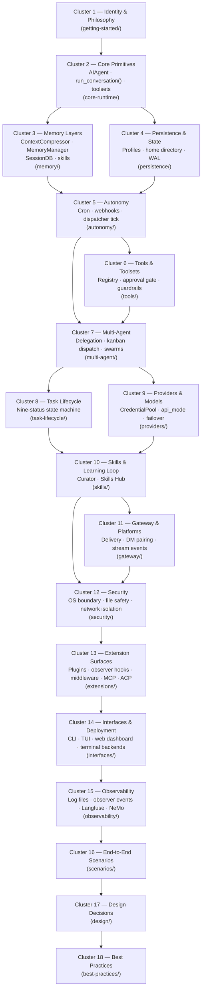

**TL;DR** — Agent systems accumulate myths almost as fast as they accumulate features. Before we dive into Hermes, we need to build an accurate map: which subsystems this guide covers, in what order, and — just as importantly — which six mental models would steer you wrong if you carried them in. By the end of this page you'll know exactly what you're about to learn and why each cluster comes when it does.

# What This Guide Covers — An Honest Map of Hermes v0.16.0

Hermes is the self-improving AI agent built by Nous Research. Its defining capability is a closed learning loop: it creates skills from experience, improves them during use, nudges itself to persist knowledge, searches its own past conversations, and builds a deepening model of who the user is across sessions. That identity thread runs through every cluster in this guide.

Before you can follow the learning loop in detail, though, you need a reliable picture of the whole system — what it contains, how the parts connect, and what this guide covers versus what it leaves out. That is the job of this page.

## Why a scope map matters

Here is the problem: complex systems invite shortcuts. Readers fill unknown gaps with familiar analogies — "heartbeat," "squad," "short-term vs. long-term memory" — that feel plausible but describe a different system. When those analogies harden into mental models, every chapter that contradicts them creates friction. You spend energy unlearning rather than learning.

The honest cure is to state the map upfront: here are the 18 subsystem clusters, here is the reading order, and here are six specific misconceptions we will correct right now before they form.

## Prerequisite: the Hermes identity

This page builds on the introduction in [What Hermes Is and Why It Exists](./what-is-hermes.md). In brief: Hermes is a MIT-licensed, self-improving AI agent by Nous Research (v0.16.0) that creates and curates its own skills from conversation, runs on any hardware from a $5 VPS to a GPU cluster, and supports approximately 30 bundled model providers with no code changes needed to switch. If you haven't read that page, spend five minutes there first — the identity thread it establishes runs through every cluster below.

---

## The 18 clusters — a dependency-ordered reading spine

The guide follows a single rule: **each cluster builds only on concepts the clusters before it established.** You cannot understand kanban dispatch before you understand what a task is. You cannot understand swarm topologies before you understand delegation. The reading order below is the dependency order.

The diagram below shows the foundation-first progression. Each node links to the first chapter in that cluster.

Here is what each cluster teaches, and the first chapter to read in each.

| Cluster | What you will learn | First chapter |
|---|---|---|
| **1 — Identity & Philosophy** | What Hermes is, why it exists, the learning loop as architectural centerpiece, deployment postures, this scope map | [What Hermes Is and Why It Exists](./what-is-hermes.md) |
| **2 — Core Primitives** | The `AIAgent` class, the `run_conversation()` decision loop, `IterationBudget`, toolsets, the tools registry, concurrent dispatch | [The AIAgent Class and the run_conversation() Loop](../core-runtime/aiagent-and-conversation-loop.md) |
| **3 — Memory Layers** | The five memory layers, `ContextCompressor` + LCM tools, `MemoryManager`, `SessionDB`, skills as persistent procedures, the nudge-to-persist behaviour | Memory overview chapter |
| **4 — Persistence & State** | The Hermes home directory layout (`~/.hermes/`), profile mode, compression-triggered session splitting, WAL fallback on network filesystems | Persistence & home directory chapter |
| **5 — Autonomy** | The cron scheduler (`tick()` every 60s), webhook triggers, the kanban dispatcher tick, `no_agent=True` mode, `context_from` chaining, the Curator as a distinct mechanism | Autonomous operation chapter |
| **6 — Tools & Toolsets** | The tools registry, named toolsets, the approval gate (a heuristic, not a security boundary), the guardrail controller, concurrent dispatch (up to 8 worker threads) | Tools and toolsets chapter |
| **7 — Multi-Agent** | `delegate_task` (in-process delegation), kanban dispatch (board-level async), `create_swarm()` (swarm topologies) — three distinct, non-equivalent mechanisms | Multi-agent overview chapter |
| **8 — Task Lifecycle** | The nine `VALID_STATUSES` and their exact transition semantics, the task DAG, worker handoff, `goal_mode`, `kanban_notify_subs` | Task lifecycle chapter |
| **9 — Providers & Models** | The `ProviderProfile` dataclass, bundled providers, four `api_mode` values, `CredentialPool` rotation and cooldowns, `FailoverReason`, Anthropic prompt caching | Providers and models chapter |
| **10 — Skills & Learning Loop** | Skill directory structure, `SKILL.md` frontmatter, `skills_list` / `skill_view` / `skill_manage` tools, the Curator, the Skills Hub — where the learning loop closes | Skills and the learning loop chapter |
| **11 — Gateway & Platforms** | The multi-platform message router, `Platform` enum (19+ platforms), delivery targets, stream event vocabulary, DM Pairing, gateway authorization | Gateway and platforms chapter |
| **12 — Security** | The OS as the only real security boundary, why in-process mechanisms are heuristics, file-write denied paths, credential scrubbing, terminal-backend isolation, Docker two-network egress | Security chapter |
| **13 — Extension Surfaces** | `PluginManager`, observer hooks (`hermes.observer.v1`), middleware (`hermes.middleware.v1`), MCP client integration, `hermes mcp serve`, ACP adapter | Extensions chapter |
| **14 — Interfaces & Deployment** | CLI (prompt_toolkit + Rich), TUI (Ink/TypeScript, JSON-RPC over stdio), web dashboard (PTY bridge, xterm.js), Electron desktop app, six terminal backends | Interfaces and deployment chapter |
| **15 — Observability** | Four rotating log files, `[session_id]` tagging, `hermes logs` CLI, the observer hook system as the primary observability extension point, Langfuse and NeMo Relay plugins | Observability chapter |
| **16 — End-to-End Scenarios** | Five walkthroughs using real Hermes primitives: single-agent task, kanban board workflow, multi-profile swarm, cron job with delivery, human-in-the-loop approval | Scenarios chapter |
| **17 — Design Decisions** | Why each major architectural choice was made, the alternatives that existed, and the tradeoffs for operators | Design decisions chapter |
| **18 — Best Practices** | Opinionated recommendations derived from real Hermes behaviour: when to use delegation vs. kanban vs. swarms, how to size budgets, security deployment checklists, skill authoring for longevity | Best practices chapter |

---

## What Hermes is NOT — six corrections before you start

Agent system documentation fails in a specific way: a reader who carries the wrong abstraction into a chapter cannot learn from it, because every sentence conflicts with their existing model. The following six corrections prevent that.

Each row names the wrong mental model, the real Hermes mechanism it misrepresents, and the chapter that covers the reality.

| Wrong mental model | What Hermes actually has | Covered in |
|---|---|---|
| **"Squad" abstraction** — squad leaders, squad hierarchy, cross-squad governance | The word "squad" does not exist in the Hermes codebase. The real multi-agent organization primitives are: **profiles** (named agents with isolated homes, config, keys, memory, and skills), **boards** (project-level kanban isolation at `~/.hermes/kanban/boards/<slug>/kanban.db`), and **swarm topologies** (planning root → parallel workers → verifier → synthesizer via `create_swarm()`). | Cluster 7 (Multi-Agent) |
| **"Heartbeat" component** — a named subsystem responsible for autonomous operation | Not a named component anywhere in the codebase. The real autonomous-operation mechanism is three distinct trigger types: the **cron scheduler** (`tick()` fires every 60 seconds from a gateway background thread), **webhook triggers** (GitHub events, HMAC-authenticated API POSTs), and the **kanban dispatcher tick** (`dispatch_once()` promotes ready tasks). The Curator is a fourth, distinct mechanism — inactivity-triggered background skill maintenance, not the same as autonomy. | Cluster 5 (Autonomy), Cluster 10 (Skills) |
| **In-process mechanisms = security boundary** — the approval gate, guardrail controller, file-write denied paths, and Skills Guard prevent adversarial LLM actions | Hermes's own security policy states: *"The only security boundary against an adversarial LLM is the operating system. Nothing inside the agent process constitutes containment."* All in-process mechanisms — the approval gate, the `ToolCallGuardrailController`, `build_write_denied_paths()`, credential scrubbing, Skills Guard — are **convenience heuristics**, not security boundaries. The real isolation postures are terminal-backend selection (Docker, SSH, Singularity, Modal, Daytona) and whole-process wrapping. | Cluster 12 (Security) |
| **Model routing is dynamic or learned** — Hermes observes usage and routes requests to different models automatically | Model routing is **config-driven**: `model.provider` and `model.model` in `config.yaml` select the provider and model; `api_mode` selects the transport protocol (`chat_completions`, `anthropic_messages`, `codex_responses`, `bedrock_converse`); `CredentialPool` handles key rotation and failover across credentials. No learned router exists. Switch providers with `hermes model` — no code changes required, just config. | Cluster 9 (Providers) |
| **"Short-term / long-term / workspace" memory taxonomy** — a three-bucket mental model for Hermes memory | Hermes has **five named layers** with distinct persistence boundaries and retrieval mechanisms: (1) the in-context conversation window, (2) `ContextCompressor` with the LCM context engine (`lcm_grep`, `lcm_describe`, `lcm_expand`), (3) `MemoryManager` orchestrating one external provider plus built-in recall injected via `<memory-context>` tags, (4) `SessionDB` (SQLite/WAL, FTS5 + trigram full-text search, schema version 15) as the full conversation archive, and (5) skills as persistent learned procedures. | Cluster 3 (Memory) |
| **Built-in Prometheus/Grafana/distributed tracing** — Hermes ships a standard observability stack | Hermes does not ship a built-in metrics pipeline or distributed tracing stack. Observability beyond the four rotating log files (`agent.log`, `errors.log`, `gateway.log`, `gui.log` under `~/.hermes/logs/`) is provided by **plugins through the observer hook system** (`hermes.observer.v1`). The bundled consumers are the Langfuse plugin and the NeMo Relay plugin. | Cluster 15 (Observability) |

One additional correction on a specific detail: some earlier descriptions of the cron scheduler refer to a "3-minute hard interrupt" on cron sessions. The real value is a **600-second (10-minute) inactivity timeout**, controlled by the `HERMES_CRON_TIMEOUT` environment variable (`0` = unlimited). Script jobs use a separate `HERMES_CRON_SCRIPT_TIMEOUT` setting. The Cluster 5 chapters document the real timeout behaviour.

---

## Scope boundaries — what this guide covers and what it does not

### Confirmed v0.16.0 subsystems (all covered)

Every subsystem listed in the cluster table above is confirmed in the Hermes v0.16.0 codebase (`name = "hermes-agent"`, `version = "0.16.0"` in `pyproject.toml`, `authors = [{name = "Nous Research"}]`, `license = "MIT"`). The confirmed coverage list includes:

- **Core runtime:** `AIAgent`, `run_conversation()`, `IterationBudget`, interrupt mechanism, `/steer` injection, streaming with a 180-second stale-stream health check (`HERMES_STREAM_STALE_TIMEOUT`)
- **Memory:** `MemoryManager`, `ContextCompressor` + LCM context engine, `SessionDB` (SQLite/WAL, FTS5 + trigram, schema v15), session compression chains (`parent_session_id`), external memory providers (Honcho, Hindsight, Mem0), skills
- **Autonomy:** cron scheduler (`tick()` every 60s, file-based lock at `~/.hermes/cron/.tick.lock`), job schedule kinds (`once`, `interval`, `cron`), stale-run fast-forward, `no_agent=True` mode, `context_from` chaining, webhook triggers, kanban dispatcher tick, the Curator
- **Tools:** tools registry, named toolsets (`TOOLSETS` dict in `toolsets.py`), sequential vs. concurrent dispatch (up to `_MAX_TOOL_WORKERS = 8` threads), the guardrail controller (`ToolCallGuardrailController`), the approval gate, file-write denied paths, Mixture-of-Agents tool (`moa` toolset)
- **Multi-agent:** `delegate_task` (depth-capped, `leaf` vs. `orchestrator` roles), kanban boards + dispatcher + `claim_task()` atomic CAS + `build_worker_context()` + `goal_mode`, `create_swarm()` (planning root → workers → verifier → synthesizer, swarm blackboard `[swarm:blackboard]`)
- **Task lifecycle:** nine `VALID_STATUSES` (`triage`, `todo`, `scheduled`, `ready`, `running`, `blocked`, `review`, `done`, `archived`) with exact transition semantics, `Task` dataclass fields, `task_links` DAG, worker handoff, `kanban_notify_subs`, artifact delivery
- **Providers:** bundled providers in `plugins/model-providers/` (including alibaba, anthropic, bedrock, deepseek, gemini, ollama-cloud, openrouter, xai, and approximately 25 others), `ProviderProfile` dataclass, four `api_mode` values, provider-specific adapters (Gemini native, Bedrock via boto3, Codex Responses, Anthropic with three auth variants), `CredentialPool` rotation strategies and cooldowns, `FailoverReason` taxonomy, Anthropic prompt caching, cost and usage tracking
- **Skills:** skill directory structure (`~/.hermes/skills/<name>/SKILL.md`), `SKILL.md` frontmatter, `skills_list` / `skill_view` / `skill_manage` tools, skill bundles, the Curator (inactivity-triggered, actions: pin / archive / consolidate / patch), the Skills Hub (trust levels: `builtin`, `trusted`, `community`; install audit log at `~/.hermes/skills/.hub/audit.log`), optional skills
- **Gateway:** `Platform` enum (19+ named platforms), platform adapters, `PlatformEntry` registry, `DeliveryTarget.parse()` and `DeliveryRouter.deliver()`, channel directory (refreshed every 5 minutes), stream event vocabulary (`MessageChunk`, `MessageStop`, `Commentary`, `ToolCallChunk`, `ToolCallFinished`, `LongToolHint`, `GatewayNotice`), `GatewayEventDispatcher`, gateway authorization (`GatewayAuthorizationMixin`), DM Pairing system (8-character codes, 1-hour expiry, max 3 pending, lockout after 5 failed approvals), `mirror_to_session()`, shared slash command registry, handoff state machine
- **Extension surfaces:** `PluginManager`, observer hooks (`hermes.observer.v1`, six event families, fail-open contract, correlation IDs, Langfuse/NeMo consumers), middleware (`hermes.middleware.v1`, four kinds), MCP client integration, `hermes mcp serve` (FastMCP, 10 tools), ACP adapter (VS Code / Zed / JetBrains, registry ID `hermes-agent`)
- **Security:** OS-boundary statement, approval gate, file-write denied paths, credential scrubbing, Skills Guard, terminal-backend isolation postures, Docker two-network egress model, gateway authorization, shell hook allowlist
- **Interfaces:** CLI (prompt_toolkit + Rich), TUI (Ink/TypeScript, JSON-RPC over stdio), web dashboard (WebSocket/PTY bridge/xterm.js), Electron desktop app, six terminal backends (`local`, `docker`, `ssh`, `singularity`, `modal`, `daytona`)
- **Observability:** four rotating log files, `[session_id]` tagging per log record, `hermes logs` CLI, observer hook system as the primary extension point for metrics and tracing, Langfuse and NeMo Relay plugins, skills install audit log

### What this guide deliberately excludes

The following topics exist in the v0.16.0 repository but fall outside the scope of this learning guide:

| Excluded area | Reason |
|---|---|
| **Research and data-generation tooling** (`batch_runner.py`, trajectory compression, `save_trajectories` mode) | Niche capability relevant to ML researchers training tool-calling models; requires prior understanding of LLM fine-tuning pipelines not established in this guide |
| **Nix build and packaging system** | Infrastructure topic separate from operating Hermes; relevant only to packagers building distribution artifacts |
| **i18n catalog system** (`locales/` directory, `locales/*.yaml`) | Internal localisation infrastructure; not exposed via user-facing configuration |
| **The upstream Docusaurus docs site** (`website/` directory) | Documentation infrastructure, not Hermes runtime behaviour |
| **Specific model catalog versions** | The model list changes with each release; this guide covers the provider architecture; consult `hermes model list` for current models |
| **Platform-specific adapters in depth** (DingTalk, WeCom, Feishu, Yuanbao, BlueBubbles, QQBot, and similar messaging platforms) | The gateway architecture and adapter pattern are fully covered; per-platform setup specifics are in the platform's own documentation |

---

## How to use this guide

We built the reading spine to be followed in order, at least through Cluster 7. The first seven clusters establish the foundations everything else rests on — if you skip ahead to Cluster 13 (Extension Surfaces) without understanding how `run_conversation()` works and how tools are dispatched, the hook signatures will not make sense.

After Cluster 7, the remaining clusters are more independently readable, though design decisions (Cluster 17) assume familiarity with all the mechanisms they analyze, and best practices (Cluster 18) draw on all preceding clusters.

If you are returning to look up a specific mechanism, the cluster table above is your index. Each row links to the first chapter in that cluster; every chapter carries prev/next navigation so you can walk forward from any entry point.

Let's start at the foundation: the next chapter covers the `AIAgent` class and the `run_conversation()` loop — the central runtime object every other cluster connects back to.

---

← Previous: [Glossary](../reference/glossary.md) · Next: [The AIAgent Class and the run_conversation() Loop](../core-runtime/aiagent-and-conversation-loop.md) →
