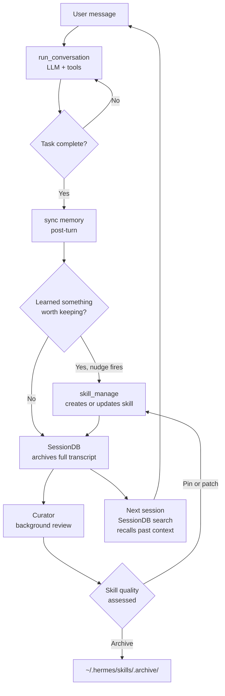

**TL;DR** — Hermes is the self-improving AI agent built by Nous Research (v0.16.0, MIT). Its defining feature is a *closed learning loop*: it creates skills from experience, refines them over time, and builds a deepening model of the user across sessions. This chapter introduces that loop, the six headline capabilities, how Hermes deploys anywhere from a $5 VPS to serverless infrastructure, and how to read the rest of this guide.

# What Hermes Is — Identity, Learning Loop, and Six Capabilities

Let's start at the beginning: what is an AI agent, and why does it matter that Hermes *improves itself*?

## What an "AI agent" means — and the problem it solves

You have probably used an LLM (Large Language Model) — a text-generation model that reads a prompt and produces a response. An LLM on its own is a single-turn oracle: you ask, it answers, and the conversation starts fresh next time.

An **AI agent** is something more: software that wraps an LLM and can take actions in the world by calling **tools** — functions like "search the web", "run a terminal command", "read a file", or "send a message". When the model decides a tool is needed, it asks the agent runtime to run it, receives the result, and continues reasoning. This back-and-forth can repeat many times per user message. The result is a system that can complete multi-step tasks, not just answer questions.

That loop — user message → LLM decides what to do → agent runs tools → LLM reasons on results → repeat — is what makes an agent different from a plain chat interface.

Now we can name the problem that Hermes was designed to solve: **most agents forget everything between sessions**. Each conversation starts with a blank slate. The model cannot remember what worked last time, what you prefer, or what complex procedure it figured out three weeks ago. An agent that cannot retain and reuse knowledge is perpetually a novice.

## Hermes's defining answer: the closed learning loop

Hermes solves the blank-slate problem with a **closed learning loop**. Here is what that means in concrete terms, derived directly from the README and the project description in `pyproject.toml`:

> Hermes is the self-improving AI agent built by Nous Research. Its defining capability is a closed learning loop: it creates skills from experience, improves them during use, nudges itself to persist knowledge, searches its own past conversations, and builds a deepening model of who the user is across sessions.

Let's unpack each part of that statement before we go further:

- **Creates skills from experience.** After completing a complex task, Hermes can write a "skill" — a reusable procedure stored in `~/.hermes/skills/`. The next time a similar task comes up, the skill is available without starting from scratch.
- **Improves them during use.** Skills are not frozen. The Curator — a background maintenance agent we will cover in detail later — reviews agent-created skills periodically, patching or consolidating them as the system learns what actually works.
- **Nudges itself to persist knowledge.** During a conversation, Hermes can recognise when it has learned something worth keeping and call the `skill_manage` tool to save it, rather than waiting for an explicit command from the user.
- **Searches its own past conversations.** Every conversation is stored in a SQLite database called `SessionDB`. Hermes can search across all sessions using full-text search (a technique that matches words across stored documents) to recall context from weeks-old conversations.
- **Builds a deepening model of the user.** Through memory providers like Honcho, Hermes tracks user preferences, working styles, and domain knowledge across sessions — so each new conversation benefits from every prior one.

This is the thread that runs through the entire documentation. Whenever we encounter skills, the Curator, `MemoryManager`, `SessionDB` search, or the nudge-to-persist behaviour, we will connect it back to this loop — because the loop is the architectural reason the system is shaped the way it is.

The diagram below shows the loop at the highest level of abstraction:



Follow the arrows: a user message starts a conversation (`run_conversation()`), which dispatches tools and iterates until the task is done. Afterward, memory is synced. If the agent decides to persist a procedure, it calls `skill_manage`. The full transcript goes to `SessionDB`. The Curator runs in the background reviewing skills. On the next session, `SessionDB` search surfaces relevant context. The loop is genuinely closed.

## The six headline capabilities

The README presents six capabilities in a table. Let's walk through each one, because understanding them at a conceptual level now will make the later chapters much easier to follow.

| Capability | What it means in practice |
|---|---|
| A real terminal interface | Full TUI with multiline editing, slash-command autocomplete, conversation history, interrupt-and-redirect, and streaming tool output. Not a web chat widget. |
| Lives where you do | Telegram, Discord, Slack, WhatsApp, Signal, and CLI — all from a single gateway process. Voice memo transcription, cross-platform conversation continuity. |
| A closed learning loop | Agent-curated memory, autonomous skill creation, FTS5 session search, Honcho dialectic user modelling. The defining capability. |
| Scheduled automations | Built-in cron scheduler with delivery to any platform. Daily reports, nightly backups, weekly audits — in natural language, running unattended. |
| Delegates and parallelizes | Spawn isolated subagents for parallel workstreams. Python scripts that call tools via RPC, collapsing multi-step pipelines into zero-context-cost turns. |
| Runs anywhere, not just your laptop | Six terminal backends — local, Docker, SSH, Singularity, Modal, and Daytona. Run on a $5 VPS or a GPU cluster. |

The seventh entry in the table — **Research-ready** — is worth calling out separately. Hermes supports batch trajectory generation (recording the full sequence of tool calls and model decisions during a task) and trajectory compression for training the next generation of tool-calling models. This is what "research-ready" means: Hermes is designed so that its own operation can produce training data.

Let's look at three of these capabilities more closely, because they come up throughout the guide.

### Runs anywhere

The phrase "runs anywhere" is not marketing shorthand. It describes a deliberate deployment posture built into the system.

Six **terminal backends** implement a common interface. Each backend is responsible for actually running the shell commands that Hermes's tools issue:

| Backend | Where commands execute |
|---|---|
| `local` | The machine Hermes is installed on (default) |
| `docker` | An isolated Docker container |
| `ssh` | A remote machine over SSH |
| `singularity` | A Singularity container (common in HPC) |
| `modal` | Modal's serverless compute platform |
| `daytona` | Daytona's managed development environments |

The Modal and Daytona backends offer a useful property: the agent's environment **hibernates when idle** and wakes on demand, costing nearly nothing between sessions. The README is specific about this: "Run it on a $5 VPS or a GPU cluster." You can also talk to Hermes from Telegram while it does its work on a cloud VM — the gateway (described next) handles that decoupling.

### Provider-agnostic by design

Hermes does not require a specific LLM provider. The project ships with approximately 30 bundled providers — including OpenAI, Anthropic, Google, AWS Bedrock, OpenRouter, Hugging Face, Nous Portal, Ollama, and many others — and the user switches between them with one command:

```bash
hermes model
```

No code changes are required. No lock-in. This design reflects a specific architectural decision: model selection is entirely config-driven, via `model.provider` and `model.model` in `~/.hermes/config.yaml`. The system does not use a learned or dynamic router — it uses the provider and model you configured, with a `CredentialPool` (a pool of API keys that rotates through them for redundancy) handling failover transparently.

### Messaging gateway

The **gateway** is a separate process that connects Hermes to messaging platforms. When you run `hermes gateway start`, a single gateway process can serve Telegram, Discord, Slack, WhatsApp, Signal, and others simultaneously. You send a message on Telegram; Hermes processes it; the response arrives in Telegram. Meanwhile the agent might be running shell commands on a remote server via an SSH backend.

This separation — conversation on your phone, execution on a cloud VM — is what "lives where you do" actually means operationally.

## What is inside Hermes: a structural overview

To understand the chapters ahead, it helps to have a map. Here is the top-level directory structure from `AGENTS.md`, annotated for orientation:

```
hermes-agent/
├── run_agent.py        # AIAgent class — the central runtime object
├── toolsets.py         # Named tool groups (browser, file, terminal, skills, …)
├── hermes_state.py     # SessionDB — SQLite-backed conversation archive
├── agent/              # Provider adapters, memory, compression, budget tracking
├── hermes_cli/         # CLI subcommands, setup wizard, plugin loader
├── tools/              # Tool implementations, auto-discovered at startup
│   └── environments/   # Terminal backends (local, docker, ssh, modal, …)
├── gateway/            # Messaging gateway — platform adapters + dispatcher
├── plugins/            # Memory providers, model providers, observability, …
├── skills/             # Built-in skills shipped with the repo
├── cron/               # Cron scheduler — jobs.py, scheduler.py
└── ui-tui/             # Ink (React/TypeScript) terminal UI
```

You will encounter these directories by name as the guide proceeds. The key entry point is `run_agent.py`, which contains the `AIAgent` class — the object that holds a conversation, dispatches tools, and applies the iteration budget. Think of `AIAgent` as the engine; everything else serves it.

## The four things you should know before reading further

Before moving on to the next page, let's make sure the four foundational facts are clear.

**1. Hermes is version 0.16.0, MIT-licensed, built by Nous Research.** The `pyproject.toml` records this exactly: `name = "hermes-agent"`, `version = "0.16.0"`, `license = "MIT"`, `authors = [{ name = "Nous Research" }]`. The description in that file is: "The self-improving AI agent — creates skills from experience, improves them during use, and runs anywhere."

**2. The closed learning loop is the defining capability, not a footnote.** Every chapter that touches skills, the Curator, memory, session search, or skill creation connects to this loop. If a mechanism seems oddly designed, the answer is usually: it exists to serve the loop.

**3. "Runs anywhere" is a concrete engineering choice, not a slogan.** Six backends, a separate gateway process, profile isolation — these are design decisions that make deployment flexibility real.

**4. In-process mechanisms are not security boundaries.** Hermes's own security policy is direct: the only real security boundary against an adversarial LLM is the operating system. The approval gate, file-write denied paths, and guardrail controller are convenience heuristics. We will return to this in the security chapter, but it is worth knowing from the start.

## How to read this guide

This guide follows a **dependency-ordered reading spine**: each chapter builds on the concepts established in the ones before it. Here is the progression at a glance:

1. **Getting started** (this chapter + glossary) — what Hermes is, key terms defined.
2. **Core runtime** — `AIAgent`, the conversation loop, the iteration budget, toolsets. The mechanism that runs every conversation.
3. **Memory layers** — the five distinct memory layers and how each one persists knowledge.
4. **Persistence and state** — the home directory layout, `SessionDB`, session compression chains.
5. **Autonomy** — the cron scheduler, webhook triggers, the kanban dispatcher tick.
6. **Tools and toolsets** — the registry, named toolsets, the approval gate, guardrails.
7. **Multi-agent** — `delegate_task`, kanban dispatch, swarm topologies.
8. **Task lifecycle** — the nine-status state machine.
9. **Providers and models** — `CredentialPool`, `api_mode`, failover, prompt caching.
10. **Skills and the learning loop** — skill structure, the Curator, the Skills Hub.
11. **Gateway and platforms** — the messaging gateway, DM pairing, stream events.
12. **Security** — the OS boundary statement, in-process heuristics, isolation postures.
13. **Extension surfaces** — plugins, observer hooks, middleware, MCP, ACP.
14. **Interfaces and deployment** — CLI, TUI, web dashboard, desktop, terminal backends.
15. **Observability** — log files, observer hooks, Langfuse and NeMo Relay.

You do not need to read all chapters to get started. Chapters 1–3 give you enough to install Hermes, connect a provider, and run a first conversation. Chapters 4–8 cover the mechanisms needed for autonomous multi-step work. Chapters 9–15 go deeper into architecture, extension, and operations.

The **next page is the glossary**. It defines every technical term used across the guide — LLM, kanban, SQLite, WAL, CAS, toolset, and more. If you encounter an unfamiliar term anywhere in the guide, the glossary is where to look first. We recommend skimming it now so the terms feel familiar when they appear in context.

---

Next: [Glossary — LLM, Kanban, SQLite, WAL, CAS, Toolset, and More](../reference/glossary.md) →
