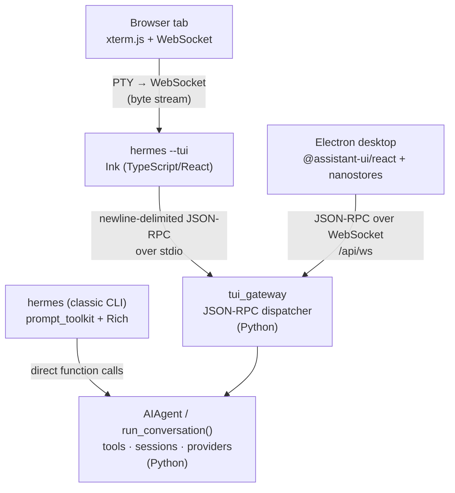
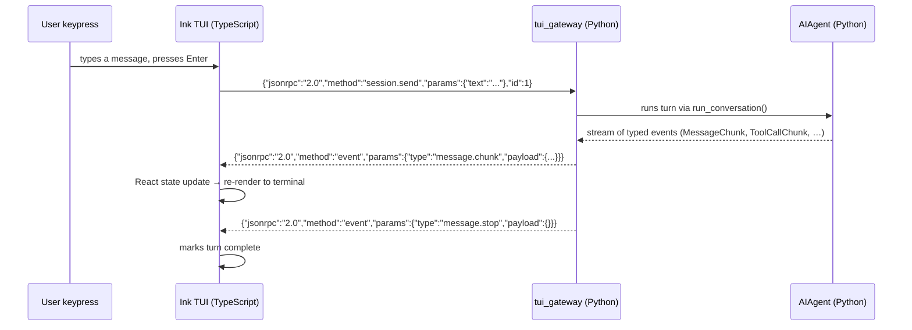
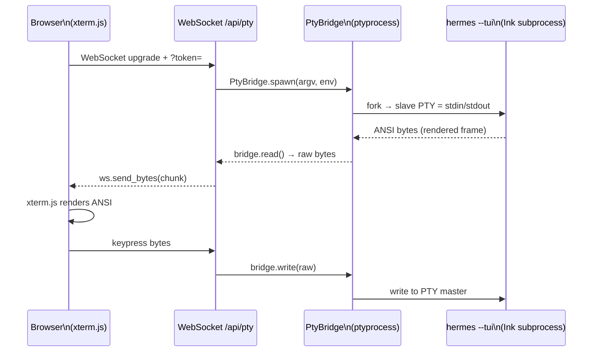
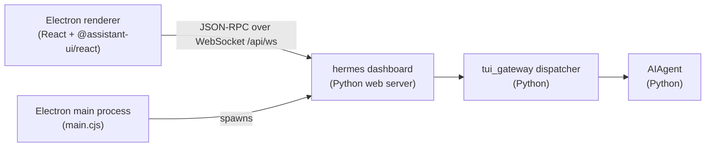

**TL;DR** — Hermes exposes four completely separate front-ends — a classic CLI, an Ink TUI, a web dashboard, and an Electron desktop app — but every one of them drives the same Python agent core. This chapter walks you through how each interface is structured, how it connects to the backend, and what happens when something goes wrong.

# CLI, TUI, Web Dashboard, and Electron Desktop

Imagine you want to talk to Hermes from four different contexts: a bare SSH session on a server, a fancy terminal on your laptop, a browser tab, and a native desktop app. Each context has different constraints — no graphics, rich ANSI, a browser DOM, a native window — yet the agent doing the actual work is identical in all four cases. The architecture solves this by keeping the Python agent core entirely separate from any display layer, and defining a clear boundary between the two.

Before we walk through each interface, let's place them in context.

**What the agent core does** — `AIAgent` runs the conversation loop (`run_conversation()`), calls tools, manages sessions, and streams results as structured events. The canonical explanation of the loop lives in [the AIAgent and conversation loop chapter](../core-runtime/aiagent-and-conversation-loop.md); the short version is: it is a pure Python process that accepts input as text and emits a stream of typed events.

**What the interfaces do** — they translate user gestures (keystrokes, mouse clicks, WebSocket messages) into requests the agent can handle, and they render the streamed events back to the user. None of them contain agent logic.

Here is the full picture before we zoom in:



The CLI is the only interface that calls the agent directly. The three graphical interfaces all go through `tui_gateway`, but they do so in meaningfully different ways — and understanding those differences is what this chapter is about.

---

## The classic CLI: prompt_toolkit + Rich

### The problem it solves

The simplest possible Hermes session is a plain read-eval-print loop: you type, the agent responds, you type again. No Node.js, no browser, nothing to install beyond the Python package. This is what `hermes` (without any flags) gives you.

### What it is

**prompt_toolkit** is a Python library for building interactive command-line applications. It provides features like multi-line editing, history, keyboard shortcuts, syntax highlighting, and completion — the building blocks of a polished REPL. **Rich** is a Python library for terminal styling: it renders tables, panels, progress bars, and coloured text via ANSI escape codes. Together they form the visual layer of the classic CLI.

The class that ties everything together is `HermesCLI` in `cli.py`. It inherits from `CLIAgentSetupMixin` and `CLICommandsMixin`, and it owns the main input loop built on a `prompt_toolkit` session. The `Rich` library handles output — banners, usage tables, status panels — through a `Console` instance.

### Launching and choosing the interface

```bash
# Start the classic CLI
hermes

# Force the classic CLI even if display.interface=tui is set in config
hermes --cli
```

The decision of which interface to launch follows a three-step priority order (from `hermes_cli/main.py`):

1. Explicit `--tui` flag or `HERMES_TUI=1` environment variable → always TUI
2. Explicit `--cli` flag → always CLI
3. `display.interface` config value (`"cli"` or `"tui"`) in `config.yaml`

If none of these is set, the CLI is the default.

### Slash commands

The CLI intercepts lines that start with `/` before sending them to the agent. These are slash commands — in-session operations that do not generate a new agent turn. `HermesCLI` dispatches them through a canonical-name resolver (the `canonical` variable in the dispatch block). The key ones are:

| Command | What it does |
| --- | --- |
| `/new [title]` | Start a fresh session (prompts for confirmation; optional title) |
| `/reset [title]` | Alias for `/new` |
| `/model [name]` | Show current model or switch model for this session |
| `/compress [focus]` | Manually compress conversation context |
| `/skills [subcommand]` | List, view, install, or manage skills |
| `/retry` | Re-send the last user message |
| `/undo [N]` | Remove the last N user turns (default 1) from history |

`/new` and `/undo` both show a confirmation panel before acting — they use `_confirm_destructive_slash()`, which renders a prompt_toolkit-native modal (`_render_confirm_panel()`). You can skip confirmation by appending `now` or `--yes` (e.g. `/reset now`, `/new --yes My Session Title`).

> You might wonder whether `/model` talks to the agent. It does not — it calls `_handle_model_switch()`, which updates session state and triggers a provider switch. The agent picks up the new model on the next turn.

```bash
# In a running hermes session:
/model claude-opus-4
/compress focus on the authentication changes
/undo 2
/new Starting a fresh design discussion
```

<!-- GAP: The exact CLI output format (prompt string, status bar content) for the classic CLI could not be verified from source code comments alone — needed for a precise screenshot-style example; source silent on exact prompt text. -->

---

## The TUI: Ink over JSON-RPC

### The problem it solves

The classic CLI re-renders output by printing lines to stdout. That works, but it cannot do things like maintaining a persistent status bar, rendering a scrollable conversation pane, or showing a tool-call sidebar — all without corrupting the visible scroll-back. Doing this well requires full control of the terminal screen, not just line-by-line output. That is a job for a proper TUI framework.

But here is the constraint: the best terminal UI frameworks are in JavaScript (for the browser-ported ecosystem), while the agent core is Python. Rewriting either is off the table. So the architecture draws a clean boundary:

> **TypeScript owns the screen. Python owns sessions, tools, model calls, and slash command logic.**

### What it is

**Ink** is a React-based library for building interactive terminal UIs in TypeScript. It renders a virtual DOM onto the terminal using ANSI escapes, giving you components, hooks, and reactive state — the full React model — in a terminal window. Hermes's TUI (`ui-tui/`) is an Ink application written in TypeScript/React.

**JSON-RPC** is a lightweight remote procedure call protocol encoded as JSON. In Hermes, the TUI and the Python backend communicate via **newline-delimited JSON-RPC over stdio**: the TypeScript process writes one JSON object per line to the Python process's stdin; the Python process writes one JSON object per line back to the TypeScript process's stdout. Each object is a complete RPC request or response — no framing, no headers, no length prefix, just newlines as delimiters.

The Python side of this link is `tui_gateway/` — a standalone dispatcher that the TUI spawns as a subprocess.

### How the TUI launches

```bash
# Trigger the TUI
hermes --tui

# Or set the environment variable
HERMES_TUI=1 hermes

# Or set it persistently in config.yaml:
# display:
#   interface: tui
```

Under the hood, `hermes_cli/main.py`'s `_launch_tui()` function replaces the current process (`os.execvp`) with the Ink TUI after setting up environment variables like `HERMES_PYTHON_SRC_ROOT` (so the gateway subprocess finds the Python packages) and `HERMES_TUI_ACTIVE_SESSION_FILE` (for session handoff on restart).

The TUI entry point is `ui-tui/src/entry.tsx`. It creates a `GatewayClient` instance (`ui-tui/src/gatewayClient.ts`), calls `gw.start()`, and then passes it to the root `<App>` component rendered by `ink.render(...)`.

### The GatewayClient and the stdio link

`GatewayClient` is the TypeScript class that manages the subprocess connection. When `start()` is called, it spawns the Python gateway subprocess (resolving the Python interpreter from `HERMES_PYTHON` or the virtual environment). It wraps `node:child_process.spawn` and uses `node:readline` to read newline-delimited frames from stdout.

The startup handshake is straightforward:

1. The Python subprocess (`tui_gateway/entry.py`) starts, initialises its dispatcher, and immediately writes a `gateway.ready` event to stdout.
2. `GatewayClient` receives that event and treats the gateway as available.
3. All subsequent traffic flows as JSON-RPC: the TypeScript side sends method calls (e.g. `session.send`, `session.create`) and the Python side sends back responses and event notifications.



### Reactive state with nanostores

The Ink application uses **nanostores** — a tiny reactive state library — to share state between components without a global Redux-style store. You will see stores like `$uiState` (`app/uiStore.ts`), `$turnState` (`app/turnStore.ts`), and `$spawnHistory` (`app/spawnHistoryStore.ts`). Each is a `nanostores` `atom` that components subscribe to via `useStore` from `@nanostores/react`. When the gateway emits an event, the event handler updates the relevant atom, which re-renders only the components that depend on it.

### Transport abstraction

`tui_gateway/transport.py` defines the `Transport` protocol — any object with `write(obj: dict) -> bool` and `close()` methods. The default is `StdioTransport`, which serialises each JSON frame with `json.dumps` + `\n` and writes it to stdout with a mutex (`_stdout_lock`) to avoid interleaving from concurrent worker threads. A `contextvars.ContextVar` (`hermes_gateway_transport`) tracks which transport is active for the current request context, so concurrent handler tasks route to the right peer.

There is also `TeeTransport`, which mirrors every write to a primary transport plus one or more best-effort secondaries. The web dashboard uses this — more on that next.

---

## The web dashboard: PTY bridge + WebSocket + xterm.js

### The problem it solves

Not everyone has a terminal. If you want to reach Hermes from a browser — or expose it as a tab in a richer dashboard UI — you need to translate between the terminal world (ANSI byte streams, resize events) and the browser world (WebSocket messages, DOM elements). That translation layer is the PTY bridge.

**PTY** stands for pseudo-terminal. A PTY is a kernel-provided pair of file descriptors that mimics a real terminal: one end (the master) is held by the parent process; the other end (the slave) is given to the child process as its stdin/stdout/stderr. The child process behaves exactly as if it is connected to a real terminal — it sends and receives ANSI escape codes — but the parent can read and write those bytes programmatically.

**WebSocket** is a full-duplex, persistent connection protocol built on top of HTTP. Once the browser and server complete the HTTP upgrade handshake, both sides can send frames at any time without re-establishing a connection. This makes it well-suited for streaming terminal output.

**xterm.js** is a terminal emulator library for the browser. It parses ANSI escape sequences and renders them in a `<canvas>` (or DOM) element, giving you a fully functional terminal inside a web page. Hermes's web dashboard frontend (`web/src/pages/ChatPage.tsx`) uses xterm.js with a **WebGL renderer** (`@xterm/addon-webgl`) — the WebGL path draws from a GPU texture atlas and is significantly more efficient than the DOM renderer for streaming token output.

### How it works

When you open the dashboard's Chat tab, the browser connects to `/api/pty` (a WebSocket endpoint in `hermes_cli/web_server.py`). The server:

1. Validates the request (auth token, host/origin header, loopback-only peer check — see below).
2. Calls `_resolve_chat_argv()` to build the same `argv` that `hermes --tui` would run.
3. Spawns the Ink TUI inside a PTY using `PtyBridge.spawn(argv, cwd=cwd, env=env)`.
4. Bridges bytes in both directions: PTY master → WebSocket frames (raw bytes), WebSocket frames → PTY master (keystrokes and resize escapes).

The Python library doing the PTY work is **ptyprocess** (`hermes_cli/pty_bridge.py` on POSIX; `hermes_cli/win_pty_bridge.py` using `pywinpty`/ConPTY on Windows). Both expose the same `PtyBridge` interface: `spawn`, `read`, `write`, `resize`, `close`.

Resize events travel as a special escape sequence embedded in the WebSocket byte stream:

```
\x1b[RESIZE:<cols>;<rows>]
```

The `pty_ws` handler strips these with `_RESIZE_RE` and calls `bridge.resize(cols, rows)` — they are never written to the PTY master.



There is also a secondary WebSocket path alongside the PTY byte stream. When `_build_sidecar_url(channel)` returns a URL, the spawned `tui_gateway.entry` connects that URL as `HERMES_TUI_SIDECAR_URL`. This activates a `TeeTransport` in the gateway: every structured event (tool calls, session info) flows to the Ink TUI over stdio **and** to the dashboard's `/api/pub` WebSocket endpoint. The dashboard's React sidebar can then receive structured metadata without parsing ANSI.

### The bind address and security

The web server's `start_server()` function binds to `127.0.0.1` by default (port `9119`). This means only connections from the same machine are accepted — a client on the local network cannot reach it. The PTY WebSocket endpoint (`/api/pty`) reinforces this: `_ws_client_is_allowed()` rejects any peer whose IP is not in `{"127.0.0.1", "::1", "localhost"}` unless the operator has explicitly opted into a non-loopback bind with `--insecure`.

For the full security posture (OS-level isolation, egress filtering, what the approval gate covers), see [OS boundary and isolation postures](../security/os-boundary-and-isolation-postures.md). The short version for the dashboard: do not pass `--host 0.0.0.0` on an untrusted network.

### Launching the dashboard

```bash
# Start the web dashboard (opens browser automatically)
hermes dashboard

# Specify host and port
hermes dashboard --host 127.0.0.1 --port 9119

# Start without opening the browser
hermes dashboard --no-open
```

Navigate to `http://127.0.0.1:9119` and open the Chat tab. The PTY bridge starts when you open that tab — not when the dashboard starts.

---

## The Electron desktop: nanostores + @assistant-ui/react + JSON-RPC over WebSocket

### The problem it solves

A browser tab is useful, but it requires the server to be running and the user to navigate to the right URL. A native desktop app can start the backend automatically, manage its lifecycle, integrate with the OS (system tray, notifications, native menus), and provide a polished, purpose-built UI with no browser chrome.

### How it differs from the web dashboard

This is the most important thing to know about the Electron desktop: **it does not embed `hermes --tui`**. The web dashboard works by piping a TUI's byte output over WebSocket; the Electron desktop skips the TUI entirely. Instead, Electron's main process (`apps/desktop/electron/main.cjs`) spawns `hermes dashboard` — the same web server — and the renderer connects to it over WebSocket at `/api/ws`.



Specifically, `startHermes()` in `main.cjs` builds these args:

```js
// Simplified view of startHermes() local-spawn path
const dashboardArgs = ['dashboard', '--no-open', '--host', '127.0.0.1', '--port', String(port)]
hermesProcess = spawn(backend.command, backend.args, { ... })
```

The renderer then connects to `ws://127.0.0.1:<port>/api/ws?token=<token>`. The `/api/ws` endpoint in `web_server.py` calls `tui_gateway.ws.handle_ws()` — the same `WSTransport` + `dispatch()` path the Ink TUI uses, just over WebSocket instead of stdio.

### The renderer stack

The Electron renderer (`apps/desktop/src/`) is a React application. Its key dependencies are:

- **`@assistant-ui/react`** — a headless React library for building chat UIs. The desktop uses `AssistantRuntimeProvider` and related components (`Thread`, `ComposerPrimitive`) from this package. `HermesGateway` in `src/hermes.ts` extends `JsonRpcGatewayClient` from `@hermes/shared` to provide typed wrappers around every `tui_gateway` JSON-RPC method.
- **`nanostores`** + **`@nanostores/react`** — the same reactive state approach used in the Ink TUI. Store atoms (e.g. in `app/uiStore.ts`, `app/overlayStore.ts`) are updated from gateway events and consumed via `useStore` in React components.
- **`@xterm/xterm`** + **`@xterm/addon-webgl`** — used in the right-sidebar terminal panel. The desktop also renders an xterm.js terminal (with WebGL renderer) for the integrated terminal; this is separate from the chat surface.

### Comparison table

| Interface | Stack | Transport to Python core | Embeds `hermes --tui`? |
| --- | --- | --- | --- |
| Classic CLI | Python: prompt_toolkit + Rich | Direct function calls | N/A |
| Ink TUI | TypeScript + React (Ink) | Newline-delimited JSON-RPC over stdio | Is `hermes --tui` |
| Web dashboard Chat tab | Browser: xterm.js + WebGL | PTY byte stream over WebSocket | Yes (spawned in PTY) |
| Electron desktop | Electron + React + @assistant-ui | JSON-RPC over WebSocket `/api/ws` | No (connects to `hermes dashboard`) |

---

## Worked example: launching each interface

Let's walk through starting a session on all four interfaces in sequence to see the differences in practice.

```bash
# 1. Classic CLI — interactive REPL, prompt_toolkit keyboard handling
hermes

# Inside the REPL:
#   /model claude-opus-4
#   Hello, what can you help me with?
#   /compress
#   /undo
```

```bash
# 2. Ink TUI — full-screen terminal UI with status bars and tool-call sidebar
hermes --tui

# Or via environment variable in a shell script:
HERMES_TUI=1 hermes
```

```bash
# 3. Web dashboard — starts the Python server; open the Chat tab in your browser
hermes dashboard
# → Navigate to http://127.0.0.1:9119 and click the Chat tab
# The PTY bridge starts on first connection
```

```bash
# 4. Electron desktop — the packaged app starts hermes dashboard automatically
# on first launch. No CLI command needed; launch the app from your OS.
# The renderer connects to ws://127.0.0.1:<auto-port>/api/ws
```

### Reading config for profile and home directory

All four interfaces read configuration from `~/.hermes/` (or the path given by `HERMES_HOME`). The `config.yaml` file there controls model defaults, toolsets, and `display.interface`. For a full explanation of how Hermes resolves the home directory and which config keys exist, see [Home directory and profiles](../persistence/home-directory-and-profiles.md).

---

## Edge cases and failure modes

### What happens when the TUI's JSON-RPC link to Python drops

The `GatewayClient` emits an `exit` event when the Python subprocess exits (the subprocess's stdout closes → `readline` returns EOF). The `useMainApp` hook in `ui-tui/src/app/useMainApp.ts` handles this with `planGatewayRecovery()`:

- If a session was active when the gateway exited, the TUI shows `"gateway exited · recovering session…"` in the Activity pane and immediately calls `gw.start()` to respawn the subprocess.
- If recovery is not possible (e.g. the gateway has exited too many times in a short window), the TUI shows `"error: gateway exited"` and stops. The user sees a persistent error message at the top of the screen.

In either case, any in-flight agent reply is lost — the gateway process did not survive to complete the turn. The session itself is preserved in `~/.hermes/state.db`; a fresh session start will resume from the last committed state.

The crash log for gateway exits is written to `~/.hermes/logs/tui_gateway_crash.log` (the `_CRASH_LOG` constant in `tui_gateway/server.py`). If you see repeated "gateway exited" banners, this log is the first place to look.

### The web dashboard's bind address and connection refusals

By default the dashboard binds only to `127.0.0.1`. If the PTY WebSocket upgrade is rejected with close code `4408`, it means the connecting peer's IP is not in the loopback set (`{"127.0.0.1", "::1", "localhost"}`). This can happen if:

- You are trying to reach the dashboard from another machine on the network — this is intentionally blocked.
- A reverse proxy is rewriting the `X-Forwarded-For` header but not the socket-level client IP.

To expose the dashboard on a non-loopback interface, use `hermes dashboard --host 0.0.0.0 --insecure`. Note that `--insecure` is the operator's explicit acknowledgment that the loopback-only restriction is lifted; the host/origin header guard (`_ws_host_origin_is_allowed`) still applies. See [OS boundary and isolation postures](../security/os-boundary-and-isolation-postures.md) for the full threat model.

### The web dashboard on native Windows

On native Windows, the POSIX PTY bridge (`hermes_cli/pty_bridge.py`) cannot be imported. The `/api/pty` endpoint sends a message explaining that the embedded terminal requires a POSIX PTY and closes with code `1011`. To use the Chat tab on Windows, run Hermes inside WSL2. The rest of the dashboard (session history, settings, analytics) works on native Windows.

---

← Previous: [ACP Adapter, IDE Integration, and the Plugin LLM Facade](../extensions/acp-adapter-and-plugin-llm.md) · Next: [Terminal Backends and the Mixture-of-Agents Tool](./terminal-backends-and-moa.md) →
