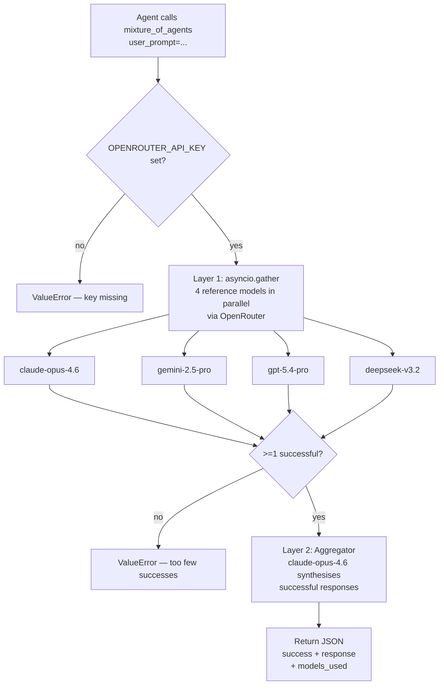

**TL;DR** — Every shell command the agent emits runs inside a *backend* — a concrete implementation of `BaseEnvironment`. Six backends are available (local, Docker, SSH, Singularity, Modal, Daytona), selected via the `TERMINAL_ENV` config key. Docker's `docker_mount_cwd_to_workspace` option is `false` by default for safety. Separately, the `moa` toolset lets the agent query four frontier models in parallel via OpenRouter and synthesise their answers with an aggregator. By the end of this chapter you will know how to pick the right backend for your workload, how the isolation postures differ, and how to call the Mixture-of-Agents tool.

# Terminal Backends and the Mixture-of-Agents Tool

## Part A — Terminal Backends

### The problem: where does a shell command actually run?

When the agent writes `npm install` or `rm -rf /tmp/scratch`, something has to run it. The obvious answer is "your machine" — but that may not always be what you want. Untrusted code, reproducible environments, GPU compute, remote servers — each of these pushes the execution boundary somewhere else.

Hermes solves this with a pluggable *backend* system. Every backend implements `BaseEnvironment` — a common abstract interface that the agent uses to run commands, regardless of whether the process is local, in a container, or on the other side of an SSH connection. Because every backend speaks the same interface, the agent itself does not change when you switch backends.

> **Security context:** backends are the real OS-isolation choice. For a detailed look at the security postures — what counts as a boundary versus a heuristic — see [OS Boundary and Isolation Postures](../security/os-boundary-and-isolation-postures.md).

### What is `BaseEnvironment`?

`BaseEnvironment` (in `tools/environments/base.py`) is an abstract base class that every backend must extend. Its two mandatory abstract methods are:

- `_run_bash(cmd_string, *, login, timeout, stdin_data) → ProcessHandle` — spawn a bash process that runs `cmd_string`.
- `cleanup()` — release the backend's resources (stop a container, close an SSH connection, etc.).

The base class provides the rest: a unified `execute()` method that wraps each command (sources the session snapshot, tracks the working directory, handles timeouts and interrupt signals), a `ProcessHandle` protocol that backends can satisfy with either a real `subprocess.Popen` or a `_ThreadedProcessHandle` adapter (used by cloud SDK backends like Modal and Daytona), and activity callbacks so long-running commands keep the gateway heartbeat alive.

You never call `_run_bash` directly. The agent calls `execute(command, cwd)`, which the base class routes through `_wrap_command` and then hands to whichever backend's `_run_bash` is in scope.

### Selecting a backend: the `TERMINAL_ENV` config key

You select a backend by setting `backend` in the `terminal:` section of `config.yaml` — or equivalently by setting the `TERMINAL_ENV` environment variable. The config key is the canonical way; `TERMINAL_ENV` is the env-var override used by the code at runtime (`terminal_tool.py` reads `os.getenv("TERMINAL_ENV", "local")`).

```yaml
# config.yaml — choose ONE terminal block
terminal:
  backend: "local"        # default — runs on your host
  cwd: "."
  timeout: 180
```

The six valid values are: `local`, `docker`, `ssh`, `singularity`, `modal`, `daytona`.

Below we walk through each backend — what it is, when to use it, and what isolation it provides.

---

### Backend 1 — `local` (default)

**What it is.** `LocalEnvironment` spawns each command as a fresh `bash` subprocess on the host machine. It captures the login-shell environment once at startup (the session snapshot) and re-sources it before each command so environment variables, aliases, and tool paths persist across calls. The working directory is tracked by reading a temp file after each command.

**When to use it.** The default for all interactive CLI and gateway work. You trust the code, you want full access to host tools and credentials, and you do not need a sandbox.

**Isolation level.** None — the process runs with the same privileges as the `hermes` process. From a security standpoint this is the same as running the command yourself in a terminal. The agent has access to your file system, your git config, your SSH agent, and your API keys. Provider credentials are stripped from the subprocess environment (`OPENROUTER_API_KEY`, `ANTHROPIC_API_KEY`, etc. are scrubbed before the env is forwarded), but everything else the agent process can see, `local` can see.

```yaml
terminal:
  backend: "local"
  cwd: "."
  timeout: 180
```

**Edge case — deleted working directory.** If a command deletes its own working directory, `LocalEnvironment._run_bash` detects the missing path via `_resolve_safe_cwd` and falls back to the nearest existing ancestor instead of crashing the next tool call.

---

### Backend 2 — `docker`

**What it is.** `DockerEnvironment` launches a Docker container (via `docker run -d … sleep infinity`) and runs every command with `docker exec`. One long-lived container is shared across commands for the same task — no per-command container overhead.

**When to use it.** Untrusted code, reproducible build environments, testing, or when you want a clean base image that is separate from your host tooling. The container is the isolation boundary.

**Isolation level.** Container-level. The security defaults are meaningful:

- All Linux capabilities are dropped (`--cap-drop ALL`), with only `DAC_OVERRIDE`, `CHOWN`, and `FOWNER` added back.
- `--security-opt no-new-privileges` prevents privilege escalation.
- `--pids-limit 256` limits fork bombs.
- `/tmp` is a `tmpfs` with `nosuid` and a 512 MB size limit.

The container itself is writable so the agent can `pip install` or `apt install` packages as needed.

**`docker_mount_cwd_to_workspace` — off by default.** By default, no directory from your host is bind-mounted into the container. This is intentional: the container cannot read or write your host files. If you want the container to access your project directory, you must explicitly opt in:

```yaml
terminal:
  backend: "docker"
  docker_image: "nikolaik/python-nodejs:python3.11-nodejs20"
  docker_mount_cwd_to_workspace: true   # opt-in: mounts launch cwd into /workspace
  cwd: "/workspace"
  timeout: 180
```

When `docker_mount_cwd_to_workspace` is `false` (the default), the workspace is an ephemeral `tmpfs` — 10 GB, gone when the container stops. When it is `true`, your host launch directory is bind-mounted at `/workspace` inside the container. The config file and the env var `TERMINAL_DOCKER_MOUNT_CWD_TO_WORKSPACE` both control this setting.

**Container persistence.** By default (`container_persistent: true`) the container's filesystem survives across Hermes restarts for the same task. Set `container_persistent: false` for a fully ephemeral container.

```yaml
terminal:
  backend: "docker"
  docker_image: "nikolaik/python-nodejs:python3.11-nodejs20"
  cwd: "/workspace"
  timeout: 180
  container_cpu: 2
  container_memory: 8192   # 8 GB
  container_disk: 20480    # 20 GB (bind-mount or overlay; storage-opt only on XFS with pquota)
```

**Edge case — container removed out-of-band.** If Docker prunes or kills the container while the agent is running, `DockerEnvironment.execute` detects the "No such container" error, calls `_recreate_container`, and retries the command once transparently.

---

### Backend 3 — `ssh`

**What it is.** `SSHEnvironment` runs commands on a remote server over SSH, reusing a `ControlMaster` persistent connection so each command is just a new channel on an existing socket rather than a fresh TCP handshake.

**When to use it.** When you want the agent code to stay on your local machine but the actual side-effects to happen on a remote server — a cloud VM, a dev box with GPUs, or a build server. The agent process never moves; only the bash commands cross the wire.

**Isolation level.** Network boundary plus the remote server's own access controls. Commands run on the remote machine with the permissions of the SSH user. Skills and credential files are synced to the remote `~/.hermes/` directory before each command via a `FileSyncManager` that does incremental tar-over-SSH transfers.

```yaml
terminal:
  backend: "ssh"
  cwd: "/home/myuser/project"
  timeout: 180
  ssh_host: "build-server.example.com"
  ssh_user: "myuser"
  ssh_port: 22
  ssh_key: "~/.ssh/id_rsa"   # omit to use ssh-agent
```

**Edge case — SSH connection failure.** If `_establish_connection` returns a non-zero exit code or times out, the constructor raises a `RuntimeError` immediately with the SSH error text. There is no automatic reconnect during a running session; if the connection drops, commands will fail.

---

### Backend 4 — `singularity`

**What it is.** `SingularityEnvironment` runs commands inside a [Singularity/Apptainer](https://apptainer.org) container. Singularity is the standard container runtime in HPC (high-performance computing) environments where users do not have root, and Docker is typically unavailable.

**When to use it.** Shared compute clusters (university HPC, national supercomputers), environments where Docker is not installed or not permitted, or when you need the specific security model Singularity provides (containers run as the invoking user, not as root).

**Isolation level.** Container-level with `--containall` and `--no-home` (the host home directory is not mounted). Persistent state is stored in a writable overlay directory on the host (`TERMINAL_SANDBOX_DIR/singularity/hermes-overlays/overlay-<task_id>/`). The backend auto-detects whether the `apptainer` or `singularity` CLI is present.

```yaml
terminal:
  backend: "singularity"
  cwd: "/workspace"
  timeout: 180
  singularity_image: "docker://nikolaik/python-nodejs:python3.11-nodejs20"
```

If the image is a `docker://` reference, the backend builds a local `.sif` (Singularity Image Format) file on first use and caches it for subsequent runs.

**Edge case — SIF build failure.** If the one-time `.sif` build fails or times out (600-second limit), the backend falls back to using the `docker://` URL directly. A warning is logged; execution continues.

---

### Backend 5 — `modal` (direct and Nous-managed)

**What it is.** The Modal backend runs commands in [Modal](https://modal.com) cloud sandboxes — serverless, ephemeral containers that can provide GPU access and scale beyond what a single machine offers. There are two sub-modes:

- **`direct`** — uses your own Modal account credentials (`MODAL_TOKEN_ID` + `MODAL_TOKEN_SECRET`) and the Modal Python SDK directly.
- **`managed`** (Nous-managed) — routes through the Nous Tool Gateway using your Nous user token. This mode does not support host credential-file passthrough.

The mode is resolved automatically from `TERMINAL_MODAL_MODE` (`auto` by default). If direct Modal credentials are present, `direct` is used; if only Nous gateway access is configured, `managed` is used.

**When to use it.** GPU-accelerated tasks (model inference, training runs), large-scale computation, or any job that exceeds what your local machine can handle. Cold starts take a few seconds; warm sandboxes reuse a snapshot of the previous filesystem.

**Isolation level.** Full cloud isolation — the sandbox is a separate VM. The filesystem snapshot (if `container_persistent: true`) is stored as a Modal image snapshot that is restored on the next run.

```yaml
terminal:
  backend: "modal"
  cwd: "/root"
  timeout: 180
  modal_image: "nikolaik/python-nodejs:python3.11-nodejs20"
  container_persistent: true
```

**Edge case — snapshot restoration failure.** If the stored filesystem snapshot ID is stale or has been deleted from Modal's infrastructure, `ModalEnvironment` logs a warning and retries with the base image. The stale snapshot reference is removed from `~/.hermes/modal_snapshots.json` so it is not used again.

---

### Backend 6 — `daytona`

**What it is.** `DaytonaEnvironment` runs commands in [Daytona](https://daytona.io) cloud sandboxes — persistent, named workspaces you can resume across sessions.

**When to use it.** Cloud development environments, team-shared workspaces, or situations where you want a persistent cloud sandbox that can be stopped and restarted without losing filesystem state. Requires the `daytona` Python SDK (`pip install daytona`) and `DAYTONA_API_KEY`.

**Isolation level.** Full cloud isolation. Sandboxes are named (`hermes-<task_id>`) so they survive Hermes restarts and can be resumed. Disk is capped at 10 GB per Daytona platform limits.

```yaml
terminal:
  backend: "daytona"
  cwd: "~"
  timeout: 180
  daytona_image: "nikolaik/python-nodejs:python3.11-nodejs20"
  container_disk: 10240   # Daytona maximum
```

**Edge case — stopped sandbox.** Before each command, `_ensure_sandbox_ready` checks the sandbox state. If it is `STOPPED` or `ARCHIVED`, it calls `sandbox.start()` to resume before executing. This means a brief delay after a sandbox has been idle, but commands never fail silently.

---

### Backend comparison at a glance

| Backend | Runs where | Isolation level | Key requirement | When to use |
|---|---|---|---|---|
| `local` | Your host machine | None (host process) | None | Trusted code, full access |
| `docker` | Docker container on host | Container (caps-dropped) | Docker installed | Untrusted code, reproducible env |
| `ssh` | Remote server | Network + SSH user perms | SSH access to server | Remote hardware, isolated code |
| `singularity` | Singularity container | Container (`--containall`) | `apptainer` / `singularity` CLI | HPC clusters, no-Docker envs |
| `modal` | Modal cloud VM | Cloud isolation | Modal credentials or Nous token | GPU tasks, large compute |
| `daytona` | Daytona cloud workspace | Cloud isolation | `daytona` SDK + `DAYTONA_API_KEY` | Persistent cloud dev env |

---

### Architecture: how the agent reaches a backend

```mermaid
flowchart TD
    A[Agent calls execute(command)] --> B[BaseEnvironment.execute()]
    B --> C{TERMINAL_ENV / backend}
    C -->|local| D[LocalEnvironment\nfresh bash subprocess]
    C -->|docker| E[DockerEnvironment\ndocker exec into container]
    C -->|ssh| F[SSHEnvironment\nssh bash -c over ControlMaster]
    C -->|singularity| G[SingularityEnvironment\napptainer exec on instance]
    C -->|modal| H[ModalEnvironment\nModal Sandbox.exec via SDK]
    C -->|daytona| I[DaytonaEnvironment\nDaytona sandbox.process.exec]
    D & E & F & G & H & I --> J[ProcessHandle\nstdout drained, CWD updated]
    J --> K[result dict: output + returncode]
```

### Worked example: switching to Docker for an untrusted task

You receive a task to run a third-party script whose `setup.sh` deletes files in the current directory during installation. You do not want it touching your host. Here is how you would set this up in `config.yaml` (or equivalently in `.env`):

```yaml
# config.yaml
terminal:
  backend: "docker"
  cwd: "/workspace"
  timeout: 300
  docker_image: "ubuntu:24.04"
  docker_mount_cwd_to_workspace: false   # default — keep host files safe
  container_persistent: true
  container_memory: 4096
```

Or using environment variables for a one-off run:

```bash
TERMINAL_ENV=docker \
TERMINAL_DOCKER_IMAGE=ubuntu:24.04 \
TERMINAL_DOCKER_MOUNT_CWD_TO_WORKSPACE=false \
hermes chat
```

Inside this session, every shell command the agent emits runs inside the Ubuntu container. Your host files are not accessible (no bind mount). When the agent runs the untrusted `setup.sh`, the worst it can do is damage the container filesystem — nothing on your host changes.

If you later decide you *do* want to share your project directory with the container (for example, to let the agent build it), you can opt in:

```yaml
  docker_mount_cwd_to_workspace: true
  cwd: "/workspace"
```

Now your launch directory is mounted read-write at `/workspace` inside the container. The security posture you accept is that the container can write to those files.

---

## Part B — The Mixture-of-Agents Tool

### The problem: one model's blind spots

Difficult reasoning problems — proofs, multi-step algorithm design, tasks that genuinely require diverse expertise — can expose the limits of any single model. One model might have a reasoning gap where another excels. You want the best parts of several answers, not a dice roll.

The Mixture-of-Agents (MOA) approach addresses this: ask several models the same question in parallel, then have one model synthesize the best answer from all of them. The synthesis step is what elevates the result beyond any individual response.

### What `mixture_of_agents` does

`mixture_of_agents` (toolset: `moa`, registered as `mixture_of_agents`) is an async tool in `tools/mixture_of_agents_tool.py`. When the agent calls it, here is what happens:

**Layer 1 — parallel reference queries.** Four frontier models are queried simultaneously via [OpenRouter](https://openrouter.ai/) using `asyncio.gather`. Each model runs with `temperature=0.6` to produce diverse responses. The default reference models are:

- `anthropic/claude-opus-4.6`
- `google/gemini-2.5-pro`
- `openai/gpt-5.4-pro`
- `deepseek/deepseek-v3.2`

Each model call requests reasoning effort `xhigh` and up to 32,000 tokens. If a model call fails, it retries up to six times with exponential backoff (2 s → 4 s → 8 s → … → 60 s).

**Layer 2 — aggregation.** The successful responses are assembled into a system prompt (`AGGREGATOR_SYSTEM_PROMPT` from the research paper) and sent to the aggregator model (`anthropic/claude-opus-4.6`, `temperature=0.4`). The aggregator synthesises the best elements into a single coherent answer.

**Output.** The tool returns a JSON string:

```json
{
  "success": true,
  "response": "…synthesised final answer…",
  "models_used": {
    "reference_models": ["anthropic/claude-opus-4.6", "…"],
    "aggregator_model": "anthropic/claude-opus-4.6"
  }
}
```

If the call fails entirely, `success` is `false` and `response` is a fallback message.

### When to use it — and its cost

MOA makes **5 API calls** (4 reference models + 1 aggregator), each requesting maximum reasoning effort. This means:

- **Higher cost** — roughly 5× the token cost of a single call, plus additional reasoning tokens.
- **Higher latency** — several seconds to tens of seconds for all parallel calls to complete, plus aggregation time.
- **Significantly better quality** on genuinely hard problems: complex mathematical reasoning, advanced algorithm design, multi-step analytical tasks, or anything where diverse model perspectives help.

Use it sparingly, on problems that actually need it. For routine tasks, a single-model call is faster and cheaper.

The tool's registration schema describes this directly:

> "Route a hard problem through multiple frontier LLMs collaboratively. Makes 5 API calls (4 reference models + 1 aggregator) with maximum reasoning effort — use sparingly for genuinely difficult problems."

### Requirement: `OPENROUTER_API_KEY`

All five API calls go through OpenRouter. You must have `OPENROUTER_API_KEY` set in your environment or `~/.hermes/.env`. If the key is absent, the tool raises a `ValueError` immediately rather than wasting time on partial calls.

```bash
# .env or shell
OPENROUTER_API_KEY=sk-or-v1-…
```

The `moa` toolset is enabled in the `safe` preset (which has no terminal access) as well as any custom toolset that includes it.

### Architecture: MOA flow



### Edge cases for MOA

**One or more reference models fail.** Each model retries up to six times with exponential backoff. If it still fails, that model is recorded in `failed_models` and excluded from the aggregator prompt. The aggregation proceeds as long as at least one reference model succeeds (`MIN_SUCCESSFUL_REFERENCES = 1`). You do not lose the whole result because one provider rate-limits you.

**All reference models fail.** If the number of successful responses falls below `MIN_SUCCESSFUL_REFERENCES` (1), the tool raises `ValueError("Insufficient successful reference models…")` and the outer `except` block returns `success: false`.

**The aggregator returns empty content.** The aggregator retries once on an empty response (which can happen when a reasoning-heavy model produces only a chain-of-thought). If the second attempt is also empty, `extract_content_or_reasoning` returns whatever reasoning tokens were produced.

### Worked example: calling `mixture_of_agents`

Suppose the agent is asked to prove the time complexity of a particular dynamic programming recurrence. A single model might produce a plausible but incomplete argument. Here is how the agent would invoke MOA:

```python
# Simplified view of how the agent calls the tool
result_json = await mixture_of_agents_tool(
    user_prompt=(
        "Prove that the edit-distance recurrence T(m, n) = min("
        "T(m-1, n)+1, T(m, n-1)+1, T(m-1, n-1)+[s1[m]!=s2[n]])"
        " has O(m*n) time complexity, and derive a tight lower bound."
    )
)
result = json.loads(result_json)
if result["success"]:
    print(result["response"])
```

Or equivalently, in a config that enables the `moa` toolset and then runs a session:

```yaml
# cli-config.yaml.example
toolsets:
  cli: [web, file, moa]    # include moa alongside other toolsets
```

```bash
hermes chat
# Inside the session:
# > Use mixture_of_agents to work through the DP complexity proof.
```

The agent will emit a `mixture_of_agents` tool call, the four reference queries fire in parallel, and the aggregator synthesises the final answer — all within the same conversation turn.

---

← Previous: [CLI, TUI, Web Dashboard, and Electron Desktop](./cli-tui-and-web-dashboard.md) · Next: [Observability — Log Files, Observer Events, and Bundled Consumers](../observability/logs-hooks-and-plugins.md) →
