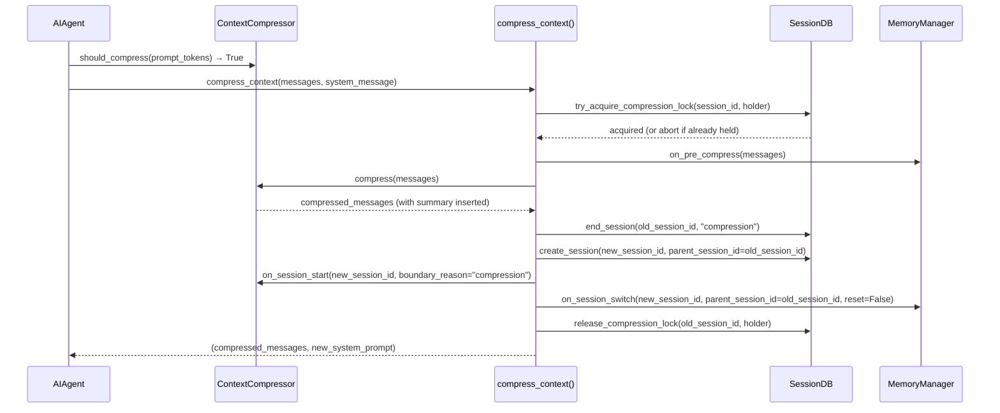

**TL;DR** — Every long-running Hermes conversation will eventually fill the model's context window. `ContextCompressor` handles this by summarizing the middle of the transcript and — critically — splitting the SQLite session record so the full history survives as a linked chain of sessions joined by `parent_session_id`. When a pluggable LCM context engine is active, the agent also gains three tools (`lcm_grep`, `lcm_describe`, `lcm_expand`) to search and re-hydrate compressed history on demand. By the end of this chapter you will understand when compression fires, how session chaining preserves history, and what happens when two agents race to compress the same session.

# ContextCompressor and the LCM Context Engine

## The problem: a conversation that never forgets costs more and more

Every message we send to an LLM — and every tool result that comes back — lands in a message list that grows without bound. Most LLM providers charge per token and, more importantly, reject requests once the token count exceeds the model's **context window** (the hard upper limit on how much text the model can read at once).

We need a way to keep the live window small without losing the thread of what the agent was doing. Throwing away old messages is cheap but lossy — the agent forgets important decisions, file paths, and user preferences. What we want is something smarter: compress the unneeded parts down to an informative summary, keep the recent tail verbatim, and make the compressed history retrievable on demand.

That is exactly what `ContextCompressor` does, and it is **layer 2** in Hermes's five-layer memory stack. (Layer 1 is `MEMORY.md`/`USER.md` persistent note files — if you haven't read that yet, a quick orientation: those files hold durable facts the agent writes across sessions. See [The Five Memory Layers](./five-memory-layers.md) for the full picture before diving in here.)

## What ContextCompressor is

`ContextCompressor` (defined in `agent/context_compressor.py`) is the default **context engine** — the component responsible for deciding when the message list is too long and what to do about it.

It subclasses `ContextEngine`, an abstract base class in `agent/context_engine.py` that defines the contract every context engine must satisfy: track token usage, decide when to compress, perform compression, and optionally expose tools to the agent.

```python
# Simplified view of the ContextEngine contract (agent/context_engine.py)
class ContextEngine(ABC):
    last_prompt_tokens: int = 0
    threshold_tokens: int = 0
    context_length: int = 0
    compression_count: int = 0

    @abstractmethod
    def update_from_response(self, usage: dict) -> None: ...

    @abstractmethod
    def should_compress(self, prompt_tokens: int = None) -> bool: ...

    @abstractmethod
    def compress(self, messages: list, ...) -> list: ...

    def get_tool_schemas(self) -> list:
        # Default: no tools. LCM overrides to return lcm_grep,
        # lcm_describe, lcm_expand schemas.
        return []

    def handle_tool_call(self, name: str, args: dict, **kwargs) -> str: ...
```

`ContextCompressor` fills in those abstract methods. The agent calls `should_compress()` after every turn; when it returns `True`, the agent calls `compress_context()` in `agent/conversation_compression.py`, which delegates to `context_compressor.compress()` and then handles the session-split bookkeeping.

## When does compression fire?

The trigger is token count, not message count. After each LLM API call, the response includes a usage object (`prompt_tokens`, `completion_tokens`). `ContextCompressor.update_from_response()` records those. On the next turn, `should_compress()` compares the stored `last_prompt_tokens` against `threshold_tokens`:

```python
# From ContextCompressor.should_compress() — agent/context_compressor.py
def should_compress(self, prompt_tokens: int = None) -> bool:
    tokens = prompt_tokens if prompt_tokens is not None else self.last_prompt_tokens
    if tokens < self.threshold_tokens:
        return False
    # Anti-thrashing: skip if last two compressions each saved <10%
    if self._ineffective_compression_count >= 2:
        return False
    return True
```

`threshold_tokens` is derived from `threshold_percent × context_length`. The default `threshold_percent` is `0.50` (50% of the model's context window), matching the `cli-config.yaml` default:

```yaml
# cli-config.yaml (compression section)
compression:
  enabled: true
  threshold: 0.50       # fire at 50% of context_length
  target_ratio: 0.20    # keep last 20% of threshold as verbatim tail
  protect_last_n: 20    # always protect the 20 most-recent messages
  protect_first_n: 3    # protect system prompt + first 3 non-system messages
```

For a 200K-token model that means compression fires at ~100K tokens. The **tail** that is preserved verbatim scales with the model: `target_ratio × threshold × context_length` = `0.20 × 0.50 × 200K` = 20K tokens of recent conversation always survive untouched.

The anti-thrashing guard (`_ineffective_compression_count >= 2`) prevents an infinite loop: if two consecutive compressions each save less than 10% of tokens, something structural is preventing progress and the agent stops retrying automatically.

## How compression works: the five-phase algorithm

When `should_compress()` returns `True`, the `compress()` method runs five phases:

| Phase | What happens | LLM call? |
|-------|-------------|-----------|
| 1. Prune old tool results | Replace old tool outputs with 1-line summaries; deduplicate repeated reads | No |
| 2. Determine boundaries | Protect head (system prompt + first N) and tail (token-budget-sized window) | No |
| 3. Generate summary | Summarize the middle region with a structured template | Yes (auxiliary model) |
| 4. Assemble output | Head + summary message + tail; sanitize orphaned tool-call pairs | No |
| 5. Session split | Rotate `session_id`, create new DB row with `parent_session_id` link | No (DB write) |

The summary uses a **structured template** with sections like `## Active Task`, `## Completed Actions`, `## Remaining Work`, and `## Relevant Files`. On subsequent compressions, `ContextCompressor` passes the previous summary back to the auxiliary model for an **iterative update** rather than summarizing from scratch — preserving accumulated context across multiple compaction rounds.

```python
# Illustrative flow inside compress() — agent/context_compressor.py
def compress(self, messages, current_tokens=None, focus_topic=None, force=False):
    # Phase 1: cheap pre-pass
    messages, pruned_count = self._prune_old_tool_results(
        messages, protect_tail_count=self.protect_last_n,
        protect_tail_tokens=self.tail_token_budget,
    )

    # Phase 2: boundaries
    compress_start = self._protect_head_size(messages)  # system + first N
    compress_end = self._find_tail_cut_by_tokens(messages, compress_start)

    turns_to_summarize = messages[compress_start:compress_end]

    # Phase 3: LLM summary (uses auxiliary model if configured)
    summary = self._generate_summary(turns_to_summarize, focus_topic=focus_topic)

    # Phase 4: reassemble
    compressed = head_messages + [{"role": "user", "content": summary}] + tail_messages
    compressed = self._sanitize_tool_pairs(compressed)  # fix orphaned IDs

    self.compression_count += 1
    return compressed
    # Phase 5: session split happens in compress_context() (conversation_compression.py)
```

Notice that the summary is inserted as a real message (with a role of `"user"` or `"assistant"` depending on what the adjacent messages need for valid alternation). The summary message starts with a long preamble — `SUMMARY_PREFIX` — that tells the model this is a handoff reference, not an active instruction. This prevents the model from re-executing tasks that were already completed before compression.

## The LCM context engine and its three tools

`ContextCompressor` is the *default* engine; a pluggable **LCM (Latent Context Model) engine** is an alternative you can activate by setting `context.engine` in `config.yaml` and placing (or installing) the engine under `plugins/context_engine/<name>/`. When an LCM engine is active, it builds a richer internal representation of conversation history — a DAG rather than a flat summary — and exposes **three tools** the agent can call during a conversation:

| Tool | Purpose |
|------|---------|
| `lcm_grep` | Search compressed conversation history by keyword or pattern |
| `lcm_describe` | Produce a natural-language description of a historical region |
| `lcm_expand` | Re-hydrate a compressed region with full detail |

These tools are declared in `ContextEngine.get_tool_schemas()` and injected into the agent's tool surface at startup by `agent/agent_init.py`:

```python
# agent/agent_init.py (simplified, ~line 1555)
# Inject context engine tool schemas (e.g. lcm_grep, lcm_describe, lcm_expand)
agent._context_engine_tool_names: set = set()
# ... toolset gating checks ...
for _schema in agent.context_compressor.get_tool_schemas():
    _tname = _schema.get("function", {}).get("name", "")
    agent.tools.append(_schema)
    agent._context_engine_tool_names.add(_tname)
```

The base `ContextCompressor` returns an empty list from `get_tool_schemas()` — it never exposes `lcm_*` tools. Only an LCM engine implementation does. Tool calls whose names are in `agent._context_engine_tool_names` are routed to `context_compressor.handle_tool_call()` rather than the normal tool executor.

### A worked example: recovering a fact with lcm_grep

Imagine we are ten hours into a coding session. The agent compressed the context three times. Somewhere in session 1 (now two sessions back) we decided on a specific API rate limit. We need that number again.

With a plain `ContextCompressor`, the agent can only see what survived in the current compressed summary — the number may not be there. With an LCM engine and `lcm_grep`:

```
User: What was the rate limit we decided on for the external webhook calls?

Agent calls: lcm_grep
  args: {"query": "rate limit webhook", "session_scope": "lineage"}

lcm_grep returns:
  {
    "matches": [
      {
        "session_id": "20260601_143022_a3f9b1",
        "turn": 47,
        "snippet": "We agreed: max 5 requests/second per tenant, with a 60s backoff on 429s.",
        "confidence": 0.91
      }
    ]
  }

Agent: "We set it at 5 req/s per tenant, with a 60-second backoff on rate-limit responses."
```

If we want the full surrounding context, we follow up with `lcm_expand` pointing at that turn; if we want a summary of everything in that region, `lcm_describe` gives a prose overview.

The key insight is that **compression does not mean loss** when an LCM engine is present. The agent can compress aggressively to fit the live window, then query the compressed lineage on demand.

## Session splitting: how the history chain stays intact

Here is the deeper design question: where does the pre-compression conversation go? When the agent compresses, it does not discard the old messages — it ends the current SQLite session and starts a new one, linking them with `parent_session_id`.

This all happens in `compress_context()` in `agent/conversation_compression.py`:

```python
# agent/conversation_compression.py, ~line 501 onward (simplified)
if agent._session_db:
    # End the current session, marking it as ended by "compression"
    agent._session_db.end_session(agent.session_id, "compression")
    old_session_id = agent.session_id

    # Rotate to a new session ID (timestamp + short UUID suffix)
    agent.session_id = f"{datetime.now().strftime('%Y%m%d_%H%M%S')}_{uuid.uuid4().hex[:6]}"

    # Create the new session row, pointing back to the old one
    agent._session_db.create_session(
        session_id=agent.session_id,
        source=agent.platform or "cli",
        model=agent.model,
        parent_session_id=old_session_id,   # <-- the chain link
    )
```

The result is a linked list of sessions in the `SessionDB` SQLite database. Each row in the `sessions` table has a `parent_session_id` foreign key pointing to the previous row. A long-running agent with three compressions produces:

```
session_20260601_100000_abc123   (original, ended: "compression")
    ↓ parent_session_id
session_20260601_140000_def456   (first continuation, ended: "compression")
    ↓ parent_session_id
session_20260601_180000_ghi789   (second continuation, ended: "compression")
    ↓ parent_session_id
session_20260601_220000_jkl012   (current live session)
```

The database schema enforces this with a foreign key and an index:

```sql
-- hermes_state.py, ~line 447 and 512
parent_session_id TEXT,
FOREIGN KEY (parent_session_id) REFERENCES sessions(id)

CREATE INDEX IF NOT EXISTS idx_sessions_parent ON sessions(parent_session_id);
```

### Why this matters for search

`SessionDB` supports FTS5 full-text search across all sessions. When the agent searches its past conversations (a capability used by the learning loop), that search spans the entire lineage — not only the current session. The compressed sessions are still there, fully indexed, and their content is still searchable. The `parent_session_id` chain is how `SessionDB` can reconstruct a conversation's lineage and title-number continuation sessions automatically (session 1, session #2, session #3, etc.).

The memory manager is notified of the rotation via `on_session_switch()` so any per-session state in external memory providers (like Hindsight's document ID) refreshes with the new session, while `reset=False` signals that the *conversation* is continuing — only the DB row rolled over.

```
sequenceDiagram
```

Here is the full sequence for a single compression event:



## Edge cases

### The 300-second compression-lock TTL

Two `AIAgent` instances can share the same `session_id` — this happens when a background review process forks from the main agent (see `agent/background_review.py`). If both instances simultaneously reach the compression threshold, both will call `compress_context()`. Without coordination, both would rotate `session_id`, both would create child sessions parented to the same old ID, and one of those children would become an orphan silently accumulating writes.

The **compression lock** prevents this. `SessionDB.try_acquire_compression_lock()` is an atomic SQLite write keyed on the current `session_id`. The lock has a **300-second TTL** — if the holder crashes mid-compression, the lock expires automatically and the next caller can take over rather than blocking forever:

```python
# hermes_state.py, line 1271 (default parameter)
def try_acquire_compression_lock(
    self,
    session_id: str,
    holder: str,
    ttl_seconds: float = 300.0,   # <-- 300s expiry
) -> bool:
    ...
```

When `try_acquire_compression_lock()` returns `False`, `compress_context()` returns the messages unchanged and logs a warning. The caller's auto-compress loop sees `len(returned) == len(input)` and knows compression was skipped this cycle — it will try again on the next turn.

The lock is released on the **old** session ID (before rotation) only after all post-rotation bookkeeping completes. This guarantees a concurrent path that wakes up the moment the lock releases will already see the new session ID in the database and will acquire its own lock on the new ID, not race against the recently finished work.

If the lock subsystem itself is unavailable (for example, a version-skew scenario where the in-memory module is older than the DB schema), `compress_context()` logs a warning and **fails open** — it proceeds without a lock rather than spinning forever in an unresolvable error loop.

### What happens when overflow occurs during compression

If the auxiliary LLM summarizer fails (provider down, no API key configured, timeout), `ContextCompressor._generate_summary()` returns `None`. There are two configured paths:

| `compression.abort_on_summary_failure` | Behavior |
|---------------------------------------|----------|
| `false` (default) | Insert a deterministic fallback summary (locally-extracted continuity anchors, no LLM call), drop the middle window, continue. The fallback surfaces tool names, recent user asks, and file paths without requiring a live LLM. |
| `true` | Abort compression entirely. Return messages unchanged, set `_last_compress_aborted = True`. The conversation is frozen at its current size until the user runs `/compress` or `/new`. |

Failed summary attempts enter a **cooldown period** — 600 seconds when there is no provider at all, 30–60 seconds for transient errors — so the agent does not hammer a broken provider every turn. The cooldown value `_SUMMARY_FAILURE_COOLDOWN_SECONDS = 600` is defined in `agent/context_compressor.py`. The `/compress` slash command bypasses the cooldown (`force=True`) so users can retry immediately without waiting.

When a configured auxiliary model fails but the main model is available, `ContextCompressor` transparently falls back to the main model and records the failure so users see a warning (their `auxiliary.compression.model` config is broken) even though compression succeeded.

## Connecting to the learning loop

Session chaining feeds directly into Hermes's learning loop. Each compressed session remains fully indexed in `SessionDB`'s FTS5 search. When the agent later searches its past conversations — for example, to recall a decision made weeks ago — that search spans the entire `parent_session_id` lineage. Nothing is lost; it is archived into a searchable past rather than kept live in the context window.

This is the design intent: compress aggressively to keep the active window small, preserve everything in the session graph, and retrieve on demand — either via `SessionDB` search in the learning loop or via `lcm_grep`/`lcm_expand` tools when an LCM engine is configured.

The next layer up — `MemoryManager`, external memory providers, and the nudge-to-persist loop — builds on this infrastructure by deciding which facts from a compressed session are worth extracting into persistent long-term storage. We will cover that in the next chapter.

---

← Previous: [The Five Memory Layers](./five-memory-layers.md) · Next: [MemoryManager, External Memory Providers, and the Nudge-to-Persist Loop](./memory-manager-and-external-providers.md) →
