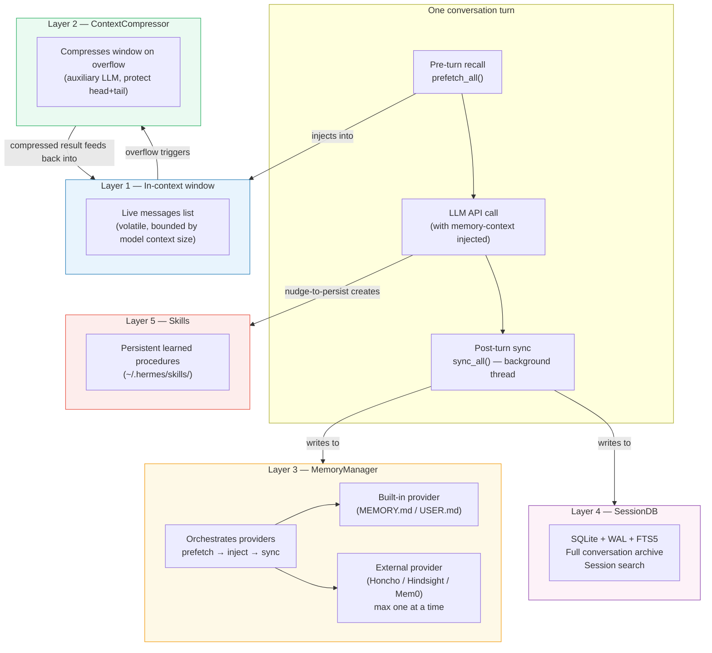
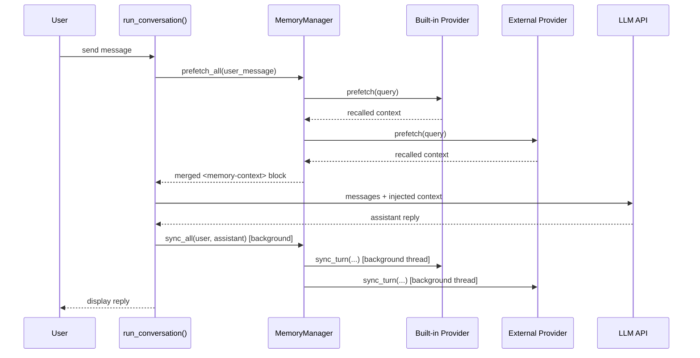

**TL;DR** — An LLM on its own forgets everything the moment a conversation ends, and even within a
conversation it can only hold so many tokens at once. Hermes solves both problems through five
named, concrete memory layers — each with its own scope, persistence boundary, and retrieval path.
After reading this chapter you will be able to name all five layers, explain what each one stores,
describe how recall flows into a turn and how writes flow out, and connect the whole architecture
to Hermes's learning loop.

# The Five Memory Layers — In-Context, Compressor, Manager, SessionDB, Skills

## Why memory is harder than it looks

Let's start by feeling the problem. When you send a message to a large language model (LLM — an AI
system trained to understand and generate text), the model processes every word you give it in one
go. It has no state between calls: when the API call returns, the model has no memory of what just
happened. The next call starts fresh.

That creates two distinct problems Hermes has to solve:

1. **Within a conversation** — the model's context window (the maximum number of tokens, or roughly
   word-fragments, it can read at once) is finite. A long conversation eventually runs out of room.

2. **Across conversations** — even if a conversation fits perfectly in the window, nothing carries
   over to the next session unless something explicitly saves it.

A common shorthand you might have read elsewhere is "short-term memory, long-term memory, and
workspace memory." That taxonomy does not describe Hermes. **Hermes does not use that model.** The
actual architecture maps to five concrete, named subsystems with specific persistence boundaries. We
will use the real names throughout.

## The correct taxonomy: five named layers

Here is the full picture before we build it piece by piece:



Now let's examine each layer: what it stores, how it persists, how the agent recalls from it, and
how it fits into the learning loop.

---

## Layer 1 — The In-Context Conversation Window

### The problem this layer solves

Every LLM call takes a list of messages — the conversation so far — as input. That list is what
the model can "see." It is the most immediate form of memory: while the messages are in the list,
the model can reference them. When a turn completes or the list grows too large, older entries are
either kept (expensive, until the window fills), compressed (Layer 2), or gone.

### What it is

The in-context window is the live `messages` list that `run_conversation()` — the main loop inside
`AIAgent` — builds up over the course of a session. Each user message, each assistant reply, and
each tool call and result is appended as a new entry. Between turns, that list is the full
"working memory" of the conversation.

| Property | Value |
|---|---|
| **What it stores** | All messages in the current session (user, assistant, tool calls, results) |
| **Persists across turns?** | Yes — within the same session |
| **Persists across sessions?** | No — restarting resets the list (SessionDB re-loads it on `/resume`) |
| **How the model accesses it** | Directly — the list is passed verbatim to the LLM API |
| **Bounded by** | The active model's context length (varies by provider) |

### Why it overflows — and what happens next

Because the context window is finite, a long conversation will eventually exceed the model's token
limit. That is exactly the problem Layer 2 exists to solve. The `ContextCompressor` (the default
context engine) fires when the window approaches 75% of the model's context length, compresses the
middle portion of the conversation into a structured summary, and returns a shorter message list.
We will see exactly how in [ContextCompressor and the LCM Context Engine](./context-compressor-and-lcm.md).

> **Edge case — compression-triggered session split:** When `ContextCompressor` fires, a new
> `session_id` is created and a `parent_session_id` chain links the two sessions together.
> A compression lock with a 300-second (5-minute) TTL prevents two concurrent compressor
> instances from racing against the same conversation. You will see the full chain mechanics
> in [Persistence and State](../persistence/compression-chains-and-wal-fallback.md).

---

## Layer 2 — The ContextCompressor (and the LCM Context Engine)

### The problem this layer solves

Once a conversation grows past the model's context threshold, we cannot keep adding messages. But
we also cannot delete the old ones outright — the agent needs to remember what was decided, what
files were modified, and what tasks remain open. We need a way to shrink the list while preserving
the meaning.

### What it is

The `ContextCompressor` — defined in `agent/context_compressor.py` and extending the abstract
`ContextEngine` base class in `agent/context_engine.py` — is the default context engine.

A **context engine** (the `ContextEngine` abstract base class in `agent/context_engine.py`) is
responsible for:

- Deciding when compaction should fire (`should_compress()`)
- Performing the compaction (`compress()`)
- Optionally exposing tools the agent can call (e.g. `lcm_grep`, `lcm_describe`, `lcm_expand`
  from an LCM-based engine)
- Tracking token usage from API responses

The engine is configured via `context.engine` in `config.yaml`; the default value is
`"compressor"` (the built-in `ContextCompressor`). Only one engine is active at a time.

The `ContextCompressor` algorithm:

1. **Tool-result pruning (no LLM call)** — old, bulky tool results are replaced with a
   placeholder `[Old tool output cleared to save context space]` before the LLM summarizer runs.
2. **Head and tail protection** — the system prompt and the first `protect_first_n` (default 3)
   non-system messages are always kept verbatim, as are the most recent messages up to a token
   budget (`protect_last_n`, default 6).
3. **LLM summarization** — the middle portion is summarized by an auxiliary (cheap/fast) model
   into a structured template with sections for resolved work, pending questions, active task, and
   remaining work.
4. **Iterative update** — on subsequent compactions, the previous summary is updated rather than
   replaced, preserving information across multiple compression events.

The summary is prepended with a `SUMMARY_PREFIX` that instructs the model to treat the summary as
background reference only, not as active instructions — so the latest user message always wins.

| Property | Value |
|---|---|
| **What it stores** | A structured summary replacing compressed middle turns |
| **Persists across turns?** | Yes — the summary lives in the message list |
| **Persists across sessions?** | Via the session-split chain (`parent_session_id`) |
| **How the model accesses it** | Directly — the summary is a regular message in the list |
| **Triggered when** | Token usage reaches ~75% of model context length (`threshold_percent`) |

For the full compression walkthrough, see
[ContextCompressor and the LCM Context Engine](./context-compressor-and-lcm.md).

---

## Layer 3 — The MemoryManager

### The problem this layer solves

The in-context window and the compressor together handle the *within-session* memory problem. But
they cannot cross a session boundary — when you start a new conversation, the message list is
empty. Hermes needs a mechanism to recall relevant facts from *previous* sessions and inject them
into the current turn before the LLM call.

That is `MemoryManager`'s job.

### What it is

`MemoryManager` (defined in `agent/memory_manager.py`) is the single orchestrator for memory
providers. A **memory provider** is a class that implements the `MemoryProvider` abstract base
class (in `agent/memory_provider.py`) — it knows how to recall context from some storage backend
and how to persist new knowledge there.

`MemoryManager` enforces two rules:

1. **The built-in provider is always present.** The built-in provider manages files like
   `MEMORY.md` (facts the agent should always remember) and `USER.md` (a model of who the user is)
   directly in the agent's home directory.
2. **Only one external provider runs at a time.** External providers (Honcho, Hindsight, Mem0, and
   others shipped in `plugins/memory/`) are registered via the `memory.provider` key in
   `config.yaml`. If you attempt to register a second external provider, the manager rejects it
   with a warning. This limit prevents tool schema bloat and conflicting backends.

### The pre-turn / post-turn flow

Here is the key pattern. Every conversation turn has two memory hooks wired into
`run_conversation()`:

**Pre-turn (`prefetch_all`)** — called before the LLM API call, with the incoming user message as
the query. Each registered provider's `prefetch()` method is called; results are merged and wrapped
in a `<memory-context>` fence block, then injected into the message the LLM will see. The model
reads recalled facts as authoritative reference data alongside the user's message.

**Post-turn (`sync_all`)** — called after the LLM reply is complete. Each provider's `sync_turn()`
method is called with the user and assistant content from the turn just completed. Crucially,
`sync_all()` runs on **a background thread** (a single-worker `ThreadPoolExecutor` named
`mem-sync`). A slow or blocked provider — the `memory_manager.py` source notes an observed case
of a misconfigured provider blocking for 298 seconds — must never stall the conversation loop.
The background worker serialises writes so turn N lands before turn N+1 for ordering correctness.

```python
# Simplified view of the MemoryManager usage pattern in run_agent.py
memory_manager = MemoryManager()
memory_manager.add_provider(plugin_provider)  # one external provider max

# Pre-turn: collect recalled context
recalled_context = memory_manager.prefetch_all(user_message)
# → injected as <memory-context>...</memory-context> in the prompt

# Post-turn: persist the completed turn (runs off-thread)
memory_manager.sync_all(user_msg, assistant_response)
memory_manager.queue_prefetch_all(user_msg)  # pre-warms recall for the next turn
```

The `<memory-context>` tags are stripped from any text visible to the user via a
`StreamingContextScrubber` — the model sees the recalled facts, but they do not appear in the
chat interface.



| Property | Value |
|---|---|
| **What it stores** | Provider-specific: facts, user model, embeddings, structured history |
| **Persists across turns?** | Yes |
| **Persists across sessions?** | Yes — providers persist to their backends |
| **How recalled** | `prefetch_all()` → `<memory-context>` block injected pre-turn |
| **When synced** | Post-turn via `sync_all()` on a background thread |

For the full provider walkthrough, see
[MemoryManager and External Providers](./memory-manager-and-external-providers.md).

---

## Layer 4 — SessionDB

### The problem this layer solves

The `MemoryManager` handles semantic recall — "what should the agent remember about this user?" —
but it does not store the complete raw transcript of every conversation. For operations like
`/resume` (picking up where you left off), `/history` (browsing past sessions), and session search
("find the conversation where we set up the SSH tunnel"), Hermes needs a durable, searchable
archive of every message ever exchanged.

That is `SessionDB`.

### What it is

`SessionDB` (defined in `hermes_state.py`, starting at line 583) is a SQLite database stored at
`~/.hermes/state.db` (or `%LOCALAPPDATA%\hermes\state.db` on Windows). It holds the full
conversation archive: session metadata, every message, and model configuration.

Key design decisions embedded in the source:

- **WAL mode** — SQLite's Write-Ahead Logging mode allows one writer and multiple concurrent
  readers at the same time. This is important for gateway deployments where the Telegram adapter,
  the Discord adapter, and a CLI session might all read session data simultaneously. WAL
  (Write-Ahead Log) works by writing changes to a separate log file first; readers see a stable
  snapshot while the log is being merged.

- **WAL fallback on NFS/SMB/FUSE** — WAL requires memory-mapped shared files and byte-range
  locks that do not work on network filesystems. The `apply_wal_with_fallback()` function (defined
  in `hermes_state.py:157`) detects the `"locking protocol"` error SQLite raises on those
  filesystems and falls back to `journal_mode=DELETE` — the pre-WAL default. Concurrency drops
  (readers are blocked during a write), but the database keeps working. One warning is logged per
  process per database file to avoid filling the error log.

- **FTS5 full-text search** — Two virtual tables, `messages_fts` (word-boundary search) and
  `messages_fts_trigram` (substring/partial-word search via trigrams), are maintained in sync with
  the `messages` table through SQLite triggers. This is what powers `/history` and session search
  across all stored messages.

- **Schema version** — `SCHEMA_VERSION = 15` is declared at line 36. The schema evolves
  declaratively: new columns are added to `SCHEMA_SQL` and the startup reconciler adds them to the
  live tables automatically, without version-gated migration scripts.

- **Write contention handling** — Multiple Hermes processes (a gateway, a CLI session, a
  background worker) can share one `state.db`. The `SessionDB` implementation uses
  `BEGIN IMMEDIATE` transactions with random-jitter retry (20–150ms, up to 15 attempts) to avoid
  the "convoy" effect that SQLite's built-in deterministic busy handler creates.

| Property | Value |
|---|---|
| **What it stores** | Full message transcripts, session metadata, model config |
| **Persists across turns?** | Yes |
| **Persists across sessions?** | Yes — durable SQLite on disk |
| **How recalled** | FTS5 full-text search; `/resume` reloads the message list |
| **Schema version** | 15 |

> **Edge case — WAL fallback:** If `state.db` is stored on an NFS share (common in home-directory
> mounts on Linux), `apply_wal_with_fallback()` switches to `journal_mode=DELETE` and logs one
> `WARNING` to `errors.log`. Everything continues working; you lose parallel read access during
> writes. The log message includes a link to the SQLite WAL documentation.

For the full SessionDB walkthrough including FTS5 and session search, see
[SessionDB, FTS5, and Session Search](./sessiondb-fts-and-search.md).

---

## Layer 5 — Skills

### The problem this layer solves

The four layers above handle memory *within* and *across* conversations. But there is a deeper form
of learning: the agent discovers a useful procedure — a sequence of steps to accomplish a
recurring task — and should be able to reuse that procedure on demand, improve it over time, and
even share it. Skills are that persistent procedural layer.

### What they are

A **skill** is a Markdown file that lives at `~/.hermes/skills/<name>/SKILL.md`. It has YAML
frontmatter (`name`, `description`, `version`, `platforms`, `prerequisites`, `metadata`) followed
by freeform Markdown content describing how to perform a procedure. The agent reads skills via
three tools: `skills_list` (token-efficient metadata scan), `skill_view` (full content), and
`skill_manage` (create, edit, delete).

Skills are the **output of the learning loop**. Here is how the loop closes:

1. During a conversation, the agent notices it has worked out a reusable procedure.
2. A nudge-to-persist mechanism — built into the system prompt — encourages the agent to call
   `skill_manage` to persist it as a new skill or improve an existing one.
3. The **Curator** (an inactivity-triggered background agent that runs a forked `AIAgent`) reviews
   agent-created skills on an interval, and may pin them (mark them important), consolidate
   duplicates, patch out-of-date steps, or archive stale skills.
4. Skills can be published to the **Skills Hub** (installed via `hermes skills install`) and
   consumed by other Hermes instances.

| Property | Value |
|---|---|
| **What it stores** | Persistent learned procedures (Markdown files) |
| **Persists across turns?** | Yes |
| **Persists across sessions?** | Yes — files on disk |
| **How recalled** | Agent calls `skills_list` / `skill_view` at will |
| **Connection to learning loop** | Created by `skill_manage`, reviewed by Curator, shareable via Skills Hub |

For the full skills walkthrough including the Curator and the learning loop, see
[Skill Structure and Tools](../skills/skill-structure-and-tools.md).

---

## The five layers together — a comparison table

| Layer | Scope | Persists across sessions? | How recalled | Learning-loop role |
|---|---|---|---|---|
| **1 — In-context window** | Current turn's message list | No (lost on `/reset` or session end) | Directly — the LLM reads it | Immediate working memory for tool calls and replies |
| **2 — ContextCompressor** | Compressed summary replacing middle turns | Via `parent_session_id` chain | Directly — summary is a message | Keeps long conversations coherent past the context limit |
| **3 — MemoryManager** | Provider-specific (facts, user model, embeddings) | Yes — provider backends persist | `prefetch_all()` → `<memory-context>` block injected pre-turn | Carries learned user knowledge across sessions; informed by every turn via `sync_all()` |
| **4 — SessionDB** | Full raw transcript archive | Yes — SQLite on disk | FTS5 search; `/resume` reloads | Enables `SessionDB` search and conversation continuity |
| **5 — Skills** | Persistent procedures (`~/.hermes/skills/`) | Yes — Markdown files on disk | Agent reads via `skills_list` / `skill_view` | **The loop's output** — procedures discovered in conversation, refined by the Curator, shareable via the Hub |

---

## Connecting to the learning loop

Hermes's defining capability is its closed learning loop. Every mechanism in this chapter
participates:

- The **in-context window** (Layer 1) holds the conversation where new knowledge is discovered.
- The **ContextCompressor** (Layer 2) prevents that conversation from being silently truncated,
  preserving context that might contain the insight worth saving.
- The **MemoryManager** (Layer 3) builds up a deepening model of the user — facts, preferences,
  history — that gets richer with every turn via `sync_all()`.
- The **SessionDB** (Layer 4) lets the agent search its own past conversations, feeding recalled
  context back into current tasks.
- **Skills** (Layer 5) are where that accumulated learning crystallises into reusable procedures
  — the Curator ensures skills stay current, and the Hub allows sharing them.

Hermes is shaped this way because the learning loop is not a feature bolted on top; it is the
architectural reason these five layers exist.

---

## How the layers connect to the conversation loop

The conversation loop (the `run_conversation()` method inside `AIAgent`) reads from and writes to
the memory layers at every turn. As a quick recap: `run_conversation()` processes one turn at a
time — it checks for interrupts, consumes an iteration budget, builds the API message list, calls
the LLM, dispatches tool calls, and loops. Memory participates at two fixed points in that loop.
For a full walkthrough of the loop itself, see
[AIAgent and the Conversation Loop](../core-runtime/aiagent-and-conversation-loop.md).

Here is where each layer touches the loop:

```
Before turn:
  prefetch_all(user_message)        → Layer 3 (MemoryManager)
  inject <memory-context> block     → Layer 1 (in-context window)
  check should_compress()           → Layer 2 (ContextCompressor)
  if yes: compress()                → Layer 2 + Layer 4 (SessionDB session split)

After turn:
  sync_all(user, assistant)         → Layer 3 (MemoryManager, background thread)
  append_message(user, assistant)   → Layer 4 (SessionDB)
  skill_manage tool call (optional) → Layer 5 (Skills)
```

---

## Edge cases summary

| Scenario | What happens | What to check |
|---|---|---|
| Context window fills up | `ContextCompressor` fires at ~75% of context length; creates a structured summary; new `session_id` linked via `parent_session_id` | `~/.hermes/logs/agent.log` for compression events |
| Compression lock collision | 300-second TTL on the compression lock prevents two compressors racing on the same session | Log warning if a lock is held; wait for TTL expiry |
| Provider sync slow/blocked | `sync_all()` runs on a background thread; a blocked provider never stalls the conversation loop | `errors.log` for sync warnings; check provider config |
| Second external provider registered | Rejected with a `WARNING`; only the first external provider is active | `config.yaml`: `memory.provider` key |
| `state.db` on NFS/SMB/FUSE | WAL mode falls back to `journal_mode=DELETE`; one WARNING logged to `errors.log` | Move `HERMES_HOME` to a local filesystem for full WAL concurrency |

---

## See also

- [ContextCompressor and the LCM Context Engine](./context-compressor-and-lcm.md) — full
  compression algorithm, threshold tuning, LCM tools
- [MemoryManager and External Providers](./memory-manager-and-external-providers.md) — provider
  lifecycle, Honcho, Hindsight, Mem0, built-in provider
- [SessionDB, FTS5, and Session Search](./sessiondb-fts-and-search.md) — schema, FTS5 queries,
  `/resume`, `/history`, WAL details
- [Skill Structure and Tools](../skills/skill-structure-and-tools.md) — SKILL.md format, Curator,
  Skills Hub, trust levels
- [AIAgent and the Conversation Loop](../core-runtime/aiagent-and-conversation-loop.md) — how
  memory is wired into `run_conversation()`
- [Glossary](../reference/glossary.md) — definitions for context window, WAL, FTS5, trigram,
  background thread, persistence boundary

---

← Previous: [Sequential vs Concurrent Tool Dispatch and the Guardrail Controller](../core-runtime/tool-dispatch-and-guardrails.md) · Next: [ContextCompressor and the LCM Context Engine](./context-compressor-and-lcm.md) →
