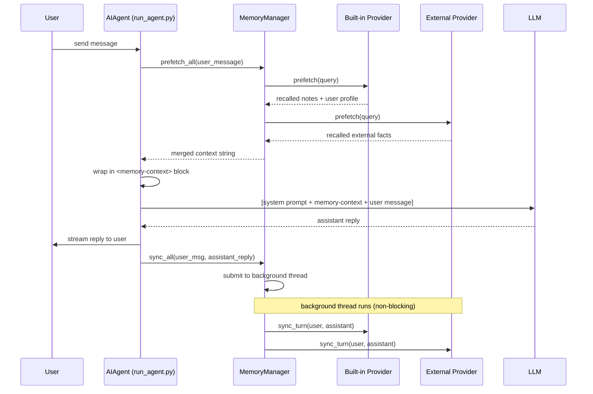

**TL;DR** — Before every agent turn, `MemoryManager.prefetch_all()` queries all registered memory providers and wraps the results in `<memory-context>` tags that the model sees as authoritative background. After the model replies, `sync_all()` ships the completed turn to every provider — but on a background thread, so the user never waits for storage. This chapter walks through exactly how that orchestration works, introduces the `MemoryProvider` abstract base class that makes the system pluggable, surveys the three bundled external providers (Honcho, Hindsight, Mem0), and shows how the periodic nudge-to-persist mechanism seeds Hermes's learning loop.

# MemoryManager, External Memory Providers, and the Nudge-to-Persist Loop

## The problem: getting the right past knowledge into every turn

An agent without memory answers every question as if waking up fresh each time. It cannot remember that you prefer concise explanations, that the project lives at `~/code/myapp`, or that last week you asked it to set up a cron job. That knowledge exists — it is not in the model's context window for this turn.

We could embed every prior conversation, but context windows are finite and expensive. What we want is *selective recall*: surface the facts most relevant to the current message, inject them quietly before the model replies, and then save whatever was learned this turn without blocking the user.

That is exactly what `MemoryManager` does.

## What the five memory layers have to do with this

Before diving into `MemoryManager`, a quick orientation from [the five memory layers overview](./five-memory-layers.md): Hermes has five tiers of persistence, from the model's in-context working memory at the top to the per-session `SessionDB` database at the bottom. The `MemoryManager` sits at **layer 3** — the external/plugin layer — and acts as the single orchestration point for both the built-in memory store and any external memory backend you configure. It does not replace the other layers; it coordinates the recall and sync lifecycle *around* each conversation turn.

Also relevant: [ContextCompressor and the LCM Context Engine](./context-compressor-and-lcm.md) handles the separate problem of what to do when the conversation *itself* grows too long and must be compressed. The memory layer and the compression layer are independent — but they interact: when compression fires, providers receive an `on_pre_compress()` hook so they can extract facts before messages are discarded.

## The one-external-provider rule

`MemoryManager` enforces a strict constraint: **at most one external (non-built-in) provider at a time.**

You might wonder why. The comment in the source is direct:

> Only ONE external plugin provider is allowed at a time — attempting to register a second external provider is rejected with a warning. This prevents tool schema bloat and conflicting memory backends.

Each external provider can expose its own tools to the model (search, conclude, recall). If you could run Honcho *and* Hindsight simultaneously, the model would see a confusing mix of overlapping tools, and the two backends would record diverging representations of the same conversations. One coherent memory backend is the right architecture for typical use.

The built-in provider — which manages the agent's personal notes and user profile that live in `~/.hermes/` — is always present alongside whichever external provider you configure (or none at all if you prefer local-only memory).

```
┌─────────────────────────────────────┐
│           MemoryManager             │
│                                     │
│  ┌──────────────────────────────┐   │
│  │  builtin (always registered) │   │
│  └──────────────────────────────┘   │
│  ┌──────────────────────────────┐   │
│  │  ONE external provider max   │   │
│  │  (Honcho | Hindsight | Mem0) │   │
│  └──────────────────────────────┘   │
└─────────────────────────────────────┘
```

## How a turn flows through MemoryManager

Let's trace a single conversation turn from the moment a user message arrives to the moment the agent's reply is sent. There are three phases: prefetch, generate, sync.



Notice that the arrow from `Agent` to `User` happens *before* `sync_all` completes. The background dispatch is the key design decision: the user gets their reply immediately, and memory writes happen concurrently without holding the agent's main thread open.

### Phase 1 — prefetch_all() collects recalled context

`prefetch_all()` iterates over all registered providers in registration order (built-in first), calls `provider.prefetch(query, session_id=session_id)` on each, and joins non-empty results with `"\n\n"`. Any provider that throws an exception is logged at DEBUG level and skipped — one broken provider never blocks the others.

```python
# Simplified view of prefetch_all() from agent/memory_manager.py
def prefetch_all(self, query: str, *, session_id: str = "") -> str:
    parts = []
    for provider in self._providers:
        try:
            result = provider.prefetch(query, session_id=session_id)
            if result and result.strip():
                parts.append(result)
        except Exception as e:
            logger.debug(
                "Memory provider '%s' prefetch failed (non-fatal): %s",
                provider.name, e,
            )
    return "\n\n".join(parts)
```

The `query` is the current user message — providers use it to decide what to retrieve. A vector-search provider will embed it and find semantically similar past facts; a key-value store might return everything it has.

### Phase 2 — the <memory-context> fence

The agent takes the string returned by `prefetch_all()` and wraps it using `build_memory_context_block()`:

```python
# From agent/memory_manager.py — build_memory_context_block()
def build_memory_context_block(raw_context: str) -> str:
    """Wrap prefetched memory in a fenced block with system note."""
    if not raw_context or not raw_context.strip():
        return ""
    clean = sanitize_context(raw_context)
    return (
        "<memory-context>\n"
        "[System note: The following is recalled memory context, "
        "NOT new user input. Treat as authoritative reference data — "
        "this is the agent's persistent memory and should inform all responses.]\n\n"
        f"{clean}\n"
        "</memory-context>"
    )
```

The `<memory-context>` tags serve two purposes. The opening system note tells the model to treat the block as authoritative background, not as something the user said moments ago. The tags also allow `sanitize_context()` to strip injected blocks *back out* of provider output — if a provider accidentally returns content it previously received as context, the fencing lets the manager detect and clean it up. There is also a streaming scrubber (`StreamingContextScrubber`) that handles the edge case where a `<memory-context>` block arrives split across streaming deltas.

### Phase 3 — sync_all() on a background thread

After the model replies, the agent calls `sync_all(user_content, assistant_content, ...)`. Rather than calling providers inline, `sync_all` dispatches the work to a single-worker `ThreadPoolExecutor`:

```python
# Simplified view of sync_all() from agent/memory_manager.py
def sync_all(self, user_content: str, assistant_content: str, *,
             session_id: str = "", messages=None) -> None:
    providers = list(self._providers)
    if not providers:
        return

    def _run() -> None:
        for provider in providers:
            try:
                provider.sync_turn(user_content, assistant_content,
                                   session_id=session_id, messages=messages)
            except Exception as e:
                logger.warning(
                    "Memory provider '%s' sync_turn failed: %s",
                    provider.name, e,
                )

    self._submit_background(_run)
```

Why a single worker? The comment in the source is explicit:

> A single worker serializes a provider's writes (turn N must land before turn N+1) and caps thread growth at one per manager.

Two writes from back-to-back turns could arrive at an external API out of order if they ran in parallel. The serialized single worker ensures chronological ordering without coordination logic inside each provider.

The executor is created lazily — if you only use the built-in provider and it has no async work, no background thread is ever spawned. Only when `_submit_background()` is called for the first time does the executor come to life.

#### What happens if the executor is unavailable?

The code has a fallback for two failure paths: executor creation failed (e.g., resource exhaustion) or the executor was already shut down (teardown race). In both cases the sync work runs inline on the calling thread. The comment:

> Executor unavailable (shut down / creation failed) — run inline rather than drop the work. Slow, but correct.

So the system fails open: memory writes are never lost, but in the unusual failure case they may block the caller briefly. There is no retry loop — if `sync_turn` itself throws, the exception is logged as a warning and the turn proceeds.

#### Shutdown and drain

When the session ends, `shutdown_all()` drains the background executor before tearing down providers. It submits a `cancel_futures=True` shutdown, then waits up to `_SYNC_DRAIN_TIMEOUT_S` (5.0 seconds) on a watcher thread for the in-flight sync to land. After that window, the daemon threads die with the interpreter — so a wedged provider cannot hang process exit indefinitely.

## The MemoryProvider ABC — the plug-in contract

Any class that wants to act as a memory backend implements the `MemoryProvider` abstract base class from `agent/memory_provider.py`. Let's walk through the contract method by method.

### Required methods

| Method | When called | What it must do |
|---|---|---|
| `name` (property) | At registration | Return a short unique identifier, e.g. `"honcho"`, `"builtin"` |
| `is_available()` | At agent init | Return `True` if credentials and deps are present; no network calls |
| `initialize(session_id, **kwargs)` | Once at startup | Connect, create resources, warm caches |
| `get_tool_schemas()` | At init | Return list of OpenAI-style tool schemas; empty list if provider has no tools |

### Core per-turn methods

| Method | When called | Fail-open? |
|---|---|---|
| `prefetch(query, *, session_id="")` | Pre-turn | Yes — exception caught in `prefetch_all()`, returns `""` on error |
| `sync_turn(user, assistant, *, session_id="", messages=None)` | Post-turn | Yes — exception caught in `sync_all()`, logged as warning |
| `shutdown()` | Session end | Warning logged on error; teardown continues |

The `messages` parameter on `sync_turn` is the full OpenAI-style message list including tool calls and tool results — providers that need more context than the plain user/assistant pair can use it. `MemoryManager` checks the provider's signature at runtime and passes `messages` only if the provider's `sync_turn` accepts it, keeping older providers compatible.

### Optional lifecycle hooks

These default to no-ops in the base class; a provider overrides only what it needs:

| Hook | When it fires |
|---|---|
| `on_turn_start(turn_number, message, **kwargs)` | At the start of each turn |
| `on_session_end(messages)` | On CLI exit, `/reset`, gateway expiry — not after every turn |
| `on_session_switch(new_session_id, *, parent_session_id, reset, rewound, **kwargs)` | On `/resume`, `/branch`, `/reset`, `/new`, or context compression |
| `on_pre_compress(messages) → str` | Immediately before ContextCompressor discards old messages |
| `on_memory_write(action, target, content, metadata=None)` | When the built-in memory tool writes; external providers can mirror the write |
| `on_delegation(task, result, *, child_session_id, **kwargs)` | On the parent agent when a subagent completes |

The `on_session_switch` hook is particularly important: when a new session starts (including after compression creates a continuation session), providers receive the `parent_session_id` of the session being left. This is how cross-session memory chains are maintained — the provider knows both the old and the new session ids. The `reset=True` flag signals a genuinely new conversation (not a resumption), so providers should flush per-session buffers; `rewound=True` means the transcript was truncated and cached per-turn state should be invalidated.

### Background prefetch (queue_prefetch)

There is an optional second prefetch path: `queue_prefetch(query, ...)`. The agent calls `queue_prefetch_all()` at the *end* of each turn (not the beginning). The idea is that a provider can start fetching context for the *next* turn asynchronously while the user is reading the current reply, so the result is cached and ready for the next `prefetch()` call. This is optional — the default implementation is a no-op — but a provider can use it to hide retrieval latency.

## The three bundled external providers

The `plugins/memory/` directory ships implementations for Honcho, Hindsight, and Mem0 (among others). They share the same `MemoryProvider` contract but specialize in very different kinds of memory.

### Honcho — cross-session user modeling

Honcho (from [Plastic Labs](https://docs.honcho.dev)) builds an evolving model of *who the user is* — their preferences, goals, and working style — using multi-pass dialectic reasoning across sessions. Rather than only logging what was said, Honcho builds two peer representations: one for the user and one for the AI, each updated after each turn.

**Memory specialty:** User identity modeling and dialectic synthesis. Excellent for deployments where the agent should deepen its understanding of a specific person over time.

**How recall works:** Honcho injects a layered block — session summary, user representation, user peer card, AI self-representation — wrapped in the `<memory-context>` fence. It also exposes five tools to the model (`honcho_profile`, `honcho_search`, `honcho_context`, `honcho_reasoning`, `honcho_conclude`) for on-demand querying and writing of persistent conclusions.

**Setup:**
```bash
hermes memory setup honcho
```

### Hindsight — knowledge graph with entity resolution

Hindsight stores memories as a knowledge graph with entity extraction and three retrieval strategies: semantic search, entity graph traversal, and LLM-powered cross-memory synthesis. It can run cloud, locally embedded (its own PostgreSQL daemon), or against a self-hosted instance.

**Memory specialty:** Structured fact extraction with entity relationships. Observations are deduplicated beliefs grounded in evidence, with freshness signals — denser per token than raw facts.

**How recall works:** Hindsight runs auto-recall before each turn (controlled by `auto_recall: true` in config). The default `recall_types` is `observation` — the consolidated knowledge layer — not raw `world` or `experience` facts. It exposes three tools: `hindsight_retain`, `hindsight_recall`, and `hindsight_reflect`.

**Setup:**
```bash
hermes memory setup hindsight
```

### Mem0 — server-side LLM fact extraction

Mem0 uses server-side LLM inference to extract discrete facts from conversations and stores them with semantic embeddings. Recall uses semantic search with optional reranking to surface the most relevant facts for the current query.

**Memory specialty:** Automatic fact extraction and deduplication. Suitable when you want the memory backend to decide what is worth remembering without manual tool calls.

**How recall works:** Mem0 injects recalled facts into the context block automatically. It also exposes three tools: `mem0_profile` (all stored memories), `mem0_search` (semantic search), and `mem0_conclude` (store a fact verbatim without LLM extraction).

**Setup:**
```bash
hermes memory setup mem0   # select "mem0" from the list
```

### Quick comparison

| Provider | Specialty | Storage | Recall method | Cloud required? |
|---|---|---|---|---|
| Honcho | User identity modeling | Honcho API | Dialectic + context injection | No (self-hostable) |
| Hindsight | Knowledge graph + facts | Graph DB | Semantic + entity graph | No (local embedded mode) |
| Mem0 | Discrete fact extraction | Mem0 API | Semantic search + reranking | No (self-hostable) |

## Configuring an external provider

Selecting a provider is one config key:

```yaml
# In ~/.hermes/config.yaml (or cli-config.yaml.example as reference)
memory:
  memory_enabled: true
  user_profile_enabled: true
  memory_char_limit: 2200
  user_char_limit: 1375
  nudge_interval: 10   # see next section

# Wire in one external provider:
provider: honcho   # or: hindsight, mem0
```

The `provider` key tells the agent which plugin to load. Each provider then reads its own config file (e.g., `~/.hermes/honcho.json`, `~/.hermes/hindsight/config.json`, `$HERMES_HOME/mem0.json`).

If you set `provider: honcho` and `provider: hindsight` simultaneously (by mistake), the second registration is silently rejected with a warning:

```
Rejected memory provider 'hindsight' — external provider 'honcho' is already
registered. Only one external memory provider is allowed at a time.
Configure which one via memory.provider in config.yaml.
```

## The nudge-to-persist mechanism and the learning loop

Every few turns, the agent receives a gentle system-level reminder to consider saving what it has learned. This is the **nudge-to-persist** mechanism, and it is a primary connection point to Hermes's learning loop.

The `nudge_interval` config key (under `memory`) controls it:

```yaml
memory:
  nudge_interval: 10   # Remind the agent every 10 user turns to save memories
                       # 0 = disabled
```

Every ten user turns (by default), the agent's next prompt includes a nudge: *consider whether there is anything worth persisting to memory*. This is not an automated write — the model still decides what, if anything, is worth saving. But it turns passive experience into an active question.

There is a parallel nudge for skills:

```yaml
skills:
  creation_nudge_interval: 15   # Remind the agent to consider saving a skill
                                 # after complex multi-step tasks
```

Together, these two nudges form the seed of the **learning loop**: the agent is periodically reminded to reflect on what it has done and ask whether a reusable procedure (a skill) or a persistent fact (a memory entry) should be created. Over time this is how the agent accumulates both procedural knowledge and factual knowledge about you and your environment.

For memory writes, there is also a flush path — if a session ends (via `/reset`, `/new`, or exit) and it had at least `flush_min_turns` user turns, the agent gets one turn to save important memories before context is cleared:

```yaml
memory:
  flush_min_turns: 6   # Min turns before triggering a save-on-exit flush
```

The broader learning loop — how skills are autonomously created, curated, and improved — is covered in [Skill Structure and Tools](../skills/skill-structure-and-tools.md) and [The Curator and the Learning Loop](../skills/curator-and-the-learning-loop.md). The memory layer is where facts about the world and the user accumulate; the skills layer is where reusable procedures accumulate. Both are seeded by periodic nudges; both feed back into every future conversation.

## Worked example: enabling Honcho for a new installation

Let's walk through the steps together. We want the agent to remember who we are across sessions using Honcho.

**Step 1 — Run the setup wizard.**

```bash
hermes memory setup honcho
```

The wizard installs the `honcho-ai` package, prompts for your API key from [app.honcho.dev](https://app.honcho.dev), and writes the key to `~/.hermes/.env`. It also sets `memory.provider = honcho` in your config.

**Step 2 — Verify the configuration in config.yaml.**

After setup, your `~/.hermes/config.yaml` contains something like:

```yaml
memory:
  memory_enabled: true
  user_profile_enabled: true
  nudge_interval: 10
  flush_min_turns: 6
provider: honcho
```

And `~/.hermes/honcho.json` holds the provider-specific settings:

```json
{
  "apiKey": "...",
  "workspace": "hermes",
  "peerName": "yourname",
  "recallMode": "hybrid",
  "sessionStrategy": "per-directory"
}
```

**Step 3 — Start a session and watch memory in action.**

```bash
hermes
```

On the first turn, `prefetch_all()` fires. With a fresh install, the built-in provider returns whatever notes and user profile you have stored, and Honcho returns an empty block (no sessions yet). After your first exchange, `sync_all()` ships the turn to both providers on a background thread. By the second session in the same directory, Honcho has context to inject.

**Step 4 — Check provider status.**

```bash
hermes honcho status
```

This shows the resolved config for the active profile — workspace, peer names, session strategy, and current Honcho session.

## Edge case: what happens when a background sync fails?

The code's failure model for `sync_all` is **fail-open with logging**. If a provider's `sync_turn` throws:

```python
except Exception as e:
    logger.warning(
        "Memory provider '%s' sync_turn failed: %s",
        provider.name, e,
    )
```

The exception is logged as a warning and the loop continues to the next provider. The turn is not retried. There is no retry queue — a failed write is dropped silently (from the user's perspective) after the warning is logged.

<!-- GAP: whether a failed sync_turn is ever retried at the provider level — the MemoryManager does not retry, but individual provider implementations could internally; source silent for all three bundled providers -->

This is the appropriate trade-off: a blocking memory backend (the source code notes a real case where a misconfigured Hindsight daemon blocked for ~298 seconds) must never hold the agent's turn open. The fail-open design means a broken backend degrades gracefully: you lose the memory write for that turn, but the conversation keeps flowing.

If the background executor itself cannot be created (resource exhaustion), writes fall back to inline execution on the calling thread — still fail-open, but with latency for that turn.

---

← Previous: [ContextCompressor and the LCM Context Engine](./context-compressor-and-lcm.md) · Next: [SessionDB — SQLite, WAL, FTS5, and Conversation Search](./sessiondb-fts-and-search.md) →
