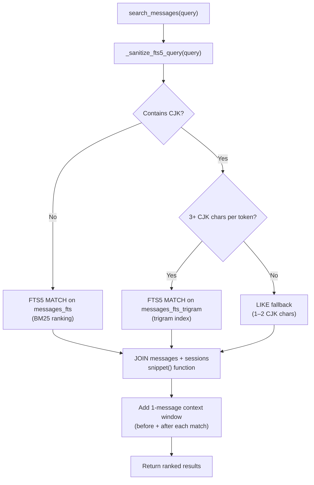
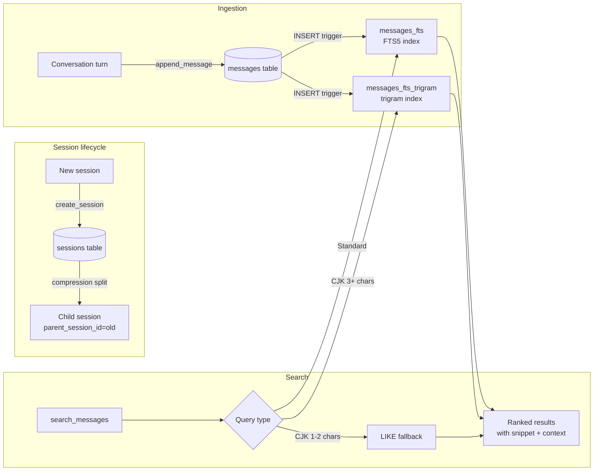

**TL;DR** — `SessionDB` is Hermes's conversation archive: every session and every message lands in a single SQLite file (`~/.hermes/state.db`) backed by write-ahead logging for durability and two FTS5 indexes for fast keyword search. By the end of this chapter you will understand how the database is laid out, why WAL mode matters, how the trigram index makes substring search work, and what happens when you run Hermes on a network filesystem.

# SessionDB — SQLite, WAL, FTS5, and Conversation Search

Hermes is a self-improving agent. Part of what makes that loop close is the ability to search its own past — to ask "have I solved a problem like this before?" and actually get an answer. That requires a durable, queryable record of every conversation.

In the [five memory layers](./five-memory-layers.md) picture, `SessionDB` is **layer 4**: the long-term conversation archive. The earlier layers (working context, compression summaries, external memory providers) are about what the agent *carries into the current turn*. `SessionDB` is about what the agent can *look up from history* — past sessions, past tool calls, past decisions.

Let's build that picture from the ground up, starting with the simplest question: where does the data live?

## The database file

When Hermes starts, it opens (or creates) a single file:

```
~/.hermes/state.db
```

This is a **SQLite** database — a serverless, single-file relational database engine that is built into Python's standard library. There is no database server to start, no credentials to configure. The entire archive lives in one file on disk.

The class that manages this file is `SessionDB`, defined in `hermes_state.py`. Everything we explore in this chapter lives there.

```python
# hermes_state.py (simplified)
DEFAULT_DB_PATH = get_hermes_home() / "state.db"

class SessionDB:
    def __init__(self, db_path: Path = None, read_only: bool = False):
        self.db_path = db_path or DEFAULT_DB_PATH
        # ...opens the connection, applies WAL mode, runs schema init
```

One file, one class, one archive. Now let's look at how that file stays consistent under concurrent access.

## Why WAL mode matters

The moment you run more than one Hermes process at the same time — a gateway handling Telegram messages, a CLI session open in a terminal, a background cron job — they all share the same `state.db`. Without any coordination, two writers colliding on one file would corrupt it.

SQLite handles this with *journal modes*. The default mode (`DELETE`, also called rollback journal) works by locking the entire database file for every write — readers must wait. That is fine for a single user writing infrequently, but it creates noticeable pauses when the gateway is logging messages at the same time as a CLI session is querying history.

**WAL** stands for write-ahead logging. Instead of locking the file for writes, SQLite appends every new write to a separate log file (the WAL file, `state.db-wal`). Readers see a consistent snapshot of the main database file while the write is still in the log. Reads and writes proceed concurrently; only two simultaneous writers need to wait on each other.

`SessionDB.__init__` enables WAL immediately after opening the connection:

```python
# hermes_state.py (simplified view of __init__)
self._conn = sqlite3.connect(str(self.db_path), ...)
apply_wal_with_fallback(self._conn, db_label="state.db")
self._conn.execute("PRAGMA foreign_keys=ON")
self._init_schema()
```

The call to `apply_wal_with_fallback` is the first thing that happens after the connection opens. That function is important enough to have its own section.

### Write contention and jitter retry

With multiple processes sharing one WAL file, write-lock collisions still happen — they happen less often. SQLite's built-in busy handler uses a fixed sleep schedule, which can cause a *convoy effect*: many waiters wake up at the same time and collide again.

`SessionDB` keeps the SQLite connection timeout short (1 second) and handles retries in Python with random jitter:

```python
# SessionDB class constants
_WRITE_MAX_RETRIES = 15
_WRITE_RETRY_MIN_S = 0.020   # 20 ms
_WRITE_RETRY_MAX_S = 0.150   # 150 ms
```

Every write goes through `_execute_write()`, which uses `BEGIN IMMEDIATE` to acquire the write lock at the start of the transaction (not at commit time). On a `"database is locked"` error it sleeps a random duration between 20 ms and 150 ms and retries — up to 15 times before giving up. The random sleep naturally staggers competing writers and breaks the convoy.

Every 50 successful writes, `SessionDB` also runs a TRUNCATE WAL checkpoint — flushing committed WAL frames back into the main database file and resetting the WAL file to zero bytes. This keeps the WAL from growing unbounded when many processes hold open connections.

## `apply_wal_with_fallback` — the safety net

Not all filesystems support WAL. SQLite's WAL mode uses shared memory (`mmap`) and `fcntl` byte-range locks for coordination between processes. Network filesystems — **NFS**, **SMB/CIFS**, and some **FUSE** mounts — do not reliably implement these primitives. On those filesystems, `PRAGMA journal_mode=WAL` raises `sqlite3.OperationalError: locking protocol`.

If `SessionDB` propagated that error directly, every feature backed by `state.db` would break silently: `/resume`, `/title`, `/history`, `/branch`, the kanban dispatcher — all of them depend on the database.

Instead, `apply_wal_with_fallback` catches the error and drops back to `journal_mode=DELETE`:

```python
def apply_wal_with_fallback(
    conn: sqlite3.Connection,
    *,
    db_label: str = "state.db",
) -> str:
    """Set journal_mode=WAL on conn, falling back to DELETE on failure.

    Returns the journal mode actually set ("wal" or "delete").
    """
    try:
        conn.execute("PRAGMA journal_mode=WAL")
        return "wal"
    except sqlite3.OperationalError as exc:
        msg = str(exc).lower()
        if not any(marker in msg for marker in _WAL_INCOMPAT_MARKERS):
            raise  # Unrelated error — don't swallow it
        # Don't downgrade if another process already set WAL on disk
        existing = _on_disk_journal_mode(conn)
        if existing == "wal":
            raise
        _log_wal_fallback_once(db_label, exc)
        conn.execute("PRAGMA journal_mode=DELETE")
        return "delete"
```

The markers that trigger the fallback path are `"locking protocol"` (the `SQLITE_PROTOCOL` error on NFS/SMB) and `"not authorized"` (some FUSE mounts that block the WAL pragma outright).

One important guard: if the on-disk database header already reports `"wal"` — meaning another process already successfully enabled WAL on this file — the fallback does *not* downgrade. Silently switching a live WAL database to DELETE mode would corrupt it.

The fallback warning is deduplicated: the same `db_label` only logs once per process, no matter how many times `apply_wal_with_fallback` is called (kanban operations, for example, open a fresh connection on every call).

**What an operator should know about the NFS/SMB case:**
- Concurrency drops. In DELETE mode, readers are blocked during writes. For a single user on a low-traffic NFS home directory this is usually fine.
- Slash commands (`/resume`, `/history`, etc.) will still work.
- The fallback is logged as a `WARNING` in `errors.log`. If you see `WAL journal_mode unsupported on this filesystem`, your `state.db` is on a network or FUSE mount and Hermes has switched to DELETE mode automatically.
- To avoid the issue entirely, move `~/.hermes/` to local storage. You can change the home directory via `HERMES_HOME` in your environment.

## Schema version 15

After opening the connection, `SessionDB.__init__` calls `_init_schema()`. This creates all the tables and indexes, reconciles any missing columns on existing databases, and records the schema version.

The current schema version is:

```python
# hermes_state.py, line 36
SCHEMA_VERSION = 15
```

The `schema_version` table stores this number. On every startup, `_init_schema` checks whether the stored version is below 15 and runs any data migrations that cannot be expressed declaratively (row backfills, index changes tied to a specific version step). Column additions no longer need version-gated migrations — `_reconcile_columns()` adds any column declared in `SCHEMA_SQL` that is missing from a live table, making upgrades self-healing.

## The `sessions` table — what each conversation records

Every conversation is a row in the `sessions` table. Here is the full column set from the schema in `hermes_state.py`:

| Column | Type | Purpose |
|---|---|---|
| `id` | TEXT (PK) | Session identifier, e.g. `20240610_143022_a3f9b1` |
| `source` | TEXT | Where the session came from: `cli`, `telegram`, `discord`, etc. |
| `user_id` | TEXT | Platform user identifier (nullable) |
| `model` | TEXT | LLM model name used |
| `model_config` | TEXT | JSON snapshot of model configuration |
| `system_prompt` | TEXT | Full assembled system prompt for this session |
| `parent_session_id` | TEXT | Points to the parent session in a compression chain (FOREIGN KEY → sessions) |
| `started_at` | REAL | Unix timestamp of session start |
| `ended_at` | REAL | Unix timestamp of session end (NULL while active) |
| `end_reason` | TEXT | Why the session ended: `"compression"`, `"tui_shutdown"`, etc. |
| `message_count` | INTEGER | Running count of messages (default 0) |
| `tool_call_count` | INTEGER | Running count of tool calls (default 0) |
| `input_tokens` | INTEGER | Cumulative input token usage |
| `output_tokens` | INTEGER | Cumulative output token usage |
| `cache_read_tokens` | INTEGER | Prompt-cache read tokens |
| `cache_write_tokens` | INTEGER | Prompt-cache write tokens |
| `reasoning_tokens` | INTEGER | Extended thinking / reasoning tokens |
| `cwd` | TEXT | Working directory when the session started |
| `billing_provider` | TEXT | Provider that billed this session |
| `billing_base_url` | TEXT | Base URL of the billing provider |
| `billing_mode` | TEXT | Billing mode identifier |
| `estimated_cost_usd` | REAL | Estimated cost in USD |
| `actual_cost_usd` | REAL | Actual billed cost in USD |
| `cost_status` | TEXT | Cost tracking status |
| `cost_source` | TEXT | Source of cost data |
| `pricing_version` | TEXT | Pricing table version used |
| `title` | TEXT | Human-readable session title (unique, nullable) |
| `api_call_count` | INTEGER | Number of LLM API calls made (default 0) |
| `handoff_state` | TEXT | Gateway handoff state blob |
| `handoff_platform` | TEXT | Platform the session was handed off to |
| `handoff_error` | TEXT | Handoff error message, if any |
| `rewind_count` | INTEGER | How many times `/rewind` was used in this session (default 0, NOT NULL) |
| `archived` | INTEGER | Soft-archived flag: `1` = hidden from default list (default 0, NOT NULL) |

The `parent_session_id` column is especially important for the learning loop. We'll come back to it in the next section.

## The `messages` table

Each message in a session is a row in the `messages` table:

| Column | Type | Purpose |
|---|---|---|
| `id` | INTEGER (PK, AUTOINCREMENT) | Row id — also the FTS5 `rowid` |
| `session_id` | TEXT | Foreign key to `sessions.id` |
| `role` | TEXT | `"user"`, `"assistant"`, `"tool"` |
| `content` | TEXT | Message content (may be JSON-encoded for multimodal) |
| `tool_call_id` | TEXT | Tool call correlation id |
| `tool_calls` | TEXT | JSON-encoded tool call list |
| `tool_name` | TEXT | Name of the tool invoked |
| `timestamp` | REAL | Unix timestamp |
| `token_count` | INTEGER | Token count for this message |
| `finish_reason` | TEXT | Why the model stopped generating |
| `reasoning` | TEXT | Raw reasoning text |
| `reasoning_content` | TEXT | Structured reasoning content |
| `reasoning_details` | TEXT | JSON-encoded reasoning details |
| `codex_reasoning_items` | TEXT | Codex-style reasoning items |
| `codex_message_items` | TEXT | Codex-style message items |
| `platform_message_id` | TEXT | External platform message id (e.g. Telegram update id) |
| `observed` | INTEGER | Whether this message was observed by an observer hook |
| `active` | INTEGER | Soft-delete flag: `0` = rewound, `1` = active (default 1, NOT NULL) |

The `active` column enables the `/rewind` command: rewound messages are set to `active=0` and hidden from normal queries, but kept on disk for audit purposes.

Notice that the FTS5 index (which we'll explore next) concatenates `content`, `tool_name`, and `tool_calls` into a single searchable text — so searching for a tool invocation by name (`read_file`, `bash`) works as well as searching for message text.

## FTS5 — full-text search across all sessions

Now we have a problem. The `sessions` and `messages` tables are straightforward relational tables. A `LIKE '%keyword%'` query on a million-row `messages` table does a full table scan — it reads every row. That is too slow for interactive session search.

**FTS5** is SQLite's built-in full-text search engine. It maintains a separate inverted index of every word in the indexed content. A `MATCH 'keyword'` query hits the index directly and returns results in milliseconds.

`SessionDB` creates a **virtual table** (a special SQLite construct where the storage is managed by a module, not a regular B-tree) named `messages_fts`:

```sql
-- From FTS_SQL in hermes_state.py (simplified)
CREATE VIRTUAL TABLE IF NOT EXISTS messages_fts USING fts5(
    content
);
```

The `content` column in `messages_fts` is not the raw message `content` column — it is a concatenation of `content`, `tool_name`, and `tool_calls`, assembled by three SQLite triggers that fire on every `INSERT`, `UPDATE`, and `DELETE` to the `messages` table:

```sql
CREATE TRIGGER IF NOT EXISTS messages_fts_insert AFTER INSERT ON messages BEGIN
    INSERT INTO messages_fts(rowid, content) VALUES (
        new.id,
        COALESCE(new.content, '') || ' ' || COALESCE(new.tool_name, '') || ' ' ||
        COALESCE(new.tool_calls, '')
    );
END;
```

The `rowid` is set to `messages.id`, which is how search results are joined back to the real message rows.

### The trigram FTS5 table

There is a second virtual table, `messages_fts_trigram`, created from `FTS_TRIGRAM_SQL`:

```sql
CREATE VIRTUAL TABLE IF NOT EXISTS messages_fts_trigram USING fts5(
    content,
    tokenize='trigram'
);
```

The default FTS5 tokenizer (`unicode61`) splits text on word boundaries. That works well for most languages, but for CJK scripts (Chinese, Japanese, Korean) it splits each character into its own token — so a search for "大别山项目" becomes `大 AND 别 AND 山 AND 项 AND 目`, which produces false positives and misses exact phrase matches.

The **trigram** tokenizer works differently. Instead of splitting on word boundaries, it indexes every overlapping sequence of three characters (called a *trigram*) in the text. The string "hello" produces the trigrams: `hel`, `ell`, `llo`. A query for any substring of three or more characters can then be satisfied by looking up its trigrams in the index.

This is what makes substring search work for any script. For CJK, three characters equals three code points; the trigram index finds the exact 3-character sequence regardless of word boundaries.

The same triggers that maintain `messages_fts` also maintain `messages_fts_trigram` — there are six triggers in total (`_FTS_TRIGGERS`):

```python
_FTS_TRIGGERS = (
    "messages_fts_insert",
    "messages_fts_delete",
    "messages_fts_update",
    "messages_fts_trigram_insert",
    "messages_fts_trigram_delete",
    "messages_fts_trigram_update",
)
```

## How `search_messages` works

Let's follow an actual search through the system. The entry point is `SessionDB.search_messages()`. Its signature shows the full set of filters:

```python
def search_messages(
    self,
    query: str,
    source_filter: List[str] = None,    # e.g. ["cli", "telegram"]
    exclude_sources: List[str] = None,
    role_filter: List[str] = None,       # e.g. ["user", "assistant"]
    limit: int = 20,
    offset: int = 0,
    sort: str = None,                    # None (BM25 rank), "newest", "oldest"
    include_inactive: bool = False,
) -> List[Dict[str, Any]]:
```

Here is the path a query takes:



Let's walk through each stage.

**Step 1 — Sanitize the query.** FTS5 has its own query syntax where characters like `"`, `(`, `)`, `+`, `{`, `}`, `:` and the bare boolean operators `AND`, `OR`, `NOT` have special meaning. Raw user input passed directly to `MATCH` can raise `OperationalError`. `_sanitize_fts5_query` preserves properly paired quoted phrases, strips unmatched special characters, wraps hyphenated terms in quotes (so `chat-send` matches as a phrase rather than a subtraction), and removes dangling boolean operators.

**Step 2 — Detect CJK.** `_contains_cjk` checks whether the query contains Chinese, Japanese, or Korean characters. If it does, and each CJK token has at least 3 characters, the query routes to `messages_fts_trigram`. If any CJK token has fewer than 3 characters (the trigram index needs at least 9 UTF-8 bytes per token to match), it falls back to a `LIKE` substring scan. Non-CJK queries go to `messages_fts`.

**Step 3 — Execute the query.** The main FTS5 SQL looks like this (simplified):

```sql
SELECT
    m.id,
    m.session_id,
    m.role,
    snippet(messages_fts, 0, '>>>', '<<<', '...', 40) AS snippet,
    m.content,
    m.timestamp,
    m.tool_name,
    s.source,
    s.model,
    s.started_at AS session_started
FROM messages_fts
JOIN messages m ON m.id = messages_fts.rowid
JOIN sessions s ON s.id = m.session_id
WHERE messages_fts MATCH ?
  AND m.active = 1
ORDER BY rank
LIMIT ? OFFSET ?
```

The `snippet()` function is built into FTS5. It extracts a short excerpt from the matched content and wraps the matched terms in `>>>` / `<<<` markers. `rank` is the BM25 relevance score that FTS5 computes automatically. When `sort="newest"` is passed, the `ORDER BY` becomes `ORDER BY m.timestamp DESC, rank` instead.

**Step 4 — Add surrounding context.** For each matched message, the code fetches one message before and one after it in the same session. This gives search results enough surrounding context to be useful without loading the entire transcript.

The result of each matched row is a dict with: `id`, `session_id`, `role`, `snippet`, `content`, `timestamp`, `tool_name`, `source`, `model`, `session_started`, and a `context` list.

## Worked example: Hermes searching its own past

Let's say we have been using Hermes to debug a Docker networking issue and want to find a past session that covered container port forwarding. We (as the agent or as a user invoking session search) run:

```python
# Simplified representation of calling search_messages
results = session_db.search_messages(
    query="docker port forwarding container",
    source_filter=["cli"],
    limit=5,
    sort="newest",
)

for r in results:
    print(f"[{r['session_id']}] {r['snippet']}")
```

Internally, `search_messages` sanitizes the query (no special characters to handle here), routes to `messages_fts` (no CJK), and runs the FTS5 query joining `messages` and `sessions`. The BM25 engine ranks the results by relevance to the four-word phrase.

A returned result might look like:

```python
{
    "id": 14823,
    "session_id": "20240602_091344_b7e3a0",
    "role": "assistant",
    "snippet": "...the container's >>>port<<< 8080 must be bound to the host. "
               ">>>Docker<<< does not >>>forward<<< traffic unless...",
    "timestamp": 1717319624.0,
    "session_started": 1717319300.0,
    "source": "cli",
    "model": "claude-opus-4-5",
}
```

The `>>>` / `<<<` markers show exactly which terms matched in context. The slash commands `/history` and `/resume` use results like this to present a searchable session picker.

This is what makes the learning loop concrete: the agent's past reasoning is searchable, not buried in flat log files.

## The `parent_session_id` chain and session splitting

As we covered in [Context Compressor and LCM](./context-compressor-and-lcm.md), when a session's context window fills up, Hermes compresses the conversation and splits it into a new session. The compressed session archive is preserved and linked via `parent_session_id`.

Here is what happens inside `conversation_compression.py` at the moment of compression:

```python
# Simplified from compress_context() in conversation_compression.py
agent._session_db.end_session(agent.session_id, "compression")
old_session_id = agent.session_id

# Generate a new session id and create a new row
agent.session_id = f"{datetime.now().strftime('%Y%m%d_%H%M%S')}_{uuid.uuid4().hex[:6]}"
agent._session_db.create_session(
    session_id=agent.session_id,
    source=agent.platform or "cli",
    model=agent.model,
    model_config=agent._session_init_model_config,
    parent_session_id=old_session_id,   # <-- the chain link
)
```

The old session row gets `ended_at` set and `end_reason = "compression"`. The new session gets `parent_session_id = old_session_id`. This creates a linked list of sessions — the *compression chain* — that represents a single logical conversation across multiple physical sessions.

`SessionDB.get_compression_tip()` walks this chain forward and returns the id of the most recent continuation. `resolve_resume_session_id()` does the same walk but stops at the first descendant that actually has message rows — used by `/resume` to land you in the right session.

### The compression lock (300 s TTL)

To prevent two concurrent paths from both deciding to compress the same session simultaneously — which would produce two orphan child sessions from the same parent — `SessionDB` maintains a `compression_locks` table:

```python
def try_acquire_compression_lock(
    self,
    session_id: str,
    holder: str,
    ttl_seconds: float = 300.0,   # 300-second default TTL
) -> bool:
```

The lock is keyed on the session being compressed. The default TTL is **300 seconds**. If a compressor process crashes without releasing the lock, the expired lock is reclaimed transparently on the next `try_acquire_compression_lock` call — a crashed compressor cannot permanently block future compression.

The `holder` string encodes `pid:tid:agent-instance:nonce` so diagnostics can tell which process holds a lock, and so a late-returning compressor cannot accidentally release a lock it no longer owns.

## Putting it together — the session archive as a learning resource

Let's look at the full picture:



Every message written to a session flows through the triggers into both FTS5 indexes automatically. When the agent (or a user) runs a session search, the query resolves through the same `SessionDB.search_messages()` path, returning ranked snippets with context. The `parent_session_id` chain keeps multi-session conversations navigable even after many rounds of compression.

## Edge case — FTS5 unavailable

If Hermes is run with a Python build that was compiled without FTS5 support (uncommon, but possible on some stripped-down Linux distributions), `_sqlite_supports_fts5()` detects this at startup and logs a warning:

```
SQLite FTS5 unavailable for ~/.hermes/state.db; full-text session search disabled.
Run `hermes update` to rebuild the venv with a current Python (managed uv guarantees FTS5).
```

When `_fts_enabled` is False, `search_messages` returns an empty list rather than erroring. The FTS triggers are also dropped so that message writes continue to work — the FTS tables are absent. Running `hermes update` rebuilds the virtual environment with a Python that includes FTS5, and the indexes are rebuilt on the next startup.

## Edge case — malformed schema recovery

Occasionally (usually after an interrupted write or a version mismatch) the `sqlite_master` table can develop duplicate object definitions — for example, two `CREATE VIRTUAL TABLE messages_fts` rows. SQLite parses the entire schema on the first statement of every connection, so a malformed schema causes *every* statement — including `PRAGMA journal_mode` — to fail before `_init_schema` can run.

`SessionDB.__init__` catches this class of error and calls `repair_state_db_schema()`, which:

1. Takes a timestamped raw backup of the database file first.
2. Attempts de-duplication of `sqlite_master` (least destructive — preserves the FTS index).
3. If that fails, drops all `messages_fts*` schema objects and vacuums; the FTS indexes rebuild from `messages` on the next open.

The canonical `sessions` and `messages` data is never modified by the repair. Only the derived FTS schema is reconstructed.

---

← Previous: [MemoryManager, External Memory Providers, and the Nudge-to-Persist Loop](./memory-manager-and-external-providers.md) · Next: [The Hermes Home Directory and Profile Isolation](../persistence/home-directory-and-profiles.md) →
