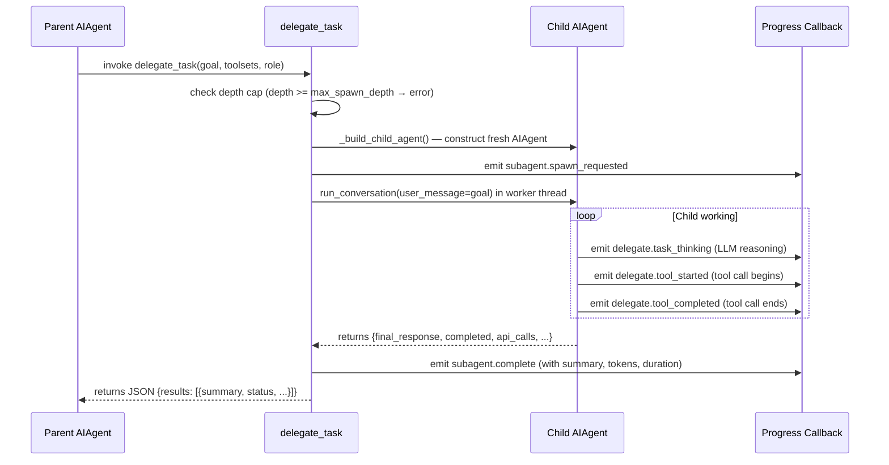
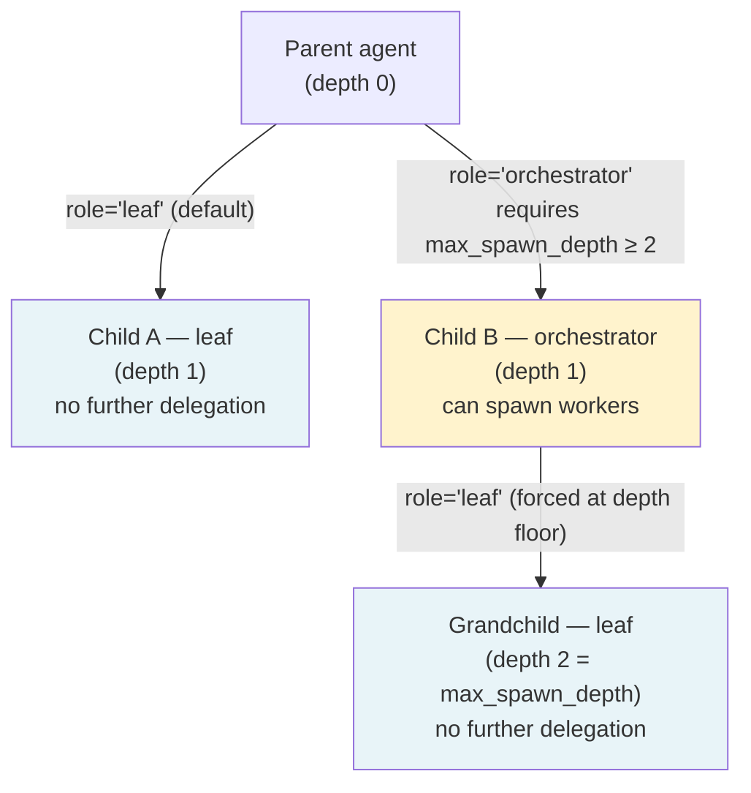

**TL;DR** — `delegate_task` spawns a fresh child `AIAgent` with its own isolated conversation, a restricted set of tools, and a focused system prompt. The parent agent blocks until the child finishes, then receives a summary result — all within the same Python process. This chapter walks you through how delegation works, how the depth cap keeps costs predictable, the difference between `leaf` and `orchestrator` child roles, and what events flow back through the `DelegateEvent` stream while the child is working.

# In-Process Delegation with `delegate_task`

Hermes supports three distinct multi-agent patterns that you should never conflate. **In-process delegation** (this chapter) uses `delegate_task` to spawn a child `AIAgent` that runs synchronously in the same Python process as its parent. **Kanban dispatch** (see [Kanban Dispatch](./kanban-dispatch.md)) uses a persistent task board where workers claim and process tasks asynchronously and durably. **Swarm topologies** build on that board to coordinate many workers in parallel. Each mechanism has a different lifecycle, cost profile, and failure mode. This chapter covers only the first: in-process delegation.

## The problem a single focused agent creates

Imagine you ask Hermes to audit a codebase, summarise five external articles, and draft a report. If one agent handles all three in sequence, each subtask pollutes the context with intermediate reasoning, file contents, and tool results from the tasks before it. By the time the agent reaches the report, its context window is crowded with work it no longer needs.

`delegate_task` solves this by factoring the work into isolated child agents. Each child starts with a **fresh conversation** — no parent history — and a focused system prompt built from the delegated goal. When the child finishes, the parent's context only sees the delegation call and the child's final summary, never the child's intermediate tool calls or reasoning.

## What `delegate_task` does

`delegate_task` is a tool — a Python function the parent agent's LLM can invoke by name, just like any other tool. Calling it does the following:

1. Constructs a new `AIAgent` instance (a *child*) on the main thread.
2. Gives the child an isolated conversation context, a restricted toolset, and a focused system prompt.
3. Runs the child's full `run_conversation()` loop in a worker thread, with a timeout.
4. Streams `DelegateEvent` progress events back to the parent's display as the child works.
5. Returns a JSON string with the child's final summary and exit metadata to the parent agent.

The parent blocks until the child completes (or times out). This is synchronous to the parent's tool-call flow, which is why we call it *in-process*.

Here is the public signature of `delegate_task` — simplified so you can see what to pass it:

```python
# Simplified view of delegate_task() — from tools/delegate_tool.py
def delegate_task(
    goal: str | None = None,         # The single subtask description
    context: str | None = None,      # Optional extra context for the child
    toolsets: list[str] | None = None,  # Which toolsets the child may use
    tasks: list[dict] | None = None, # OR a batch of tasks (parallel mode)
    role: str | None = None,         # "leaf" (default) or "orchestrator"
    parent_agent=None,               # Injected by the runtime
) -> str:                            # JSON result string
```

You typically do not call `delegate_task` from Python code you write — it is a tool the agent's LLM invokes. But knowing its shape helps you understand the config keys and edge cases below.

## How the child is built — isolated context and restricted toolsets

Let's look at what the child actually receives. The `_build_child_agent()` function (called from `delegate_task`) constructs the child with several deliberate restrictions.

### Isolated context

The child is constructed as a full `AIAgent`, but with these options set:

```python
child = AIAgent(
    ...
    ephemeral_system_prompt=child_prompt,  # focused goal, not the parent's full prompt
    skip_context_files=True,               # no CLAUDE.md / project context files
    skip_memory=True,                      # no MEMORY.md write access
    quiet_mode=True,                       # no interactive output
    clarify_callback=None,                 # cannot ask the user questions
)
```

The child gets a fresh conversation (no parent history). Its system prompt is built dynamically from the `goal` and `context` you pass, with workspace path hints injected when available. The parent's context only ever sees the top-level delegation call and the final summary — never the child's intermediate steps.

### Restricted toolset — `_SUBAGENT_TOOLSETS` and `DELEGATE_BLOCKED_TOOLS`

A *toolset* in Hermes is a named group of tools (for example, `"terminal"` gives access to shell commands, `"web"` gives access to web fetch and search). When you spawn a child, you can pass an explicit `toolsets` list. If you do not, the child inherits a reduced version of the parent's enabled toolsets.

No matter what you request, some tools are always stripped from child agents. The blocked set is `DELEGATE_BLOCKED_TOOLS`:

```python
DELEGATE_BLOCKED_TOOLS = frozenset([
    "delegate_task",   # no recursive delegation (unless role="orchestrator" and depth allows)
    "clarify",         # no user interaction — the child cannot ask you questions
    "memory",          # no writes to the shared MEMORY.md
    "send_message",    # no cross-platform side effects
    "execute_code",    # children reason step-by-step, not via scripts
])
```

The constant `_SUBAGENT_TOOLSETS` is the sorted list of toolset names that are valid to request for a child — it excludes a fixed set of toolsets that do not make sense for subagents (like `debugging`, `delegation`, `moa`, `rl`, and all `hermes-*` prefixed composite toolsets). You can inspect this list to know what is safe to pass as `toolsets`.

There is also an important safety rule: a child can only receive toolsets the parent already has. If the parent has `web` disabled, the child cannot request it. The runtime intersects the requested list with the parent's effective toolsets before assigning the child.

### The default toolset

When no `toolsets` argument is provided, the child defaults to `["terminal", "file", "web"]`. This gives it shell access, file read/write, and web browsing — enough for most subtasks.

### Dangerous commands and approval

Subagents run inside a `ThreadPoolExecutor` worker thread, which does not inherit the parent CLI's interactive approval callback. Without intervention, a dangerous terminal command would fall back to `input()` and deadlock the parent UI.

To prevent this, `delegate_task` installs a non-interactive callback in every worker thread. By default (`delegation.subagent_auto_approve: false`) this is `_subagent_auto_deny`: the child receives a `"deny"` response for any dangerous command and can recover from it. If you set `delegation.subagent_auto_approve: true`, the callback auto-approves instead — useful for batch or cron jobs, but riskier.

## Sequence: what happens when the parent calls `delegate_task`

Here is the full lifecycle from call to result:



Notice that the parent does not see the child's intermediate conversation — only the `DelegateEvent` stream and the final JSON result.

## The `DelegateEvent` stream

As the child works, a progress callback relays events to the parent's display (the CLI spinner, or the gateway's SSE stream). These events are defined in the `DelegateEvent` enum:

| Event constant | String value | When it fires |
|---|---|---|
| `TASK_SPAWNED` | `delegate.task_spawned` | Reserved for future use — not currently emitted |
| `TASK_THINKING` | `delegate.task_thinking` | Child LLM produces reasoning / thinking text |
| `TASK_TOOL_STARTED` | `delegate.tool_started` | Child begins a tool call |
| `TASK_TOOL_COMPLETED` | `delegate.tool_completed` | Child tool call finishes (silently consumed by callback) |
| `TASK_PROGRESS` | `delegate.task_progress` | Batched tool-name summary relayed from a nested orchestrator |
| `TASK_COMPLETED` | `delegate.task_completed` | Reserved for future use — not currently emitted |
| `TASK_FAILED` | `delegate.task_failed` | Reserved for future use — not currently emitted |

In addition, the progress callback emits two lifecycle strings that are not part of the `DelegateEvent` enum but are handled specially:

| Lifecycle event | When it fires |
|---|---|
| `subagent.spawn_requested` | Immediately after the child `AIAgent` is constructed, before it starts |
| `subagent.start` | When `_run_single_child` begins executing the child |
| `subagent.complete` | When the child finishes, carrying summary, tokens, cost, files touched, and an output tail |

The callback also handles older *legacy* event strings (`"_thinking"`, `"reasoning.available"`, `"tool.started"`, `"tool.completed"`, `"subagent_progress"`) that internal components may still emit. The callback normalises all of these to the corresponding `DelegateEvent` enum value before forwarding.

## The depth cap — `max_spawn_depth`

Now we have a potential problem: if a child can also call `delegate_task`, the tree can grow indefinitely, multiplying API costs with every level.

Hermes prevents this with a depth cap. The config key is `delegation.max_spawn_depth`. Here is how it works:

- `depth 0` = the top-level parent agent.
- The cap is read from `delegation.max_spawn_depth`; the default is `1` (the `MAX_DEPTH` constant in `delegate_tool.py`).
- When the cap is `1`, a child at `depth 1` is at the floor and **cannot spawn grandchildren**.
- You can raise the cap in `config.yaml` to allow deeper trees — there is no ceiling in the code, but every extra level multiplies API cost, so the default stays flat.

```python
# From delegate_task() — the depth check fires before any child is built
depth = getattr(parent_agent, "_delegate_depth", 0)
max_spawn = _get_max_spawn_depth()   # reads delegation.max_spawn_depth, default 1
if depth >= max_spawn:
    return json.dumps({
        "error": (
            f"Delegation depth limit reached (depth={depth}, "
            f"max_spawn_depth={max_spawn}). Raise "
            f"delegation.max_spawn_depth in config.yaml if deeper "
            f"nesting is required (no hard ceiling, but each level "
            f"multiplies API cost)."
        )
    })
```

When the error fires, `delegate_task` returns a JSON error string to the parent agent — it does not raise a Python exception. The parent agent sees the error in its tool-call result and can decide how to recover (retry a simpler approach, ask the user, or abort).

## `leaf` vs `orchestrator` roles

We just said that a child at `depth 1` with the default cap cannot spawn grandchildren. But what if you deliberately want two levels of delegation — a mid-tier worker that fans out its own subtasks?

This is what the `role` parameter controls. You pass `role="orchestrator"` when spawning a child that should be allowed to further delegate. A child without this parameter (or with `role="leaf"`) has `delegate_task` stripped from its toolset entirely, so it physically cannot delegate.

Here is the complete decision logic:

```python
# From _build_child_agent() — simplified
child_depth = getattr(parent_agent, "_delegate_depth", 0) + 1
max_spawn = _get_max_spawn_depth()
orchestrator_ok = _get_orchestrator_enabled() and child_depth < max_spawn
effective_role = role if (role == "orchestrator" and orchestrator_ok) else "leaf"
```

There are three conditions that must all hold for a child to become an orchestrator:

1. The caller passed `role="orchestrator"`.
2. The global kill switch `delegation.orchestrator_enabled` is `True` (the default).
3. The child's depth is **strictly less than** `max_spawn_depth`. A child at `depth = max_spawn_depth - 1` is at the last level that can spawn, not the floor.

If any condition fails, the role silently degrades to `"leaf"` — the child runs without delegation capability, and no error is raised.

An orchestrator child gets the `"delegation"` toolset re-added unconditionally, even if the parent's toolsets did not include it. This is intentional: orchestrator capability is granted by role, not inherited from the parent's toolset list.

The depth cap tree looks like this:



With the default `max_spawn_depth=1`, the orchestrator branch does not exist: any child at `depth 1` is forced to `leaf` because `child_depth (1) < max_spawn (1)` is false.

## Worked example: delegate a research subtask

Let's say the parent agent is working on a large task. It decides to delegate one focused subtask: summarising three web pages about a topic, using only web-browsing tools, with no file writes or shell access.

We will walk through this as if we are watching the agent invoke `delegate_task`.

**Step 1: The parent calls `delegate_task`.**

The agent's LLM produces a tool call that looks like this:

```json
{
  "name": "delegate_task",
  "arguments": {
    "goal": "Visit these three URLs and produce a single 200-word summary of the main argument on each page: https://example.com/a, https://example.com/b, https://example.com/c.",
    "context": "We are building a report on distributed systems. Focus on consistency guarantees.",
    "toolsets": ["web"]
  }
}
```

**Step 2: `delegate_task` checks the depth cap.**

The parent is at `depth 0`; `max_spawn_depth` is `1`. `0 >= 1` is false, so we proceed.

**Step 3: The child is built.**

`_build_child_agent()` constructs a new `AIAgent` with:
- `enabled_toolsets = ["web"]` (validated against the parent's enabled toolsets)
- `delegate_task` stripped (it is in `DELEGATE_BLOCKED_TOOLS`; this child's role is `leaf`)
- `skip_memory = True`, `skip_context_files = True`, `quiet_mode = True`
- A focused system prompt:

```
You are a focused subagent working on a specific delegated task.

YOUR TASK:
Visit these three URLs and produce a single 200-word summary...

CONTEXT:
We are building a report on distributed systems...

Complete this task using the tools available to you. When finished, provide
a clear, concise summary of: What you did / What you found or accomplished /
Any files you created or modified / Any issues encountered.
```

**Step 4: The child runs.**

The child's `run_conversation()` loop runs in a worker thread. As it fetches each URL, the progress callback fires `DelegateEvent.TASK_TOOL_STARTED` events, which the parent displays as activity lines in the CLI spinner.

**Step 5: The child returns a result.**

When the child finishes, `delegate_task` returns a JSON string to the parent:

```json
{
  "results": [
    {
      "task_index": 0,
      "status": "completed",
      "summary": "Page A argues that eventual consistency is sufficient for most workloads when combined with conflict-free replicated data types (CRDTs). Page B ...",
      "api_calls": 4,
      "duration_seconds": 12.3,
      "exit_reason": "completed",
      "tokens": { "input": 8200, "output": 410 }
    }
  ],
  "total_duration_seconds": 12.3
}
```

The parent agent reads this JSON, extracts the `summary`, and continues its own work. Its conversation context grew by one tool call and one tool result — nothing from the child's four API calls or intermediate fetches.

## Configuration reference

These are the `delegation.*` keys in `config.yaml` that govern `delegate_task`:

| Config key | Default | What it controls |
|---|---|---|
| `delegation.max_spawn_depth` | `1` | Maximum depth of the delegation tree; floor is `1`, no ceiling |
| `delegation.max_concurrent_children` | `3` | How many child tasks run in parallel (batch mode) |
| `delegation.child_timeout_seconds` | `600` | Seconds before a child is considered stuck; floor is `30` |
| `delegation.max_iterations` | `50` | Per-child iteration budget |
| `delegation.orchestrator_enabled` | `true` | Global kill switch for `role="orchestrator"` |
| `delegation.subagent_auto_approve` | `false` | Auto-approve dangerous terminal commands in child threads |
| `delegation.model` | (parent's model) | Override the model for child agents |
| `delegation.provider` | (parent's provider) | Route child agents to a different provider |

You set these under the `delegation:` key in your `~/.hermes/config.yaml`:

```yaml
delegation:
  max_spawn_depth: 2          # allow parent → orchestrator → workers
  max_concurrent_children: 5  # run up to 5 batch tasks at once
  child_timeout_seconds: 300  # tighter timeout for fast subtasks
  orchestrator_enabled: true
  subagent_auto_approve: false
```

## Edge case: a leaf child tries to delegate

Suppose a leaf child — running at `depth 1` with the default `max_spawn_depth=1` — has its LLM attempt to call `delegate_task`. There are two layers of protection:

1. **Toolset strip.** `_strip_blocked_tools()` removes the `"delegation"` toolset from leaf children's enabled set. Since the toolset is not loaded, `delegate_task` does not even appear in the child's tool schema. The LLM cannot invoke a tool that is not in its schema.

2. **Depth guard.** Even if a leaf somehow had the tool (for example, because it was granted `role="orchestrator"` but the depth cap was later reduced), `delegate_task` checks `depth >= max_spawn` before building any child. If the check fires, the child receives a JSON error and can handle it gracefully.

In practice, when the toolset strip works correctly the LLM never produces the call in the first place, which is the preferred path.

## Edge case: a child fails or times out

A child that fails (raises an exception, produces no final response, or exhausts its iteration budget without a clear completion) returns a result entry with `status = "error"` or `status = "timeout"`. The parent agent sees this in the JSON it receives:

```json
{
  "results": [
    {
      "task_index": 0,
      "status": "timeout",
      "summary": null,
      "error": "Subagent timed out after 600s with 2 API call(s) completed — likely stuck on a slow API call or unresponsive network request.",
      "api_calls": 2,
      "duration_seconds": 600.0
    }
  ]
}
```

What happens next is up to the parent agent's LLM — `delegate_task` does not re-try automatically. The parent can decide to rephrase the goal, reduce the scope, or abandon that branch. A partial result (the child completed some work but hit `max_iterations` before finishing) surfaces as `exit_reason: "max_iterations"` with `status: "completed"` if the child produced any final response.

For timeout events where the child made zero API calls, Hermes writes a diagnostic file to `~/.hermes/logs/subagent-timeout-<id>-<timestamp>.log`. The path is included in the error message. This file contains the child's config, system-prompt size, tool schema size, and the worker thread's Python stack at timeout — useful for diagnosing hung credential resolution or oversized prompts.

## How in-process delegation differs from the other two patterns

If you are deciding which mechanism to use, this table previews all three:

| Dimension | In-process delegation (`delegate_task`) | Kanban dispatch | Swarm |
|---|---|---|---|
| Lifecycle | Synchronous; parent blocks until child finishes | Asynchronous; tasks persist in a SQLite board | Asynchronous; coordinated by a board + blackboard |
| Persistence | Ephemeral — child lives only for the delegation call | Persistent — tasks survive restarts | Persistent |
| Context isolation | Full — child gets a fresh conversation | Full — each worker has its own session | Full |
| Parallelism | Up to `max_concurrent_children` per call | Unlimited workers competing for tasks | Worker pool defined by swarm config |
| Depth / nesting | Configurable via `max_spawn_depth` | N/A | N/A |
| Best for | Focused one-shot subtasks where the parent needs the result to continue | Long-running queues, distributed work, tasks that must survive crashes | Large parallel workloads with shared state |

For kanban dispatch details, see [Kanban Dispatch](./kanban-dispatch.md).

---

← Previous: [The Tools Registry, Approval Gate, and File-Write Safety](../tools/tools-registry-and-approval-gate.md) · Next: [Kanban Dispatch — Boards, dispatch_once(), CAS Claim, and Worker Context](./kanban-dispatch.md) →
