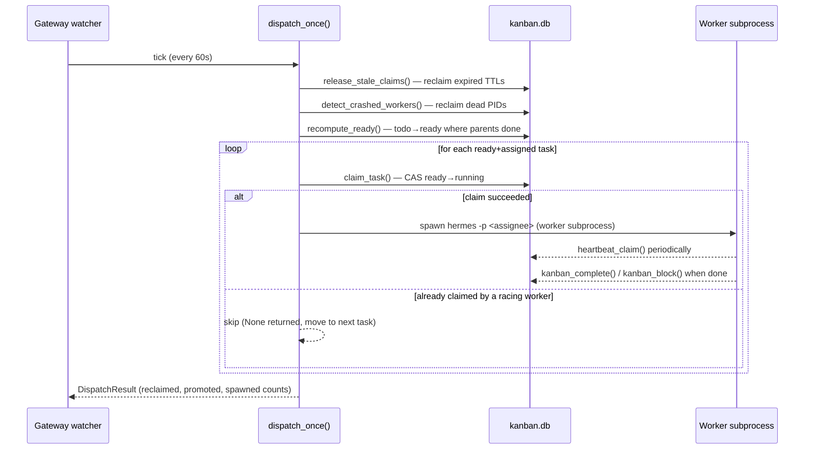
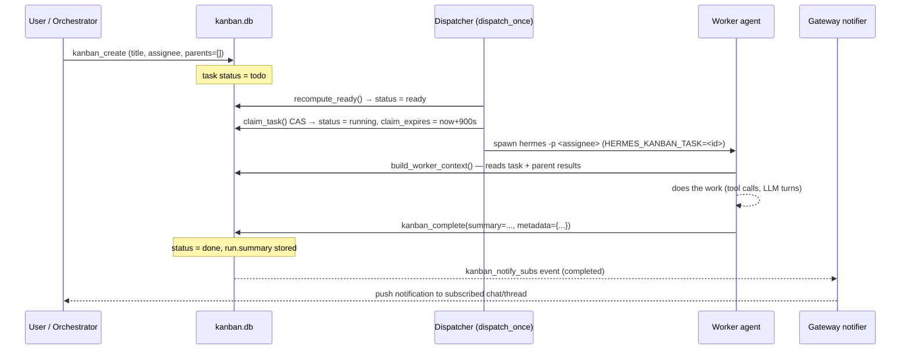
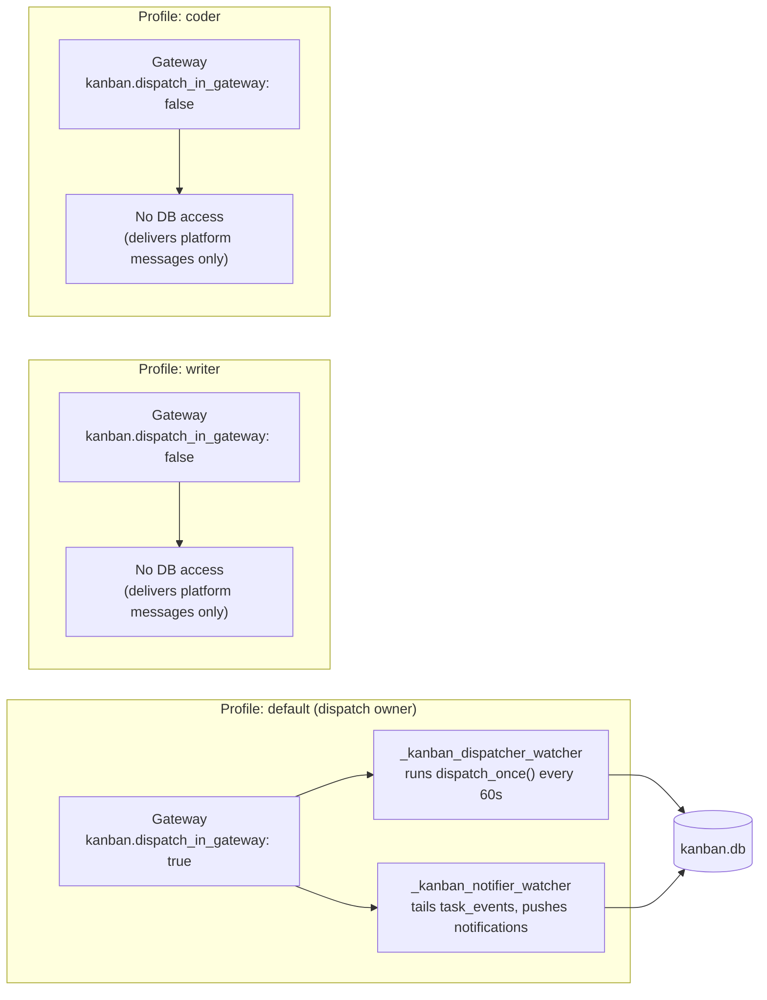

**TL;DR** — Hermes has three ways to delegate work between agents: in-process delegation, kanban dispatch, and swarm creation. This chapter covers the second: kanban dispatch, where tasks live on a persistent board, a dispatcher tick promotes them from `todo` to `ready`, workers claim them atomically (no two workers can grab the same task), and `build_worker_context()` packages parent-task results into the incoming worker's starting prompt. By the end you will understand the full dispatch cycle and be able to create a board, queue tasks, watch them run, and configure multi-gateway deployments correctly.

# Kanban Dispatch — Boards, dispatch_once(), CAS Claim, and Worker Context

There are three mechanisms for multi-agent work in Hermes: **in-process delegation** (calling another agent synchronously in the same process), **kanban dispatch** (persisted async work on a shared board, covered here), and **swarm creation** (fan-out parallel workers with a verifier-synthesizer pipeline). Keeping these separate is important: delegation is synchronous and in-process; kanban is asynchronous, database-backed, and survives gateway restarts.

## What kanban is and where boards live

Think of a **kanban board** as a project-scoped task list where each task is a card moving through columns. In Hermes that metaphor is literally true: every board is a SQLite database, and the columns are task statuses (`triage → todo → ready → running → done`, plus `blocked`, `review`, `scheduled`, `archived` — nine statuses in all, which get their own deep treatment in [the nine-status state machine](../task-lifecycle/nine-status-state-machine.md)).

The status flow we care about most in this chapter is the core dispatch path:

```
todo  →  ready  →  running  →  done
```

A task moves `todo → ready` when all its prerequisite parent tasks are `done`. A worker moves it `ready → running` by claiming it. The worker then calls `kanban_complete` to land it in `done`.

### Board file locations

The **default board** (the one you get without any extra configuration) stores its database at:

```
~/.hermes/kanban.db
```

Every **named board** you create with a slug (for example `my-project`) lives at:

```
~/.hermes/kanban/boards/<slug>/kanban.db
```

So the named board `my-project` would be at `~/.hermes/kanban/boards/my-project/kanban.db`. This path is what we mean by **board isolation**: each named board has its own SQLite file, its own task set, its own dispatcher state. A task on the `my-project` board is completely invisible to a dispatcher running against `another-project`.

You can pin the active board for a shell session with the environment variable `HERMES_KANBAN_BOARD`:

```bash
export HERMES_KANBAN_BOARD=my-project
hermes kanban list
```

Or switch persistently so the CLI remembers across sessions:

```bash
hermes kanban boards switch my-project
```

The dispatcher inherits the board slug from this same resolution chain, so worker spawns, notifications, and the dispatcher all agree on which database to use.

## The dispatcher tick and `dispatch_once()`

Here is the core problem this mechanism solves: tasks arrive on the board at arbitrary times, and their readiness depends on whether their parent tasks have finished. We need something to continuously check: "Are any `todo` tasks now unblocked? If so, promote them and spawn workers." That is exactly what `dispatch_once()` does — it runs one complete tick of the dispatcher.

Inside the gateway, a background coroutine called `_kanban_dispatcher_watcher` (in `gateway/kanban_watchers.py`) runs `dispatch_once()` on an interval. The default interval is 60 seconds, configurable via `kanban.dispatch_interval_seconds` in `~/.hermes/config.yaml`. Each tick is offloaded to a thread (`asyncio.to_thread`) so the SQLite WAL lock never blocks the async event loop.

One tick of `dispatch_once()` performs these steps in order:

1. **Reclaim stale tasks** — tasks whose `claim_expires` timestamp has passed (workers that crashed or timed out without calling `kanban_complete`).
2. **Reclaim crashed workers** — workers whose PID is no longer alive on this host (before the TTL expires).
3. **Promote `todo → ready`** — via `recompute_ready()`, described below.
4. **Spawn workers** — for each `ready` task with an assignee, atomically claim and spawn a `hermes` subprocess via `claim_task()`.



### `recompute_ready()` — dependency-gated promotion

`recompute_ready()` is the promotion engine. For every task currently in `todo` (or `blocked` by a dependency, not by a worker-initiated `kanban_block`), it checks whether all parent tasks are in `done` or `archived`. If so, the task moves to `ready` and a `promoted` event is appended to the task's event log.

There are two cases where `recompute_ready()` will *not* promote a task even when all parents are done:

1. **Sticky block** — the task was explicitly blocked by a worker calling `kanban_block` (the tool records a `"blocked"` event). The dispatcher will not auto-recover this; only an explicit `kanban_unblock` call (or the CLI `hermes kanban unblock`) clears it.
2. **Circuit-breaker** — the task's `consecutive_failures` has hit the effective failure limit (per-task `max_retries` if set, otherwise `kanban.failure_limit` from config, otherwise the system default). This prevents an endlessly-failing task from cycling forever.

For a fresh task with no parents and no prior failures, `recompute_ready()` will promote it on the very first tick after it is created.

## Claiming a task — CAS and the 15-minute TTL

Here is the next problem: in a multi-worker environment (multiple profiles, multiple machines), two workers might see the same `ready` task at the same time and both try to start it. We need an atomic "only one worker wins" operation. That is a **compare-and-swap** (CAS): atomically update the row *only if* it is still in the expected state, so the second worker gets a `None` back and backs off.

`claim_task()` implements this CAS inside a SQLite write transaction:

```sql
-- Simplified view of the CAS update inside claim_task()
UPDATE tasks
   SET status        = 'running',
       claim_lock    = :lock_id,
       claim_expires = :now + :ttl
 WHERE id = :task_id
   AND status = 'ready'
   AND claim_lock IS NULL
```

The `WHERE status = 'ready' AND claim_lock IS NULL` clause is the compare half; the `UPDATE` is the swap. SQLite serialises writers, so exactly one worker's `UPDATE` can see `rowcount = 1`. Every other concurrent attempt sees `rowcount = 0` and gets `None` returned — the task has already been taken.

When the claim succeeds, the function also:

- Opens a new `task_runs` row recording the run start time, the assignee profile, and the claim lock.
- Sets `claim_expires` to `now + DEFAULT_CLAIM_TTL_SECONDS` (15 minutes by default, or `HERMES_KANBAN_CLAIM_TTL_SECONDS` from the environment).
- Appends a `"claimed"` event to the task's event log.

The **15-minute TTL** (`DEFAULT_CLAIM_TTL_SECONDS = 15 * 60`) is there because workers can crash. If a worker dies without calling `kanban_complete` or `kanban_block`, the next `dispatch_once()` tick will see that `claim_expires` has passed, call `release_stale_claims()`, and reset the task back to `ready` so another worker can pick it up.

Workers that genuinely need more than 15 minutes for a single step should call `kanban_heartbeat` periodically. This extends the `claim_expires` timestamp so the dispatcher does not reclaim a legitimately-busy worker:

```bash
# The worker calls this tool (or the CLI) during a long operation
hermes kanban heartbeat --task <task_id> --note "still processing large file"
```

You can also raise the global default via environment variable:

```bash
export HERMES_KANBAN_CLAIM_TTL_SECONDS=3600  # 1-hour claim window
```

## `build_worker_context()` — the handoff document

When the dispatcher spawns a worker, the worker needs to know not just "what is my task" but also "what did the tasks before me produce?" Without this, a synthesizer worker that depends on five researcher tasks would have no way to access their results.

`build_worker_context()` builds a structured text document that the dispatcher injects into the worker's starting context. It includes, in order:

| Section | Content | Cap |
|---|---|---|
| Task header | Title, assignee, status, workspace, branch | — |
| Task body | Opening post / spec (if any) | 8 KB |
| Attachments | Files uploaded to this task (absolute paths) | — |
| Prior attempts | Last 10 closed runs on this task, with summaries | 4 KB per field |
| Parent task results | `run.summary` / `run.metadata` of every `done` parent | 4 KB per field |
| Role history | Last 5 completed runs by the same assignee on *other* tasks | 200 chars per entry |
| Comment thread | Last 30 comments on this task | 2 KB per comment |

The caps keep the prompt bounded even on boards with retry-heavy tasks or heavy comment traffic. If a field exceeds its cap, the text is truncated with a visible `… [truncated, N chars omitted]` marker so the worker knows material was cut.

The parent-task results section is the key handoff mechanism. When the dispatcher promotes task C because its parents A and B are both `done`, `build_worker_context()` pulls the most recent *completed* run summary and metadata from A and B and includes them as:

```
## Parent task results

### <parent-A-id>
<A's run.summary>
_metadata_: `{"changed_files": [...], "findings": [...]}`

### <parent-B-id>
<B's run.summary>
```

This is how pipeline work flows: the researcher writes a summary, the synthesizer reads it without any extra wiring.

### A complete dispatch sequence

Here is a Mermaid diagram showing the full cycle from task creation through completion and notification:



## Worked example — creating a board and watching tasks run

Let's walk through a concrete example. We want to run two researcher tasks in parallel, then a synthesizer task that depends on both.

**Step 1: Create the board (optional — default board always exists)**

```bash
hermes kanban boards create literature-review
hermes kanban boards switch literature-review
```

**Step 2: Create the parallel researcher tasks**

```bash
hermes kanban create \
  --title "Summarise papers on RAG" \
  --assignee researcher \
  --body "Read the three attached PDFs and write a 200-word summary of each."

# Returns: task id e.g. t_abc123

hermes kanban create \
  --title "Summarise papers on fine-tuning" \
  --assignee researcher \
  --body "Read the three attached PDFs and write a 200-word summary of each."

# Returns: t_def456
```

Both tasks start in `todo`. On the next dispatcher tick (within 60 seconds), `recompute_ready()` sees they have no parents, promotes them to `ready`, and the dispatcher spawns a `researcher` worker for each.

**Step 3: Create the synthesizer task that waits for both**

```bash
hermes kanban create \
  --title "Write literature review from researcher summaries" \
  --assignee writer \
  --parents t_abc123 t_def456 \
  --goal \
  --goal-max-turns 15
```

This task starts in `todo` and stays there until both `t_abc123` and `t_def456` reach `done`. When they do, `recompute_ready()` promotes the synthesizer task to `ready`. The dispatcher claims it and spawns the `writer` profile. `build_worker_context()` includes both researchers' summaries automatically — the writer does not need to be told where to look.

**Step 4: Watch progress**

```bash
hermes kanban list --board literature-review
# Shows all tasks with current status

hermes kanban show t_abc123
# Full detail: body, prior attempts, comments, parent results
```

## `goal_mode` — keeping a worker going until the goal is met

Normally a worker gets one conversation session to complete its task. For open-ended cards — "write a literature review" — one session may not be enough. `goal_mode` addresses this: after each turn, an auxiliary model judges whether the worker's output meets the card's title and body description. If the judge says "not done yet", the worker continues in the same session. This repeats up to `goal_max_turns` turns (default 20 per the `kanban_create` schema; configurable per task via `--goal-max-turns N`). If the budget runs out before the judge approves, the task transitions to `blocked` for human review.

`goal_mode` is a per-task flag, not a global config. You set it at creation time with `--goal` on the CLI or `goal_mode: true` in `kanban_create`. We will examine the goal engine's internals in later chapters; for now, think of it as "run until done, but cap the turns."

## `auto_decompose` — turning triage tasks into work graphs

Before the dispatcher spawns workers, it optionally runs an auto-decomposer. A task placed in `triage` status (with `--triage` on creation) is an incompletely-specified card: it has a rough title but no body or breakdown. Each dispatcher tick, if `kanban.auto_decompose` is `true` (the default), the dispatcher calls a decomposer that uses an auxiliary LLM to break triage cards into child `todo` tasks. Up to `kanban.auto_decompose_per_tick` tasks are decomposed per tick (default 3), so a bulk upload of triage tasks is spread across multiple ticks instead of bursting the auxiliary model in one call.

To disable auto-decompose for a board:

```yaml
# ~/.hermes/config.yaml
kanban:
  auto_decompose: false
```

## Multi-gateway configuration

Hermes supports running multiple gateway processes concurrently — one per profile (for example: `default`, `writer`, `admin`, `coder`). Each gateway opens its own connections to platform APIs (Telegram, Discord, etc.). But only one of them should run the kanban dispatcher.

The problem this guards against: if two gateways both run `dispatch_once()` and both connect per-board SQLite databases, you multiply the open file descriptors on each `kanban.db` and amplify WAL `-shm` reader contention. SQLite's WAL (write-ahead log) uses a shared-memory file (`kanban.db-shm`) that all readers and writers coordinate through; more concurrent processes hammering it means more lock contention.

The solution is the **single-dispatcher posture**: exactly one gateway sets `kanban.dispatch_in_gateway: true` (the default). All other gateways set it to `false`.



The config for the non-dispatch gateways:

```yaml
# ~/.hermes/config.yaml  (on writer and coder gateways)
kanban:
  dispatch_in_gateway: false
```

Or use the environment variable as an escape hatch without editing YAML:

```bash
export HERMES_KANBAN_DISPATCH_IN_GATEWAY=false
```

| Gateway role | `dispatch_in_gateway` | Opens per-board DBs? | Runs dispatcher + notifier? |
|---|---|---|---|
| default (dispatch owner) | `true` (default) | yes | yes |
| writer, admin, coder, etc. | `false` | no | no |

Non-dispatch gateways still receive and deliver platform messages; they are not involved with the kanban database at all.

## Edge cases and failure modes

### Crashed or stale worker reclaim

The most common edge case: a worker crashes mid-task (OOM, network drop, SIGKILL) without calling `kanban_complete` or `kanban_block`. The task is left in `running` status with a `claim_expires` in the past.

On the next `dispatch_once()` tick, step 1 calls `release_stale_claims()`. This function finds all `running` tasks whose `claim_expires` has passed and resets them back to `ready` (or `todo` if they have incomplete parents, though in practice a running task's parents are already done). The task is then eligible for `recompute_ready()` and re-spawn on the same tick.

There is also a second reclaim path for a subtler failure mode: a worker whose PID is technically alive but not making observable progress (a logic loop). `detect_crashed_workers()` checks both PID liveness and the `last_heartbeat_at` column. A worker that has not updated its heartbeat for more than one hour (`DEFAULT_CLAIM_HEARTBEAT_MAX_STALE_SECONDS = 60 * 60`) is treated as wedged and reclaimed regardless of PID state. Normal workers keep `last_heartbeat_at` fresh automatically as a side effect of API traffic (the activity bridge updates it on each tool call), so this only fires for genuinely stuck workers.

A freshly-spawned worker gets a 30-second grace period (`DEFAULT_CRASH_GRACE_SECONDS = 30`) during which `detect_crashed_workers()` skips the PID check. This covers the fork-to-`/proc` visibility window where a just-started process may transiently report as not alive.

If a worker exits with the special exit code 75 (`KANBAN_RATE_LIMIT_EXIT_CODE`, which maps to BSD `EX_TEMPFAIL`), the dispatcher treats it as a rate-limit signal, not a failure. The task goes back to `ready` without incrementing `consecutive_failures` — the circuit breaker does not trip on a temporary quota wall.

### Two gateways both set `dispatch_in_gateway: true`

This is the multi-gateway misconfiguration to watch for. If two gateways both have `dispatch_in_gateway: true`, both will run `dispatch_once()` on the same set of board databases. The effects are:

- **Doubled WAL `-shm` contention** — more concurrent writers on each `kanban.db` means more SQLite busy-wait cycles. Hermes sets a long busy timeout (`DEFAULT_BUSY_TIMEOUT_MS = 120_000`, or 2 minutes) to absorb transient contention, but sustained double-dispatching will degrade throughput.
- **Duplicate spawn attempts** — both dispatchers will try to claim and spawn workers for the same `ready` tasks. The CAS in `claim_task()` ensures only one succeeds (the second gets `None` and skips), but the duplicate attempts waste cycles and produce misleading log entries.
- **The fix** — set `kanban.dispatch_in_gateway: false` on all but one gateway. The owning gateway is typically the `default` profile gateway. This is documented in `docs/kanban/multi-gateway.md`.

### `kanban_notify_subs` — closing the human-in-the-loop

When a human submits a task through a chat interface (Telegram, Discord), the gateway creates a row in the `kanban_notify_subs` table recording the platform, `chat_id`, `thread_id`, and the task id. The gateway's notifier watcher tails `task_events` and, when it sees a `completed` or `blocked` event, pushes a message back to the original chat thread. This is how "fire and forget" Telegram requests become "fire and get a reply when done."

```sql
-- Simplified view of kanban_notify_subs schema
CREATE TABLE kanban_notify_subs (
    task_id       TEXT NOT NULL,
    platform      TEXT NOT NULL,   -- e.g. "telegram"
    chat_id       TEXT NOT NULL,
    thread_id     TEXT NOT NULL DEFAULT '',
    user_id       TEXT,
    notifier_profile TEXT,
    created_at    INTEGER NOT NULL,
    last_event_id INTEGER NOT NULL DEFAULT 0,
    PRIMARY KEY (task_id, platform, chat_id, thread_id)
);
```

## Summary of key configuration knobs

| Config key | Env override | Default | What it controls |
|---|---|---|---|
| `kanban.dispatch_in_gateway` | `HERMES_KANBAN_DISPATCH_IN_GATEWAY` | `true` | Whether this gateway runs the dispatcher |
| `kanban.dispatch_interval_seconds` | — | `60` | Dispatcher tick interval in seconds |
| `kanban.max_spawn` | — | none | Concurrency cap: max total running tasks on the board |
| `kanban.max_in_progress` | — | none | Same as max_spawn (per-board in-progress limit) |
| `kanban.failure_limit` | — | system default | Circuit-breaker trip count for consecutive failures |
| `kanban.auto_decompose` | — | `true` | Auto-decompose `triage` tasks each tick |
| `kanban.auto_decompose_per_tick` | — | `3` | Max triage tasks to decompose per tick |
| — | `HERMES_KANBAN_CLAIM_TTL_SECONDS` | `900` (15 min) | Default claim TTL; overrides `DEFAULT_CLAIM_TTL_SECONDS` |
| — | `HERMES_KANBAN_BOARD` | `default` | Active board slug for the current process |

## What we covered

We have now traced the full kanban dispatch cycle: `recompute_ready()` promotes dependency-unblocked tasks; `claim_task()` atomically hands each ready task to exactly one worker via CAS with a 15-minute TTL; `build_worker_context()` packages parent results, retry history, and comments into the worker's starting prompt; and the single-dispatcher posture ensures multi-gateway deployments avoid WAL contention. The edge-case reclaim paths (expired TTL, crashed PID, wedged heartbeat) mean no task is permanently stuck after a worker failure.

For the full list of task statuses and their transition rules, see [the nine-status state machine](../task-lifecycle/nine-status-state-machine.md). For in-process delegation (the synchronous counterpart to kanban), see [In-Process Delegation](./in-process-delegation.md). The dispatcher tick itself and how it fits into the broader autonomy model is covered in [Webhooks and the Dispatcher Tick](../autonomy/webhooks-and-dispatcher-tick.md).

---

← Previous: [In-Process Delegation](./in-process-delegation.md) · Next: [The Nine-Status State Machine](../task-lifecycle/nine-status-state-machine.md) →
