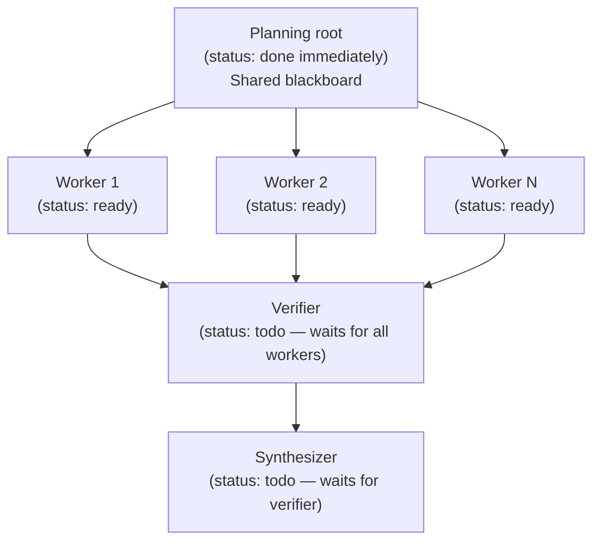
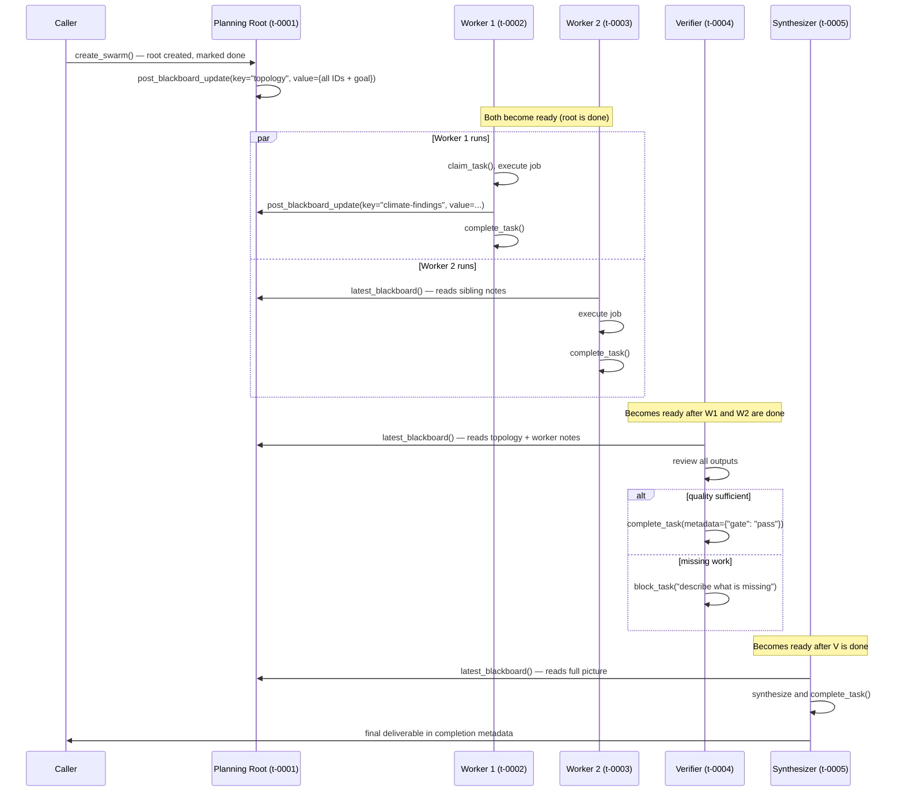

**TL;DR** — `create_swarm()` builds a four-role agent team directly inside the kanban board: a planning root that records the shared topology, parallel specialist workers that run concurrently, a verifier that gates the results, and a synthesizer that assembles the final output. By the end of this chapter you will understand how the swarm topology is structured, how workers coordinate through the shared blackboard, and how to call `create_swarm()` with your own worker specs.

# Swarm Topologies with create_swarm()

## Three mechanisms — and where swarms fit

Hermes gives you three distinct ways to coordinate multiple agents. A brief map before we dive in:

| Mechanism | What it does | Best for |
|---|---|---|
| **Delegate** (`dispatch_once` / delegate tool) | A parent agent spawns one child for a self-contained sub-task | One focused job that returns a result |
| **Kanban board dispatch** | A board of tasks; idle workers claim and execute them | Independent tasks that can run in any order |
| **Swarm topology** (`create_swarm()`) | A *structured team* — plan → parallel work → verify → synthesize | Work that needs parallel execution followed by quality-gating and integration |

This chapter covers the third mechanism. If you are not yet familiar with the kanban board — the underlying task store that all three mechanisms share — read [Kanban Board Dispatch](./kanban-dispatch.md) first: a quick recap follows below, but that page gives the full picture.

**Prerequisite recap:** The *kanban board* is a SQLite-backed task queue. Tasks move through statuses (`todo`, `ready`, `running`, `blocked`, `done`, and others). Workers claim tasks using a compare-and-swap lock and release them when done. A swarm is a *small task graph* written into this same board — so everything the board already provides (dashboards, notifications, dispatcher, audit log) works for swarm tasks without any new service. For the full board mechanics, see [Kanban Board Dispatch](./kanban-dispatch.md).

---

## The problem a swarm solves

Suppose you ask Hermes to research a topic across five domains and produce a synthesis report. You could put five tasks on the board and let workers pick them up independently — but that gives you no structure: there is no point at which someone reviews all five outputs before they are merged, and there is no single place for workers to share discoveries across domains.

What you need is a *team with defined roles*:

1. A **plan** — a shared record of what the team is doing and who is doing what.
2. **Parallel workers** — specialists running concurrently, each on their own slice of the work.
3. A **verifier** — one reviewer who reads every worker's output and either passes the gate or demands more work.
4. A **synthesizer** — one integrator who turns verified outputs into the final deliverable, and only runs after the verifier has passed.

A flat board of independent tasks cannot express this shape — nothing enforces the verify-before-synthesize dependency, and there is no shared communication channel between workers. That is exactly what `create_swarm()` provides.

---

## The topology `create_swarm()` builds

`create_swarm()` writes a small task graph into the kanban board in one atomic call. The graph always has this shape:



Each node in this diagram is a *kanban task*. The arrows represent parent–child dependencies: a child task becomes `ready` only after its parents reach `done`. So:

- Workers (`W1`…`WN`) become `ready` as soon as the root is created (the root is marked `done` immediately during setup).
- The verifier (`V`) stays `todo` until **all** workers are `done`.
- The synthesizer (`S`) stays `todo` until the verifier is `done`.

### The four roles, in plain terms

**Planning root** — A task that is marked `done` the moment the swarm is created. It exists not for execution but as the *anchor* for the whole topology. Every worker, verifier, and synthesizer holds a reference to its ID. The root's comment stream becomes the shared blackboard (more on this below).

**Parallel workers** — One task per `SwarmWorkerSpec` you supply. Each worker runs the job described by its `title`, `body`, and `profile` (the agent identity that will claim it). Workers run *concurrently* — because they are all `ready` at the same time, multiple gateway dispatchers can pick them up in parallel.

**Verifier** — A single task whose `parents` list contains every worker ID. It cannot start until every worker has completed. Its built-in body instructs it to review all worker handoffs and blackboard updates, and to complete with `{"gate": "pass"}` in its metadata only when the evidence is sufficient — otherwise it blocks with a description of what is missing.

**Synthesizer** — A single task whose only parent is the verifier. It assembles the final deliverable from the verified outputs and must not start before the gate passes.

---

## The swarm blackboard

Workers run in parallel. That means they cannot call each other's functions or share in-memory state — they may run in different processes or on different machines. So how do they coordinate? Through the **swarm blackboard**.

The blackboard is a *shared scratch space* all swarm members can read and write: it is the sequence of structured comments on the root task, each prefixed with `[swarm:blackboard]`. Because those comments are rows in the same SQLite database all workers share, any worker can post a finding for siblings to discover.

Here is what a blackboard comment looks like on disk:

```
[swarm:blackboard] {"key": "topology", "value": {"root_id": "abc", "worker_ids": ["def", "ghi"], "verifier_id": "jkl", "synthesizer_id": "mno", "goal": "..."}}
```

The prefix is the string literal `"[swarm:blackboard] "` (defined as `BLACKBOARD_PREFIX` in `kanban_swarm.py`). Everything after it is a JSON object with two keys: `key` (a string name for this entry) and `value` (any JSON-serialisable data).

`create_swarm()` always writes the first blackboard entry itself: the `"topology"` key, which records all four IDs and the goal text. Workers can then post their own entries using `post_blackboard_update()`, and any member can read the merged state with `latest_blackboard()`.

### How `latest_blackboard()` merges entries

Later comments *replace* earlier values for the same key. So if worker 1 posts `{"key": "summary", "value": "draft"}` and later posts `{"key": "summary", "value": "revised"}`, the second wins. The function also records the `_authors` map — which author wrote the winning value for each key — so any reader can trace where a value came from.

### The swarm context injected into every task body

When `create_swarm()` creates each task (workers, verifier, synthesizer), it appends a short protocol block to the task body:

```
## Swarm protocol
- Swarm root / shared blackboard: `<root_id>`.
- Read sibling/parent handoffs from Kanban context before working.
- Put machine-readable facts in completion metadata.
- Put cross-worker notes on the root task using structured comments.
- Goal: <goal>
```

This tells every agent exactly where the blackboard is and how to use it — without any out-of-band communication.

---

## `SwarmWorkerSpec` — describing one parallel worker

Before we call `create_swarm()`, we need to describe each worker. `SwarmWorkerSpec` is a frozen dataclass — you create one per parallel slot:

```python
# Simplified view — shows all fields from SwarmWorkerSpec (kanban_swarm.py l.30)
from hermes_cli.kanban_swarm import SwarmWorkerSpec

worker = SwarmWorkerSpec(
    profile="researcher",        # which agent profile claims this task
    title="Research domain A",   # the task title shown on the board
    body="Investigate X and summarise findings.",  # detailed instructions
    skills=["web-search"],       # optional toolset skills to attach
    priority=0,                  # task priority (higher = claimed sooner)
    max_runtime_seconds=None,    # optional hard deadline in seconds
)
```

| Field | Type | Required | Meaning |
|---|---|---|---|
| `profile` | `str` | Yes | The agent profile (worker identity) that will be assigned this task |
| `title` | `str` | Yes | Short task title visible on the board |
| `body` | `str` | Yes | Full task instructions (the swarm protocol block is appended automatically) |
| `skills` | `list[str]` | No | Extra skill names to attach to this worker's task |
| `priority` | `int` | No | Task priority; defaults to `0` |
| `max_runtime_seconds` | `int \| None` | No | Hard time limit for this worker; `None` = no limit |

---

## `SwarmCreated` — what comes back

`create_swarm()` returns a `SwarmCreated` dataclass holding the four IDs you need to track the swarm:

```python
# From SwarmCreated (kanban_swarm.py l.42)
@dataclass(frozen=True)
class SwarmCreated:
    root_id: str           # the planning root task (also the blackboard anchor)
    worker_ids: list[str]  # one ID per SwarmWorkerSpec you passed in
    verifier_id: str       # the verifier task
    synthesizer_id: str    # the synthesizer task
```

You can also call `.as_dict()` on it to get a plain dictionary — the same shape that is stored in the `"topology"` blackboard entry.

---

## Calling `create_swarm()` — a worked example

Let's say we want to research three topics in parallel, have someone verify the results, and then produce a final report. Here is how we call `create_swarm()`:

```python
import sqlite3
from hermes_cli.kanban_swarm import SwarmWorkerSpec, create_swarm

conn = sqlite3.connect("~/.hermes/kanban.db")  # your kanban database connection

workers = [
    SwarmWorkerSpec(
        profile="researcher-alpha",
        title="Research: climate policy",
        body="Summarise the three most recent international agreements on climate policy.",
        skills=["web-search"],
    ),
    SwarmWorkerSpec(
        profile="researcher-beta",
        title="Research: economic impact",
        body="Analyse the projected economic cost of the agreements found by the climate-policy worker.",
        skills=["web-search", "calculator"],
    ),
]

result = create_swarm(
    conn,
    goal="Produce a combined brief on climate policy and its economic impact.",
    workers=workers,
    verifier_assignee="senior-reviewer",   # profile that claims the verifier task
    synthesizer_assignee="report-writer",  # profile that claims the synthesizer task
    root_title="Swarm: climate brief",     # optional; defaults to first 80 chars of goal
    verifier_title="Verify research outputs",
    synthesizer_title="Write final brief",
    created_by="swarm-orchestrator",
    priority=1,
)

print(result.root_id)        # e.g. "t-0001"
print(result.worker_ids)     # e.g. ["t-0002", "t-0003"]
print(result.verifier_id)    # e.g. "t-0004"
print(result.synthesizer_id) # e.g. "t-0005"
```

After this call, the kanban board contains five tasks. Let's trace through what happens:

### Step 1 — The root task is created and immediately completed

`create_swarm()` first creates the planning root task (status `done` right away). It then posts the `"topology"` entry to the blackboard, recording all four IDs and the goal. Every subsequent task will have the root ID in its protocol block so agents can find the blackboard.

### Step 2 — Worker tasks become `ready`

Because the root is immediately `done`, its child tasks — the two worker tasks — transition from `todo` to `ready`. The dispatcher can now claim them and assign each to its `profile` agent. Both workers run concurrently: they do not wait for each other.

### Step 3 — Workers read the blackboard and post findings

Each worker's task body contains the protocol block:

```
## Swarm protocol
- Swarm root / shared blackboard: `t-0001`.
- Read sibling/parent handoffs from Kanban context before working.
- Put machine-readable facts in completion metadata.
- Put cross-worker notes on the root task using structured comments.
- Goal: Produce a combined brief on climate policy and its economic impact.
```

If the economic-impact worker needs to reference a fact the climate-policy worker discovered, it can read `latest_blackboard(conn, "t-0001")` and look for a key the sibling posted.

### Step 4 — Verifier waits, then gates

Once both workers are `done`, the verifier's parents are satisfied and it becomes `ready`. The verifier reads all worker completion metadata and blackboard entries, then completes with `{"gate": "pass"}` if quality is sufficient. If not, it blocks and describes what is missing.

### Step 5 — Synthesizer runs last

The synthesizer's single parent is the verifier. It only becomes `ready` after the verifier reaches `done` with its gate result. It reads the verified outputs and writes the final deliverable.

---

## Sequence diagram — the full lifecycle



---

## Idempotency — safe to call twice

`create_swarm()` accepts an optional `idempotency_key`. If you pass the same key twice (for example, if your caller crashes and retries), the second call detects the existing root via the key, reads the `"topology"` from the blackboard, and returns the same `SwarmCreated` without duplicating any tasks. This makes it safe to embed in at-least-once retry loops.

---

## Workers can use different profiles (multi-profile swarm)

Each `SwarmWorkerSpec.profile` is independent — you can give each worker a completely different agent identity with different toolsets or model configurations. This is how you build a *multi-profile swarm*: one worker is a `web-researcher` profile, another is a `code-analyst`, another is a `data-interpreter`. The verifier and synthesizer can also be distinct profiles.

For a detailed walkthrough of setting up multiple profiles and routing tasks to them, see [Multi-Profile Swarm](../scenarios/multi-profile-swarm.md). For general advice on when to choose swarms over delegates or plain kanban, see [Best Practices](../design/best-practices.md).

---

## Edge cases and failure modes

### A worker fails before the verifier can run

If a worker's agent crashes, exceeds its `max_runtime_seconds`, or its claim expires (the default claim TTL is 15 minutes, tracked as `DEFAULT_CLAIM_TTL_SECONDS` in `kanban_db.py`), the dispatcher reclaims the task and re-queues it as `ready`. The worker task eventually completes — or, if it keeps failing, it blocks. In the blocking case the verifier's parents are never all satisfied, so the verifier stays `todo` indefinitely.

**What to do:** inspect the blocked worker task on the board (`hermes kanban list`), read its comment history, fix the underlying problem, and unblock it manually or re-create the swarm with a corrected spec.

### The verifier fails the gate

If the verifier determines the outputs are insufficient, it completes with a block (not a pass). The synthesizer's parent is not yet `done` in the passing sense — the verifier must complete normally with `{"gate": "pass"}` for the synthesizer to become `ready`.

<!-- GAP: the exact status transition when a verifier blocks (vs completes) is not fully specified in kanban_swarm.py — the verifier_body instructs it to "block with exact missing work" but the code does not enforce a specific status for the blocked case; source silent on what status the verifier task takes when it blocks the gate -->

**What to do:** read the verifier's completion note, fix the identified gaps (possibly by re-assigning worker tasks or posting corrections to the blackboard), and then re-run or manually complete the verifier.

### Workers run in parallel — blackboard reads may see partial state

When two workers start at nearly the same time, `latest_blackboard()` from one worker may return an empty or partial merge (the other worker has not posted yet). This is expected: the blackboard is *eventually consistent* across the parallel execution window. Workers should be designed to operate independently on their own slice and only use the blackboard for *supplemental* cross-worker facts, not as a hard dependency.

The verifier's role is precisely to catch any gaps caused by partial state before synthesis begins.

### Recovering the topology after a restart

If the orchestrator process restarts, it can recover the full topology by calling `latest_blackboard(conn, root_id)` and reading the `"topology"` key. As long as the root task ID is known, the complete graph of IDs can be reconstructed from the blackboard.

---

## Quick reference — `create_swarm()` parameters

```python
def create_swarm(
    conn: sqlite3.Connection,
    *,
    goal: str,                                  # required — the swarm's objective
    workers: Iterable[SwarmWorkerSpec],         # required — at least one
    verifier_assignee: str,                     # required — profile for verifier
    synthesizer_assignee: str,                  # required — profile for synthesizer
    root_title: Optional[str] = None,           # defaults to first 80 chars of goal
    verifier_title: str = "Verify swarm outputs",
    synthesizer_title: str = "Synthesize swarm outputs",
    tenant: Optional[str] = None,
    created_by: str = "swarm-orchestrator",
    workspace_kind: str = "scratch",
    workspace_path: Optional[str] = None,
    priority: int = 0,
    idempotency_key: Optional[str] = None,      # safe-retry key
) -> SwarmCreated
```

| Parameter | Required | Default | Notes |
|---|---|---|---|
| `goal` | Yes | — | Full description of what the swarm should achieve |
| `workers` | Yes | — | At least one `SwarmWorkerSpec`; raises `ValueError` if empty |
| `verifier_assignee` | Yes | — | Profile name for the verifier task |
| `synthesizer_assignee` | Yes | — | Profile name for the synthesizer task |
| `root_title` | No | First 80 chars of goal, prefixed `"Swarm: "` | Custom title for the root task |
| `verifier_title` | No | `"Verify swarm outputs"` | Title for the verifier task |
| `synthesizer_title` | No | `"Synthesize swarm outputs"` | Title for the synthesizer task |
| `created_by` | No | `"swarm-orchestrator"` | Logged as the creator of all tasks |
| `workspace_kind` | No | `"scratch"` | Workspace type (`"scratch"`, `"worktree"`, or `"dir"`) |
| `priority` | No | `0` | Base priority for all tasks (individual workers can override with `SwarmWorkerSpec.priority`) |
| `idempotency_key` | No | `None` | If set, a second call with the same key returns the existing swarm |

---

## Choosing between the three mechanisms

| Question | Choose |
|---|---|
| "I need one focused sub-task done and returned" | **Delegate** — `dispatch_once()` or the delegate tool |
| "I have a list of independent tasks; order doesn't matter" | **Kanban board dispatch** |
| "I need parallel execution, then a review gate, then a merge" | **Swarm** — `create_swarm()` |
| "Some workers need different models or tool profiles" | **Swarm** with per-worker `profile` |
| "I need the topology to survive a process restart" | **Swarm** — the blackboard persists in SQLite |

---

← Previous: [Kanban Board Dispatch](./kanban-dispatch.md) · Next: [In-Process Delegation](./in-process-delegation.md) →
