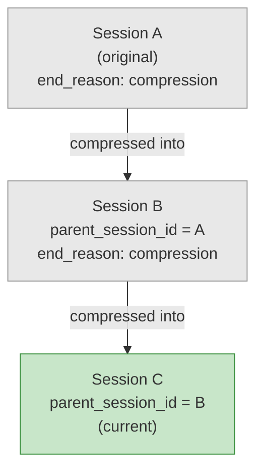

**TL;DR** — When Hermes compresses a long conversation, it does not discard the old session — it ends the old row in SQLite and creates a new one linked back to the original via `parent_session_id`, forming a walkable chain. A per-session lock with a 300-second TTL ensures only one compressor works at a time, and if the process crashes the lock self-clears. On filesystems like NFS and SMB that cannot support WAL mode, Hermes detects the failure automatically and falls back to `journal_mode=DELETE` so the database keeps working at all.

# Compression Chains, Session Splitting, and WAL Fallback

Conversation compression is explored at the memory level in the [Context Compressor and LCM chapter](../memory/context-compressor-and-lcm.md) — that page covers *when* compression fires and what the summariser does with the message history. This chapter is the persistence-side deep dive: what happens inside `state.db` when compression triggers, how the session history is preserved across that boundary, and how the database itself stays alive on filesystems that cannot support SQLite's preferred write-ahead logging.

Two problems drive everything here.

1. **When we compress, where does the old history go?** We cannot overwrite the conversation directly. The old messages need to remain retrievable, the new session must know its ancestry, and two concurrently running compressors must not both try to rewrite the same session at the same moment.

2. **SQLite's WAL mode does not work everywhere.** NFS and SMB home directories are common in team environments and Docker setups. On those filesystems, enabling WAL causes an immediate error. Hermes needs a safe fallback so the database does not stop working.

Let us walk through each problem in turn.

---

## Part 1 — The Session Chain

### The problem with compressing in place

A Hermes session is a row in the `sessions` table inside `~/.hermes/state.db` (on Linux and macOS; Windows uses `%LOCALAPPDATA%\hermes\state.db`). The `messages` table holds every turn of the conversation, all keyed to that session row by `session_id`.

If we replaced those messages outright with the compressed summary, we would lose the original history irreversibly. If we modified the session row in place, we would have no record that a compression boundary ever occurred — making it impossible to know that certain messages were summarised rather than original. And if two background tasks both decided to compress at the same moment, they could each produce a divergent rewrite of the same session.

The solution Hermes uses is **session splitting with lineage tracking**.

### What session splitting looks like

When compression fires, the sequence — drawn directly from `compress_context()` in `agent/conversation_compression.py` — is:

1. End the current session by calling `session_db.end_session(agent.session_id, "compression")`. This marks the row with `end_reason = 'compression'` and sets `ended_at` to the current time. The old messages are still there; nothing is deleted.

2. Generate a fresh `session_id` (a timestamp + UUID fragment, e.g. `20260610_142315_a3f82b`).

3. Call `session_db.create_session(session_id=<new_id>, ..., parent_session_id=<old_id>)`. The new session row in the `sessions` table carries `parent_session_id` pointing to the old session.

4. Write the compressed messages and the new system prompt into the new session.

The old session row and all its original messages are untouched. The new session begins fresh, with the summary as its opening context, and its `parent_session_id` column holds the old session's id.

This creates a **chain**. If we compress again later, the same process repeats: the current session ends, a newer session begins with its `parent_session_id` pointing back to the one just ended. Walking up the chain always leads back to the original session that started the conversation.

The `sessions` table schema, from `hermes_state.py`, shows this directly:

```sql
-- Simplified view of the relevant sessions columns
CREATE TABLE IF NOT EXISTS sessions (
    id TEXT PRIMARY KEY,
    source TEXT NOT NULL,
    parent_session_id TEXT,          -- links back to the session before compression
    started_at REAL NOT NULL,
    ended_at REAL,
    end_reason TEXT,                 -- 'compression' for compression-split sessions
    ...
    FOREIGN KEY (parent_session_id) REFERENCES sessions(id)
);
```

The index `idx_sessions_parent` on `parent_session_id` makes walking the chain efficient in both directions.

Here is a diagram of what this looks like across two compression events:



Session A still has all its original messages. Session B has the compressed summary of A plus whatever happened in B before it too was compressed. Session C is the live session.

### The compression-lock race

Now we have a new problem. A Hermes agent can have more than one execution path active at the same time — the primary conversation loop and a background review fork (from `agent/background_review.py`). Both share the same `session_id` at the start of their work. If both check the token count at roughly the same moment and both decide to compress, each will try to end the current session and create its own new child session parented to the same original. The gateway tracks one rotation; the other child becomes an orphan that silently accumulates writes without ever appearing in session history.

The fix is an **atomic, database-backed compression lock** stored in `state.db`.

### The compression_locks table

`hermes_state.py` defines this table alongside `sessions` and `messages`:

```sql
CREATE TABLE IF NOT EXISTS compression_locks (
    session_id TEXT PRIMARY KEY,
    holder TEXT NOT NULL,
    acquired_at REAL NOT NULL,
    expires_at REAL NOT NULL
);
```

Each row represents a live lock claim. `session_id` is the primary key, so only one holder can own the lock for a given session at a time. `holder` is a diagnostic string that identifies the owner process — formatted as `pid=<N>:tid=<N>:agent=<hex>:nonce=<8hex>` — built by `_compression_lock_holder()` in `conversation_compression.py`. The `pid:tid` prefix lets an operator (or Hermes itself) tell a live lock from a stale one belonging to a crashed process.

`expires_at` is the crucial field. It is set to `time.time() + 300.0` when the lock is acquired. That is the **300-second TTL**.

### Acquiring the lock

`SessionDB.try_acquire_compression_lock()` in `hermes_state.py` performs a single atomic transaction:

```python
# Simplified view of try_acquire_compression_lock()
def try_acquire_compression_lock(
    self,
    session_id: str,
    holder: str,
    ttl_seconds: float = 300.0,  # <-- confirmed default: 300s
) -> bool:
    now = time.time()
    expires_at = now + ttl_seconds

    def _do(conn):
        # Step 1: Reclaim any expired lock for this session_id.
        conn.execute(
            "DELETE FROM compression_locks "
            "WHERE session_id = ? AND expires_at < ?",
            (session_id, now),
        )
        # Step 2: Try to INSERT our claim.
        conn.execute(
            "INSERT OR IGNORE INTO compression_locks "
            "(session_id, holder, acquired_at, expires_at) "
            "VALUES (?, ?, ?, ?)",
            (session_id, holder, now, expires_at),
        )
        # Step 3: Read back — we own the lock only if our holder is stored.
        row = conn.execute(
            "SELECT holder FROM compression_locks WHERE session_id = ?",
            (session_id,),
        ).fetchone()
        return row is not None and row[0] == holder

    return bool(self._execute_write(_do))
```

The three-step sequence — delete expired, insert, read back — runs inside a single `BEGIN IMMEDIATE` transaction. SQLite serialises writes, so the whole thing is atomic against competing callers. If two paths race, one inserts first and owns the lock; the second's `INSERT OR IGNORE` silently no-ops because the `PRIMARY KEY` is already occupied, and the read-back confirms the wrong holder, so it returns `False`.

A path that gets `False` does not proceed with compression. It logs a warning and returns the messages unchanged. The auto-compress loop in the conversation runner detects the no-op (`len(returned) == len(input)`) and stops retrying for that cycle.

### Releasing the lock

After compression finishes — after the old session is ended, the new session created, and all post-rotation bookkeeping (memory provider notification, file dedup reset, log context update) is complete — `_release_lock()` calls `release_compression_lock()`:

```python
# Simplified view of release_compression_lock()
def release_compression_lock(self, session_id: str, holder: str) -> None:
    def _do(conn):
        conn.execute(
            "DELETE FROM compression_locks "
            "WHERE session_id = ? AND holder = ?",
            (session_id, holder),
        )
    self._execute_write(_do)
```

Notice the lock is keyed on the **old** `session_id` — the one the agent held at the start of compression, before the rotation. The new session id, by definition, has no lock; any future compressor that targets it will acquire the lock against that new id.

The `holder` check prevents a late-returning, timeout-recovered path from deleting a fresh lock that a newer compressor holds.

Here is the full lock lifecycle as a state diagram:

```mermaid
stateDiagram-v2
    [*] --> Unlocked : no row in compression_locks
    Unlocked --> Acquiring : path calls try_acquire_compression_lock()
    Acquiring --> Held : INSERT succeeds; path owns lock
    Acquiring --> Unlocked : INSERT silently no-ops (other holder)\npath returns messages unchanged
    Held --> Compressing : path proceeds with compress() + session rotation
    Compressing --> Released : rotation complete; release_compression_lock() deletes row
    Released --> [*]

    Held --> StaleLock : process crashes before release
    StaleLock --> Unlocked : TTL expires (≤ 300s later)\nnext acquire call deletes the expired row
```



### What happens if the compressor crashes

If the process holding the lock crashes — power loss, OOM kill, unhandled exception — it never calls `release_compression_lock()`. The row stays in `compression_locks`. Without the TTL, this would permanently block all future compression for that session.

With the TTL, the next process that calls `try_acquire_compression_lock()` for the same `session_id` runs the `DELETE ... WHERE expires_at < now` step first. If 300 seconds have passed since the crash, the stale row is deleted and the new caller gets the lock cleanly. No operator intervention needed.

### Worked example — two compressors racing

Let us say the primary conversation loop and a background review fork both check the token count at time `T` and both decide to compress session `sess_abc123`.

1. **Primary** calls `try_acquire_compression_lock("sess_abc123", "pid=1001:tid=8:agent=7f4a:nonce=deadbeef")`.
   - The `compression_locks` table has no row for `sess_abc123`.
   - The DELETE finds nothing. The INSERT succeeds. The SELECT confirms the holder is `pid=1001:...`.
   - **Returns `True`**. Primary proceeds with compression.

2. **Background fork** calls `try_acquire_compression_lock("sess_abc123", "pid=1001:tid=12:agent=7f4b:nonce=cafebabe")` (different thread id, different nonce).
   - The DELETE finds no *expired* row (the lock was just inserted with `expires_at = T + 300`).
   - The INSERT is an `OR IGNORE` — the row already exists with `sess_abc123` as primary key. No-op.
   - The SELECT returns holder `pid=1001:tid=8:...` — not the fork's holder string.
   - **Returns `False`**. The fork logs a warning and returns the original messages unchanged.

3. Primary finishes compression, creates session `sess_xyz789` with `parent_session_id = "sess_abc123"`, then calls `release_compression_lock("sess_abc123", "pid=1001:tid=8:...")`.
   - The row is deleted.

The chain grows by exactly one node. No orphan session.

---

## Part 2 — WAL Fallback on Incompatible Filesystems

### What WAL mode is and why it matters

SQLite (the database engine behind `state.db` and `kanban.db`) supports several *journal modes* — the mechanism it uses to handle writes safely. The default mode is called `DELETE`: before overwriting a page, SQLite writes the old content to a rollback journal file and deletes that file when the transaction commits.

**WAL mode** — Write-Ahead Log — is a more modern approach. Instead of a rollback journal, new pages are appended to a separate `-wal` file. Readers can read the last committed snapshot from the main database file while a writer is appending to the WAL. This gives you **concurrent readers + one writer** without readers blocking on writes. Hermes needs this because multiple processes (CLI, gateway, dashboard) can all read session data simultaneously while the conversation loop is writing.

Hermes sets WAL mode at database open time via the call `apply_wal_with_fallback(self._conn, db_label="state.db")` in `SessionDB.__init__()`.

### The problem: WAL does not work on network filesystems

WAL mode requires two OS-level primitives:

- **Shared memory (`mmap`)** — SQLite creates a `-shm` sidecar file and uses it as a shared region across processes. Multiple readers coordinate which WAL pages to include in their snapshot via this shared memory.
- **`fcntl` byte-range locks** — used to synchronise readers and the checkpointer.

Network filesystems — **NFS**, **SMB/CIFS**, and some **FUSE** mounts — often do not support these primitives reliably. When Hermes tries to enable WAL on an NFS-mounted home directory, SQLite raises:

```
sqlite3.OperationalError: locking protocol
```

The error string `"locking protocol"` is SQLite's `SQLITE_PROTOCOL` code — it means the shared-memory coordination protocol failed.

If Hermes propagated that error, every feature backed by `state.db` — `/resume`, `/history`, `/branch`, the kanban dispatcher — would break silently. The user would see a bare "Session database not available" error with no explanation of why.

### The fallback: journal_mode=DELETE

`apply_wal_with_fallback()` in `hermes_state.py` handles this:

```python
# Simplified view of apply_wal_with_fallback()
def apply_wal_with_fallback(
    conn: sqlite3.Connection,
    *,
    db_label: str = "state.db",
) -> str:
    """Set journal_mode=WAL, falling back to DELETE on failure.
    Returns the journal mode actually set: 'wal' or 'delete'.
    """
    # First, check if WAL is already active (fast path for reconnects).
    try:
        current = conn.execute("PRAGMA journal_mode").fetchone()
        if current and current[0] == "wal":
            return "wal"
    except sqlite3.OperationalError:
        pass

    # Attempt to enable WAL.
    try:
        conn.execute("PRAGMA journal_mode=WAL")
        return "wal"
    except sqlite3.OperationalError as exc:
        msg = str(exc).lower()
        # Only catch the filesystem-incompatibility errors.
        # Unrelated errors (e.g. permission denied) re-raise normally.
        if not any(marker in msg for marker in ("locking protocol", "not authorized")):
            raise
        # Safety guard: if another process already set WAL on-disk,
        # do not downgrade it — raise instead.
        existing = _on_disk_journal_mode(conn)
        if existing == "wal":
            raise
        # Log one WARNING per process per db_label, then switch to DELETE.
        _log_wal_fallback_once(db_label, exc)
        conn.execute("PRAGMA journal_mode=DELETE")
        return "delete"
```

Two markers trigger the fallback:

| Marker | Meaning |
|---|---|
| `"locking protocol"` | `SQLITE_PROTOCOL` — NFS or SMB cannot coordinate `fcntl` byte-range locks |
| `"not authorized"` | Some FUSE mounts block the WAL pragma outright |

The function returns the string `"wal"` or `"delete"` so callers can log or report the actual mode in use.

### The tradeoff: what you lose with DELETE mode

| Property | WAL mode | DELETE (fallback) mode |
|---|---|---|
| Concurrent reads during writes | Yes — readers use last committed snapshot | No — readers block while a write transaction is open |
| Write performance | Higher — appends to WAL file | Lower — must write rollback journal before each write |
| Works on NFS/SMB/FUSE | Unreliable or broken | Yes — no shared memory needed |
| `-wal` and `-shm` sidecar files | Present | Absent |

In practice, on a busy gateway handling multiple platform connections, DELETE mode creates noticeable contention: a Telegram message arriving at the same moment the CLI writes a turn can cause the reader to wait. For most single-user setups on network storage, the latency is acceptable. For high-throughput multi-gateway deployments, the recommendation is to move `~/.hermes/` to local storage.

### Deduplication: one warning per process

One subtlety: `kanban_db.connect()` in `hermes_cli/kanban_db.py` opens a fresh connection on every kanban operation. On an NFS mount, that could mean hundreds of WAL-fallback attempts per hour — and hundreds of identical warnings in `errors.log`. 

`apply_wal_with_fallback()` uses a module-level set, `_wal_fallback_warned_paths`, to deduplicate:

```python
# Module-level state in hermes_state.py
_wal_fallback_warned_paths: set[str] = set()
_wal_fallback_warned_lock = threading.Lock()

def _log_wal_fallback_once(db_label: str, exc: Exception) -> None:
    with _wal_fallback_warned_lock:
        if db_label in _wal_fallback_warned_paths:
            return
        _wal_fallback_warned_paths.add(db_label)
    logger.warning(
        "%s: WAL journal_mode unsupported on this filesystem (%s) — "
        "falling back to journal_mode=DELETE ...",
        db_label, exc,
    )
```

`state.db` and `kanban.db` each get their own `db_label`, so both databases log their first warning independently, but neither floods the log on subsequent connections.

### Worked example — NFS-mounted home

Imagine you store your Hermes home in an NFS share:

```bash
export HERMES_HOME=/mnt/nfs-share/hermes-data
hermes chat
```

At startup, `SessionDB.__init__()` calls `apply_wal_with_fallback(conn, db_label="state.db")`. SQLite tries `PRAGMA journal_mode=WAL`. The NFS server returns a locking-protocol error. The fallback function catches it, confirms `state.db` is not already in WAL mode on disk, logs exactly one WARNING:

```
state.db: WAL journal_mode unsupported on this filesystem
(locking protocol) — falling back to journal_mode=DELETE
(slower rollback-journal mode; reduces concurrency but works on
NFS/SMB/FUSE). See https://www.sqlite.org/wal.html for details.
This warning fires once per process per database.
```

Then it runs `PRAGMA journal_mode=DELETE` and returns `"delete"`. The session opens normally. All features work — just with readers blocking during writes.

The user-facing slash commands (like `/resume` or `/history`) also call `format_session_db_unavailable()` if the DB fails to open, which includes the NFS hint in the error message:

```
Session database not available: locking protocol
(state.db may be on NFS/SMB/FUSE — see https://www.sqlite.org/wal.html).
```

### Edge case: database already in WAL mode on disk

There is a safety guard in `apply_wal_with_fallback()`. If a different process (perhaps one running on local storage or WSL2) already set `journal_mode=WAL` on the database file, downgrading to DELETE could corrupt the WAL file that other process is using. The function reads the on-disk journal mode first via `_on_disk_journal_mode()`:

```python
def _on_disk_journal_mode(conn: sqlite3.Connection) -> Optional[str]:
    try:
        row = conn.execute("PRAGMA journal_mode").fetchone()
    except sqlite3.OperationalError:
        return None
    ...
    return str(mode).strip().lower()
```

If the on-disk mode is already `"wal"`, the function re-raises the original `OperationalError` rather than silently downgrading. This surfaces the conflict so the operator can investigate — for example, a misconfigured dual-process setup where one machine is on NFS and another shares the same `state.db` via a network path with a process that set WAL.

---

## Putting It Together — Two Failure Scenarios

### Scenario 1: crashed compressor leaving a stale lock

1. Session `sess_abc123` has 85,000 tokens. The conversation loop acquires the compression lock with `expires_at = now + 300`.
2. The machine runs out of memory. The process is killed mid-rotation, before `release_compression_lock()` runs.
3. The lock row stays in `compression_locks` with `expires_at = T + 300`.
4. Within a few seconds, Hermes restarts (via the gateway or a new CLI session). The user continues the conversation.
5. The token count is still high. The new process attempts compression and calls `try_acquire_compression_lock("sess_abc123", ...)`.
6. Inside the transaction: `DELETE FROM compression_locks WHERE session_id = ? AND expires_at < now`. If 300 seconds have passed since the crash, the stale row is deleted. The INSERT succeeds. Compression proceeds.
7. If fewer than 300 seconds have passed, the lock is still unexpired and the new process waits. At the 300-second mark (from the original crash), the next acquire attempt reclaims it automatically.

No manual intervention is needed in either case. The worst-case delay before compression resumes after a crash is 300 seconds.

### Scenario 2: NFS home directory, WAL→DELETE fallback

1. You deploy Hermes on a team server with `HERMES_HOME` pointed at an NFS share so multiple team members can share profile state.
2. On first startup, `apply_wal_with_fallback()` detects the locking-protocol error, logs one WARNING, and falls back to DELETE mode.
3. All session reads, writes, compression events, and FTS searches continue working.
4. Under concurrent load (two gateways both writing session data), readers may experience brief waits (tens to low hundreds of milliseconds) during write transactions. This is the expected tradeoff.
5. If you later move `HERMES_HOME` to local NVMe storage and restart, the function successfully enables WAL on the first attempt and the warning never fires again.

---

## Summary

| Mechanism | Where | What it does |
|---|---|---|
| `parent_session_id` column | `sessions` table in `state.db` | Links each new post-compression session back to the session it continues |
| `end_session(sid, "compression")` | `SessionDB` | Closes the old session row without deleting messages |
| `compression_locks` table | `state.db` | One row per active compression; prevents concurrent rotation |
| `try_acquire_compression_lock()` | `hermes_state.py` | Atomic DELETE-expired + INSERT + SELECT-back; TTL = 300s |
| `_compression_lock_holder()` | `conversation_compression.py` | Builds `pid:tid:agent:nonce` holder string for diagnostics |
| `apply_wal_with_fallback()` | `hermes_state.py` | Sets WAL; falls back to DELETE on NFS/SMB/FUSE |
| `_log_wal_fallback_once()` | `hermes_state.py` | Deduplicates the fallback WARNING to once per process per db |

The session chain preserves full conversation lineage across every compression event. The lock prevents the split-lineage bug that occurs when two paths compress the same session concurrently. And the WAL fallback ensures the database continues functioning even on the network filesystems where Hermes is most often deployed in team settings.

---

← Previous: [The Hermes Home Directory and Profile Isolation](./home-directory-and-profiles.md) · Next: [The Cron Scheduler — tick(), Job Kinds, and Inactivity Timeout](../autonomy/cron-scheduler.md) →
