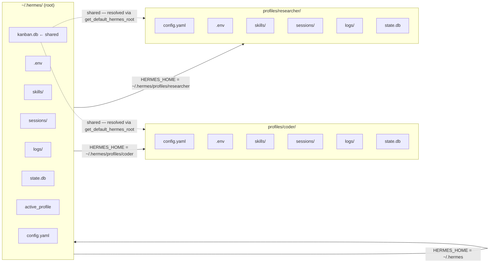

**TL;DR** — Every Hermes installation roots its state in a single directory called the Hermes home (`~/.hermes` on Linux/macOS, `%LOCALAPPDATA%\hermes` on Windows). You can relocate it with the `HERMES_HOME` environment variable. Profile mode carves that root into named sub-homes — `profiles/<name>/` — each with its own `config.yaml`, `.env`, memory, skills, sessions, and logs, so multiple independent agents can live side-by-side on one machine without their state colliding.

# The Hermes Home Directory and Profile Isolation

Before we can talk about sessions, memory, scheduled tasks, or multi-agent workflows, we need to answer a simpler question: where does Hermes keep its files?

Every piece of agent state — the model you chose, your API keys, past conversations, learned skills, scheduled cron jobs, rotating logs — must live somewhere stable on disk. That somewhere is the **Hermes home directory**, and it is the single root that all of the agent's subsystems point back to. Once you understand the home directory, the rest of the file system makes sense.

## The problem: "where does this go?"

Imagine you call `hermes chat`. The agent needs to find `config.yaml` to learn which model to use. It needs `.env` to read your API key. After the conversation it writes a session record. If you used a skill, that skill came from a folder. None of this can happen without an agreed-upon root on disk.

In an ideal world that root never changes and every component knows exactly where to look — no environment variables to juggle, no scattered files. Hermes achieves this through a single function: `get_hermes_home()`, which every part of the system calls to find the root. Let's see what it returns.

## `get_hermes_home()` — the single source of truth

`get_hermes_home()` lives in `hermes_constants.py` (S17, l. 53). Its resolution order is:

1. **Context-local override** — an in-process `ContextVar` set by `set_hermes_home_override()`. Used internally for per-task scoping without touching the process environment.
2. **`HERMES_HOME` environment variable** — if set and non-empty, returns that path directly.
3. **Platform-native default** — falls back to `_get_platform_default_hermes_home()`.

The platform-native default (S17, l. 44–50):

- **Linux / macOS (POSIX):** `Path.home() / ".hermes"` → `~/.hermes`
- **Windows:** `%LOCALAPPDATA%\hermes` (falling back to `~/AppData/Local/hermes` if `LOCALAPPDATA` is unset)

```python
# From hermes_constants.py (S17, l. 44–50) — simplified view
def _get_platform_default_hermes_home() -> Path:
    if sys.platform == "win32":
        local_appdata = os.environ.get("LOCALAPPDATA", "").strip()
        base = Path(local_appdata) if local_appdata else Path.home() / "AppData" / "Local"
        return base / "hermes"
    return Path.home() / ".hermes"
```

The full `get_hermes_home()` adds one safety net: if `HERMES_HOME` is unset but the `active_profile` file in the default home points to a non-default profile, the function emits a one-shot warning to `stderr` (S17, l. 79–107). It still returns the platform default rather than crashing — but the warning tells you that data is about to land in the wrong profile. We'll come back to why this matters when we cover profile mode.

### Overriding the home with `HERMES_HOME`

The simplest customisation is to move the entire home to a different path — useful on a Docker volume, a server with a small root partition, or a Nix-managed install:

```bash
export HERMES_HOME=/opt/hermes-data
hermes chat
```

From that point on, every `get_hermes_home()` call returns `/opt/hermes-data`. The agent creates the directory on first use, then builds the full subdirectory tree inside it.

---

## The home directory layout

With the root established, let's walk every subdirectory. The table below covers the canonical locations confirmed from the source (S17, S18, S84):

| Path (relative to `HERMES_HOME`) | What lives there |
|---|---|
| `config.yaml` | Primary agent configuration: model, provider, toolsets, compression, memory, cron, and gateway settings. |
| `.env` | API keys and environment overrides: provider keys (`OPENROUTER_API_KEY`, `ANTHROPIC_API_KEY`, …), terminal settings, gateway tokens. |
| `skills/` | Markdown skill files (`.md`) the agent can load. Both bundled skills seeded at install time and skills the agent creates from experience live here. |
| `sessions/` | Per-session request-dump breadcrumbs and optional JSON snapshots of conversation trajectories. The canonical session store is `state.db` (see below), but per-session JSON is opt-in via `sessions.write_json_snapshots` in `config.yaml`. |
| `logs/` | Four rotating log files written by `hermes_logging.py`: `agent.log` (INFO+, all activity), `errors.log` (WARNING+, quick triage), and additional component logs. Created automatically on first use. |
| `cron/` | Scheduled task definitions created by `hermes cron add` or the `cronjob` tool. Each entry is a YAML file describing the schedule, command, and options. |
| `memories/` | Persistent memory files: `MEMORY.md` (agent notes) and `USER.md` (user profile), injected into every session's system prompt when memory is enabled. |
| `plugins/` | User-installed plugin packages. Loaded via `PluginManager` at `hermes_cli/plugins.py` (S18, l. 1105: `user_dir = get_hermes_home() / "plugins"`). |
| `state.db` | SQLite session database (WAL mode). Stores all conversation history, FTS5 indexes, session metadata, and memory context. Covered in depth in [SessionDB — SQLite, WAL, FTS5, and Conversation Search](../memory/sessiondb-fts-and-search.md). |
| `skins/` | Custom CLI theme YAML files loaded by `/skin` at runtime. |
| `home/` | When this subdirectory exists, it becomes `HOME` for subprocesses (terminal, SSH, git). Keeps system-tool configs (git identity, SSH keys, npm config) inside the Hermes data volume — important for Docker persistence and profile isolation. |
| `SOUL.md` | The agent's identity prompt. Injected at session start unless `skip_context_files=True`. |
| `active_profile` | One-line text file containing the name of the sticky-active profile. Written by `hermes profile use`. Absent when using the default profile. |

Here is a full annotated tree for a default installation:

```
~/.hermes/
├── config.yaml          ← model, provider, toolsets, cron, gateway
├── .env                 ← API keys (owner-only perms, 0o600)
├── SOUL.md              ← agent identity prompt
├── active_profile       ← only present when a named profile is sticky-active
│
├── skills/              ← skill markdown files (agent-created + bundled)
│   └── *.md
├── sessions/            ← session breadcrumbs / optional JSON snapshots
├── logs/                ← rotating agent.log, errors.log, …
├── cron/                ← scheduled job definitions
├── memories/            ← MEMORY.md, USER.md
├── plugins/             ← user-installed plugin packages
├── skins/               ← custom theme YAML files
│
├── state.db             ← SQLite: all conversation history + FTS5 index
├── state.db-shm         ← WAL shared-memory segment
├── state.db-wal         ← WAL journal (write-ahead log)
│
├── home/                ← subprocess HOME (optional; creates profile isolation for git/ssh)
│
└── profiles/            ← named profiles, each a full isolated home
    ├── coder/
    └── researcher/
```

> **`kanban.db` is not under `HERMES_HOME`.** The kanban board is **shared across all profiles by design** — it lives at the root (`~/.hermes/kanban.db`), resolved through `get_default_hermes_root()` in `kanban_db.py`. This means kanban tasks and workers from different profiles can see and claim the same board. If you need board-per-profile separation, use the `HERMES_KANBAN_HOME` env var to point each profile at its own board file. We discuss this further in [Kanban Task Dispatch](../multi-agent/kanban-dispatch.md).

### A minimal `config.yaml`

Here is a representative minimal `config.yaml` drawn from the example file (S84):

```yaml
# ~/.hermes/config.yaml
model:
  default: "anthropic/claude-opus-4.6"
  provider: "auto"
  base_url: "https://openrouter.ai/api/v1"

terminal:
  backend: "local"
  cwd: "."
  timeout: 180

memory:
  memory_enabled: true
  user_profile_enabled: true
  memory_char_limit: 2200
  user_char_limit: 1375
  nudge_interval: 10

compression:
  enabled: true
  threshold: 0.50
  target_ratio: 0.20
  protect_last_n: 20
```

The agent reads `config.yaml` on every startup. `get_hermes_home() / "config.yaml"` is the resolved path — the convenience function `get_config_path()` in `hermes_constants.py` (S17, l. 398–403) wraps exactly this.

### A minimal `.env`

The `.env` file holds secrets that should not appear in `config.yaml`. Hermes loads it at startup via `load_hermes_dotenv()` in `hermes_cli/main.py`. A representative minimal set from the example file (S85):

```dotenv
# ~/.hermes/.env

# LLM provider key (pick the one matching your provider in config.yaml)
OPENROUTER_API_KEY=sk-or-...

# Or direct Anthropic:
# ANTHROPIC_API_KEY=sk-ant-...

# Terminal tool defaults
TERMINAL_TIMEOUT=60
TERMINAL_LIFETIME_SECONDS=300
```

The `.env` is created with `0o600` permissions (owner-read-only) so API keys are not world-readable. When you create a named profile with `--clone`, the `.env` is copied and its permissions are explicitly tightened (confirmed from `profiles.py`).

---

## Profile mode: isolated homes for named agents

Now we hit the real problem. Suppose you want to run one agent focused on software development and another focused on research — with different models, different memory stores, and different skills. If both share `~/.hermes`, their configs conflict, their memories blend, and their API keys are the same.

Profile mode solves this by giving each named agent its own copy of the home directory tree, stored under `~/.hermes/profiles/<name>/`.

### How isolation works: `_apply_profile_override()`

Profile isolation is implemented in `hermes_cli/main.py` through a function called `_apply_profile_override()` (S18 — referenced in AGENTS.md l. 936). It runs **before** any module imports, at line 422 of `main.py`. Here is what it does, step by step:

```
flowchart TB
    A[hermes CLI starts] --> B{--profile flag\nor -p in argv?}
    B -- yes --> C[profile_name = flag value]
    B -- no --> D{HERMES_HOME env var set\nand already a profile path?}
    D -- yes --> E[Trust it, return early]
    D -- no --> F{active_profile file\nexists in hermes root?}
    F -- yes, non-default --> G[profile_name = contents of file]
    F -- no or 'default' --> H[Use default home]
    C --> I[Call resolve_profile_env]
    G --> I
    I --> J[Set os.environ HERMES_HOME = ~/.hermes/profiles/name]
    J --> K[All get_hermes_home calls now return profile path]
```

The key line is the last action: `os.environ["HERMES_HOME"] = hermes_home`. After this executes, every `get_hermes_home()` call — everywhere in the codebase — returns the profile's path instead of the default. Because the function runs before any module imports cache the path, the substitution is transparent.

There are three ways to activate a profile:

| Method | When to use |
|---|---|
| `hermes -p <name> chat` | One-off: activate for a single invocation |
| `hermes --profile=<name> chat` | Same as `-p`, full-flag form |
| `hermes profile use <name>` | Sticky: writes `~/.hermes/active_profile`; all future invocations use this profile until switched back |

### Creating a profile

Let's walk through the actual workflow. We'll create a profile named `researcher`.

**Step 1 — Create the profile directory:**

```bash
hermes profile create researcher
```

Hermes creates `~/.hermes/profiles/researcher/` and bootstraps these subdirectories (from `_PROFILE_DIRS` in `profiles.py`):

```
~/.hermes/profiles/researcher/
├── memories/
├── sessions/
├── skills/         ← seeded with bundled skills by default
├── skins/
├── logs/
├── plans/
├── workspace/
├── cron/
└── home/           ← subprocess HOME for tool isolation
```

Notice that `config.yaml`, `.env`, and `state.db` are not created yet — they are written the first time the profile is used. If you want to start with a copy of your existing settings, pass `--clone`:

```bash
hermes profile create researcher --clone
```

The `--clone` flag copies `config.yaml`, `.env`, and `SOUL.md` from the current active profile into the new one. The `.env` copy has its permissions tightened to `0o600` (confirmed from `profiles.py`). If you want a complete copy of everything — memory, sessions, and all — use `--clone-all`.

**Step 2 — Activate the profile for one invocation:**

```bash
hermes -p researcher chat
```

Inside that process, `HERMES_HOME` is set to `~/.hermes/profiles/researcher`. The agent reads `~/.hermes/profiles/researcher/config.yaml`, loads skills from `~/.hermes/profiles/researcher/skills/`, and writes its session to `~/.hermes/profiles/researcher/state.db`. The default home is untouched.

**Step 3 — Make the profile sticky:**

```bash
hermes profile use researcher
```

This writes `researcher` to `~/.hermes/active_profile`. Every subsequent `hermes` invocation (without an explicit `-p` flag) will activate the researcher profile automatically, via the `active_profile` file check in `_apply_profile_override()`.

**Step 4 — List all profiles:**

```bash
hermes profile list
```

Output shows the active profile (marked `◆`), the model configured in each profile's `config.yaml`, whether the gateway is running, and any shell-alias wrapper created at profile creation.

**Step 5 — Switch back to default:**

```bash
hermes profile use default
```

This removes the sticky setting (or writes `default` to `active_profile`), and `_apply_profile_override()` returns without setting `HERMES_HOME` — the global default applies again.

### The profiles flowchart

Here is the relationship between the default home, `active_profile`, and two named profiles:



Each box inside a profile sub-home is completely independent — a different model, different keys, different memory, different conversation history. The kanban board (shown with a dotted line) is the deliberate exception: it is resolved through `get_default_hermes_root()`, which always walks up to `~/.hermes` even when `HERMES_HOME` points to a profile, so all profiles share one dispatcher and one task graph.

---

## What profile mode isolates — and what it shares

This distinction is important for multi-agent setups. Let's be precise.

### Isolated per profile (each profile has its own copy)

| Item | Path pattern |
|---|---|
| Configuration | `<profile>/config.yaml` |
| API keys | `<profile>/.env` |
| Agent memory | `<profile>/memories/MEMORY.md`, `USER.md` |
| Skills | `<profile>/skills/` |
| Conversation history (SessionDB) | `<profile>/state.db` |
| Cron job definitions | `<profile>/cron/` |
| Log files | `<profile>/logs/` |
| Plugins | `<profile>/plugins/` (resolved through `get_hermes_home()`) |
| Subprocess HOME | `<profile>/home/` (when it exists — isolates git, SSH, npm configs) |
| Agent identity | `<profile>/SOUL.md` |

### Shared across all profiles (intentionally)

| Item | Location | Why |
|---|---|---|
| Kanban board | `~/.hermes/kanban.db` | Dispatcher/worker handoff requires a shared task graph |
| Profile listing | `~/.hermes/profiles/` | `hermes profile list` must see all profiles regardless of active one |
| `active_profile` file | `~/.hermes/active_profile` | Sticky selection is a global setting |

The gateway `HERMES_HOME` propagation matters here: if you start a gateway or a cron worker, the subprocess must receive `HERMES_HOME` explicitly, or it falls back to the default and writes data into the wrong profile. The `get_hermes_home()` docstring (S17, l. 64–67) references this: "Subprocess spawners are expected to propagate `HERMES_HOME` explicitly." If that propagation is missing, you will see the one-shot warning on stderr described earlier.

---

## Edge case: the `HERMES_HOME` fallback warning

The warning is deliberate. Say you set `active_profile` to `researcher` using `hermes profile use researcher`, then start a subprocess (a cron job, a kanban worker, a systemd service) without forwarding `HERMES_HOME`. The subprocess calls `get_hermes_home()`, finds `HERMES_HOME` unset, reads `active_profile`, sees `researcher`, and then — because it cannot raise without bricking 30+ module-level callers — falls back to the default home anyway. It prints:

```
[HERMES_HOME fallback] HERMES_HOME is unset but active profile is 'researcher'.
Falling back to ~/.hermes, which is the DEFAULT profile — not 'researcher'.
Any data this process writes will land in the wrong profile.
```

The fix is always the same: make sure the subprocess inherits `HERMES_HOME`. In a systemd unit, add `Environment=HERMES_HOME=/home/user/.hermes/profiles/researcher`. In a cron worker spawned by the dispatcher, the kanban code (referenced in S17, l. 65–67) forwards `HERMES_HOME` explicitly.

---

## Connecting back: the agent runtime reads this at startup

The `AIAgent` (defined in `run_agent.py` and initialized via `init_agent()` in `agent/agent_init.py`) calls `get_hermes_home()` multiple times during startup (S18). A short recap so this page stands alone:

> `AIAgent` is the core runtime that drives the conversation loop. It is described in detail in [The AIAgent and Conversation Loop](../core-runtime/aiagent-and-conversation-loop.md).

Relevant calls in `init_agent()` (S18):

```python
# From agent/agent_init.py (S18, l. 1029-1031) — illustrative
hermes_home = get_hermes_home()
agent.logs_dir = hermes_home / "sessions"
agent.logs_dir.mkdir(parents=True, exist_ok=True)
```

And logging setup, also called from `init_agent()`:

```python
# From agent/agent_init.py (S18, l. 551)
setup_logging(hermes_home=_ra()._hermes_home)
# → writes to get_hermes_home() / "logs" / "agent.log"
```

Because `_apply_profile_override()` runs before `AIAgent.__init__`, the agent always sees the correct home — whether default or profile.

Similarly, [SessionDB](../memory/sessiondb-fts-and-search.md) — the SQLite conversation store — lives at `get_hermes_home() / "state.db"` and is therefore isolated per profile automatically.

---

## Worked example: two independent agents on one machine

Let's put it together. Suppose you want a `coder` agent with access to your development API keys and a `researcher` agent using a different model and different memory.

```bash
# Create both profiles (each gets bundled skills by default)
hermes profile create coder
hermes profile create researcher

# Configure coder: give it an Anthropic key and Claude
hermes -p coder config set model.provider anthropic
# (then edit ~/.hermes/profiles/coder/.env to add ANTHROPIC_API_KEY=...)

# Configure researcher: point it at OpenRouter with a different model
hermes -p researcher config set model.default "google/gemini-2.5-pro"
# (then edit ~/.hermes/profiles/researcher/.env to add OPENROUTER_API_KEY=...)

# Run each independently — no state collision
hermes -p coder chat "Review the PR"
hermes -p researcher chat "Summarize today's arXiv papers"

# Or make coder the sticky default for this terminal session
export HERMES_HOME=~/.hermes/profiles/coder
hermes chat   # always uses coder profile
```

The two conversations write to separate `state.db` files, separate `logs/`, separate `memories/`. They share `kanban.db` if you use multi-agent dispatch — which is exactly what you want when `coder` delegates a sub-task to `researcher` via the kanban board. We cover that pattern in [Kanban Task Dispatch](../multi-agent/kanban-dispatch.md) and [Best Practices](../design/best-practices.md).

---

← Previous: [SessionDB — SQLite, WAL, FTS5, and Conversation Search](../memory/sessiondb-fts-and-search.md) · Next: [Compression Chains, Session Splitting, and WAL Fallback](./compression-chains-and-wal-fallback.md) →
