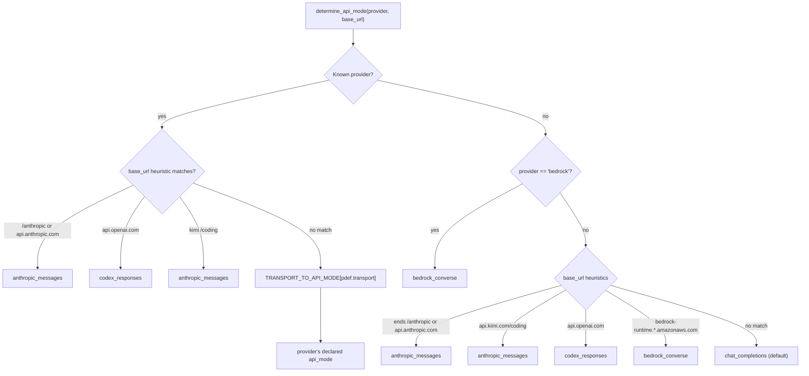
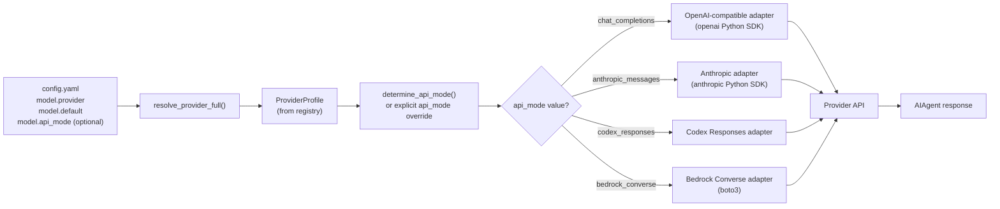

**TL;DR** — Hermes routes every LLM call through a config-driven selection, not a dynamic router: `model.provider` and `model.model` in `config.yaml` choose the provider and model, while `api_mode` (or the auto-detected equivalent) chooses the wire protocol. There are exactly four `api_mode` values. By the end of this chapter you will know how the registry discovers providers, how `determine_api_mode()` resolves the right transport, and how to switch providers with a single `hermes model` command.

# Config-Driven Provider Routing and the Four api_mode Values

Hermes is **provider-agnostic by design**. The same agent code runs against roughly 30 bundled providers — Anthropic, OpenAI Codex, AWS Bedrock, Google Gemini, Kimi, MiniMax, dozens more — without any code changes between them. You switch providers by editing `config.yaml` or running `hermes model`; nothing else changes.

Before we dig into the mechanism, let's correct a common misconception: this is **not** a dynamic or learned router. There is no AI deciding which provider to call. Routing is deterministic, config-driven selection: the values you set in `config.yaml` (or via `hermes model`) determine the provider and model, and a small function called `determine_api_mode()` maps that provider to the correct wire protocol.

Let's build our understanding from the ground up.

---

## Prerequisites

This chapter assumes you have Hermes installed and understand the agent's basic conversation loop. A quick recap: **`AIAgent`** (the core agent class defined in `run_agent.py`) drives every conversation; it calls a provider on each turn to get a model response. The full loop is covered in [The AIAgent and Conversation Loop](../core-runtime/aiagent-and-conversation-loop.md).

We also reference `~/.hermes/config.yaml` — that is your per-user configuration file. The home directory layout, how `config.yaml` and `.env` relate, and how profiles work are explained in [Home Directory and Profiles](../persistence/home-directory-and-profiles.md).

---

## The provider registry

### Why a registry?

The agent needs to call different APIs — each with a different base URL, authentication scheme, and sometimes a completely different wire protocol. Hardcoding 30 sets of URLs and auth flags into the main loop would make the system brittle and hard to extend. Instead, all of that information lives in **provider profiles**.

### Where providers are registered

Hermes discovers providers from two locations, in priority order:

1. **`plugins/model-providers/<name>/`** — bundled providers, shipped with Hermes (the source tree).
2. **`$HERMES_HOME/plugins/model-providers/<name>/`** — user-installed providers. A user plugin with the same name overrides the bundled one (last-writer-wins via `register_provider()`).

Each subdirectory contains at minimum an `__init__.py` that calls `register_provider(profile)`. Discovery runs lazily the first time anything calls `get_provider_profile()` or `list_providers()` — it scans both directories and imports each `__init__.py`.

The bundled providers currently shipped (28 subdirectories plus a README) include:

| Category | Examples |
|---|---|
| Aggregators (multi-model) | `openrouter`, `nous`, `huggingface`, `novita`, `kilocode` |
| Direct cloud providers | `anthropic`, `deepseek`, `gemini`, `xai`, `zai` |
| OpenAI ecosystem | `openai-codex`, `copilot`, `copilot-acp` |
| Regional providers | `kimi-coding`, `minimax`, `alibaba`, `stepfun`, `xiaomi` |
| Cloud infrastructure | `bedrock`, `azure-foundry` |
| Local/self-hosted | `ollama-cloud`, `custom` |

This is not an exhaustive table of every provider — run `hermes model` to see the full list along with which ones have credentials configured.

### The `ProviderProfile` dataclass

Every provider is described by a `ProviderProfile` instance, defined as a `@dataclass` in `providers/base.py` at line 38. Here are the fields you will encounter most often:

| Field | Type | Default | What it does |
|---|---|---|---|
| `name` | `str` | — | Provider identifier (matches the dir name and config slug) |
| `api_mode` | `str` | `"chat_completions"` | The wire protocol used by this provider |
| `aliases` | `tuple` | `()` | Alternative names (e.g. `"claude"` for `"anthropic"`) |
| `display_name` | `str` | `""` | Human-readable label shown in the picker |
| `description` | `str` | `""` | Picker subtitle |
| `signup_url` | `str` | `""` | Sign-up page shown during first-time setup |
| `env_vars` | `tuple` | `()` | Environment variable names that hold the API key |
| `base_url` | `str` | `""` | Default API endpoint base URL |
| `auth_type` | `str` | `"api_key"` | Auth mechanism: `api_key`, `oauth_device_code`, `oauth_external`, `copilot`, `aws_sdk` |
| `supports_vision` | `bool` | `False` | Whether the provider accepts image content in tool-result messages |
| `fallback_models` | `tuple` | `()` | Curated model list shown in picker when live fetch fails |
| `default_aux_model` | `str` | `""` | Cheap model for auxiliary tasks (compression, vision) |
| `default_max_tokens` | `int \| None` | `None` | Output token cap for this provider (overrides model default) |
| `fixed_temperature` | `Any` | `None` | Force a specific temperature (or `OMIT_TEMPERATURE` to skip) |

Providers that need custom behavior (custom model fetching, extra request fields, reasoning config) subclass `ProviderProfile`. For example:

- **`AnthropicProfile`** — overrides `fetch_models()` to use the `x-api-key` header instead of `Bearer` auth.
- **`BedrockProfile`** — overrides `fetch_models()` to return `None` (AWS SDK does not use a REST `/models` endpoint).
- **`NousProfile`** — overrides `build_extra_body()` to attach portal tags on every request.
- **`OpenRouterProfile`** — overrides `build_extra_body()` and `build_api_kwargs_extras()` for provider-preference routing and reasoning config passthrough.

Here is the Anthropic plugin as a concrete example of how a bundled provider looks on disk (`plugins/model-providers/anthropic/__init__.py`):

```python
# plugins/model-providers/anthropic/__init__.py (simplified view)
from providers import register_provider
from providers.base import ProviderProfile

class AnthropicProfile(ProviderProfile):
    """Native Anthropic — uses x-api-key header, not Bearer."""

    def fetch_models(self, *, api_key=None, timeout=8.0):
        # Queries https://api.anthropic.com/v1/models using x-api-key auth
        ...

anthropic = AnthropicProfile(
    name="anthropic",
    aliases=("claude", "claude-oauth", "claude-code"),
    api_mode="anthropic_messages",        # ← this provider uses the native Anthropic wire
    env_vars=("ANTHROPIC_API_KEY", "ANTHROPIC_TOKEN", "CLAUDE_CODE_OAUTH_TOKEN"),
    base_url="https://api.anthropic.com",
    auth_type="api_key",
    default_aux_model="claude-haiku-4-5-20251001",
)

register_provider(anthropic)
```

Notice the `api_mode` field on the profile instance. This is where the wire protocol is declared for a known provider. We will come back to exactly what it means in the next section.

---

## The four `api_mode` values

Now we reach the core of this chapter: **`api_mode`** tells the agent *how* to talk to the provider. It is the wire protocol selector.

Hermes supports exactly four values, declared in `hermes_cli/providers.py` as the `TRANSPORT_TO_API_MODE` mapping:

| `api_mode` | Internal transport name | What it means |
|---|---|---|
| `chat_completions` | `openai_chat` | OpenAI-compatible Chat Completions API. Default for most providers. |
| `anthropic_messages` | `anthropic_messages` | Anthropic Messages API (native wire). Used for direct Anthropic access, MiniMax, and any endpoint with `/anthropic` in the path. |
| `codex_responses` | `codex_responses` | OpenAI Responses API (used by Codex CLI, `openai-api`, `xai`, `xai-oauth`, `copilot-acp`). |
| `bedrock_converse` | `bedrock_converse` | AWS Bedrock Converse API (boto3-backed, not HTTP REST). |

Let's look at each one.

### `chat_completions` — the default

This is the OpenAI Chat Completions wire: `POST /v1/chat/completions` with a JSON body containing a `messages` array. It is the widest-supported API shape — virtually every provider outside AWS, native Anthropic, and OpenAI's own Responses endpoint accepts it. When no other `api_mode` applies, `chat_completions` is the fallback.

Providers using this mode include: `openrouter`, `nous`, `gemini`, `deepseek`, `zai`, `kimi-coding`, `alibaba`, `nvidia`, `ollama-cloud`, `lmstudio`, `custom`, and many others.

### `anthropic_messages` — native Anthropic wire

This uses the Anthropic Messages API directly. The request shape differs from OpenAI's: it uses `x-api-key` authentication (not `Bearer`), has distinct message role handling, and exposes features like prompt caching breakpoints and extended thinking natively.

When to expect this mode:
- `provider: anthropic` (direct API key)
- `provider: minimax` / `minimax-oauth` / `minimax-cn` (MiniMax exposes an Anthropic-compatible endpoint)
- Any base URL that ends with `/anthropic` or matches `api.anthropic.com`
- Kimi's `/coding` endpoint (`api.kimi.com/coding` in the URL)

### `codex_responses` — OpenAI Responses API

The Responses API is a newer OpenAI protocol, separate from Chat Completions. It is what the Codex CLI uses and what `api.openai.com` requires. Providers using this mode include:

- `openai-codex` — OpenAI Codex via OAuth
- `openai-api` — direct `api.openai.com`
- `xai` / `xai-oauth` — xAI Grok direct API
- `copilot-acp` — GitHub Copilot via the `--acp` process bridge

### `bedrock_converse` — AWS Bedrock

Bedrock has no OpenAI-compatible REST endpoint. It uses AWS's Bedrock Converse API, accessed via `boto3` — the Python AWS SDK. Authentication comes from AWS credentials (IAM role, access keys, or a profile), not an API key. The `BedrockProfile` in `plugins/model-providers/bedrock/__init__.py` reflects this with `auth_type="aws_sdk"` and `env_vars=()` (no env var; credentials come from the SDK credential chain).

---

## How `determine_api_mode()` resolves the transport

Now let's look at how Hermes automatically picks the right `api_mode`. The function `determine_api_mode(provider, base_url)` in `hermes_cli/providers.py` runs every time a model switch completes and no explicit `api_mode` is already set. Here is its resolution order:



The steps are:

1. **Look up the provider** in the registry (`get_provider()`). If found, translate `pdef.transport` through `TRANSPORT_TO_API_MODE` (e.g., `"anthropic_messages"` → `"anthropic_messages"`).
2. **Before returning that value**, check URL heuristics for special cases that override the profile's default (e.g., a Kimi `/coding` endpoint even when the provider is `"custom"`).
3. **If no known provider**, try URL heuristics directly: check the hostname and path for Anthropic, OpenAI, Kimi, and Bedrock signatures.
4. **Default** to `"chat_completions"` if nothing else matched.

The result is that for the vast majority of providers, you never need to set `api_mode` manually — it is inferred from the provider name. The one case where you need it explicitly is `azure-foundry`, which can speak either OpenAI-style or Anthropic-style endpoints depending on how your Azure deployment is configured.

In `model_switch.py`, the call appears at the tail of the `switch_model()` pipeline, after Copilot and OpenCode overrides have already been applied:

```python
# from hermes_cli/model_switch.py (simplified view)
# --- Copilot api_mode override ---
if target_provider in {"copilot", "github-copilot"}:
    api_mode = copilot_model_api_mode(new_model, api_key=api_key)

# --- OpenCode api_mode override ---
if target_provider in {"opencode-zen", "opencode-go", "opencode"}:
    api_mode = opencode_model_api_mode(target_provider, new_model)

# --- Determine api_mode if not already set ---
if not api_mode:
    api_mode = determine_api_mode(target_provider, base_url)
```

Notice the priority: model-specific overrides (Copilot, OpenCode) run first, then `determine_api_mode()` fills in the rest.

---

## How config.yaml drives provider selection

We have the registry, we have `api_mode`. Now let's tie it together with the configuration file.

Your `config.yaml` (at `~/.hermes/config.yaml` by default) carries a `model:` section:

```yaml
# ~/.hermes/config.yaml — the model section
model:
  provider: "anthropic"           # which provider to use
  default: "claude-opus-4-6"      # which model to use with that provider
  base_url: "https://api.anthropic.com"   # optional endpoint override
```

The three key fields:

- **`model.provider`** — the provider slug (e.g., `"anthropic"`, `"openrouter"`, `"bedrock"`). This must match a known provider name or an alias registered via `register_provider()`.
- **`model.default`** (also accepts the key `model`) — the model name to pass to the API.
- **`model.api_mode`** (optional) — override the auto-detected transport. Set this only when auto-detection is wrong, such as for `azure-foundry` with a non-default endpoint shape.

Your API key lives in `~/.hermes/.env`, not in `config.yaml`. For example:

```bash
# ~/.hermes/.env
ANTHROPIC_API_KEY=sk-ant-...
```

Each provider's `ProviderProfile.env_vars` field declares which environment variable(s) hold the key. For Anthropic, those are `ANTHROPIC_API_KEY`, `ANTHROPIC_TOKEN`, and `CLAUDE_CODE_OAUTH_TOKEN`. Hermes checks each in order.

---

## Switching providers: a worked example

Let's walk through a complete provider switch. We have been using OpenRouter, and we want to switch to native Anthropic.

**Step 1 — Check what is currently active:**

```bash
hermes model
```

This opens the interactive picker showing all providers that have credentials configured, with the current provider highlighted.

**Step 2 — Switch interactively:**

```bash
hermes model --provider anthropic
```

Or, to pick a specific model at the same time:

```bash
hermes model claude-opus-4-6 --provider anthropic
```

Behind the scenes, `switch_model()` in `model_switch.py` runs the full resolution pipeline:
- Resolves `anthropic` to the `AnthropicProfile` via `resolve_provider_full()`
- Looks up credentials (checks `ANTHROPIC_API_KEY` from `.env`)
- Normalizes the model name for the provider
- Calls `determine_api_mode("anthropic", "https://api.anthropic.com")` → returns `"anthropic_messages"` (because the `AnthropicProfile` declares `api_mode="anthropic_messages"`, which is mapped back from transport `"anthropic_messages"`)
- Persists the new `provider`, `model`, and `api_mode` to `config.yaml`

**Step 3 — Confirm the change:**

```bash
hermes model
```

The picker now shows `anthropic` as current with the model you selected.

**What the config looks like after the switch:**

```yaml
model:
  provider: "anthropic"
  default: "claude-opus-4-6"
```

The `api_mode` is not written explicitly because it is auto-detected. If you wanted to override it (say, to force `chat_completions` on an Anthropic-compatible third-party endpoint), you would add:

```yaml
model:
  provider: "anthropic"
  default: "claude-opus-4-6"
  api_mode: "chat_completions"   # override: bypass native Anthropic wire
```

The `api_mode` field in `config.yaml` is read and injected early in the runtime provider resolution path, so any explicit value there wins over auto-detection.

---

## The full routing flow in a diagram

Putting it all together: here is the path from `config.yaml` to the transport adapter that sends the actual API request.



The four adapter implementations are covered in the next chapter: [Provider Adapters — Anthropic, Bedrock, Gemini, and Codex](./provider-adapters.md).

---

## Edge cases and failure modes

### Unknown or misspelled provider

If `model.provider` in `config.yaml` is set to a name that does not match any built-in provider or alias, and no user-defined entry exists in the `providers:` section of `config.yaml`, `resolve_provider_full()` returns `None`. The `switch_model()` function then surfaces:

```
Unknown provider 'my-typo'. Check 'hermes model' for available providers,
or define it in config.yaml under 'providers:'.
```

If config-structure issues also exist, `hermes doctor` is suggested automatically. To recover: run `hermes model` to pick a valid provider interactively, or correct the slug in `config.yaml` directly.

### Explicit `api_mode` mismatch

If you set `api_mode: "anthropic_messages"` but the provider expects `"chat_completions"`, the wrong SDK is used to build the request and the provider will return an HTTP 400 or 422 with a body indicating the request shape is unexpected. To recover: remove the explicit `api_mode` key and let auto-detection handle it.

### `azure-foundry` with default `api_mode`

Azure Foundry deployments can expose either an OpenAI-style or an Anthropic-style endpoint. The profile defaults to `"chat_completions"` (transport `openai_chat`) because the transport "is determined at runtime from config.yaml model.api_mode." If your Azure deployment is Anthropic-style, you must explicitly set `api_mode: "anthropic_messages"` in `config.yaml`.

### `bedrock` without AWS credentials

Bedrock uses the AWS SDK credential chain (IAM roles, `AWS_ACCESS_KEY_ID` + `AWS_SECRET_ACCESS_KEY`, instance profiles, etc.), not an API key env var. If no valid AWS credentials are present, the boto3 client will fail with an `NoCredentialsError` or similar AWS SDK error — not a Hermes error. Run `hermes doctor` to verify credential detection, or configure AWS credentials via `aws configure` or the appropriate IAM mechanism.

---

## Credential rotation and failover

One thing this chapter has not covered: what happens when a provider's API key is rate-limited or rotated. That is handled by the `CredentialPool` and its cooldown system — covered in `./credential-pool-and-failover.md`.

---

← Previous: [The Task Dataclass, DAG Links, Worker Handoff, and Artifacts](../task-lifecycle/task-dataclass-dag-and-handoff.md) · Next: [Provider Adapters — Anthropic, Bedrock, Gemini, and Codex](./provider-adapters.md) →
