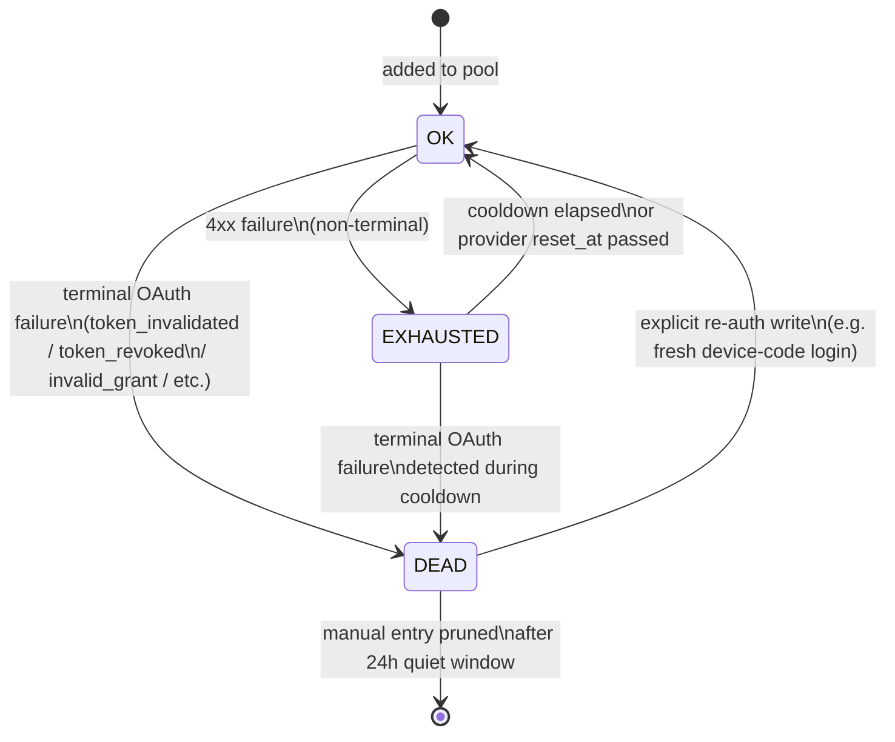
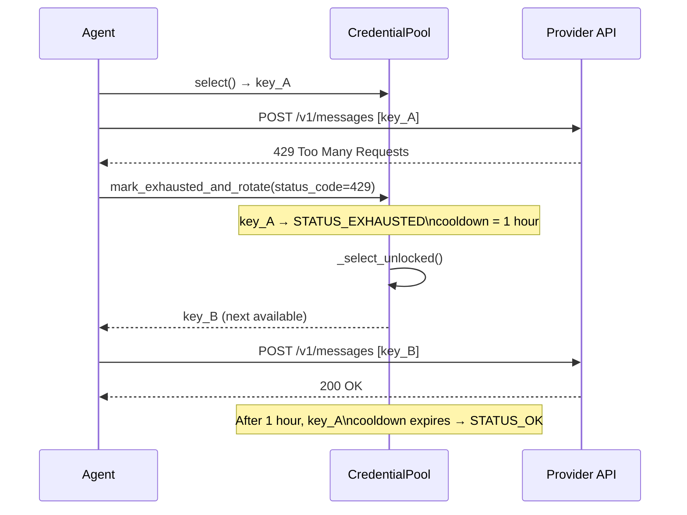

**TL;DR** — A single API key will eventually hit a rate limit, billing cap, or auth failure. `CredentialPool` solves this by managing several credentials for the same provider and picking among them using one of four rotation strategies. This chapter walks through the full lifecycle: how a credential is selected, what happens when it fails, the two-tier cooldown schedule (5 minutes for auth errors, 1 hour for rate limits), how permanently dead credentials are excluded, the `FailoverReason` taxonomy that drives recovery decisions, and how Anthropic prompt caching cuts input-token costs by roughly 75% across multi-turn sessions.

# CredentialPool — Rotation Strategies, Cooldowns, and Failover

## Why one API key is not enough

Imagine the agent is partway through a long coding task when the provider returns HTTP 429 — you've hit the rate limit for this key. Without a fallback, the agent stops until the limit resets (often an hour later). With two or three keys in a pool, the agent can rotate to the next available credential and keep working.

That is the problem `CredentialPool` — defined in `agent/credential_pool.py` — was built to solve. It holds multiple `PooledCredential` entries for a single provider, applies a configurable selection strategy, and handles failures by marking a credential as temporarily exhausted (cooldown) or permanently dead, then picking the next viable one.

Before we walk through the pool itself, let's note a quick prerequisite. Provider-level configuration is covered in [Provider Adapters — Anthropic, Bedrock, Gemini, and Codex](./provider-adapters.md), which introduces how `cache_control` headers are attached. We'll build on that here when discussing Anthropic prompt caching. Config-driven routing (how Hermes decides *which* provider to use) is covered in [Config-Driven Routing and API Modes](./config-driven-routing-and-api-modes.md) — a 1–2 sentence recap: the config selects the active provider and its `api_mode`; once inside that provider, `CredentialPool` manages the individual keys.

---

## The pool's data model

Every credential in the pool is a `PooledCredential` dataclass. Think of it as a wallet entry: it knows which provider it belongs to, holds the raw access token (or API key), tracks the last error it received, and carries a `request_count` counter used by the `least_used` strategy. The most important status fields are:

| Field | Meaning |
|---|---|
| `last_status` | Current health: `"ok"`, `"exhausted"`, or `"dead"` |
| `last_status_at` | Epoch timestamp when the status was set |
| `last_error_code` | HTTP status code of the last failure (e.g. `429`) |
| `last_error_reset_at` | Provider-supplied reset timestamp (overrides default TTL) |
| `request_count` | Cumulative number of times this entry has been selected |

The three status constants are defined at the top of `credential_pool.py`:

```python
STATUS_OK       = "ok"
STATUS_EXHAUSTED = "exhausted"
STATUS_DEAD     = "dead"
```

`STATUS_DEAD` is the critical one: a dead credential is **excluded from rotation unconditionally**, as the source comment explains — "permanently failed, will NOT re-enter rotation until re-auth."

---

## Four rotation strategies

The pool reads its strategy from `config.yaml` (via `get_pool_strategy()`). If nothing is configured it falls back to `fill_first`. Four strategies are recognised:

```python
STRATEGY_FILL_FIRST  = "fill_first"
STRATEGY_ROUND_ROBIN = "round_robin"
STRATEGY_RANDOM      = "random"
STRATEGY_LEAST_USED  = "least_used"
```

| Strategy | Selection rule | When it fits |
|---|---|---|
| `fill_first` (default) | Always picks the first available entry by priority | One primary key + one or more hot-standbys; minimises standby usage |
| `round_robin` | Rotates through entries in order, one at a time | Balancing load across several equivalent keys |
| `random` | Picks uniformly at random | Anti-correlation when two callers share a pool |
| `least_used` | Picks the entry with the lowest `request_count` | Keeping cumulative usage even across keys with different creation dates |

Here is the relevant section from `_select_unlocked()` in `CredentialPool` to show exactly how each is applied:

```python
# Simplified view of _select_unlocked()
if self._strategy == STRATEGY_RANDOM:
    entry = random.choice(available)

elif self._strategy == STRATEGY_LEAST_USED and len(available) > 1:
    entry = min(available, key=lambda e: e.request_count)
    # Increment so subsequent calls distribute load
    updated = replace(entry, request_count=entry.request_count + 1)
    self._replace_entry(entry, updated)

elif self._strategy == STRATEGY_ROUND_ROBIN and len(available) > 1:
    entry = available[0]
    # Move it to the back of the priority list so the next call picks a different key
    rotated = [c for c in self._entries if c.id != entry.id]
    rotated.append(replace(entry, priority=len(self._entries) - 1))
    self._entries = [replace(c, priority=idx) for idx, c in enumerate(rotated)]
    self._persist()

else:  # fill_first
    entry = available[0]
```

Notice that `round_robin` modifies the `priority` field of all entries and writes back to disk via `_persist()`. That means the rotation position survives a process restart.

### Configuring a strategy in `config.yaml`

```yaml
credential_pool_strategies:
  anthropic: round_robin
  openai: fill_first
  deepseek: least_used
```

You can set a different strategy per provider. Any unrecognised value falls back to `fill_first`.

---

## Credential lifecycle: from OK to cooldown to dead

Let's trace what happens when a request fails.

The agent calls `mark_exhausted_and_rotate()` on the pool. That method:
1. Finds the entry that just failed (by API-key hint or the current selection).
2. Calls `_mark_exhausted()`, which decides whether the credential goes to `STATUS_EXHAUSTED` (temporary cooldown) or `STATUS_DEAD` (permanent exclusion).
3. Clears `_current_id` so the pool does not hand out the same credential again.
4. Calls `_select_unlocked()` to pick the next available entry and returns it.

### State diagram: the credential lifecycle



### Cooldown durations

The cooldown period depends on the HTTP error code:

| HTTP status | Cooldown constant | Duration |
|---|---|---|
| `401` (auth failure) | `EXHAUSTED_TTL_401_SECONDS` | **5 minutes** |
| `429` (rate limited) | `EXHAUSTED_TTL_429_SECONDS` | **1 hour** |
| `402` or other | `EXHAUSTED_TTL_DEFAULT_SECONDS` | **1 hour** |

```python
EXHAUSTED_TTL_401_SECONDS  = 5 * 60     # 5 minutes
EXHAUSTED_TTL_429_SECONDS  = 60 * 60    # 1 hour
EXHAUSTED_TTL_DEFAULT_SECONDS = 60 * 60  # 1 hour
```

The comment in the source explains the reasoning: transient 401 failures (e.g. a token that expired mid-session) only need a brief pause so single-key setups can recover quickly. Rate-limited and billing-related failures need a longer back-off.

If the provider includes a `reset_at` timestamp in the error body (as OpenAI does with some quota errors), `_exhausted_until()` uses that timestamp instead of the default TTL.

### When a cooldown expires

When `_available_entries()` runs with `clear_expired=True`, it checks every `STATUS_EXHAUSTED` entry against the current time. If the cooldown has elapsed, the entry is reset to `STATUS_OK` and becomes eligible for selection again. This happens automatically on every call to `select()`.

### STATUS_DEAD — permanent exclusion

`STATUS_DEAD` is assigned when a 401 response carries one of these OAuth error reasons:

```python
_TERMINAL_AUTH_REASONS = frozenset({
    "token_invalidated",    # OpenAI Codex: token explicitly invalidated
    "token_revoked",         # OAuth 2.0 RFC 7009: explicitly revoked
    "invalid_token",         # RFC 6750: malformed/expired/revoked bearer token
    "invalid_grant",         # RFC 6749: refresh token rejected
    "unauthorized_client",   # RFC 6749: client no longer authorised
    "refresh_token_reused",  # Single-use refresh token consumed by another process
})
```

A dead credential never re-enters rotation via TTL. The only recovery is an explicit re-auth event — for example, running `hermes auth` to complete a fresh device-code login, which writes new tokens to disk and can clear the dead status. Manual entries (added via `hermes auth add`) that stay dead for 24 hours are pruned from the pool; singleton-seeded entries (OAuth sources like `device_code`) are kept so the audit trail remains visible.

---

## Sequence: what happens on a 429 rate-limit error

Let's walk through the full flow of a request that hits a rate limit, so we can see how pool rotation and the cooldown schedule fit together.



The agent never needs to know about the pool internals. It calls `select()` before each request and `mark_exhausted_and_rotate()` on failure. The pool handles the rest.

---

## FailoverReason taxonomy

The pool interacts with `FailoverReason` (from `agent/error_classifier.py`), which provides a structured taxonomy of API errors so the retry loop can take the right recovery action without re-parsing error messages.

Every classification produces a `ClassifiedError` with three boolean flags alongside the reason:

| Flag | Meaning when `True` |
|---|---|
| `retryable` | Retry this call (possibly after waiting) |
| `should_rotate_credential` | Call `mark_exhausted_and_rotate()` |
| `should_fallback` | Try a different provider model/key |

Here is the full `FailoverReason` enum, grouped by category:

| Reason | HTTP trigger | Recovery |
|---|---|---|
| `auth` | 401 / 403 | Rotate credential + fallback |
| `auth_permanent` | Auth failed after refresh | Abort |
| `billing` | 402, billing patterns | Rotate credential + fallback |
| `rate_limit` | 429, quota patterns | Backoff + rotate + fallback |
| `overloaded` | 503, 529 | Backoff, retry |
| `server_error` | 500, 502 | Retry |
| `timeout` | Connection/read timeout | Rebuild client + retry |
| `context_overflow` | 413, context-length patterns | Compress context, not failover |
| `payload_too_large` | 413 | Compress payload |
| `image_too_large` | 400 + image-size patterns | Shrink image, retry |
| `model_not_found` | 404 + model patterns | Fallback to different model |
| `provider_policy_blocked` | 404 + OpenRouter guardrail | No retry, no fallback |
| `content_policy_blocked` | safety filter patterns | **No retry**, fallback |
| `format_error` | 400 bad request | Abort or strip + retry |
| `invalid_encrypted_content` | Responses replay blob rejected | Strip replay state, retry |
| `multimodal_tool_content_unsupported` | Provider rejects list in tool messages | Downgrade to text, retry |
| `thinking_signature` | Anthropic thinking sig invalid | Retry |
| `long_context_tier` | Anthropic "extra usage" tier | Compress |
| `oauth_long_context_beta_forbidden` | Anthropic OAuth rejects 1M beta | Disable beta, retry |
| `llama_cpp_grammar_pattern` | llama.cpp rejects `pattern`/`format` | Strip from tools, retry |
| `unknown` | Unclassifiable | Retry with backoff |

### The `content_policy_blocked` edge case — never retry

`content_policy_blocked` is unlike any other reason in the table: it is **deterministic and non-retryable**. When a provider's safety filter rejects a prompt, retrying the identical request will produce the identical block. Burning two or three paid attempts on the same refusal is wasteful and potentially alarming.

The classifier runs the content-policy check *before* HTTP-status classification, so a safety block that arrives without a status code (which the OpenAI Codex SDK can emit) is caught correctly:

```python
# From classify_api_error() — runs before status-code routing
if any(p in error_msg for p in _CONTENT_POLICY_BLOCKED_PATTERNS):
    return _result(
        FailoverReason.content_policy_blocked,
        retryable=False,
        should_fallback=True,
    )
```

The patterns matched include:
- `"flagged for possible cybersecurity risk"` — OpenAI Codex
- `"violates our usage policies"` — OpenAI moderation
- `"prompt was flagged by our safety"` — Anthropic
- `"content_filter"` — Azure OpenAI / OpenAI Responses
- `"responsibleaipolicyviolation"` — Azure OpenAI

**What the agent logs and what the operator should do:**

When `content_policy_blocked` fires, the agent logs the block and — if a fallback provider is configured — switches to it immediately without retrying on the original provider. If no fallback exists, the agent surfaces the block to the user.

As an operator, the right response is to review the prompt that triggered the block and decide whether to rephrase it (which may clear the block on a more permissive provider) or to configure a fallback model with different content-policy settings. Do not add a retry loop expecting the same prompt to clear — it will not.

---

## Worked example: a multi-key pool in `config.yaml`

Let's say you have two Anthropic API keys: a primary key with a high rate limit and a backup key for overflow. We want the agent to stay on the primary key until it hits a limit (`fill_first`), then fall over to the backup.

```yaml
# config.yaml — credential pool section

credential_pool_strategies:
  anthropic: fill_first   # stay on primary until it's exhausted

# The actual keys are in the environment or added via `hermes auth add`
# The pool is populated from ~/.hermes/auth.json (written by `hermes auth`)
```

Now add both keys:

```bash
hermes auth add anthropic          # adds key_A, labeled "primary"
hermes auth add anthropic          # adds key_B, labeled "backup"
hermes auth list                   # confirm both are present
```

With `fill_first`, every request goes to the first (highest-priority) entry. When key_A gets a 429:

1. `mark_exhausted_and_rotate()` marks key_A `STATUS_EXHAUSTED` with a 1-hour cooldown.
2. `_select_unlocked()` skips key_A (it is now excluded by `_available_entries()`).
3. key_B is returned; the agent continues without interruption.
4. One hour later, key_A's cooldown expires and it re-enters rotation.

If you want to spread load evenly across the two keys (for example, to avoid hitting per-key per-minute limits), change the strategy to `round_robin`:

```yaml
credential_pool_strategies:
  anthropic: round_robin
```

---

## Prompt caching economics (Anthropic)

Once we have a pool keeping the agent running across key failures, the next cost concern is how much each call costs. Anthropic's prompt caching can cut input-token costs substantially on multi-turn conversations.

The strategy implemented in `agent/prompt_caching.py` is called `system_and_3`: place up to **four `cache_control` breakpoints** — the system prompt plus the last three non-system messages — all at the same TTL.

```python
# From apply_anthropic_cache_control() — simplified view
def apply_anthropic_cache_control(
    api_messages,
    cache_ttl="5m",
    native_anthropic=False,
):
    """
    Places up to 4 cache_control breakpoints:
      - messages[0] if it is a system message
      - the last 3 non-system messages
    All at the same TTL ('5m' or '1h').
    """
    marker = {"type": "ephemeral"}  # for 5m TTL
    # marker = {"type": "ephemeral", "ttl": "1h"}  # for 1h TTL

    if messages[0]["role"] == "system":
        _apply_cache_marker(messages[0], marker)   # breakpoint 1
    # apply to last 3 non-system messages          # breakpoints 2, 3, 4
```

### Why this matters economically

On a long conversation, the system prompt and recent messages are sent with every API call. Without caching, those tokens are billed at full input-token rates. With caching, the first call that creates the cache entry is billed at the **cache-write rate** (slightly higher than standard input), but every subsequent call that hits the same cache pays the **cache-read rate** — which is roughly 90% cheaper than the cache-write rate for most Anthropic models.

The source file's module-level docstring puts it directly: caching "reduces input token costs by ~75% on multi-turn conversations within a single session."

The `cache_control` field is added to messages in `agent/anthropic_adapter.py` (around line 2088) during the message-conversion step that translates OpenAI-format messages to Anthropic's native format. When the system message carries a `cache_control` block, the adapter passes it as a list of content blocks rather than a plain string, so the `cache_control` marker survives the format conversion.

### Cache breakpoint placement

The `system_and_3` layout targets:

1. **The system prompt** — usually the largest static block in any request.
2. **The last three non-system messages** — these are the most recently changed part of the conversation; placing a breakpoint here maximises reuse on the *next* call.

The tradeoff: Anthropic supports a maximum of four `cache_control` breakpoints per request. The strategy uses all four, biased toward the tail of the conversation where reuse is highest.

---

## Cost and usage tracking

Every API response's usage counters are normalised into a `CanonicalUsage` dataclass (from `agent/usage_pricing.py`):

```python
@dataclass(frozen=True)
class CanonicalUsage:
    input_tokens: int = 0
    output_tokens: int = 0
    cache_read_tokens: int = 0    # tokens served from cache (cheap)
    cache_write_tokens: int = 0   # tokens written to cache (slightly premium)
    reasoning_tokens: int = 0
    request_count: int = 1
```

This normalisation is necessary because different providers report caching usage differently: Anthropic uses `cache_read_input_tokens` / `cache_creation_input_tokens`; OpenAI uses `prompt_tokens_details.cached_tokens`; the Codex Responses API uses `input_tokens_details.cached_tokens`. `CanonicalUsage` gives the rest of the system a uniform view.

The cost estimate is computed against a `PricingEntry` (also a frozen dataclass):

```python
@dataclass(frozen=True)
class PricingEntry:
    input_cost_per_million: Optional[Decimal] = None
    output_cost_per_million: Optional[Decimal] = None
    cache_read_cost_per_million: Optional[Decimal] = None
    cache_write_cost_per_million: Optional[Decimal] = None
    request_cost: Optional[Decimal] = None
    source: CostSource = "none"      # e.g. "official_docs_snapshot"
```

The `CostStatus` type alias records how confident the estimate is:

```python
CostStatus = Literal["actual", "estimated", "included", "unknown"]
```

- `"actual"` — cost reported directly by the provider's billing API.
- `"estimated"` — computed from a known pricing snapshot (the most common case).
- `"included"` — subscription-covered (e.g. OpenAI Codex via ChatGPT Plus).
- `"unknown"` — no pricing data available for this model/route.

---

## Credential persistence

Not all credential sources are persisted to disk. `agent/credential_persistence.py` defines exactly which `(provider, source)` pairs Hermes is allowed to write to `auth.json`:

```python
_PERSISTABLE_PROVIDER_SOURCES = frozenset({
    ("anthropic",    "hermes_pkce"),
    ("minimax-oauth","oauth"),
    ("nous",         "device_code"),
    ("openai-codex", "device_code"),
    ("xai-oauth",    "loopback_pkce"),
})
```

Everything else is treated as **borrowed** — the raw secret values are stripped before writing, and only safe metadata (labels, status, cooldown timestamps, a SHA-256 fingerprint of the token) is kept on disk. This fail-closed posture means a future external secret provider cannot accidentally write secrets to `auth.json` through the pool's normal persistence path.

Manual entries (added via `hermes auth add`) bypass this check and are always persisted, because the user explicitly gave Hermes those credentials to own.

---

## Edge cases

### All credentials exhausted or dead at once

When every entry in the pool is either on cooldown or marked dead, `_available_entries()` returns an empty list. `_select_unlocked()` then sets `_current_id = None` and logs:

```
credential pool: no available entries (all exhausted or empty)
```

The agent's retry loop receives `None` from `select()` and falls back to the provider-level fallback (if one is configured). If no fallback exists, the turn fails with a clear error rather than a silent hang.

To recover: either wait out the cooldowns (up to 1 hour for a rate-limit exhaustion) or run `hermes auth add <provider>` to inject a fresh credential that has not yet been exhausted.

### `content_policy_blocked` — deterministic no-retry

As described above, a `content_policy_blocked` classification sets `retryable=False`. The pool's `mark_exhausted_and_rotate()` is *not* called for this error — the credential is not at fault and should not be penalised with a cooldown. The block is per-prompt, not per-key. The agent logs the block, attempts a provider fallback if available, and otherwise surfaces the refusal to the user without retrying.

### Provider-supplied reset timestamps

Some providers return a `reset_at` timestamp (or `resets_at`, `retry_until`) in the error body. `_normalize_error_context()` extracts this value and stores it as `last_error_reset_at` on the exhausted entry. When this is present, `_exhausted_until()` uses it instead of the default TTL. This means if a provider says "retry after 47 minutes", the pool respects that exactly rather than imposing its own 1-hour default.

---

← Previous: [Provider Adapters — Anthropic, Bedrock, Gemini, and Codex](./provider-adapters.md) · Next: [Skill Structure, the Three Skill Tools, and Skill Bundles](../skills/skill-structure-and-tools.md) →
