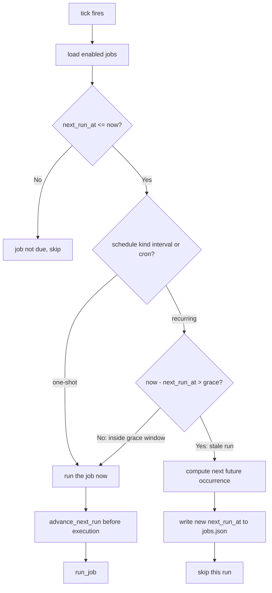
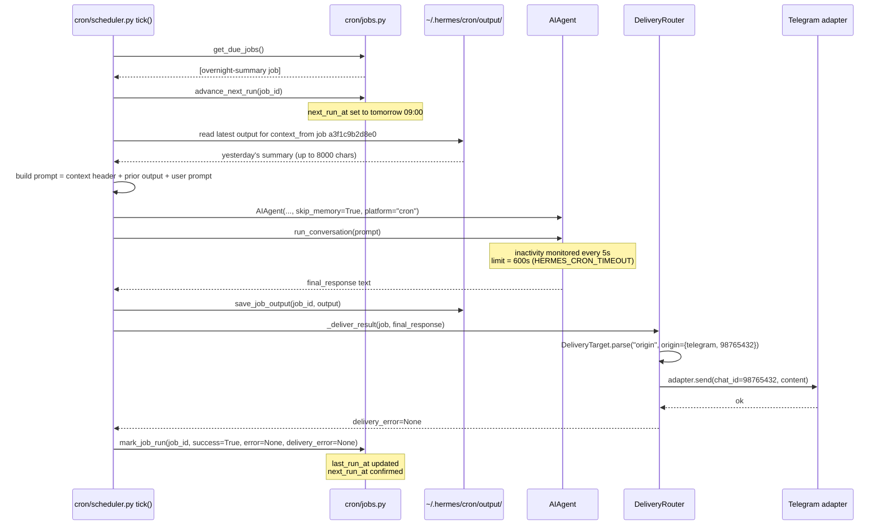

**TL;DR** — This scenario walks a recurring overnight-summary job through the full lifecycle: creating the job with `deliver="origin"` and `context_from` chaining, surviving a missed window via the stale-run fast-forward (which skips stale runs rather than replaying them), running the agent under a 600-second inactivity timeout, and delivering the result back to the originating Telegram chat via `DeliveryRouter`. After reading this you will be able to design, create, and reason about the failure modes of a recurring cron job that delivers to the chat it was created from.

# Scenario 4 — Cron Job with Stale-Run Fast-Forward and Platform Delivery

Two concepts from earlier chapters underpin this scenario. If they are new to you, here is a quick anchor for each:

**The cron scheduler** (`cron/scheduler.py`) runs a `tick()` function every 60 seconds from a background thread. Each tick loads all enabled jobs, identifies which ones are due, and runs them — subject to a file-based lock at `~/.hermes/cron/.tick.lock` that prevents two ticks from overlapping. See [Cron Scheduler](../autonomy/cron-scheduler.md) for the full mechanism.

**Gateway delivery** is the routing layer that sends a completed job's output back to a messaging platform. `DeliveryTarget.parse()` resolves a delivery string like `"origin"` or `"telegram:123456"` into a concrete target, and `DeliveryRouter.deliver()` dispatches it to the right platform adapter. See [Routing, Delivery, and Stream Events](../gateway/routing-delivery-and-stream-events.md) for the full mechanism.

With those anchors in place, let's trace the whole scenario.

---

## The scenario we are building

We want a job that runs every morning at 09:00 and posts an overnight-activity summary to the Telegram chat where we set it up. The job will also pull in the previous run's output as context, so the agent can notice trends across days ("yesterday it found 3 issues; today there are 5"). The job is created from a Telegram conversation, so `deliver="origin"` routes the result back there automatically.

What we need to handle, beyond the happy path:

- The host machine was asleep from 08:50 to 09:15 — the 09:00 window was missed.
- The job runs for a while, and we need to guard against it hanging.
- Multiple windows are missed at once (machine off for several days).
- The originating Telegram chat is unreachable when we try to deliver.
- We want a simpler "script-only" variant that does not use an agent at all.

Let's build this up step by step.

---

## Step 1 — Creating the job

### The problem this step solves

We need to persist a recurring job definition that the scheduler can pick up on every tick. The definition must record: what prompt to run, how often, where to send the output, which prior job's output to inject as context, and which platform chat it was created in (so `deliver="origin"` knows where to go).

### Creating the job from a Telegram conversation

When we type a command like this in our connected Telegram chat, Hermes parses and stores the job:

```bash
hermes cron create "0 9 * * *" \
  "Summarise the overnight agent activity log. Highlight any errors, unusual tool usage, or patterns worth noting." \
  --name "overnight-summary" \
  --context_from a3f1c9b2d8e0 \
  --deliver origin
```

Here `"0 9 * * *"` is a standard five-field cron expression — minute 0, hour 9, every day of month, every month, every day of week — meaning 09:00 every day. The `--context_from a3f1c9b2d8e0` flag references the job ID of a separate data-collection job whose most recent saved output will be injected into our prompt as context. The `--deliver origin` flag tells the scheduler to route the finished output back to the platform and chat where this `hermes cron create` command was run.

Internally, `create_job()` in `cron/jobs.py` calls `parse_schedule("0 9 * * *")`, which identifies the schedule kind as `"cron"` (five-field expression), validates it with `croniter`, and returns `{"kind": "cron", "expr": "0 9 * * *"}`. The resulting job record written to `~/.hermes/cron/jobs.json` looks like this (simplified):

```json
{
  "id": "7b8c2d4e1f3a",
  "name": "overnight-summary",
  "prompt": "Summarise the overnight agent activity log...",
  "schedule": { "kind": "cron", "expr": "0 9 * * *" },
  "deliver": "origin",
  "origin": {
    "platform": "telegram",
    "chat_id": "98765432",
    "thread_id": null
  },
  "context_from": ["a3f1c9b2d8e0"],
  "no_agent": false,
  "enabled": true,
  "state": "scheduled",
  "next_run_at": "2026-06-11T09:00:00+10:00",
  "last_run_at": null
}
```

Notice `"origin"` is stored as a dict with the platform, chat ID, and optional thread ID. This is what `deliver="origin"` resolves against later. If `origin` were missing or malformed, the delivery layer would fall back to any configured home channel rather than crashing.

---

## Step 2 — The scheduler tick and the stale-run fast-forward

### The problem this step solves

The host machine was asleep from 08:50 to 09:15. The 09:00 window passed while the scheduler was not running. When the scheduler wakes up at 09:15, it finds a job whose `next_run_at` is fifteen minutes in the past. We have a choice: run it now (late), or skip it and advance to the next scheduled occurrence. The wrong choice — always catching up — could fire dozens of stale runs in a row after a long outage. The right choice depends on how stale "stale" actually is.

### The grace window formula

`cron/jobs.py` defines `_compute_grace_seconds(schedule)`:

- For a **`cron`** schedule, it computes the period by asking `croniter` for two consecutive future occurrences and taking the difference.
- For an **`interval`** schedule, the period is `minutes × 60` seconds.
- In both cases: `grace = period_seconds // 2`, clamped between **120 seconds** (2 minutes minimum) and **7200 seconds** (2 hours maximum).

For our daily 09:00 job, the period is 86400 seconds (24 hours). Half of that is 43200 seconds — but the clamp applies, so the grace window is **7200 seconds (2 hours)**.

| Schedule | Period | Half-period | Grace (clamped) |
|---|---|---|---|
| Daily `0 9 * * *` | 86400s (24h) | 43200s | **7200s (2h)** |
| Hourly `0 * * * *` | 3600s (1h) | 1800s | **1800s (30m)** |
| Every 10 minutes `*/10 * * * *` | 600s | 300s | **300s (5m)** |
| Every 3 minutes `*/3 * * * *` | 180s | 90s | **120s (minimum)** |

Our job was due at 09:00 and the scheduler woke at 09:15 — a 15-minute lag. The grace window is 2 hours, so 15 minutes is well inside the window. The job fires now (a late but valid run).

Now let's say the machine was off overnight and the scheduler woke at 11:30 instead. The lag is 2.5 hours, which exceeds the 2-hour grace. In that case `_get_due_jobs_locked()` detects the stale run and **fast-forwards**: it calls `compute_next_run(schedule, now.isoformat())` to find the next 09:00 that is still in the future (tomorrow's 09:00), writes that into `next_run_at`, and skips the stale run entirely. The log records:

```
INFO  Job 'overnight-summary' missed its scheduled time (2026-06-11T09:00:00, grace=7200s).
      Fast-forwarding to next run: 2026-06-12T09:00:00+10:00
```

The stale-run fast-forward decision as a flowchart:



### At-most-once semantics: `advance_next_run`

Notice the box "advance `next_run_at` before execution" in the flowchart. Before any job begins executing, `tick()` calls `advance_next_run(job_id)` for every due recurring job. This writes the *next* future occurrence into `next_run_at` while the current run is still in progress. If the process crashes mid-execution, the job will not fire again at the same time on restart — it will wait for the next scheduled tick. This converts the scheduler from at-least-once to **at-most-once** for recurring jobs. A missed run is far better than dozens of replayed runs.

---

## Step 3 — Running the agent, injecting context, and the inactivity timeout

### The problem this step solves

The job has passed the stale-run check and is about to execute. We need to: inject the prior job's output as context, construct the agent, run it, and guard against it hanging indefinitely on a stuck API call or tool.

### The full lifecycle sequence



### The `context_from` injection

Before passing the prompt to the agent, `run_job()` in `cron/scheduler.py` checks `job.get("context_from")`. For each source job ID in the list, it reads the most recent `.md` file from `~/.hermes/cron/output/<source_job_id>/`, sorted by modification time. The content is prepended to the prompt, truncated to 8000 characters if needed:

```
## Output from job 'a3f1c9b2d8e0'
The following is the most recent output from a preceding cron job.
Use it as context for your analysis.

```
<yesterday's summary text, up to 8 000 chars>
```

Summarise the overnight agent activity log...
```

The agent sees both the prior output and the original prompt, so it can compare today's activity against yesterday's baseline. This is the "chaining" pattern: job A collects data, job B analyses it. Neither job calls the other directly — they share output through the filesystem.

Job IDs are validated before the path is resolved: only 12-character lowercase hex strings are accepted. An invalid `context_from` reference is silently skipped (logged at WARNING level), not an error that blocks the run.

### The 600-second inactivity timeout

The agent runs inside a `ThreadPoolExecutor` with a single worker thread. The main thread polls it every 5 seconds and checks `agent.get_activity_summary()` for `seconds_since_activity`. Activity is updated on every tool call, API call, and stream token received. If no activity is recorded for **600 seconds** (10 minutes), the scheduler cancels the future and logs:

```
ERROR  Job 'overnight-summary' idle for 600s (inactivity limit 600s).
       Last activity: streaming response tokens, 600s ago.
       Tool in progress: (none). API call count: 3 / max 40.
```

This is an *inactivity* timeout, not a wall-clock timeout. A job that is actively receiving a large LLM response can run for hours — only a complete hang (stuck API call, unresponsive tool) triggers it. Override with `HERMES_CRON_TIMEOUT=<seconds>` (set to `0` for unlimited). A separate `HERMES_CRON_SCRIPT_TIMEOUT` controls script-only jobs.

Note that `skip_memory=True` is set when constructing the `AIAgent` for cron jobs. This means the agent does not load or save memory entries for the cron session, which prevents cron runs from corrupting the user's personal memory representations.

---

## Step 4 — Delivering to the originating platform

### The problem this step solves

The agent has finished and produced a response. We need to send it back to the Telegram chat where the job was created — not to a hardcoded channel, but to the exact chat and thread recorded at job-creation time.

### How `deliver="origin"` resolves

`_resolve_single_delivery_target(job, "origin")` reads `job["origin"]`:

```python
{
    "platform": "telegram",
    "chat_id": "98765432",
    "thread_id": None
}
```

It returns a concrete target dict: `{"platform": "telegram", "chat_id": "98765432", "thread_id": None}`. The scheduler then calls `_deliver_result(job, content, adapters=adapters, loop=loop)`, which passes this dict to `DeliveryRouter`. The router looks up the live Telegram adapter from `adapters`, checks whether the content exceeds 4000 characters (truncating and saving the full output locally if so), and calls `adapter.send("98765432", content)`.

The cron output is always saved locally first (to `~/.hermes/cron/output/<job_id>/<timestamp>.md`), regardless of whether platform delivery succeeds. If platform delivery fails, `last_delivery_error` is recorded in the job record but the run itself is still marked `last_status: "ok"` (the agent succeeded; delivery is a separate concern).

### Delivery targets at a glance

| `deliver` value | What happens |
|---|---|
| `"origin"` | Routes to the platform + chat_id + thread_id stored in `job["origin"]` |
| `"local"` | Saves to `~/.hermes/cron/output/` only; no platform send |
| `"telegram"` | Sends to the Telegram home channel (`TELEGRAM_HOME_CHANNEL_ID`) |
| `"telegram:98765432"` | Sends to that specific chat ID |
| `"telegram:98765432:42"` | Sends to a specific Telegram forum topic (thread 42) |
| `"discord"` | Sends to the Discord home channel |
| `"slack"` | Sends to the Slack home channel |

If the resolved platform adapter is not configured or the home channel ID is unset, the delivery silently falls back — the output is still saved locally.

---

## Edge cases

### Several windows missed at once

The fast-forward logic fires once per `get_due_jobs()` call, not in a loop. If a daily job was due three times while the machine was off, the scheduler sees **one** stale `next_run_at`, fast-forwards it to tomorrow, and skips. There is no "catch up" loop that fires the job N times. You get at most one run per tick, and only if that run's `next_run_at` falls inside the grace window.

### The originating chat is unreachable at delivery time

If `adapter.send()` raises an exception (network error, bot removed from chat, expired token), `_deliver_result()` catches it and returns the error string. This is stored in `job["last_delivery_error"]` and logged at ERROR level. The job's `last_status` is still `"ok"` if the agent itself succeeded. The full output is already saved locally to `~/.hermes/cron/output/<job_id>/`. You can check delivery errors with `hermes cron list` or by reading `jobs.json` directly. On the next run, the scheduler attempts delivery again from scratch — it does not retry failed deliveries between runs.

If the job has `deliver="origin"` but the `origin` field is missing or malformed (for example, the job was created programmatically without an origin), the scheduler tries each platform's configured home channel as a fallback, logging a warning. If no home channel is configured either, the output is saved locally and delivery is silently skipped.

### The `no_agent=True` script-only variant

Not every recurring job needs an LLM. For classical watchdogs and periodic alerts that produce deterministic output, you can skip the agent entirely:

```bash
hermes cron create "every 5m" \
  "check disk usage" \
  --script ~/.hermes/scripts/disk-check.sh \
  --no-agent \
  --deliver telegram
```

With `no_agent=True`, the scheduler runs the script directly and delivers its stdout verbatim — no `AIAgent` is constructed, no LLM call is made, and the inactivity timeout does not apply (a separate `HERMES_CRON_SCRIPT_TIMEOUT` governs script-only jobs). Empty stdout results in silent delivery (nothing sent). This mode requires `script` to be set; `no_agent=True` without a script raises a `ValueError` at create time.

The `context_from` field is still read at prompt-assembly time for agent jobs, but for `no_agent=True` jobs the prompt is ignored — only the script's stdout matters.

### Verifying your job and its last delivery status

```bash
hermes cron list
```

This shows each job's name, schedule, next run time, last status, and — if set — the last delivery error. To trigger an immediate run for testing:

```bash
hermes cron trigger overnight-summary
```

This sets `next_run_at` to now and lets the next `tick()` pick it up.

---

## Putting it all together

Here is the complete creation command for the scenario we traced through:

```bash
hermes cron create "0 9 * * *" \
  "Summarise the overnight agent activity log. Highlight any errors, unusual tool usage, or patterns worth noting. Compare with the previous day's summary if available." \
  --name "overnight-summary" \
  --context_from a3f1c9b2d8e0 \
  --deliver origin
```

What happens end-to-end on a normal morning (scheduler wakes, job is due inside the grace window):

1. `tick()` calls `get_due_jobs()` → job is due, 09:00 is within the 2-hour grace window.
2. `advance_next_run("7b8c2d4e1f3a")` writes tomorrow's 09:00 to `next_run_at`.
3. The most recent output from job `a3f1c9b2d8e0` is read and prepended to the prompt.
4. `AIAgent(skip_memory=True, platform="cron")` is constructed and `run_conversation(prompt)` is called.
5. The inactivity monitor polls every 5 seconds; 600 seconds of silence would abort the run.
6. The agent finishes; output is saved to `~/.hermes/cron/output/7b8c2d4e1f3a/<timestamp>.md`.
7. `_deliver_result()` resolves `deliver="origin"` to `{telegram, 98765432}` and calls the Telegram adapter.
8. `mark_job_run("7b8c2d4e1f3a", success=True, delivery_error=None)` finalises the record.

What happens if the machine wakes 2.5 hours late:

1. `get_due_jobs()` finds `next_run_at` is 2.5 hours in the past — exceeds the 2-hour grace.
2. `compute_next_run(schedule, now.isoformat())` returns tomorrow's 09:00.
3. `next_run_at` is updated; the job is skipped this tick. No run, no delivery.
4. Tomorrow at 09:00 the normal path resumes.

---

← Previous: [Scenario 3 — Multi-Profile Swarm Coordination](./multi-profile-swarm.md) · Next: [Scenario 5 — Human-in-the-Loop Approval Workflow](./human-in-the-loop-approval.md) →
