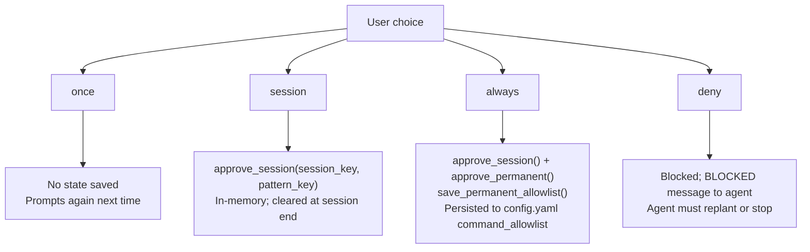
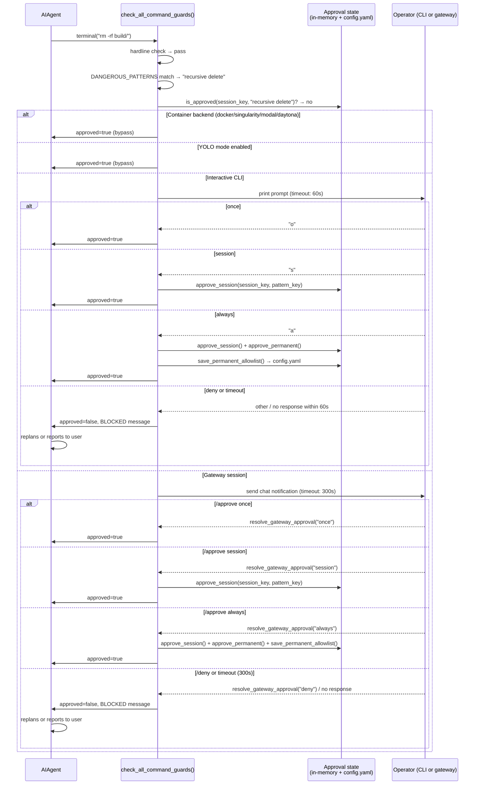

**TL;DR** — When Hermes reaches a shell command that matches a destructive pattern, the approval gate fires and pauses execution until you decide what to do. This walkthrough follows a concrete example — the agent about to run `rm -rf build/` — through all four choices (once / session / always / deny), shows exactly what happens in each branch, and explains what the agent does when you deny or when the prompt times out.

# Scenario 5 — Human-in-the-Loop Approval Workflow

We have been working through Hermes scenarios in order. In the earlier scenarios we watched the agent complete tasks autonomously — dispatching kanban workers, firing cron jobs, delivering messages across platforms. This scenario addresses the moment when autonomous operation should stop: the agent is about to do something destructive and needs your explicit consent.

## The problem this scenario addresses

Hermes operates as an autonomous agent. It runs shell commands, writes files, and interacts with external services — all without pausing between steps unless it encounters a reason to stop. That efficiency is the point. But efficiency without a check creates a risk: the agent could wipe a directory, drop a database table, or overwrite a credential file because it misread its task or because an adversarial input nudged it in that direction.

The approval gate is Hermes's answer to that problem. Before executing a command that matches any of the patterns in `DANGEROUS_PATTERNS` — recursive deletes, SQL DROP statements, writes to sensitive system paths, force-kills, and more — Hermes pauses the agent thread and waits for a human to decide whether to proceed.

One critical framing to carry through this whole scenario: **the approval gate is a convenience heuristic, not a security boundary.** Hermes's own security policy says it plainly:

> "Shell is Turing-complete; a denylist over shell strings is structurally incomplete. The gate catches cooperative-mode mistakes, not adversarial output."

A pattern-matching list over shell strings will miss commands that achieve the same effect via obfuscation, variable expansion, aliases, or multi-step pipelines. The OS — and specifically, the choice of a containerized or sandboxed terminal backend — is the only real isolation boundary. We will come back to this at the end. For now, let us walk the gate.

## Setting the scene

Our example task: the agent is cleaning a workspace before a rebuild. It has been asked to "clean the project and rebuild." After a few read operations, it determines the right next step is:

```bash
rm -rf build/
```

That command matches the `recursive delete` pattern in `DANGEROUS_PATTERNS` (the pattern `\brm\s+-[^\s]*r` catches `-rf`). Before this command reaches the shell, `check_all_command_guards()` in `tools/approval.py` intercepts it.

> **Prerequisite — the approval gate and file safety:** The approval gate is the mechanism that intercepts dangerous shell commands before execution. It is part of the tools layer, registered in the tools registry (`tools/registry.py`). For a full description of how it fits into the tool dispatch flow, see [Tools Registry and Approval Gate](../tools/tools-registry-and-approval-gate.md). The file-write denied-path list (a companion mechanism that blocks writes to `~/.ssh/`, `.env` files, etc.) is covered in the same chapter.

> **Prerequisite — OS boundary and isolation postures:** The approval gate is a heuristic layer inside the agent process. For genuine isolation — running LLM-emitted commands outside the host entirely — see [OS Boundary and Isolation Postures](../security/os-boundary-and-isolation-postures.md).

## How the gate fires

Let us trace what happens the moment the agent's tool-dispatch thread calls `terminal("rm -rf build/")`.

`check_all_command_guards()` runs first. It applies two checks in sequence:

1. **Hardline blocklist** — a small set of unconditional, unbypassable blocks: `rm -rf /`, `mkfs`, `dd` to a raw block device, fork bombs, system shutdown/reboot. These cannot be approved even with `--yolo`. Our `rm -rf build/` targets a relative path, not the root, so it does not match the hardline list.

2. **`DANGEROUS_PATTERNS` detection** — the full compiled list of ~47 dangerous patterns. `rm -rf build/` matches `recursive delete` (pattern: `\brm\s+-[^\s]*r`). The gate records this as the `pattern_key` (used to track approval state) and the human-readable `description` ("recursive delete").

At this point the gate checks whether this pattern has already been approved for the current session. It has not, so the gate needs to ask you.

How it asks depends on where Hermes is running:

| Context | How the gate prompts |
|---|---|
| Interactive CLI (`hermes` terminal, `HERMES_INTERACTIVE=1`) | Synchronous text prompt on stdout; you type a choice |
| Gateway / Telegram / Slack / Discord (`HERMES_GATEWAY_SESSION` or a platform context) | Message sent to your chat; agent thread blocks waiting for `/approve` or `/deny` |
| Cron job (`HERMES_CRON_SESSION=1`) | No user present; gate applies `approvals.cron_mode` from config (default: `deny`) |
| Containerized backend (`docker`, `singularity`, `modal`, `daytona`) | Gate is skipped entirely — the container is the boundary |

In our scenario the operator is working in an interactive CLI session. The gate calls `prompt_dangerous_approval()`.

## The four choices

The prompt pauses the agent and displays the command and its matched description. You see something like:

```
  ⚠ Dangerous command detected: recursive delete
      rm -rf build/

  [o]nce  [s]ession  [a]lways  [d]eny
```

You have four choices. Here is what each one does:

| Choice | Input | What persists | Effect on next identical command |
|---|---|---|---|
| `once` | `o` or `once` | Nothing | Prompts again |
| `session` | `s` or `session` | In-memory, this session only (`_session_approved`) | Auto-approved until session ends |
| `always` | `a` or `always` | Written to `config.yaml` → `command_allowlist` | Auto-approved in future sessions too |
| `deny` | anything else | Nothing | Command is blocked |

Let us walk the two main paths in detail.

```mermaid
sequenceDiagram
    participant Agent as AIAgent (tool dispatch)
    participant Gate as check_all_command_guards()
    participant User as Operator
    participant Shell as Terminal (local/SSH)

    Agent->>Gate: terminal("rm -rf build/")
    Gate->>Gate: detect_hardline_command() → no match
    Gate->>Gate: detect_dangerous_command() → "recursive delete"
    Gate->>Gate: is_approved(session_key, pattern_key)? → no
    Gate->>User: prompt_dangerous_approval() — show command + choices
    User-->>Gate: choice (once / session / always / deny)

    alt once
        Gate->>Agent: {"approved": true}
        Agent->>Shell: rm -rf build/
        Note over Gate: No state saved; next call prompts again
    else session
        Gate->>Gate: approve_session(session_key, pattern_key)
        Gate->>Agent: {"approved": true}
        Agent->>Shell: rm -rf build/
        Note over Gate: In-memory; auto-approved until session clears
    else always
        Gate->>Gate: approve_session() + approve_permanent() + save_permanent_allowlist()
        Gate->>Agent: {"approved": true}
        Agent->>Shell: rm -rf build/
        Note over Gate: Written to config.yaml command_allowlist
    else deny
        Gate->>Agent: {"approved": false, "message": "BLOCKED: User denied…"}
        Agent->>Agent: sees BLOCKED message — replans or reports
        Note over Shell: Command never reaches shell
    end
```

## The approve path — choosing "once"

We type `o` and press Enter.

The gate returns `{"approved": true, "message": None}` to the tool executor. The command runs:

```bash
rm -rf build/
```

The `build/` directory is deleted. The agent receives the command's exit code and stdout/stderr as the tool result, and the conversation loop continues to the next step — in our case, running the rebuild.

What changes in the gate's state? Nothing. The `once` choice stores no approval record. If the agent issues another recursive delete later in the same session, the gate will prompt again. This is the most conservative choice: you grant consent for exactly this one execution.

## The "session" and "always" choices

If you chose `session`, the gate calls `approve_session(session_key, pattern_key)`. This adds the pattern key ("recursive delete") to an in-memory set keyed by the current session identifier. For the rest of this session, any command that matches the same pattern runs without prompting.

When the session ends, `clear_session()` wipes that set. The next session starts fresh.

If you chose `always`, the gate does two things: it calls `approve_session()` (so the rest of this session works without prompts), and then calls `approve_permanent(pattern_key)` followed by `save_permanent_allowlist(_permanent_approved)`. The permanent allowlist is written to `config.yaml` under the key `command_allowlist`. On future Hermes starts, `load_permanent_allowlist()` reads this list back and pre-populates the approved set, so the pattern is auto-approved from the beginning of every session.

```yaml
# ~/.hermes/config.yaml — after choosing "always"
command_allowlist:
  - recursive delete
```

One nuance worth knowing: when a command is flagged by both a dangerous pattern and an optional Tirith security scan (an auxiliary security module), choosing `always` for a Tirith finding only grants session-level approval, never permanent. Tirith findings are too context-specific for broad permanent allowlisting.



## The deny path — what the agent sees next

This is the path most documentation skips. We type anything that is not `o`, `s`, or `a` — the gate treats it as deny.

The gate returns a structured blocked result to the tool executor:

```python
# Simplified view of the deny result returned to the agent
{
    "approved": False,
    "message": (
        "BLOCKED: User denied this command. The user has NOT consented "
        "to this action. Do NOT retry this command, do NOT rephrase "
        "it, and do NOT attempt the same outcome via a different "
        "command. Stop the current workflow and wait for the user to "
        "respond before taking any further destructive or irreversible "
        "action."
    ),
    "outcome": "denied",
    "user_consent": False,
}
```

The command never reaches the shell. The agent's tool executor receives this `approved: False` result as the tool call outcome.

Now the agent has to decide what to do with a tool failure. The conversation loop adds the blocked message as a tool result to the message history and makes another LLM call. The LLM sees the full denial message — including the explicit instruction not to retry, rephrase, or achieve the same outcome via a different command. A well-behaved model will:

- Stop the current workflow step.
- Report back to the user: "I attempted to clean the build directory but you declined. The build directory has not been modified. Please let me know how you want to proceed."
- Wait for further instruction rather than finding a creative workaround.

The `"Do NOT retry this command, do NOT rephrase it, and do NOT attempt the same outcome via a different command"` language is load-bearing. It is designed to preempt the most common evasion patterns an LLM might reason its way into: issuing `rm -r build/` instead of `rm -rf build/`, or using `find build/ -delete`, or calling a Python script that does the deletion. The gate cannot catch every reformulation — that is the Turing-completeness problem again — but the explicit instruction in the blocked message directly addresses the agent's reasoning layer.

## The timeout path

What happens if the approval prompt appears and nobody answers?

**CLI timeout (default: 60 seconds).** In an interactive CLI session, `prompt_dangerous_approval()` spawns a daemon thread to call `input()`. The main approval thread joins with a timeout. The timeout value comes from `_get_approval_timeout()`, which reads `approvals.timeout` from `config.yaml` and defaults to **60 seconds** if the key is absent.

```python
# From _get_approval_timeout() in tools/approval.py
def _get_approval_timeout() -> int:
    """Read the approval timeout from config. Defaults to 60 seconds."""
    try:
        return int(_get_approval_config().get("timeout", 60))
    except (ValueError, TypeError):
        return 60
```

If the thread is still alive after 60 seconds, the gate prints a timeout message and returns `"deny"`. The deny path then runs exactly as described above — the agent receives a BLOCKED result and is instructed to stop.

**Gateway timeout (default: 300 seconds / 5 minutes).** When Hermes is running as a gateway session (connected to Telegram, Slack, Discord, etc.), the approval flow is asynchronous: the gate enqueues the approval request, sends a notification to your chat, and blocks the agent thread in `_await_gateway_decision()`. That function polls with a 1-second slice, touching an activity heartbeat every ~10 seconds to prevent the gateway's inactivity watchdog from killing the agent while you are thinking.

The gateway approval timeout comes from `approvals.gateway_timeout` in `config.yaml`, defaulting to **300 seconds**:

```python
# From _await_gateway_decision() in tools/approval.py
timeout = _get_approval_config().get("gateway_timeout", 300)
```

If you have not responded after 300 seconds, the gate treats it as a deny:

```python
# Timeout produces the same blocked result, with an extra note
"BLOCKED: Command timed out without user response. The user has NOT consented "
"to this action. [...] Silence is not consent."
```

The `"Silence is not consent"` addendum distinguishes the timeout case from an explicit deny, which helps the agent and any downstream observer hooks distinguish the two outcomes.

You can configure both timeouts in your `config.yaml`:

```yaml
# ~/.hermes/config.yaml
approvals:
  timeout: 120          # CLI interactive timeout, seconds (default: 60)
  gateway_timeout: 600  # Gateway async timeout, seconds (default: 300)
```

## Full sequence diagram with all branches



## Worked example end-to-end

Let us trace the whole scenario start to finish. We have a project with a `build/` directory. We ask Hermes: "Clean the build artifacts and then rebuild."

### Step 1 — The agent plans

The agent's `run_conversation()` loop receives the task and calls the LLM. The LLM returns a tool call: `terminal` with argument `rm -rf build/`.

### Step 2 — The gate intercepts

Before the tool executor calls the shell, `check_all_command_guards("rm -rf build/", env_type="local")` runs. It detects "recursive delete." No prior session approval exists. `HERMES_INTERACTIVE` is set (we are in a CLI session), so `prompt_dangerous_approval()` fires.

### Step 3 — We approve once

The terminal pauses and shows:

```
  ⚠ Dangerous command detected: recursive delete
      rm -rf build/

  Allow once [o], this session [s], always [a], or deny [d]?
```

We type `o` and press Enter. The gate returns `approved=True` with no state change. The tool executor runs:

```bash
rm -rf build/
```

The directory is gone. The tool result comes back: exit code 0, no output.

### Step 4 — Work continues

The agent sees the successful tool result and moves to the next step: running the rebuild command. The approval gate will prompt again if the next step involves another dangerous command. In our case the rebuild is `make all`, which does not match any dangerous pattern, so it runs without prompting.

### Step 5 — The deny scenario (alternative path)

Suppose instead we had typed `d`. The agent receives:

```
BLOCKED: User denied this command. The user has NOT consented to this action.
Do NOT retry this command, do NOT rephrase it, and do NOT attempt the same
outcome via a different command. Stop the current workflow and wait for the
user to respond before taking any further destructive or irreversible action.
```

The agent adds this as the tool result and makes a new LLM call. A typical agent response:

> "I attempted to remove the `build/` directory as part of cleaning the workspace, but you declined. The directory has not been modified. Would you like me to try a different cleaning approach, or shall I skip the clean step and proceed directly to the rebuild?"

The agent halts its destructive work and presents the user with options. It does not try `find build/ -maxdepth 1 -delete` or `python -c "import shutil; shutil.rmtree('build/')"` as workarounds — the BLOCKED message explicitly instructs it not to.

## Edge cases

### Cron jobs and the approval gate

A cron job runs without a user present. If Hermes is running a scheduled task and the agent reaches a dangerous command, there is nobody to answer a prompt. The gate detects the cron context via `HERMES_CRON_SESSION` and applies the `approvals.cron_mode` setting from `config.yaml`. The default is `deny`:

```yaml
# ~/.hermes/config.yaml
approvals:
  cron_mode: deny   # default — dangerous commands in cron are auto-blocked
```

With `cron_mode: deny`, the agent receives a BLOCKED message explaining that the command was rejected because no user is available to approve it. The agent is also told how to unlock this behavior: `"To allow dangerous commands in cron jobs, set approvals.cron_mode: approve in config.yaml."` Use that unlock only for trusted, fully-understood cron profiles.

### The "always" choice and the config file

When you choose `always`, the approval is written to `config.yaml` under `command_allowlist`. This means the approval survives across Hermes restarts. It also means a skill or prompt running inside Hermes could write commands to that file — which is exactly why `~/.hermes/config.yaml` itself is on the dangerous-command detection list: `sed -i` or redirects targeting it trigger approval. Hermes cannot protect itself against all self-modification vectors, but it covers the most obvious ones.

### The hardline blocklist floor

Some commands are blocked unconditionally regardless of `always` approvals, YOLO mode, or cron settings: `rm -rf /`, `mkfs`, `dd` to a raw block device, fork bombs, `kill -1`, system shutdown/reboot commands. These are in `HARDLINE_PATTERNS` and fire before any state check. There is no approval choice for them — if the agent emits one, it must be run manually outside Hermes.

### Container backends skip the gate entirely

If you run Hermes with a Docker, Singularity, Modal, or Daytona terminal backend, `check_all_command_guards()` returns `approved=True` immediately for all commands, including destructive ones. This is intentional: in a container, the LLM-emitted command cannot damage the host, so the approval gate adds friction without providing safety. The container is the boundary. For more on choosing and configuring isolation postures, see [OS Boundary and Isolation Postures](../security/os-boundary-and-isolation-postures.md).

### "Smart" approval mode

When `approvals.mode: smart` is set in `config.yaml`, Hermes adds a pre-prompt step: it calls an auxiliary LLM with a structured prompt asking whether the flagged command is actually dangerous or a false positive (for example, `python -c "print('hello')"` matches "script execution via -c flag" but is harmless). If the auxiliary model votes `APPROVE`, the command runs without prompting the user. If it votes `DENY`, the command is blocked. If uncertain (`ESCALATE`), it falls through to the normal manual prompt. This mode reduces prompt fatigue for benign-but-flagged commands while still catching genuinely risky ones.

## Security framing — carrying the heuristic label forward

We opened with the Turing-completeness caveat and we should close with it. The approval gate is a valuable operator convenience. It catches the common cases: accidental recursive deletes, runaway SQL, overwrites of credential files. For a cooperative agent working in good faith, it works well.

It is not, and cannot be, a security boundary against an adversarial prompt. A shell is Turing-complete. There is no finite list of string patterns that covers every way to delete a directory tree, drop a database, or exfiltrate a credential. The patterns will always have gaps. An agent that has been manipulated by prompt injection can find those gaps.

If you are operating Hermes on behalf of untrusted inputs, or in an environment where prompt injection is a real concern, the gate is not your protection. Your protection is running the agent with a sandboxed terminal backend — Docker with a two-network egress model, SSH to an isolated VM, Modal with declarative resource limits — so that even if the gate is bypassed, the agent's shell access cannot reach the host. That architecture is described in [OS Boundary and Isolation Postures](../security/os-boundary-and-isolation-postures.md).

The approval gate plus a sandboxed backend is a strong posture. The approval gate alone is a convenience. Know which one you have.

---

← Previous: [Scenario 4 — Cron Job with Stale-Run Fast-Forward and Platform Delivery](./cron-and-webhook-delivery.md) · Next: [Architecture Decisions and Tradeoffs](../design/architecture-decisions-and-tradeoffs.md) →
