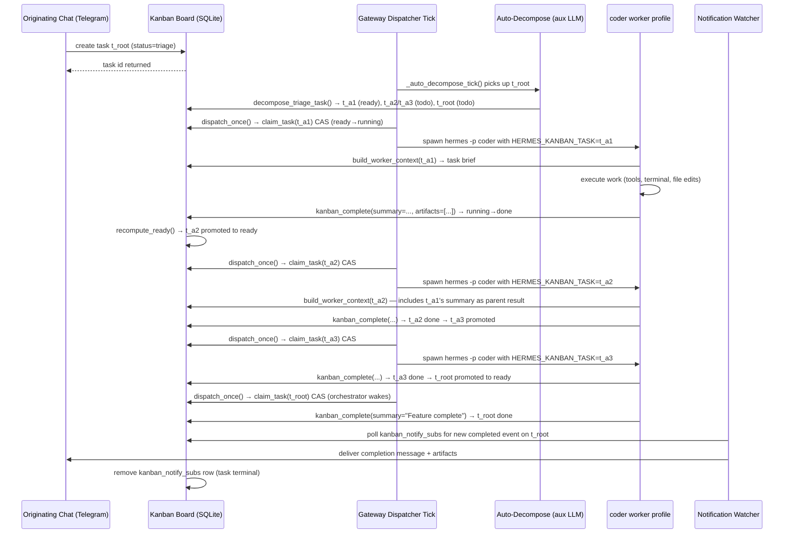

**TL;DR** — This chapter follows a single feature request from the moment it lands as a `triage` task all the way to a worker completing it and the originating chat receiving the notification. We trace every status hop, name every function that drives the transition, and cover what happens when a worker crashes mid-flight.

# Scenario 2 — Kanban Board Workflow End to End

## Why the kanban board exists

Suppose a team wants an agent profile called `coder` to implement a small feature. Nobody wants to sit at a terminal and babysit the agent: they want to drop a request somewhere, walk away, and receive a message when the work is done.

That is precisely the problem the Hermes kanban board solves. It is a durable SQLite-backed task queue shared across named agent profiles. Tasks sit in the queue until a dispatcher tick claims them for the right worker; the worker runs; the result flows back to whoever submitted the request — including to a Telegram chat that was open when the request was dropped.

This chapter walks that entire loop with a concrete example.

---

## Prerequisites (quick recap)

**Kanban dispatch** (`_kanban_dispatcher_watcher`): the gateway runs a background loop that fires `dispatch_once()` on a configurable interval (default 60 seconds). Each tick promotes ready tasks and spawns workers. See [Kanban Dispatch](../multi-agent/kanban-dispatch.md) for the full mechanism.

**The nine-status state machine**: every task in the kanban DB has a `status` field drawn from `VALID_STATUSES` — `{"triage", "todo", "scheduled", "ready", "running", "blocked", "review", "done", "archived"}` (defined in `hermes_cli/kanban_db.py:100`). Statuses move forward; the dispatcher and workers are the only writers. See [Nine-Status State Machine](../task-lifecycle/nine-status-state-machine.md) for the full transition rules.

**Task dataclass and handoff**: a `Task` object carries `id`, `title`, `body`, `assignee`, `status`, `workspace_path`, and the key handoff fields (`result`, `summary`, `metadata`) that downstream children and notification subscribers read. See [Task Dataclass, DAG, and Handoff](../task-lifecycle/task-dataclass-dag-and-handoff.md) for field-level detail.

---

## The example we'll follow

Let's say we are inside a Telegram chat connected to the Hermes gateway. We type:

```
/kanban create --triage "Implement password-reset email feature" --assignee coder
```

This creates a task with status `triage` and assignee `coder` on the default board. From here, everything is automatic.

---

## Step 1 — A triage task is created

A **triage task** is a rough idea that has not yet been broken into actionable work items. Creating one with `--triage` forces `status = 'triage'` regardless of parent dependencies:

```python
# Simplified view of create_task() in kanban_db.py
# status forced to 'triage' when triage=True
INSERT INTO tasks (id, title, assignee, status, ...) VALUES (?, ?, ?, 'triage', ...)
```

The task sits in `triage` until the dispatcher's auto-decompose pass processes it.

## Step 2 — Auto-decompose fans the task into children

Here is the first problem: a vague goal like "implement password-reset email feature" is not something a worker agent can immediately start executing. It needs to be broken into concrete, dependency-ordered subtasks — and that job belongs to auto-decompose.

The gateway's `_kanban_dispatcher_watcher` runs `_auto_decompose_tick()` on every tick (gated by `kanban.auto_decompose`, which defaults to `True`). That function calls `kanban_decompose.decompose_task()` for each task currently in `triage`, up to `kanban.auto_decompose_per_tick` tasks per tick (default 3, so a bulk load of triage tasks never bursts the auxiliary LLM in one shot).

Under the hood, `decompose_task()` invokes an auxiliary LLM call to suggest a child task graph, then calls `decompose_triage_task()` in `kanban_db.py`. That function does the following in a single atomic write transaction:

1. Inserts each child task with `status = 'todo'`.
2. Records parent/child links in `task_links`.
3. Links the **root** (triage) task as a child of every leaf child in the new graph — so the root cannot complete until all children are done.
4. Flips the root from `triage → todo`.
5. Calls `recompute_ready()` to immediately promote any leaf children with no unsatisfied parents.

For our feature request, imagine three children are created:

| Task ID | Title | Parents |
|---|---|---|
| `t_a1` | Add password reset database schema | (none) |
| `t_a2` | Implement reset-token API endpoint | `t_a1` |
| `t_a3` | Wire email-send job | `t_a2` |

After decomposition the root (`t_root`) is `todo`, `t_a1` is `ready` (no unsatisfied parents), and `t_a2`/`t_a3` are `todo` (parents not yet done).

The status picture right now:

```
t_root  → todo   (waits for t_a1, t_a2, t_a3)
t_a1    → ready
t_a2    → todo
t_a3    → todo
```

## Step 3 — Dependencies resolve: `recompute_ready()` promotes children

`recompute_ready()` is the function in `kanban_db.py` (line 2881) that scans every `todo` (and eligible `blocked`) task and promotes any whose parents are all `done` or `archived`:

```python
# Simplified view of recompute_ready()
for row in todo_rows:
    parents = conn.execute(
        "SELECT t.status FROM tasks t "
        "JOIN task_links l ON l.parent_id = t.id "
        "WHERE l.child_id = ?", (task_id,)
    ).fetchall()
    if all(p["status"] in ("done", "archived") for p in parents):
        conn.execute(
            "UPDATE tasks SET status = 'ready' WHERE id = ? AND status = 'todo'",
            (task_id,)
        )
        _append_event(conn, task_id, "promoted", None)
```

This runs automatically at the end of `complete_task()`, at the end of `decompose_triage_task()`, and at the start of every dispatcher tick via `dispatch_once()`. So you do not need to manually promote tasks — the board self-updates.

When `t_a1` completes (we will see how shortly), `recompute_ready()` promotes `t_a2` from `todo → ready`. When `t_a2` completes, `t_a3` promotes. When all three children are done, `t_root` promotes to `ready` and the orchestrator profile assigned to it wakes up to finalize.

## Step 4 — The dispatcher claims `t_a1` via atomic CAS

Now we have a `ready` task. The next dispatcher tick calls `dispatch_once()`, which among other things calls `claim_task()` for each ready, assignee-having task.

**CAS** stands for *compare-and-swap* — a database-level technique that guarantees only one worker claims a task even when multiple dispatcher processes run simultaneously. The key is this SQL inside a write transaction:

```python
# Simplified view of claim_task() in kanban_db.py
cur = conn.execute(
    """
    UPDATE tasks
       SET status        = 'running',
           claim_lock    = ?,
           claim_expires = ?
     WHERE id = ?
       AND status = 'ready'
       AND claim_lock IS NULL
    """,
    (lock_id, expires_at, task_id),
)
if cur.rowcount != 1:
    return None   # already claimed by another dispatcher
```

The `WHERE claim_lock IS NULL` clause is the compare: the update only succeeds if no lock is held. SQLite's WAL mode serializes concurrent writers, so only the first `UPDATE` wins; every other dispatcher sees `rowcount == 0` and backs off. This is what prevents two workers from picking up the same task.

On a successful claim, the status flips to `running`, `claim_lock` is set to a unique identifier for this dispatcher process, and `claim_expires` is set to `now + DEFAULT_CLAIM_TTL_SECONDS` (15 minutes, defined at `kanban_db.py:112`, overridable via `HERMES_KANBAN_CLAIM_TTL_SECONDS`).

`dispatch_once()` then spawns the `coder` profile as a subprocess via `_default_spawn()`, injecting three environment variables:

```bash
HERMES_KANBAN_TASK=t_a1
HERMES_KANBAN_RUN_ID=<run_id>
HERMES_KANBAN_CLAIM_LOCK=<lock_id>
```

Status after this step: `t_a1 → running`.

## Step 5 — `build_worker_context()` surfaces the parent summary

The worker needs to know what it is doing. After being spawned, the first thing the dispatcher-facing kanban toolset does is load the task context via `build_worker_context()` (`kanban_db.py:6915`).

This function assembles a structured text document containing:

1. Task title, assignee, status, workspace info.
2. Task body (capped at 8 KB).
3. Prior attempts on this task (showing the most recent closed runs, older ones collapsed into a one-line summary).
4. **Handoff results from every done parent task** — preferring `run.summary` / `run.metadata` from the most recent completed run, falling back to `task.result` for older rows. This is how downstream workers know what upstream workers produced.
5. Cross-task role history for this assignee — the last 5 completed runs by the same profile on other tasks.
6. Recent comment thread.

For `t_a1` (no parents), the worker gets the task title and body plus its workspace path. For `t_a2` the worker gets all of that plus the summary `t_a1`'s worker wrote when completing — a concrete handoff documenting what schema changes were made.

## Step 6 — The worker runs and calls `kanban_complete`

The `coder` agent works inside its assigned workspace, uses its tools (file editor, terminal), and when it is satisfied, calls the `kanban_complete` tool defined in `tools/kanban_tools.py`:

```python
# Worker tool call (what the agent's model sends)
kanban_complete(
    summary="Added password_reset_tokens table with columns: ...",
    metadata={"changed_files": ["db/migrations/0012_password_reset.sql"]},
    artifacts=["db/migrations/0012_password_reset.sql"],
)
```

The `_handle_complete()` handler in `kanban_tools.py` resolves the task ID from `HERMES_KANBAN_TASK`, verifies the worker owns that task (refuses to close a foreign task), then calls `complete_task()` in `kanban_db.py`:

```python
# Simplified view of complete_task() — the key write
UPDATE tasks
   SET status       = 'done',
       result       = ?,
       completed_at = ?,
       claim_lock   = NULL,
       claim_expires= NULL,
       worker_pid   = NULL
 WHERE id = ?
   AND status IN ('running', 'ready', 'blocked')
   AND current_run_id = ?
```

The run row records `outcome = 'completed'`, `summary`, and `metadata`. After this write, `complete_task()` calls `recompute_ready()` once more — so `t_a2` is immediately promoted to `ready` without waiting for the next dispatcher tick.

Status after this step: `t_a1 → done`, `t_a2 → ready`.

## Step 7 — Notification fires to the originating chat

Remember that we created the root task from a Telegram chat. When the root task was created, the gateway recorded a subscription in `kanban_notify_subs` — a table that maps `(task_id, platform, chat_id, thread_id)` to the last event cursor delivered to that chat.

The `_kanban_notifier_watcher` loop in `gateway/kanban_watchers.py` polls every 5 seconds. On each tick it checks `kanban_notify_subs` for events newer than the stored cursor with kinds in the terminal set: `completed`, `blocked`, `gave_up`, `crashed`, `timed_out`.

When the root task finally reaches `done` (after `t_a1`, `t_a2`, and `t_a3` all complete), the notifier picks up the `completed` event. It constructs a message using the summary from the event payload:

```
✔ @coder Kanban t_root done — Implement password-reset email feature
<first line of the worker's summary, up to 200 chars>
```

If the worker passed `artifacts` paths, the notifier calls `_deliver_kanban_artifacts()`, which uploads each file as a native attachment to the originating platform — images batch-uploaded, videos sent with `send_video`, other files with the general file-send adapter.

After a successful send, the cursor advances. Once the task is `done` or `archived`, the subscription is removed.

---

## The full sequence, charted



## Status hops this scenario takes

The nine statuses from `VALID_STATUSES` are: `triage`, `todo`, `scheduled`, `ready`, `running`, `blocked`, `review`, `done`, `archived`. This scenario exercises the following path for each leaf child:

```mermaid
stateDiagram-v2
    [*] --> triage : task created (--triage flag)
    triage --> todo : decompose_triage_task() fans out children;\nroot flips triage→todo
    todo --> ready : recompute_ready() — all parents done/archived
    ready --> running : claim_task() CAS — dispatcher tick
    running --> done : kanban_complete() — worker tool call
    done --> [*]
```



The root task travels `triage → todo → ready → running → done` after all its children are done. Leaf children skip `triage` (they are created directly as `todo`) and travel `todo → ready → running → done`.

---

## Edge case 1 — Worker crashes mid-task

Now we have a problem: what if the `coder` process crashes — say, an OOM kill — while working on `t_a2`? It never calls `kanban_complete`. The task stays in `running` forever, blocking `t_a3` and `t_root`.

The dispatcher handles this via `release_stale_claims()`, which runs at the top of every `dispatch_once()` tick. It queries all `running` tasks whose `claim_expires` timestamp is in the past:

```python
# Simplified view of release_stale_claims()
stale = conn.execute(
    "SELECT id, claim_lock, worker_pid, claim_expires, last_heartbeat_at "
    "FROM tasks "
    "WHERE status = 'running' AND claim_expires IS NOT NULL "
    "  AND claim_expires < ?",
    (now,)
).fetchall()
```

For each stale row, the function checks whether the worker process is still alive (by PID, when the claim is host-local). If the process is alive and the heartbeat is fresh, the claim is extended rather than reclaimed — this handles slow models that spend more than 15 minutes inside a single LLM call without making any tool calls. If the process is gone — or the heartbeat has been stale for more than `DEFAULT_CLAIM_HEARTBEAT_MAX_STALE_SECONDS` (1 hour, `kanban_db.py:122`) even though the PID is still alive — the task is reclaimed:

```python
UPDATE tasks SET status = 'ready', claim_lock = NULL,
                claim_expires = NULL, worker_pid = NULL
 WHERE id = ? AND status = 'running'
```

The outcome `reclaimed` is recorded on the run row. On the next dispatcher tick, `t_a2` is back in `ready` and will be claimed and spawned again — the failed attempt is visible in prior attempts inside `build_worker_context()`, so the retrying worker can see what the previous attempt tried and failed to do.

There is also a grace window of `DEFAULT_CRASH_GRACE_SECONDS` (30 seconds, `kanban_db.py:154`) after a task transitions to `running`, during which the PID-alive check is skipped. This prevents false-positive reclaims during the brief window between `fork()` and when the new worker process becomes visible in `/proc`.

## Edge case 2 — Originating chat is offline at completion

The second edge case: what if the Telegram chat or bot gateway disconnects before the root task finishes?

The notification subscription row in `kanban_notify_subs` is **not** removed when the gateway disconnects. It stays in the board's SQLite database. When the gateway reconnects, the notifier watcher resumes its 5-second polling loop and will pick up any unsent events for active subscriptions.

If the gateway adapter for the target platform is not yet available on a given tick (because the adapter has not reconnected yet), the notifier rewinds the subscription cursor rather than advancing it:

```python
adapter = self.adapters.get(plat)
if adapter is None:
    # Platform not connected — rewind the claim so this tick can retry
    await asyncio.to_thread(
        self._kanban_rewind, sub, d["cursor"], d.get("old_cursor", 0), board_slug
    )
    continue
```

The cursor rewind means the same events will be re-attempted on the next tick. The delivery is effectively deferred until the gateway reconnects — the completion notification will arrive in the chat, just later than usual. The subscription is only removed once the task is `done` or `archived` **and** the message has been successfully delivered.

If the adapter repeatedly fails to deliver (the bot was kicked, the channel was deleted), the notifier counts consecutive send failures and drops the subscription after `MAX_SEND_FAILURES` (3) consecutive failures, logging a warning.

---

## Configuration knobs for this scenario

| Config key | Default | Effect |
|---|---|---|
| `kanban.dispatch_in_gateway` | `true` | Enables the embedded dispatcher; set `false` to use an external `hermes kanban daemon` |
| `kanban.dispatch_interval_seconds` | `60` | How often `dispatch_once()` runs (seconds) |
| `kanban.auto_decompose` | `true` | Whether triage tasks are automatically decomposed |
| `kanban.auto_decompose_per_tick` | `3` | Max triage tasks decomposed per dispatcher tick |
| `kanban.max_spawn` | `null` | Live concurrency cap (max workers running simultaneously) |
| `kanban.max_in_progress` | `null` | Alt concurrency cap; skips spawning when this many tasks are running |
| `kanban.failure_limit` | (see source) | Consecutive spawn failures before auto-blocking a task |
| `HERMES_KANBAN_CLAIM_TTL_SECONDS` | `900` (15 min) | Claim TTL before stale-claim reclaim (overrides `DEFAULT_CLAIM_TTL_SECONDS`) |

In `~/.hermes/config.yaml`:

```yaml
kanban:
  dispatch_in_gateway: true
  dispatch_interval_seconds: 60
  auto_decompose: true
  auto_decompose_per_tick: 3
  max_in_progress: 4
```

---

## What this scenario demonstrates

This single workflow exercises almost every layer of the kanban subsystem:

- **`decompose_triage_task()`** — converts a rough goal into an executable DAG.
- **`recompute_ready()`** — propagates completion signals through the DAG automatically.
- **`claim_task()`** — the CAS lock that prevents double-claiming across multiple dispatcher processes.
- **`build_worker_context()`** — surfaces parent summaries so workers can pick up where their predecessors left off.
- **`complete_task()` / `kanban_complete` tool** — records the structured handoff and triggers downstream promotion.
- **`kanban_notify_subs` + `_kanban_notifier_watcher`** — closes the loop back to the originating chat, with artifact delivery.
- **`release_stale_claims()`** — the safety net that reclaims crashed or stale workers so work is never permanently stuck.

The next scenario, [Scenario 3 — Multi-Profile Swarm Coordination](./multi-profile-swarm.md), shows how `create_swarm()` builds a parallel worker topology on top of this same kanban substrate.

---

← Previous: [Scenario 1 — From Conversation to Skill Creation](./single-agent-conversation-to-skill.md) · Next: [Scenario 3 — Multi-Profile Swarm Coordination](./multi-profile-swarm.md) →
