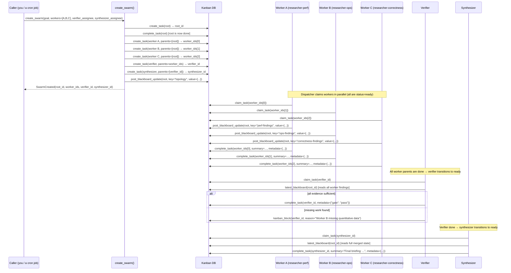
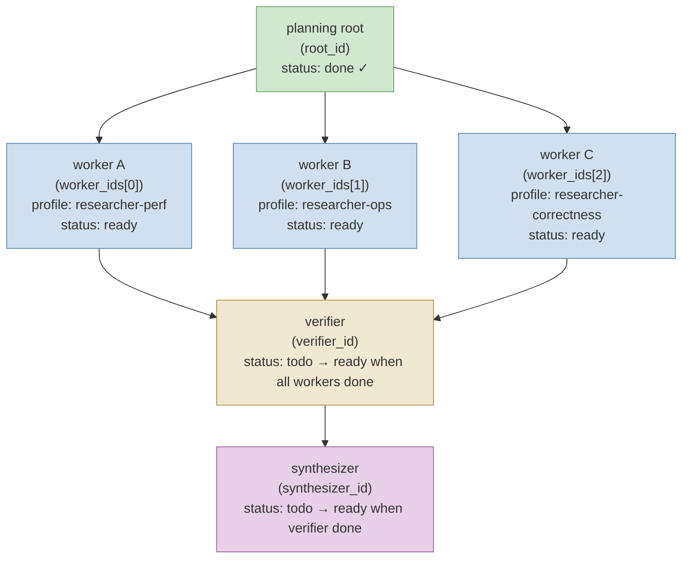

**TL;DR** — When a question has several independent angles that benefit from being researched in parallel, Hermes can coordinate a structured swarm: a call to `create_swarm()` builds a task graph with a planning root, parallel specialist workers (each optionally running as a different profile), a verifier that gates the results, and a synthesizer that merges them. This chapter walks the full lifecycle — from calling `create_swarm()` to reading the final deliverable — and explains how the swarm blackboard keeps all members in sync without a separate service.

# Scenario 3 — Multi-Profile Swarm Coordination

## The problem a swarm solves

Imagine we want Hermes to produce a well-rounded briefing on a topic — say, the tradeoffs of using vector databases for long-term agent memory. The analysis has at least three independent angles:

- **Performance and scalability**: query latency, indexing overhead, shard management.
- **Operational complexity**: deployment footprint, backup, versioning.
- **Correctness and recall**: accuracy of approximate nearest-neighbour search, handling of concept drift.

We could ask a single agent to research all three. But there is a problem: that agent works sequentially, its context fills as it goes, and each angle can crowd out the others. What we really want is three parallel investigators, each going deep on one angle, followed by someone who checks their work and a final pass that merges everything into a coherent deliverable.

That is what `create_swarm()` provides: a thin layer on top of the kanban task graph that arranges a fixed topology — planning root → parallel workers → verifier → synthesizer — and keeps a shared blackboard for coordination, all in the existing kanban infrastructure without a second scheduler or service.

## What a swarm looks like

Before we trace the code, let's name the four roles so every term is clear when we meet it:

| Role | Task status after creation | Purpose |
|------|---------------------------|---------|
| **Planning root** | `done` immediately | Anchor card; carries the swarm blackboard; contains the overall goal. |
| **Parallel workers** | `ready` immediately | Each worker tackles one angle. Workers can run as different profiles (isolated agents with their own config, keys, and home directories). |
| **Verifier** | `todo` (waiting for all workers) | Reviews every worker handoff; passes the gate (`{"gate": "pass"}` in its completion metadata) or blocks with a list of missing work. |
| **Synthesizer** | `todo` (waiting for the verifier) | Merges the verified outputs into the final deliverable; runs only after the verifier passes. |

The dependency chain is:

```
planning root (done)
    ├── worker A (ready)  ─┐
    ├── worker B (ready)   ├─ all complete → verifier (todo → ready)
    └── worker C (ready)  ─┘                     │
                                                  ▼
                                           synthesizer (todo → ready)
```

The swarm produces a `SwarmCreated` value that carries the `root_id`, `worker_ids`, `verifier_id`, and `synthesizer_id` — four IDs you need to monitor or interact with the swarm later.

## The data structures

### `SwarmWorkerSpec` — describing one parallel worker

Each worker slot is described by a `SwarmWorkerSpec` (a frozen dataclass in `hermes_cli/kanban_swarm.py`):

```python
# Simplified view of SwarmWorkerSpec (from hermes_cli/kanban_swarm.py)
@dataclass(frozen=True)
class SwarmWorkerSpec:
    profile: str                        # which profile this worker runs as
    title: str                          # the kanban card title (what the worker is asked to do)
    body: str                           # fuller task description
    skills: list[str]                   # skill names to load; defaults to empty list
    priority: int                       # dispatcher priority; 0 = normal
    max_runtime_seconds: Optional[int]  # optional per-worker cap; None = unlimited
```

The `profile` field is the key to multi-profile swarms: each worker can run as a named profile — an isolated agent home directory under `~/.hermes/profiles/<name>/` with its own `config.yaml`, credentials, skills, and session history. We recap profiles in more detail in [the profiles section below](#profiles-as-isolation-units), and the full reference is at [../persistence/home-directory-and-profiles.md](../persistence/home-directory-and-profiles.md).

### `SwarmCreated` — the result of `create_swarm()`

```python
# Simplified view of SwarmCreated (from hermes_cli/kanban_swarm.py)
@dataclass(frozen=True)
class SwarmCreated:
    root_id: str           # the planning root task id
    worker_ids: list[str]  # one id per SwarmWorkerSpec, in order
    verifier_id: str       # the verifier task id
    synthesizer_id: str    # the synthesizer task id
```

All four IDs point to tasks in the kanban database. You can query any of them with standard kanban tools.

## Profiles as isolation units

A **profile** in Hermes is a named agent home: the file tree at `~/.hermes/profiles/<name>/` is a complete, isolated copy of the normal `~/.hermes/` layout — its own `config.yaml`, `.env`, `skills/`, `sessions/`, and `kanban/`. When a kanban worker claims a task that is assigned to profile `"researcher-perf"`, the agent process loads that profile's config and credentials, not the default home.

This matters for swarms because you may want:

- Each worker to use a different LLM provider or model (e.g. one on Anthropic Claude, another on Gemini).
- Each worker to carry skills specialized for its angle (performance benchmarks, operations runbooks, literature summaries).
- Worker sessions to be isolated so one worker's context window cannot interfere with another's.

For depth on profile setup, see [../persistence/home-directory-and-profiles.md](../persistence/home-directory-and-profiles.md). For the security isolation posture that profiles express — why OS-level process boundaries, not in-process mechanisms, provide the actual containment — see [../security/os-boundary-and-isolation-postures.md](../security/os-boundary-and-isolation-postures.md).

## The swarm topology in Hermes: how it is built

Let's trace `create_swarm()` from `hermes_cli/kanban_swarm.py` step by step.

### Step 1 — Create the planning root and mark it done immediately

`create_swarm()` begins by calling `kb.create_task()` to create the root card, then immediately calls `kb.complete_task()` with a short summary and metadata that identifies the task as a `kanban_swarm_v1` card:

```python
# From hermes_cli/kanban_swarm.py — create_swarm(), condensed
root = kb.create_task(
    conn,
    title=root_title or f"Swarm: {goal.splitlines()[0][:80]}",
    body="Kanban Swarm v1 planning/root card. ...\n\nGoal:\n" + goal,
    assignee=created_by,
    skills=["kanban-orchestrator"],
    ...
)

kb.complete_task(
    conn,
    root,
    summary="Swarm topology planned; root remains the shared blackboard.",
    metadata={
        "kind": "kanban_swarm_v1",
        "goal": goal,
        "worker_count": len(worker_specs),
    },
)
```

Notice that the root is marked `done` before the workers are created. This is intentional: in the kanban topology, a child task only becomes `ready` once all its parents are `done`. Because we want the workers to be immediately dispatchable — not waiting for some planning work — the root is completed right away. It is an anchor card, not a work card.

### Step 2 — Create the parallel worker tasks (status: `ready`)

For each `SwarmWorkerSpec`, `create_swarm()` creates a task whose `parents` list contains only the root:

```python
# From hermes_cli/kanban_swarm.py — worker creation loop, condensed
context_suffix = _swarm_context(root, goal)

for spec in worker_specs:
    worker_id = kb.create_task(
        conn,
        title=spec.title,
        body=(spec.body or "") + context_suffix,
        assignee=spec.profile,          # <-- the profile name
        parents=[root],                 # root is already done → this worker is ready
        skills=spec.skills or None,
        max_runtime_seconds=spec.max_runtime_seconds,
        ...
    )
    worker_ids.append(worker_id)
```

The `context_suffix` appended to every worker body comes from the `_swarm_context()` helper. It injects the swarm protocol instructions — the root ID, the blackboard instructions, and the goal — into each worker's task card:

```python
# From hermes_cli/kanban_swarm.py — _swarm_context()
def _swarm_context(root_id: str, goal: str) -> str:
    return (
        "\n\n## Swarm protocol\n"
        f"- Swarm root / shared blackboard: `{root_id}`.\n"
        "- Read sibling/parent handoffs from Kanban context before working.\n"
        "- Put machine-readable facts in completion metadata.\n"
        "- Put cross-worker notes on the root task using structured comments.\n"
        f"- Goal: {goal.strip()}\n"
    )
```

Every worker therefore knows the root ID and the swarm goal from the moment it is claimed.

### Step 3 — Create the verifier (status: `todo`, waiting for all workers)

The verifier task lists all `worker_ids` as its parents:

```python
# From hermes_cli/kanban_swarm.py — verifier creation, condensed
verifier_body = (
    "Review every worker handoff and blackboard update. Gate the swarm: "
    'complete only with metadata {"gate": "pass"} when evidence is '
    "sufficient; otherwise block with exact missing work."
    + context_suffix
)
verifier = kb.create_task(
    conn,
    title=verifier_title,   # default: "Verify swarm outputs"
    body=verifier_body,
    assignee=verifier_assignee,
    parents=worker_ids,     # <-- waits for EVERY worker
    skills=["requesting-code-review"],
    ...
)
```

The verifier stays `todo` until every worker is `done`. Its task body tells it exactly what it must do: review the blackboard and worker handoffs, and either pass (`{"gate": "pass"}`) or block with a description of what is missing.

### Step 4 — Create the synthesizer (status: `todo`, waiting for the verifier)

The synthesizer is the same pattern, but its only parent is the verifier:

```python
# From hermes_cli/kanban_swarm.py — synthesizer creation, condensed
synthesizer_body = (
    "Synthesize the verified worker outputs into the final deliverable. "
    "Do not start until the verifier has passed the gate."
    + context_suffix
)
synthesizer = kb.create_task(
    conn,
    title=synthesizer_title,   # default: "Synthesize swarm outputs"
    body=synthesizer_body,
    assignee=synthesizer_assignee,
    parents=[verifier],        # <-- waits only for the verifier
    skills=["humanizer"],
    ...
)
```

### Step 5 — Write the initial blackboard entry

After all tasks are created, `create_swarm()` calls `post_blackboard_update()` to record the full topology on the root card:

```python
# From hermes_cli/kanban_swarm.py — post-creation blackboard write
post_blackboard_update(
    conn,
    root,
    author=created_by,
    key="topology",
    value=created.as_dict() | {"goal": goal},
)
```

The blackboard entry is stored as a comment on the root task whose body starts with `"[swarm:blackboard] "` followed by a JSON payload:

```json
[swarm:blackboard] {"key": "topology", "value": {"root_id": "...", "worker_ids": ["...", "...", "..."], "verifier_id": "...", "synthesizer_id": "...", "goal": "..."}}
```

This is the swarm's shared truth. Workers, the verifier, and the synthesizer all read from this comment to find out who their siblings are and what the overall goal is.

### Idempotency

If `create_swarm()` is called again with the same `idempotency_key` and finds an existing root whose blackboard already contains a `topology` entry, it recovers the existing IDs and returns them — it does not create a duplicate graph. This means swarm creation is safe to retry.

## The swarm blackboard in detail

The blackboard is the coordination mechanism that makes a swarm more than a collection of independent tasks. Let's understand how it works.

### Writing to the blackboard

Any worker (or the verifier or synthesizer) can post an update by calling `post_blackboard_update()`:

```python
# From hermes_cli/kanban_swarm.py
def post_blackboard_update(
    conn: sqlite3.Connection,
    root_id: str,
    *,
    author: str,
    key: str,
    value: Any,           # must be JSON-serialisable
) -> int:
    payload = json.dumps({"key": key, "value": value}, ...)
    return kb.add_comment(conn, root_id, author=author, body=BLACKBOARD_PREFIX + payload)
```

This appends a comment to the root task. The comment starts with the `BLACKBOARD_PREFIX` string (`"[swarm:blackboard] "`) so that readers can filter it from ordinary comments. A worker posting its findings might write:

```python
post_blackboard_update(
    conn,
    root_id=root_id,
    author="researcher-perf",
    key="perf-findings",
    value={
        "latency_p99_ms": 42,
        "notes": "ANN search degrades above 10M vectors without quantization."
    },
)
```

### Reading the blackboard

`latest_blackboard()` merges all blackboard comments on the root, with later writes for the same key overwriting earlier ones:

```python
# From hermes_cli/kanban_swarm.py — latest_blackboard(), condensed
def latest_blackboard(conn, root_id) -> dict[str, Any]:
    merged: dict[str, Any] = {}
    authors: dict[str, str] = {}
    for comment in kb.list_comments(conn, root_id):
        if not comment.body.startswith(BLACKBOARD_PREFIX):
            continue
        payload = json.loads(comment.body[len(BLACKBOARD_PREFIX):])
        key = payload.get("key")
        merged[key] = payload.get("value")
        authors[key] = comment.author
    if authors:
        merged["_authors"] = authors
    return merged
```

A call to `latest_blackboard(conn, root_id)` at any point returns the current view of the shared state:

```python
{
    "topology": {
        "root_id": "task-001",
        "worker_ids": ["task-002", "task-003", "task-004"],
        "verifier_id": "task-005",
        "synthesizer_id": "task-006",
        "goal": "..."
    },
    "perf-findings": {"latency_p99_ms": 42, ...},
    "ops-findings": {"deployment_complexity": "high", ...},
    "_authors": {
        "topology": "swarm-orchestrator",
        "perf-findings": "researcher-perf",
        "ops-findings": "researcher-ops"
    }
}
```

The `_authors` map gives the verifier full traceability — it can see which profile posted each finding.

## Sequence diagram — full swarm lifecycle



## Topology flowchart — the returned IDs labeled



Notice that `root_id` appears in every task body (via `_swarm_context()`), so any swarm member can look up the blackboard at any time without knowing the IDs of its siblings.

## Worked example — a three-angle research briefing

Let's build a concrete swarm that researches vector-database tradeoffs from three angles. We'll call `create_swarm()` directly — in practice this call could come from a cron job, a gateway message handler, or a parent `AIAgent` using `delegate_task`.

### Setting up the worker specs

```python
from hermes_cli.kanban_swarm import SwarmWorkerSpec, create_swarm
import hermes_cli.kanban_db as kb

# Open the kanban database for the "research" board
conn = kb.open_db("~/.hermes/kanban/boards/research/kanban.db")

workers = [
    SwarmWorkerSpec(
        profile="researcher-perf",
        title="Benchmark vector-DB query latency and indexing overhead",
        body=(
            "Investigate query latency (p50/p99) and indexing overhead "
            "for HNSW-based stores at 1M, 10M, and 100M vector scales. "
            "Record quantitative findings in completion metadata."
        ),
        skills=["benchmark-analysis"],
        priority=1,
        max_runtime_seconds=1800,   # 30-minute cap for this worker
    ),
    SwarmWorkerSpec(
        profile="researcher-ops",
        title="Assess operational complexity of vector-DB deployment",
        body=(
            "Cover: deployment footprint (bare-metal vs. managed), backup "
            "strategy, schema/index versioning, and recovery procedures. "
            "Record findings in completion metadata."
        ),
        skills=["infrastructure-review"],
        priority=1,
    ),
    SwarmWorkerSpec(
        profile="researcher-correctness",
        title="Evaluate recall accuracy and concept-drift handling",
        body=(
            "Assess ANN recall vs. exact-search tradeoffs, embedding model "
            "versioning, and strategies for concept drift (re-indexing, "
            "hybrid BM25+vector). Record key figures in completion metadata."
        ),
        skills=["ml-evaluation"],
        priority=1,
    ),
]
```

### Calling `create_swarm()`

```python
swarm = create_swarm(
    conn,
    goal=(
        "Produce a comprehensive briefing on vector-database tradeoffs "
        "for long-term agent memory, covering performance, operational "
        "complexity, and recall accuracy."
    ),
    workers=workers,
    verifier_assignee="reviewer-profile",
    synthesizer_assignee="writer-profile",
    root_title="Vector-DB tradeoff briefing swarm",
    verifier_title="Gate: verify all three research angles are complete",
    synthesizer_title="Synthesize: final vector-DB briefing",
    created_by="swarm-orchestrator",
    idempotency_key="vector-db-briefing-v1",
)

print(swarm.root_id)           # e.g. "task-001"
print(swarm.worker_ids)        # ["task-002", "task-003", "task-004"]
print(swarm.verifier_id)       # "task-005"
print(swarm.synthesizer_id)    # "task-006"
```

After this call, the kanban board looks like:

| Task | Status | Assignee | Parents |
|------|--------|----------|---------|
| `task-001` Vector-DB briefing swarm | `done` | swarm-orchestrator | — |
| `task-002` Benchmark query latency | `ready` | researcher-perf | task-001 |
| `task-003` Operational complexity | `ready` | researcher-ops | task-001 |
| `task-004` Recall accuracy | `ready` | researcher-correctness | task-001 |
| `task-005` Gate: verify angles | `todo` | reviewer-profile | task-002, task-003, task-004 |
| `task-006` Synthesize: final briefing | `todo` | writer-profile | task-005 |

The three worker tasks are immediately claimable by the kanban dispatcher because their only parent (the root) is already `done`.

### Workers running in parallel

Each worker profile has its own isolated home directory. The `researcher-perf` profile might be configured to use a model strong at quantitative reasoning, while `researcher-correctness` uses one with stronger ML knowledge. Neither profile's session history or skills bleed into the others.

When a worker is done with its angle, it calls `kanban_complete` (via the `kanban_complete` tool) and records structured findings in its `metadata`. It can also write to the blackboard so that the verifier and synthesizer can read the findings directly:

```python
# Pseudocode: what researcher-perf does when it finishes
post_blackboard_update(
    conn,
    root_id=root_id,      # retrieved from the task body / swarm protocol section
    author="researcher-perf",
    key="perf-findings",
    value={
        "latency_p99_1M": "4ms",
        "latency_p99_100M": "38ms",
        "indexing_overhead_pct": 40,
        "recommendation": "HNSW fine above 10M; consider quantization beyond that."
    },
)
# Then mark the task done
kb.complete_task(
    conn,
    worker_ids[0],
    summary="Benchmarked HNSW latency at three scales; see metadata for figures.",
    metadata={"perf_p99_1M_ms": 4, "perf_p99_100M_ms": 38},
)
```

### Verifier reads the blackboard and gates the swarm

Once all three workers are `done`, the kanban `recompute_ready()` mechanism promotes the verifier to `ready` and the dispatcher claims it. The verifier's task body already contains the swarm protocol (injected by `_swarm_context()`), so it knows the `root_id` and can call `latest_blackboard()` to read every worker's findings in one shot.

If all three angles are present and the evidence is sufficient, the verifier completes with `{"gate": "pass"}` in its metadata:

```python
# Pseudocode: what the verifier does
board = latest_blackboard(conn, root_id)
# board now contains "perf-findings", "ops-findings", "correctness-findings"

# ... review logic ...

kb.complete_task(
    conn,
    verifier_id,
    summary="All three angles covered with quantitative evidence. Gate: pass.",
    metadata={"gate": "pass"},
)
```

If something is missing, the verifier calls `kanban_block` instead:

```python
kb.kanban_block(conn, verifier_id, reason="Correctness worker missing re-indexing strategy.")
```

This puts the verifier back in `blocked` status. A human or an orchestrator must then address the gap before the swarm can proceed.

### Synthesizer merges and delivers

Once the verifier is `done` (and only then), the synthesizer becomes `ready`. It reads the full blackboard and the worker summaries, and produces the final deliverable:

```python
# Pseudocode: synthesizer
board = latest_blackboard(conn, root_id)
# Merge perf-findings, ops-findings, correctness-findings into prose

kb.complete_task(
    conn,
    synthesizer_id,
    summary="Final briefing: Vector databases are viable for agent memory at sub-10M scale...",
    metadata={"output_format": "markdown", "word_count": 1200},
)
```

The synthesizer's completion summary becomes the output of the entire swarm.

## Swarm topology vs. other delegation mechanisms

You might wonder how a swarm differs from the two other multi-agent mechanisms Hermes provides. Here is a quick comparison:

| Mechanism | Where work runs | Parallelism | State store | Best for |
|-----------|----------------|-------------|-------------|---------|
| `delegate_task` (in-process) | Child `AIAgent` instances in the same process, depth-capped | Sequential by default; limited concurrency | Parent agent's context | Short sub-tasks where you need inline results |
| Kanban dispatch | Worker profiles claiming tasks from a board | True parallelism; multiple workers run concurrently | Kanban DB | Long, independent tasks; cross-session workloads |
| `create_swarm()` | Worker profiles claiming tasks from a board (same as kanban dispatch) | True parallelism, fixed topology | Kanban DB + blackboard | Structured fan-out → merge; research, analysis, code generation with a defined plan→parallel→verify→synthesize shape |

For a full treatment of swarm topologies and delegation depth caps, see [../multi-agent/swarm-topologies.md](../multi-agent/swarm-topologies.md).

## Edge cases and failure modes

### A worker fails or times out before the verifier can run

If a worker crashes (its process dies) or its claim expires (the 15-minute `claim_expires` TTL passes without `complete_task`), the kanban dispatcher's next `dispatch_once()` tick will reclaim the task and re-assign it. Because the swarm blackboard is append-only (comments on the root task), any partial blackboard writes made before the crash are preserved. The next attempt by the same or a different worker can read those partial findings and avoid duplicating work.

The verifier cannot become `ready` until all workers are `done`. A permanently stuck worker (for example, one that blocks indefinitely) keeps the verifier — and therefore the synthesizer — in `todo`. The operator can manually advance or cancel the stuck task via `hermes kanban` CLI commands.

<!-- GAP: The exact tool call a worker uses to re-read its partial blackboard state on restart (whether it calls `build_worker_context()` from kanban_db.py or reads comments directly) is not confirmed in S22; source is silent on the reclaim-and-resume path in detail. -->

### The verifier blocks — the gate does not pass

The verifier's task body explicitly tells it to `kanban_block` with the description of what is missing rather than completing. When the verifier blocks:

1. The verifier's status is `blocked`.
2. The synthesizer remains `todo` (its parent — the verifier — is not `done`).
3. A notification fires to any subscriber on the verifier task (if `kanban_notify_subs` is configured).
4. A human or an orchestrating agent must resolve the gap: either a worker updates its findings and restarts, or the operator calls `kanban_unblock` and the verifier retries.

<!-- GAP: The exact status the verifier sets when it "blocks" (whether it uses `kanban_block` tool or a different mechanism, and whether that status is `blocked` or `review`) is not confirmed by S22 directly — the task body instructs the agent to "block with exact missing work" but does not specify the exact tool call. This was also flagged in P18. -->

### Workers running truly in parallel — blackboard contention

Because blackboard writes are append-only comments on the root task (SQLite row inserts via `kb.add_comment()`), there is no merge conflict: each worker appends its own keyed update without needing a lock. `latest_blackboard()` resolves any key conflicts by taking the latest comment for each key. Two workers writing to the same key in parallel is handled by SQLite's WAL-mode serialisation at the row level — the last write wins, and the `_authors` field records which profile it came from.

This design is the reason the module docstring calls the blackboard "deliberately low-tech": it keeps all coordination state inside existing `task_comments`/`task_events` rows so the dashboard, notifier, slash command, and dispatcher all work without a new service.

### Idempotent re-creation

If `create_swarm()` is called again with the same `idempotency_key` before the swarm finishes, it reads the `topology` blackboard entry from the root and returns the existing IDs — it does not build a second graph. This means a cron job or orchestrator that calls `create_swarm()` on every tick is safe: it gets the same `SwarmCreated` back every time until the root is archived.

---

← Previous: [Scenario 2 — Kanban Board Workflow End to End](./kanban-board-workflow.md) · Next: [Scenario 4 — Cron Job with Stale-Run Fast-Forward and Platform Delivery](./cron-and-webhook-delivery.md) →
