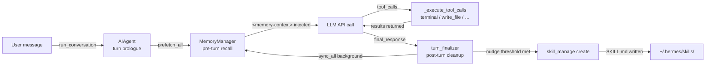
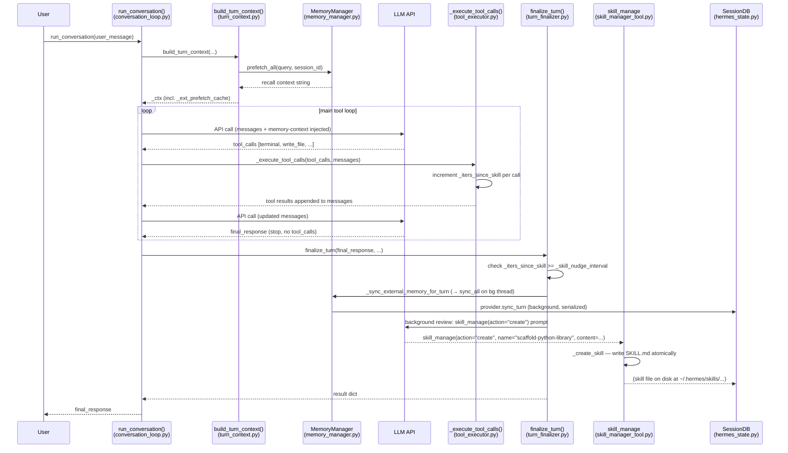
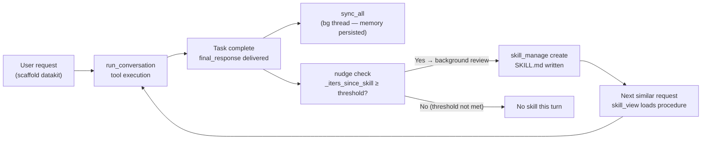

**TL;DR** — This chapter follows a single user request from the moment it arrives at `run_conversation()` through pre-turn memory recall, tool dispatch, post-turn memory sync, and the nudge-to-persist that makes Hermes save what it learned as a reusable skill. By the end you will be able to trace every component interaction across one complete turn and understand when and why skill creation fires.

# Scenario 1 — From Conversation to Skill Creation

This is the first of five scenario chapters. Each one takes real Hermes primitives working separately in their own chapters and shows them **composing** — the value here is the composition, not re-teaching each part. We'll recap every mechanism in a sentence or two and point you to the full chapter for depth.

The scenario we'll trace: we ask Hermes to scaffold a small Python project from a template, it works through the task using several tools, and — because this kind of task has enough complexity that it would be worth repeating — it saves a reusable skill at the end. This is **Hermes's defining capability expressed in one turn**: the learning loop closes.

---

## Business Objective

A user wants Hermes to scaffold a new Python package from scratch: create the directory tree, write `pyproject.toml`, add a placeholder module, and stub a test file. This is a five-to-six-tool task that involves non-trivial decisions (naming conventions, dependency configuration). If it succeeds, the procedure is worth saving so future requests like "set up a new Python library" never require re-discovery.

---

## System-Level Overview: The Learning Loop

Before we step into the turn-by-turn trace, here is what the whole scenario looks like from above — the components that will speak and the state that changes.



The agent lives in `run_conversation()` for the duration of the user's turn. Memory moves in before the first LLM call (pre-turn recall) and out after the last one (post-turn sync). The skill creation step is the **last** thing to happen — after the user already has their answer.

---

## Step 1 — The User Message Arrives, and a Turn Begins

The user types their request:

```
Scaffold a new Python library called "datakit". Set up pyproject.toml, src/datakit/__init__.py, and tests/test_datakit.py.
```

This reaches `run_conversation()` in `agent/conversation_loop.py`. Think of `run_conversation()` as the **outer container for one complete turn** — it sets up everything the loop needs, runs the model-tool cycle until the agent returns a final response, then hands off to post-turn cleanup.

> **Prerequisite recap — the conversation loop (P4):** `AIAgent` holds the live conversation state (message history, budget, tool list). `run_conversation()` is the function you call to process one user message; it runs a `while` loop that alternates between LLM API calls and tool execution until the model produces a response with no more tool calls. See [the full loop chapter](../core-runtime/aiagent-and-conversation-loop.md) for the budget, interrupt, and retry mechanics.

The first thing `run_conversation()` does is call `build_turn_context()` — the **turn prologue** (`agent/turn_context.py`). This is where the per-turn setup lives: sanitizing the user message, building or restoring the system prompt, running the `pre_llm_call` plugin hook, and — critically for this scenario — **kicking off the external-memory prefetch**.

The prologue returns a context object (`_ctx`) that seeds the loop's local variables: the message list, the active system prompt, the turn ID, a flag `_should_review_memory`, and `_ext_prefetch_cache` — the pre-fetched memory text that will be injected into the user message on the first API call.

---

## Step 2 — Pre-Turn Recall: MemoryManager Injects Context

The turn prologue asks `MemoryManager.prefetch_all()` for any relevant context before the first LLM call.

> **Prerequisite recap — MemoryManager (P9):** `MemoryManager` in `agent/memory_manager.py` orchestrates one built-in memory provider plus at most one external provider (e.g., Honcho, Mem0, Hindsight). Its job is to make memory available to the LLM without you having to wire each provider yourself. See [the MemoryManager chapter](../memory/memory-manager-and-external-providers.md) for the prefetch/sync lifecycle, provider registration, and the nudge-to-persist behavior.

`prefetch_all()` calls every registered provider's `prefetch()` method and merges the results into a single string. For our scenario, the built-in provider might surface: the user's preferred project layout from a prior session; a note that they use `hatch` rather than `poetry`. The result is stored in `_ext_prefetch_cache`.

When the first LLM API call is built, the loop injects this cached text into the user message — not into the system prompt. The injection wraps it in `<memory-context>` tags with a header telling the model it is "authoritative reference data, not new user input":

```python
# Simplified view of the injection block in conversation_loop.py
if idx == current_turn_user_idx and msg.get("role") == "user":
    _injections = []
    if _ext_prefetch_cache:
        _fenced = build_memory_context_block(_ext_prefetch_cache)
        if _fenced:
            _injections.append(_fenced)
    if _injections:
        api_msg["content"] = base_content + "\n\n" + "\n\n".join(_injections)
```

The original `messages` list is never mutated — the injection lives only in `api_messages`, the per-call copy sent to the provider. This is by design: the stable message history is what the session persists; the injected context is ephemeral and API-call-scoped.

The model now sees both the user's project-scaffolding request and whatever memory the agent recalled about this user's preferences. It is ready to plan.

---

## Step 3 — Tool Dispatch: The Agent Does the Work

The LLM responds with a batch of tool calls. For our scenario these might look like:

```json
[
  { "name": "terminal", "arguments": { "command": "mkdir -p datakit/src/datakit datakit/tests" } },
  { "name": "write_file", "arguments": { "path": "datakit/pyproject.toml", "content": "..." } },
  { "name": "write_file", "arguments": { "path": "datakit/src/datakit/__init__.py", "content": "..." } },
  { "name": "write_file", "arguments": { "path": "datakit/tests/test_datakit.py", "content": "..." } }
]
```

The loop calls `agent._execute_tool_calls()` (defined in `agent/tool_executor.py`). This runs the tool calls — potentially in parallel, up to `_MAX_TOOL_WORKERS` threads — collects the results, and appends them to `messages` as `role: "tool"` entries.

Inside `_execute_tool_calls`, each successful call resets the relevant nudge counter. When the function name is `skill_manage`, `agent._iters_since_skill` is set to 0. For any other tool, the counter increments by 1 at the top of each main-loop iteration:

```python
# conversation_loop.py — inside the while loop, per-iteration
if (agent._skill_nudge_interval > 0
        and "skill_manage" in agent.valid_tool_names):
    agent._iters_since_skill += 1
```

So as `terminal` and `write_file` calls succeed, `_iters_since_skill` climbs. That counter is what the nudge-to-persist system watches.

After each batch of tool results, the loop makes another LLM API call. The model might request another tool or two — or it might conclude the task is done and return a final text response with no tool calls. In our scenario, four tools suffice and the model returns:

> "I've scaffolded the `datakit` library. Here's what was created: …"

The loop detects `finish_reason == "stop"` and no tool calls, sets `final_response`, and breaks.

---

## Scenario Sequence Diagram

Here is the complete interaction across all components for one turn:



Notice the ordering: the user receives their answer before skill creation runs. Skill creation happens in the **background review** thread that `finalize_turn()` spawns after delivering the response.

---

## Step 4 — Post-Turn Sync: Memory Persists on a Background Thread

After `final_response` is captured and before `finalize_turn()` returns to the caller, `MemoryManager.sync_all()` is called to persist what happened this turn to every registered memory provider.

`sync_all()` does **not** run inline on the turn-completion path. The docstring for `sync_all` in `agent/memory_manager.py` explains why: a misconfigured external provider's `sync_turn` was observed blocking for ~298 seconds before failing — doing that inline held `run_conversation()` open long after the user saw their response, keeping every interface (CLI, gateway) marked "running" and causing follow-up messages to trigger aggressive interrupts. The solution: dispatch the sync work to a single background worker thread.

The background executor is created lazily on first use (`ThreadPoolExecutor(max_workers=1)`). Single-worker serialization guarantees that turn N's sync lands before turn N+1's sync — providers don't need their own ordering guarantees.

```python
# Simplified view of sync_all in memory_manager.py
def sync_all(self, user_content, assistant_content, *, session_id="", messages=None):
    providers = list(self._providers)
    if not providers:
        return

    def _run():
        for provider in providers:
            try:
                provider.sync_turn(user_content, assistant_content, session_id=session_id)
            except Exception as e:
                logger.warning("Memory provider '%s' sync_turn failed: %s", provider.name, e)

    self._submit_background(_run)  # non-blocking; _run executes on the bg thread
```

From the user's perspective the turn is done the moment `final_response` is returned. The memory write happens behind the scenes.

---

## Step 5 — The Nudge-to-Persist: Skill Creation Closes the Loop

`finalize_turn()` in `agent/turn_finalizer.py` is where the nudge-to-persist check lives. The logic is:

```python
# turn_finalizer.py
_should_review_skills = False
if (agent._skill_nudge_interval > 0
        and agent._iters_since_skill >= agent._skill_nudge_interval
        and "skill_manage" in agent.valid_tool_names):
    _should_review_skills = True
    agent._iters_since_skill = 0
```

Two configuration values control this:

| Setting | Source | Default |
|---|---|---|
| `skills.creation_nudge_interval` | `config.yaml` → `agent_init.py` | `10` |
| `_iters_since_skill` | runtime counter, per `AIAgent` | starts at `0` |

`_skill_nudge_interval` defaults to `10`, configurable via `skills.creation_nudge_interval` in `config.yaml`. Every main-loop iteration that does **not** call `skill_manage` increments `_iters_since_skill`. Calling `skill_manage` resets it to `0`. So: after 10 or more tool-calling iterations without a skill operation, the nudge fires.

In our scenario, we ran four tool calls. That puts `_iters_since_skill` at four — below the default threshold of ten. The nudge will **not** fire automatically from a four-tool task. For the nudge to fire automatically, the agent would need to have been tool-calling across ten or more iterations without touching `skill_manage` in that period. (We will come back to this in the edge-cases section.)

When `_should_review_skills` is `True`, `finalize_turn()` calls `agent._spawn_background_review()` with `review_skills=True`. This spawns a forked `AIAgent` (the **background review**) that uses `skill_manage` to create a skill from the completed turn's conversation snapshot. The background review agent calls:

```python
# What the background review agent sends to skill_manage:
skill_manage(
    action="create",
    name="scaffold-python-library",
    category="python",
    content="""---
name: scaffold-python-library
description: Scaffold a new Python library with pyproject.toml and src layout.
version: 1.0.0
---

# Scaffold Python Library

## When to use
User asks to create a new Python package, library, or module from scratch.

## Steps
1. Create directory tree: `mkdir -p <name>/src/<name> <name>/tests`
2. Write `pyproject.toml` with `[project]` table, name, version, dependencies.
3. Write `src/<name>/__init__.py` with module docstring.
4. Write `tests/test_<name>.py` with a placeholder test.

## Pitfalls
- Use `hatch` build backend unless user specifies otherwise.
- Confirm the Python version requirement before setting `requires-python`.
""",
)
```

> **Prerequisite recap — skill_manage (P24):** `skill_manage` in `tools/skill_manager_tool.py` writes a skill to `~/.hermes/skills/<name>/SKILL.md`. The `create` action validates the name and content, creates the directory, writes the file atomically, and optionally runs a security scan. See [the skills chapter](../skills/skill-structure-and-tools.md) for the full schema and the Curator that manages skill health over time.

Inside `_create_skill()`:

1. The name is validated (lowercase, hyphens/underscores, ≤64 chars).
2. The content is validated for YAML frontmatter.
3. The skill directory `~/.hermes/skills/python/scaffold-python-library/` is created.
4. `SKILL.md` is written atomically via a temp-file-then-rename pattern (`atomic_replace`).
5. If `skills.guard_agent_created` is enabled (default: `False`), a security scan runs and can roll back the write.

On success, `skill_manage` returns:

```json
{
  "success": true,
  "message": "Skill 'scaffold-python-library' created.",
  "path": "python/scaffold-python-library",
  "skill_md": "/home/user/.hermes/skills/python/scaffold-python-library/SKILL.md"
}
```

The system prompt cache is cleared so the new skill appears in the agent's available-skills list on the next turn.

This is the **learning loop closing**: the agent did a task, Hermes remembered the procedure, and future requests for "scaffold a Python library" will find that skill in `skills_list()` and load it with `skill_view()` rather than re-deriving the steps from scratch.

---

## The Learning Loop — One Hop Visualized



The loop from conversation → skill → next conversation is what distinguishes Hermes from a stateless API wrapper. It does not require the user to explicitly say "remember this" — it fires automatically when the threshold is met.

---

## State Changes This Turn Produced

| Component | Before turn | After turn |
|---|---|---|
| `messages` (SessionDB) | N messages | N+7 messages (user + 4 tool calls + 4 results + assistant) |
| Memory providers | Prior session facts | New turn synced (via `sync_all` on bg thread) |
| `~/.hermes/skills/` | No scaffold skill | `python/scaffold-python-library/SKILL.md` created |
| `_iters_since_skill` | 0 (or prior value) | Reset to 0 after skill was created |
| System prompt cache | Cached (no scaffold skill) | Cleared; rebuilt on next turn with new skill listed |

---

## Component Interactions at a Glance

| Phase | Caller | Callee | What is exchanged |
|---|---|---|---|
| Pre-turn prologue | `run_conversation` | `build_turn_context` | Agent state; returns `_ctx` |
| Pre-turn recall | `build_turn_context` | `MemoryManager.prefetch_all` | Query string; returns recall text |
| Context injection | `run_conversation` (loop) | LLM API | `api_messages` with `<memory-context>` appended to user turn |
| Tool dispatch | `run_conversation` | `_execute_tool_calls` | Tool call list; returns results appended to `messages` |
| Post-turn sync | `finalize_turn` | `MemoryManager.sync_all` | User + assistant content; runs on bg thread |
| Nudge check | `finalize_turn` | `agent._spawn_background_review` | Conversation snapshot + `review_skills=True` |
| Skill write | background review agent | `skill_manage(action="create")` | `name`, `content`, `category`; writes SKILL.md |

---

## Edge Cases

### The Agent Finishes Without Creating a Skill

The nudge-to-persist fires only when `_iters_since_skill >= _skill_nudge_interval`. For a short task (fewer than the threshold's worth of tool-calling iterations since the last skill operation), the threshold is not met and `_should_review_skills` stays `False`. No background review is spawned; no skill is created. This is the normal path for simple one-off requests. The user can always ask Hermes explicitly — "remember this as a skill" — and the agent will call `skill_manage` directly during the turn.

Also note: `_iters_since_skill` is not reset between turns; it accumulates across the whole session. A series of short tasks can collectively trip the threshold even if no single task was long enough on its own.

### A Tool Fails Mid-Scenario

If `write_file` or `terminal` returns an error, the tool result for that call carries the error text. The main loop continues — the result is appended to `messages` and the next LLM API call receives it. The model sees the error and can decide: retry with a corrected call, ask a clarifying question, or abandon the step and explain why.

The tool guardrail system (`agent/tool_guardrails.py`) runs before each tool call. If a call triggers a guardrail halt (e.g., an attempt to write to a denied path), `agent._tool_guardrail_halt_decision` is set and the loop exits with a controlled halt response. From `conversation_loop.py`:

```python
if agent._tool_guardrail_halt_decision is not None:
    decision = agent._tool_guardrail_halt_decision
    _turn_exit_reason = "guardrail_halt"
    final_response = agent._toolguard_controlled_halt_response(decision)
    agent._emit_status(f"⚠️ Tool guardrail halted {decision.tool_name}: {decision.code}")
    messages.append({"role": "assistant", "content": final_response})
    break
```

In a guardrail halt, `finalize_turn()` still runs (memory sync still fires), but the turn exits early. Whether the nudge-to-persist fires depends on whether `_iters_since_skill` had already crossed the threshold before the halt.

### What If skill_manage Itself Fails?

If the background review agent's `skill_manage` call fails — for example, a name collision because that skill already exists — the tool returns `{"success": false, "error": "…"}`. The background review agent can react: it might try a different name, patch the existing skill, or log and exit. Failures in background review are best-effort and never propagate back to the user's turn, which has already completed.

---

## What to Remember

This scenario illustrates that every turn of Hermes has the same structure:

1. **Prologue** — `build_turn_context()` sets up state and kicks off memory prefetch.
2. **Main loop** — alternates LLM API calls with `_execute_tool_calls()` until a final response.
3. **Finalization** — `finalize_turn()` syncs memory (background) and checks the skill nudge.
4. **Learning** — if the nudge fires, a background review agent calls `skill_manage` to persist a new skill.

The learning loop is not a one-time event — it runs as a background side-effect of every sufficiently complex turn. That is why Hermes's skill library grows with use.

---

← Previous: [Observability — Log Files, Observer Events, and Bundled Consumers](../observability/logs-hooks-and-plugins.md) · Next: [Scenario 2 — Kanban Board Workflow End to End](./kanban-board-workflow.md) →
