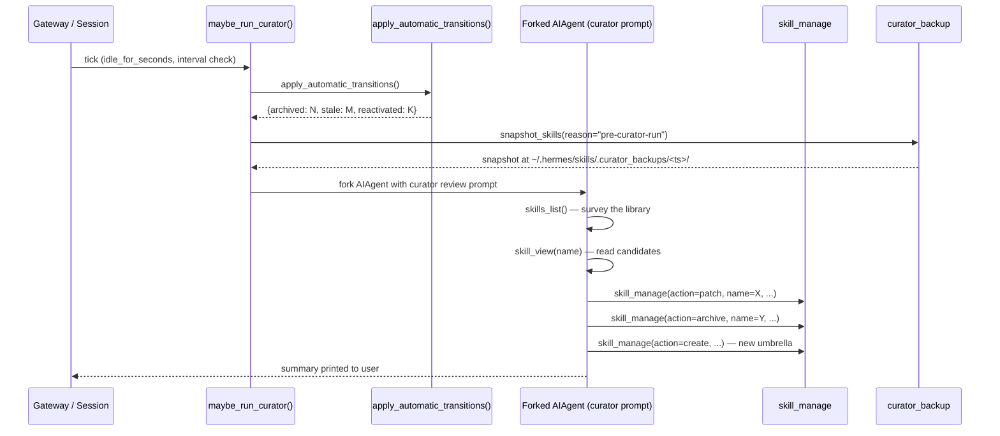

**TL;DR** — Skills the agent creates during conversations accumulate, drift out of date, and duplicate each other over time. The Curator is the piece of Hermes that keeps the library healthy: it wakes up after the user has been idle long enough, forks a background `AIAgent` to review agent-created skills, and runs four targeted actions — pin, archive, consolidate, or patch — without ever deleting anything. This chapter walks through how the Curator works, what the Skills Hub trust model looks like, and how the whole cycle — conversation → skill creation → Curator review → recalled in a future session — forms Hermes's closed learning loop.

# The Curator and the Full Learning Loop

## The problem: knowledge that rots

In [Skill Structure, the Three Skill Tools, and Skill Bundles](./skill-structure-and-tools.md) we saw how Hermes uses `skill_manage` to create and update skills during a conversation — capturing the workflow patterns, user preferences, and debugging approaches that emerged from a session. That is the creation side of the loop.

There is a second problem the creation side does not solve: what happens to those skills over time?

Left alone, a skill library accumulates narrow one-session entries ("fixed-npm-audit-2024-07-12"), duplicates ("python-type-hints" and "typing-annotations" that say almost the same thing), and skills that were accurate when written but are now stale because the environment or the user's preferences have changed. A growing pile of outdated, overlapping skills is worse than a smaller coherent library — the agent matches on descriptions, not on names, and near-duplicate entries produce confused search results.

The Curator exists to solve this. It is an **inactivity-triggered background skill-maintenance agent**: it waits until you have been idle long enough, then forks a separate `AIAgent` to review the library and take corrective action. It is worth naming the architectural niche clearly, because the Curator is its own distinct mechanism: it is not the cron scheduler (which runs timed jobs on a fixed clock), and it is not the autonomy system (which works on multi-step tasks on your behalf). It is a third kind of background agent — one that is triggered by your idleness, scoped purely to skill maintenance, and has no ability to touch your active session or its prompt cache.

## The Curator's trigger: idleness, not a clock

The Curator's scheduling logic lives in `agent/curator.py` in the function `maybe_run_curator()`. Three gates must all pass before a review run starts:

1. **`curator.enabled`** is `true` in `~/.hermes/config.yaml` (the default).
2. **Not paused** (you can pause with `hermes curator pause`).
3. **The interval has elapsed** — the time since the last run must be at least `interval_hours`. The default is `DEFAULT_INTERVAL_HOURS = 24 * 7` — **7 days**.

```python
# Simplified view of maybe_run_curator() from agent/curator.py

DEFAULT_INTERVAL_HOURS = 24 * 7   # 7 days
DEFAULT_MIN_IDLE_HOURS = 2        # 2-hour minimum idle period

def maybe_run_curator(*, idle_for_seconds=None, on_summary=None):
    if not should_run_now():   # checks enabled + not-paused + interval
        return None
    if idle_for_seconds is not None:
        min_idle_s = get_min_idle_hours() * 3600.0
        if idle_for_seconds < min_idle_s:
            return None
    return run_curator_review(on_summary=on_summary)
```

Notice the second gate: when the call site measures how long you have been idle and passes `idle_for_seconds`, the Curator will only proceed if that value is at least `get_min_idle_hours()` — which defaults to `DEFAULT_MIN_IDLE_HOURS = 2` (**2 hours**). The gateway's cron ticker calls `maybe_run_curator(idle_for_seconds=float("inf"))`, meaning it bypasses the idle check for long-running gateway sessions and lets the 7-day interval be the sole clock. The idle gate is meaningful when a short session just ended — the Curator will not launch a heavy review the moment you pause between two quick messages.

**Verified defaults from `agent/curator.py`:**

| Config key | Default | Source constant |
|---|---|---|
| `curator.interval_hours` | 168 h (7 days) | `DEFAULT_INTERVAL_HOURS = 24 * 7` |
| `curator.min_idle_hours` | 2 h | `DEFAULT_MIN_IDLE_HOURS = 2` |
| `curator.stale_after_days` | 30 days | `DEFAULT_STALE_AFTER_DAYS = 30` |
| `curator.archive_after_days` | 90 days | `DEFAULT_ARCHIVE_AFTER_DAYS = 90` |

All four are configurable under `curator:` in `~/.hermes/config.yaml`.

## What happens during a review: the forked AIAgent

When `maybe_run_curator()` decides a run should happen, it calls `run_curator_review()`, which does two things in sequence:

**First pass — automatic state transitions (no LLM).** `apply_automatic_transitions()` walks every curator-managed skill and updates its lifecycle state based on the activity timestamps from `tools/skill_usage.py`. This is purely mechanical: it compares `last_activity_at` (or `created_at` as a fallback) against the thresholds and moves skills between states.

```
active  →  stale     if idle for > 30 days (stale_after_days)
stale   →  archived  if idle for > 90 days (archive_after_days)
stale   →  active    if the skill was recently used again (reactivated)
```

Pinned skills bypass this entirely — `apply_automatic_transitions()` skips any skill with `pinned=True`.

**Second pass — the LLM review fork.** A new `AIAgent` is constructed, inheriting the parent's live runtime (provider, model, base URL, credentials) so it hits the same prefix cache. This fork runs with a constrained tool whitelist: only `skills_list`, `skill_view`, and `skill_manage` are available. Its `compression_enabled` is set to `False` so it cannot accidentally rotate the parent's session. Once the review completes, the agent shuts down cleanly and a compact summary is surfaced to the user.

Here is the review cycle as a sequence diagram:



Notice the backup step: before every real review pass the current skills tree is snapshotted as a compressed archive under `~/.hermes/skills/.curator_backups/`. A review gone wrong is always undoable with `hermes curator rollback`.

## The four Curator actions

The forked review agent's prompt instructs it to take exactly one of four actions for any skill that needs attention. These are the only mutations the Curator is permitted to make:

| Action | What it does |
|---|---|
| **pin** | Mark a skill so the Curator never auto-transitions it (bypasses state changes and LLM review). The user requests this via `hermes curator pin <skill>`. |
| **archive** | Move the skill to `~/.hermes/skills/.archive/` — still on disk, still recoverable with `hermes curator restore <skill>`, but excluded from the prompt and search. |
| **consolidate** | Merge two or more overlapping skills into a single class-level umbrella skill, absorbing their content into subsections of the new `SKILL.md`. |
| **patch** | Update an existing skill's `SKILL.md` or a support file (`references/`, `templates/`, `scripts/`) to correct an error, add a missing step, or embed a discovered preference. |

**The Curator never auto-deletes.** The most destructive action available is archiving, and archives are fully recoverable. This is a strict invariant, stated explicitly in `agent/curator.py`:

> *"Never auto-deletes — only archives. Archive is recoverable."*

## The pin wins: edge cases you should know

**The user pin overrides the Curator.** A skill marked with `hermes curator pin <name>` is invisible to both `apply_automatic_transitions()` and the LLM review fork. Pinning is tracked per-skill in the usage record, and both code paths check it before touching a skill. If a skill is approaching the archive threshold but you still use it regularly — or if the LLM review tends to want to consolidate something you want kept separate — pin it.

```bash
# Pin a skill so the Curator never auto-transitions it
hermes curator pin my-workflow-skill

# Check that it shows up under "pinned"
hermes curator status
# Output excerpt:
# pinned (1): my-workflow-skill
```

Note from `agent/background_review.py`: the nudge-to-persist behavior (described in a moment) explicitly states that pinned skills *can* still be improved — `skill_manage(action=patch)` is allowed on pinned skills. Pin only blocks deletion, archival, and consolidation; it does not freeze content.

**Only agent-created skills are curation candidates.** The CLI enforces this:

```bash
$ hermes curator pin my-bundled-skill
curator: 'my-bundled-skill' is bundled or hub-installed — cannot pin
(only agent-created skills participate in curation)
```

Bundled skills (shipped with Hermes) and hub-installed skills (installed via `hermes skills install`) are outside the Curator's scope entirely.

## The CLI: hermes curator

The `hermes curator` subcommand (`hermes_cli/curator.py`) is the user's control surface for the Curator. Here is a reference table:

| Command | What it does |
|---|---|
| `hermes curator status` | Print Curator state: enabled/paused, run count, last run, interval, skill counts by state. |
| `hermes curator run` | Trigger a review pass now (synchronous by default). |
| `hermes curator run --dry-run` | Preview what the Curator would do — reads but makes no mutations. |
| `hermes curator run --background` | Start the LLM pass in a background thread and return immediately. |
| `hermes curator pin <skill>` | Pin a skill to exempt it from auto-transitions. |
| `hermes curator unpin <skill>` | Remove the pin. |
| `hermes curator archive <skill>` | Manually archive a skill now (refuses if pinned). |
| `hermes curator restore <skill>` | Restore an archived skill. |
| `hermes curator list-archived` | List all recoverable archived skills. |
| `hermes curator prune --days N` | Bulk-archive all unpinned skills idle for at least N days (default: 90). |
| `hermes curator backup` | Take a manual tar.gz snapshot of `~/.hermes/skills/` now. |
| `hermes curator rollback [--id <stamp>]` | Restore the skills tree from a snapshot (defaults to newest). |
| `hermes curator pause` | Pause background Curator runs until resumed. |
| `hermes curator resume` | Resume a paused Curator. |

Snapshots land at `~/.hermes/skills/.curator_backups/`. The `rollback` command always takes a safety snapshot of the current state before restoring, so rollbacks are themselves undoable.

## The Skills Hub: installing from outside

So far we have talked about skills the agent creates during conversation. Hermes also lets you install skills from external sources via `hermes skills install` — the **Skills Hub**. The hub uses a trust model to determine how much scrutiny a downloaded skill receives before being allowed to run.

Trust levels are defined in `tools/skills_guard.py`:

| Trust level | Who qualifies | Install policy |
|---|---|---|
| `builtin` | Skills shipped with Hermes itself | Never scanned; always trusted. |
| `trusted` | `openai/skills`, `anthropics/skills`, `huggingface/skills`, `NVIDIA/skills` | `caution` verdicts allowed; `dangerous` blocks. |
| `community` | Everything else (arbitrary GitHub repos, URLs, taps) | Any findings block install unless `--force` is used. |

```python
# From tools/skills_guard.py — the full install policy matrix
INSTALL_POLICY = {
    #                  safe      caution    dangerous
    "builtin":       ("allow",  "allow",   "allow"),
    "trusted":       ("allow",  "allow",   "block"),
    "community":     ("allow",  "block",   "block"),
}
```

Every community or trusted skill passes through `scan_skill()` in `tools/skills_guard.py` before installation. The scan uses regex-based static analysis looking for threat patterns — data exfiltration attempts, prompt injection phrases, destructive commands, reverse shell indicators, obfuscation techniques, and hardcoded credentials. The scan produces one of three verdicts (`safe`, `caution`, `dangerous`), which is then combined with the trust level to decide whether install is allowed, blocked, or requires `--force`.

The Skills Guard is a heuristic review aid, not a hard security boundary. It catches known-bad patterns and slows down an attacker who must work around regex filters; it does not provide cryptographic integrity verification or OS-level isolation.

**The audit log.** Every install and uninstall is appended to `~/.hermes/skills/.hub/audit.log` (the constant `AUDIT_LOG` in `tools/skills_hub.py`, which points to `skills/.hub/audit.log`). Each line records the timestamp, action, skill name, source and trust level, scan verdict, and any extra context:

```
2025-11-15T09:34:01Z INSTALL my-tool openai/skills:trusted safe
2025-11-15T09:41:22Z UNINSTALL old-utility community:community safe user_request
```

This log is the durable record of what was installed, from where, and whether any findings were noted at the time. If a hub-installed skill later causes problems, the audit log is your starting point.

## The full learning loop: a synthesis

We now have all the pieces. Let us put them together as the closed loop that defines Hermes.

```mermaid
flowchart TD
    A[Conversation — you work with Hermes] --> B{Tool iterations\nreach nudge interval\n(default: 10)}
    B -->|yes| C[Nudge-to-persist fires:\nbackground review agent\nspawned after turn]
    C --> D[Review agent calls skill_manage\nto create or patch a skill]
    D --> E[Skill lives in\n~/.hermes/skills/]
    E --> F{Future conversation:\nHermes searches skills\nvia skills_list}
    F --> G[Loaded skill shapes\nhow Hermes handles the task]
    G --> H{Corrections, new techniques,\nor preferences emerge?}
    H -->|yes| C
    H -->|no| I[Turn ends normally]
    E --> J{Curator gate passes:\n7 days elapsed +\n2 h idle}
    J --> K[Curator review:\nauto-transitions + forked AIAgent]
    K --> L{Curator action}
    L -->|patch| E
    L -->|consolidate| E
    L -->|archive| M[~/.hermes/skills/.archive/\nRecoverable]
    L -->|pin bypasses| E
    E --> N[hermes skills install:\nSkills Hub — trusted/community]
    N --> E
```

Let us walk each hop.

**Conversation → nudge-to-persist → `skill_manage`.** During a multi-tool conversation, `agent/conversation_loop.py` tracks how many tool-calling iterations have passed since `skill_manage` was last used. When that count reaches `_skill_nudge_interval` (default: 10 iterations, configured as `skills.creation_nudge_interval` in `config.yaml`), a flag is set at turn end. After the response is delivered to you, `turn_finalizer.py` calls `agent._spawn_background_review()` with `review_skills=True`. The forked review agent receives `_SKILL_REVIEW_PROMPT` from `agent/background_review.py` — a detailed instruction to look for corrections, new techniques, workflow adjustments, or outdated skills and act on them. This is the **nudge-to-persist** mechanism you may know from [Memory Manager and External Providers](../memory/memory-manager-and-external-providers.md): just as Hermes nudges itself to persist facts about you into memory after several memory-related turns, it nudges itself to persist learned procedures into the skill library after several tool-heavy turns.

**Skill → recalled in future sessions.** A skill created today becomes part of the skills library that `skills_list` (and the system prompt injection) searches in every future session. The agent does not need to be told "use the python-debugging skill" — it searches its own past, finds relevant skills by description, loads them, and arrives at the new session already knowing your preferences and the techniques that worked before. This is the deepening-user-model behavior: each session leaves a residue that shapes the next.

**Skill → Curator review.** After skills accumulate across sessions, the Curator's weekly (default 7-day) review pass sweeps through them. The automatic transition pass ages skills mechanically. The LLM pass looks for the patterns the nudge-during-conversation review is too focused to catch: two skills that evolved independently and now overlap significantly, a skill that was accurate six months ago but contradicts what you have been telling the agent lately, a cluster of narrow one-session skills that should be one class-level umbrella. The Curator consolidates, patches, or archives — and never deletes.

**Curator → Skills Hub.** Skills from the Hub (installed via `hermes skills install`) are deliberately outside the Curator's scope — they were explicitly chosen and installed, and they carry their own versioning. But Skills Hub trust feeds back into the learning loop indirectly: a `trusted` or `builtin` skill provides a high-confidence baseline that the agent can build on by creating complementary agent-created skills that handle the gaps or user-specific variations the hub skill does not cover.

This is Hermes's four-part identity as a self-improving agent:

1. **Creates skills from experience** — the nudge-to-persist review after tool-heavy turns.
2. **Improves them during use** — the review agent patches a loaded skill when a correction or missing step turns up mid-session.
3. **Searches its own past** — `skills_list` surfaces relevant history into every new conversation.
4. **Deepens the user model** — each Curator pass restructures the library around what you actually do, not a generic default.

## Worked example: a Curator consolidation

Let us walk through a complete cycle. You have been working with Hermes for several months on Python projects. Over time the nudge-to-persist review has created skills including `python-type-hints`, `typing-annotations-guide`, and `mypy-workflow`. They cover overlapping territory — all three talk about adding type annotations to Python code.

Seven days pass. You have been idle for the afternoon. The Curator gates pass. Here is what we observe:

**Step 1 — Automatic transitions.**  `apply_automatic_transitions()` checks each skill's `last_activity_at`. The `mypy-workflow` skill was last used 35 days ago, which exceeds `stale_after_days=30`, so it is marked `stale`. The other two were used more recently.

**Step 2 — Backup.**  Before the LLM pass starts, a snapshot is taken:
```
curator: snapshot created at ~/.hermes/skills/.curator_backups/2025-11-15T14:30:00/
```

**Step 3 — LLM review.**  The forked `AIAgent` receives the curator prompt, which instructs it to look for prefix clusters and umbrella opportunities. It calls `skills_list()`, notices `python-type-hints`, `typing-annotations-guide`, and `mypy-workflow` share a domain, and reads each one with `skill_view`. It finds that `python-type-hints` and `typing-annotations-guide` are near-duplicates, and that `mypy-workflow` contains mypy-specific steps that belong as a subsection.

```bash
# The forked agent calls skill_manage to consolidate:
skill_manage(
    action="create",
    name="python-typing",
    content="""...(merged SKILL.md with three subsections)..."""
)
# Then archives the three originals:
skill_manage(action="archive", name="python-type-hints")
skill_manage(action="archive", name="typing-annotations-guide")
skill_manage(action="archive", name="mypy-workflow")
```

**Step 4 — Summary.**  After the review agent shuts down, the result is printed:
```
💾 Curator: consolidated python-type-hints + typing-annotations-guide + mypy-workflow → python-typing
   archived: python-type-hints, typing-annotations-guide, mypy-workflow
```

**Step 5 — Next session.**  The next time you ask a Python-typing question, `skills_list` finds `python-typing` — a richer, more structured skill than any of the three predecessors.

**The pin edge case.** Suppose before this run you had run `hermes curator pin python-type-hints` because you wanted to preserve it exactly as written. The consolidation would have been blocked for that skill specifically:

- The `apply_automatic_transitions()` loop skips `python-type-hints` because `pinned=True`.
- The LLM review prompt states: *"DO NOT touch skills shown as pinned=yes. Skip them entirely."*
- The review agent consolidates `typing-annotations-guide` and `mypy-workflow` into a new `python-mypy-and-annotations` skill, but leaves `python-type-hints` untouched.

The three originals become: one pinned survivor, two archived (recoverable), and one new umbrella — all in one pass.

## Checking Curator health

Run `hermes curator status` at any time to inspect the current state:

```bash
hermes curator status
# curator: ENABLED
#   runs:           14
#   last run:       3d ago
#   last summary:   consolidated 3 skills → python-typing; archived 7 stale skills
#   interval:       every 7d
#   stale after:    30d unused
#   archive after:  90d unused
#
# agent-created skills: 22 total
#   active       15
#   stale         4
#   archived      3
#
# pinned (1): python-type-hints
#
# least recently active (top 5):
#   debug-async-timeout               activity=  2  ...  last_activity=31d ago
#   ...
```

The `stale after` and `archive after` thresholds shown here come directly from `agent/curator.py`'s `get_stale_after_days()` and `get_archive_after_days()` — the same functions that `apply_automatic_transitions()` calls. What you see in `status` is exactly what the next automatic pass will use.

To preview what the next Curator run would do without making any changes:

```bash
hermes curator run --dry-run
# curator: running DRY-RUN (report only, no mutations)...
# auto (preview): 6 candidate skill(s) — no transitions applied in dry-run
# dry-run: no changes applied. ...
```

The dry-run mode (from `hermes_cli/curator.py`) runs the full LLM review but injects a banner into the prompt instructing the forked agent to describe what it *would* do rather than doing it.

---

← Previous: [Skill Structure, the Three Skill Tools, and Skill Bundles](./skill-structure-and-tools.md) · Next: [Gateway Routing, Delivery Targets, and Stream Event Vocabulary](../gateway/routing-delivery-and-stream-events.md) →
