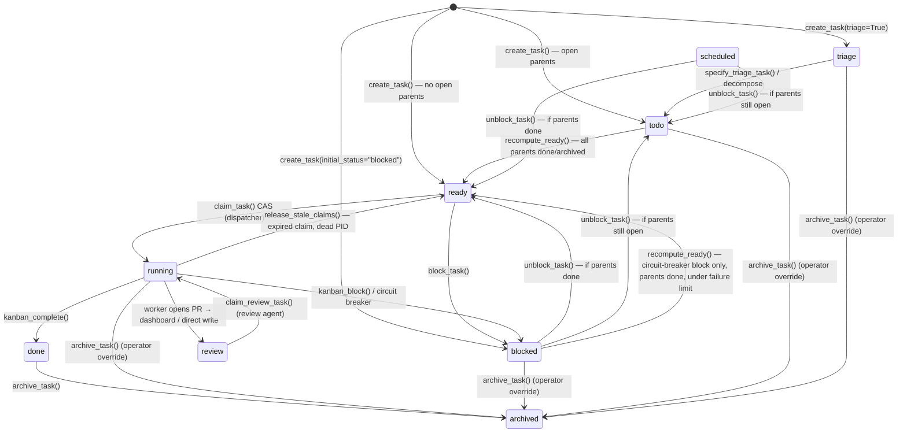

**TL;DR** — Every Hermes kanban task lives in exactly one of nine statuses at any moment. This chapter walks you through all nine, shows you the precise trigger for every transition, and traces one concrete task from `triage` all the way to `done`. By the end you will be able to read the board — and reason about what happens when things go sideways.

# The Nine-Status Task State Machine

Think about what it means for a task to move through a system where several AI workers, a dispatcher, and a human all touch it. If the board only had "todo / doing / done", you could not answer questions like: *is this task waiting on dependencies or waiting for a human?* *Did the worker crash, or did it finish?* *Is this cron job paused until tomorrow, or is it blocked by a bug?*

Hermes solves this with nine exactly-defined statuses, each with a specific meaning and a narrow set of triggers. They are defined as a Python set in `hermes_cli/kanban_db.py`:

```python
# hermes_cli/kanban_db.py  l.100
VALID_STATUSES = {
    "triage", "todo", "scheduled", "ready",
    "running", "blocked", "review", "done", "archived"
}
```

Everything else in the system — the dispatcher, workers, humans, the dashboard — communicates through these nine values. Let's take them one at a time, then see how they connect.

## Status reference table

Before we walk through the walkthrough, here is the complete reference. Read it once now; you'll understand why each row is shaped the way it is after we follow a task through the full journey below.

| Status | What it means | How a task enters this status | How a task leaves |
|---|---|---|---|
| `triage` | Rough idea — not ready for workers yet; a specifier will flesh it out | `create_task(triage=True)` via CLI/tool/dashboard | Specifier calls `specify_triage_task()` → `todo`; or decomposer fans out children → root becomes `todo` |
| `todo` | Scoped and assigned but one or more parent tasks are not yet `done` | `specify_triage_task()` → `todo`; `create_task()` when parents are still open | `recompute_ready()` promotes to `ready` when all parents are `done` or `archived` |
| `scheduled` | Waiting on a time gate, not a human or dependency | `schedule_task()` — from `todo`, `ready`, `running`, or `blocked` | `unblock_task()` (by human, cron, or automation) → `ready` or `todo` depending on parent state |
| `ready` | All parents satisfied; eligible for dispatching | `recompute_ready()` promotes from `todo`; `unblock_task()` when parents are done; manual `promote_task()` | `claim_task()` CAS → `running` (dispatcher); `block_task()` → `blocked` |
| `running` | A worker owns the task under a time-bounded claim lock | `claim_task()` CAS on a `ready` task; `claim_review_task()` on a `review` task | Worker calls `kanban_complete()` → `done`; worker calls `kanban_block()` → `blocked`; claim expires → `release_stale_claims()` → `ready` |
| `blocked` | Needs human or operator gate before work can continue | `block_task()` — from `running` or `ready`; circuit breaker after repeated failures | `unblock_task()` (orchestrator or human) → `ready` or `todo`; `recompute_ready()` auto-recovers circuit-breaker blocks once parents are done (but NOT worker-initiated blocks) |
| `review` | Worker pushed a PR; awaiting an automated review agent | Task moved to `review` via dashboard or direct DB write after a worker opens a PR | `claim_review_task()` → `running` (review agent); review agent calls `kanban_complete()` → `done`; or re-opens to `running` for worker to fix |
| `done` | Work is complete; result is recorded | `complete_task()` from `running`, `ready`, or `blocked` | `archive_task()` → `archived` (human action) |
| `archived` | Terminal; invisible by default | `archive_task()` from any non-archived status | Permanent; only `delete_archived_task()` can remove the row entirely |

## The state diagram

With the table in mind, here is the complete nine-status machine. The arrows are the actual transitions confirmed in `kanban_db.py` and `kanban_tools.py`.



Notice: `running → ready` is reclaim (expired claim, crashed worker), not normal completion. And `blocked → ready` has two separate paths: the `unblock_task()` operator path and the automatic `recompute_ready()` path — and these behave differently, which matters. We'll explore both.

## Walking through each status

### `triage` — parking lot for rough ideas

The problem: someone fires a quick idea at the board — "Build the auth service" — but the task has no assignee, no body, and no plan. If the dispatcher saw it, it would either crash or assign it to the wrong person.

`triage` is the holding column for tasks that need human or AI specification before work begins. You create a task in triage either by passing `triage=True` to the CLI/tool, or by clicking `+` on the Triage column in the dashboard. The dispatcher never spawns a `triage` task.

Two exits:
- **Specify**: `specify_triage_task()` fills in title, body, and assignee, then transitions `triage → todo`. `recompute_ready()` immediately runs afterward, so a specified task with no open parents goes straight to `ready` rather than sitting in `todo` until the next dispatcher tick.
- **Decompose**: the auto-decomposer fans the triage task out into a graph of child tasks and promotes the root to `todo` with those children as its dependents.

```bash
# CLI — create a rough task in triage
hermes kanban create "Refactor the auth service" --triage --assignee lead

# Specify it later (fills in body, assignee) and promotes to todo
hermes kanban specify <task-id> --title "Refactor auth to use JWT" \
    --body "Remove session-cookie usage. Use RS256 JWTs. AC: all existing tests pass." \
    --assignee backend
```

### `todo` — waiting on dependencies

The problem: a task is fully specified, but it depends on another task that isn't finished. We can't run it yet — the work it depends on hasn't landed. Putting it in `ready` would waste the dispatcher's time and potentially run the task on stale context.

`todo` is where dependency-gated tasks sit. A task enters `todo` in two ways:
1. `specify_triage_task()` promotes a triage task to `todo` (not directly to `ready`, so that parent-gating is still honoured).
2. `create_task()` with one or more `parents` whose status is not yet `done` starts the new task in `todo`.

The only exit from `todo` is `recompute_ready()`, which the dispatcher calls on every tick. It scans all `todo` tasks and checks each one's parents:

```python
# Simplified view of recompute_ready() — hermes_cli/kanban_db.py  l.2881
if all(p["status"] in ("done", "archived") for p in parents):
    conn.execute(
        "UPDATE tasks SET status = 'ready' WHERE id = ? AND status = 'todo'",
        (task_id,),
    )
```

When every parent reaches `done` or `archived`, the child flips to `ready` and the dispatcher picks it up on the next tick.

### `scheduled` — waiting on a time gate

The problem: some tasks shouldn't run right now — they're waiting for a specific time, not a human approval or a parent task. Putting them in `blocked` would pollute the blocked column with things that don't need human attention.

`scheduled` is the time-wait column. A task moves here via `schedule_task()`, which can be called on a task in `todo`, `ready`, `running`, or `blocked`. A cron job, human action, or automation later calls `unblock_task()` to release it:

```python
# hermes_cli/kanban_db.py  l.4762
def schedule_task(conn, task_id, *, reason=None, expected_run_id=None) -> bool:
    """Park a task in 'scheduled' so it is waiting on time, not human input.
    An external cron, human action, or automation can later call unblock_task()."""
```

`unblock_task()` handles both `blocked` and `scheduled` tasks identically: it checks parent state, then sets status to either `ready` (parents done) or `todo` (parents still open).

### `ready` — eligible for dispatch

The problem: we have a fully-specified, unblocked, dependency-satisfied task. How does the dispatcher know it's safe to spawn a worker right now?

`ready` is the answer. It means: "all preconditions are met; dispatcher, pick this up." The dispatcher's `dispatch_once()` function scans for `ready` tasks with an assignee and a live claim lock of `NULL`, then calls `claim_task()`.

`claim_task()` uses a compare-and-swap (CAS) update — a SQL `UPDATE … WHERE status = 'ready' AND claim_lock IS NULL` — so at most one worker can win any given task, even under concurrent dispatchers:

```python
# Simplified — hermes_cli/kanban_db.py  l.2972
cur = conn.execute(
    """
    UPDATE tasks
       SET status        = 'running',
           claim_lock    = ?,
           claim_expires = ?
     WHERE id = ?
       AND status = 'ready'
       AND claim_lock IS NULL
    """,
    (lock, expires, task_id),
)
if cur.rowcount != 1:
    return None   # someone else won the race
```

If the update affects zero rows, the claimer was beaten to it and moves on — no retry loops, no distributed locking.

`claim_task()` also enforces one more invariant: if any parent is not `done` at claim time (which can happen if a race promoted the task prematurely), it demotes the task back to `todo` rather than launching with broken context.

### `running` — work in progress

The problem: a worker is now executing the task, but we need to know two things: (a) is the worker still alive? and (b) what happens if it crashes mid-way?

When `claim_task()` succeeds, `status` becomes `running`, `claim_lock` is set to a unique worker identifier, and `claim_expires` is set to `now + DEFAULT_CLAIM_TTL_SECONDS` (15 minutes by default). This is the task's lease.

**Heartbeating.** A worker that knows it will exceed 15 minutes calls `kanban_heartbeat` (the agent-facing tool) or `heartbeat_claim()` periodically to extend its `claim_expires`. The auto-heartbeat bridge in `kanban_tools.py` also bumps `last_heartbeat_at` as a side effect of normal API traffic, so even a worker that never calls the heartbeat tool explicitly stays fresh while it's actively talking to the LLM.

**Normal exits from `running`:**
- `kanban_complete()` → `done`. The worker calls this tool when the work is finished.
- `kanban_block()` → `blocked`. The worker calls this when it needs human input.

**Abnormal exits:**
- Claim expires and the worker's PID is dead (or the worker is on a different host) → `release_stale_claims()` resets `status = 'ready'`. The task is re-queued.
- The dispatcher's `detect_crashed_workers()` catches wedged workers: if `last_heartbeat_at` is stale by more than 1 hour (`DEFAULT_CLAIM_HEARTBEAT_MAX_STALE_SECONDS`), the worker is treated as dead even if the PID is technically alive.

We'll return to the crash/reclaim scenario in the [Edge cases](#edge-cases-and-failure-modes) section.

### `blocked` — needs human or operator gate

The problem: a worker has done what it can but needs human input — a credential, a decision, a review. Or the circuit breaker has tripped after repeated failures. Either way, work cannot continue automatically.

`blocked` has two very different entry paths, and `recompute_ready()` treats them differently:

**Path 1 — worker-initiated.** The worker calls `kanban_block(reason="...")`. This emits a `"blocked"` event into `task_events`. `recompute_ready()` sees this "sticky block" and does NOT auto-recover the task, even when parents finish. An explicit `unblock_task()` call is required.

**Path 2 — circuit breaker.** When `consecutive_failures` reaches the failure limit (default 2 via `DEFAULT_FAILURE_LIMIT`), `_record_task_failure()` trips: it sets `status = 'blocked'` but emits `"gave_up"`, not `"blocked"`. `recompute_ready()` treats this differently — it *will* auto-promote the task to `ready` once parents are done, unless the failure counter is at or above the limit. This lets transient infra failures recover without human intervention.

```bash
# Unblock a worker-initiated block (orchestrator or human only)
hermes kanban unblock <task-id>
# The kanban_unblock tool (orchestrator-facing)
# transitions: blocked → ready  (or blocked → todo if parents still open)
```

### `review` — awaiting an automated review agent

The problem: a worker implementing a coding task has opened a pull request. We don't want to call the task `done` yet — the PR needs a reviewer to check it. But we also don't want to block it for human review when an automated review agent can do the job.

`review` is the gate between "worker finished draft" and "work is accepted." A task enters `review` after a worker opens a PR and the task is moved to this column — via a dashboard drag-drop or a direct DB write in the SDLC workflow. <!-- GAP: there is no dedicated agent-facing `kanban_review()` tool in kanban_tools.py; the running→review transition is driven by dashboard/direct DB write, not by a worker tool call; source does not expose this as a structured tool -->

The dispatcher handles `review` tasks separately from `ready` tasks. In `dispatch_once()`:

```python
# hermes_cli/kanban_db.py  l.6339
# Review tasks are tasks that a worker moved to 'review' after
# creating a PR. The dispatcher spawns a review agent (loading
# sdlc-review skill) that verifies the PR and either merges (→ done)
# or rejects (→ back to running for the worker to fix).
claimed = claim_review_task(conn, row["id"], ttl_seconds=ttl_seconds)
if claimed is not None:
    claimed.skills = ["sdlc-review"]   # force-load the review skill
```

`claim_review_task()` transitions `review → running` (the same CAS pattern as `claim_task()`, but looking for `status = 'review'` instead of `status = 'ready'`). The review agent then calls `kanban_complete()` when the PR is merged → `done`, or re-opens work for the original worker to fix.

### `done` — complete

The problem: work is finished, the result is recorded, and downstream tasks need to know they can proceed.

`done` is entered by `complete_task()`, which:
1. Transitions `running | ready | blocked → done`.
2. Clears `claim_lock`, `claim_expires`, `worker_pid`.
3. Runs `recompute_ready()` in a separate transaction so downstream children that were waiting on this task see the `done` state and get promoted.
4. Resets `consecutive_failures` to zero (a success wipes the failure history).

A completed task shows up with its `result` field and the last run's `summary` and `metadata` — this is the handoff the next worker reads.

### `archived` — terminal

The problem: `done` tasks pile up over time and clutter the board. We need a way to park them out of sight without deleting the historical record.

`archived` is the terminal status. `archive_task()` can be called on any non-archived status (it is an operator/human action — workers never call this). Like `done`, it also calls `recompute_ready()` afterward, because `archived` parents count as satisfied just like `done` ones — children do not need to wait for their parent to be individually unarchived.

Once archived, only `delete_archived_task()` can remove the row, and that requires the task to already be in `archived` first — a two-step safety guard against accidental deletion.

## Worked example: tracing a task from triage to done

Let's trace one task the whole way. We'll build a feature for an imaginary project.

**Step 1 — create in triage.**

A user in the Telegram gateway types: `/kanban add "Build the CSV export feature" --triage`. The dispatcher creates the task in `triage`. Status: `triage`.

```bash
# CLI equivalent
hermes kanban create "Build the CSV export feature" \
    --triage \
    --tenant acme-project
# Returns: task id t_a1b2c3d4e5f6
```

**Step 2 — specify → todo.**

An orchestrator profile runs `specify_triage_task()`, assigns the task to the `backend` profile, and adds acceptance criteria in the body. Status: `todo`. (Even though this task has no parents, it lands in `todo` first; `specify_triage_task()` immediately calls `recompute_ready()` afterward.)

Because there are no parent tasks, `recompute_ready()` promotes the task instantly. Status: `ready`.

**Step 3 — dispatcher claims → running.**

On the next `dispatch_once()` tick, the dispatcher finds `t_a1b2c3d4e5f6` in `ready` with `assignee = "backend"` and `claim_lock IS NULL`. It calls `claim_task()`:

```python
# Simplified: hermes_cli/kanban_db.py  l.2972
conn.execute(
    "UPDATE tasks SET status='running', claim_lock=?, claim_expires=? "
    "WHERE id=? AND status='ready' AND claim_lock IS NULL",
    (lock, now + 900, "t_a1b2c3d4e5f6"),
)
```

`claim_expires` is set 15 minutes out. The dispatcher spawns a `backend` profile subprocess with `HERMES_KANBAN_TASK=t_a1b2c3d4e5f6` in its environment. Status: `running`.

**Step 4 — worker calls kanban_complete → done.**

The worker implements the CSV export, runs the tests, then calls:

```python
kanban_complete(
    summary="Implemented CSV export via /api/export?format=csv. "
            "Added streaming response to avoid memory pressure. "
            "Tests: 12 new, all pass.",
    metadata={
        "changed_files": ["api/export.py", "tests/test_export.py"],
        "tests_run": 12,
    },
)
```

Under the hood this calls `complete_task()` in `kanban_db.py`:
- `status` → `done`
- `claim_lock`, `claim_expires`, `worker_pid` → `NULL`
- `completed_at` → now
- `recompute_ready()` runs → any children waiting on this task get promoted

Status: `done`. Downstream tasks unblock.

**Step 5 — human archives.**

A week later the operator runs `hermes kanban archive t_a1b2c3d4e5f6`. Status: `archived`.

## Edge cases and failure modes

### `blocked` and `review` require an external gate

A worker-initiated `blocked` task (one where the worker called `kanban_block(reason="...")`) stays blocked indefinitely. The `recompute_ready()` function checks the most recent event in `task_events` for `"blocked"` vs `"unblocked"`. If the most recent one is `"blocked"`, the task is sticky and `recompute_ready()` skips it — it will NOT auto-recover, even after all parents finish.

To unblock it, a human or orchestrator must call `kanban_unblock` (the orchestrator-facing tool, not available to task workers) or `hermes kanban unblock <id>` on the CLI.

`review` tasks behave similarly: they only exit when the review agent's `claim_review_task()` runs and the agent completes or re-opens the work. There is no automatic time-based release.

### A running task whose worker crashes

When a worker subprocess dies — network failure, OOM kill, uncaught exception — its lease expires. No special crash signal reaches the board; `release_stale_claims()` handles the recovery on the next dispatcher tick:

1. It finds all `running` tasks whose `claim_expires < now`.
2. For each, if the `worker_pid` is alive **and** the worker is on the same host **and** `last_heartbeat_at` is fresh (within 1 hour), it extends `claim_expires` rather than reclaiming. This handles the case where a long single LLM call (no tool calls in between) temporarily lets the TTL slip.
3. Otherwise it transitions `status = 'ready'`, clears `claim_lock`, `claim_expires`, `worker_pid`, and records a `"reclaimed"` event.

The task is back in `ready` within one dispatcher tick (typically 60 seconds). The next spawn attempt gets a fresh claim.

> For more detail on the dispatch tick, claim TTL, and the `dispatch_once()` / `claim_task()` flow that drives steps 3 and the reclaim path, see [Kanban Dispatch](../multi-agent/kanban-dispatch.md) — that page covers how `dispatch_once()` sequences the `recompute_ready` + `release_stale_claims` + `claim_task` operations and how a crashed worker's expired claim flows back into the cycle.

### `goal_mode` and the `running → blocked` path

A task created with `goal_mode=True` runs the worker in a goal loop: after each turn, an auxiliary judge checks the worker's output against the task's title and body (used as acceptance criteria). If the work isn't done and the turn budget remains, the worker continues in the same session. `goal_max_turns` caps this loop; the default engine maximum is 20 turns.

When the budget runs out before the judge is satisfied, the loop calls `kanban_block()` — the task moves from `running` to `blocked` for human review, rather than silently exiting. This is a worker-initiated block (it emits a `"blocked"` event), so it will NOT auto-recover via `recompute_ready()`.

<!-- GAP: the exact goal-loop judge mechanism and HERMES_KANBAN_GOAL_MAX_TURNS env variable behavior are documented in kanban_db.py l.6738-6741, but the judge's internal logic lives in the goals engine (separate from S21/S82); see P20 for the full goal_mode walkthrough -->

For how goal mode keeps a worker running until its goal is met, see [The Task Dataclass, DAG Links, Worker Handoff, and Artifacts](./task-dataclass-dag-and-handoff.md) and [Kanban Dispatch](../multi-agent/kanban-dispatch.md).

### The `scheduled` / `blocked` dual-use of `unblock_task()`

`unblock_task()` handles both `blocked` and `scheduled` in a single function. Whichever status the task is in, the transition is the same: re-check parents, then set `status = 'ready'` (parents done) or `status = 'todo'` (parents still open):

```python
# Simplified: hermes_cli/kanban_db.py  l.4238
new_status = "todo" if undone_parents else "ready"
conn.execute(
    "UPDATE tasks SET status = ?, current_run_id = NULL, "
    "consecutive_failures = 0, last_failure_error = NULL "
    "WHERE id = ? AND status IN ('blocked', 'scheduled')",
    (new_status, task_id),
)
```

Notice it also resets `consecutive_failures` to zero — unblocking a task is treated as an operator vote of confidence that the next run should start fresh.

### What about `Task` dataclass fields, DAG links, and the worker handoff?

We have deliberately kept this chapter focused on the status machine. The `Task` dataclass fields (`id`, `title`, `body`, `assignee`, `workspace_kind`, `current_run_id`, `result`, `skills`, `goal_mode`, …), the `task_links` parent/child DAG, and the `build_worker_context()` handoff are all covered in the next chapter: [The Task Dataclass, DAG Links, Worker Handoff, and Artifacts](./task-dataclass-dag-and-handoff.md).

---

← Previous: [Swarm Topologies with create_swarm()](../multi-agent/swarm-topologies.md) · Next: [The Task Dataclass, DAG Links, Worker Handoff, and Artifacts](./task-dataclass-dag-and-handoff.md) →
