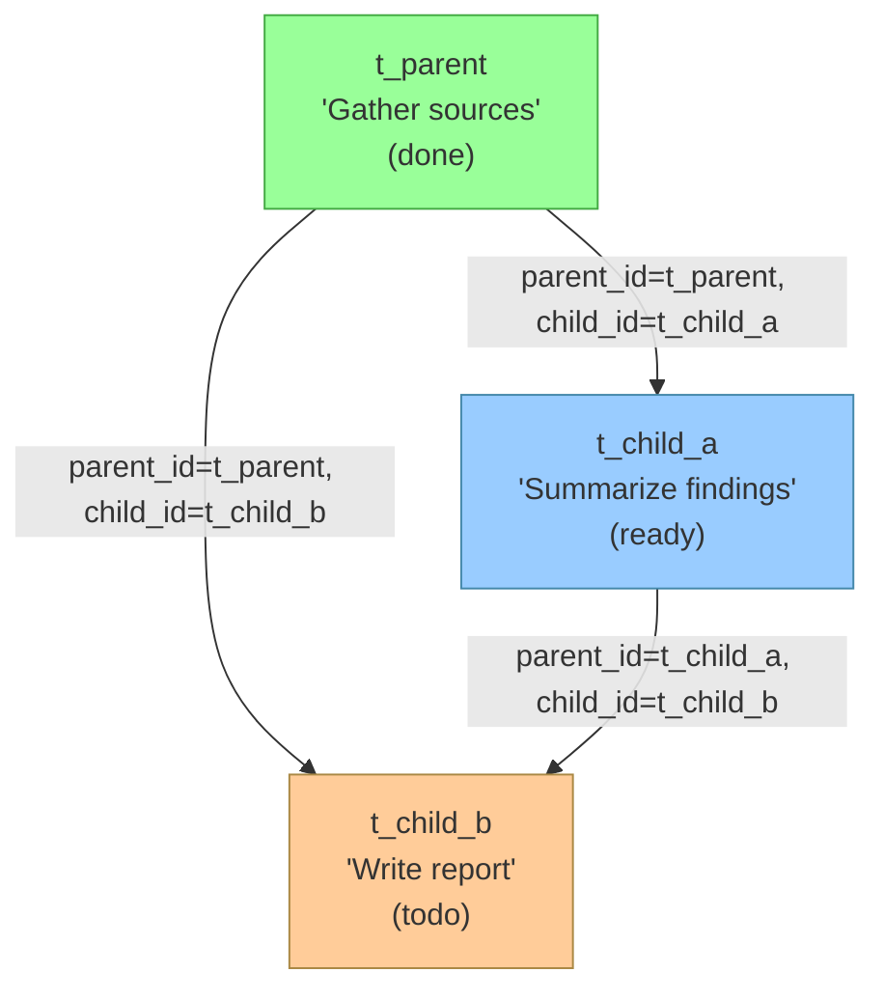
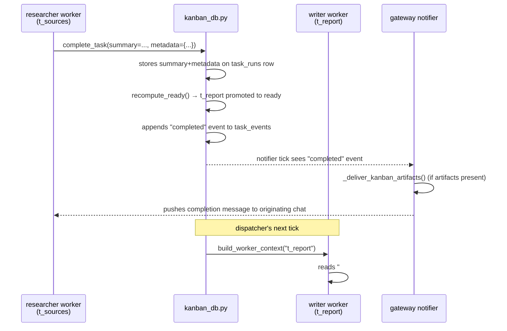
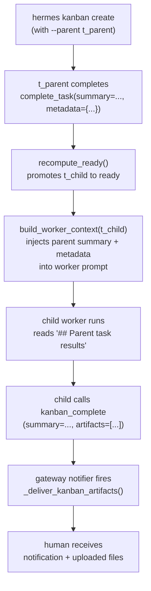

**TL;DR** — Statuses (covered in the previous chapter) tell you *where* a task is. This chapter covers *what* a task carries: the `Task` dataclass fields, the `task_links` table that forms a dependency DAG, and the `complete_task()` / `build_worker_context()` pair that hands a finished worker's conclusions forward to the next one. We also look at notification subscriptions and artifact delivery, which close the loop back to the human who originally requested the work.

# The Task Dataclass, DAG Links, Worker Handoff, and Artifacts

## The gap between status and data

The nine statuses we explored in [the previous chapter](./nine-status-state-machine.md) act like a signal board: they tell the dispatcher whether a task is waiting for work, being worked on, or finished. But a status on its own cannot carry meaning across workers. When a second agent picks up a child task, it needs to know what the parent agent found. When a gateway platform notifies you that your task finished, it should be able to attach the output file rather than just a message. That communication — the actual data — lives in fields, tables, and functions that sit alongside the status machinery.

Let's build up the picture one layer at a time.

## The `Task` dataclass

In `hermes_cli/kanban_db.py`, every row from the `tasks` SQLite table is loaded into a Python `@dataclass` called `Task`. This gives the rest of the code a typed in-memory view of a task without scattering `row["field"]` accesses everywhere.

```python
# Simplified view of the Task dataclass (hermes_cli/kanban_db.py)
@dataclass
class Task:
    id: str                          # unique identifier, e.g. "t_a3f91b4c"
    title: str                       # one-line description of the work
    body: Optional[str]              # extended description / opening post
    assignee: Optional[str]          # profile name of the worker
    status: str                      # one of the nine VALID_STATUSES
    priority: int                    # higher = more urgent (default 0)
    created_by: Optional[str]        # who or what created this task
    created_at: int                  # Unix timestamp
    started_at: Optional[int]        # set when first claimed
    completed_at: Optional[int]      # set by complete_task()
    workspace_kind: str              # "scratch" | "worktree" | "dir"
    workspace_path: Optional[str]    # absolute path to the working directory
    claim_lock: Optional[str]        # opaque string owned by the active worker
    claim_expires: Optional[int]     # Unix timestamp after which the claim lapses
    tenant: Optional[str]            # optional isolation namespace
    branch_name: Optional[str]       # git branch for worktree workspaces
    result: Optional[str]            # legacy free-text result (prefer summary)
    consecutive_failures: int        # crash/timeout counter; trips circuit breaker
    worker_pid: Optional[int]        # OS PID of the active worker process
    last_failure_error: Optional[str]# short excerpt from the last failure
    max_runtime_seconds: Optional[int]# wall-clock cap; None = no cap
    last_heartbeat_at: Optional[int] # updated by the worker to signal liveness
    current_run_id: Optional[int]    # pointer to the active task_runs row
    skills: Optional[list]           # extra skills force-loaded into the worker
    model_override: Optional[str]    # per-task model (overrides profile default)
    max_retries: Optional[int]       # per-task circuit-breaker limit
    goal_mode: bool                  # run worker in a judge-loop (default False)
    goal_max_turns: Optional[int]    # judge-loop turn budget (default 20)
    session_id: Optional[str]        # originating chat session, if any
    idempotency_key: Optional[str]   # deduplicate duplicate submissions
    workflow_template_id: Optional[str] # reserved for v2 workflow routing
    current_step_key: Optional[str]  # reserved for v2 workflow routing
```

That is a lot of fields. Here is a reference table organised by concern:

### Task field reference

| Group | Field | Purpose |
|---|---|---|
| **Identity** | `id` | Unique task identifier (e.g. `t_a3f91b4c`). |
| | `title` | One-line human-readable description. |
| | `body` | Extended description / briefing. Surfaced to the worker in `build_worker_context()`. |
| | `idempotency_key` | Optional deduplication key; prevents duplicate task creation on retry. |
| **Ownership** | `assignee` | Profile name the dispatcher will send work to (e.g. `"worker"` or `"researcher"`). |
| | `created_by` | Profile or task-id that created this task; used to verify `created_cards`. |
| | `tenant` | Optional isolation tag for multi-tenant boards. |
| | `session_id` | Originating chat session; lets the gateway show a per-session board view. |
| **Lifecycle** | `status` | Current nine-status position (see [the state machine](./nine-status-state-machine.md)). |
| | `created_at` | Unix timestamp of creation. |
| | `started_at` | Unix timestamp of first claim. |
| | `completed_at` | Unix timestamp set by `complete_task()`. |
| **Claim** | `claim_lock` | Opaque string that identifies the active claim (set atomically on `ready → running`). |
| | `claim_expires` | Unix timestamp after which the dispatcher can reclaim a stale worker. Default TTL is 15 minutes (`DEFAULT_CLAIM_TTL_SECONDS = 15 * 60`). |
| | `worker_pid` | OS PID of the worker process; used to detect crashes. |
| | `last_heartbeat_at` | Updated by the worker (or the auto-heartbeat bridge) to prove the process is alive. |
| | `current_run_id` | Pointer to the active row in `task_runs`; `NULL` when no run is in-flight. |
| **Workspace** | `workspace_kind` | How the working directory is set up: `"scratch"` (disposable temp dir), `"worktree"` (git worktree), `"dir"` (existing directory). |
| | `workspace_path` | Absolute path resolved by the dispatcher; `NULL` until claimed. |
| | `branch_name` | Git branch name for `worktree` workspaces. |
| **Results** | `result` | Legacy free-text result field. Prefer `summary` on the `Run` row. |
| | `consecutive_failures` | Counter incremented on crash/timeout/spawn failure; reset only on success. Trips the circuit breaker when it reaches `max_retries` (or the board-level `kanban.failure_limit`). |
| | `last_failure_error` | Short excerpt from the most recent failure, for display in the dashboard. |
| **Config** | `priority` | Numeric priority (higher = dispatched first). |
| | `max_runtime_seconds` | Wall-clock cap; the dispatcher terminates the worker when exceeded. |
| | `model_override` | Per-task model (e.g. `"claude-opus-4-5"`). Overrides the profile's default. |
| | `skills` | Extra skill names to force-load into the worker, alongside the built-in `kanban-worker` skill. |
| | `max_retries` | Per-task override for the circuit-breaker trip threshold. |
| | `goal_mode` | `True` → run worker in a judge-loop (see [Goal mode](#goal-mode-and-goal_max_turns) below). |
| | `goal_max_turns` | Turn budget for the judge loop; `None` falls through to the goals-engine default (documented as 20 in the CLI help). |
| **Routing** | `workflow_template_id` | Reserved for v2 workflow routing; not consulted by the dispatcher in v1. |
| | `current_step_key` | Reserved for v2 workflow routing; not consulted in v1. |

### The `Run` dataclass

You might notice that `summary` and `metadata` are not on `Task` — they live on `Run`. A `Run` is one *attempt* to execute a task. Each time the dispatcher claims a task, it creates a new row in the `task_runs` table; when the task completes, crashes, or gets reclaimed, the run is closed with an outcome.

```python
# Simplified view of the Run dataclass (hermes_cli/kanban_db.py)
@dataclass
class Run:
    id: int                      # auto-increment primary key
    task_id: str                 # parent task
    profile: Optional[str]       # which profile ran this attempt
    status: str                  # running | done | blocked | crashed | ...
    started_at: int
    ended_at: Optional[int]
    outcome: Optional[str]       # completed | blocked | crashed | reclaimed | ...
    summary: Optional[str]       # ← the handoff text downstream workers read
    metadata: Optional[dict]     # ← structured facts (changed_files, etc.)
    error: Optional[str]         # short error excerpt on failure
    claim_lock: Optional[str]
    claim_expires: Optional[int]
    worker_pid: Optional[int]
    last_heartbeat_at: Optional[int]
```

Multiple runs per task-id accumulate when the task is retried after a crash or timeout. `build_worker_context()` shows a retrying worker the history of all prior runs — it can see what previous attempts tried and why they failed.

## The `task_links` table and the dependency DAG

Now that we understand the `Task` dataclass, we have a new problem: in a multi-step workflow, one task often depends on another. Before the "research" task runs, the "gather sources" task must be done. We need a way to express that dependency so the dispatcher does not spawn the child prematurely.

That is the job of the `task_links` table:

```sql
-- hermes_cli/kanban_db.py
CREATE TABLE IF NOT EXISTS task_links (
    parent_id  TEXT NOT NULL,
    child_id   TEXT NOT NULL,
    PRIMARY KEY (parent_id, child_id)
);
```

Each row says: "the child cannot start until the parent is `done` or `archived`." A task can have many parents, and a task can be the parent of many children. This forms a **directed acyclic graph** — a DAG.

A **DAG** (directed acyclic graph) is a structure where relationships have direction (parent → child) and there are no cycles. Think of it like a family tree where no one can be their own ancestor. In Hermes's kanban board, tasks form a DAG: a child task depends on one or more parent tasks finishing before the child can start. There are no cycles — you cannot have task A depending on B which depends back on A.

Here is a small example with three tasks:



In this graph `t_child_b` has two parents: `t_parent` and `t_child_a`. Both must reach `done` before `t_child_b` can leave `todo` and move to `ready`.

### How `recompute_ready` enforces the DAG

We saw the `recompute_ready()` function briefly in [the nine-status chapter](./nine-status-state-machine.md). Let's recap what it does in the context of the DAG:

> `recompute_ready(conn)` scans all tasks in `todo` or `blocked` status. For each candidate, it looks up all rows in `task_links` where that task is the `child_id`. If *all* of those parents are in `done` or `archived`, the candidate is promoted to `ready`. If even one parent is still in an earlier status, the candidate stays put.

`complete_task()` calls `recompute_ready()` automatically after each successful completion, so the promotion happens immediately when a parent finishes. The dispatcher's next tick will see newly-`ready` children and spawn their workers.

There is also a defence at claim time: `claim_task()` re-checks parent statuses inside the same write transaction. If a race condition put a task into `ready` while a parent was still unfinished, `claim_task()` demotes it back to `todo` and returns `None` rather than spawning a premature worker.

### Edge case: a parent that never completes

What if a parent task stays in `todo` indefinitely — perhaps it was accidentally created with no worker assigned? The child's `task_links` row keeps pointing at that unfinished parent, and `recompute_ready()` will never promote the child as long as even one parent is not `done`.

The operator's tool for this situation is `hermes kanban unblock <child-id>` after manually completing or archiving the stalled parent, or by breaking the dependency: the child can be recreated without the link. The system does not auto-promote children past stuck parents — that would silently skip work the parent was supposed to do.

## Worker handoff: `complete_task()` and `build_worker_context()`

Once the DAG tells us *when* a child should run, we still have the question of *what* it should know. A downstream agent starting cold has no idea what the parent found. The handoff mechanism answers that.

### Step 1 — The worker calls `complete_task()`

When a worker finishes its task, it calls `kanban_complete` (the tool defined in `tools/kanban_tools.py`), which in turn calls `complete_task()` in `kanban_db.py`.

```python
# tools/kanban_tools.py — what the worker's tool call reaches
ok = kb.complete_task(
    conn, tid,
    result=result,       # legacy single-string result
    summary=summary,     # preferred: narrative handoff text
    metadata=metadata,   # structured facts: {"changed_files": [...], ...}
    created_cards=created_cards,  # task-ids this worker spawned
    expected_run_id=_worker_run_id(tid),
)
```

The two most important arguments are:

- **`summary`** — a human-readable narrative describing what the worker accomplished. This is what downstream workers and humans see first. If `summary` is omitted, `complete_task()` falls back to `result` so single-run callers do not need to pass both.
- **`metadata`** — a free-form `dict` for structured facts a downstream worker can query programmatically. Common patterns: `{"changed_files": ["src/foo.py"], "tests_run": ["test_foo"]}`. A special key, `"artifacts"`, carries a list of file paths that should be uploaded to the originating chat (more on this below).

Internally, `complete_task()`:

1. Verifies any `created_cards` against `tasks.created_by` (rejecting "hallucinated" card ids that don't exist).
2. Transitions the task from `running → done` and writes `completed_at`.
3. Closes the `task_runs` row with `outcome="completed"`, storing `summary` and `metadata` there.
4. Emits a `"completed"` event to `task_events`, carrying a truncated first line of the summary and the artifact list in the event payload.
5. Calls `recompute_ready()` so any newly-unblocked children are promoted.

### Step 2 — The dispatcher calls `build_worker_context()`

When the dispatcher spawns a child worker, it calls `build_worker_context(conn, task_id)` to assemble the opening prompt the child will read. This function pulls together everything the worker needs in one structured text block.

The sections `build_worker_context()` assembles, in order:

```
# Kanban task t_child_a: Summarize findings

Assignee: researcher
Status:   ready
Workspace: scratch @ /home/user/.hermes/kanban/workspaces/t_child_a

## Body
<task.body — capped at 8 KB>

## Attachments
Files attached to this task. Read them with the file/terminal tools:
- `brief.pdf`, application/pdf, 42 KB → `/home/user/.hermes/.../brief.pdf`

## Prior attempts on this task
### Attempt 1 — crashed (researcher, 2026-06-09 14:23)
<run.summary from the crashed run>

## Parent task results
### t_parent
<run.summary from the parent's completed run>
_metadata_: `{"changed_files": ["sources.md"]}`

## Recent work by @researcher
- t_0001 — Gather bibliography (2026-06-09 10:11): Found 14 peer-reviewed papers…

## Comment thread
comment from worker `researcher` at 2026-06-09 14:20:
<comment body>
```

The key section for the handoff is **"Parent task results"**. `build_worker_context()` queries `task_links` for the current task's parents, loads each parent's most recent completed run, and includes that run's `summary` and `metadata`. This is how the parent's conclusions flow into the child.

A few things to notice about how this is bounded:

| Cap constant | Value | Controls |
|---|---|---|
| `_CTX_MAX_PRIOR_ATTEMPTS` | 10 | Most recent N prior attempts shown in full |
| `_CTX_MAX_COMMENTS` | 30 | Most recent N comments shown in full |
| `_CTX_MAX_FIELD_BYTES` | 4 096 bytes | Per summary/error/metadata field |
| `_CTX_MAX_BODY_BYTES` | 8 192 bytes | Task body field |
| `_CTX_MAX_COMMENT_BYTES` | 2 048 bytes | Per comment body |

These caps exist so the worker's prompt stays bounded even on boards with retried tasks and long comment threads.

### Worked example: a two-task parent/child handoff

Let's walk through a concrete scenario. We have two tasks:

- `t_sources` — "Gather reference documents" (assigned to `researcher`)
- `t_report` — "Write the synthesis report" (assigned to `writer`, child of `t_sources`)

**1. Create the dependency:**

```bash
# Create the parent
hermes kanban create "Gather reference documents" --assignee researcher
# → t_sources

# Create the child with a parent link
hermes kanban create "Write the synthesis report" \
  --assignee writer \
  --parent t_sources
# → t_report  (starts in "todo" because t_sources is not yet done)
```

**2. The researcher's worker runs and completes:**

The `researcher` worker calls `kanban_complete` with a structured handoff:

```python
# Inside the researcher worker (via the kanban_complete tool)
kanban_complete(
    summary="Found 14 peer-reviewed papers on distributed consensus. "
            "Key paper: Raft (Ongaro & Ousterhout, 2014). "
            "See sources.md for full bibliography.",
    metadata={
        "changed_files": ["sources.md"],
        "paper_count": 14,
        "key_paper": "raft-2014"
    }
)
```

`complete_task()` stores the `summary` and `metadata` on the `task_runs` row for `t_sources`. Then it calls `recompute_ready()`, which sees that `t_report`'s only parent (`t_sources`) is now `done`, and promotes `t_report` to `ready`.

**3. The dispatcher spawns the writer worker:**

Before starting the writer, the dispatcher calls `build_worker_context(conn, "t_report")`. The resulting prompt includes:

```
# Kanban task t_report: Write the synthesis report

Assignee: writer
Status:   ready
Workspace: scratch @ /home/user/.hermes/kanban/workspaces/t_report

## Parent task results
### t_sources
Found 14 peer-reviewed papers on distributed consensus.
Key paper: Raft (Ongaro & Ousterhout, 2014).
See sources.md for full bibliography.
_metadata_: `{"changed_files": ["sources.md"], "key_paper": "raft-2014", "paper_count": 14}`
```

We — the writer agent — start with the researcher's conclusions already in context. We know where the bibliography is, how many papers were found, and which paper was flagged as most important. That is the handoff.



## Goal mode and `goal_max_turns`

One of the `Task` fields deserves its own explanation: `goal_mode`.

By default, a kanban worker is **single-shot**: the dispatcher spawns it, it works until it either calls `kanban_complete` or `kanban_block`, and then it exits. That works for well-bounded tasks, but open-ended tasks often need more than one pass.

When `goal_mode = True`, the dispatcher uses a **judge loop**. After each worker turn, an auxiliary judge model evaluates the worker's response against the task's `title` and `body`, which are treated as the goal specification. If the judge determines the goal is not yet met and there is still turn budget remaining, the worker receives a continuation prompt *in the same session* and keeps working. The loop continues until:

- The judge agrees the work is complete, or
- The turn budget is exhausted (the task is then moved to `blocked` for human review), or
- The worker explicitly calls `kanban_complete` or `kanban_block` itself.

`goal_max_turns` sets the turn budget for this loop. When `None`, it falls through to the goals-engine default (the CLI help documents the default as 20).

```bash
# Create a task in goal-loop mode with a 10-turn budget
hermes kanban create "Refactor the auth module to use the new token format" \
  --assignee coder \
  --goal \
  --goal-max-turns 10
```

Goal mode does not change the handoff mechanics. When the judge loop ends with a completion, `complete_task()` is called normally and the `summary` and `metadata` flow to children exactly as described above.

## Notification subscriptions: `kanban_notify_subs`

When you ask the Telegram gateway (or any other platform) to create a kanban task on your behalf, you want to be notified when it finishes. The gateway records that intent in the `kanban_notify_subs` table.

```sql
-- hermes_cli/kanban_db.py
CREATE TABLE IF NOT EXISTS kanban_notify_subs (
    task_id          TEXT NOT NULL,
    platform         TEXT NOT NULL,   -- e.g. "telegram"
    chat_id          TEXT NOT NULL,   -- which chat to message
    thread_id        TEXT NOT NULL DEFAULT '',
    user_id          TEXT,
    notifier_profile TEXT,            -- which gateway profile delivers the message
    created_at       INTEGER NOT NULL,
    last_event_id    INTEGER NOT NULL DEFAULT 0,
    PRIMARY KEY (task_id, platform, chat_id, thread_id)
);
```

Each row represents a subscription: "when task `task_id` reaches a terminal event, send a notification to `chat_id` on `platform`." The `last_event_id` is a cursor — it records which `task_events` row was last delivered, so the notifier does not re-send the same event on subsequent ticks.

Terminal events that trigger a notification include: `completed`, `blocked`, and `spawn_auto_blocked` (circuit-breaker trip). The notifier also fires on `timed_out` events. Events like `claimed` and `promoted` do not trigger a notification — those are operational and would be noise for the human requester.

The subscription is automatically removed (unsubscribed) when the task reaches `done` or `archived`. For `blocked` or other non-final failures, the subscription stays alive so the user can be notified again if the dispatcher respawns the task and it cycles back to the same state.

## Artifact delivery: `_deliver_kanban_artifacts()`

Let's return to the `metadata["artifacts"]` field we saw earlier. When a worker produces a file — a report, a chart, a patch — it can pass those file paths to `kanban_complete`:

```python
kanban_complete(
    summary="Generated the Q2 analysis report.",
    metadata={
        "changed_files": ["q2_report.pdf"]
    },
    artifacts=["/home/user/projects/reports/q2_report.pdf"]
)
```

`_handle_complete()` in `tools/kanban_tools.py` takes the `artifacts` list and stores it inside `metadata["artifacts"]`. `complete_task()` then promotes `metadata["artifacts"]` into the `"completed"` event payload so the gateway notifier can read it without fetching the run row separately.

When the notifier's `_kanban_dispatcher_watcher` tick sees the `"completed"` event, it calls `_deliver_kanban_artifacts()` (defined in `gateway/kanban_watchers.py`). This function:

1. Reads the explicit artifact paths from `event_payload["artifacts"]` (preferred).
2. Scans `event_payload["summary"]` for bare absolute paths (e.g. a summary that says "wrote `/tmp/report.pdf`").
3. Falls back to `task.result` for legacy completions without a run row.
4. Deduplicates the candidates and skips any paths that do not exist on disk.
5. Partitions the candidates: images (`.png`, `.jpg`, `.jpeg`, `.gif`, `.webp`) go into a batch `send_multiple_images()` call; video files (`.mp4`, `.mov`, etc.) use `send_video()`; everything else uses `send_document()`.

The delivery is best-effort: an exception from uploading one file is logged but does not break the notifier loop or the subscription for other events.

### Edge case: the originating chat is offline

You might wonder what happens if you asked Hermes to create a task from your Telegram chat, but then your phone is offline when the task completes six hours later. The subscription is durable — it sits in the SQLite `kanban_notify_subs` table. When your Telegram gateway next connects to Telegram's servers, the notifier's background watcher runs its periodic tick, finds unseen `"completed"` events for your subscriptions (via the `last_event_id` cursor), and sends the notification at that point. The cursor-based design means the delivery happens when connectivity is restored, not when the event was written.

If delivery fails repeatedly (the source code caps consecutive send failures at `MAX_SEND_FAILURES`), the subscription is dropped to prevent the notifier from looping indefinitely on a permanently broken delivery target.

## Putting it all together

We can now draw the full picture of how data flows through a parent/child workflow from creation to notification:



Each step in this chain corresponds to a real function or table in the codebase:

| Step | Code location |
|---|---|
| Create task + links | `kanban_db.create_task()` + `link_tasks()` |
| Complete parent | `kanban_db.complete_task()` |
| Promote children | `kanban_db.recompute_ready()` |
| Build worker prompt | `kanban_db.build_worker_context()` |
| Store handoff | `task_runs.summary` + `task_runs.metadata` |
| Notify subscriber | `gateway/kanban_watchers.py` notifier watcher |
| Upload artifacts | `gateway/kanban_watchers._deliver_kanban_artifacts()` |

---

← Previous: [The Nine-Status Task State Machine](./nine-status-state-machine.md) · Next: [Config-Driven Provider Routing and the Four api_mode Values](../providers/config-driven-routing-and-api-modes.md) →
