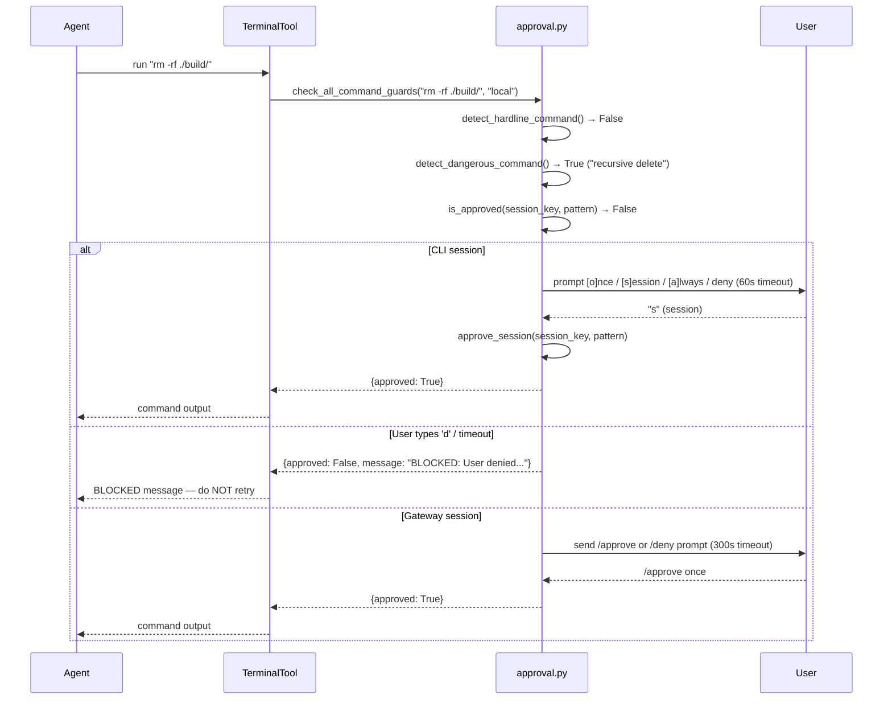

**TL;DR** — Every Hermes tool self-registers into a central `ToolRegistry` singleton at import time; the agent discovers all tools by loading those modules at startup. Before running a shell command that matches a list of destructive patterns, the agent pauses and asks you — but that gate is a *convenience heuristic*, not a security boundary, because shell is Turing-complete. Even after you approve a command, `file_safety.py` maintains a hardcoded denylist of paths — like `~/.ssh/`, `~/.aws/`, and `/etc/passwd` — that the `write_file` tool will never touch.

# The Tools Registry, Approval Gate, and File-Write Safety

Before we jump into the mechanics, let's set the context. The previous chapter on [Tool Dispatch and Guardrails](../core-runtime/tool-dispatch-and-guardrails.md) covered how the conversation loop calls tools and how guardrails can halt a runaway agent mid-loop. That chapter's guardrails were about *loop integrity* — stopping the agent from spinning forever. This chapter is about two different things: how the agent *learns which tools exist*, and what happens when those tools want to do something potentially destructive.

We'll build understanding in three parts, each motivated by a concrete problem.

---

## Part 1 — How does the agent know which tools exist?

### The problem: a growing catalog of tools

Hermes ships dozens of tools — file operations, shell commands, web browsing, kanban manipulation, delegation, and more. If every tool had to be manually wired up in a central dispatch table, adding or removing a tool would require editing that table. Worse, third-party plugins and MCP servers add their own tools at runtime. We need a way for tools to *declare themselves*.

### What the registry does

`tools/registry.py` defines a module-level singleton, `registry`, of type `ToolRegistry`. Every tool file calls `registry.register()` at module level — that is, at import time, not inside a function. The act of importing the module is what registers the tool.

```python
# Simplified view of how any tool file self-registers
from tools.registry import registry

registry.register(
    name="write_file",
    toolset="files",
    schema={...},           # OpenAI-format JSON schema the model sees
    handler=write_file_fn,  # Python callable that runs the tool
    check_fn=None,          # optional: returns True if tool is available
    is_async=False,
    description="Write content to a file",
    emoji="📝",
)
```

The `ToolRegistry` is thread-safe (protected by a `threading.RLock`), carries a monotonically-increasing `_generation` counter that bumps on every mutation, and stores tools in a `Dict[str, ToolEntry]` keyed by tool name.

### The `ToolEntry` metadata record

Each registered tool becomes a `ToolEntry` object. Its fields determine exactly what the model is told and what happens when the tool is called:

| Field | Purpose |
|---|---|
| `name` | Unique string identifier, e.g. `"write_file"` |
| `toolset` | Logical grouping, e.g. `"files"`, `"shell"`, `"mcp-github"` |
| `schema` | OpenAI-format JSON schema sent to the model |
| `handler` | Python callable that executes the tool |
| `check_fn` | Zero-arg callable returning `bool`; if it returns `False`, the tool is hidden from the model |
| `requires_env` | List of env-var names the tool needs (informational) |
| `is_async` | Whether the handler is a coroutine |
| `max_result_size_chars` | Per-tool output size cap |
| `dynamic_schema_overrides` | Zero-arg callable returning a `dict` of schema overrides applied at `get_definitions()` time |

The `dynamic_schema_overrides` field deserves a note: some tools (like `delegate_task`) need their schema description to reflect the *current* config values — for instance, the current delegation depth limit. Rather than re-registering the tool whenever config changes, the schema is patched dynamically each time `get_definitions()` is called.

### Discovery at startup: `discover_builtin_tools()`

How does Hermes load all of those self-registering modules? At startup, `discover_builtin_tools()` in `registry.py` does the following:

1. Scans every `*.py` file in the `tools/` directory (excluding `__init__.py`, `registry.py`, and `mcp_tool.py`).
2. For each file, it parses the AST and checks whether there is a **top-level** `registry.register(...)` call — that is, a call at the module body level, not inside a function.
3. Only those files are imported via `importlib.import_module()`. Importing them triggers the module-level `registry.register()` calls.

```python
# Simplified view of discover_builtin_tools()
def discover_builtin_tools(tools_dir=None):
    tools_path = Path(tools_dir or __file__).parent
    module_names = [
        f"tools.{path.stem}"
        for path in sorted(tools_path.glob("*.py"))
        if path.name not in {"__init__.py", "registry.py", "mcp_tool.py"}
        and _module_registers_tools(path)   # AST check
    ]
    for mod_name in module_names:
        importlib.import_module(mod_name)
```

The AST pre-check is a deliberate optimization: it means helper modules that happen to *call* `registry.register()` inside a function are not imported merely because of the filename pattern. Only files that advertise a top-level registration are loaded.

### How `get_definitions()` filters by availability

When the agent asks for the tool schemas it should send to the model, it calls `registry.get_definitions(tool_names)`. That function does one more thing: it runs each tool's `check_fn` to confirm the tool is actually available in the current environment. For example, the browser toolset checks whether a Playwright binary is installed; Docker tools check whether the Docker daemon is reachable.

Running these environment probes on every LLM call would be expensive. Instead, `registry.py` caches `check_fn` results for 30 seconds via `_check_fn_cached()`. If you change a tool's availability mid-session (for example, by running `hermes tools enable <toolset>`), you can call `invalidate_check_fn_cache()` to force an immediate re-probe on the next call.

> **Toolsets and reading order.** The toolset groupings (`"files"`, `"shell"`, `"browser"`, etc.) correspond to the `TOOLSETS` map covered in the chapter on [Iteration Budget and Toolsets](../core-runtime/iteration-budget-and-toolsets.md). This chapter does not re-teach toolsets; the point here is that the registry is the runtime home of all tool metadata, and toolsets are one organizing dimension within it.

---

## Part 2 — The approval gate: asking before doing something destructive

### The problem: some shell commands are irreversible

The `terminal` tool lets the agent run arbitrary shell commands. Most of the time that is exactly what you want — listing files, running tests, installing packages. But some commands are genuinely dangerous: `rm -rf`, `git reset --hard`, `DROP TABLE`, redirecting into `/etc/sudoers`. These cannot be undone. Before the agent runs them, you should get a say.

### How the gate works

`tools/approval.py` is the single source of truth for dangerous-command detection and approval. The main entry point is `check_all_command_guards(command, env_type)`, called by the terminal tool before any command executes.

The flow has four stages:

1. **Hardline floor.** A small, unconditional blocklist (`HARDLINE_PATTERNS`) of commands with no recovery path: recursive delete of the root filesystem (`rm -rf /`), disk format (`mkfs`), raw block device overwrite (`dd of=/dev/sda`), system shutdown/reboot, fork bombs, and kill-all-processes (`kill -1`). These are blocked regardless of your approval mode, YOLO setting, or cron configuration — even `--yolo` cannot pass them through. The rationale in the code: opting into YOLO means trusting the agent with your files and services, not trusting it to power the box off.

2. **YOLO / mode-off bypass.** If `HERMES_YOLO_MODE=1` was set at process start (frozen at import time to prevent prompt-injection escalation), or if the current session has YOLO enabled, or if `approvals.mode: off` is set in `config.yaml`, the gate returns `approved` for all non-hardline commands.

3. **Pattern detection.** `DANGEROUS_PATTERNS` is a list of about 47 compiled regexes covering destructive operations: recursive deletes, world-writable `chmod`, SQL `DROP`/`DELETE`/`TRUNCATE`, writes to system config paths, `curl|bash` pipelines, `git reset --hard`, `git push --force`, and more. The command is normalized first (ANSI codes stripped, Unicode normalized, shell escapes unquoted) before matching.

4. **Approval prompt.** If the command matches a pattern and has not already been approved for this session or permanently, the gate presents a prompt with four choices.

### The four choices

| Choice | Key | Effect |
|---|---|---|
| `once` | `o` | Allows this single invocation. No state is persisted. |
| `session` | `s` | Approves this pattern for the rest of the session (`_session_approved` dict). |
| `always` | `a` | Approves permanently: persists the pattern to `command_allowlist` in `config.yaml`. |
| `deny` | anything else | Blocks the command. Returns a BLOCKED message to the agent. |

In the CLI, the prompt waits for your input. The **CLI timeout** default is **60 seconds** (read from `approvals.timeout` in `config.yaml`, defaulting to `60`). If you do not respond in time, the prompt returns `"deny"` — *silence is not consent*.

In a gateway session (Telegram, Discord, API), the agent thread blocks and waits for you to reply with `/approve` or `/deny`. The **gateway timeout** default is **300 seconds** (5 minutes), configured via `approvals.gateway_timeout`. Again, a timeout resolves as `deny`.

```yaml
# config.yaml — approval tuning
approvals:
  mode: manual       # manual | smart | off
  timeout: 60        # seconds for CLI interactive prompt
  gateway_timeout: 300  # seconds for gateway /approve wait
  cron_mode: deny    # deny | approve — for cron jobs (no user present)
```

When you choose `session`, the pattern key is added to `_session_approved[session_key]`. When you choose `always`, the same happens *and* the pattern is written to `command_allowlist` in `config.yaml`, loaded back on next startup by `load_permanent_allowlist()`.

There is also a `smart` mode: when `approvals.mode: smart`, an auxiliary LLM call assesses the risk of the flagged command before the prompt appears. If it judges the command safe, it is auto-approved for the session. If it judges it genuinely dangerous, it is auto-denied. If uncertain, it escalates to the manual prompt.

### The sequence

Here is what happens when the agent tries to run `rm -rf ./build/`:



When the agent receives a BLOCKED result, the message explicitly says: *"Do NOT retry this command, do NOT rephrase it, and do NOT attempt the same outcome via a different command."*

### The Turing-complete caveat — this is a heuristic, not a security boundary

This is the most important thing to understand about the approval gate:

> **Shell is Turing-complete; a denylist over shell strings is structurally incomplete.**

The `DANGEROUS_PATTERNS` list can detect `rm -rf`, but it cannot detect every way a shell can achieve the same effect. A sequence of `mv` commands, a Python script that calls `shutil.rmtree`, a heredoc piped to `python3`, or a multi-step operation spread across several tool calls can all accomplish what `rm -rf` would — and none of them necessarily trigger a pattern match. The code acknowledges this directly in comments: operations like `git reset --hard` and `curl|sh` are in `DANGEROUS_PATTERNS` as approvable-but-recoverable actions, not hardline blocks, precisely because the line between "the agent should ask" and "the agent should never do" cannot be drawn purely with regex.

The approval gate is a **usability aid** that catches the most common destructive patterns and gives you a checkpoint. It is not a substitute for running the agent in an isolated environment when isolation actually matters. That topic is the subject of the later chapter on [OS Boundary and Isolation Postures](../security/os-boundary-and-isolation-postures.md).

---

## Part 3 — The file-write denied-path list

### The problem: even with approval, some files must never be written

Suppose the agent gets approval to run a shell command, or calls the `write_file` tool directly. We still do not want it overwriting `~/.ssh/id_rsa`, appending to `~/.bashrc`, or modifying `/etc/passwd`. These files hold credentials, control authentication, and shape the shell environment — a write to any of them from a prompt-injected instruction could have serious consequences.

The `write_file` and `patch_file` tools consult `agent/file_safety.py` before writing. This module exports two functions: `build_write_denied_paths()` (exact file matches) and `build_write_denied_prefixes()` (directory prefix matches). Together they form the write denylist checked by `is_write_denied(path)`.

### Exact denied paths (`build_write_denied_paths`)

These files are blocked outright — no override, no approval bypass at the file-tool level:

| Category | Path |
|---|---|
| SSH private keys | `~/.ssh/authorized_keys`, `~/.ssh/id_rsa`, `~/.ssh/id_ed25519`, `~/.ssh/config` |
| Hermes config | `~/.hermes/.env`, `~/.hermes/.anthropic_oauth.json` (and root equivalents) |
| Shell init files | `~/.bashrc`, `~/.zshrc`, `~/.profile`, `~/.bash_profile`, `~/.zprofile` |
| Credential stores | `~/.netrc`, `~/.pgpass`, `~/.npmrc`, `~/.pypirc`, `~/.git-credentials` |
| System auth | `/etc/sudoers`, `/etc/passwd`, `/etc/shadow` |

Additionally, `is_write_denied()` blocks writes to:
- `auth.json`, `config.yaml`, `webhook_subscriptions.json` under `~/.hermes/` (the Hermes control-plane files, because `config.yaml` is where the approval gate's own policy lives)
- Anything under `~/.hermes/mcp-tokens/` (OAuth token material)
- Anything under `~/.hermes/pairing/`

### Denied directory prefixes (`build_write_denied_prefixes`)

Entire directories are blocked — any path that *starts with* one of these prefixes is denied:

| Directory | What it protects |
|---|---|
| `~/.ssh/` | All SSH key material |
| `~/.aws/` | AWS credentials and config |
| `~/.gnupg/` | GPG keyring |
| `~/.kube/` | Kubernetes config (kubeconfig) |
| `/etc/sudoers.d/` | Sudoers drop-ins |
| `/etc/systemd/` | Systemd unit files |
| `~/.docker/` | Docker daemon config and credentials |
| `~/.azure/` | Azure CLI credentials |
| `~/.config/gh/` | GitHub CLI credentials |
| `~/.config/gcloud/` | Google Cloud SDK credentials |

### How a write is checked

```python
# Simplified view of is_write_denied()
def is_write_denied(path: str) -> bool:
    home = os.path.realpath(os.path.expanduser("~"))
    resolved = os.path.realpath(os.path.expanduser(path))

    # Exact match
    if resolved in build_write_denied_paths(home):
        return True

    # Prefix match
    for prefix in build_write_denied_prefixes(home):
        if resolved.startswith(prefix):
            return True

    # Hermes control-plane files (auth.json, config.yaml, ...)
    # ... additional checks for mcp-tokens/, pairing/, etc.
    return False
```

Paths are always `realpath`-resolved before comparison — symlinks cannot be used to route around the check.

### The flowchart: write_file hits the denylist

```mermaid
flowchart TD
    A["write_file(path, content) called"] --> B["Resolve path via os.path.realpath"]
    B --> C{Exact match in\nbuild_write_denied_paths?}
    C -->|Yes| DENY["Return error: write denied\n(sensitive file)"]
    C -->|No| D{Prefix match in\nbuild_write_denied_prefixes?}
    D -->|Yes| DENY
    D -->|No| E{Hermes control-plane\nfile (auth.json,\nconfig.yaml, ...)?}
    E -->|Yes| DENY
    E -->|No| F{HERMES_WRITE_SAFE_ROOT\nset and outside root?}
    F -->|Yes| DENY
    F -->|No| OK["Write proceeds"]
```

`HERMES_WRITE_SAFE_ROOT` is an optional environment variable. When set, any write to a path *outside* that root is also denied — useful for tightly constraining the agent's write surface to a single project directory.

### The shell-hook allowlist

Closely related to the approval gate, `agent/shell_hooks.py` manages user-defined shell scripts that can fire at plugin hook points (for example, `pre_tool_call` or `post_tool_call`). Shell hooks are far-reaching and can block or modify tool calls, so the first time a `(event, command)` pair is encountered, the agent prompts for consent before wiring it up.

Approved hook pairs are persisted to `~/.hermes/shell-hooks-allowlist.json` (the `ALLOWLIST_FILENAME` constant in `shell_hooks.py`, resolved via `get_hermes_home()`). On subsequent starts, if a configured hook's `(event, command)` pair is already in that file, it is registered without a prompt.

If you are running in a non-TTY context (a gateway startup, a CI environment), you can bypass the consent prompt by passing `--accept-hooks`, setting `HERMES_ACCEPT_HOOKS=1`, or adding `hooks_auto_accept: true` to `config.yaml`.

---

## Worked example: two scenarios side by side

Let's walk through two concrete situations to make these three systems tangible.

### Scenario A — The agent tries `rm -rf ./dist`

The agent wants to clean the build output before a fresh compile.

1. The terminal tool calls `check_all_command_guards("rm -rf ./dist", "local")`.
2. `detect_hardline_command()` — no match (hardline only blocks root-level destruction like `rm -rf /`).
3. `detect_dangerous_command()` — matches the `"recursive delete"` pattern (`\brm\s+-[^\s]*r`).
4. The agent checks `is_approved(session_key, "recursive delete")` — `False`, first time.
5. The approval prompt appears:

   ```
   ⚠ Dangerous command detected (recursive delete)
       rm -rf ./dist

   [o]nce  [s]ession  [a]lways  [d]eny (60s timeout):
   ```

6. You type `s`. The pattern is added to `_session_approved` for this session.
7. The command runs. For the rest of the session, `rm -rf` commands pass through without prompting again.

### Scenario B — The agent tries to write `~/.ssh/id_rsa`

The agent, following a confused instruction, calls `write_file("~/.ssh/id_rsa", new_content)`.

1. The tool calls `is_write_denied("~/.ssh/id_rsa")`.
2. `os.path.realpath("~/.ssh/id_rsa")` → `/home/youruser/.ssh/id_rsa`.
3. `build_write_denied_paths(home)` contains `/home/youruser/.ssh/id_rsa`.
4. `is_write_denied()` returns `True`.
5. The tool returns an error to the agent: the write is denied because the path is a sensitive credential file.
6. The agent sees the error and stops — it cannot proceed with this write regardless of the approval state for shell commands.

Note that the approval gate and the write denylist operate **independently**. Even if you had previously approved a `session` or `always` for some shell command, that approval covers the *shell command check* only. The write denylist is a separate, always-active layer in the file tools themselves.

---

## Edge cases

### What happens when the user denies?

When you choose `deny` (or the prompt times out), the agent receives a BLOCKED result. The message in that result is explicit:

> *"Do NOT retry this command, do NOT rephrase it, and do NOT attempt the same outcome via a different command. Stop the current workflow and wait for the user to respond before taking any further destructive or irreversible action."*

This language is intentional: models that receive it are being told that circumventing the denial — even via an indirect path — violates the stated intent. The agent is expected to stop the current line of work and surface the situation to you.

### What happens when `write_file` hits the denylist?

The write tool returns a JSON error result to the model identifying the path as a sensitive credential file or directory. The agent cannot override this at the tool level. The write does not happen, and the error propagates up through the tool dispatch chain.

### Container backends bypass the shell approval gate — but not the write denylist

When the terminal backend is `docker`, `singularity`, `modal`, or `daytona`, `check_all_command_guards()` returns `approved: True` immediately — commands in an isolated container cannot touch the host, so the gate would be noise. The write denylist, however, applies to the file tools regardless of backend, because those tools operate on the host filesystem.

### The YOLO bypass floor

Even with `HERMES_YOLO_MODE=1` or `/yolo` enabled, the hardline blocklist cannot be bypassed. YOLO is for trusting the agent with your files and workflows; it is not an override for commands that have no recovery path.

---

## Summary

We now have a complete picture of three cooperating systems:

1. **`ToolRegistry`** — every tool self-registers at import time; `discover_builtin_tools()` loads all registering modules at startup; `get_definitions()` filters by availability via cached `check_fn` results.

2. **Approval gate** (`tools/approval.py`) — pattern-matches shell commands against `DANGEROUS_PATTERNS`; presents a four-choice prompt (once / session / always / deny); CLI timeout 60 s, gateway timeout 300 s; treats silence as denial; stores session approvals in memory and permanent approvals in `command_allowlist` in `config.yaml`. Hardline commands can never be approved. **This is a heuristic, not a security boundary** — shell is Turing-complete, and a sufficiently creative command sequence can achieve the same outcome without triggering any pattern.

3. **Write denylist** (`agent/file_safety.py`) — `build_write_denied_paths()` and `build_write_denied_prefixes()` define exact paths and directory prefixes that `write_file`/`patch_file` will never touch. Always active, not bypassable through the approval gate.

The shell-hook allowlist (`~/.hermes/shell-hooks-allowlist.json`) is a related persistence mechanism: hook pairs approved once are recorded there so they do not re-prompt on subsequent starts.

These three layers are **defense-in-depth heuristics**. The OS is the only real security boundary — running the agent inside a container or VM with no access to your host filesystem is the way to enforce a genuine boundary. We explore that architecture in the next section: [OS Boundary and Isolation Postures](../security/os-boundary-and-isolation-postures.md).

---

← Previous: [Webhook Triggers and the Kanban Dispatcher Tick](../autonomy/webhooks-and-dispatcher-tick.md) · Next: [In-Process Delegation with delegate_task](../multi-agent/in-process-delegation.md) →
