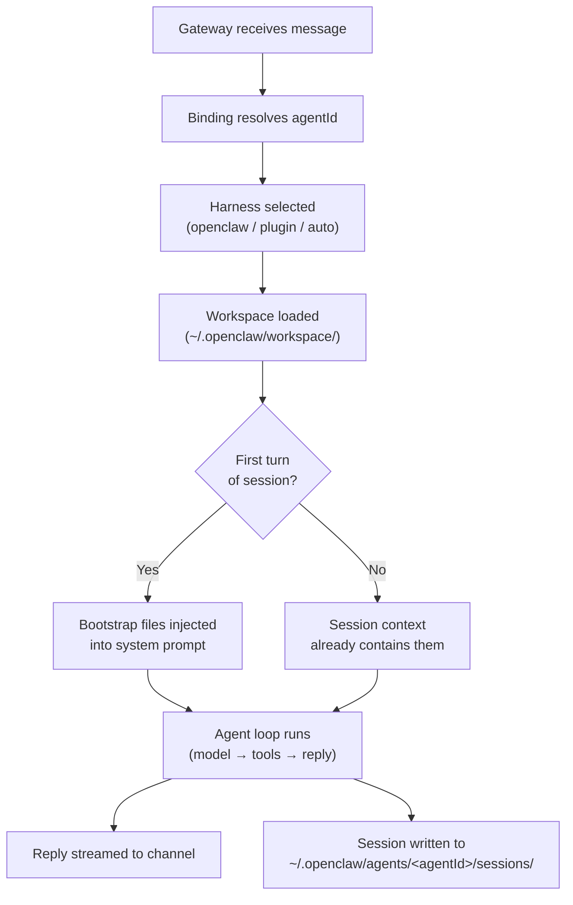

**TL;DR** — In OpenClaw, an "agent" is not a vague AI entity: it is a specific directory on disk, a set of workspace files that shape its behavior and memory, and a runtime identity the Gateway uses to route messages and store sessions. This chapter walks you through every piece — the workspace path, each file's role, how bootstrap files are injected, and the difference between the default embedded harness and a plugin-supplied harness.

# Agents: Workspace, Bootstrap Files, and Harness Types

Before we go any further, let's make "agent" concrete. In OpenClaw an agent is defined by two things: a **workspace directory** — a folder on disk that acts as its home base — and a **runtime identity** that tells the Gateway which harness (the code that actually runs the agent's turns) to use.

Think of it like a desk in an office. The desk belongs to one person; it has labeled folders for different kinds of notes, a name placard, and a set of tools. The person who sits at it might be a full-time employee (the embedded harness) or a contractor using a specialized workflow (a plugin harness). Either way, the desk is what makes the arrangement concrete — not an abstract idea of "a worker."

We saw in [Architecture](../getting-started/02-architecture.md) that the Gateway is the central control plane, and in [Channels](../channels/04-channels.md) that a channel routes an incoming message to a named agent. This chapter explains what that agent actually *is* when the message arrives.

---

## The Workspace: An Agent's Home Directory

Every agent has exactly one working directory — its **workspace**. This directory is the only place tools resolve relative file paths, and it is where all the agent's workspace files live.

The default workspace path is:

```
~/.openclaw/workspace
```

You can override this in `~/.openclaw/openclaw.json`:

```json5
{
  agents: {
    defaults: {
      workspace: "~/.openclaw/workspace",
    },
  },
}
```

If the environment variable `OPENCLAW_PROFILE` is set to something other than `"default"`, the default path shifts to `~/.openclaw/workspace-<profile>`. This lets you run separate workspaces for different profiles without editing config.

> **Important:** The workspace is the *default working directory* for tools — it is not a hard sandbox. A tool that receives a relative path will resolve it inside the workspace, but an absolute path can reach anywhere on the host unless you have explicitly enabled sandboxing via `agents.defaults.sandbox`. See [Security](../operations/20-security.md) for the sandbox configuration.

### What is NOT in the workspace

Not everything that belongs to an agent lives in the workspace. These items live under `~/.openclaw/` and should stay separate:

| Item | Path |
|---|---|
| Gateway config | `~/.openclaw/openclaw.json` |
| Auth profiles (API keys, OAuth) | `~/.openclaw/agents/<agentId>/agent/auth-profiles.json` |
| Session transcripts | `~/.openclaw/agents/<agentId>/sessions/` |
| Managed skills | `~/.openclaw/skills/` |
| Channel/provider credentials | `~/.openclaw/credentials/` |

Keeping these separate matters for backups: the workspace is your agent's *memory and personality*, while `~/.openclaw/` holds its *credentials and runtime state*. You can commit the workspace to a private git repo without risk of leaking session history or API keys.

---

## The Workspace File Map

Let's open those labeled folders on the desk. The workspace contains a defined set of files that OpenClaw reads, injects, and in some cases writes on behalf of the agent. Each file has a distinct role.

```
~/.openclaw/workspace/
├── AGENTS.md         ← operating instructions and memory guidance
├── SOUL.md           ← persona, tone, boundaries
├── USER.md           ← who the user is and how to address them
├── IDENTITY.md       ← the agent's name, vibe, and emoji
├── TOOLS.md          ← local tool notes (not tool policy — only guidance)
├── HEARTBEAT.md      ← short checklist for periodic heartbeat runs
├── BOOTSTRAP.md      ← one-time first-run ritual (deleted after completion)
├── MEMORY.md         ← curated long-term memory (optional)
├── memory/           ← daily memory logs (one .md file per day)
│   └── YYYY-MM-DD.md
└── skills/           ← workspace-specific skills (highest precedence)
```

Let's go through each one.

### `AGENTS.md` — Operating Instructions

This is the rulebook for the agent's behavior. It covers how the agent should handle memory, what it should do on session startup, what topics are off-limits, and how it should behave in group chats versus private conversations. Think of it as the standing orders the agent reads at the start of every working day.

From the template:

```markdown
## Red Lines

- Don't exfiltrate private data. Ever.
- Don't run destructive commands without asking.
- trash > rm (recoverable beats gone forever)
- When in doubt, ask.
```

`AGENTS.md` also describes the memory workflow — when to write to `MEMORY.md` versus `memory/YYYY-MM-DD.md`, and how to decide what's worth keeping.

### `SOUL.md` — Persona and Tone

`SOUL.md` is where the agent's *voice* lives. It controls how conversations *feel*: formal or casual, blunt or careful, concise or thorough. As the source puts it: "If your agent sounds bland, hedgy, or weirdly corporate, this is usually the file to fix."

The key distinction: `AGENTS.md` holds *operating rules* (what to do); `SOUL.md` holds *voice and style* (how to do it). Don't mix them. A `SOUL.md` that reads like an HR policy manual will produce an agent that feels like one.

From the template:

```markdown
Be the assistant you'd actually want to talk to.
Concise when needed, thorough when it matters.
Not a corporate drone. Not a sycophant. Just... good.
```

Short beats long. Sharp beats vague. The source is explicit on this.

### `USER.md` — Who the User Is

`USER.md` holds a profile of the person the agent is primarily helping: their name, preferred address, timezone, and notes about what they care about. The agent can update this file over time as it learns more about the user.

From the template:

```markdown
# USER.md - About Your Human

- Name:
- What to call them:
- Pronouns: (optional)
- Timezone:
- Notes:
```

This file is always loaded on session start — so the agent knows who it is talking to before the first message arrives.

### `IDENTITY.md` — Name, Vibe, and Emoji

`IDENTITY.md` holds the agent's own identity: its name, the kind of creature or entity it considers itself, its default vibe, and a signature emoji. This is typically filled in during the first-run bootstrap ritual.

From the template:

```markdown
- Name: (pick something you like)
- Creature: (AI? robot? familiar? ghost in the machine? something weirder?)
- Vibe: (how do you come across? sharp? warm? chaotic? calm?)
- Emoji: (your signature — pick one that feels right)
- Avatar: (workspace-relative path, http(s) URL, or data URI)
```

### `TOOLS.md` — Local Tool Notes

`TOOLS.md` is for *your* setup-specific notes about tools and conventions — things like SSH host aliases, camera names, preferred TTS voices, or device nicknames. It does *not* control which tools are available to the agent; that is governed by tool policy (see [Tool System](../extending/12-tool-system.md)). Think of it as the agent's personal cheat sheet.

```markdown
### SSH
- home-server → 192.168.1.100, user: admin

### TTS
- Preferred voice: "Nova" (warm, slightly British)
```

### `HEARTBEAT.md` — Periodic Checklist

`HEARTBEAT.md` holds a short checklist that the agent acts on during **heartbeat runs** — periodic wakes triggered by the runtime when no user message has arrived. Keep this file short; it is read every time a heartbeat fires, and a long file burns tokens on every tick.

From the source: "Keep the file empty, or with only Markdown comments and headings, when you want OpenClaw to skip heartbeat model calls." An empty (or comment-only) file skips the heartbeat call entirely.

We'll cover the heartbeat mechanism in detail in [Automation](../automation/17-automation.md).

### `BOOTSTRAP.md` — First-Run Ritual

`BOOTSTRAP.md` is a one-time file. It is only created for a **brand-new workspace** — one where no other bootstrap files exist yet. Its purpose is to guide the agent through an initial conversation to establish its identity: name, vibe, emoji, and user profile.

From the template:

```markdown
Start with something like:
> "Hey. I just came online. Who am I? Who are you?"

Then figure out together:
1. Your name
2. Your nature
3. Your vibe
4. Your emoji
```

After the ritual is complete, the agent deletes `BOOTSTRAP.md`. The source is clear: "Delete this file. You don't need a bootstrap script anymore — you're you now." Once deleted, OpenClaw will not recreate it on later restarts — it treats the deletion as confirmation that the workspace has been initialized.

There is one safety mechanism: after a workspace has been observed, OpenClaw keeps an internal attestation marker for its path. If the workspace later disappears or is wiped, startup refuses to silently re-seed `BOOTSTRAP.md`. You must either restore the workspace or perform a full onboard reset so both the workspace and the marker are cleared together.

To skip `BOOTSTRAP.md` creation entirely (for workspaces you manage yourself):

```json5
{ agents: { defaults: { skipBootstrap: true } } }
```

### `MEMORY.md` — Curated Long-Term Memory

`MEMORY.md` holds durable facts, preferences, decisions, and summaries — the distilled essence of what the agent has learned over time. It is the *curated* memory, distinct from the raw daily logs in `memory/YYYY-MM-DD.md`.

One important rule from the source: load `MEMORY.md` only in the `main` session (your private direct-message conversation), never in shared or group contexts. The reason is security: `MEMORY.md` contains personal context that should not leak to other participants in a group chat.

We'll keep this description light here. The full memory system — including the `memory-core` plugin, the dreaming subagent, and vector-backed plugins — is covered in [Memory System](../memory/10-memory-system.md).

### `memory/` — Daily Memory Logs

The `memory/` subdirectory holds one Markdown file per day, named `memory/YYYY-MM-DD.md`. These are raw running logs of what happened during that day's sessions. The `memory-core` plugin's dreaming subagent consolidates these periodically into `MEMORY.md`.

### `skills/` — Workspace-Specific Skills

The `skills/` subdirectory holds **skills** that are specific to this workspace. A skill — introduced briefly here and covered fully in [Skills](../extending/13-skills.md) — is a `SKILL.md` instruction pack that gets injected into the system prompt, shaping how the agent behaves without adding new callable tools.

The workspace `skills/` directory has the highest precedence of all skill locations. If a skill here has the same name as one in any other location, the workspace version wins.

---

## Bootstrap File Injection

Now we know what the files are. The next question is: when does the agent see them?

OpenClaw injects the contents of the bootstrap files into the **system prompt's Project Context section** at the **first turn of each new session**. This is the analogy of handing an employee their onboarding packet on day one — but not handing it to them again every morning after that. The packet is there when they arrive; it shapes how they work; but they don't need it re-read to them on subsequent days.

On every new session's first turn, OpenClaw injects (in order):

- `AGENTS.md`
- `SOUL.md`
- `TOOLS.md`
- `BOOTSTRAP.md` (if present)
- `IDENTITY.md`
- `USER.md`

A few rules govern injection:

| Condition | Behavior |
|---|---|
| File is blank | Skipped entirely |
| File is large | Trimmed and truncated; a marker is added ("read the file for full content") |
| File is missing | OpenClaw injects a single "missing file" marker line and continues |

You can tune the truncation limits:
- `agents.defaults.bootstrapMaxChars` — max characters per file (default: 20000)
- `agents.defaults.bootstrapTotalMaxChars` — total max across all files (default: 60000)

After the first turn of a session, the bootstrap files are no longer injected on subsequent turns — the session already has their contents in context. Only if you start a new session (or a new day's reset kicks in) will they be injected again.

The full picture of how `buildAgentSystemPrompt` assembles the system prompt from these injected files, alongside other sections, is covered in [System Prompt and Context](./09-system-prompt.md).

---

## Harness Types: What Actually Runs the Agent

We've described the workspace — the desk and its folders. Now let's talk about the *person sitting at the desk*: the **harness**.

A **harness** is the runtime implementation that executes an agent's turns. It is the code that takes an incoming prompt, runs the model inference, executes tool calls, and streams the reply back. OpenClaw supports two kinds:

### The Embedded Harness (default)

The **embedded harness** is OpenClaw's built-in agent runtime. Its code lives at `src/agents/embedded-agent-runner/`. When you install OpenClaw and run it, this is what runs your agent — there is nothing extra to configure.

The embedded harness owns:
- Model discovery and provider wiring
- Tool policy enforcement and tool execution
- System prompt assembly (including bootstrap file injection)
- Session persistence and management
- Channel delivery

The default runtime id for the embedded harness is `openclaw`. You don't need to set this — it is the default.

### Plugin Harnesses (optional)

Plugin harnesses are alternative runtime implementations that a plugin can register. A plugin harness gets its own runtime id (e.g., `codex`) and can provide a completely different execution model for an agent's turns.

### The `auto` Runtime: Picking a Harness Automatically

The special value `auto` for a runtime id tells OpenClaw to look for a plugin harness that supports the agent and use it if one exists. If no plugin harness is installed, `auto` falls back to the built-in `openclaw` embedded harness.

From the source: "Plugin harnesses can register additional runtime ids. `auto` selects a supporting plugin harness when one exists and otherwise uses the built-in OpenClaw runtime."

In practice, this means:

```
runtime id = "openclaw"  →  always uses the embedded harness
runtime id = "auto"      →  uses a plugin harness if installed, else embedded
runtime id = "codex"     →  uses the codex plugin harness (must be installed)
```

Most deployments use the embedded harness. The `auto` value is useful when you want your configuration to transparently switch to a plugin harness if one gets installed later.

---

## The Agent's Runtime Identity

Beyond the workspace and harness, each agent has a **runtime identity** — an `agentId` that the Gateway uses to:

1. Route channel messages to the correct agent (via bindings — see [Multi-Agent Coordination](../coordination/16-multi-agent.md))
2. Store session transcripts in the correct per-agent path (`~/.openclaw/agents/<agentId>/sessions/`)
3. Store per-agent SQLite state (`~/.openclaw/agents/<agentId>/agent/openclaw-agent.sqlite`)

Session transcripts are stored as JSONL files at:

```
~/.openclaw/agents/<agentId>/sessions/<SessionId>.jsonl
```

Each session has a stable ID chosen by OpenClaw, and the sessions directory holds both the transcript files and an index file (`sessions.json`) that tracks metadata for each session. We cover session routing, lifecycle, and the `dmScope` options in [Sessions](./07-sessions.md).

---

## Workspace Diagram

Let's put the whole picture together before moving on:



The agent loop itself — what happens inside that "model → tools → reply" box — is the subject of the next chapter.

---

## Setting Up a Workspace

If you are starting from scratch, `openclaw onboard`, `openclaw configure`, or `openclaw setup` will create the workspace directory and seed the bootstrap files if they are missing. Running `openclaw setup` again on an existing workspace recreates any missing files without overwriting existing ones.

```bash
# Create workspace and seed missing bootstrap files
openclaw setup

# Or during initial onboarding
openclaw onboard --install-daemon
```

`openclaw doctor` warns when it detects extra workspace directories (e.g., an older `~/openclaw` folder left from a previous install). Keeping multiple workspaces around can cause confusing auth or state drift since only one workspace is active at a time.

---

## Summary: The Agent at a Glance

| Concept | What it is | Where it lives |
|---|---|---|
| Workspace | The agent's working directory | `~/.openclaw/workspace` (configurable) |
| `AGENTS.md` | Operating instructions | Workspace root |
| `SOUL.md` | Persona and voice | Workspace root |
| `USER.md` | User profile | Workspace root |
| `IDENTITY.md` | Agent's own name and vibe | Workspace root |
| `TOOLS.md` | Setup-specific tool notes | Workspace root |
| `HEARTBEAT.md` | Periodic checklist | Workspace root |
| `BOOTSTRAP.md` | One-time first-run ritual | Workspace root (deleted after use) |
| `MEMORY.md` | Curated long-term memory | Workspace root |
| `memory/` | Daily raw memory logs | Workspace subdirectory |
| `skills/` | Workspace-specific skills | Workspace subdirectory |
| Sessions | JSONL conversation transcripts | `~/.openclaw/agents/<agentId>/sessions/` |
| Embedded harness | Built-in agent executor | Runtime id `openclaw` |
| Plugin harness | Alternative executor from a plugin | Runtime id varies |

---

← Previous: [Channels: Message Surfaces, Session Grammar, and DM Pairing](../channels/04-channels.md) · Next: [The Agent Loop: Six Stages from Intake to Persistence](./06-agent-loop.md) →
