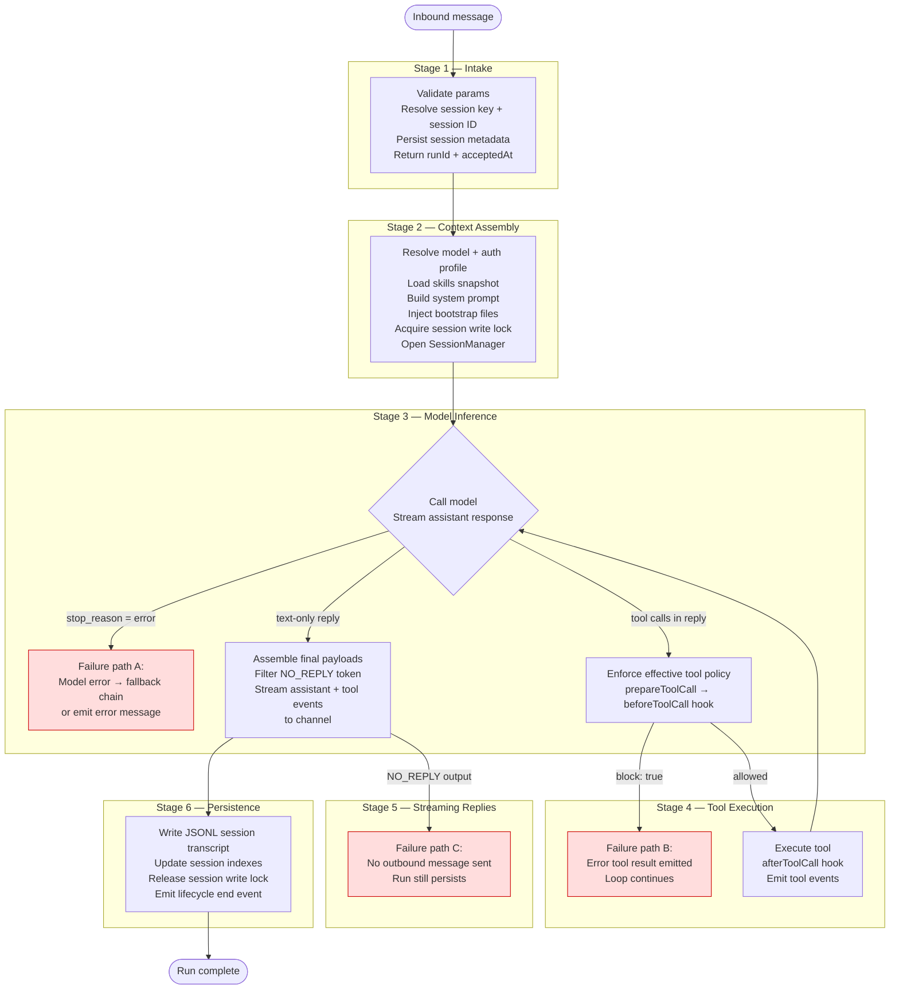

**TL;DR** — Every message an OpenClaw agent receives passes through six ordered stages: intake, context assembly, model inference, tool execution, streaming replies, and persistence. The RPC that starts a run returns a `{runId, acceptedAt}` immediately — the actual work happens asynchronously. This chapter maps those six stages, explains why the async model exists, documents all three failure paths (model inference error, `before_tool_call` block, and `NO_REPLY` output), and covers run timeout and the model idle watchdog.

# The Agent Loop: Six Stages from Intake to Persistence

Think of the agent loop as a production line. A message arrives at one end. By the time it leaves the other end, it has been validated, assembled into a full context, handed to a language model, had tool calls executed, streamed back as a reply, and written durably to disk. Nothing happens out of order, and nothing is skipped.

Every chapter from here onward in this library elaborates one or more of these stages. This chapter is your map; the subsequent chapters are the territory.

## Prerequisites

**Architecture (P2):** OpenClaw has four layers — Provider, Model, Agent runtime, and Channel. The agent runtime layer is where the loop lives. If this is unfamiliar, read [High-Level Architecture](../getting-started/02-architecture.md) first.

**Agents (P5):** An agent is a named workspace directory (`~/.openclaw/agents/<agentId>/`) plus a runtime identity. It has its own session store, bootstrap files, and configuration. If you have not yet seen what makes an agent concrete, read [Agents: Workspace, Bootstrap Files, and Harness Types](./05-agents.md) first.

---

## The six stages at a glance

Here is the full flow as a diagram. We will walk through each box below.



The three red boxes are the failure paths. We will return to each in detail after walking through the six stages.

---

## Stage 1 — Intake

### Why the RPC returns before the work begins

When an external client (a channel plugin, a subagent caller, or a direct RPC call) starts an agent run, it calls the `agent` Gateway RPC. Here is the key behavior to understand: **the RPC returns immediately, before the model is ever called**.

The response looks like this:

```json
{
  "runId": "some-unique-id",
  "sessionKey": "main",
  "status": "accepted",
  "acceptedAt": 1749556800000
}
```

- **`runId`** — a unique string that identifies this run. Clients use it to track a specific execution, correlate stream events, or call `agent.wait` to block until the run finishes.
- **`acceptedAt`** — the Unix timestamp (milliseconds) at the moment the Gateway accepted the request.

Why return immediately? Because an agent run can take tens of seconds or many minutes — it may call multiple tools, trigger subagent runs, or work through a long chain of model calls. If the RPC held the HTTP or WebSocket connection open until the model finished, any network timeout would abort the entire run. The async model decouples "I received your request" from "I finished your request."

Think of it like ordering food at a counter: the cashier gives you a ticket number right away and tells you the order is accepted. You can sit down. When the food is ready, you are called. The ticket number is your `runId`.

During intake, the Gateway also:
- Validates the incoming parameters.
- Resolves the session key and session ID (these determine which session this turn belongs to — covered in [Sessions](./07-sessions.md)).
- Persists session metadata to the session store.
- Registers a deduplication entry so that a retry with the same request does not spawn a second run.

After the `accepted` response is flushed back to the client, the actual agent work begins in the background — scheduled for the next event-loop turn.

---

## Stage 2 — Context assembly

Now the work begins. The function responsible for orchestrating the run is `agentCommand` (in `src/agents/agent-command.ts`), which in turn calls `runEmbeddedAgent` to interact with the agent runtime. These are layered call stages, not parallel concepts: `agentCommand` is the entry and dispatch point that receives the inbound request and resolves configuration, `runEmbeddedAgent` sets up the run context (model, session, tools), and `agentLoop` (called inside `runEmbeddedAgent`) is the iterative loop that drives model calls and tool execution until the run completes.

Context assembly has several jobs, all of which must finish before the model is called:

| Job | What it does |
|---|---|
| Resolve model + auth profile | Picks the provider/model to use for this run; loads the matching API key or credential |
| Load skills snapshot | Reads the active skill set (or reuses a cached snapshot) and prepares it for injection |
| Build system prompt | Assembles the full system prompt from OpenClaw's base prompt, skills, bootstrap context, and per-run overrides |
| Inject bootstrap files | On the **first turn of each session**, appends the agent's workspace files (`AGENTS.md`, `SOUL.md` (the agent's persona and voice), `USER.md` (facts about the user and operator), etc.) to the context — see [System Prompt and Context](./09-system-prompt.md) for what each bootstrap file holds |
| Acquire session write lock | Takes a file-based lock on the session JSONL file before any transcript mutation — this lock is non-reentrant by default |
| Open SessionManager | Opens the session transcript and prepares it for reading and writing during the run |

The session write lock deserves a moment of explanation. Any code that writes to the session transcript — including transcript rewrites, compaction, and truncation — must acquire the same lock. Writers that come from a separate process also contend on this file-based lock. If the lock cannot be acquired within `session.writeLock.acquireTimeoutMs` (default: 60 000 ms), the session is reported as busy. This prevents two simultaneous processes from corrupting the same session file.

Bootstrap file injection only happens on the first turn of a session. From the second turn onward, the bootstrap files are already part of the transcript, so injecting them again would be redundant and expensive. Think of it like an employee orientation packet: you hand it out on the first day, not before every meeting. The detail of what lives in those files belongs to [System Prompt and Context](../agents/09-system-prompt.md).

---

## Stage 3 — Model inference

With context assembled, `runEmbeddedAgent` (via the `agentLoop` function in `packages/agent-core/src/agent-loop.ts`) makes the call to the language model. This is where the model receives the system prompt, the full conversation transcript, and the list of available tools.

The model streams its response back. The loop processes a sequence of typed events:

```ts
// Simplified view of the streaming event types (from agent-loop.ts)
// "start"        — a partial AssistantMessage is placed in context
// "text_delta"   — a text chunk arrives; the partial message is updated
// "toolcall_*"   — a tool call block is forming in the response
// "done" / "error" — the stream ends; the final AssistantMessage is resolved
```

As each event arrives, the loop emits a corresponding `AgentEvent` (defined in `packages/agent-core/src/types.ts`):

| Event type | When it fires |
|---|---|
| `message_start` | When the assistant message (or a tool result) begins |
| `message_update` | On each streaming delta for an assistant message |
| `message_end` | When the message is complete |
| `turn_start` / `turn_end` | Around each full model request + tool batch |
| `agent_start` / `agent_end` | At the very start and very end of the run |
| `tool_execution_start` / `tool_execution_end` | Around each tool call |

These events fan out to three named streams that subscribers can follow:
- **`lifecycle`** — `phase: "start" | "end" | "error"` events
- **`assistant`** — streamed text and thinking deltas
- **`tool`** — tool call start, update, and end events

The model's response ends with a `stopReason`. If `stopReason` is `"tool_calls"`, the loop moves to Stage 4. If it is `"end_turn"` or similar, the loop moves toward Stage 5.

---

## Stage 4 — Tool execution

When the model's response contains tool calls, the loop executes them. Let's look at what happens step by step.

First, the loop checks whether any tool in the batch must run sequentially (each tool can declare `executionMode: "sequential"` or `"parallel"` via its `AgentTool` definition — `AgentTool` is the runtime descriptor that tells the loop a tool's name, input schema, and handler function; see [Tool System](../extending/12-tool-system.md) for how tools are registered). By default, tools run in parallel — preparations happen in serial, then allowed tools execute concurrently.

For each tool call, the loop calls `prepareToolCall`:

1. Look up the tool by name in `context.tools`.
2. Validate the arguments against the tool's parameter schema.
3. Call `config.beforeToolCall` — this is where the `before_tool_call` plugin hook fires.

If `beforeToolCall` returns `{ block: true }`, the tool is not executed. Instead, an error `ToolResultMessage` is emitted with the reason string (or a default "Tool execution was blocked" message). The loop does **not** abort — it continues treating this like any other tool result and feeds it back to the model.

If the tool is allowed, `executePreparedToolCall` calls `tool.execute(...)`. Partial results can be streamed via an `onUpdate` callback. When the tool finishes, `afterToolCall` fires, giving plugins a chance to rewrite the result content, error flag, or `terminate` hint.

A `terminate: true` hint on every result in a batch causes the loop to stop after that batch without making another model call — useful for tools that signal they have completed the task.

After all tools in the batch execute, the tool results are appended to the context and the loop makes another model call (back to Stage 3), continuing until the model produces a reply with no tool calls.

**Tool policy enforcement note:** The effective tool policy (which tools the model is allowed to see at all) is resolved before the model call in Stage 3, not inside Stage 4. By the time Stage 4 runs, the model has already requested a specific tool by name. Stage 4's `prepareToolCall` handles the case where a tool is requested but not found — it emits an error result with "Tool `<name>` not found". See [Tool System](../extending/12-tool-system.md) for how effective tool policy is built.

---

## Stage 5 — Streaming replies

Once the model produces a text reply with no further tool calls, the loop assembles the final outbound payloads. This involves:

- Collecting the assistant text (and optional reasoning/thinking text).
- Including inline tool summaries when verbose mode is active and policy allows it.
- Falling back to an error message if the model errored and no messaging tool already sent a user-visible reply.

### The NO_REPLY token

There is one special behavior to know here. If the model's reply — after all the above — consists only of the exact string `NO_REPLY` (or `no_reply`, case-insensitive), the loop **filters it out** and sends nothing to the channel. No outbound message is sent.

This is intentional behavior used in specific situations. For example: when a subagent run's parent has already sent a final reply before the child's completion event arrived, the child is instructed to reply only with `NO_REPLY` so it does not send a duplicate message to the user. The session is still persisted normally — `NO_REPLY` silences the outbound channel delivery, not the session record.

```
NO_REPLY filtering:
  model output: "NO_REPLY"
  → filtered from outgoing payloads
  → no message sent to the channel
  → run proceeds to Stage 6 (persistence) normally
```

If no renderable payloads remain after filtering, and a tool errored during the run, a fallback tool error reply is emitted — unless a messaging tool already sent a user-visible reply.

---

## Stage 6 — Persistence

With the reply sent, the loop closes out the run:

- **Session transcript write:** All messages produced during this run — the user's inbound message, the assistant's replies, tool call records, and tool result records — are written to the session JSONL file at `~/.openclaw/agents/<agentId>/sessions/<SessionId>.jsonl`. Each entry in this file is a `parentId`-linked transcript entry.
- **Index update:** The session index (a `sessions.json` file tracking `sessionStartedAt`, `lastInteractionAt`, `updatedAt`) is updated.
- **Write lock release:** The session write lock acquired in Stage 2 is released.
- **Lifecycle event:** A `lifecycle end` event (or `lifecycle error`) is emitted on the lifecycle stream. Any client that called `agent.wait` — which blocks until it sees this event — is now unblocked.

The JSONL file is the durable record of the conversation. The session index is a lightweight lookup table. For the full picture of what lives in these files and how they relate to the SQLite stores, see [Sessions](./07-sessions.md) and [Storage and Persistence](../operations/19-storage.md).

---

## The three failure paths

The diagram above marked three failure paths in red. Here they are in detail.

### Failure path A — Model inference error with fallback chain

When the model call fails — provider network error, authentication failure, rate limit, or similar — the loop checks whether a fallback chain is configured (`agents.defaults.model.fallbacks`). If one is configured, `runWithModelFallback` retries the run using the next model in the chain.

If the fallback chain is exhausted, or no fallback is configured, the loop produces an `AssistantMessage` with `stopReason: "error"` and an `errorMessage` string. This message is still emitted through the normal event sequence (`message_start`, `message_end`, `turn_end`, `agent_end`) so clients see a structured error rather than a silent hang. The session is persisted with this error message as part of the transcript.

```ts
// Simplified view of the failure message shape (from agent-loop.ts)
{
  role: "assistant",
  content: [{ type: "text", text: "" }],
  stopReason: "error",       // or "aborted" if cancelled
  errorMessage: "<reason>",
  ...
}
```

### Failure path B — `before_tool_call` hook blocks the call

When `config.beforeToolCall` returns `{ block: true }`, the loop does **not** throw or abort. Instead:

1. An error `ToolResultMessage` is constructed with the blocking reason as its text content.
2. The tool execution events (`tool_execution_end` with `isError: true`) are emitted.
3. The error result is fed back to the model as if the tool had run and returned an error.
4. The model sees the blocked result and decides what to do next — it may retry a different tool, ask the user for clarification, or conclude its work.

This is by design: a blocked tool is a controlled outcome, not a crash. The agent loop continues cleanly.

### Failure path C — NO_REPLY output

Covered above in Stage 5. The loop produces no outbound channel message. Persistence (Stage 6) still runs normally. The client still receives a `lifecycle end` event.

---

## Timeouts and the model idle watchdog

Two separate timeout mechanisms protect against stuck runs.

### Run timeout — `agents.defaults.timeoutSeconds`

This is the maximum total wall-clock time for a single agent run. The default is **172 800 seconds (48 hours)**, confirmed in `src/agents/timeout.ts`:

```ts
const DEFAULT_AGENT_TIMEOUT_SECONDS = 48 * 60 * 60;  // 172 800 s
```

You can override this via the `agents.defaults.timeoutSeconds` configuration field, or per-request via a `timeout` parameter on the `agent` RPC. Setting it to `0` disables the per-run timeout (the value is treated as "no timeout"). When the deadline is exceeded, the run is aborted via an `AbortSignal`, producing an `AssistantMessage` with `stopReason: "aborted"`.

Note: `agent.wait` has its own default wait timeout of **30 seconds**. This timeout only affects how long the *caller waits for the result* — it does not stop the underlying agent run. The agent continues running; the caller merely gets a timeout response from the wait call.

### Model idle watchdog — capped at 120 s by default

The idle watchdog aborts a model request when **no response chunks arrive** within an idle window. This catches situations where the model provider accepts the request but stops streaming mid-response.

The watchdog's duration comes from `models.providers.<id>.timeoutSeconds`. When that is not set, the watchdog defaults to the agent run timeout, but is **capped at 120 seconds**. In other words: if you have not set a provider-specific timeout, and you have not lowered `agents.defaults.timeoutSeconds` below 120 seconds, the idle watchdog will fire after 120 seconds of silence from the model.

For slow local or self-hosted providers (such as Ollama on modest hardware), set `models.providers.<id>.timeoutSeconds` to a higher value before the model starts producing tokens. The agent runtime timeout must be at least as high as any model request you want to allow to run longer.

Cron-triggered runs with no explicit model or agent timeout **disable the idle watchdog** and rely on the cron outer timeout instead.

| Timeout | Default | Config key | What it guards |
|---|---|---|---|
| Agent run timeout | 172 800 s (48 h) | `agents.defaults.timeoutSeconds` | Total wall clock for the whole run |
| `agent.wait` timeout | 30 s | `timeoutMs` param on `agent.wait` | How long the caller blocks waiting for a result |
| Model idle watchdog | 120 s (cap) | `models.providers.<id>.timeoutSeconds` | Silence from the model while streaming |

---

## Where a run can end early

Besides the three failure paths above, a run can also end early from:

| Cause | Effect |
|---|---|
| Agent timeout (`agents.defaults.timeoutSeconds` exceeded) | `stopReason: "aborted"` |
| `AbortSignal` cancelled (e.g. `/stop` command) | `stopReason: "aborted"` |
| Gateway disconnect or RPC timeout | Run may continue if the gateway is still alive; client loses the stream |
| `agent.wait` timeout | The caller's wait expires; the run itself continues unaffected |

---

## How the loop relates to the rest of the library

Each stage in this loop is a whole chapter in its own right:

- **Stage 2 (context assembly)** → [Sessions](./07-sessions.md), [System Prompt and Context](../agents/09-system-prompt.md)
- **Stage 2 (queue and serialization)** → [Run Queue and Concurrency](./08-run-queue.md)
- **Stage 4 (tool execution and policy)** → [Tool System](../extending/12-tool-system.md), [Agent Loop Hooks](../extending/14-hooks.md)
- **Stage 6 (persistence)** → [Sessions](./07-sessions.md), [Storage and Persistence](../operations/19-storage.md)

The queue mechanics that govern how multiple inbound messages contend for the session lane belong to [Run Queue and Concurrency](./08-run-queue.md). The specifics of effective tool policy — which tools the model can see in Stage 3 — belong to [Tool System](../extending/12-tool-system.md). This chapter covers the skeleton; those chapters fill in the muscle.

---

← Previous: [Agents: Workspace, Bootstrap Files, and Harness Types](./05-agents.md) · Next: [Sessions: Routing, Lifecycle, dmScope, and JSONL Persistence](./07-sessions.md) →
