**TL;DR** — A *session* in OpenClaw is the conversation bucket that accumulates your chat history. Every inbound message is routed to a session based on where it came from (a DM, a group chat, a cron job, etc.). This chapter explains that routing logic, the four `dmScope` options for DM isolation, how sessions expire and reset, and exactly how history is stored on disk as JSONL transcripts with a JSON index file. By the end you'll be able to choose the right session scope for your setup and read the on-disk files directly.

# Sessions: Routing, Lifecycle, dmScope, and JSONL Persistence

Before we can understand how an agent remembers your conversation, we need to understand how OpenClaw decides *which* conversation bucket a message belongs to. That bucket is the session — and its shape determines what history the model sees when it replies.

We built the agent loop in [the previous chapter](./06-agent-loop.md): the six stages from intake through persistence. The *persistence* stage at the end of each turn writes into the session. This chapter is the detailed map of what gets written, where, and for how long.

---

## What a session is

A **session** is an append-only record of one conversation thread — the messages, tool calls, and tool results that a specific conversation has produced so far. Think of it like a transcript notebook: every time something happens (user sends a message, the model replies, a tool is called) a new line is added to the notebook. The model reads from this notebook at the start of every turn to understand the context it is working in.

Two identifiers govern a session:

- **`sessionKey`** — the stable *routing* key that identifies which conversation bucket you are in. It is derived from where the message came from (e.g. which channel, which peer). Multiple turns in the same conversation all share the same `sessionKey`.
- **`sessionId`** — the identifier for the *current transcript file* within that bucket. When the session resets (daily, idle, or manually), the `sessionKey` stays the same but a new `sessionId` is created, pointing to a fresh JSONL file.

You can think of `sessionKey` as the folder label ("Alice's DM with the main agent") and `sessionId` as the notebook currently inside that folder. A reset is like putting the old notebook in a drawer and starting a fresh one — the folder label does not change.

---

## How messages are routed to sessions

The first question OpenClaw answers for every inbound message is: *which session bucket does this belong to?* The rules depend on where the message came from.

| Source | Session behaviour |
|---|---|
| Direct messages (DMs) | Shared single session by default (`main`); configurable via `dmScope` |
| Group chats | Isolated per group |
| Rooms / channels (Discord, Slack) | Isolated per room or channel |
| Cron jobs | Fresh isolated session per run |
| Webhooks | Isolated per hook UUID |

Group, room, cron, and webhook sessions are always isolated from each other and from DM sessions. The only place where you have a choice is DMs, governed by the `dmScope` setting discussed below.

### Session key shapes

These session types produce `sessionKey` strings in the following patterns (verified from `src/sessions/session-key-utils.ts` and `docs/reference/session-management-compaction.md`):

| Session type | Key shape |
|---|---|
| Main DM (default) | `agent:<agentId>:main` |
| Group chat | `agent:<agentId>:<channel>:group:<id>` |
| Room / channel | `agent:<agentId>:<channel>:channel:<id>` or `...:room:<id>` |
| Cron run | `cron:<job.id>` (agent-scoped variant: `agent:<agentId>:cron:<jobId>`) |
| Webhook | `hook:<uuid>` |

The `classifySessionKind()` function in `src/sessions/classify-session-kind.ts` determines what kind of session a key represents. The evaluation order is: sentinel keys ("global", "unknown") first, then cron key shape, then spawn-child, then group/channel `chatType`, then fallback to "direct".

```ts
// Simplified view of classifySessionKind() — from src/sessions/classify-session-kind.ts
export type SessionKind = "cron" | "direct" | "group" | "global" | "spawn-child" | "unknown";

function classifySessionKind(
  key: string,
  entry?: { chatType?: string | null; spawnedBy?: string | null },
): SessionKind {
  if (key === "global")  return "global";
  if (key === "unknown") return "unknown";
  if (isCronSessionKey(key)) return "cron";
  if (entry?.spawnedBy)  return "spawn-child";
  if (entry?.chatType === "group" || entry?.chatType === "channel") return "group";
  if (key.includes(":group:") || key.includes(":channel:")) return "group";
  return "direct";
}
```

Notice the evaluation order matters: cron and spawn-child are detected before the key-shape check, so an ACP subagent session with an opaque key is never misclassified as a direct session.

---

## The DM isolation problem

Now we hit a real problem. By default, all DMs share one session. That is convenient when a single person owns the agent — the whole conversation accumulates in one place. But as soon as two people can message your agent, the default becomes a privacy hazard: Alice's questions and the agent's answers would be visible to Bob, and vice versa.

The fix is to configure `dmScope` so each person — or each channel+person combination — gets their own session bucket.

### The four `dmScope` options

```json5
// ~/.openclaw/openclaw.json
{
  session: {
    dmScope: "per-channel-peer",
  },
}
```

| `dmScope` value | Isolation rule | When to use |
|---|---|---|
| `main` | All DMs share one session (the default) | Single-owner personal setups where only you message the agent |
| `per-peer` | Isolated by sender identity across all channels | Multiple users, but the same user should share history even if they contact the agent from Telegram AND Discord |
| `per-channel-peer` | Isolated by channel + sender (recommended for most multi-user setups) | Multiple users each confined to their own channel+identity pair |
| `per-account-channel-peer` | Isolated by account + channel + sender (most granular) | Setups where you run multiple channel accounts on the same platform and each account+channel+peer triple needs its own history |

**When `per-channel-peer` beats `main`:** Suppose you have both a personal Telegram account and a work Telegram account messaging your agent. Under `main`, every DM lands in the same session — your work questions and personal questions pile on top of each other, and all of that history is visible in every reply. Under `per-channel-peer`, each combination of (channel=telegram, peer=<your-id>) gets its own bucket, so work and personal histories stay separate.

**Identity linking:** If the same person contacts you from multiple channels and you want them to share *one* session across those channels, `session.identityLinks` can link their identities so the `per-peer` or `per-channel-peer` scopes converge on a single bucket. The configuration details are outside this chapter's scope.

---

## Session lifecycle

Once a session exists, OpenClaw needs to know when to retire it and start a fresh one. There are three triggers.

```mermaid
stateDiagram-v2
    [*] --> Active : first message arrives;\nsessionId created
    Active --> Active : normal turns\n(history accumulates)
    Active --> DailyReset : 4:00 AM local time\non gateway host\n(next message triggers rollover)
    Active --> IdleReset : idleMinutes of inactivity\nexceeded\n(next message triggers rollover)
    Active --> ManualReset : user types /new or /reset
    DailyReset --> Active : new sessionId created;\nold transcript archived
    IdleReset --> Active : new sessionId created;\nold transcript archived
    ManualReset --> Active : new sessionId created;\nold transcript archived
    Active --> [*] : session pruned by\nmaintenance
```



### Daily reset

By default, OpenClaw creates a new `sessionId` at 4:00 AM local time on the Gateway host. Freshness is measured from `sessionStartedAt` — the timestamp recorded when the current `sessionId` began — not from the last write to the session store.

This means: if you had a conversation yesterday afternoon and the Gateway clock crosses 4:00 AM, the *next message you send* starts a fresh transcript. The old one is not deleted; it is archived as a `.reset.<timestamp>.jsonl` file alongside the active transcript (see [Where history lives](#where-history-lives) below).

**Sessions with an active provider-owned CLI session are not cut by the daily default.** If you are running a CLI-backed agent session that must survive across midnight, the daily reset does not interrupt it — but you can still force a reset via `/reset` or configure `session.reset` explicitly.

### Idle reset

The idle reset fires when a message arrives and the gap since the last real user or channel interaction exceeds the configured threshold:

```json5
{
  session: {
    reset: {
      idleMinutes: 60,
    },
  },
}
```

Freshness here is measured from `lastInteractionAt` — the timestamp of the last user or channel interaction. Heartbeat, cron, and `exec` system events may touch the session row but they **do not extend** `lastInteractionAt`. So a cron job that pings the session every 30 minutes does not prevent an idle reset from firing after `idleMinutes` of real user silence.

When both daily and idle resets are configured, whichever expires first wins.

### Manual reset: `/new` and `/reset`

At any time, a user can type `/new` or `/reset` in chat to start a fresh session immediately. `/new <model>` also switches the active model for the new session.

**What happens at reset time:** When a reset rolls the session, any queued system-event notices for the old session (pending heartbeat updates, background notifications) are discarded. This prevents stale background updates from being prepended to the first message in the fresh session.

### Failure path: stale peer-keyed DM rows

If you previously used DM isolation (e.g. `per-channel-peer`) and later switched back to `main`, the session store will have old peer-keyed rows that are now orphaned. You can preview them with:

```bash
openclaw sessions cleanup --dry-run --fix-dm-scope
```

Applying the same flag (without `--dry-run`) retires those old rows and keeps their transcripts as deleted archives.

---

## Where history lives

The Gateway owns all session state. If you are running OpenClaw in remote mode, the session files are on the remote host — checking your local machine will not reflect what the Gateway is using.

There are two persistence layers:

### The session index: `sessions.json`

```
~/.openclaw/agents/<agentId>/sessions/sessions.json
```

This is a key/value map from `sessionKey` → `SessionEntry`. It is small, mutable, and safe to edit (or delete individual entries). Think of it as a card-catalogue for your sessions — a lightweight index that tells OpenClaw which transcript file is currently active for each conversation bucket, plus metadata.

Key fields in each `SessionEntry` (from `src/config/sessions.ts` and S20):

| Field | Purpose |
|---|---|
| `sessionId` | The current transcript id; the JSONL filename is derived from this |
| `sessionStartedAt` | When the current `sessionId` began; daily reset uses this for freshness |
| `lastInteractionAt` | Last real user/channel interaction; idle reset uses this for freshness |
| `updatedAt` | Last store-row mutation; used for listing and pruning but NOT authoritative for reset freshness |
| `chatType` | `direct`, `group`, or `room` — helps the UI and send-policy decisions |
| `sessionFile` | Optional explicit transcript path override |
| `thinkingLevel`, `verboseLevel` | Per-session toggle overrides |
| `sendPolicy` | Per-session override for reply routing |
| `providerOverride`, `modelOverride`, `authProfileOverride` | Per-session model/auth selections |
| `inputTokens`, `outputTokens`, `totalTokens`, `contextTokens` | Best-effort rolling token counters |
| `compactionCount` | How many times auto-compaction has run for this session key |

The `sessionStartedAt` / `lastInteractionAt` / `updatedAt` distinction matters: `updatedAt` changes every time the row is touched (model overrides, toggle changes, bookkeeping). The other two change only on meaningful events. Resetting because `updatedAt` advanced on a heartbeat would be wrong — which is why the two dedicated freshness fields exist.

Older rows that predate `sessionStartedAt` recover it from the JSONL session header when available. If neither field is present, idle freshness falls back to the recovered session start time, not to later bookkeeping writes.

### The transcript: `<sessionId>.jsonl`

```
~/.openclaw/agents/<agentId>/sessions/<sessionId>.jsonl
```

This is an append-only transcript file in [JSONL](https://jsonlines.org/) format — one JSON object per line. JSONL is a named product artifact for sessions; runtime state for other OpenClaw subsystems lives in SQLite, but the conversation transcript is deliberately a file format (see [Storage and Persistence](../operations/19-storage.md) for the full picture).

Structure of the JSONL file (from S20):

- **First line:** session header — `type: "session"`, includes `id`, `cwd`, `timestamp`, and optional `parentSession`.
- **Subsequent lines:** session entries, each with `id` + `parentId` (forming a tree). Notable entry types:

| Entry type | What it contains |
|---|---|
| `message` | User, assistant, or tool-result messages |
| `custom_message` | Extension-injected messages that enter model context (may be hidden from UI) |
| `custom` | Extension state that does NOT enter model context |
| `compaction` | A persisted compaction summary with `firstKeptEntryId` and `tokensBefore` |
| `branch_summary` | A persisted summary when navigating a tree branch |

The tree structure (`id` + `parentId`) lets OpenClaw support branching conversations (e.g. when a subagent forks from a parent session with an isolated context). For ordinary conversations the tree is linear.

**Telegram topic sessions** get their own file named `<sessionId>-topic-<threadId>.jsonl`, scoped to the thread rather than the full channel.

> OpenClaw does not "fix up" transcripts after writing. The `SessionManager` (in `@openclaw/plugin-sdk`) reads and writes them; no external tool should rewrite JSONL entries in-place.

**Storage nuance:** The JSONL transcript is a named product artifact — import/export, agent history inspection, and compaction checkpoints depend on it being a plain file. The session *index* (`sessions.json`) is also a named file format. All other OpenClaw-owned runtime state (plugin KV, task registry, delivery queues) lives in SQLite and is not a file artifact.

---

## Inspecting sessions

You can observe the current session state without opening files:

```bash
# Session store path and recent activity
openclaw status

# All sessions, with optional activity filter
openclaw sessions --json
openclaw sessions --json --active 60   # sessions active in the last 60 minutes

# In chat:
# /status          → context usage, model, and active toggles
# /context list    → what is in the current system prompt
```

---

## Session maintenance and pruning

Over time, sessions accumulate. If left unbounded, `sessions.json` would grow indefinitely and old JSONL files would consume disk space. OpenClaw bounds this automatically.

Default configuration (shown explicitly for reference):

```json5
{
  session: {
    maintenance: {
      mode: "enforce",
      pruneAfter: "30d",
      maxEntries: 500,
    },
  },
}
```

| Option | Default | Meaning |
|---|---|---|
| `mode` | `"enforce"` | `"enforce"` applies cleanup; `"warn"` reports what would be cleaned without mutating anything |
| `pruneAfter` | `"30d"` | Sessions older than this are pruned |
| `maxEntries` | `500` | Maximum number of entries in `sessions.json` |
| `resetArchiveRetention` | same as `pruneAfter` | Retention for `*.reset.<timestamp>` transcript archives; `false` disables cleanup |
| `maxDiskBytes` | (unset) | Optional sessions-directory byte budget |
| `highWaterBytes` | 80% of `maxDiskBytes` | Target after cleanup when a disk budget is configured |

When the `maxEntries` cap is enforced, Gateway runtime writes use a high-water buffer — the store may briefly exceed the cap before a batch cleanup rewrites it back down. Session store reads do not prune at Gateway startup; use `openclaw sessions cleanup --enforce` to apply the cap immediately.

**What maintenance preserves:** Durable external conversation pointers — group sessions and thread-scoped chat sessions — are kept even when they exceed the age or count limit. Synthetic runtime entries for cron runs, hooks, heartbeat, ACP, and subagents can be removed when they exceed the configured age, count, or disk budget.

**Cron session retention** has a dedicated control: `cron.sessionRetention` (default `24h`) prunes isolated cron-run sessions from the store. Set to `false` to disable.

### Enforcement order when a disk budget is set

When `mode: "enforce"` and `maxDiskBytes` is configured, cleanup proceeds in this order:

1. Remove oldest archived transcripts, orphan transcripts, and orphan trajectory files first.
2. If still above the target, evict oldest session entries and their associated transcript files.
3. Continue until usage is at or below `highWaterBytes`.

### Running cleanup manually

```bash
openclaw sessions cleanup --dry-run      # preview what would be removed
openclaw sessions cleanup --enforce      # apply immediately
```

### Failure path: write-lock contention

Transcript mutations use a write lock on the transcript file. If two operations try to write simultaneously (e.g. a background memory flush and a new turn), one waits up to `session.writeLock.acquireTimeoutMs` (default 60,000 ms) before surfacing a busy-session error. You would typically only encounter this on slow hardware or when a very long compaction operation runs alongside an incoming message.

---

## Compaction and system prompt context

As conversations grow long, the combined messages may approach the model's context window limit. That triggers compaction — an older-message summarisation that keeps the session usable. We deliberately defer the full compaction story to the System Prompt and Context chapter ([System Prompt and Context](./09-system-prompt.md)). What is worth knowing here: compaction writes a `compaction` entry into the JSONL transcript with a `firstKeptEntryId` field so future turns know where the summary ends and raw messages begin. The compacted session does not delete history; it stores the summary alongside the older lines.

---

## Run queue and session lanes

Each session key is also the boundary for OpenClaw's serialisation model: only one agent run can be active per session at a time. If a second message arrives while the first is still being processed, it waits in a queue. That queue behaviour — queue modes like `steer`, `followup`, `collect`, and `interrupt` — is the subject of the next chapter ([Run Queue and Concurrency](./08-run-queue.md)).

---

## Putting it together: a concrete scenario

Let's trace what happens when Alice and Bob both message an agent that uses `dmScope: "per-channel-peer"` on Telegram.

**Alice sends "Hello":**
1. Telegram delivers the message to the Gateway.
2. The session router computes `sessionKey = agent:<agentId>:telegram:direct:<alice-id>`.
3. No matching entry exists in `sessions.json`, so a new `sessionId` is minted and written as a new row.
4. The agent loop runs all six stages (intake → context → inference → tools → reply → persistence).
5. Persistence appends Alice's message and the agent's reply to `<alice-sessionId>.jsonl` and updates her row in `sessions.json`.

**Bob sends "Hello" immediately after:**
1. Bob's `sessionKey = agent:<agentId>:telegram:direct:<bob-id>` — a different key.
2. A new row is created for Bob, with a new `sessionId` and a fresh JSONL file.
3. Bob's turn runs entirely independently. Alice's history is in a different file and is never visible to Bob's context.

**Alice sends a second message the next morning (after 4:00 AM local):**
1. OpenClaw checks `sessionStartedAt` for Alice's row against the current time.
2. The daily reset boundary has passed. A new `sessionId` is minted; Alice's old transcript is archived.
3. The agent loop builds context from the new (empty) session. Alice starts fresh, with no history visible to the model unless a memory plugin has persisted salient facts separately.

---

## Summary

| Concept | Key fact |
|---|---|
| `sessionKey` | Stable routing key; derived from message source; never changes on reset |
| `sessionId` | Current transcript identifier; changes on every reset |
| `dmScope: "main"` | Default; all DMs share one session — fine for single-user setups only |
| `dmScope: "per-channel-peer"` | Recommended for multi-user setups; isolates by channel + sender |
| Daily reset | Fires at 4:00 AM local time on the Gateway host; freshness from `sessionStartedAt` |
| Idle reset | Fires after `session.reset.idleMinutes` of real user inactivity; heartbeat/cron do not count |
| `sessions.json` | Key/value index; tracks `sessionStartedAt`, `lastInteractionAt`, `updatedAt` |
| `<sessionId>.jsonl` | Append-only transcript; entries have `id` + `parentId` tree structure |
| Maintenance | `mode: "enforce"` prunes by age (`pruneAfter`) and count (`maxEntries`); `"warn"` previews |

---

← Previous: [The Agent Loop: Six Stages from Intake to Persistence](./06-agent-loop.md) · Next: [Run Queue and Concurrency: Session Lanes, Queue Modes, and maxConcurrent](./08-run-queue.md) →
