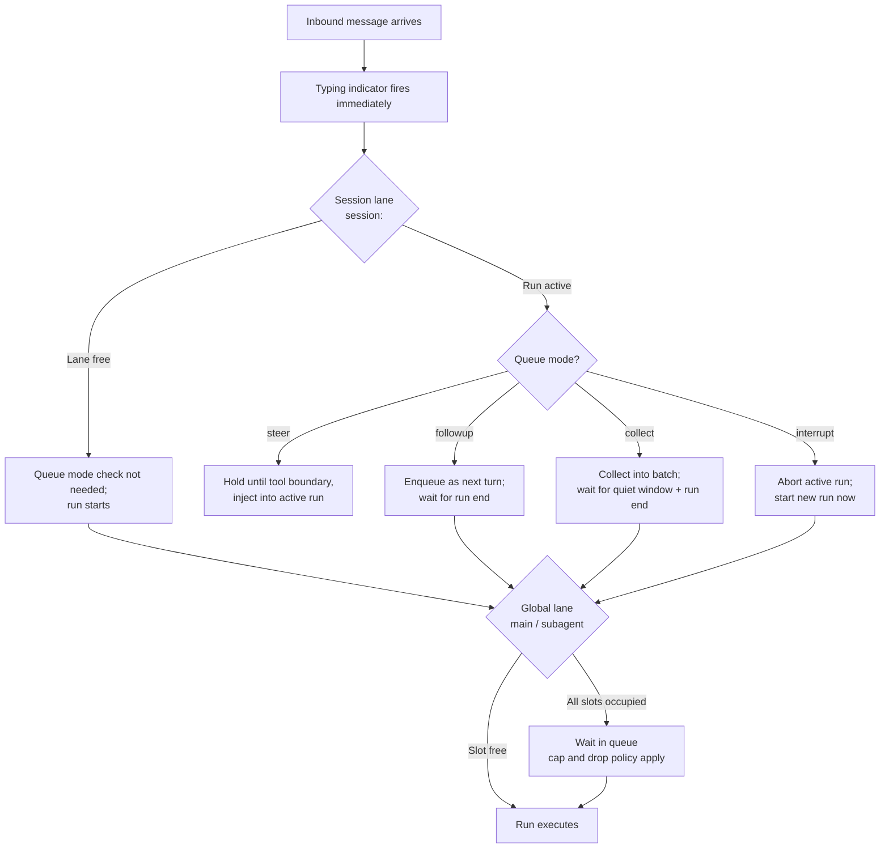

**TL;DR** — When two messages arrive close together, OpenClaw decides whether the second one should steer the active run, wait for it to finish, coalesce with other waiting messages, or abort it. This chapter explains how that decision works: the per-session lane that keeps one run active at a time, the global lane that caps total parallelism with `agents.defaults.maxConcurrent`, and all four queue modes (`steer`, `followup`, `collect`, `interrupt`) you can configure. After reading this you will be able to predict exactly what happens when a second message arrives mid-run, and you will know what to do when the queue fills up.

# Run Queue and Concurrency: Session Lanes, Queue Modes, and maxConcurrent

## The problem: what happens when two messages arrive at the same time?

Imagine you are mid-conversation with an agent. It is in the middle of a long run — calling tools, waiting on model responses — and you send another message before it finishes. Without any coordination, two simultaneous runs for the same session would both try to write to the same session file, send to the same log, and call the model at the same time. That is a race condition: outputs interleave, state gets corrupted, and the result is unpredictable.

OpenClaw prevents this with a small in-process queue. Every inbound auto-reply is routed through this queue before it ever touches a session. The queue has two layers:

1. A **session lane** — one run per session at a time.
2. A **global lane** — a cap on how many sessions can run in parallel across the whole Gateway.

We will look at each layer in turn, then at the four modes that control what the queue does with messages that arrive while a session is already active.

## The session lane: one run at a time per conversation

Think of a session lane as a supermarket checkout lane: one customer (one run) at a time, in the order they arrived. No two customers share a lane simultaneously, and the next customer does not start until the current one finishes and moves on.

In OpenClaw, a **session key** identifies a single conversation — for example, one DM thread with one user on one channel. (For the full definition of session keys, see [Sessions: Routing, Lifecycle, dmScope, and JSONL Persistence](./07-sessions.md).)

When `runEmbeddedAgent` enqueues a new run, it tags the entry with the lane identifier `session:<key>`. The queue guarantees that at most one run with the same `session:<key>` is active at any moment. If a second message arrives while the first run is still active, it waits in the queue until the first run completes — or, depending on the queue mode, it may steer the active run or abort it. We will cover those cases in the [Queue modes](#queue-modes) section.

While the new run is waiting, the channel's typing indicator fires immediately — before the run actually starts — so the user sees a response signal without delay, even though the work has not begun yet.

## The global lane: capping parallelism across all sessions

A session lane keeps a single session orderly, but without a global limit, the Gateway could spawn hundreds of simultaneous runs across hundreds of active sessions. That would exhaust model-provider rate limits, hammer the machine's CPU, and make logs unreadable.

The global lane prevents that. Every session run — after it exits its per-session lane — is also queued into the global `main` lane. The `main` lane has a configurable concurrency cap:

| Lane | Default concurrency |
|---|---|
| `main` (inbound messages + main heartbeats) | 4 simultaneous runs |
| `subagent` (subagent tool calls) | 8 simultaneous runs |
| `cron` / `cron-nested` (scheduled jobs) | Governed by `cron.maxConcurrentRuns` |
| `nested` (non-cron nested flows) | Own lane behavior |

The `main` default of 4 means at most four agent sessions are running LLM calls at the same time on your Gateway. The subagent default of 8 gives subordinate agents more headroom because they tend to make shorter, faster calls. (The multi-agent subagent pattern is covered in [Multi-Agent Coordination](../coordination/16-multi-agent.md).)

You can raise or lower the main cap by setting `agents.defaults.maxConcurrent` in your Gateway configuration. This cap is **process-wide** — it is not per-agent or per-channel. It applies to every agent on the Gateway simultaneously.

```json5
// In your openclaw.json gateway config:
{
  agents: {
    defaults: {
      maxConcurrent: 4,        // main lane cap, default shown
      timeoutSeconds: 172800,  // run timeout, default 48 h
    }
  }
}
```

When verbose logging is enabled, any run that waits more than roughly two seconds before starting will emit a short notice to the logs so you can spot a backed-up queue.

## What happens when the global lane is full

Now we have a concrete failure path to reason about. Suppose all four `main` slots are occupied by running sessions. A fifth message arrives. What happens?

It waits in the per-session queue first. If and when a `main` slot opens, it gets one. Separately, the per-session queue also has a **cap** on how many messages can be waiting at once. By default that cap is 20 messages per session. Once the cap is reached, new messages are handled according to the **drop policy**:

| `drop` value | Behaviour when cap is exceeded |
|---|---|
| `"summarize"` (default) | Drop the oldest queued entries; preserve compact summaries of what was dropped; inject those summaries as a synthetic follow-up prompt so the agent still sees the gist |
| `"old"` | Drop the oldest queued entries without summaries |
| `"new"` | Reject the newest incoming message; the queue stays as-is |

The default `"summarize"` policy means that even in a saturated queue, the agent receives a condensed record of what it missed rather than a silent gap. If you need tighter control over what is lost, set `drop: "old"` or `drop: "new"`.

```json5
{
  messages: {
    queue: {
      cap: 20,          // max queued messages per session
      drop: "summarize" // what to do when the cap is hit
    }
  }
}
```

## Queue modes

So far we have described what happens when a second message must wait for the first run to finish. But that is only the default behaviour. OpenClaw offers four queue modes that give you precise control over the relationship between an arriving message and an active run.

You set the mode globally, per channel, or per session. The precedence order is:

1. Inline or stored per-session `/queue` override (highest priority).
2. `messages.queue.byChannel.<channel>`.
3. `messages.queue.mode`.
4. Built-in default: `steer`.

Let's walk through each mode with a concrete scenario. In every case, the setup is the same: **the agent is in the middle of a run — it has called a tool and is waiting for the result — and you send a second message.**

---

### Mode 1: `steer` (the default)

**What you want:** Nudge the agent without waiting for the current run to end or starting a whole new one.

**What OpenClaw does:** It collects your message and holds it briefly (the `debounceMs` quiet window, default 500 ms, to allow you to finish typing). When the current tool calls complete and the run is about to make its next LLM call, OpenClaw injects all pending steering messages at that boundary — as a single batched input — and the agent continues the same run with your new context. No second run is started.

If the active run cannot accept steering at that moment (for example, the runtime is not streaming, or the integration does not support same-turn steering), OpenClaw falls back: it waits for the full run to end and then starts a new run with your message.

**Important:** `steer` does not abort in-flight tool calls. The current tool finishes first, then steering happens. If you need the run to stop immediately, use `interrupt` instead.

```
Timeline (steer mode):
──────────────────────────────────────────────────────────────
Run 1 starts        tool call          [steering injected]  Run 1 ends
  │                   │→ tool result ──►│                      │
  │                   │                 ▲                      │
  └── user sends 2nd message ──────────┘ (collected, injected
                                          at next LLM boundary)
```

**Visible effect:** If the channel supports streaming, the user may see the current partial reply finalize, then the agent continues (appearing as a continuous extension of the same reply, or a second reply block). Without streaming, the agent replies only when the whole run is done.

---

### Mode 2: `followup`

**What you want:** Let the current run finish completely before acting on the new message. No steering, no coalescing — queue it.

**What OpenClaw does:** It enqueues your message as a full new turn. The active run completes. Then OpenClaw starts a new run with your message as the next turn.

**When to use this:** When the agent's ongoing run is important and you want its full output before introducing new input — for example, a long research task you do not want to interrupt or redirect.

```
Timeline (followup mode):
──────────────────────────────────────────────────────────────
Run 1 starts ──────────────────────────────► Run 1 ends
                                                    │
  user sends 2nd message                     Run 2 starts (queued)
  │                                                  │
  └──── enqueued ──────────────────────────────►────┘
```

---

### Mode 3: `collect`

**What you want:** Multiple messages sent in a burst should be treated as one prompt, not a series of separate turns.

**What OpenClaw does:** It collects all messages that arrive during the quiet window (after the last message in the burst, OpenClaw waits `debounceMs` before draining). All those messages are coalesced into **a single followup turn** once the active run ends. The agent sees one combined message instead of five separate follow-on prompts.

One exception: if messages arrive from different channels or threads, they drain individually to preserve the correct routing context. Collect coalesces only within the same routing target.

**When to use this:** Chatty integrations where users send short messages in rapid succession — "hey" then "can you" then "check the logs for errors" — and you want the agent to see one coherent request.

```
Timeline (collect mode):
──────────────────────────────────────────────────────────────
Run 1 starts ──────────────────────────────► Run 1 ends
                                                    │
  msg A ──┐                              ┌── Run 2 starts with
  msg B ──┤── all collected ─────────────┤   [A + B + C] as one turn
  msg C ──┘                              │
           ↑ quiet window expires ───────┘
```

---

### Mode 4: `interrupt`

**What you want:** Stop what the agent is doing right now and respond to the new message immediately.

**What OpenClaw does:** It aborts the active run for that session, then starts a fresh run with the newest message. Any in-progress tool calls are abandoned.

**When to use this:** The user realized the agent is heading in the wrong direction and wants to redirect it immediately. Or a new, urgent prompt arrived that supersedes the current task.

**Note:** Because interrupt aborts in-flight work, the agent's partial output from the aborted run may not be sent. Use this mode when losing the current run is acceptable.

```
Timeline (interrupt mode):
──────────────────────────────────────────────────────────────
Run 1 starts ──────────────► Run 1 ABORTED
                                    │
  user sends 2nd message ───────────┘
                                    │
                            Run 2 starts immediately
                            (with newest message)
```

---

### Summary: which mode for which situation?

| Mode | Active run behaviour | New run starts | Loses in-progress work? |
|---|---|---|---|
| `steer` (default) | Continues; message injected at next LLM boundary | No second run | No |
| `followup` | Continues to completion | After run ends | No |
| `collect` | Continues to completion | After run ends (batched) | No |
| `interrupt` | Aborted | Immediately | Yes |

## Configuring queue modes

Set the mode globally or override by channel:

```json5
{
  messages: {
    queue: {
      mode: "steer",          // global default
      debounceMs: 500,        // quiet window in milliseconds
      cap: 20,                // max queued messages per session
      drop: "summarize",      // drop policy when cap exceeded
      byChannel: {
        discord: "collect",   // Discord users tend to burst; collect them
      },
    },
  },
}
```

`debounceMs` accepts bare milliseconds or human-readable units: `500`, `"500ms"`, `"0.5s"`, `"1m"`, `"1h"`, `"1d"`.

You can also override the queue mode for the current session at runtime by sending the `/queue` command in chat:

```
/queue steer
/queue collect
/queue followup
/queue interrupt

# Combine options in one command:
/queue collect debounce:0.5s cap:25 drop:summarize

# Reset to the global config default:
/queue default
```

The session override is stored and persists across that session's turns until you reset it.

## How the two layers fit together — a diagram

Here is how a message travels from arrival to an active agent run:



The key insight: the session lane and the global lane are separate gates. A message can be free on the session lane (no active run for that session) but still wait for a global slot to open.

## Additional lanes: cron, subagent, and nested

The `main` lane is not the only lane in the system. Several background-task types have their own lanes so they do not block inbound replies:

- **`cron`** — scheduled job turns. Isolated cron agent turns hold a `cron` slot; the inner agent execution of that cron turn uses `cron-nested`. Both are governed by `cron.maxConcurrentRuns` rather than `agents.defaults.maxConcurrent`.
- **`subagent`** — subagent tool calls initiated by an agent mid-run. These use the `subagent` lane with its default cap of 8. This is why subagent concurrency is higher than the main lane: subagents are typically shorter-lived and do not hold sessions.
- **`nested`** — non-cron nested flows keep their own lane behaviour, separate from inbound.

These lanes run in parallel with `main`, so a cron job does not block an inbound DM reply and vice versa. For the full multi-agent subagent model, see [Multi-Agent Coordination](../coordination/16-multi-agent.md).

## Diagnosing a stuck or slow queue

If the agent seems to have stopped responding, the queue is usually the first place to check.

**Enable verbose logging.** With verbose logs on, any run that waited more than roughly two seconds before starting emits a "queued for ...ms" line. This tells you whether the queue is draining at all.

**Stuck sessions.** If diagnostics are enabled, OpenClaw watches for sessions that remain in the `processing` state past `diagnostics.stuckSessionWarnMs` without emitting a reply, tool call, status update, or ACP progress event. Depending on what it observes:

| Diagnostic classification | Meaning |
|---|---|
| `session.long_running` | Active work is happening; session is taking a long time |
| `session.stalled` | Active work was happening but no recent progress observed |
| `session.stuck` | Recoverable stale session: idle queued session with stale ownerless model/tool activity; the session lane can be released so queued work can drain |

`session.stuck` is the only path that releases the session lane automatically. Repeated `session.stuck` diagnostics back off if the session state has not changed, to avoid spam.

**Codex runs.** Codex app-server runs that accept a turn and then stop emitting progress are interrupted by the Codex adapter so the active session lane can release instead of waiting for the full run timeout (default 48 hours).

## What we covered

We started with the problem: concurrent messages arriving at the same session produce race conditions. We traced the solution through two layers — the per-session lane (one run at a time, like a checkout lane) and the global `main` lane (capped at 4 by default with `agents.defaults.maxConcurrent`). We walked through all four queue modes (`steer`, `followup`, `collect`, `interrupt`) with a concrete mid-run scenario for each. And we documented the failure path: what happens when cap and drop policies engage, and how to diagnose a stuck queue.

In the next chapter we will look at what the agent actually receives when a run starts: the system prompt, the bootstrap file injection that happens on the first turn of each session, and how context compaction keeps the conversation within the model's window.

---

← Previous: [Sessions: Routing, Lifecycle, dmScope, and JSONL Persistence](./07-sessions.md) · Next: [System Prompt and Context: Assembly, Bootstrap Injection, and Compaction](./09-system-prompt.md) →
