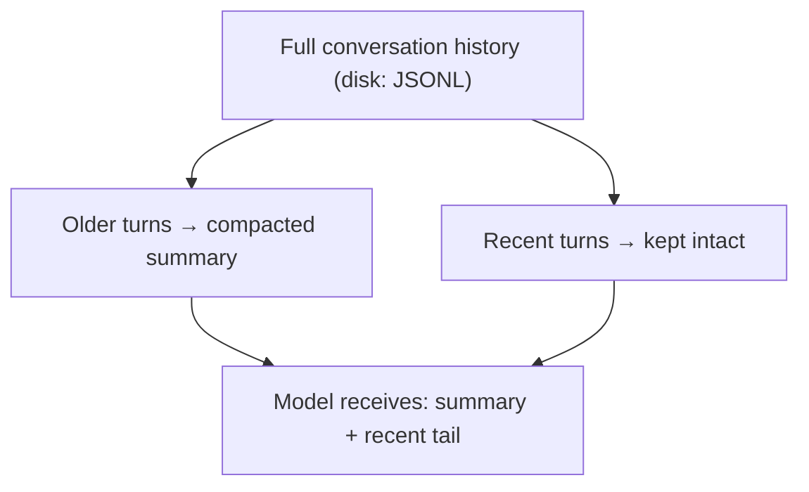

**TL;DR** — Every time your agent runs, OpenClaw assembles a complete system prompt from scratch. This chapter explains what ends up in that prompt, why workspace files like `SOUL.md` and `AGENTS.md` are only injected on the first turn of a session (not every turn), and what happens when the conversation grows too long to fit in the model's context window. By the end, you will know how to predict what the model sees at any moment, and how to inspect that view using `/status`, `/context list`, `/context detail`, and `/context map`.

# System Prompt and Context: Assembly, Bootstrap Injection, and Compaction

## What the model actually sees

Before we trace through the assembly, let's get the vocabulary straight.

A model's **context window** is the fixed maximum number of tokens it can process in one call. Think of it as a whiteboard of limited size: everything the model knows for this run must fit on it. When it fills up, older content must give way.

**Context** is everything OpenClaw sends to the model for a single run. It has two main pieces:

- The **system prompt** — OpenClaw-built instructions that the model receives before your conversation begins. It is rebuilt from scratch on every run; the model never carries a "saved" system prompt from one turn to the next.
- The **conversation history** — your messages, the assistant's replies, tool calls, and tool results from earlier in the session.

In the [agent loop](./06-agent-loop.md), context assembly is the second stage: after intake validates the incoming prompt, the loop resolves the model, loads skills, and builds the system prompt before calling the model. This chapter zooms into that stage.

## The three-layer assembly

OpenClaw's system prompt is assembled by a function called `buildAgentSystemPrompt`. The source documentation describes three cooperating layers:

1. **`buildAgentSystemPrompt`** — renders the prompt from explicit inputs. It is designed as a pure renderer: it receives facts as parameters rather than reading configuration directly.
2. **`resolveAgentSystemPromptConfig`** — resolves configuration-backed "knobs" for a specific agent: owner display format, TTS hints, model aliases, memory citation mode, and subagent delegation mode.
3. **Runtime adapters** — gather live facts (tools, sandbox state, channel capabilities, injected context files, provider prompt contributions) and call the prompt facade. Adapter types include the embedded harness, CLI backend, compaction, and export/debug preview.

This three-layer design keeps debug/export prompt surfaces aligned with live runs, because all paths share the same renderer rather than each maintaining its own prompt logic.

Providers can also contribute to the prompt in three ways: replacing a small set of named sections (`interaction_style`, `tool_call_style`, `execution_bias`), injecting a **stable prefix** above the prompt cache boundary, or injecting a **dynamic suffix** below it.

## The fixed sections

The full-mode system prompt (`promptMode: "full"`) assembles these sections in order. We will walk through each and explain what it does.

| # | Section | What it contains |
|---|---|---|
| 1 | **Tooling** | List of available tools with short descriptions; tool-use guidance for long-running work |
| 2 | **Tool Call Style** | When to narrate tool calls; how to handle exec approval flows |
| 3 | **Execution Bias** | Act in-turn, continue until done, verify results, use background tools for longer work |
| 4 | **Safety** | Short guardrail: no self-preservation, no power-seeking, no bypassing oversight |
| 5 | **OpenClaw Control** | Prefer the `gateway` tool for config/restart; do not invent CLI commands |
| 6 | **Skills** | How to load skill instructions on demand; the compact `<available_skills>` list |
| 7 | **Memory Recall** _(when enabled)_ | Memory tool usage and citation guidance |
| 8 | **OpenClaw Self-Update** | How to inspect config with `config.schema.lookup`; how to apply patches; run `update.run` only on explicit request |
| 9 | **Model Aliases** _(when configured)_ | Preferred short aliases for model overrides |
| 10 | **Workspace** | The agent's working directory (`agents.defaults.workspace`) |
| 11 | **Documentation** | Local docs path or fallback URL; when to read docs vs. inspect source |
| 12 | **Sandbox** _(when enabled)_ | Sandbox runtime indication; container paths; elevated exec availability |
| 13 | **User Identity / Authorized Senders** _(when configured)_ | Allowlisted sender ids for the agent |
| 14 | **Current Date & Time** _(when timezone configured)_ | The agent's configured time zone — cache-stable; the live clock comes from `session_status` |
| 15 | **Bootstrap Pending** _(when applicable)_ | Instruction to run the bootstrap ritual before replying normally |
| 16 | **Workspace Files (injected)** | Marker indicating that bootstrap files follow in Project Context |
| 17 | **Assistant Output Directives** | Attachment syntax (`MEDIA:` or `message(action=send)`); voice-note and reply-tag syntax |
| 18 | **Heartbeats** | `HEARTBEAT_OK` behavior; when heartbeats are enabled for the default agent |
| 19 | **Runtime** | Host, OS, Node version, model, repo root (if detected), thinking level |
| 20 | **Reasoning** | Current reasoning visibility level; how to toggle with `/reasoning` |

> **Note on Safety:** safety guardrails in the system prompt are advisory — they guide model behavior but do not enforce policy. Hard enforcement comes from tool policy, exec approvals, sandboxing, and channel allowlists. Operators can disable the advisory section by design.

### The cache boundary

OpenClaw divides the prompt at an internal **prompt cache boundary**. Large, stable content — workspace files, skills list, static workspace guidance — lives above this boundary. Channel- and session-specific sections (Messaging, Heartbeats, Runtime, dynamic context files) are appended below it. This way, local model backends with prefix caches can reuse the stable workspace portion across successive turns without invalidating the cache on every heartbeat or runtime update.

### Prompt modes: full vs. minimal vs. none

The runtime sets a `promptMode` (not a user-facing config):

| Mode | Used for | What is omitted |
|---|---|---|
| `full` | Main agent runs (default) | Nothing |
| `minimal` | Sub-agent runs | Memory Recall, OpenClaw Self-Update, Model Aliases, User Identity, Assistant Output Directives, Messaging, Silent Replies, Heartbeats |
| `none` | Bare identity line only | Everything except the base identity line |

When `promptMode: "minimal"`, any extra injected prompt is labeled **Subagent Context** instead of **Group Chat Context**. This keeps sub-agent prompts compact so they consume fewer tokens.

## Bootstrap files: the onboarding packet analogy

Now we arrive at the part that confuses most new operators: why are workspace files like `SOUL.md`, `AGENTS.md`, and `USER.md` injected only on the *first turn* of a session?

Think of it this way: on your first day at a new job, HR hands you an onboarding packet — your employee handbook, org chart, and setup checklist. You read it once. On day two, HR does not hand you the same packet again. You already have that context in your head. The packet is for orientation, not for every meeting.

Bootstrap files work the same way. OpenClaw loads them once, at the start of a new session — a session is the unit of conversation that begins when a message is routed to an agent and ends when that run completes; its lifecycle and routing rules are covered in [Sessions](./07-sessions.md) — so the model can orient itself to the workspace. After that first turn, the files are already woven into the conversation history, and re-injecting them would waste tokens on content the model has already processed.

The files resolved from the active workspace — the directory on disk that OpenClaw maps to a specific agent, typically `~/.openclaw/agents/<agentId>/agent/`, where these markdown files live; the full layout is covered in [Agents](./05-agents.md) — are:

| File | Purpose |
|---|---|
| `AGENTS.md` | Workspace conventions, memory rules, tool guidance, heartbeat policy |
| `SOUL.md` | Persona and tone — who the agent is |
| `TOOLS.md` | Environment-specific notes (camera names, SSH aliases, TTS preferences) |
| `IDENTITY.md` | Agent's name, creature type, vibe, emoji |
| `USER.md` | Information about the human: name, pronouns, timezone, notes |
| `HEARTBEAT.md` | Heartbeat checklist — read on recurring heartbeat wakes |
| `BOOTSTRAP.md` | First-run ritual — only injected for brand-new workspaces; the agent deletes it after use |
| `MEMORY.md` | Long-term curated memory — included when present (see note below) |

Files that are blank are skipped — OpenClaw injects a short missing-file marker in their place rather than an empty block.

`BOOTSTRAP.md` is the special case: it is only injected when a workspace is brand new and no previous session has established the agent's identity. Once the agent completes the bootstrap ritual and deletes the file, it never appears again.

`MEMORY.md` deserves its own note: it is intended as a compact, curated long-term summary. Detailed daily notes belong in `memory/YYYY-MM-DD.md`, where `memory_search` and `memory_get` can retrieve them on demand without injecting their full content into every turn. The memory system is covered fully in [Memory System](../memory/10-memory-system.md).

### Sub-agent filtering

Sub-agent sessions receive a reduced bootstrap set: only `AGENTS.md` and `TOOLS.md`. The other files are filtered out to keep sub-agent prompts small.

### Truncation limits

Bootstrap files can be large. OpenClaw enforces two limits:

- **Per-file cap:** `agents.defaults.bootstrapMaxChars` — default **20,000 characters**.
- **Total cap across all files:** `agents.defaults.bootstrapTotalMaxChars` — default **60,000 characters**.

When a file exceeds the per-file cap, it is truncated and a marker is inserted. This is not data loss: the file on disk is untouched. The model only sees the shortened injected copy until it explicitly reads or searches the file with a tool.

You can control whether a truncation warning appears in the prompt with `agents.defaults.bootstrapPromptTruncationWarning`:

| Value | Behavior |
|---|---|
| `off` | No warning injected |
| `once` | Warning injected once per session |
| `always` | Warning injected every time truncation occurs (default) |

If `MEMORY.md` is repeatedly truncated, the recommended fix is to distill it into a shorter durable summary and move detailed history into `memory/YYYY-MM-DD.md` files, or intentionally raise the bootstrap limits.

Internal hooks — registered callbacks that the agent loop fires at named points in its pipeline, allowing you to observe or mutate data as it flows through; see [Hooks](../extending/14-hooks.md) for the full hook API — can intercept the bootstrap injection step via `agent:bootstrap` to mutate or replace the injected files — for example, to swap `SOUL.md` for an alternate persona.

## The Reasoning section and ThinkingLevel

The last two items in the Runtime section and the Reasoning section are closely related:

```
Runtime: agent=myagent | host=... | model=anthropic/claude-opus-4-6 | thinking=medium
Reasoning: off (hidden unless on/stream). Toggle /reasoning; /status shows Reasoning when enabled.
```

**ThinkingLevel** (also called `ThinkLevel` in the codebase) controls how much the model reasons before responding. The canonical values are:

| Level | Approximate effort |
|---|---|
| `off` | No extended thinking (default) |
| `minimal` | Least reasoning |
| `low` | Light reasoning |
| `medium` | Moderate reasoning |
| `high` | Substantial reasoning |
| `xhigh` | Extended reasoning |
| `adaptive` | Model-chosen |
| `max` | Maximum reasoning |

`ThinkingLevel` is configured at the model level and controls what token budget is sent to the model for internal reasoning. The `Runtime` line in the system prompt reports the current `thinking=` value so the model knows what level it is operating at.

**ReasoningLevel**, by contrast, controls *visibility* of the model's reasoning in the conversation. It has three states: `off`, `on`, and `stream`. When `off`, reasoning tokens are hidden. When `on` or `stream`, they can be surfaced to the user. The `Reasoning:` section in the prompt reports the current visibility level and reminds the model how to toggle it with `/reasoning`.

The relationship: `ThinkingLevel` changes *how much* the model thinks; `ReasoningLevel` changes *whether you see* that thinking. The full model-level configuration for `ThinkingLevel`, fallback chains, and provider wire formats is covered in [AI Model Integration](../models/15-model-integration.md).

## Compaction: the email-thread analogy

We have been building up a clear picture of what the model sees on each turn. Now we face a problem: sessions grow. Every exchange adds messages, tool calls, and tool results. Eventually the accumulated history approaches the model's context window limit — and then what?

Think of a long email thread. When it gets so long that nobody reads from the top anymore, a good team member writes a brief summary at the top of their reply: "Here is where we stand: we decided X, then tried Y, which failed because Z, and now we are looking at option W." The ancient detail is condensed; the current situation is clear. That is exactly what **compaction** does.

### What compaction replaces vs. what it preserves

This is the most important thing to understand about compaction:

- **What it replaces:** older conversation turns are summarized into a single compact entry. The raw messages are replaced by a semantic summary in the model's active view.
- **What it preserves:** the full conversation history stays on disk in the session's JSONL file. Compaction only changes what the model sees on the next turn; it does not delete data. You can always review the full history by reading the session file.
- **Tool call/result pairs are kept together:** when OpenClaw splits history into compaction chunks, it keeps assistant tool calls paired with their matching `toolResult` entries. If a split point lands inside a tool block, OpenClaw moves the boundary to preserve the pair, so the model never receives a dangling tool call without its result.
- **Recent messages are kept intact:** a tail of recent conversation is always preserved verbatim above the compaction boundary. The model enters the next turn with the summary plus the unchanged recent tail.



### Auto-compaction

Auto-compaction is enabled by default. It runs in two situations:

1. **Proactively,** when the session approaches the context limit.
2. **Reactively,** when the model returns a context-overflow error — OpenClaw detects the overflow signature, compacts, and retries.

Recognized overflow signatures include: `request_too_large`, `context length exceeded`, `input exceeds the maximum number of tokens`, `input token count exceeds the maximum number of input tokens`, `input is too long for the model`, and `ollama error: context length exceeded`.

Before compacting, OpenClaw automatically reminds the agent to save important notes to memory files. This prevents context loss that might otherwise occur when older detail disappears from the window.

You will see these indicators when auto-compaction runs:

- `embedded run auto-compaction start` / `complete` in normal Gateway logs
- `/status` showing `Compactions: <count>`

### Manual compaction with `/compact`

You can force a compaction at any time:

```
/compact
```

To guide the summary — useful when you want the model to emphasize a particular thread:

```
/compact Focus on the API design decisions
```

The `keepRecentTokens` configuration (`agents.defaults.compaction.keepRecentTokens`) sets a token budget for the recent tail that manual compaction preserves. When this is set, manual compaction honors the cut-point and keeps the recent tail. Without an explicit keep budget, manual compaction behaves as a hard checkpoint: the model continues from the new summary alone, with no preserved recent tail.

### Compaction failure path

If compaction itself fails — for example, the model used for summarization encounters an error — OpenClaw retries through the session's existing model fallback chain. An explicit `agents.defaults.compaction.model` override does not inherit the fallback chain; it stays exact. If compaction fails at the retried model too, the error is logged and the run reports the failure. The session history on disk is always preserved regardless of compaction outcome.

### Compaction vs. pruning

Compaction has a lighter-weight complement called **pruning**, which trims old tool results from the in-memory prompt without summarizing them and without rewriting the session transcript:

| | Compaction | Pruning |
|---|---|---|
| **What it does** | Summarizes older conversation | Trims old tool results |
| **Transcript written?** | Yes (summary saved to session) | No (in-memory only) |
| **Scope** | Entire conversation | Tool results only |

If your context fills up primarily from large tool outputs (long file reads, big `exec` results), pruning can help without triggering a full compaction. If the problem is accumulated conversation turns, compaction is the right tool.

### Pluggable context engine

Compaction is one responsibility of the **context engine** — OpenClaw's pluggable slot for controlling how context is assembled and managed. The built-in `legacy` engine preserves OpenClaw's original assembly behavior. You can install a plugin engine that implements different assembly, compaction, or cross-session recall strategies by registering a `kind: "context-engine"` plugin — a plugin declares a `kind` field that names the role it fills, and may occupy a named slot in the runtime so exactly one implementation is active at a time; plugin kinds and slots are defined in [Plugins, Skills, and Tools](../extending/11-plugins-skills-tools.md) — and selecting it with `plugins.slots.contextEngine`. The slot is exclusive: only one engine is active at a time for a given run. If a plugin engine fails, OpenClaw quarantines it and downgrades to the `legacy` engine for the current Gateway process.

## Inspecting context with slash commands

Now that we know what goes into the prompt and how it evolves over a session, we need a way to see it. OpenClaw provides four inspection commands:

### `/status`

The quickest view. It shows session settings, token usage, how full the context window is, and the compaction count. Use this when you want a fast "am I getting close to the limit?" check.

### `/context list`

A per-file breakdown of what was injected, including raw vs. injected sizes and whether truncation occurred. It also shows the skills list size, tool list size, and tool schema size (which counts toward context even though you never see schemas as plain text). Example output shape:

```
🧠 Context breakdown
Workspace: /home/user/.openclaw/agents/myagent/agent
Bootstrap max/file: 20,000 chars
System prompt (run): 38,412 chars (~9,603 tok)

Injected workspace files:
- AGENTS.md: OK | raw 1,742 chars (~436 tok) | injected 1,742 chars (~436 tok)
- SOUL.md: OK | raw 912 chars (~228 tok) | injected 912 chars (~228 tok)
- TOOLS.md: TRUNCATED | raw 54,210 chars (~13,553 tok) | injected 20,962 chars (~5,241 tok)
- IDENTITY.md: OK | raw 211 chars (~53 tok) | injected 211 chars (~53 tok)
- USER.md: OK | raw 388 chars (~97 tok) | injected 388 chars (~97 tok)
- HEARTBEAT.md: MISSING | raw 0 | injected 0
- BOOTSTRAP.md: OK | raw 0 chars (~0 tok) | injected 0 chars (~0 tok)

Skills list (system prompt text): 2,184 chars (~546 tok) (12 skills)
Tool schemas (JSON): 31,988 chars (~7,997 tok)
Session tokens (cached): 14,250 total / ctx=32,000
```

Use `/context list` when you see truncation warnings or want to know which files are consuming the most space.

### `/context detail`

A deeper breakdown that adds per-skill entry sizes and per-tool schema sizes, so you can identify which skills or tools dominate the token budget. It also compares the session transcript using the same message predicate that compaction uses, so you can distinguish between "the system prompt is large" and "I have too many conversation turns."

### `/context map`

Generates a WinDirStat-style treemap image of the current session's tracked context contributors. Rectangle area is proportional to tracked prompt characters across: injected workspace files, base system prompt text, skill prompt entries, and tool JSON schemas. This command requires a cached run report from a previous embedded run; before the first embedded run in a session, it returns an unavailable message instead.

### Summary of context inspection commands

| Command | Best used for |
|---|---|
| `/status` | Quick "how full am I?" check |
| `/context list` | Which files are injected, what size, any truncation? |
| `/context detail` | Which specific tools or skills dominate the token budget? |
| `/context map` | Visual overview of context composition after a run |

## A worked example: reading context across a session

Let's walk through a short session to see these ideas connect.

**Turn 1** — A user opens a new DM session. The agent loop reaches context assembly. `buildAgentSystemPrompt` assembles the full system prompt: all fixed sections, plus Project Context containing `AGENTS.md`, `SOUL.md`, `IDENTITY.md`, `USER.md`, and `TOOLS.md` (all injected above the cache boundary). The model receives this prompt and produces its first reply.

**Turn 5** — The user asks the agent to analyze a large file. The `read` tool returns 8,000 tokens of file content. The full transcript is now larger, but still within the context window. The stable prefix above the cache boundary is byte-identical to turn 1 — the model backend can reuse the cached prefix rather than re-encoding it.

**Turn 20** — The session has accumulated many tool calls and long outputs. OpenClaw measures the assembled context and detects it is approaching the model's limit. Auto-compaction fires. The agent is first reminded to save important notes. Older turns are summarized. The recent tail is kept intact. The next turn receives: the full system prompt + the compact summary + the recent tail.

**User runs `/context list`** — They see that `TOOLS.md` was truncated (the file grew large over time) and that tool schemas account for 31,000 characters of context. They decide to trim `TOOLS.md` or raise `agents.defaults.bootstrapMaxChars` for this agent.

## Prerequisites recap

This chapter builds on three earlier concepts:

- **Bootstrap files** live in the agent's workspace directory. The workspace layout — `~/.openclaw/agents/<agentId>/agent/` — is covered in [Agents](./05-agents.md).
- **Context assembly** is the second stage of the agent loop's six-turn pipeline. The full loop (intake → context assembly → model inference → tool execution → streaming replies → persistence) is covered in [The Agent Loop](./06-agent-loop.md).
- **"First turn of a session"** is the unit that bootstrap injection keys on. Sessions — their routing rules, lifecycle, and JSONL persistence — are covered in [Sessions](./07-sessions.md).

---

← Previous: [Run Queue and Concurrency: Session Lanes, Queue Modes, and maxConcurrent](./08-run-queue.md) · Next: [Memory System: File Memory, memory-core, memory-lancedb, and memory-wiki](../memory/10-memory-system.md) →
