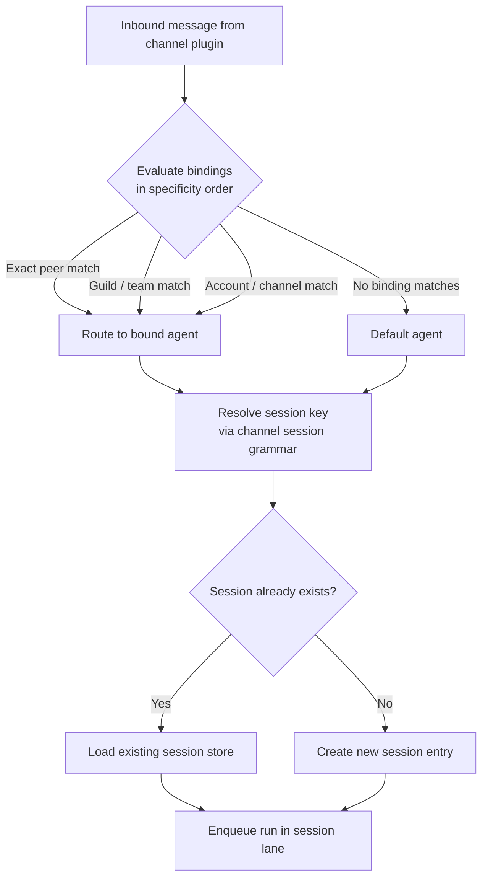
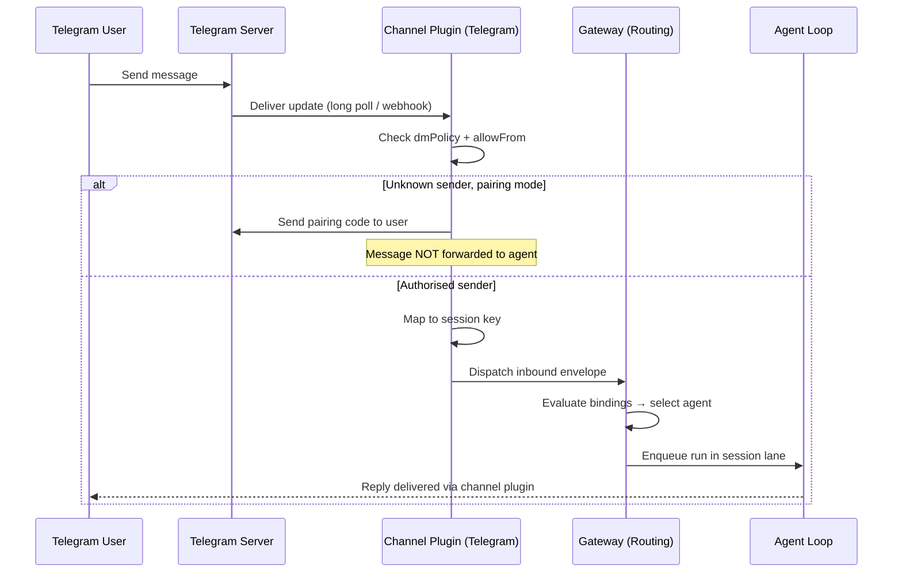

**TL;DR** — A channel is the messaging surface that brings user messages into OpenClaw and sends the agent's replies back out. This chapter explains what distinguishes a channel from a tool, how the Gateway maps each inbound message to a session key, how bindings route that session to the right agent, and why DM pairing exists as the default gate against unwanted senders.

# Channels: Message Surfaces, Session Grammar, and DM Pairing

We have seen how the Gateway acts as the control plane that accepts WebSocket connections from clients (see [The Gateway](../gateway/03-gateway.md) for a full recap). Now we need to understand what sits on the *outside* of the Gateway facing the real world — the channels that let a human actually talk to an agent through Telegram, Discord, WhatsApp, or any other messaging platform.

## What a channel is (and is not)

Think of a channel as a **two-way pipe between a chat platform and the Gateway**. When you send a message in Telegram, the Telegram channel plugin receives it, translates it into the shared internal envelope that OpenClaw understands, and hands it to the Gateway for routing. When the agent replies, the same plugin takes the response and delivers it back to Telegram.

That description highlights what a channel is *not*: a tool. This is a distinction worth pausing on.

A **tool** is something the agent's model calls *during* a run — a typed callable function (`exec`, `web_fetch`, `memory_get`, …) that appears in the model's context as a capability it can invoke. The model asks "should I call this function?" and the agent loop executes it if policy permits.

A **channel** is not callable by the model. It is a message surface that routes conversations into the system and routes replies back out. The model never chooses which channel to reply on — routing is deterministic and controlled by the host configuration. A message that arrives on Telegram is always answered on Telegram. The channel determines how the conversation arrived; the tool system determines what the agent can *do* inside that conversation.

> **Analogy.** Think of a channel as a telephone line that connects a caller to your office, and a tool as a reference book sitting on the desk. The telephone line decides how the call arrived; the book is what the agent consults while on the call. They are completely separate things.

For depth on tools and how the model calls them, see [Tool System](../extending/12-tool-system.md).

## Supported channels

OpenClaw can connect to a wide range of chat platforms. Each is backed by a channel plugin that handles the platform-specific transport and wraps messages in the shared internal envelope.

| Channel | Transport | Notes |
|---|---|---|
| Telegram | Bot API via grammY (long poll or webhook) | Fastest initial setup; default DM policy is `pairing` |
| Discord | Discord Gateway (WebSocket) | Supports DMs, guilds, channels, threads, and voice |
| WhatsApp | WhatsApp Web (Baileys); QR-linked session | External `@openclaw/whatsapp` plugin; install on demand |
| Slack | Bolt SDK (Socket Mode default, or HTTP webhooks) | External `@openclaw/slack` plugin |
| Signal | `signal-cli` JSON-RPC over HTTP or stdio | External process; `channels.signal.autoStart` manages lifecycle |
| iMessage | `imsg` RPC child process (macOS only) | Line-delimited JSON-RPC over stdin/stdout; no TCP port needed |
| Discord (voice) | `@discordjs/voice` with WebRTC | Opt-in; requires `channels.discord.voice.enabled: true` |
| WebChat | Gateway's built-in WebSocket UI | Internal; not a configurable outbound channel |

Additional channels exist (Feishu, LINE, Matrix, Mattermost, SMS via Twilio, IRC, Nostr, Twitch, and more) as bundled or downloadable plugins. All run simultaneously when configured.

The fastest initial setup is usually **Telegram** — it requires only a bot token from BotFather. WhatsApp requires a QR scan to link a phone session and stores more state on disk.

## How a channel plugin works: the transport-only boundary

Each channel is implemented as a plugin that registers with the Gateway. From the plugin SDK perspective, a channel plugin owns:

- **Config and account resolution** — which bot token or credentials to use, and which named account they belong to when multiple accounts of the same channel are configured.
- **Security** — the `dmPolicy` that decides who can initiate a DM, and the `allowFrom` allowlist that backs it.
- **Pairing** — the approval flow for unknown senders.
- **Session grammar** — how the platform's native conversation identifiers map to the session key that OpenClaw uses to store and retrieve conversation history.
- **Outbound** — sending text, media, reactions, and polls back to the platform.
- **Threading** — how multi-part replies or quote replies are structured.

What the plugin does *not* own is the model, the tool system, the agent loop, or the session storage format. The plugin is purely a transport adapter. Core owns the shared `message` tool, the prompt wiring, the outer session-key shape, and the dispatch into the agent loop. This boundary is explicit in the SDK — a channel plugin registers through `defineChannelPluginEntry` and exposes a `ChannelPlugin` interface; it does not reach into agent-core internals.

The architectural consequence: channel plugins run **in-process with the Gateway**, not as separate network services. That means low latency and no inter-process overhead, but it also means a plugin crash can affect the whole Gateway process. (See [Design Decisions](../reference/25-design-decisions.md) for why this tradeoff was made.)

### External CLIs as channels

Two channels integrate external programs rather than embedded libraries:

- **Signal** bridges to `signal-cli`, which runs as a separate HTTP daemon with a JSON-RPC API and an SSE event stream. OpenClaw manages the lifecycle when `channels.signal.autoStart: true`.
- **iMessage** bridges to `imsg rpc`, a child process that OpenClaw spawns and communicates with over line-delimited JSON-RPC on stdin/stdout. No TCP port or daemon is needed.

For both, the Gateway owns the process lifecycle and keeps an in-process adapter that translates between the external CLI's wire format and the shared channel envelope.

## Session grammar: how a conversation becomes a session key

Now we get to the core question: when a message arrives, how does OpenClaw know *which* conversation it belongs to?

Every conversation on every channel is mapped to a **session key** — a string that uniquely identifies the context bucket for that conversation. The session key determines where the conversation history is stored and ensures that two concurrent conversations never share the same context.

Think of a session key like a filing cabinet label. A key of `agent:main:telegram:group:-1001234567890` always points to the same conversation history, no matter which component is reading or writing it. A different group on Telegram has a completely different label and a completely different drawer.

The key shapes follow a consistent grammar:

| Conversation type | Session key shape |
|---|---|
| Direct message (default) | `agent:<agentId>:main` — collapses all DMs to the main session |
| Group chat | `agent:<agentId>:<channel>:group:<id>` |
| Channel / room | `agent:<agentId>:<channel>:channel:<id>` |
| Thread in Slack or Discord | base key + `:thread:<threadId>` |
| Telegram forum topic | group key + `:topic:<topicId>` |

**Direct messages are special.** By default (`session.dmScope: "main"`), all incoming DMs — regardless of which channel they arrived on — share one main session with the agent. This is the behaviour that lets you continue the same conversation whether you message from Telegram or Discord. You can change this scoping (see [Sessions](../agents/07-sessions.md) for the full `dmScope` options), but the default is intentionally cohesive.

**Groups and rooms are always isolated.** A Telegram group gets its own session key; a Discord guild channel gets its own session key. Conversations in different groups never bleed into each other.

The channel plugin is responsible for extracting the right identifiers from the platform's native message structure and constructing the session record that OpenClaw stores. This is what "session grammar" means: each platform has its own way of identifying conversations (Telegram uses numeric chat IDs; Discord uses snowflake IDs; WhatsApp uses JIDs), and the plugin translates them into the canonical key shape.

Let's trace one concrete example with a Telegram group forum topic:

```
Platform message → chatId: -1001234567890, threadId: 42
Plugin maps to → session key: agent:main:telegram:group:-1001234567890:topic:42
```

That single key is what gets looked up when the agent loop assembles context, and what gets written when the session JSONL file is updated after the reply.

## How the Gateway routes an inbound message to an agent

Now we know how a message maps to a session key. But which *agent* handles it?

OpenClaw supports multiple agents per Gateway, each with its own workspace, session store, and configuration. Routing is done through **bindings** — rules that map a `(channel, accountId, peer)` tuple to a named agent.

> **Quick recap from architecture (P2):** An agent is an isolated AI runtime with its own workspace directory and session store; it is not only a model configuration. The [Architecture chapter](../getting-started/02-architecture.md) covers this fully.

When a message arrives, the Gateway evaluates the binding list in specificity order and picks the first match. The specificity ladder from most specific to least specific is:

| Priority | Match condition |
|---|---|
| 1 | Exact peer match (`peer.kind` + `peer.id`) |
| 2 | Parent peer match (thread inheriting from parent channel) |
| 3 | Guild + roles match (Discord: `guildId` + `roles`) |
| 4 | Guild match (Discord: `guildId` only) |
| 5 | Team match (Slack: `teamId`) |
| 6 | Account match (`accountId` on the channel) |
| 7 | Channel match (`accountId: "*"` — any account on that channel) |
| 8 | Default agent (`agents.list[].default`, else first list entry, fallback to `main`) |

When a binding includes multiple fields — say, both `guildId` and `roles` — all provided fields must match for that binding to apply.

Here is a concrete configuration example showing how bindings work:

```json5
// Simplified view of a binding configuration
{
  agents: {
    list: [
      { id: "support", name: "Support Agent", workspace: "~/.openclaw/workspace-support" },
    ],
  },
  bindings: [
    // More specific: a particular Slack team → support agent
    { match: { channel: "slack", teamId: "T123" }, agentId: "support" },
    // Less specific: a Telegram group → support agent
    { match: { channel: "telegram", peer: { kind: "group", id: "-100123" } }, agentId: "support" },
    // All other messages fall through to the default agent
  ],
}
```

When no binding matches at all, the message goes to the default agent — or if no default is marked, the first agent in the list. If there are no agents configured, it falls back to the built-in `main` agent.

> For multi-agent coordination in depth — subagent spawning, binding specificity worked examples, and how agents relate to each other — see [Multi-Agent Coordination](../coordination/16-multi-agent.md).

Let's visualise the full path from inbound message to session assignment:



The matched agent determines which workspace and session store are used. Once the session key is resolved and the run is enqueued, the agent loop takes over from there.

## DM pairing: the default access gate

We have described *how* messages are routed. Now let us talk about which messages are *allowed in* at all.

Anyone who knows your Telegram bot username or your Discord bot's invite link could theoretically send it a message. Without any access control, your agent would respond to everyone. Most users do not want that.

OpenClaw's answer is **DM pairing** — the default security model for direct messages on personal channels.

> **Analogy.** Imagine you have an unlisted phone number for your home office. You do not want cold callers reaching your assistant. So the first time a stranger calls, your assistant says "please tell me a code word, and ask the owner to authorise you." Once the owner approves, that caller is on the allowlist. DM pairing is exactly this.

When a channel's `dmPolicy` is set to `"pairing"` (the default for Telegram, Discord, WhatsApp, Slack, and Signal), here is what happens:

**Success path:** A new sender messages the bot. The bot responds with an 8-character uppercase pairing code. The sender shares that code with you (the operator). You run `openclaw pairing approve <channel> <CODE>` on the Gateway host. From that point on, the sender's messages are processed normally and the sender is added to the persistent allowlist.

**Rejection path (the failure to understand):** If no approval arrives within the pairing code's expiry window (1 hour), the pending request silently expires. The original message was never processed by the agent — not even seen by the model. A new message from the same sender generates a fresh code, subject to the cap of 3 pending requests per channel. Additional requests beyond that cap are ignored until an existing one expires or is approved.

The pairing approval also has a first-run bootstrap effect: if no `commands.ownerAllowFrom` exists yet, the first approved pairing code bootstraps that field to the approved sender. This gives new setups an explicit owner for privileged commands and exec approval prompts. After an owner exists, later pairing approvals only grant DM access.

```bash
# List pending codes waiting for approval
openclaw pairing list telegram

# Approve a specific code
openclaw pairing approve telegram <CODE>
```

### Who exactly is being kept out?

DM pairing is not about keeping out bad actors with sophisticated tools. It is about keeping out:

- Random Telegram users who stumble across your bot's username in a public list.
- Other bots that might try to engage your agent in automated exchanges.
- Anyone who discovers your Discord bot's invite link.

The threat model is casual, low-effort unauthorised access — someone who did not know the agent was yours and typed a message out of curiosity. DM pairing handles this case without requiring you to pre-configure an allowlist of user IDs before anyone has even messaged you.

For people who already know their user IDs, `dmPolicy: "allowlist"` with explicit `allowFrom` entries is more durable — the allowlist lives in config and does not depend on a prior pairing approval. For intentionally public bots, `dmPolicy: "open"` with `allowFrom: ["*"]` opens access fully, but the source docs note that this should only be used for bots with tightly restricted tools.

### DM pairing state storage

The pairing state is stored in the credentials directory, not in SQLite or in the main config:

- Pending requests: `~/.openclaw/credentials/<channel>-pairing.json`
- Approved allowlist: `~/.openclaw/credentials/<channel>-allowFrom.json` (default account) or `~/.openclaw/credentials/<channel>-<accountId>-allowFrom.json` (non-default account)

Treat these files as sensitive. They are the gate to your assistant.

### Group access is separate from DM access

A common misconception: approving a DM pairing code does not grant that sender access to send commands in a group. DM access and group access are independently controlled. Group access is governed by `groupPolicy` and `groupAllowFrom` (or `allowFrom` as a fallback). The sender authorisation in groups also does not inherit from the DM pairing store.

For channels with group support, you configure group allowlists separately:

```json5
{
  channels: {
    telegram: {
      dmPolicy: "pairing",
      allowFrom: ["987654321"],          // Controls who can DM
      groupPolicy: "allowlist",
      groups: {
        "-1001234567890": {
          requireMention: true,
          allowFrom: ["987654321"],       // Controls who can trigger in this group
        },
      },
    },
  },
}
```

## The `dmPolicy` options at a glance

| Policy | Behaviour |
|---|---|
| `pairing` (default) | Unknown senders receive a pairing code; messages are held until the operator approves. |
| `allowlist` | Only senders explicitly listed in `allowFrom` are processed. Empty `allowFrom` blocks all DMs (rejected by config validation). |
| `open` | Any sender is accepted. Requires `allowFrom: ["*"]` to take effect. |
| `disabled` | No DMs accepted at all. |

## Delivery notes and channel-specific behaviours

A few platform-level details worth knowing for the channels covered in this chapter:

- **Telegram** markdown image syntax (``) is converted to native media replies on the outbound path when possible.
- **Slack** multi-person DMs (MPIMs) route as group chats — group session rules and group allowlists apply, not DM rules.
- **WhatsApp** is installed on demand: the `@openclaw/whatsapp` plugin is loaded only when the channel is active. The current setup flow is QR-only (no token-based auth).
- **Signal** and **iMessage** route through external CLI bridges rather than embedded platform SDKs. Signal uses `signal-cli` over HTTP; iMessage uses the `imsg` child process over stdio.
- **Bot loop protection**: channels that can receive bot-authored inbound messages expose an optional bot-loop protection mechanism to prevent two bots from replying to each other indefinitely.

## Putting it all together

Let us trace one complete inbound message path from the platform to the session lane:

1. A Telegram user sends a message to your bot.
2. The Telegram channel plugin receives the update via grammY long polling.
3. The plugin checks `dmPolicy`. If `pairing` and the sender is unknown, a pairing code is returned and processing stops.
4. If the sender is known, the plugin normalises the message into the shared inbound envelope.
5. The plugin maps the conversation identifiers to a session key (for a DM: `agent:main:main`; for a group: `agent:main:telegram:group:<chatId>`).
6. The Gateway evaluates the binding list to determine which agent handles this session key.
7. The session is looked up (or created) in that agent's session store.
8. The run is enqueued in the session lane for that session key. The agent loop picks it up from there.



## Cross-links

- [Architecture overview](../getting-started/02-architecture.md) — the four-layer model and where channels fit.
- [Gateway](../gateway/03-gateway.md) — port 18789, wire protocol, and node pairing.
- [Agents](../agents/05-agents.md) — what an agent is and how its workspace is structured.
- [Sessions](../agents/07-sessions.md) — session keys, `dmScope` options, session lifecycle, and JSONL persistence.
- [Tool System](../extending/12-tool-system.md) — the difference between a tool and a channel elaborated; effective tool policy.
- [Multi-Agent Coordination](../coordination/16-multi-agent.md) — bindings in depth, binding specificity worked examples, subagent tool calls.
- [Security and Governance](../operations/20-security.md) — the full security threat model, Gateway auth modes, and sandbox policy.

---

← Previous: [The Gateway: Port 18789, Wire Protocol, and Node Pairing](../gateway/03-gateway.md) · Next: [Agents: Workspace, Bootstrap Files, and Harness Types](../agents/05-agents.md) →
