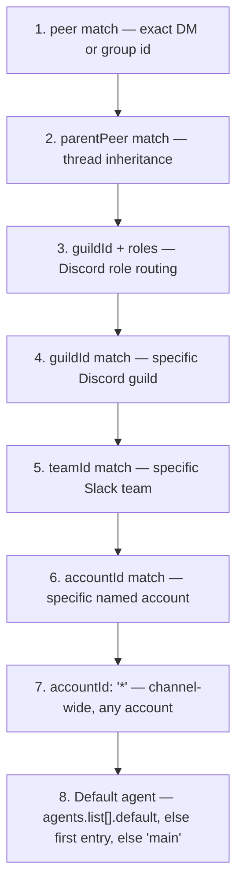

**TL;DR** — A single OpenClaw Gateway can host multiple fully isolated agents, each with its own workspace, session store, and auth profiles. Inbound messages are routed to the right agent through *bindings* — configuration rules that match a `(channel, accountId, peer)` tuple by a deterministic specificity order. Once an agent is running, it can spawn subordinate agent runs using the `sessions_spawn` tool. There is no inter-agent messaging bus: the only coordination mechanisms are bindings (routing) and subagent tool calls (subordination).

# Multi-Agent Coordination: Bindings, Specificity Rules, and Subagent Calls

## Starting point: one Gateway, one agent

By default, OpenClaw runs a single agent — its id is `main`, and it handles all inbound messages from all channels. This is fine for personal use, but it breaks down as soon as you need to keep two concerns separate: a work persona and a personal one, or a family assistant and a professional one.

The solution is not to run two Gateway processes. Instead, you add more agents inside the same Gateway and use *bindings* to tell the Gateway which agent should handle which message.

Before we add agents, let us be clear about what "one agent" actually means.

## What makes an agent a separate entity

An **agent** is a fully scoped runtime unit. Think of it as a separate employee: they have their own desk (workspace), their own filing cabinet (auth profiles and session store), and their own identity documents (workspace files like `AGENTS.md` and `SOUL.md`). Nothing crosses between desks unless you explicitly set it up.

Concretely, each agent owns:

| Piece | Default path |
|---|---|
| Workspace (files, notes, persona rules) | `~/.openclaw/workspace-<agentId>` |
| Auth profiles | `~/.openclaw/agents/<agentId>/agent/auth-profiles.json` |
| Session store (chat history) | `~/.openclaw/agents/<agentId>/sessions/` |
| Agent state dir | `~/.openclaw/agents/<agentId>/agent/` |

> **Prerequisite recap — agents:** each agent is a self-contained persona with its own workspace files and session state. See [Agents](../agents/05-agents.md) for the full workspace layout.

The `agentId` is the stable string key — `main`, `work`, `family`, etc. — that appears in session keys and routing config.

One consequence worth understanding now: **auth profiles are per-agent**. If you want an agent to have an independent OAuth account for a service, you sign in from that agent. You can copy portable `api_key` or `token` profiles across agents manually, but OAuth refresh tokens must not be shared (they are single-use and would invalidate each other).

## Adding a second agent

You can add an agent with the wizard:

```bash
openclaw agents add work
```

Or declare it directly in `~/.openclaw/openclaw.json`:

```json5
{
  agents: {
    list: [
      { id: "main", default: true, workspace: "~/.openclaw/workspace-main" },
      { id: "work",              workspace: "~/.openclaw/workspace-work" },
    ],
  },
}
```

The `default: true` flag marks which agent receives messages when no binding matches. If no agent sets `default: true`, OpenClaw uses the first entry in `agents.list`; if the list is empty, it falls back to `main`.

At this point we have two agents but no routing rules. Every message still goes to the default agent. We need bindings.

## Bindings: routing a message to the right agent

A **binding** is a routing rule that says: "when a message arrives on this channel + account + (optionally) from this peer, send it to this agent."

Think of a binding like a mail-room sorter: when a letter arrives, the sorter checks the addressee, the company, and the department — and drops the envelope in the right slot. The most specific matching rule wins.

Here is the minimal structure:

```json5
{
  bindings: [
    {
      agentId: "work",
      match: { channel: "whatsapp", accountId: "biz" },
    },
    {
      agentId: "main",
      match: { channel: "whatsapp", accountId: "personal" },
    },
  ],
}
```

When a WhatsApp message arrives on the `biz` account, it goes to the `work` agent. When it arrives on `personal`, it goes to `main`.

The `match` object can carry several fields:

| Match field | What it identifies |
|---|---|
| `channel` (required) | The channel type: `whatsapp`, `telegram`, `discord`, `slack`, etc. |
| `accountId` | A specific channel account (e.g. `"biz"`); omit for the default account; `"*"` for any account |
| `peer` | A specific chat: `{ kind: "direct"|"group"|"channel", id: "<id>" }` |
| `guildId` | A specific Discord guild |
| `teamId` | A specific Slack team |

### Specificity: the rule that resolves conflicts

What if two bindings could both match the same message? OpenClaw uses a deterministic **specificity order** — the more fields a binding specifies, the higher its priority. Within the same tier, the first entry in config order wins.

The order from most specific to least specific is:



**Tier 2 — `parentPeer` (thread inheritance):** when a message arrives inside a thread and the parent conversation peer is known, a binding on `parentPeer` matches before any guild or account-level rule. This lets you route thread continuations to a specific agent independently of who originally started the thread.

**Tier 3 — `guildId` + roles (Discord role routing):** a binding that specifies both a Discord `guildId` and a role filter matches messages from members who hold that role in the guild. This sits above a plain `guildId` match so role-specific routing takes precedence over guild-wide routing.

If a binding sets multiple fields (for example `peer` + `guildId`), all specified fields must match — AND semantics.

> **What happens when no binding matches?** If no binding matches the incoming `(channel, accountId, peer)` tuple, OpenClaw falls back to the **default agent**: whichever `agents.list` entry has `default: true`, otherwise the first list entry, otherwise the agent with id `main`. The message is never dropped silently — it always reaches some agent.

#### Concrete example: a more specific peer binding overrides a channel-wide binding

Imagine you have WhatsApp routed to a casual `chat` agent for most conversations, but you want your deep-work partner's number to reach a more capable `opus` agent:

```json5
{
  agents: {
    list: [
      {
        id: "chat",
        workspace: "~/.openclaw/workspace-chat",
        model: "anthropic/claude-sonnet-4-6",
      },
      {
        id: "opus",
        workspace: "~/.openclaw/workspace-opus",
        model: "anthropic/claude-opus-4-6",
      },
    ],
  },
  bindings: [
    // Tier 1 — peer match (highest specificity): this number always goes to opus
    {
      agentId: "opus",
      match: {
        channel: "whatsapp",
        accountId: "*",
        peer: { kind: "direct", id: "+15551234567" },
      },
    },
    // Tier 7 — channel-wide fallback: everything else on WhatsApp goes to chat
    {
      agentId: "chat",
      match: { channel: "whatsapp", accountId: "*" },
    },
  ],
}
```

When a message arrives from `+15551234567`, it matches the first binding at the `peer` tier (tier 1) and goes to `opus`. A message from any other number falls through to the channel-wide rule at tier 7 and goes to `chat`. The peer binding "wins" because tier 1 beats tier 7 — even though both bindings could nominally match a message from that number.

> **What happens if a Telegram user's account has no matching binding?** Suppose you have bindings only for WhatsApp, and a message arrives on Telegram. None of the bindings match. OpenClaw falls to the default agent — whichever agent is marked `default: true` in `agents.list`, or the first list entry. The Telegram message is handled, though not by a specially designated agent.

### Per-agent tool and sandbox configuration

Each agent can have its own tool policy and sandbox settings, applied independently of other agents:

```json5
{
  agents: {
    list: [
      {
        id: "personal",
        workspace: "~/.openclaw/workspace-personal",
        sandbox: { mode: "off" },
      },
      {
        id: "family",
        workspace: "~/.openclaw/workspace-family",
        sandbox: { mode: "all", scope: "agent" },
        tools: {
          allow: ["read", "exec", "sessions_list", "sessions_history", "sessions_spawn"],
          deny: ["write", "edit", "apply_patch", "browser", "canvas", "cron"],
        },
      },
    ],
  },
}
```

The `personal` agent runs without a sandbox; `family` runs in an isolated Docker container and has a restricted tool set. This lets a shared Gateway server host agents with very different trust levels.

## The no-bus rule: how agents actually coordinate

Before we look at subagents, there is one thing to state plainly:

**Agents do not communicate via a messaging bus.** There is no publish-subscribe channel, no shared message queue, and no event bus between agents in OpenClaw. An agent cannot "send a message" to another agent as a peer.

The only two coordination mechanisms are:

1. **Bindings (routing):** the Gateway decides which agent handles an inbound message before any agent runs.
2. **Subagent tool calls (subordination):** a running agent can spawn a subordinate agent run and eventually receive its result — as a tool call, not a message.

Any system design that assumes agents can signal each other arbitrarily is outside what OpenClaw provides.

## Subagent calls: one agent delegating work to another

> **Prerequisite recap — sessions:** each session is a sequence of turns stored as a JSONL file, keyed by a string like `agent:main:main`. See [Sessions](../agents/07-sessions.md) for the full lifecycle.

> **Prerequisite recap — run queue:** the run queue serializes runs per session lane while allowing a bounded number of concurrent subagent runs on the global subagent lane. See [Run Queue](../agents/08-run-queue.md).

> **Prerequisite recap — tool system:** tools are invoked during the tool-execution stage of the agent loop. `sessions_spawn` and `subagents` are tools registered in this system. See [Tool System](../extending/12-tool-system.md).

### What `sessions_spawn` does

The `sessions_spawn` tool lets a running agent start a **subordinate agent run** — a background turn that runs independently and reports its result back to the requester.

Think of it like assigning a task to a junior colleague: you hand them a brief, they go off and do the work, and when they finish they put a summary on your desk. You do not wait at their desk watching them work — you return to your own tasks and process their result when it arrives.

Key behaviors:
- `sessions_spawn` returns immediately with a `{ status: "accepted", runId, childSessionKey }`. It does not block the parent's turn.
- The subagent runs in its **own isolated session** with the key shape `agent:<agentId>:subagent:<uuid>`. It does not share the parent's session lane.
- When the subagent finishes, it announces its result back to the requester session. The parent agent then decides whether to send a visible reply to the user.

### Does the subagent share the parent's session lane?

No. The subagent gets its own run on the **global subagent lane** — a separate execution lane with its own concurrency cap (`agents.defaults.subagents.maxConcurrent`, default `8`). The parent session lane and the subagent lane are independent.

Think of session lanes like supermarket checkout lanes: the parent's lane handles messages from the user one at a time. The subagent lane is a separate set of cashiers that handle background work. Spawning a subagent does not block or join the parent's lane; it queues in the subagent lane.

> **Prerequisite recap:** the global subagent lane has a default cap of 8 concurrent subagent runs. See [Run Queue](../agents/08-run-queue.md) for queue modes and saturation behavior.

### Context modes: isolated vs. fork

By default, the subagent starts with a **fresh, empty transcript** (`context: "isolated"`). This is appropriate for most tasks: you give it a clear brief in the `task` parameter, and it works independently.

When the subagent genuinely needs to see the parent's current conversation history, you can pass `context: "fork"` — this branches the parent's transcript into the child session before the child starts.

| Context mode | When to use | Token cost |
|---|---|---|
| `isolated` (default) | Fresh research, independent implementation, anything you can describe in a clear task prompt | Lower — clean child transcript |
| `fork` | Work that depends on prior tool results or nuanced instructions already in the conversation | Higher — copies the parent transcript |

Use `fork` sparingly. It is for context-sensitive delegation, not a substitute for writing a clear task prompt.

### A concrete spawn example

Here is what a basic spawn looks like inside an agent's tool execution:

```json5
// sessions_spawn call (simplified — tool params as JSON)
{
  "task": "Search the codebase for all files that import from 'payment-core' and list them.",
  "taskName": "find_payment_imports",
  "model": "anthropic/claude-sonnet-4-6",
  "context": "isolated",
  "cleanup": "keep"   // "keep" (the default) retains the child session transcript on disk after the run ends; "delete" would archive it immediately after the announce step (renaming the transcript file rather than erasing it)
}
```

What happens:
1. The tool returns `{ status: "accepted", runId: "...", childSessionKey: "agent:main:subagent:<uuid>" }`.
2. The subagent starts in the background on the subagent lane.
3. When it finishes, it announces its result (the latest visible assistant text) back to the parent session as an internal `agent` turn.
4. The parent agent receives the announce and can synthesize a visible reply.

If the parent cannot produce a final answer until the child finishes, it calls `sessions_yield` — which ends the parent's current turn and lets completion events arrive as the next model-visible message. Do not build a polling loop; use `sessions_yield`.

### Spawning under a different agent id

By default, the subagent runs under the same agent as the requester. You can spawn under a different configured agent id by setting `agentId`:

```json5
{
  "task": "Draft a formal email reply to the customer inquiry.",
  "agentId": "formal-writer",
  "context": "isolated"
}
```

This requires that `formal-writer` is in `agents.list` and that the requester's `subagents.allowAgents` list includes it (or `["*"]` to allow any configured target).

```json5
{
  agents: {
    list: [
      {
        id: "main",
        subagents: { allowAgents: ["formal-writer"] },
      },
      { id: "formal-writer", workspace: "~/.openclaw/workspace-formal" },
    ],
  },
}
```

The subagent still gets its own isolated session. It does not join the `formal-writer` agent's main session lane; it gets a new `agent:formal-writer:subagent:<uuid>` session on the subagent lane.

### Nested subagents: the orchestrator pattern

By default (`maxSpawnDepth: 1`), subagents cannot spawn their own children. Set `maxSpawnDepth: 2` to enable one level of nesting — main agent → orchestrator subagent → worker sub-subagents:

```json5
{
  agents: {
    defaults: {
      subagents: {
        maxSpawnDepth: 2,       // depth-1 subagents can spawn children
        maxChildrenPerAgent: 5, // max active children per session (default: 5)
        maxConcurrent: 8,       // global subagent lane cap
        runTimeoutSeconds: 900,
      },
    },
  },
}
```

| Depth | Session key | Role | Can spawn? |
|---|---|---|---|
| 0 | `agent:<id>:main` | Main agent | Always |
| 1 | `agent:<id>:subagent:<uuid>` | Orchestrator (when depth 2 allowed) | Only if `maxSpawnDepth >= 2` |
| 2 | `agent:<id>:subagent:<uuid>:subagent:<uuid>` | Leaf worker | Never |

Results flow back up the announce chain: depth-2 worker → depth-1 orchestrator → main agent → user.

## Visualising the full routing and coordination flow

```mermaid
sequenceDiagram
  participant User
  participant Gateway
  participant Bindings
  participant AgentA as Agent A (main)
  participant SubagentLane as Subagent Lane
  participant AgentB as Agent B (subagent run)

  User->>Gateway: message arrives (channel: whatsapp, accountId: personal, peer: +1555...)
  Gateway->>Bindings: resolve binding for tuple
  Bindings-->>Gateway: matched agentId = "main"
  Gateway->>AgentA: start run in Agent A's session lane

  Note over AgentA: agent loop runs; calls sessions_spawn

  AgentA->>SubagentLane: sessions_spawn(task="...", agentId="main")
  SubagentLane-->>AgentA: { status: "accepted", runId, childSessionKey }

  Note over AgentA: turn may yield here with sessions_yield

  SubagentLane->>AgentB: start isolated run (agent:main:subagent:<uuid>)
  AgentB-->>SubagentLane: subagent finishes, announces result
  SubagentLane->>AgentA: announce delivered as internal agent turn
  AgentA->>User: parent synthesises and replies
```

Notice that Agent A and Agent B never send messages to each other directly. The parent invokes `sessions_spawn` (a tool call), and the result comes back as a structured announce — not an arbitrary message from B to A.

## Failure paths

**No binding matches:** the message goes to the default agent (`default: true`, else first list entry, else `main`). No error is raised.

**Spawn rejected — sandbox mismatch:** if the requester session is sandboxed and the target agent would run unsandboxed, `sessions_spawn` rejects the call. Fix: set `sandbox: "require"` explicitly to make the constraint visible, or ensure the target agent has a sandbox configured.

**Spawn rejected — agentId not in allowlist:** if `agentId` is not in the requester's `subagents.allowAgents`, the spawn is rejected. Fix: add the target id to the allowlist, or use `["*"]` for any configured agent.

**agentId in allowlist but agent config deleted:** `sessions_spawn` rejects the id; `agents_list` (a tool that lists the configured agents currently allowed for spawning) omits it. Fix: run `openclaw doctor --fix` (OpenClaw's built-in diagnostic command; `--fix` applies safe automatic repairs such as clearing stale allowlist entries) to clean stale entries, or re-add a minimal `agents.list[]` entry.

**Subagent lane saturated:** if `maxConcurrent` (default `8`) active subagent runs are already in progress, new spawns queue behind them. They are not dropped; they wait.

**Gateway restart during subagent run:** the announce-back step is best-effort. If the Gateway restarts before the announce is delivered, that pending announce is lost. The subagent transcript on disk is preserved as a file. Later, when the archive/cleanup flow runs for that session, it renames the transcript to `*.deleted.<timestamp>` in the same folder — this rename is part of the cleanup flow, not a direct result of the restart.

## The delegate pattern: agents acting on behalf of people

The same multi-agent routing that lets you separate personal and work personas also supports *delegate* agents — agents that have their own identity and credentials and act on behalf of one or more humans in an organization.

A delegate is configured exactly like any other agent: it gets an `agentId`, workspace, and auth profiles. What distinguishes it is:
- It is bound to channels the organization controls (a dedicated WhatsApp number, a Discord guild).
- Its `AGENTS.md` and `SOUL.md` define its authority and hard blocks.
- Its tool policy uses `deny` lists to prevent unauthorized actions even if the model is instructed otherwise.

Bindings connect the delegate to the right channels:

```json5
{
  agents: {
    list: [
      { id: "main", default: true, workspace: "~/.openclaw/workspace" },
      {
        id: "org-assistant",
        workspace: "~/.openclaw/workspace-org",
        tools: {
          allow: ["read", "exec", "message", "cron"],
          deny: ["write", "edit", "apply_patch", "browser", "canvas"],
        },
      },
    ],
  },
  bindings: [
    {
      agentId: "org-assistant",
      match: { channel: "discord", guildId: "123456789012345678" },
    },
    { agentId: "main", match: { channel: "whatsapp" } },
  ],
}
```

The Discord guild binding routes at tier 4 (guildId), and the WhatsApp binding routes at tier 7 (channel-wide). Both resolve deterministically with no bus between them.

## Configuration reference

### Binding fields

| Field | Type | Required | Description |
|---|---|---|---|
| `agentId` | string | yes | The target agent's id |
| `match.channel` | string | yes | Channel type (e.g. `whatsapp`, `discord`) |
| `match.accountId` | string | no | Named account; `"*"` = any; omit = default account |
| `match.peer` | object | no | `{ kind: "direct"|"group"|"channel", id }` |
| `match.guildId` | string | no | Discord guild id |
| `match.teamId` | string | no | Slack team id |
| `type` | `"route"` \| `"acp"` | no | Defaults to `"route"` |

### Key subagent configuration

| Key | Default | Description |
|---|---|---|
| `agents.defaults.subagents.maxConcurrent` | `8` | Max concurrent runs on the subagent lane |
| `agents.defaults.subagents.maxSpawnDepth` | `1` | Max nesting depth (1–5); `2` enables orchestrator pattern |
| `agents.defaults.subagents.maxChildrenPerAgent` | `5` | Max active children per session |
| `agents.defaults.subagents.runTimeoutSeconds` | `0` (no timeout) | Timeout per subagent run |
| `agents.defaults.subagents.announceTimeoutMs` | `120000` | Per-call timeout (ms) for gateway `agent` announce delivery attempts |
| `agents.defaults.subagents.model` | inherits caller | Default model for native subagents |
| `agents.list[].subagents.allowAgents` | same agent only | Allowlist of target agent ids |

<!-- GAP: The commission brief mentions a "goal" tool alongside "subagents" as a way to spawn subordinate runs. The assigned sources (S64, S27, S37) document only the sessions_spawn tool and the subagents/sessions_yield companion tools. No "goal" tool is documented in any assigned source. This gap is noted here; if a "goal" tool exists it may be in an unassigned source or may be an alias/future feature. -->

## Summary

We have covered the full coordination picture:

1. **Multiple agents** coexist in one Gateway, each with isolated workspace, auth, and sessions.
2. **Bindings** route inbound `(channel, accountId, peer)` tuples to agents by deterministic specificity order — peer beats guild/team beats account beats channel-wide beats default.
3. When **no binding matches**, the message goes to the default agent — no message is ever silently dropped.
4. **Subagent runs** spawned by `sessions_spawn` get their own isolated session on the global subagent lane — they never share the parent's session lane.
5. **No inter-agent messaging bus exists.** Coordination is bindings (routing) plus subagent tool calls (subordination). Any design that assumes agents can signal each other arbitrarily is outside what OpenClaw provides.

---
← Previous: [AI Model Integration: Provider Refs, Fallback Chains, and ThinkingLevel](../models/15-model-integration.md) · Next: [Automation and Scheduling: Cron, Heartbeat, and Dreaming](../automation/17-automation.md) →
