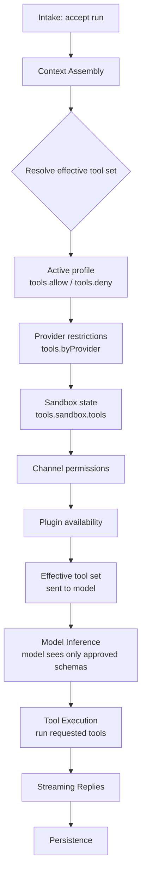
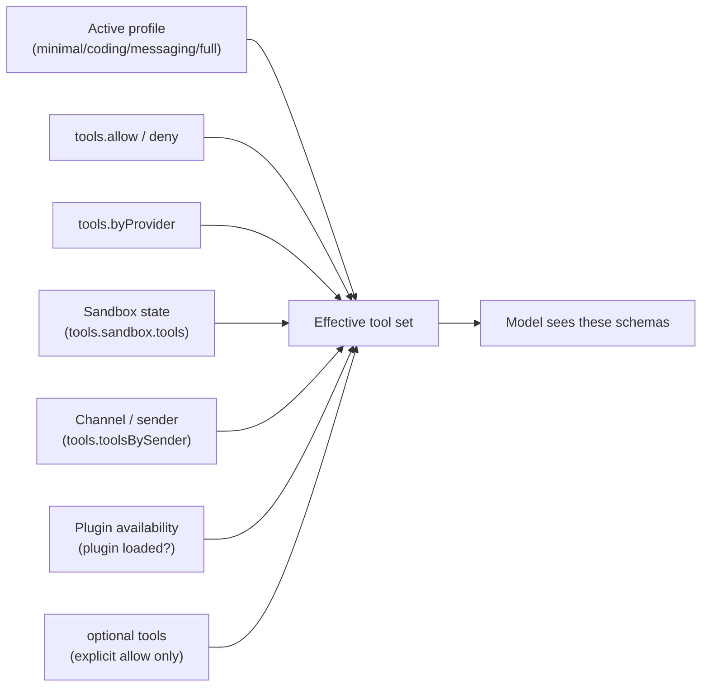

**TL;DR** — A tool is a typed function the model can call. Plugins register tools via `api.registerTool()`; OpenClaw resolves the *effective tool set* from profile, allow/deny policy, provider restrictions, sandbox state, and plugin availability before the model ever sees a schema. This chapter explains registration patterns (`optional`, `factory`), walks through each built-in category, and documents what happens at both failure paths: a tool that policy removes, and a tool a sandboxed session cannot access.

# Tool System: Registration, Effective Policy, and Built-in Categories

Every action the model can take — run a shell command, read a file, send a message, spawn a subagent — is backed by a *tool*: a named, typed, callable function that OpenClaw exposes to the model as a JSON schema definition. Understanding the tool system means understanding three things in sequence:

1. How plugins declare tools and hand them to the runtime.
2. How OpenClaw resolves which tools to actually show the model on any given turn — the *effective tool policy*.
3. What the built-in tool categories do and what groups they belong to.

## Quick recap: tools vs. skills vs. plugins

From [Plugins, Skills, and Tools](./11-plugins-skills-tools.md):

- A **tool** is a typed callable function the model can invoke — it carries a name, description, and parameter schema, and the model calls it by name in a structured function-call message.
- A **skill** is a `SKILL.md` instruction pack injected into the system prompt; it changes *how* the agent behaves but adds no new callable functions.
- A **plugin** is the runtime unit that *registers* tools (and channels, providers, hooks, etc.) via its `register(api)` callback.

You never register a tool directly into the global tool table. You register it through a plugin's API object.

## Where tool registration lives in the agent loop

The [agent loop](../agents/06-agent-loop.md) has six stages: intake → **context assembly** → model inference → tool execution → streaming replies → persistence. Tool policy is resolved during **context assembly** — before the model call. If a tool does not survive that resolution, the model never sees its schema definition and therefore cannot call it during this turn.

That single timing fact is the key to the entire chapter. Policy does not block tools at call time; it removes them from the model's menu at assembly time.



Every filter in the chain is cumulative. A tool must pass all of them to reach the model.

---

## Registering tools from a plugin

### The `api.registerTool()` call

Inside a plugin's `register(api)` callback, you register a tool by calling `api.registerTool(tool, opts?)`.

Think of the plugin's `register` function as an on-boarding session where the plugin hands OpenClaw a list of everything it can do. OpenClaw notes those capabilities; it does not immediately expose all of them to every model turn.

The simplest form passes a static tool object with a name, description, parameters schema, and an `execute` handler:

```ts
// Simplified view of a plugin's register function
import { definePluginEntry } from "openclaw/plugin-sdk/plugin-entry";

export default definePluginEntry({
  id: "my-tools-plugin",
  name: "My Tools Plugin",
  description: "Adds a greeting tool.",
  configSchema: { /* ... */ },
  register(api) {
    api.registerTool({
      name: "greet",
      label: "Greet",
      description: "Sends a greeting message.",
      parameters: {
        type: "object",
        properties: {
          name: { type: "string", description: "Name to greet" },
        },
        required: ["name"],
      },
      async execute(toolCallId, params, signal, onUpdate) {
        return { text: `Hello, ${params.name}!` };
      },
    });
  },
});
```

The `name` field is what the model calls. The `description` field is what the model reads to decide whether to call it. The `parameters` field is the JSON schema the model populates when it makes a tool call.

### `defineToolPlugin`: a shortcut for tool-only plugins

For plugins whose only job is to expose tools, the SDK provides `defineToolPlugin` — a helper that builds the plugin entry, manifest metadata, and `register()` wiring in one declaration. Internally it calls `api.registerTool()` for each tool in the `tools` list. Use `api.registerTool()` directly when your plugin also registers hooks, channels, or providers alongside its tools.

### The `optional` flag

By default, a registered tool is *required*: it appears in the effective tool set whenever policy allows it and the plugin is loaded. An `optional: true` tool behaves differently — it is registered with the runtime but **will not appear in the effective tool set unless it is explicitly named in an allow rule**.

Think of `optional` like a specialist on-call. The specialist is employed (the tool is registered), but they do not show up at every meeting (every model turn). The operator must explicitly invite them by name.

```ts
// Register a tool as optional — it only appears when explicitly allowed
api.registerTool(
  {
    name: "experimental_summarize",
    description: "Experimental summarization tool.",
    parameters: { /* ... */ },
    async execute(toolCallId, params, signal) { /* ... */ },
  },
  { optional: true },
);
```

To make this tool visible to the model, the operator adds it to the allowlist:

```json
{
  "tools": { "allow": ["experimental_summarize"] }
}
```

Without that explicit allow entry, the model never sees `experimental_summarize` — even if the plugin is loaded and the global profile is `"full"`.

**This is distinct from removal by policy.** A tool removed by policy *could* have appeared but was blocked. An `optional` tool waits for an explicit invitation and is never blocked in the policy-violation sense.

### Factory tools: runtime-context-aware registration

Sometimes you cannot decide at plugin-load time whether a tool should exist. You need to inspect the runtime state of the *current turn* — the specific session, sandbox mode, active model, filesystem policy, and so on.

For this, you pass a *factory function* instead of a static tool object. OpenClaw calls the factory at context-assembly time for each turn, passing an `OpenClawPluginToolContext` object. The factory returns a tool, an array of tools, or `null`/`undefined` to opt out.

```ts
// Factory tool: only exists in non-sandboxed sessions
api.registerTool(
  (toolContext) => {
    // If the current session is sandboxed, return null — tool does not exist this turn
    if (toolContext.sandboxed) {
      return null;
    }
    // Otherwise, return the tool definition
    return {
      name: "host_diagnostics",
      description: "Runs a host-level diagnostic command.",
      parameters: {
        type: "object",
        properties: {
          check: { type: "string" },
        },
        required: ["check"],
      },
      async execute(toolCallId, params, signal) {
        // ... run diagnostic
      },
    };
  },
  { name: "host_diagnostics" },
);
```

The `toolContext.sandboxed` field is `true` when the session is running under sandbox mode (`agents.defaults.sandbox.mode: "non-main"` or `"all"`). A factory that returns `null` when `toolContext.sandboxed` is `true` means the tool is invisible to the model in sandboxed turns — not blocked by policy, but never offered.

The `OpenClawPluginToolContext` carries additional fields a factory can consult:

| Field | What it provides |
|---|---|
| `sandboxed` | `true` if the current session is in a sandbox |
| `agentId` | The id of the active agent |
| `sessionKey` | The active session key |
| `fsPolicy` | Effective filesystem policy for the run |
| `activeModel` | Active provider and model id for this turn |
| `deliveryContext` | Ambient delivery route (channel, sender) |
| `requesterSenderId` | Trusted sender id from inbound context |

---

## Effective tool policy: how the set is resolved

We now know that tools are registered, but registered does not mean visible. Let's trace how OpenClaw resolves the effective tool set step by step.

### Step 1 — Start from the active profile

`tools.profile` sets the *base set* before any allow/deny adjustments. Think of it like a starter kit: the profile defines the default set of capabilities, and you then add or remove from there.

| Profile | What it includes |
|---|---|
| `minimal` | `session_status` only |
| `coding` | `group:fs`, `group:runtime`, `group:web`, `group:sessions`, `group:memory`, `cron`, `image`, `image_generate`, `skill_workshop`, `video_generate` |
| `messaging` | `group:messaging`, `sessions_list`, `sessions_history`, `sessions_send`, `session_status` |
| `full` | No restriction — same as unset (everything) |

Local onboarding defaults new local configs to `tools.profile: "coding"`. If `profile` is `"full"` or unset, all registered tools (including optional ones that are explicitly allowed) are candidates.

### Step 2 — Apply `tools.allow` and `tools.deny`

After the profile, global `tools.allow` and `tools.deny` refine the set. **Deny wins over allow.** Both support `*` wildcards and are case-insensitive.

```json
{
  "tools": {
    "profile": "coding",
    "deny": ["browser", "canvas"]
  }
}
```

That configuration starts from the `coding` profile and then removes `browser` and `canvas` from the effective set. The model will not see those two tools this turn.

One non-obvious detail: `write` and `apply_patch` are *separate* tool ids. Allowing `write` also enables `apply_patch` for compatible models, but denying `write` does **not** deny `apply_patch`. To block all file mutation:

```json
{
  "tools": { "deny": ["write", "edit", "apply_patch"] }
}
```

Or use the group:

```json
{
  "tools": { "deny": ["group:fs"] }
}
```

### Step 3 — Apply provider-specific restrictions

`tools.byProvider` lets you further restrict the tool set for specific providers or models. The resolution order is: base profile → provider profile → allow/deny.

```json
{
  "tools": {
    "profile": "coding",
    "byProvider": {
      "google-antigravity": { "profile": "minimal" },
      "openai/gpt-5.4": { "allow": ["group:fs", "sessions_list"] }
    }
  }
}
```

If the active model for this turn is `google-antigravity/some-model`, the effective base becomes `minimal` (only `session_status`) before global allow/deny apply.

### Step 4 — Apply sandbox state

When a session runs under sandbox mode (`non-main` or `all`), an additional gate applies: `tools.sandbox.tools`. Any tool not in the sandbox allowlist — even if the global profile would permit it — is filtered out for that turn.

```json
{
  "agents": { "defaults": { "sandbox": { "mode": "all" } } },
  "tools": {
    "sandbox": {
      "tools": {
        "alsoAllow": ["web_search", "web_fetch", "memory_search", "memory_get", "bundle-mcp"]
      }
    }
  }
}
```

Without an `alsoAllow` entry for a tool, that tool is invisible to the model during sandboxed turns — even if it is in `group:web` and the profile is `coding`.

### Step 5 — Apply channel permissions and sender-based restrictions

`tools.toolsBySender` restricts the tool set based on who sent the message. This is defense-in-depth on top of channel access control:

```json
{
  "tools": {
    "toolsBySender": {
      "channel:discord:1234567890123": { "alsoAllow": ["group:fs"] },
      "id:guest-user-id": { "deny": ["group:runtime", "group:fs"] },
      "*": { "deny": ["exec", "process", "write", "edit", "apply_patch"] }
    }
  }
}
```

Matching order from most to least specific: `channel:<channelId>:<senderId>`, `id:<senderId>`, `e164:<phone>`, `username:<handle>`, `name:<displayName>`, then wildcard `"*"`.

### Step 6 — Check plugin availability

A tool registered by a plugin only appears if that plugin is loaded. If the plugin is not installed, disabled, or fails to load, its tools are absent — no error, no warning in the model's schema list, only absence.

### The resolved picture

After all six steps, the surviving set of tool schemas is what OpenClaw serializes and passes to the model in the inference request. A tool that did not survive any of these filters will not appear in the tool list at all.



---

## Built-in tool categories

OpenClaw ships a set of built-in tools grouped by capability area. The table below lists every group and its tools. For exact policy group membership and allow/deny semantics, the canonical reference is [Tools and custom providers](../operations/18-configuration.md) (configuration chapter) and `docs/gateway/config-tools.md` in the source.

| Category | Group key | Representative tools | What the agent can do |
|---|---|---|---|
| Runtime | `group:runtime` | `exec`, `process`, `code_execution` | Run shell commands, manage background processes, run provider-backed code analysis (`bash` is an accepted alias for `exec`) |
| Files | `group:fs` | `read`, `write`, `edit`, `apply_patch` | Read and write workspace files |
| Web | `group:web` | `web_search`, `x_search`, `web_fetch` | Search the web, search X posts, fetch readable page content |
| Browser | `group:ui` | `browser`, `canvas` | Operate a live browser session, interact with a Canvas node |
| Messaging | `group:messaging` | `message` | Send replies or channel-native actions |
| Sessions and agents | `group:sessions` | `sessions_list`, `sessions_history`, `sessions_send`, `sessions_spawn`, `sessions_yield`, `subagents`, `session_status` | Inspect sessions, delegate work to subagents, steer another run |
| Agents list | `group:agents` | `agents_list`, `update_plan` | List configured agents; structured multi-step planning (experimental) |
| Automation | `group:automation` | `heartbeat_respond`, `cron`, `gateway` | Schedule recurring runs, respond to heartbeat events, inspect Gateway state |
| Gateway / nodes | `group:nodes` | `nodes` | Inspect and control paired node devices |
| Memory | `group:memory` | `memory_search`, `memory_get` | Search and retrieve from the active memory plugin |
| Media | `group:media` | `image`, `image_generate`, `music_generate`, `video_generate`, `tts` | Analyze incoming media, generate images, music, video, and speech |
| Tool search | *(standalone)* | `tool_search_code`, `tool_search`, `tool_describe` | Search and call large tool catalogs without putting every schema in the prompt |
| All OpenClaw built-ins | `group:openclaw` | (all of the above) | Every built-in tool; excludes provider-plugin tools |
| All plugin tools | `group:plugins` | *(varies by loaded plugins)* | All tools owned by loaded plugins, including MCP servers exposed through `bundle-mcp` |

### Runtime tools (`exec`, `process`, `code_execution`)

`exec` runs a shell command on the host (gateway or paired node). It is the most capable and most consequential tool OpenClaw ships — it can read, write, and delete files, run arbitrary programs, and make network calls. Exec approval gating (covered below) is the companion control.

`process` manages background processes spawned by a previous `exec` call. `code_execution` provides provider-backed sandboxed Python analysis (a separate execution path from host `exec`).

`bash` is accepted as an alias for `exec` in policy allow/deny lists, but `exec` is the canonical tool name.

### File tools (`read`, `write`, `edit`, `apply_patch`)

These four tools let the agent work with files in the workspace:

- `read` — read file content.
- `write` — write (create or overwrite) a file.
- `edit` — apply a targeted string replacement to an existing file.
- `apply_patch` — apply a unified diff patch.

`write` and `apply_patch` are distinct tool ids. Allowing one does not automatically allow the other (except the single case noted above: `allow: ["write"]` also enables `apply_patch` for compatible models).

### Web tools (`web_search`, `x_search`, `web_fetch`)

`web_search` queries a search provider (configurable under `tools.web.search`; requires an API key such as `BRAVE_API_KEY`). `x_search` queries X posts. `web_fetch` fetches and renders a URL as readable text (configurable under `tools.web.fetch`; optional Firecrawl integration).

### Browser tool (`browser`)

`browser` opens and drives a live browser session on a paired node. It allows the agent to navigate pages, click elements, fill forms, and extract content from dynamic sites. Because it runs on a real host, it is often restricted alongside `exec`.

### Messaging tool (`message`)

`message` sends a reply or performs a channel-native action (send a text message, post a reaction, send a file, etc.). This is how the agent delivers output to channels other than the one that triggered the run, or sends structured channel actions.

### Sessions and agents tools

These tools let a running agent coordinate with other sessions and agents:

- `sessions_list`, `sessions_history`, `sessions_send` — inspect and write to sessions within the configured visibility scope.
- `sessions_spawn` — start a subagent run in a new isolated session.
- `sessions_yield` — yield control back to a parent or caller.
- `subagents` — delegate work to a subordinate agent run and wait for the result.
- `session_status` — report status back to the calling session (used by subagents).

`sessions_spawn` and `subagents` are the subagent coordination tools; they enter the target agent's run queue and wait for a result. Agents do not communicate via a message bus — coordination is always through these tool calls.

### Automation tools (`cron`, `heartbeat_respond`)

`cron` lets the agent schedule itself or another agent for a recurring run at a cron interval. The scheduled run gets its own isolated session.

`heartbeat_respond` is called by the runtime when a configured heartbeat interval fires — it gives the agent an opportunity to act without a user message.

See [Automation and Scheduling](../automation/17-automation.md) for how these interact with the run queue.

### Media tools

The media group covers both *analysis* (understanding incoming images, audio, or video) and *generation* (creating new media content):

- `image` — analyze an incoming image attachment.
- `image_generate` — generate an image via a configured provider.
- `music_generate`, `video_generate` — generate audio/video.
- `tts` — text-to-speech synthesis.

### Tool Search tools (`tool_search`, `tool_search_code`, `tool_describe`)

When the agent has access to a large tool catalog, sending every schema to the model on every turn is expensive and noisy. Tool Search tools let the model discover and call tools without seeing all their schemas upfront. This is an experimental surface in the OpenClaw runtime; Codex-harness runs use Codex-native code mode and native tool search instead.

---

## Exec approval gating

Even when `exec` is in the effective tool set, it faces an additional approval layer. Exec approvals are a *host-level guardrail* — separate from tool policy — that sits on top.

The approval chain depends on two synchronized settings:

1. **`tools.exec.*` policy** (in `openclaw.json`) — controls the *requested* exec behavior.
2. **`~/.openclaw/exec-approvals.json`** (on the execution host) — controls the *host-local* approval behavior. The stricter of the two wins.

The exec approval modes are:

| Mode | Behavior |
|---|---|
| `deny` | Block all host exec requests |
| `allowlist` | Run only allowlisted commands without prompting |
| `ask` | Use allowlist; prompt on misses |
| `auto` | Use allowlist; send misses to OpenClaw's native auto-reviewer, then fall back to human approval |
| `full` | Run host exec without approval prompts (YOLO mode) |

When a prompt is required but no approval UI is reachable, the `askFallback` setting resolves the request — defaulting to `deny`.

---

## Two failure paths to understand

### Failure path 1: A tool is not in the effective policy

The model composes its function-call request based on the schemas it received. If a tool was removed during policy resolution, the model does not know it exists — it was never offered a schema for it.

What the model *cannot* do is call a tool it was never shown. If the model was planning to use `exec` and that tool was filtered out this turn (because the profile is `minimal`, or `exec` is in `tools.deny`, or the sandbox gate removed it), the model will proceed without `exec`. It may complete the task using other available tools, ask for clarification, or acknowledge that it cannot perform the requested action.

The operator can diagnose missing tools by checking the active policy:

1. Check the active profile, `tools.allow`, and `tools.deny`.
2. Check `tools.byProvider` for the active model.
3. Check sandbox state (`agents.defaults.sandbox.mode`) and `tools.sandbox.tools`.
4. Confirm the plugin that owns the tool is installed and enabled.
5. For optional tools: confirm the tool name is in an explicit `tools.allow` entry.

```bash
# Inspect the effective exec policy
openclaw approvals get

# Run the health check to find common policy mismatches
openclaw doctor
```

### Failure path 2: A sandboxed session attempts a tool that sandbox policy denies

Sandbox mode (`agents.defaults.sandbox.mode: "non-main"` or `"all"`) creates an isolated execution environment. The sandbox tool gate (`tools.sandbox.tools`) is *additive* to the main tool policy — it applies on top of whatever the global profile and allow/deny already permit.

When a session is sandboxed and a tool is not in the sandbox allowlist, that tool is filtered out during context assembly. The model does not see the schema. From the model's perspective, the tool does not exist for this turn.

A concrete example: suppose the global profile is `coding` (which includes `group:web`), but the sandbox allowlist does not include `web_search`. A sandboxed session will not see `web_search` — even though the profile would otherwise provide it. To restore visibility:

```json
{
  "agents": { "defaults": { "sandbox": { "mode": "non-main" } } },
  "tools": {
    "sandbox": {
      "tools": { "alsoAllow": ["web_search", "web_fetch"] }
    }
  }
}
```

The sandbox gate also applies to MCP server tools exposed through the `bundle-mcp` plugin. Without an explicit `bundle-mcp` or tool-name entry in the sandbox allowlist, those MCP tools are invisible in sandboxed turns — even if the MCP server loaded successfully.

> Run `openclaw doctor` to detect the most common sandbox/tool policy mismatches for OpenClaw-managed MCP servers in `mcp.servers`.

---

## Putting it together: a worked example

Suppose you have a `coding` profile, a sandboxed agent, and you want to allow web search but keep file writes blocked.

```json
{
  "tools": {
    "profile": "coding",
    "deny": ["write", "edit", "apply_patch"],
    "sandbox": {
      "tools": {
        "alsoAllow": ["web_search", "web_fetch"]
      }
    }
  },
  "agents": {
    "defaults": {
      "sandbox": { "mode": "non-main" }
    }
  }
}
```

Resolution for a non-main (sandboxed) turn:

1. Profile `coding` → base set includes `group:fs`, `group:runtime`, `group:web`, `group:sessions`, `group:memory`, `cron`, and others.
2. `deny: ["write", "edit", "apply_patch"]` → remove those three file-mutation tools.
3. Sandbox mode active → apply sandbox gate: tools must be in `alsoAllow`.
4. `alsoAllow: ["web_search", "web_fetch"]` → after the sandbox filter, only `web_search` and `web_fetch` survive.
5. Plugin availability → confirm those tools' plugins are loaded.

The model sees `web_search` and `web_fetch` — nothing else. All runtime, file, session, and media tools are absent for this turn because they are not in the sandbox `alsoAllow` list.

---

## Related

- [Plugins, Skills, and Tools](./11-plugins-skills-tools.md) — the three distinct primitives; how plugins are structured and loaded.
- [Skills](./13-skills.md) — `SKILL.md` structure, loading precedence, and token cost.
- [Hooks](./14-hooks.md) — `before_tool_call` hook for rewriting, blocking, or approval-gating tool calls at the point of execution.
- [Security](../operations/20-security.md) — sandbox mode configuration, network policy, and the full security model.
- [Agent Loop](../agents/06-agent-loop.md) — the six turn stages; where context assembly and tool execution fit.

---

← Previous: [Plugins, Skills, and Tools: Three Distinct Primitives](./11-plugins-skills-tools.md) · Next: [Skills: SKILL.md Structure, Loading Precedence, and Token Cost](./13-skills.md) →
