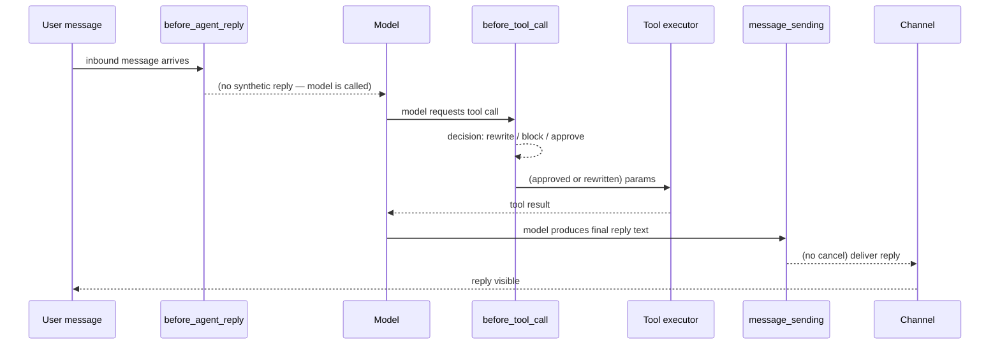

**TL;DR** — OpenClaw exposes two separate hook surfaces that look similar but serve different purposes: *internal* `HOOK.md` script-hooks for coarse operator automation (run on command and lifecycle events), and *plugin* hooks registered via `api.on()` for ordered in-process middleware (rewrite prompts, block tool calls, gate approval). This chapter covers both surfaces, enumerates the full plugin-hook catalog, and explains `before_tool_call` in depth — including how it rewrites parameters, blocks a call, and requests user approval.

# Agent Loop Hooks: Inventory, Priority, and before_tool_call in Depth

Every time an agent receives a message, calls a tool, or finishes a turn, OpenClaw fires named events along the way. Hooks are the extension point that lets you intercept those events — observe what is happening, modify it, or stop it entirely.

Think of hooks as the same idea as middleware in a web framework. Much as Express middleware can inspect, rewrite, or reject an HTTP request before it reaches your route handler, OpenClaw hooks can inspect, rewrite, or reject an agent action before it reaches the model or the channel.

## Two hook surfaces — and why they are different

Before we look at any individual hook, it is important to understand that OpenClaw has *two* hook surfaces with overlapping names. Confusing them is the most common source of frustration.

| Surface | Where you write it | What it can do | When to use it |
|---|---|---|---|
| **Internal hooks** (`HOOK.md` scripts) | `~/.openclaw/hooks/<name>/` directories | Side effects on command and lifecycle events | Operator automation: save a session snapshot on `/new`, call an API on `message:sent`, send a restart notice |
| **Plugin hooks** (`api.on(...)`) | Plugin entry point, via the Plugin SDK | Full middleware: rewrite prompts, block tool calls, cancel outbound messages, gate approval | Any ordered policy, safety gating, or content modification that needs to run reliably before an action takes effect |

The two surfaces overlap in names: both have a `message_received` / `message:received` event, for example. But only plugin hooks carry the block/cancel/rewrite decision contract. Internal hooks are fire-and-forget side-effect runners; they cannot stop a tool call or rewrite a prompt.

We'll cover internal hooks briefly, then spend the rest of this chapter on plugin hooks.

## Internal hooks (HOOK.md scripts)

An internal hook is a directory on disk with two files:

```
~/.openclaw/hooks/my-hook/
├── HOOK.md        # declares name, description, events, requirements
└── handler.ts     # the TypeScript handler that runs on each event
```

`HOOK.md` metadata tells OpenClaw which events to listen for and what the hook requires:

```markdown
---
name: my-hook
description: "Log every new session to an external endpoint"
metadata:
  { "openclaw": { "emoji": "📋", "events": ["command:new"] } }
---
```

The handler receives an event object with `type`, `action`, `sessionKey`, `timestamp`, `messages` (an array you can push reply strings into, for command events), and a `context` object with event-specific data:

```typescript
// handler.ts — simplified example based on the internal-hooks source
export default async function handler(event) {
  if (event.type !== "command" || event.action !== "new") {
    return; // filter early — only handle events you care about
  }

  // Log the new session key somewhere
  console.log("[my-hook] new session:", event.sessionKey);
}
```

**Internal hook event table:**

| Event key | When it fires |
|---|---|
| `command:new` | `/new` command issued |
| `command:reset` | `/reset` command issued |
| `command:stop` | `/stop` command issued |
| `command` | Any command event |
| `session:compact:before` | Before compaction summarizes history |
| `session:compact:after` | After compaction completes |
| `session:patch` | When session properties are modified |
| `agent:bootstrap` | Before workspace bootstrap files are injected |
| `gateway:startup` | After channels start and hooks are loaded |
| `gateway:shutdown` | When Gateway shutdown begins |
| `gateway:pre-restart` | Before an expected Gateway restart |
| `message:received` | Inbound message from any channel |
| `message:transcribed` | After audio transcription completes |
| `message:preprocessed` | After media and link preprocessing |
| `message:sent` | Outbound message delivered |

Manage internal hooks with the CLI:

```bash
openclaw hooks list           # see all discovered hooks
openclaw hooks enable <name>  # enable a bundled or managed hook
openclaw hooks info <name>    # check eligibility and requirements
openclaw hooks check          # eligibility summary for all hooks
```

The Gateway does not load any internal hooks on startup unless you have explicitly enabled at least one hook, configured a hook entry, or set `hooks.internal.enabled=true`. This means an out-of-the-box install has zero hook overhead until you opt in.

**What internal hooks cannot do.** An internal hook handler's return value is ignored by the runtime. Returning `{ block: true }` from `handler.ts` does nothing. If you need to block a tool call or cancel a message, you need a plugin hook.

## Plugin hooks (api.on)

Plugin hooks are in-process. They run inside the Gateway's Node process, not in a subprocess. This means they can be synchronous or async, they receive typed event objects, and — critically — some of them can return a *decision* that changes what the runtime does next.

The full hook inventory is grouped below by the surface they extend. Names in **bold** accept a decision result (block, cancel, rewrite, or require approval); all others are observation-only.

### Registering a plugin hook

Every plugin hook is registered in your plugin's `register(api)` function using `api.on(eventName, handler, options?)`. The handler receives a typed event object; for decision hooks, the return value is the decision.

```typescript
import { definePluginEntry } from "openclaw/plugin-sdk/plugin-entry";

export default definePluginEntry({
  id: "my-plugin",
  name: "My Plugin",
  register(api) {
    api.on(
      "before_tool_call",
      async (event) => {
        // inspect event.toolName, event.params, etc.
        // return a decision or undefined
      },
      { priority: 100 }, // higher number = runs first
    );
  },
});
```

`api.on` accepts two options:

| Option | Type | What it does |
|---|---|---|
| `priority` | `number` | Descending order — higher value fires first. Same-priority hooks run in registration order. |
| `timeoutMs` | `number` | Per-hook deadline in ms (max 600 000). The runner aborts this handler after the budget and continues with the next one. |

### Priority and ordering

When two plugins both register a handler for the same event, priority decides the order. Imagine it as a numbered queue: the handler with the highest number steps to the front of the line.

```
Plugin A registers before_tool_call with priority: 100
Plugin B registers before_tool_call with priority: 50
Plugin C registers before_tool_call with priority: 50

Execution order: A (100) → B (50) → C (50)
```

Plugin B and C share priority 50, so they run in the order they were registered. **The plugin with the highest priority value fires first.**

To answer the question directly: if two plugins both register `before_tool_call`, the one with the *higher* priority number fires first. If both have the same priority, the one registered first (plugin load order) fires first.

This ordering matters for decision hooks because a higher-priority handler's decision can prevent lower-priority handlers from running at all — we will see this in detail in the `before_tool_call` section.

Operators can override the per-hook timeout without touching plugin code:

```json
{
  "plugins": {
    "entries": {
      "my-plugin": {
        "hooks": {
          "timeoutMs": 30000,
          "timeouts": {
            "before_prompt_build": 90000,
            "agent_end": 60000
          }
        }
      }
    }
  }
}
```

`hooks.timeouts.<hookName>` overrides `hooks.timeoutMs`, which overrides the plugin-authored `{ timeoutMs }` option. This lets an operator tighten or loosen budgets without a plugin code change.

### Plugin hook catalog

#### Agent turn hooks

These fire around the model call that produces an agent reply.

| Hook | Decision? | When it fires / what it can do |
|---|---|---|
| `before_model_resolve` | ✓ override | Before session messages load — can override `provider` or `model` |
| `agent_turn_prepare` | — append/prepend | After queued plugin injections drain; before prompt hooks |
| `before_prompt_build` | — inject | Before model call — can prepend/append context or rewrite the system prompt |
| `before_agent_start` | — | Compatibility-only combined phase; prefer the two hooks above |
| **`before_agent_run`** | ✓ block | After prompt construction but before model input; can block the run and replace the user message |
| **`before_agent_reply`** | ✓ short-circuit | Can substitute a synthetic reply or silence — **fires before the model is called** |
| **`before_agent_finalize`** | ✓ revise/finalize | Runs when the harness is about to accept a natural final answer; can request one more model pass |
| `agent_end` | — | Observe final messages, success state, and run duration after the turn |
| `heartbeat_prompt_contribution` | — inject | Heartbeat turns only; contributes background-monitor context |

Notice `before_agent_reply`: its name says "reply," but it fires *before* the model call. This is the hook that can produce a synthetic reply *instead* of calling the model at all. If your plugin returns a fully-formed response from `before_agent_reply`, the model is never consulted for that turn.

#### Conversation observation hooks

These observe the raw model call. They intentionally do not receive prompt text or response content, only metadata:

| Hook | What it receives |
|---|---|
| `model_call_started` | Sanitized provider/model metadata, timing, `callId`, `runId` |
| `model_call_ended` | Same as above plus `durationMs`, `outcome`, `upstreamRequestIdHash` |
| `llm_input` | Provider input: system prompt, prompt, history |
| `llm_output` | Provider output, usage, `contextTokenBudget` |

#### Tool hooks

| Hook | Decision? | When it fires |
|---|---|---|
| **`before_tool_call`** | ✓ block/rewrite/approval | Before a tool executes — the primary gating surface |
| `after_tool_call` | — | After a tool returns; observe result, errors, duration |
| `resolve_exec_env` | — merge | Contribute env vars to `exec` invocations |
| **`tool_result_persist`** | ✓ rewrite | Rewrite the assistant message produced from a tool result |
| **`before_message_write`** | ✓ block | Inspect or block an in-progress message write (rare) |

#### Message and delivery hooks

| Hook | Decision? | When it fires |
|---|---|---|
| **`inbound_claim`** | ✓ claim | Claim an inbound message before agent routing |
| `message_received` | — | Observe inbound content, sender, thread, metadata |
| **`message_sending`** | ✓ cancel/rewrite | Rewrite outbound content or cancel delivery — **fires before delivery to the channel** |
| **`reply_payload_sending`** | ✓ cancel/rewrite | Mutate or cancel normalized reply payloads before channel handoff |
| `message_sent` | — | Observe delivery success or failure (observation only) |
| **`before_dispatch`** | ✓ inspect/rewrite | Inspect or rewrite an outbound dispatch before channel handoff |
| **`reply_dispatch`** | ✓ participate | Participate in the final reply-dispatch pipeline |

#### Session and compaction hooks

| Hook | When it fires |
|---|---|
| `session_start` | Session opens. `event.reason` is one of: `new`, `reset`, `idle`, `daily`, `compaction`, `deleted`, `shutdown`, `restart`, `unknown` |
| `session_end` | Session closes. Same `reason` set. `shutdown` and `restart` fire from the Gateway shutdown finalizer when the process stops while sessions are active |
| `before_compaction` | Before compaction summarizes history |
| `after_compaction` | After compaction completes |
| `before_reset` | Before a session reset (`/reset` or programmatic) |

The `shutdown` and `restart` values on `session_end` are important for plugins that maintain transcripts or memory stores — they let you finalize any "ghost" rows that would otherwise be left open across restarts. The shutdown finalizer is bounded: a slow `session_end` handler will not block `SIGTERM`/`SIGINT`.

#### Subagent hooks

| Hook | When it fires |
|---|---|
| `subagent_spawned` | Subagent launched. Includes `resolvedModel` and `resolvedProvider` when available |
| `subagent_ended` | Subagent completed |
| `subagent_delivery_target` | Compatibility — completion delivery when no core session binding can project a route |

#### Lifecycle hooks

| Hook | Decision? | When it fires |
|---|---|---|
| `gateway_start` | — | Start plugin-owned services with the Gateway. Context exposes `ctx.config`, `ctx.workspaceDir`, `ctx.getCron?.()` |
| `gateway_stop` | — | Clean up long-running plugin resources |
| `cron_changed` | — | Cron job added, updated, removed, started, finished, or scheduled |
| **`before_install`** | ✓ block | Inspect skill or plugin install context and optionally block |

## before_tool_call in depth

Now that we have the full inventory, let's look closely at `before_tool_call` — the most used decision hook.

### The problem it solves

The agent loop works by asking the model what to do next, then executing whatever tool the model requested. Without a hook, that execution is unconditional: if the model asks to run `exec` with a command, it runs. `before_tool_call` is the gate between "model decided to call this tool" and "tool actually runs."

Think of it like a security desk at a building entrance: the employee (the model) has their badge (the tool request), but the desk can still ask them to wait while someone is called, or turn them away entirely.

### What before_tool_call receives

The event object carries:

| Field | Description |
|---|---|
| `event.toolName` | The name of the tool being called |
| `event.params` | The parameters the model passed to the tool |
| `event.toolKind` | Optional discriminator for tools that share names (e.g., `"code_mode_exec"`) |
| `event.toolInputKind` | Optional input-language hint (e.g., `"javascript"`, `"typescript"`) |
| `event.derivedPaths` | Best-effort target path hints for known tool envelopes like `apply_patch` (may be incomplete) |
| `event.runId` | Optional — the active run id |
| `event.toolCallId` | Optional — the tool call id from the model |
| `ctx.agentId` | The agent that owns this run |
| `ctx.sessionKey` | The session key |
| `ctx.sessionId` | The session id |
| `ctx.jobId` | Set on cron-driven runs |

### The three things a before_tool_call hook can return

```typescript
type BeforeToolCallResult = {
  params?: Record<string, unknown>;   // rewrite the tool parameters
  block?: boolean;                    // true = stop the call
  blockReason?: string;               // internal reason (not shown to user)
  requireApproval?: {
    title: string;
    description: string;
    severity?: "info" | "warning" | "critical";
    timeoutMs?: number;
    timeoutBehavior?: "allow" | "deny";
    allowedDecisions?: Array<"allow-once" | "allow-always" | "deny">;
    pluginId?: string;
    onResolution?: (
      decision: "allow-once" | "allow-always" | "deny" | "timeout" | "cancelled",
    ) => Promise<void> | void;
  };
};
```

Let's walk through each option.

#### 1. Rewriting parameters

Return `{ params: { ...newParams } }` to change what the tool receives. The agent loop continues with the rewritten parameters — the tool runs, but with your version of the input instead of what the model requested.

```typescript
api.on("before_tool_call", async (event) => {
  if (event.toolName !== "web_search") {
    return; // only intercept web_search
  }

  // Force all searches to include a safe-search flag
  return {
    params: {
      ...event.params,
      safe_search: true,
    },
  };
});
```

This is useful for parameter normalization, adding required context, or enforcing invariants the model might miss.

#### 2. Blocking the call

Return `{ block: true }` to stop the tool call entirely. The loop does not error and does not crash — it feeds a cancellation result back to the model, which can then decide what to do next (ask the user, try a different tool, or give up).

```typescript
api.on("before_tool_call", async (event) => {
  if (event.toolName === "exec" && isBudgetExceeded()) {
    return {
      block: true,
      blockReason: "compute budget exceeded for this session",
    };
  }
});
```

**What happens next?** When a `before_tool_call` hook blocks a tool the model explicitly requested, the agent loop does not error. It continues: it records the block as the tool's result and sends that back to the model in the next turn. The model can then reply to the user explaining what happened, try a different approach, or ask for clarification. A blocked call is a clean failure, not a crash.

**Termination and priority.** `block: true` is *terminal*: once any handler returns `block: true`, the lower-priority handlers for this same event are skipped. There is no point running further checks once the call is already blocked.

#### 3. Requiring approval

Return `{ requireApproval: { ... } }` to pause the agent run and ask the user for consent. The tool does not run until the user approves, denies, or the timeout fires.

```typescript
api.on(
  "before_tool_call",
  async (event) => {
    if (event.toolName !== "web_search") {
      return;
    }

    return {
      requireApproval: {
        title: "Run web search",
        description: `Allow search query: ${String(event.params.query ?? "")}`,
        severity: "info",
        timeoutMs: 60_000,
        timeoutBehavior: "deny", // deny the call if no response arrives in time
      },
    };
  },
  { priority: 50 },
);
```

The user sees the `title` and `description` in the approval UI. The `/approve` command can approve both `exec`-style and plugin approvals. When the decision arrives, `onResolution` is called with one of: `"allow-once"`, `"allow-always"`, `"deny"`, `"timeout"`, or `"cancelled"`.

`timeoutBehavior` sets what happens when no user response arrives within `timeoutMs`:
- `"allow"` — the call proceeds as if approved.
- `"deny"` — the call is blocked as if the user rejected it.

**Important interaction:** A lower-priority `before_tool_call` hook can still return `block: true` *after* a higher-priority hook requested approval. The approval result does not prevent later handlers from blocking — it only resolves the higher-priority hook's request. This is worth keeping in mind when stacking multiple hooks on the same event.

### A complete before_tool_call example

Here is a plugin that combines all three behaviours — it logs the tool name, rewrites a parameter for a specific tool, and requires approval for destructive operations:

```typescript
import { definePluginEntry } from "openclaw/plugin-sdk/plugin-entry";

export default definePluginEntry({
  id: "tool-preflight",
  name: "Tool Preflight",
  register(api) {
    // Priority 100: normalize parameters for known tools
    api.on(
      "before_tool_call",
      async (event) => {
        if (event.toolName === "web_search") {
          return {
            params: { ...event.params, safe_search: true },
          };
        }
      },
      { priority: 100 },
    );

    // Priority 50: require approval before any file-write operation
    api.on(
      "before_tool_call",
      async (event) => {
        if (!["write_file", "apply_patch"].includes(event.toolName)) {
          return;
        }
        return {
          requireApproval: {
            title: `Write to file`,
            description: `Allow ${event.toolName} with ${JSON.stringify(event.params).slice(0, 120)}`,
            severity: "warning",
            timeoutMs: 120_000,
            timeoutBehavior: "deny",
          },
        };
      },
      { priority: 50 },
    );

    // Priority 10: block any exec call that runs as root
    api.on(
      "before_tool_call",
      async (event) => {
        if (event.toolName !== "exec") {
          return;
        }
        const cmd = String(event.params.command ?? "");
        if (cmd.startsWith("sudo ")) {
          return {
            block: true,
            blockReason: "sudo commands are not permitted by tool-preflight policy",
          };
        }
      },
      { priority: 10 },
    );
  },
});
```

In this example, for a `web_search` call, only the priority-100 handler runs (normalizing params). For a `write_file` call, the priority-50 handler fires and pauses for approval. For an `exec sudo ...` call, the priority-100 and priority-50 handlers both return `undefined` (no match), then the priority-10 handler blocks it.

## before_agent_reply vs message_sending — where each fires

These two hooks both appear to deal with "the agent's reply," and they overlap in purpose, but they fire at very different points in the pipeline.

**`before_agent_reply`** fires *before the model is called*. It is your opportunity to short-circuit the model turn entirely — produce a synthetic reply from plugin logic without any model inference. If you return a fully-formed response, the model call is skipped for that turn.

Use `before_agent_reply` when your plugin can answer the user without asking the model — for example, a FAQ plugin that pattern-matches known questions and returns cached answers directly.

**`message_sending`** fires *after the model has produced its reply* and *before that reply is delivered to the channel*. By this point the model has already done its work. `message_sending` is your last opportunity to rewrite or cancel what gets sent to the user.

Use `message_sending` when you need to post-process the model's output — for example, redacting sensitive patterns from the final text, translating the reply, or cancelling a delivery based on content-moderation rules.

```
Inbound message
     │
     ▼
┌─────────────────────────────────────────────────┐
│  before_agent_reply fires here                  │
│  → can produce a synthetic reply, skip model    │
│    if handler returns, model call is skipped    │
└─────────────────────────────────────────────────┘
     │  (if no synthetic reply, call the model)
     ▼
     Model produces reply text
     │
     ▼
┌─────────────────────────────────────────────────┐
│  message_sending fires here                     │
│  → can rewrite content or cancel delivery       │
│  → model call has already happened              │
└─────────────────────────────────────────────────┘
     │
     ▼
     Reply delivered to channel
```

The key difference: `before_agent_reply` = before the model, `message_sending` = after the model, before the channel.

## Hooks requiring conversation access

Some plugin hooks deal with prompt content and model responses. Non-bundled plugins must opt in explicitly to receive raw conversation hooks (`before_model_resolve`, `before_agent_reply`, `llm_input`, `llm_output`, `before_agent_finalize`, `agent_end`, `before_agent_run`) by setting:

```json
{
  "plugins": {
    "entries": {
      "my-plugin": {
        "hooks": {
          "allowConversationAccess": true
        }
      }
    }
  }
}
```

Prompt-mutating hooks and durable next-turn injections can be disabled per plugin with `plugins.entries.<id>.hooks.allowPromptInjection=false`.

## Hook firing points along the agent turn

To see how these hooks fit together around a single agent turn:



In a turn where `before_agent_reply` produces a synthetic reply, the model step and everything below it are skipped entirely.

## Deprecated surfaces to avoid

A few hook-adjacent surfaces are deprecated but still work. If you see them in existing plugins, prefer the replacements:

| Deprecated | Replacement | Notes |
|---|---|---|
| `before_agent_start` | `before_model_resolve` + `before_prompt_build` | Combined phase kept for compatibility |
| `subagent_spawning` | `subagent_spawned` | Thread routing now done by core before `subagent_spawned` fires |
| `deactivate` | `gateway_stop` | Compatibility alias; removal planned after 2026-08-16 |

## Prerequisites recap

This chapter builds on two concepts covered earlier:

- **Agent Loop** — hooks fire at specific points within the six stages of the agent loop (message intake, context build, model call, tool dispatch, result collect, reply dispatch). For a detailed walkthrough of the loop itself, see [Agent Loop](../agents/06-agent-loop.md).
- **Tool System** — `before_tool_call` gates a tool call that was resolved by the effective tool policy. For how tool policies work and what "effective policy" means, see [Tool System](./12-tool-system.md).

---

← Previous: [Skills: SKILL.md Structure, Loading Precedence, and Token Cost](./13-skills.md) · Next: [AI Model Integration: Provider Refs, Fallback Chains, and ThinkingLevel](../models/15-model-integration.md) →
