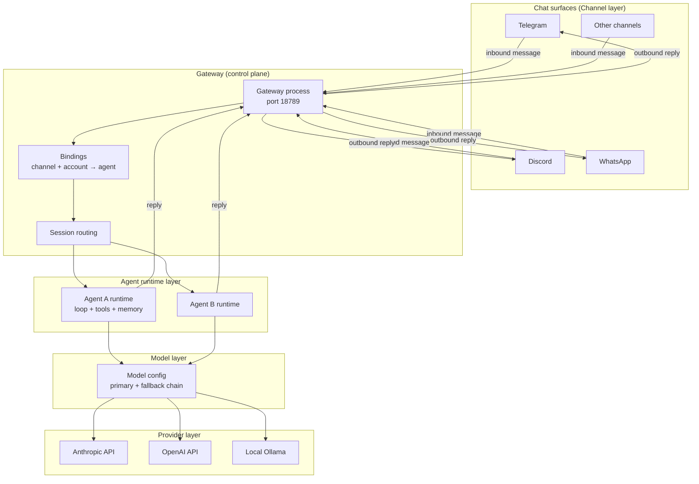
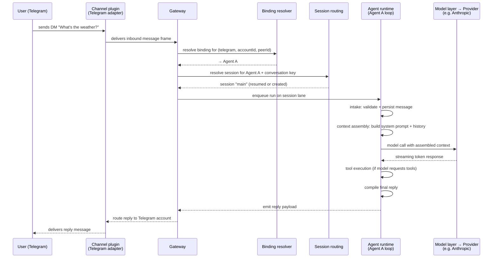

**TL;DR** — OpenClaw is organised into four layers: Provider (the AI API), Model (the model-selection config), Agent runtime (the code that runs your agent's loop), and Channel (the chat surface the user types into). A single process called the Gateway acts as the control plane that ties all four layers together, sitting on port 18789 and speaking a typed WebSocket protocol. By the end of this chapter you will be able to name every component a message passes through from the moment you type it in Telegram to the moment you receive the agent's reply.

# High-Level Architecture: Four Layers and the Gateway Control Plane

Before we look at any single part in depth, we need a map of the whole system. That map is what this chapter gives you. We will introduce each layer, explain why it exists as a distinct layer, and then trace a message end-to-end so every component appears in context at least once.

If you're arriving cold, the [Introduction](./01-introduction.md) covers what OpenClaw is and why it exists; in short, OpenClaw is a self-hosted, multi-channel AI gateway you run yourself — it lets you connect AI agents to messaging surfaces (Telegram, Discord, WhatsApp, and others) entirely under your own control.

Later chapters drill into each piece individually — the Gateway's wire protocol in [The Gateway](../gateway/03-gateway.md), channels in [Channels](../channels/04-channels.md), agents and their loops in [Agents](../agents/05-agents.md) and [The Agent Loop](../agents/06-agent-loop.md). Here we stay at the map level: enough detail to give you orientation, not so much that the picture becomes the territory.

## Why four distinct layers?

Think about what OpenClaw has to do. It needs to:

1. Hold a long-running conversation on Telegram, Discord, or any other messaging app — surfaces you do not control.
2. Route incoming messages to the right AI agent.
3. Let that agent think, call tools, and produce a reply.
4. Send that reply back through the correct messaging surface.
5. Do all of this against whichever AI provider (Anthropic, OpenAI, a local Ollama instance) the operator has configured.

If all of this lived in one undifferentiated blob of code, changing "which provider to call" would require understanding the Telegram adapter, and updating the Telegram adapter would require understanding how the model is selected. The four-layer model separates those concerns:

| Layer | What it is | What it owns |
|---|---|---|
| **Provider** | An AI API endpoint — Anthropic, OpenAI, Google, Groq, local Ollama, etc. | Authentication, HTTP transport, streaming wire format |
| **Model** | Configuration selecting which provider + model string to use | Primary model, fallback chain, provider-specific settings |
| **Agent runtime** | The code that runs one agent's loop | Context assembly, tool execution, session history, reply streaming |
| **Channel** | A messaging surface — Telegram, Discord, WhatsApp, Slack, Signal, iMessage | Inbound message delivery, outbound reply sending, session grammar |

These layers are not equally visible to the reader. The Provider and Model layers are mostly configuration; you write a few lines in `~/.openclaw/openclaw.json` to point at Anthropic and name your model. The Agent runtime and Channel layers are where the interesting runtime behaviour happens and where most later chapters live.

## The Gateway: the control plane

Here is the problem with a four-layer design: someone has to own the runtime coordination between layers. When a Telegram message arrives on the Channel layer, who decides which agent on the Agent runtime layer to invoke? When the agent invokes a tool, who routes the result back into the session? When you add a new agent through the CLI, who hot-reloads the routing table?

That coordinator is the **Gateway** — the single long-running process at the centre of OpenClaw.

The term "control plane" is borrowed from networking. Think of a router: the *data plane* moves packets from A to B; the *control plane* maintains the routing table that tells the data plane how to move them. OpenClaw's Gateway is the same idea at a higher level: it maintains the routing table (which agents exist, which channels are connected, which bindings map channels to agents), and it routes each incoming message to the right agent. The agents themselves handle the actual work — they are the data plane.

What the Gateway owns:

- **A single multiplexed port** (`127.0.0.1:18789` by default) that carries WebSocket RPC for control-plane clients and nodes, and the canvas host HTTP surface (served under `/__openclaw__/canvas/` and `/__openclaw__/a2ui/`) — all on the same port.
- **All channel connections**: WhatsApp via Baileys, Telegram via grammY, Slack, Discord, Signal, iMessage. The Gateway is the only place that opens a WhatsApp session; channels do not live elsewhere.
- **The agent registry**: a table of which agents are configured, their workspaces, and their routing bindings.
- **The wire protocol**: a typed JSON-over-WebSocket protocol that CLI tools, the macOS app, the web Control UI, and automations all use to talk to the Gateway.
- **Security gates**: authentication (token, password, or trusted-proxy mode), DM pairing approval, device pairing, and loopback-only binding by default.

The Gateway binds to loopback (`127.0.0.1`) by default — it is not publicly reachable unless you explicitly expose it. That default is intentional: it means your agents and channels are only reachable from the same machine until you opt in to remote access via Tailscale, a VPN, or an SSH tunnel.

## The four layers connected

Let's draw the architecture before tracing a message through it.



Notice a few things about this diagram:

- The Gateway is the only component that touches both the Channel layer and the Agent runtime layer. Channels do not talk to agents directly.
- The Model layer is not a service — it is configuration that lives inside each agent's runtime. The arrows from Agent runtime → Model → Provider represent a function call chain, not a network hop.
- Multiple agents can coexist on the same Gateway. Which one handles an incoming message depends on the **binding** — a rule that maps a (channel, account, peer) tuple to a specific agent. We will define bindings fully in [Multi-Agent Coordination](../coordination/16-multi-agent.md); for now, think of a binding as a routing rule.

## Introducing the terms you will see repeatedly

Before we trace a message, let's give a one-sentence definition to every OpenClaw-specific term that appears in the rest of this library. Each term is defined fully in a later chapter; what follows is enough to read the message-flow walkthrough below.

| Term | One-sentence definition |
|---|---|
| **Gateway** | The single long-running process that owns all channels, the agent registry, and the wire protocol. |
| **Channel** | A registered messaging surface (Telegram, Discord, WhatsApp, etc.) that can deliver inbound messages and receive outbound replies. |
| **Agent** | A named, configured AI persona with its own workspace, system prompt, and tool set, running on the agent runtime. |
| **Session** | A named conversation thread within an agent — the unit that carries history and accumulates context across multiple turns. |
| **Plugin** | An in-process extension loaded by the Gateway at startup; plugins can add channels, tools, memory backends, provider adapters, and lifecycle hooks. |
| **Binding** | A routing rule that maps a (channel, account, peer) tuple to a specific agent. |
| **Run** | A single execution of the agent loop for one incoming message — it ends when the agent has emitted a final reply or timed out. |

A note on **sessions**: if a binding maps a Telegram DM to Agent A, the Gateway creates (or resumes) a session for that conversation. Think of a session as a supermarket checkout lane — only one customer (one run) is processed at a time in that lane, and the lane remembers what happened in prior turns. Two different DM conversations with Agent A get two separate sessions (two lanes); they do not interfere with each other.

## Tracing a message end-to-end

Now we have the vocabulary. Let's follow a message from the moment you type it in Telegram to the moment Agent A replies.



Let's walk through each stage.

### Stage 1 — Inbound delivery (Channel layer)

The Telegram channel plugin, which is a plugin loaded by the Gateway at startup, maintains a persistent connection to Telegram's API. When you send a DM, the Telegram library (grammY) delivers it to the channel plugin as a callback. The plugin normalises the raw Telegram message into OpenClaw's internal message format and hands it to the Gateway as an inbound message frame.

The channel plugin also performs the first security gate: **DM pairing**. Only Telegram accounts the operator has explicitly paired are allowed to reach an agent through a personal DM. If your account is not in the approved list, the message is dropped before it reaches the routing layer. We will cover this fully in [Channels](../channels/04-channels.md).

### Stage 2 — Binding resolution (Gateway)

The Gateway looks up the binding for the tuple (channel: telegram, accountId: your Telegram account, peerId: your user ID). A binding is a rule in `~/.openclaw/openclaw.json` that says "when a message arrives from this channel and this account, route it to this agent." If no binding matches, the message is dropped. The Gateway does not guess.

### Stage 3 — Session routing (Gateway)

With the target agent known, the Gateway needs to decide *which session* within that agent to use. For a DM, the answer is the special `main` session — the agent's default conversation. For a group chat or a cron-triggered run, a different, isolated session is used. Session selection is deterministic: the Gateway derives a session key from the (channel, accountId, peerId) tuple and creates or resumes the corresponding JSONL-backed session. Sessions are covered in depth in [Sessions](../agents/07-sessions.md).

### Stage 4 — Enqueueing on the session lane (Agent runtime)

The Gateway enqueues the run on the session's lane — a serialized queue that ensures only one run executes at a time in that session. This prevents the agent from seeing the same conversation in two simultaneous, conflicting states. The run waits in the queue until the lane is free, then the agent runtime picks it up.

### Stage 5 — The agent loop (Agent runtime)

The agent runtime executes the loop in six conceptual stages (described fully in [The Agent Loop](../agents/06-agent-loop.md)):

1. **Intake** — validate the incoming message, persist it to the session transcript.
2. **Context assembly** — build the system prompt (agent persona, skills, bootstrap files) and assemble the message history, respecting token limits.
3. **Model inference** — call the configured AI provider with the assembled context; stream token chunks back as they arrive.
4. **Tool execution** — if the model requests a tool call, execute the tool and feed the result back into the loop.
5. **Streaming replies** — emit reply chunks to the Gateway as `assistant` events so the channel can deliver partial output.
6. **Persistence** — write the final turn to the session transcript.

The Model layer is invoked at step 3. The agent configuration specifies a primary model (e.g. `anthropic/claude-sonnet` — the provider prefix plus a model name, as an illustrative example) and an optional fallback chain. The runtime resolves the active provider, loads the auth profile (your `ANTHROPIC_API_KEY` or equivalent), and makes the HTTP call. The Provider layer is the remote API endpoint and nothing more — it does not know about sessions, channels, or tools.

### Stage 6 — Reply delivery (Gateway → Channel)

The agent runtime emits the final reply payload back to the Gateway. The Gateway looks up which channel and account the original message came from and routes the reply through the Telegram channel plugin, which sends it as a Telegram message to the original sender.

## Where the runtime code lives

If you ever want to read the source, here is where each layer lives in the monorepo:

```
src/agents/          ← Agent runtime: loop, session wiring, tool execution
src/llm/             ← Model layer: provider registry, transport helpers
src/channels/        ← Channel adapters (Telegram, Discord, WhatsApp, etc.)
src/gateway/         ← Gateway process: routing, protocol server, auth
packages/agent-core/ ← Reusable agent core: harness types, compaction, tool contracts
packages/gateway-protocol/  ← Wire protocol: TypeBox schemas, validators, frame types
extensions/          ← Optional plugins: memory backends, diagnostics, etc.
```

The agent runtime exposes extension points through `packages/agent-core/` and `packages/plugin-sdk/`. Plugins loaded by the Gateway import only from these barrels — they do not reach into `src/` internals.

## What this chapter does not cover

We have introduced every top-level component but deliberately stayed shallow on a few things:

- **The Gateway wire protocol** — `connect`/`req`/`res`/`event` JSON frames, the handshake, auth modes, and node pairing. That is [The Gateway](../gateway/03-gateway.md).
- **Channel session grammar** — how each channel maps conversations to session IDs, and the DM pairing model in detail. That is [Channels](../channels/04-channels.md).
- **The six agent loop stages** in detail — entry points, timeout configuration, compaction, streaming. That is [The Agent Loop](../agents/06-agent-loop.md).
- **Plugins** — what a plugin manifest looks like, how plugins are discovered, and the extension points they can use. That is [Plugins, Skills, and Tools](../extending/11-plugins-skills-tools.md).

For now, the map is enough. You know the four layers, you know the Gateway's role as control plane, and you can follow a message through all six routing stages from chat app to agent reply.

---

← Previous: [Introduction: What OpenClaw Is and Why It Exists](./01-introduction.md) · Next: [The Gateway: Port 18789, Wire Protocol, and Node Pairing](../gateway/03-gateway.md) →
