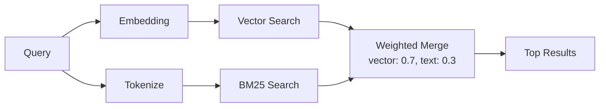
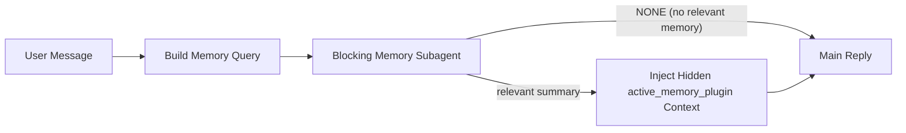
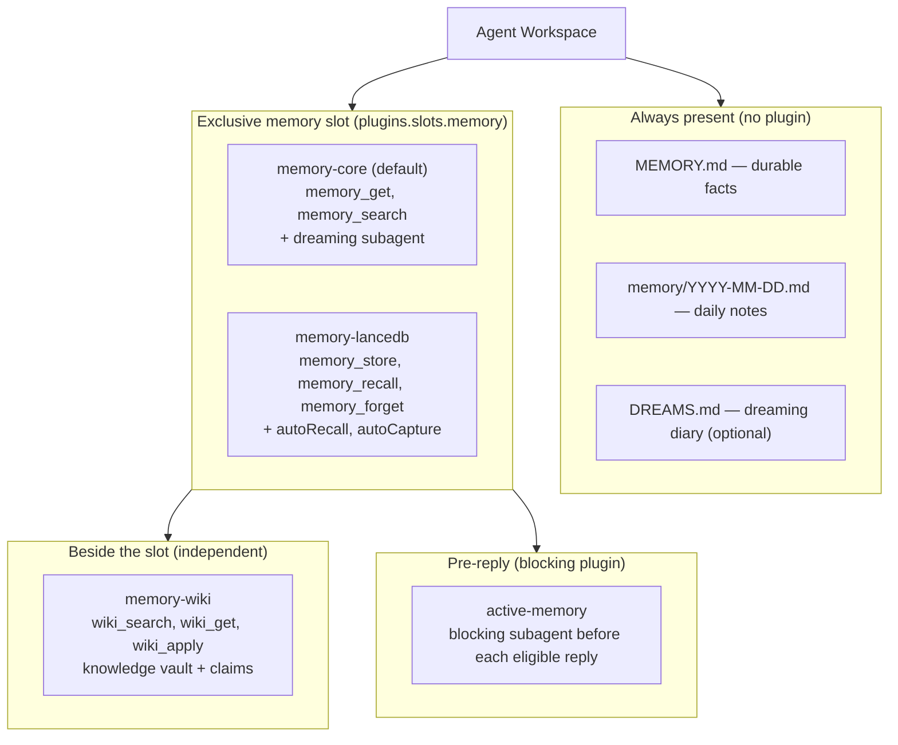

**TL;DR** — OpenClaw's memory system is built in layers. Plain Markdown files in the agent workspace are always present. On top of that, exactly one memory *plugin* can occupy an exclusive slot at a time — two plugins cannot safely write to the same index simultaneously. This chapter walks through all four memory implementations in increasing complexity, explains the dreaming subagent that promotes short-term signals into long-term memory, and introduces `active-memory`, a separate blocking plugin that injects recalled context before each reply.

# Memory System: File Memory, memory-core, memory-lancedb, and memory-wiki

Before we talk about plugins, it helps to understand why memory exists at all.

The agent does not carry state between sessions in its model weights. Everything it "knows" from previous conversations must be written to disk and loaded back into context before the next conversation begins. OpenClaw's memory system is the machinery that does that writing and loading — reliably, and without requiring the user to manually manage files.

Let's start with the simplest layer and work upward.

## Prerequisites

- **Agents and their workspace** — each agent has a directory at `~/.openclaw/agents/<agentId>/agent/` containing workspace files including `MEMORY.md` and the `memory/` folder. See [Agents](../agents/05-agents.md) for the full workspace layout.
- **The agent loop** — memory is loaded during the context assembly stage, before the model call. See [The Agent Loop](../agents/06-agent-loop.md).
- **System prompt injection** — `MEMORY.md` and today's daily notes are injected as bootstrap files on the first turn of each session. See [System Prompt and Context](../agents/09-system-prompt.md).

---

## Layer 1: File-based memory (always present, no plugin needed)

Think of this layer as a physical notebook and a daily log that the agent carries everywhere.

- **`MEMORY.md`** is like a compact notebook the agent reads before every DM conversation. It holds durable facts, preferences, and standing decisions — things the agent should always know. It is loaded at the start of every DM session as a bootstrap file.
- **`memory/YYYY-MM-DD.md`** (and `memory/YYYY-MM-DD-<slug>.md`) files are like daily diary pages. Today's and yesterday's notes are loaded automatically. Slugged variants — for example, those written by the bundled session-memory hook on `/new` or `/reset` — are picked up alongside the plain date file.
- **`DREAMS.md`** (optional) is a narrative Dream Diary produced by the dreaming subagent for human review. We will cover that below.

These files live in the agent workspace. There is nothing to configure — they work out of the box.

### What goes in each file

`MEMORY.md` is the compact, curated layer. Use it for durable facts and short summaries that should be available at the start of every DM session. It is not a raw transcript or daily log.

`memory/YYYY-MM-DD.md` files are the working layer. Use them for running observations, session summaries, and detailed notes that may still be useful later. These files are indexed for `memory_search` and `memory_get`, but they are not injected into the context on every turn.

### The budget problem

If `MEMORY.md` grows past the bootstrap file budget, OpenClaw keeps the full file on disk but truncates the copy injected into model context. That is the signal to move detailed material back into daily notes, keep only the durable summary in `MEMORY.md`, or raise the bootstrap limits. Use `/context list`, `/context detail`, or `openclaw doctor` to see raw versus injected sizes.

### Memory flush before compaction

When the conversation nears the context-window limit and compaction is about to summarize older messages, OpenClaw first runs a silent turn that reminds the agent to save important context to memory files. This is on by default. To keep that housekeeping turn on a specific local model, configure:

```json
{
  "agents": {
    "defaults": {
      "compaction": {
        "memoryFlush": {
          "model": "ollama/qwen3:8b"
        }
      }
    }
  }
}
```

The override applies only to the memory-flush turn and does not inherit the active session fallback chain.

---

## The exclusive memory plugin slot

Now we need to talk about the slot before we discuss the plugins that fill it.

OpenClaw enforces an exclusive memory plugin slot: at any moment, at most one memory plugin occupies the slot `plugins.slots.memory`. You cannot run `memory-core` and `memory-lancedb` simultaneously.

**Why exclusive?** Memory plugins share write access to the agent's memory index. If two plugins tried to write to the same index at the same time — promoting entries, updating embeddings, recording recall signals — they would produce conflicting state with no clear owner. One plugin might index a memory in a vector store while the other writes the same content in a different format; queries that expect one schema would return garbage from the other. The exclusive slot prevents that conflict by guaranteeing that exactly one plugin owns the index at any time.

Think of the slot like a whiteboard in a meeting room. Only one person should hold the marker at a time. Two people writing simultaneously in different formats leaves the board unreadable.

You declare which plugin occupies the slot in `openclaw.json`:

```json
{
  "plugins": {
    "slots": {
      "memory": "memory-lancedb"
    }
  }
}
```

If `plugins.slots.memory` is not set, the bundled `memory-core` plugin is the default.

---

## Layer 2: memory-core (bundled default)

**Analogy:** `memory-core` is like a librarian. It can retrieve specific pages you ask for, find notes by meaning (not only by keyword), and — when you enable dreaming — it works overnight to file the most important things into permanent storage.

`memory-core` is the default memory plugin. It registers two tools the agent can call:

| Tool | Purpose |
|---|---|
| `memory_get` | Read a specific memory file or line range by name |
| `memory_search` | Find relevant notes using semantic (hybrid) search, even when the wording differs |

When `memory_search` runs with an embedding provider configured, it uses **hybrid search** — combining vector similarity (semantic meaning) with BM25 keyword matching (exact terms like IDs and code symbols). The default embedding provider is OpenAI. Set `agents.defaults.memorySearch.provider` to use Gemini, Voyage, Mistral, a local GGUF model, Ollama, Bedrock, or GitHub Copilot instead.

### Configuring memory-core

`memory-core` is installed by default. Enable it explicitly in `openclaw.json`:

```json
{
  "plugins": {
    "entries": {
      "memory-core": {
        "enabled": true
      }
    }
  }
}
```

The plugin manifest (`extensions/memory-core/openclaw.plugin.json`) declares its kind as `"memory"` and its tool contracts as `["memory_get", "memory_search"]`. This is what OpenClaw reads during cold discovery before loading the plugin runtime.

### The dreaming subagent

Now we arrive at the most interesting part of `memory-core`: the dreaming subagent.

Here is the problem it solves. Over days and weeks, the agent accumulates many daily notes. Most of them contain short-lived context that does not deserve to live in `MEMORY.md` forever. But a few facts are mentioned again and again across multiple sessions — preferences, recurring decisions, durable context. Without help, those facts stay buried in dated files and never get promoted to the permanent layer.

Dreaming is the agent "sleeping" to sort through its notes and file the important ones away. More precisely, it is a background memory consolidation pass that collects short-term signals, scores candidates, and promotes only qualified items into `MEMORY.md`.

**Dreaming is opt-in and disabled by default.**

When enabled, `memory-core` auto-manages one cron job for a full dreaming sweep. Each sweep runs three phases in order:

| Phase | What it does | Writes to MEMORY.md? |
|---|---|---|
| Light | Ingests recent daily notes and recall traces, dedupes, and stages candidate lines | No |
| REM | Extracts theme and reflection patterns from recent short-term traces | No |
| Deep | Ranks candidates using weighted scoring and threshold gates; promotes qualified entries | Yes |

These phases are internal implementation details. You do not configure them individually for normal use.

**What the deep phase requires before promoting:** each candidate must pass a minimum score (`minScore`), a minimum recall frequency (`minRecallCount`), and a minimum query diversity gate (`minUniqueQueries`). A fact you mentioned only once in one context will not be promoted; a preference you have expressed across multiple different conversations will be.

Deep ranking uses six weighted signals:

| Signal | Weight | What it measures |
|---|---|---|
| Frequency | 0.24 | How many short-term signals the entry accumulated |
| Relevance | 0.30 | Average retrieval quality for the entry |
| Query diversity | 0.15 | Distinct query/day contexts that surfaced it |
| Recency | 0.15 | Time-decayed freshness |
| Consolidation | 0.10 | Multi-day recurrence strength |
| Conceptual richness | 0.06 | Concept-tag density from the snippet |

Light and REM phase hits add a small recency-decayed boost.

**When does dreaming run?** By default, at 3:00 AM daily (`0 3 * * *`). The sweep includes the primary runtime workspace and any configured agent workspaces, deduped by path.

**Dream Diary:** after each phase accumulates enough material, `memory-core` runs a background subagent turn and appends a short diary entry to `DREAMS.md` for human reading. This diary is not a promotion source — only grounded memory snippets are eligible to promote into `MEMORY.md`.

**Enabling dreaming:**

```json
{
  "plugins": {
    "entries": {
      "memory-core": {
        "config": {
          "dreaming": {
            "enabled": true
          }
        }
      }
    }
  }
}
```

**Custom schedule and model:**

```json
{
  "plugins": {
    "entries": {
      "memory-core": {
        "subagent": {
          "allowModelOverride": true,
          "allowedModels": ["anthropic/claude-sonnet-4-6"]
        },
        "config": {
          "dreaming": {
            "enabled": true,
            "frequency": "0 */6 * * *",
            "timezone": "America/Los_Angeles",
            "model": "anthropic/claude-sonnet-4-6"
          }
        }
      }
    }
  }
}
```

`dreaming.model` requires `plugins.entries.memory-core.subagent.allowModelOverride: true`. Trust or allowlist failures stay visible instead of falling back silently; retry only covers model-unavailable errors.

**Dreaming slash commands:**

```
/dreaming status
/dreaming on
/dreaming off
/dreaming help
```

**Dreaming CLI:**

```bash
openclaw memory promote              # preview promotion candidates
openclaw memory promote --apply      # run deep promotion
openclaw memory promote --limit 5    # limit to 5 candidates
openclaw memory promote-explain "topic"  # explain why a candidate would or would not promote
openclaw memory status --deep        # inspect dreaming state and index health
```

**Blocked status:** if `openclaw memory status` reports `Dreaming status: blocked`, the managed cron exists but the default agent heartbeat is not firing. Check that heartbeat is enabled for the default agent and that its target is not `none`.

The dreaming sweep is a concrete example of scheduled automation. For the broader automation model (cron jobs, heartbeats, and how they integrate with the agent loop), see [Automation and Scheduling](../automation/17-automation.md).

---

## Layer 3: memory-lancedb (vector database)

**Analogy:** `memory-lancedb` is like upgrading from a paper index card box to a searchable digital database with full semantic understanding — every stored memory is encoded as a mathematical vector, so searches find meaning, not only keywords.

`memory-lancedb` is an official external plugin that stores memories in a [LanceDB](https://lancedb.github.io/lancedb/) vector database with OpenAI-compatible embeddings. It registers three tools:

| Tool | Purpose |
|---|---|
| `memory_store` | Explicitly store a new memory entry |
| `memory_recall` | Retrieve relevant memories using vector similarity |
| `memory_forget` | Remove a stored memory entry |

The plugin manifest (`extensions/memory-lancedb/openclaw.plugin.json`) declares its kind as `"memory"` and its contract tools as `["memory_forget", "memory_recall", "memory_store"]`. Note: `memory-lancedb` replaces `memory-core` in the exclusive slot — they cannot run together.

### Configuring memory-lancedb

Install and configure:

```json
{
  "plugins": {
    "slots": {
      "memory": "memory-lancedb"
    },
    "entries": {
      "memory-lancedb": {
        "enabled": true,
        "config": {
          "embedding": {
            "provider": "openai",
            "model": "text-embedding-3-small"
          }
        }
      }
    }
  }
}
```

The `embedding` object (with at least one property) is required for `memory-lancedb`. The `dbPath` defaults to `~/.openclaw/memory/lancedb`.

### Auto-recall and auto-capture

`memory-lancedb` supports two automation features:

- **`autoRecall`** — automatically injects relevant memories into context at the start of each turn, without the agent needing to call `memory_recall` explicitly.
- **`autoCapture`** — automatically captures important information from conversations and stores it, without the agent needing to call `memory_store` explicitly.

Both are configured as booleans under `plugins.entries.memory-lancedb.config`. `captureMaxChars` (100–10,000; placeholder: 500) caps message length eligible for auto-capture. `customTriggers` is a list of literal phrases that make auto-capture consider a message memory-worthy.

### Key configuration options

| Key | Type | Description |
|---|---|---|
| `embedding.provider` | `string` | Embedding adapter: `openai`, `github-copilot`, `ollama`, etc. |
| `embedding.model` | `string` | Embedding model name (e.g. `text-embedding-3-small`) |
| `embedding.baseUrl` | `string` | Optional OpenAI-compatible endpoint override |
| `embedding.dimensions` | `integer` | Vector dimensions for custom models |
| `dbPath` | `string` | Filesystem path for the LanceDB store |
| `autoCapture` | `boolean` | Automatically capture important conversation content |
| `autoRecall` | `boolean` | Automatically inject relevant memories into context |
| `captureMaxChars` | `number` | Max message length eligible for auto-capture |
| `recallMaxChars` | `number` | Max query length embedded for recall |
| `customTriggers` | `string[]` | Phrases that trigger auto-capture |
| `storageOptions` | `object` | Storage config (access_key, secret_key, endpoint); supports `${ENV_VAR}` |

`memory-lancedb` also accepts a `dreaming` config object (consumed when this plugin owns the memory slot), following the same shape as `memory-core`'s dreaming config.

---

## Layer 4: memory-wiki (knowledge vault — beside the slot, not in it)

Here is the most important thing to understand about `memory-wiki`: **it does not occupy the exclusive memory slot**. It sits beside the active memory plugin as a companion.

**Analogy:** if `memory-core` is a librarian who reads and files your notes, `memory-wiki` is a separate encyclopedia editor who compiles verified facts, tracks contradictions, and maintains a structured reference volume. Both can work in the same building. The librarian owns the filing cabinet (the slot); the encyclopedia editor has a separate vault.

`memory-wiki` compiles durable knowledge into a wiki vault with:

- deterministic page structure
- structured claims and evidence
- contradiction and freshness tracking
- generated dashboards
- compiled digests for agent and runtime consumers

The plugin manifest (`extensions/memory-wiki/openclaw.plugin.json`) registers these tools:

| Tool | Purpose |
|---|---|
| `wiki_search` | Search the wiki vault for relevant knowledge |
| `wiki_get` | Retrieve a specific wiki page |
| `wiki_apply` | Apply compiled changes to the wiki vault |
| `wiki_lint` | Check wiki pages for issues |
| `wiki_status` | Report current wiki state |

### How memory-wiki differs from memory-core

Both offer search, but they search different things:

| | memory-core (`memory_search`) | memory-wiki (`wiki_search`) |
|---|---|---|
| What is indexed | Daily notes, `MEMORY.md`, raw observations | Compiled, structured wiki pages with claims and evidence |
| Content shape | Free-form Markdown notes | Deterministic page structure, provenance-rich |
| Primary purpose | Recall of anything the agent has noted | Lookup of curated, verified knowledge |
| Contradiction tracking | No | Yes |
| Dashboards | No | Yes |

**When to choose one over the other:** use `memory-core` (or `memory-lancedb`) as the primary recall layer for everyday conversation memory. Add `memory-wiki` when you want durable knowledge to behave more like a maintained knowledge base — when you care about provenance, contradiction detection, and structured pages rather than raw notes.

The two can operate simultaneously. `memory-wiki` does not replace the active memory plugin; the active memory plugin still owns recall, promotion, and dreaming. `memory-wiki` adds a provenance-rich knowledge layer beside it.

### Searching across both

When `memory-wiki` is installed alongside an active memory plugin, you can search both at once:

```json
{
  "plugins": {
    "entries": {
      "memory-wiki": {
        "config": {
          "search": {
            "corpus": "all"
          }
        }
      }
    }
  }
}
```

The `search.corpus` field accepts `"wiki"` (wiki only), `"memory"` (active memory plugin only), or `"all"` (both).

### Vault modes

`memory-wiki` supports three vault isolation modes, configured via `vaultMode`:

| Mode | What it means |
|---|---|
| `isolated` | The wiki vault is entirely separate from the active memory plugin |
| `bridge` | Reads public memory artifacts and events from the active memory plugin |
| `unsafe-local` | Experimental same-repository escape hatch for reading private `memory-core` paths |

In `bridge` mode, additional options under `plugins.entries.memory-wiki.config.bridge` control what is read: `readMemoryArtifacts`, `indexDreamReports`, `indexDailyNotes`, `indexMemoryRoot`, and `followMemoryEvents`.

`unsafe-local` mode is experimental and intended for same-process access to private memory paths. Its use requires `unsafeLocal.allowPrivateMemoryCoreAccess: true`.

### Enabling memory-wiki

`memory-wiki` activates on startup (`"onStartup": true` in its manifest). A minimal setup:

```json
{
  "plugins": {
    "entries": {
      "memory-wiki": {
        "enabled": true,
        "config": {
          "vaultMode": "isolated"
        }
      }
    }
  }
}
```

`memory-wiki` also loads skills from its local `./skills` directory, which extend the agent's behavior for wiki-related workflows.

For Obsidian users, `memory-wiki` supports an Obsidian-friendly render mode and can probe and use the official Obsidian CLI when `obsidian.useOfficialCli: true` is set.

---

## Memory search (the shared retrieval pipeline)

Regardless of which plugin occupies the slot, `memory_search` uses **hybrid search** when an embedding provider is configured: vector similarity (finds semantic meaning) plus BM25 keyword matching (finds exact terms like IDs, config keys, error strings). The two paths run in parallel and their results are merged.



All memory search settings live under `agents.defaults.memorySearch` in `openclaw.json`. The default embedding provider is `openai`. Supported providers include `bedrock`, `deepinfra`, `gemini`, `github-copilot`, `local` (GGUF), `mistral`, `ollama`, `openai`, `openai-compatible`, and `voyage`.

Two optional tuning features:

- **Temporal decay** — old notes gradually lose ranking weight so recent notes surface first. Default half-life: 30 days. Evergreen files like `MEMORY.md` are never decayed.
- **MMR (Maximal Marginal Relevance)** — reduces redundant results. Useful when multiple daily notes contain near-duplicate content on the same topic.

**CLI commands:**

```bash
openclaw memory status          # check index status and provider
openclaw memory search "query"  # search from the command line
openclaw memory index --force   # rebuild the index
```

---

## active-memory: the blocking pre-reply plugin

We have been discussing how the agent retrieves memory when it decides to. Now we turn to a different problem.

Most memory systems are reactive — they rely on the agent deciding when to call `memory_search`, or on the user explicitly saying "remember this." By the time the agent or user acts, the natural moment where recalled context would have shaped the reply has already passed.

`active-memory` is a separate plugin — it does not occupy the exclusive memory slot — that solves this by running a bounded blocking memory subagent before each eligible reply. Think of it as a research assistant who quickly scans your notes every time you are about to say something, and hands you a short summary to read first.

The plugin manifest (`extensions/active-memory/openclaw.plugin.json`) declares its name as `"Active Memory"` and describes its purpose: "Runs a bounded blocking memory sub-agent before eligible conversational replies and injects relevant memory into prompt context."

### How it works



The blocking memory subagent calls only the configured memory recall tools. With the default `memory-core`, those are `memory_search` and `memory_get`. When `plugins.slots.memory` is `memory-lancedb`, the default tool is `memory_recall` instead. The subagent injects the result as a hidden untrusted prompt prefix — the raw `<active_memory_plugin>` tags are not visible in the normal client reply.

### Eligibility gates

Active memory uses two gates — both must pass:

1. **Config opt-in:** the plugin must be enabled, and the current agent id must appear in `config.agents`.
2. **Runtime eligibility:** the session must be an eligible interactive persistent chat session. Active memory does not run for headless one-shot runs, heartbeat/background runs, or subagent execution.

| Surface | Runs active memory? |
|---|---|
| Control UI / web chat persistent sessions | Yes, if enabled and agent targeted |
| Other interactive channel sessions on the persistent chat path | Yes, if enabled and agent targeted |
| Headless one-shot runs | No |
| Heartbeat/background runs | No |
| Subagent/internal helper execution | No |

`config.allowedChatTypes` (default: `["direct"]`) controls which session types may run active memory. `config.allowedChatIds` is an optional explicit allowlist; `config.deniedChatIds` is a denylist that always overrides allowed types and ids.

### Query modes

`config.queryMode` controls how much conversation context the blocking subagent sees:

| Mode | What it sends | Recommended timeout |
|---|---|---|
| `message` | Latest user message only | 3,000–5,000 ms |
| `recent` | Latest message plus a small recent tail (default) | 15,000 ms |
| `full` | Full conversation | 15,000 ms or higher |

Start with `recent`. Move to `message` for lower latency; move to `full` only if extra context clearly improves recall quality.

### Prompt styles

`config.promptStyle` controls how eager the subagent is when deciding whether to return memory:

| Style | Behavior |
|---|---|
| `balanced` | General-purpose default for `recent` mode |
| `strict` | Least eager; minimizes spurious returns |
| `contextual` | Most continuity-friendly; conversation history matters more |
| `recall-heavy` | More willing to surface memory on softer matches |
| `precision-heavy` | Aggressively prefers `NONE` unless the match is obvious |
| `preference-only` | Optimized for favorites, habits, routines, and recurring personal facts |

Default mapping when `config.promptStyle` is unset:

| Query mode | Default prompt style |
|---|---|
| `message` | `strict` |
| `recent` | `balanced` |
| `full` | `contextual` |

### Model resolution

If `config.model` is unset, active memory resolves a model in this order:

```
explicit plugin model
  → current session model
  → agent primary model
  → configured fallback (config.modelFallback)
```

If none resolves, active memory skips recall for that turn.

### Circuit breaker

To avoid slowing every reply when the recall subagent is consistently timing out, active memory has a circuit breaker:

| Config key | Default | Range | Meaning |
|---|---|---|---|
| `config.circuitBreakerMaxTimeouts` | 3 | 1–20 | Skip recall after this many consecutive timeouts for the same agent/model |
| `config.circuitBreakerCooldownMs` | 60,000 ms | 5,000–600,000 ms | How long to skip recall after the circuit trips |

The circuit breaker resets on a successful recall or after the cooldown expires.

### Timeout

`config.timeoutMs` is the hard timeout for the blocking subagent, capped at 120,000 ms. A separate `config.setupGraceTimeoutMs` (default 0, capped at 30,000 ms) provides extra budget for cold-start setup (model warm-up, embedding index load) before the main timeout is considered exhausted.

### Minimal recommended setup

```json
{
  "plugins": {
    "entries": {
      "active-memory": {
        "enabled": true,
        "config": {
          "enabled": true,
          "agents": ["main"],
          "allowedChatTypes": ["direct"],
          "queryMode": "recent",
          "promptStyle": "balanced",
          "timeoutMs": 15000,
          "maxSummaryChars": 220,
          "logging": true
        }
      }
    }
  }
}
```

Then restart the gateway:

```bash
openclaw gateway
```

To inspect active memory in a live conversation:

```
/verbose on
/trace on
```

With both enabled, you will see a status line and a debug summary after each reply:

```
Active Memory: status=ok elapsed=842ms query=recent summary=34 chars
Active Memory Debug: Lemon pepper wings with blue cheese.
```

### Session toggle

```
/active-memory status
/active-memory off
/active-memory on
```

This is session-scoped. For a global toggle that writes config:

```
/active-memory status --global
/active-memory off --global
/active-memory on --global
```

### Failure path: circuit breaker trips

If `openclaw memory status --deep` shows healthy recall but active memory repeatedly returns `status=timeout`, check that the configured model is available, that embedding index load has completed, and that `timeoutMs` is large enough for cold start. If timeouts persist, the circuit breaker will trip after `circuitBreakerMaxTimeouts` consecutive failures and pause recall for `circuitBreakerCooldownMs`. The main reply continues without memory context during the cooldown.

---

## How the four implementations relate

Let's step back and see the full picture:



**Summary by use case:**

| Use case | What to use |
|---|---|
| Basic memory, no setup | File-based (`MEMORY.md` + daily notes) |
| Searchable notes with hybrid retrieval | `memory-core` (default slot) |
| Long-term promotion without manual curation | `memory-core` + dreaming enabled |
| Vector-first search with explicit store/recall/forget | `memory-lancedb` in the slot |
| Structured knowledge base with provenance and claims | `memory-wiki` beside the slot |
| Automatic context recall before every reply | `active-memory` (separate plugin) |

---

← Previous: [System Prompt and Context: Assembly, Bootstrap Injection, and Compaction](../agents/09-system-prompt.md) · Next: [Plugins, Skills, and Tools: Three Distinct Primitives](../extending/11-plugins-skills-tools.md) →
