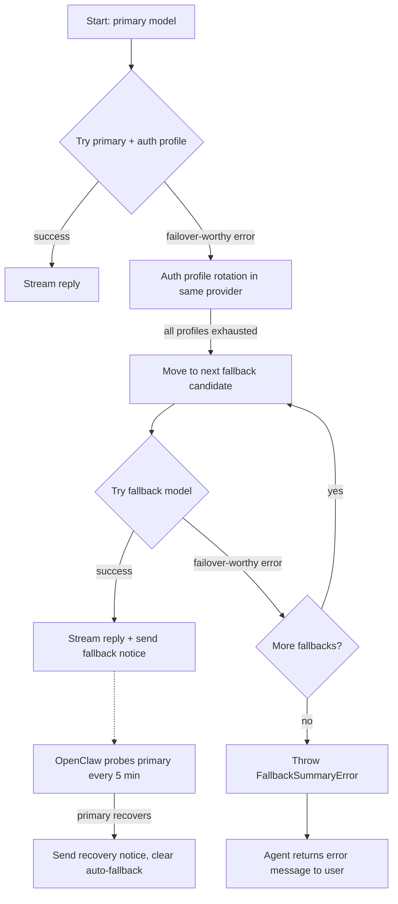
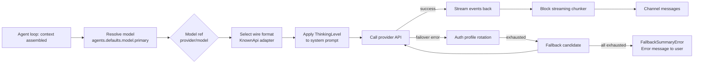

**TL;DR** — OpenClaw routes every model call through a `provider/model` ref string, an ordered fallback chain, and a typed wire-format adapter. This chapter walks through how to configure that ref, what happens when a model fails, how `ThinkingLevel` controls reasoning depth, how streaming output reaches channels, and why the Gateway also speaks the OpenAI Chat Completions wire format.

# AI Model Integration: Provider Refs, Fallback Chains, and ThinkingLevel

Every agent conversation eventually reaches the **model inference stage** — the moment the assembled context is handed to an AI model and the response starts streaming back. Everything covered in the [Agent Loop](../agents/06-agent-loop.md) leads to this stage, and what happens here shapes the quality, cost, and reliability of every reply.

This chapter covers the four wiring concerns you'll encounter when connecting OpenClaw to AI models: choosing the right model, surviving failures, tuning reasoning depth, and optionally exposing the Gateway to tools that speak OpenAI's HTTP wire protocol.

---

## The `provider/model` ref string

Before OpenClaw can call any model, it needs to know two things: which company or server hosts it, and which specific model on that server to request. OpenClaw represents both as a single slash-delimited string:

```
provider/model
```

For example:

| Ref | What it means |
|---|---|
| `anthropic/claude-opus-4-6` | Anthropic's API, the `claude-opus-4-6` model |
| `openai/gpt-5.5` | OpenAI's API (Codex harness by default), the `gpt-5.5` model |
| `openai/gpt-5.4` | OpenAI's API, a different model on the same provider |
| `google/gemini-3.1-pro-preview` | Google Gemini API, the pro preview model |
| `moonshot/kimi-k2.6` | Moonshot AI's API, the Kimi K2.6 model |
| `ollama/llama3.3` | Local Ollama server, the llama3.3 model |

Model refs are normalized to lowercase. When a model ID itself contains a `/` — as on OpenRouter — you must include the provider prefix so the parser splits on the *first* `/`:

```
openrouter/moonshotai/kimi-k2.6
```

### Setting your primary model

The global default model lives at `agents.defaults.model.primary` (or its shorthand `agents.defaults.model`) in `~/.openclaw/openclaw.json`:

```json5
{
  agents: {
    defaults: {
      model: { primary: "anthropic/claude-opus-4-6" },
    },
  },
}
```

Per-agent overrides live at `agents.list[].model`, letting different agents use different models on the same Gateway.

### Model allowlist

When `agents.defaults.models` is set, it acts as an allowlist: only listed refs are available in the model picker and to `/model` session commands. If a user or cron job selects a ref that is not in the allowlist, OpenClaw replies with an explicit error before generating any response:

```
Model "provider/model" is not allowed. Use /models to list providers...
```

You can add entries additively without wiping the existing list:

```bash
openclaw config set agents.defaults.models '{"openai/gpt-5.4":{}}' --strict-json --merge
```

Use `provider/*` entries to allowlist an entire provider without enumerating every model:

```json5
{
  agents: {
    defaults: {
      models: {
        "anthropic/*": {},
        "openai/*": {},
      },
    },
  },
}
```

---

## The fallback chain — your backup phone numbers

Think of the fallback chain as a list of backup phone numbers. When your primary contact (the primary model) doesn't pick up, you try the next number on the list. You don't go back to the first number while the others are still available — you move down the list in order.

```json5
{
  agents: {
    defaults: {
      model: {
        primary: "anthropic/claude-opus-4-6",
        fallbacks: [
          "openai/gpt-5.4",
          "google/gemini-3.1-pro-preview",
        ],
      },
    },
  },
}
```

### What happens when the primary fails

OpenClaw does **not** retry the primary model immediately after a failure. The runtime advances to the next fallback candidate right away, without probing the failed primary again on that turn. Here is the step-by-step flow:



The auto-selected fallback is persisted to the session with `modelOverrideSource: "auto"` so subsequent turns don't probe the known-bad primary on every message. OpenClaw periodically probes the original primary (every five minutes, not configurable) and clears the auto-fallback once the primary recovers, sending a status notice:

```
↪️ Model Fallback: openai/gpt-5.4 (selected anthropic/claude-opus-4-6; rate_limit)
```

And when the primary returns:

```
↪️ Model Fallback cleared: anthropic/claude-opus-4-6 (was openai/gpt-5.4)
```

### Which errors advance the chain

Not every error causes a fallback. Context-overflow errors (the model rejected the prompt because it was too long) stay inside the compaction/retry logic — advancing to a fallback with the same oversized context would fail the same way. Only these error classes move to the next candidate:

| Advances fallback | Does not advance fallback |
|---|---|
| Auth failures | Explicit aborts |
| Rate limits and cooldown exhaustion | Context overflow (`request_too_large`, etc.) |
| Overloaded / provider-busy errors | Final unknown error with no candidates left |
| Billing disables | |
| Timeout-shaped failover errors | |

### User-pinned models are strict

A user who sets a model via `/model openai/gpt-5.4` gets an **exact, strict** selection. If that model is unreachable, OpenClaw reports the failure visibly instead of silently answering from the fallback chain. This protects the user's explicit intent.

Configured defaults, cron primaries, and auto-selected fallbacks all use the fallback chain. A user-pinned selection does not.

### Fallback exhaustion: FallbackSummaryError

If every candidate in the chain fails, the runtime throws `FallbackSummaryError`. This collects per-attempt details (provider, model, reason, status, human-readable summary) and exposes the soonest cooldown expiry when one is known, so the outer runner can produce a meaningful message like "all models are temporarily rate-limited, retry in N minutes."

---

## Wire formats: how OpenClaw speaks to each provider

Different AI providers use different HTTP request and response shapes. OpenClaw normalizes these differences behind a common streaming interface. The "wire format" — called a `KnownApi` in the codebase — identifies which adapter to use when building the request and parsing the response stream.

The full set of built-in wire formats defined in `packages/llm-core/src/types.ts`:

| `KnownApi` value | Used for |
|---|---|
| `openai-completions` | OpenAI Chat Completions API and OpenAI-compatible proxies (LM Studio, vLLM, Ollama, SGLang, OpenRouter, etc.) |
| `openai-responses` | OpenAI Responses API (newer OpenAI endpoint) |
| `openai-chatgpt-responses` | ChatGPT/Codex subscription Responses API |
| `azure-openai-responses` | Azure OpenAI Responses endpoint |
| `anthropic-messages` | Anthropic Messages API (direct Anthropic, plus compatible proxies like Kimi, Synthetic, etc.) |
| `bedrock-converse-stream` | AWS Bedrock Converse streaming API |
| `google-generative-ai` | Google Gemini API (direct, or via Gemini CLI) |
| `google-vertex` | Google Cloud Vertex AI |

Custom providers can use any string ID; the `KnownApi` type is open-ended to allow this.

The model catalog (`packages/model-catalog-core/src/model-catalog-types.ts`) records which API each model uses in its `api` field. Most of the time you never need to specify this manually — provider plugins set it when they register a model catalog. You would only specify `api` directly when defining a custom provider in `models.providers`:

```json5
{
  models: {
    providers: {
      myproxy: {
        baseUrl: "https://my-proxy.example.com/v1",
        apiKey: "${MYPROXY_API_KEY}",
        api: "openai-completions",
        models: [{ id: "my-model", name: "My Proxy Model" }],
      },
    },
  },
}
```

### Concrete examples

**Anthropic** (`anthropic-messages` wire, `ANTHROPIC_API_KEY` auth):

```json5
{
  agents: { defaults: { model: { primary: "anthropic/claude-opus-4-6" } } },
}
```

Set the API key as an environment variable:

```bash
export ANTHROPIC_API_KEY="sk-ant-..."
```

Or configure it via the onboarding wizard:

```bash
openclaw onboard --auth-choice apiKey
```

**OpenAI** (`openai-responses` wire by default for native Codex routes, or `openai-completions` for API-key routes with explicit `agentRuntime.id: "openclaw"`):

```json5
{
  agents: { defaults: { model: { primary: "openai/gpt-5.5" } } },
}
```

```bash
export OPENAI_API_KEY="sk-..."
```

For OpenAI, model ref routing and runtime are distinct: `openai/gpt-5.5` uses the Codex app-server harness by default. To use OpenClaw's built-in runtime with an API key instead, set `agentRuntime.id: "openclaw"` in the per-model policy. See the [Agents chapter](../agents/05-agents.md), which covers harness and runtime types, for this distinction.

---

## ThinkingLevel: controlling how much the model reasons

Some AI models can be asked to reason step-by-step before producing their visible answer. This "extended thinking" trades tokens and latency for response quality on tasks that require multi-step reasoning.

OpenClaw normalizes each provider's reasoning controls into a single scale called `ThinkingLevel`. The type definition in `packages/llm-core/src/types.ts`:

```ts
// From packages/llm-core/src/types.ts
export type ThinkingLevel = "minimal" | "low" | "medium" | "high" | "xhigh" | "max";
export type ModelThinkingLevel = "off" | ThinkingLevel;
```

### What each level means

| Level | What it does | Provider mapping |
|---|---|---|
| `off` | No reasoning; the model answers directly | Reasoning omitted or disabled |
| `minimal` | Lightest reasoning; model uses "think" directive | Smallest token budget |
| `low` | "Think hard" | Light budget |
| `medium` | "Think harder" | Moderate budget |
| `high` | "Ultrathink" (max token budget) | Largest fixed budget |
| `xhigh` | Extended beyond high; "ultrathink+" | GPT-5.2+ and Anthropic Opus effort `xhigh` |
| `adaptive` | Provider-managed dynamic thinking | Claude 4.6, Gemini dynamic thinking |
| `max` | Provider's absolute maximum effort | Anthropic Opus 4.7+ max effort; Ollama's highest native `think` effort |

Think of the scale as a dial from "answer immediately" to "reason as long as needed." At `minimal`, the model does a quick scratch-pad check. At `high`, it works through the problem with a large dedicated token budget before writing the reply. At `adaptive`, the provider decides dynamically how much to think based on the question.

**What changes between `minimal` and `max` at the model level:** the volume of hidden reasoning tokens the model emits before producing visible output. A `minimal` request sends a small or symbolic budget indicator; a `max` request tells the provider to use the maximum supported effort, generating more intermediate reasoning steps. The quality of the final answer tends to improve with more thinking, but at the cost of additional tokens and latency.

### Changing the thinking level

In chat (affects the current session):

```
/think medium
/think high
/think off
/think adaptive
```

A message that is *only* the directive (whitespace allowed) sets the session default. A directive embedded in a longer message applies to that single turn only.

To clear the session override and return to the configured default:

```
/think default
```

To see the current level:

```
/think
```

### Configuring a default

```json5
{
  agents: {
    defaults: {
      thinkingDefault: "medium",
    },
  },
}
```

Per-agent overrides at `agents.list[].thinkingDefault`.

### Resolution order

OpenClaw resolves `ThinkingLevel` in this priority order (first match wins):

1. Inline directive on the current message
2. Session override (set via a directive-only message)
3. Per-agent default (`agents.list[].thinkingDefault`)
4. Global default (`agents.defaults.thinkingDefault`)
5. Provider-declared default, or `medium` / nearest supported level for reasoning-capable models

### How the system prompt relates

The system prompt's "Reasoning" section — described in the [System Prompt and Context chapter](../agents/09-system-prompt.md) — is built using the resolved `ThinkingLevel`. It instructs the model how deeply to reason before responding, and it is set once per turn before the model call. The `ThinkingLevel` configuration controls that section's content.

### Provider-specific behavior

Not all providers support all levels. Providers declare the exact level set for their models:

- **Anthropic Claude 4.6 models** default to `adaptive` when no explicit level is set.
- **Anthropic Opus 4.8** and Opus 4.7 keep thinking off unless you explicitly set a level.
- **Ollama** models with thinking support map `max` to their native `think: "high"` effort.
- **Z.AI** supports only binary thinking (`on`/`off`); any non-`off` level is treated as on.
- **OpenAI GPT models** map `/think` through model-specific Responses API `reasoning.effort` support.

Unsupported levels are remapped by the provider profile rank — for example, `adaptive` falls back to `medium` on non-adaptive models.

---

## Streaming configuration: how replies reach channels

When a model starts responding, OpenClaw receives a stream of token events (`text_delta`, `text_end`, etc.) from the provider. The question is: how should those events be assembled and delivered to the chat channel?

OpenClaw has two separate streaming layers:

- **Block streaming (channel messages):** emit completed text *blocks* as the assistant writes. These are real channel messages — not token deltas.
- **Preview streaming (Telegram, Discord, Slack):** update a temporary *preview message* while generating, then replace it with the final answer.

There is no true token-delta streaming to channel messages today.

### Block streaming controls

Block streaming is off by default. Enable it globally:

```json5
{
  agents: {
    defaults: {
      blockStreamingDefault: "on",
    },
  },
}
```

The key controls:

| Config key | Default | What it does |
|---|---|---|
| `agents.defaults.blockStreamingDefault` | `"off"` | Global on/off for block streaming |
| `agents.defaults.blockStreamingBreak` | — | `"text_end"`: flush as text blocks finish; `"message_end"`: wait and flush at message end |
| `agents.defaults.blockStreamingCoalesce` | — | `{ minChars?, maxChars?, idleMs? }` — merge consecutive blocks before sending to reduce "single-line spam" |

**`text_end` vs `message_end`:** With `text_end`, blocks are emitted progressively as the model writes. With `message_end`, the full text is buffered until the model finishes, then sent in one or more chunks. Use `text_end` for a "live typing" feel; use `message_end` for channels where multiple separate messages would feel spammy.

**Coalescing** is useful when a model produces many short text blocks quickly — you can wait up to `idleMs` milliseconds for a gap before flushing, or until the buffer reaches `maxChars`.

### Per-channel overrides

Channel-level block streaming can be overridden independently of the global default:

```json5
{
  channels: {
    telegram: { blockStreaming: true },
  },
}
```

---

## The Gateway's OpenAI-compatible endpoints

OpenClaw's Gateway runs on a single port (default 18789) that handles both the native WebSocket wire protocol and HTTP. The Gateway can optionally expose an OpenAI-compatible HTTP surface — endpoints that accept requests in the same format as OpenAI's Chat Completions API.

This endpoint is **disabled by default**. Enable it explicitly:

```json5
{
  gateway: {
    http: {
      endpoints: {
        chatCompletions: { enabled: true },
      },
    },
  },
}
```

### Why expose OpenAI-compatible endpoints?

OpenClaw has its own native wire protocol (the WebSocket ACP frames described in the [Gateway chapter](../gateway/03-gateway.md)). Why also speak OpenAI's HTTP format?

The answer is ecosystem compatibility. The majority of self-hosted AI frontends — Open WebUI, LobeChat, LibreChat, most RAG systems — were built to talk to OpenAI. By serving `/v1/chat/completions`, the Gateway becomes a drop-in backend for those tools without any modifications. You get all of OpenClaw's routing, memory, tool policies, and agent configuration, accessible to tooling that was never designed for OpenClaw specifically.

Concretely:
- Open WebUI can point its base URL at the Gateway and use `openclaw/default` as the model.
- A RAG pipeline expecting `/v1/embeddings` can talk to the Gateway directly.
- Any existing OpenAI Chat client can start using `/v1/chat/completions` with a token swap.

This is the highest-leverage compatibility surface for self-hosted frontends and operator-side tooling that already holds Gateway credentials.

### The agent-target model contract

The Gateway treats the OpenAI `model` field differently than OpenAI does. OpenClaw interprets it as an **agent target** — a routing instruction — not a raw provider model ID:

| OpenAI `model` value | What it routes to |
|---|---|
| `"openclaw"` | Configured default agent |
| `"openclaw/default"` | Configured default agent (stable alias) |
| `"openclaw/<agentId>"` | Specific agent by ID |

The `/v1/models` endpoint returns this same list of agent targets (not raw provider catalogs). `openclaw/default` is always included so tooling has a stable model ID that works across environments even if the real default agent changes.

To override the backend provider/model for a request, use the `x-openclaw-model` header:

```bash
curl http://127.0.0.1:18789/v1/chat/completions \
  -H 'Authorization: Bearer YOUR_TOKEN' \
  -H 'Content-Type: application/json' \
  -H 'x-openclaw-model: anthropic/claude-opus-4-6' \
  -d '{
    "model": "openclaw/default",
    "messages": [{"role": "user", "content": "Summarize my tasks"}]
  }'
```

Do **not** put the provider/model ref in the OpenAI `model` field — it expects an agent target there.

### Available endpoints

| Endpoint | Method | Purpose |
|---|---|---|
| `/v1/chat/completions` | POST | Chat completions (streaming or non-streaming) |
| `/v1/models` | GET | List agent targets |
| `/v1/models/{id}` | GET | Fetch one agent target |
| `/v1/embeddings` | POST | Embeddings (pass provider/model in `x-openclaw-model`) |
| `/v1/responses` | POST | OpenAI Responses API surface |

### Session behavior

By default, each request creates a new isolated session. If you include an OpenAI `user` string, the Gateway derives a stable session key from it, so repeated calls with the same `user` value continue the same agent session:

```bash
curl http://127.0.0.1:18789/v1/chat/completions \
  -H 'Authorization: Bearer YOUR_TOKEN' \
  -H 'Content-Type: application/json' \
  -d '{
    "model": "openclaw/default",
    "user": "conv:my-unique-conversation-id",
    "messages": [{"role": "user", "content": "What did we discuss last time?"}]
  }'
```

For explicit session routing across multiple clients, use the `x-openclaw-session-key` header.

### Streaming via SSE

Set `stream: true` to receive Server-Sent Events:

- `Content-Type: text/event-stream`
- Each line: `data: <json>`
- Ends with `data: [DONE]`

```bash
curl -N http://127.0.0.1:18789/v1/chat/completions \
  -H 'Authorization: Bearer YOUR_TOKEN' \
  -H 'Content-Type: application/json' \
  -d '{
    "model": "openclaw/default",
    "stream": true,
    "messages": [{"role": "user", "content": "hi"}]
  }'
```

### Security boundary

Treat this endpoint as full operator-access. A valid Gateway token here should be treated like an owner credential — the caller can use all agent tools that the agent policy permits. Keep it on loopback, a Tailscale tailnet, or a private ingress only. Do not expose it directly to the public internet.

### Quick Open WebUI setup

```
Base URL:  http://127.0.0.1:18789/v1
API key:   <your gateway bearer token>
Model:     openclaw/default
```

Smoke test:

```bash
curl -sS http://127.0.0.1:18789/v1/models \
  -H 'Authorization: Bearer YOUR_TOKEN'
```

If that returns `openclaw/default`, most Open WebUI setups can connect with the same base URL and token.

---

## How the pieces fit together

Let's trace a single model call through all four layers we've covered:



1. The agent loop finishes assembling context and asks for the configured model.
2. The model ref (`anthropic/claude-opus-4-6`) is parsed into provider + model.
3. The provider's catalog entry supplies the wire format (`anthropic-messages`).
4. The resolved `ThinkingLevel` shapes the reasoning section of the system prompt.
5. The provider's adapter sends the HTTP request and returns a streaming event sequence.
6. Block streaming (if enabled) shapes those events into chunked channel messages.
7. If the call fails with a failover-worthy error, auth profile rotation kicks in first, then the fallback chain, and finally `FallbackSummaryError` if all candidates are exhausted.

---

## Reference: model selection priority

OpenClaw selects models in this order for a normal configured run:

1. `agents.defaults.model.primary` (or `agents.defaults.model`)
2. `agents.defaults.model.fallbacks` (in order)
3. Auth profile rotation happens within the current provider before advancing to the next fallback

For cron jobs: the job's `payload.model` (or `--model` flag) is a per-job primary that still uses configured fallbacks, unless the job supplies `payload.fallbacks: []` (strict run).

For user session overrides (`/model`, model picker, `sessions.patch`): strict — no fallback chain.

---

← Previous: [Agent Loop Hooks: Inventory, Priority, and before_tool_call in Depth](../extending/14-hooks.md) · Next: [Multi-Agent Coordination: Bindings, Specificity Rules, and Subagent Calls](../coordination/16-multi-agent.md) →
