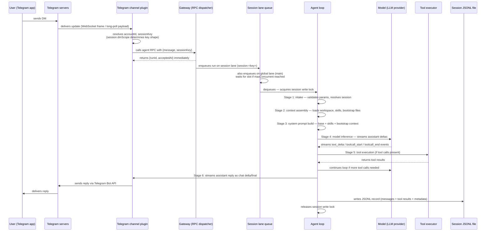

**TL;DR** — These three walkthroughs trace an OpenClaw message from first byte to final JSONL write. Walkthrough A follows a Telegram DM through the Gateway, into the session lane queue, through the six-stage agent loop, and back out as a streaming reply. Walkthrough B follows a cron interval as it opens an isolated session, runs the agent loop, and closes cleanly. Walkthrough C shows how one agent spawns a subagent using `sessions_spawn`, how the subagent runs in the global `subagent` lane, and how its result is returned to the parent. After reading this chapter you will be able to trace any live run through the system and identify where it is stuck.

# End-to-End Walkthroughs: DM Conversation, Cron Run, and Subagent Coordination

Let's trace OpenClaw's inner workings by following three concrete scenarios from start to finish. Think of it as reading a time-stamped log entry: we narrate every component the data passes through and name every structure that moves between them.

Before the walkthroughs begin, here are the five concepts each one builds on. If you have not read those chapters yet, the two-sentence recap below each link is enough context to follow along.

**The agent loop** (six stages) is the full execution cycle for one agent turn: intake → context assembly → model inference → tool execution → streaming replies → persistence. It is the subject of [Agent Loop](../agents/06-agent-loop.md).

**Sessions** are JSONL conversation records scoped to a channel/peer/account combination. The session key determines which history file a run reads from and writes to. Details are in [Sessions](../agents/07-sessions.md).

**The run queue** has two levels: a *session lane* (think of it like a single supermarket checkout lane — only one customer at a time) that serializes runs for the same session, and a *global lane* that caps concurrency across all sessions via `agents.defaults.maxConcurrent`. See [Run Queue](../agents/08-run-queue.md).

**Multi-agent routing and bindings** let a single Gateway host multiple isolated agents and route each inbound message to the right one by channel, account, and peer. See [Multi-Agent](../coordination/16-multi-agent.md).

**Cron** is the Gateway's built-in scheduler. It fires isolated agent turns on a schedule and tracks run history in SQLite. See [Automation](../automation/17-automation.md).

---

## Walkthrough A — Standard DM Conversation

### The scenario

A user sends a Telegram DM to the bot. The agent reads it, calls a tool, and streams a reply back. Every component the message touches is named below.

### The sequence



### Component-by-component narration

Let's walk through each component in the order the message touches it.

**1. Telegram channel plugin receives the update.**
Telegram delivers incoming messages to the bot either via a long-poll loop or a configured WebSocket-backed connection. Each update arrives as a structured payload — a WebSocket frame wrapping the Telegram Update object. The *Telegram channel plugin* (a bundled plugin loaded by the Gateway at startup) handles this transport, extracts the message text and sender identity, and resolves two things: the `accountId` (which registered bot token this update belongs to) and the `sessionKey` (the conversation bucket this message belongs to).

The session key shape depends on `session.dmScope`. With the default `main` setting, all DMs share `agent:main:main`. With `per-channel-peer`, the key becomes something like `agent:main:telegram:direct:123456789`. The session key is the address of the JSONL transcript on disk.

<!-- GAP: the exact per-account-channel-peer session key format (four-segment variant with accountId) is not illustrated in these walkthroughs; only the per-channel-peer two-segment variant is shown above -->

**2. The `agent` RPC is called, and returns `{runId, acceptedAt}` immediately.**
The channel plugin calls the Gateway's `agent` RPC with the message text, session key, and account context. Crucially, the RPC *returns immediately* — it does not wait for the agent to finish. The caller receives `{ runId, acceptedAt }`: `runId` is a stable identifier for this run that a caller can use with `agent.wait` to block until a terminal lifecycle event; `acceptedAt` is the UTC timestamp the run was accepted into the queue.

This non-blocking return means the channel plugin can continue receiving more Telegram updates without being blocked by a slow model response.

**3. The session lane queue serializes the run.**
The queuing system is a lane-aware FIFO queue. Each run is first enqueued on the per-session lane (`session:<key>`) which guarantees only one active run touches this session at a time. It is then also placed on the global lane (`main` by default), which caps total concurrent agent runs across the whole Gateway via `agents.defaults.maxConcurrent` (default 4 for the main lane).

If a second DM arrives while this run is active, the queue mode determines what happens to that incoming message. The default is `steer`: the new message is injected into the active runtime turn rather than starting a second run. The other modes handle the incoming message differently — `followup` queues it as a normal sequential run after the active one finishes, `collect` accumulates multiple arriving messages and batches them into a single follow-on run, and `interrupt` cancels the active run and starts a fresh one immediately with the new message. All four modes are defined in depth in [Run Queue](../agents/08-run-queue.md).

**4. The session write lock is acquired and the agent loop begins.**
When the run reaches the front of the queue, OpenClaw acquires a session write lock on the transcript file. This lock is file-based and process-aware — it prevents a cron run, subagent, or a concurrent channel delivery from writing to the same transcript simultaneously. The lock has a default acquire timeout of 60 000 ms; if it cannot be acquired within that window, the session is reported as busy.

**5. The six-stage agent loop executes.**
With the lock held, the loop runs its six stages:

| Stage | What happens |
|---|---|
| Intake | Validates run params; resolves session id, model, and auth profile |
| Context assembly | Loads workspace files, skills snapshot, bootstrap and context files |
| System prompt build | Assembles base prompt + skills prompt + bootstrap context + per-run overrides |
| Model inference | Sends assembled context to the LLM provider; streams `text_delta`, `toolcall_start`, `toolcall_end` events |
| Tool execution | For each tool call, invokes the tool and captures the result; loops back to model inference if more calls follow |
| Reply and persistence | Assembles final payloads, streams the reply to the channel, writes the JSONL transcript, releases the write lock |

**6. The JSONL record is written.**
After the reply is streamed, the session write lock is still held. OpenClaw writes all new messages (user turn, assistant turns, tool calls, tool results) as JSONL records to the session's transcript file at `~/.openclaw/agents/<agentId>/sessions/<sessionId>.jsonl`. The lock is then released and the run is removed from the queue, allowing the next queued run — or a fresh incoming message — to proceed.

### The one step most likely to fail: Step 2 — the `agent` RPC

The `agent` RPC validates parameters before accepting the run. If the session key resolves to a session whose write lock is already held by another process (e.g., a cron run that started at the same moment), the run enters the queue but the lock acquisition at step 4 will wait up to 60 seconds. If it cannot acquire the lock in that window, the run is rejected as "session busy."

More commonly, step 4 fails if the model call itself stalls. The agent loop's runtime timeout (`agents.defaults.timeoutSeconds`, default 172 800 s / 48 h) is very long, but the *model idle watchdog* (which aborts a model request when no response chunks arrive) defaults to 120 s. A provider that goes silent mid-stream will trigger this watchdog, producing a lifecycle `error` event and a fallback error reply to the user.

---

## Walkthrough B — Cron-Scheduled Run

### The scenario

A cron job fires on an `every` schedule. Notice that this run is completely self-contained — it opens a fresh isolated session, runs the agent loop with a prompt such as "Write today's summary to MEMORY.md", and the agent uses the `memory_get` / memory tools to read existing memory and write an updated summary. The session closes when the turn completes.

### The sequence

```mermaid
sequenceDiagram
    participant SCHED as Cron scheduler (in-process)
    participant SVC as Cron service
    participant ISO as Isolated-agent runner
    participant Q as Global cron lane (cron-nested)
    participant AL as Agent loop
    participant M as Model (LLM provider)
    participant TE as Tool executor (memory tools)
    participant MEM as MEMORY.md (agent workspace)
    participant FS as Cron session JSONL (cron:<jobId>)
    participant LOG as SQLite run log

    SCHED->>SVC: interval fires — job is due
    SVC->>ISO: launches runCronIsolatedAgentTurn(job)
    ISO->>Q: enqueues on cron lane (outer) + cron-nested lane (inner)
    Q->>AL: dequeues — acquires session write lock on cron:<jobId> session
    AL->>AL: resolves model, auth, workspace for target agentId
    AL->>AL: builds system prompt (cron context injected)
    AL->>M: sends prompt: "Write today's summary to MEMORY.md"
    M-->>AL: streams tool call: memory_get(key="MEMORY.md")
    AL->>TE: executes memory_get
    TE-->>MEM: reads existing MEMORY.md contents
    MEM-->>TE: returns file contents
    TE-->>AL: tool result
    AL->>M: continues inference with memory contents
    M-->>AL: streams tool call: write / memory tool to update MEMORY.md
    AL->>TE: executes write / memory update
    TE-->>MEM: writes updated MEMORY.md
    TE-->>AL: tool result
    AL->>M: final inference pass
    M-->>AL: final assistant text
    AL->>FS: writes JSONL turn record to cron session file
    AL->>LOG: SVC records run outcome (ok/error) in SQLite
    ISO->>ISO: session closed; best-effort browser cleanup
    SVC->>SVC: schedules next run (next interval)
```

### Component-by-component narration

**1. The cron scheduler fires.**
The cron service runs *inside the Gateway process* — there is no separate cron daemon. Job definitions, runtime state, and run history are persisted in OpenClaw's shared SQLite state database, so Gateway restarts do not lose schedules. When a job's next-fire time is reached, the scheduler passes the job to the isolated-agent runner (`runCronIsolatedAgentTurn`).

**2. The isolated-agent runner opens a fresh session.**
`sessionTarget: "isolated"` is the job-config field that tells the runner to open a brand-new session for every execution rather than appending to a persistent conversation. For each such run the runner creates a new session key of the form `cron:<jobId>`. "Fresh" here means a new transcript and session id for every execution — no ambient conversation context carries over from the previous cron run. This is what makes isolated jobs suitable for self-contained background tasks.

The runner places the run on the `cron` outer lane and the `cron-nested` inner lane. `maxConcurrentRuns` (default 8) limits how many cron jobs can be in the agent-runner phase at once. This separation from the `main` inbound-reply lane means cron runs and DM replies can proceed in parallel without blocking each other.

**3. The agent loop executes with cron context.**
The loop proceeds through its six stages as in Walkthrough A, but with several cron-specific behaviours:

- Bootstrap file injection is included unless `--light-context` was set on the job (`--light-context` tells the runner to assemble a reduced context — skipping the heavier workspace and bootstrap files — so the cron run starts faster and uses fewer tokens).
- The cron service starts its own timeout timer. When `timeoutSeconds` is reached, cron aborts the underlying agent run and gives it a short cleanup window. If the run does not drain, the Gateway force-clears that run's session ownership so queued chat work is not blocked behind a stale processing session.
- Isolated cron runs receive a narrow self-cleanup grant: the agent can read scheduler status, the current job's own run history, and its session state — but it cannot create, edit, or remove other cron jobs.

**4. The agent reads and writes `MEMORY.md` via memory tools.**
Within the tool execution stage, the model calls the memory tools (such as `memory_get`) to read the existing `MEMORY.md` in the agent workspace, then calls a write or memory-update tool to persist the new summary. The memory plugin installed in the Gateway's exclusive memory slot handles these calls. Tool start, update, and end events are emitted on the `tool` stream; tool results are sanitized for size before being written to the JSONL transcript.

**5. The session closes and the run is recorded.**
After the final assistant turn, the session write lock is released, the JSONL record is written to the cron session file, and the cron service records the run outcome (`ok`, `error`, or `skipped`) in the SQLite run log. The scheduler then arms the next timer for the following interval.

### The one step most likely to fail: Step 3 — the model call inside the cron timeout

Cron jobs are subject to two independent timeout watchdogs that can race each other. The outer cron `timeoutSeconds` aborts the whole run when the scheduled deadline is hit. The inner model idle watchdog aborts a model request when no response chunks arrive. If a model provider is slow (e.g., a local Ollama instance), the idle watchdog can fire before the cron timeout, producing a run-level error that triggers failure notification and increments the error backoff counter.

In addition, if the isolated run begins before the model provider is ready (e.g., Ollama is not running), the cron preflight check records the run as `skipped` with a clear provider/model error rather than starting a model call. `openclaw cron runs --id <jobId>` will show the skip reason; `openclaw cron show <jobId>` shows the resolved delivery route.

---

## Walkthrough C — Subagent Coordination

### The scenario

Let's trace what happens when one agent delegates work to another. Agent B receives a Telegram message via a binding. During the tool execution stage of its agent loop, Agent B calls `sessions_spawn` to delegate work to Agent C. Agent C runs as a subagent in the global `subagent` lane, completes its task, and announces its result back to Agent B's session. Agent B synthesizes the result and replies to the user.

<!-- GAP: commission references a 'goal' tool; sources document sessions_spawn/subagents only — there is no 'goal' tool in the codebase -->

### The sequence

```mermaid
sequenceDiagram
    participant U as User (Telegram)
    participant TCP as Telegram channel plugin
    participant BIND as Binding resolver
    participant AL_B as Agent B — agent loop
    participant M_B as Model (Agent B)
    participant TE_B as Tool executor (Agent B)
    participant SPAWN as sessions_spawn handler
    participant Q_C as Global subagent lane
    participant AL_C as Agent C — agent loop
    participant M_C as Model (Agent C)
    participant FS_C as Agent C session JSONL<br/>(agent:B:subagent:<uuid>)
    participant ANN as Announce step
    participant AL_B2 as Agent B — resumes

    U->>TCP: sends Telegram DM
    TCP->>BIND: resolves binding → agentId = B
    BIND->>AL_B: routes to Agent B session lane
    AL_B->>M_B: inference — model decides to spawn subagent
    M_B-->>AL_B: tool call: sessions_spawn(task="...", agentId="C")
    AL_B->>TE_B: executes sessions_spawn
    TE_B->>SPAWN: validates policy, resolves agentId C
    SPAWN-->>TE_B: returns {status:"accepted", runId, childSessionKey}<br/>immediately (non-blocking)
    TE_B-->>AL_B: tool result with runId + childSessionKey
    AL_B->>M_B: tool call: sessions_yield (ends current turn, waits for events)
    Note over AL_B,M_B: Agent B turn ends; session lane releases for other messages
    SPAWN->>Q_C: enqueues Agent C on subagent lane
    Q_C->>AL_C: dequeues — acquires write lock on child session
    AL_C->>AL_C: loads Agent C workspace + bootstrap (AGENTS.md + TOOLS.md only)
    AL_C->>M_C: inference with delegated task prompt
    M_C-->>AL_C: assistant reply
    AL_C->>FS_C: writes JSONL to child session file
    AL_C->>ANN: announce step (inside child session)
    ANN->>AL_B2: delivers completion event to Agent B requester session
    Note over ANN,AL_B2: push-based delivery — not a poll
    AL_B2->>M_B: resumes Agent B turn with child result
    M_B-->>AL_B2: final assistant reply
    AL_B2->>TCP: streams reply to Telegram
    TCP->>U: delivers reply
```

### Component-by-component narration

**1. The binding routes the message to Agent B.**
When the Telegram channel plugin receives the update, it passes it to the binding resolver. Bindings are evaluated in specificity order (peer match → accountId match → channel-wide match → default agent). The first binding whose `match` fields all satisfy the inbound message wins. The winning binding's `agentId` determines which agent's session lane the run enters.

**2. Agent B's loop reaches the tool execution stage and calls `sessions_spawn`.**
During model inference, Agent B's model decides to delegate work to Agent C and emits a tool call for `sessions_spawn` with at minimum a `task` string (the delegated prompt) and an `agentId` of `"C"`. The `sessions_spawn` handler checks:

- Whether Agent C's `agentId` is in Agent B's `subagents.allowAgents` list.
- Whether the sandbox policy permits spawning an unsandboxed child from a sandboxed parent.
- Whether Agent B is already at `maxChildrenPerAgent` (default 5) active children.

If these checks pass, `sessions_spawn` returns `{ status: "accepted", runId, childSessionKey }` **immediately** without waiting for Agent C to finish. The child session key takes the form `agent:<agentId>:subagent:<uuid>`.

**3. Agent B calls `sessions_yield` and its turn ends.**
Because Agent B cannot produce its final answer until Agent C finishes, it calls `sessions_yield` — the waiting primitive. This ends Agent B's current model turn and releases the session lane, allowing other messages to Agent B to be processed. Agent B will resume when the completion event arrives.

**4. Agent C runs in the `subagent` lane.**
The `subagent` lane is a dedicated global lane with a default concurrency cap of 8 (`agents.defaults.subagents.maxConcurrent`). Agent C's loop runs its six stages using the child session key and Agent C's own workspace. Importantly, Agent C's bootstrap context is narrowed: only `AGENTS.md` and `TOOLS.md` are injected — `SOUL.md`, `IDENTITY.md`, `USER.md`, `MEMORY.md`, `HEARTBEAT.md`, and `BOOTSTRAP.md` are not. Bootstrap files are the per-agent context files injected into the system prompt at run time; a full list and what each one contributes is in [System Prompt](../agents/09-system-prompt.md) and [Agents](../agents/05-agents.md). Agent C also does not receive the `message` tool or session tools by default — it cannot itself spawn subagents unless `maxSpawnDepth >= 2` (`maxSpawnDepth` is the config limit on how many levels deep subagent-spawning can nest; at depth 1, only the top-level agent may spawn children).

After completing its task, Agent C writes its JSONL transcript to the child session file and enters the *announce step*.

**5. The announce step delivers Agent C's result to Agent B.**
The announce step runs inside Agent C's session (not Agent B's). It collects:

| Field | Content |
|---|---|
| Source | `subagent` |
| Session ids | Child session key and session id |
| Status | Derived from runtime outcome: `completed`, `failed`, `timed out`, or `unknown` |
| Result | Latest visible assistant text from Agent C |
| Follow-up | Instruction on whether to reply to the user or stay silent |

For nested (non-top-level) requester sessions like Agent B, OpenClaw injects the completion as an internal follow-up — not an external chat message — so Agent B can synthesize the result in-session. This delivery is *push-based*: Agent C announces once when done; Agent B does not poll `/subagents list` or `sessions_history` in a loop.

**6. Agent B resumes and replies.**
Agent B's session receives the completion event as the next model-visible message. It resumes inference with Agent C's result, assembles the final reply, and streams it back to the Telegram channel.

### The one step most likely to fail: Step 5 — the announce delivery

Sub-agent announce is *best-effort*. If the Gateway restarts between Agent C finishing and the announce being delivered, pending announce work is lost. The agent will not receive a completion event, and Agent B's turn — which ended with `sessions_yield` — may sit idle until a manual interaction resumes it.

A subtler failure: if Agent B's requester session is no longer active when the announce arrives (e.g., because Agent B itself timed out or was stopped), OpenClaw tries a fallback to Agent B's requester route. If that also fails, the announce is retried with short exponential backoff before a final give-up. To diagnose, use `openclaw status` and `/subagents info <id>` from Agent B's session to inspect the child's `status`, `endedAt`, and transcript path.

---

## Cross-Walkthrough Reference

Now that we've traced all three paths, it helps to see them side-by-side. The table below summarises the key differences so you can quickly locate which pattern applies to a scenario you are debugging.

| Property | Walkthrough A: DM | Walkthrough B: Cron | Walkthrough C: Subagent |
|---|---|---|---|
| Entry point | Telegram channel plugin → `agent` RPC | Cron scheduler → `runCronIsolatedAgentTurn` | `sessions_spawn` tool call inside Agent B |
| Session key shape | `agent:<id>:<dmScope-derived>` | `cron:<jobId>` (per run) | `agent:<id>:subagent:<uuid>` |
| Queue lane | Session lane + `main` global lane | `cron` outer + `cron-nested` inner | `subagent` lane |
| Immediate return | `{runId, acceptedAt}` | n/a — fire-and-forget | `{status:"accepted", runId, childSessionKey}` |
| Bootstrap files | Full workspace context | Full (unless `--light-context`) | `AGENTS.md` + `TOOLS.md` only |
| Completion delivery | Streaming reply via channel plugin | Announce / webhook / none | Push announce to parent session |
| Transcript | `<sessionId>.jsonl` in agent sessions dir | `cron:<jobId>.jsonl` (cron session) | Child session JSONL in agent sessions dir |
| Most likely failure | Session write lock contention / model idle timeout | Model call inside cron timeout | Announce delivery after Gateway restart |

## Diagnosing a stuck run

When a run appears stuck, we work through this ladder. Each command targets a different layer of the system — start at step 1 and stop when you find the culprit:

```bash
# 1. Is the Gateway and cron service alive?
openclaw status
openclaw gateway status
openclaw cron status

# 2. What sessions are currently processing?
openclaw sessions --json --active 5

# 3. For a stuck DM — what is in the queue?
openclaw logs --follow     # look for "queued for ...ms" lines

# 4. For a stuck cron run — inspect run history
openclaw cron runs --id <jobId> --limit 10

# 5. For a stuck subagent — inspect child status from the parent session
# /subagents list
# /subagents info <id|#>

# 6. Run the health check
openclaw doctor
```

If you see `session.stalled` in diagnostic output, that means an active run has produced no reply, tool, status, or block progress recently. If you see `session.stuck`, that is a recoverable stale session bookkeeping entry — the Gateway will release the lane automatically once recovery gates pass.

---

← Previous: [Deployment and Lifecycle: Install, Daemon Setup, Docker, and Hosted Options](./23-deployment.md) · Next: [Design Decisions and Tradeoffs: SQLite, Exclusive Memory Slot, Loopback, In-Process Plugins](./25-design-decisions.md) →
